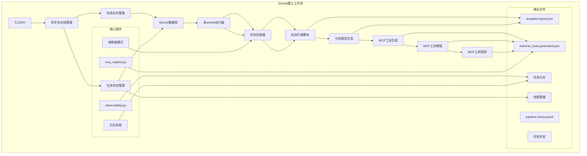
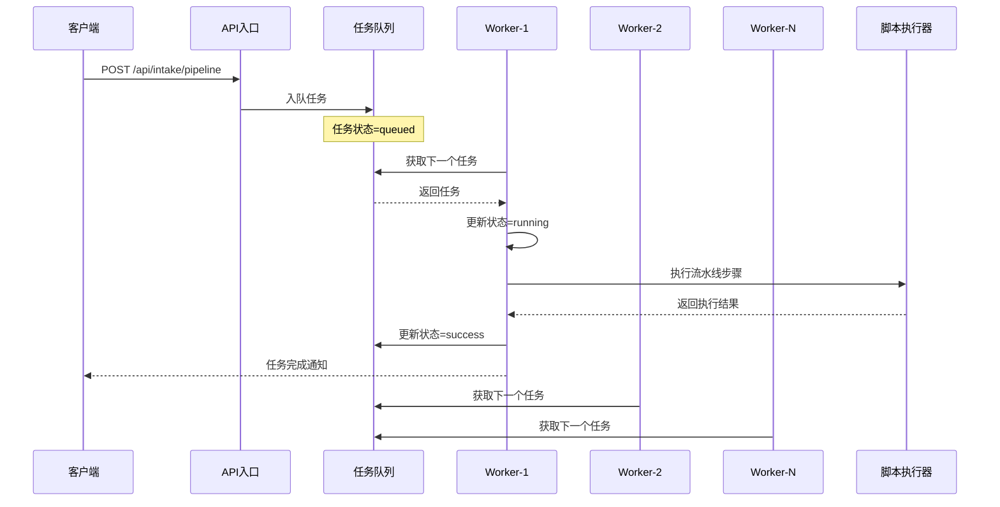
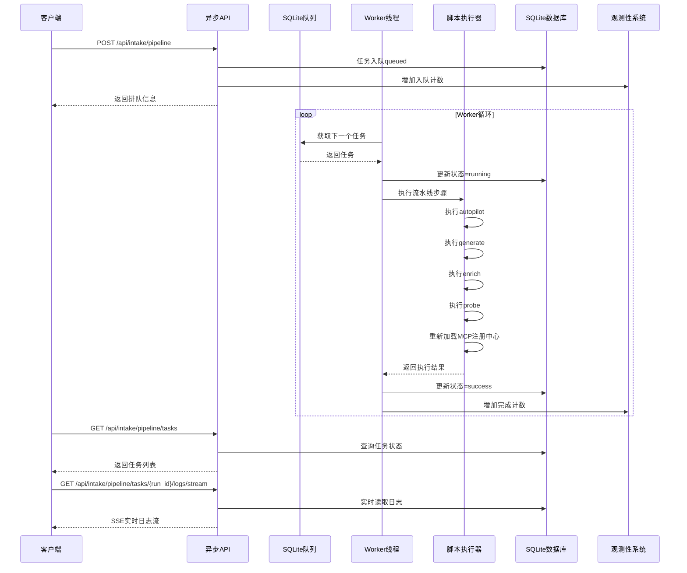
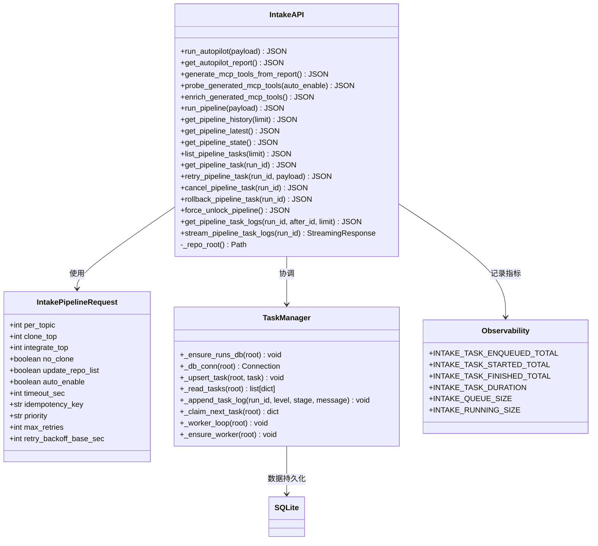
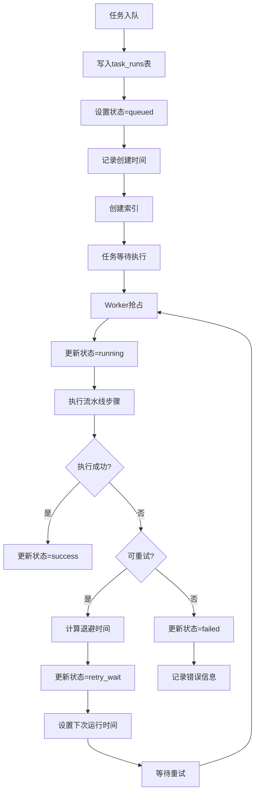
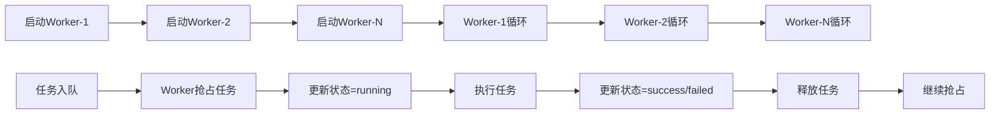
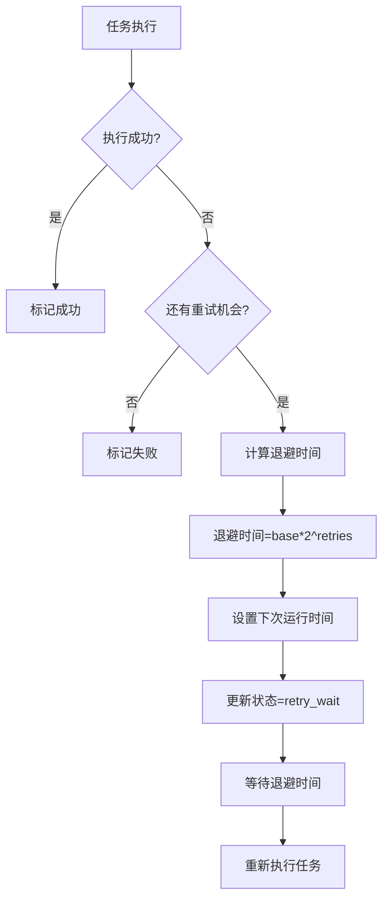
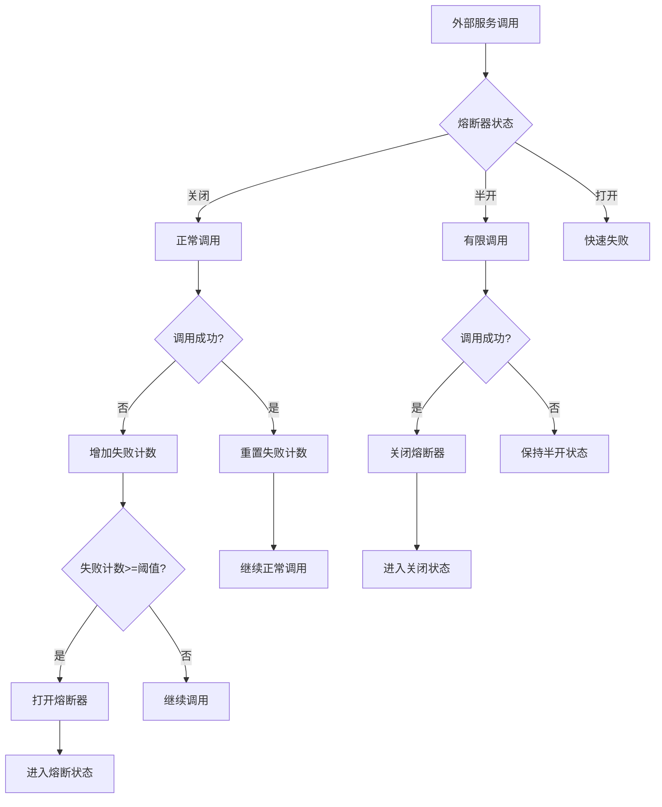
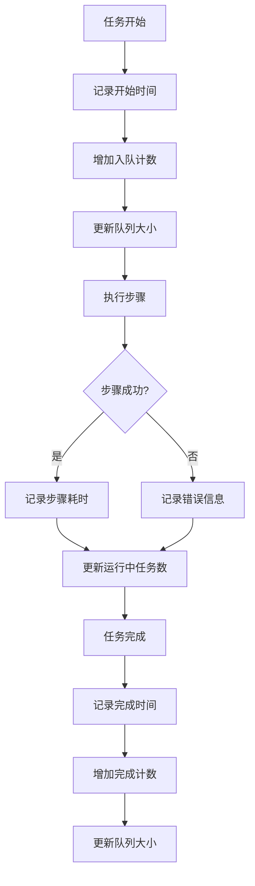
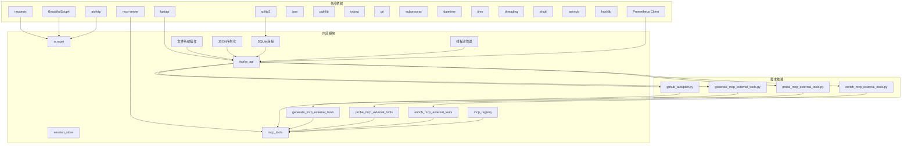

# GitHub摄入工作流

<cite>
**本文档引用的文件**
- [backend/main.py](file://backend/main.py)
- [backend/app/api/intake.py](file://backend/app/api/intake.py)
- [backend/app/core/observability.py](file://backend/app/core/observability.py)
- [backend/app/services/mcp_registry.py](file://backend/app/services/mcp_registry.py)
- [scripts/github_autopilot.py](file://scripts/github_autopilot.py)
- [scripts/generate_mcp_external_tools.py](file://scripts/generate_mcp_external_tools.py)
- [scripts/probe_mcp_external_tools.py](file://scripts/probe_mcp_external_tools.py)
- [scripts/enrich_mcp_external_tools.py](file://scripts/enrich_mcp_external_tools.py)
- [backend/app/mcp/tools.py](file://backend/app/mcp/tools.py)
- [backend/app/mcp/external_tools.json](file://backend/app/mcp/external_tools.json)
- [backend/app/mcp/external_tools.generated.json](file://backend/app/mcp/external_tools.generated.json)
- [backend/app/services/session_store.py](file://backend/app/services/session_store.py)
- [backend/app/core/runtime.py](file://backend/app/core/runtime.py)
- [docs/github-intake/README.md](file://docs/github-intake/README.md)
- [docs/github-intake/AUTOPILOT.md](file://docs/github-intake/AUTOPILOT.md)
- [docs/github-intake/autopilot-report.md](file://docs/github-intake/autopilot-report.md)
- [docs/github-intake/repos.txt](file://docs/github-intake/repos.txt)
- [docs/github-intake/pipeline-history.jsonl](file://docs/github-intake/pipeline-history.jsonl)
- [backend/scraper.py](file://backend/scraper.py)
</cite>

## 更新摘要
**变更内容**
- 新增完整的异步流水线任务管理系统，支持SQLite数据库持久化
- 新增多worker并发执行能力，支持高并发流水线处理
- 新增优先级调度机制，支持高、正常、低三种优先级
- 新增指数退避重试机制，提升系统可靠性
- 新增熔断器模式，防止级联故障传播
- 新增完整的可观测性指标，包括Prometheus指标和实时日志流
- 新增任务生命周期管理，从入队到完成的完整跟踪
- 新增幂等性控制，防止重复执行相同任务
- 新增任务取消和回滚机制，支持任务中断和状态恢复

## 目录
1. [简介](#简介)
2. [项目结构](#项目结构)
3. [核心组件](#核心组件)
4. [架构概览](#架构概览)
5. [详细组件分析](#详细组件分析)
6. [依赖分析](#依赖分析)
7. [性能考虑](#性能考虑)
8. [故障排除指南](#故障排除指南)
9. [结论](#结论)

## 简介

GitHub摄入工作流是一个自动化的工作流，旨在帮助教务系统AI助手项目从GitHub上收集、分析和整合优秀的开源项目，以实现"拿来主义"的开发理念。该工作流通过以下核心功能：

- **自动扫描和分析**：批量获取GitHub仓库信息，分析项目质量和适用性
- **智能筛选和排序**：基于项目需求自动搜索相关仓库，进行智能评分和排序
- **自动化集成**：生成可融入项目的建议报告和MCP工具模板
- **一键部署**：提供完整的自动化脚本，简化集成流程
- **完整流水线**：支持从扫描到工具启用的完整自动化流程
- **管道管理**：提供任务状态跟踪、快照管理和回滚机制
- **可观测性**：完整的执行历史记录和状态监控
- **异步执行**：支持后台任务队列和并发处理
- **可靠性保障**：指数退避重试和熔断器机制
- **任务控制**：支持任务取消、重试和回滚

**更新** 新增了完整的异步流水线任务管理系统，包括SQLite数据库持久化、多worker并发执行、优先级调度、指数退避重试机制、熔断器模式、完整的可观测性指标和任务生命周期管理，大幅提升了系统的可靠性、可扩展性和可观测性。

## 项目结构



**图表来源**
- [backend/app/api/intake.py:984-1049](file://backend/app/api/intake.py#L984-L1049)
- [backend/app/core/observability.py:42-72](file://backend/app/core/observability.py#L42-L72)
- [backend/app/services/mcp_registry.py:124-166](file://backend/app/services/mcp_registry.py#L124-L166)

**章节来源**
- [backend/main.py:1-122](file://backend/main.py#L1-L122)
- [docs/github-intake/README.md:1-23](file://docs/github-intake/README.md#L1-L23)

## 核心组件

### 1. 异步流水线管理组件

**新增** 异步流水线管理组件是整个工作流的核心，负责协调各个子组件的异步执行。

- `/api/intake/pipeline` - 入队流水线任务，支持优先级和幂等性控制
- `/api/intake/pipeline/state` - 获取流水线状态和统计信息
- `/api/intake/pipeline/tasks` - 列出用户的所有任务
- `/api/intake/pipeline/tasks/{run_id}` - 获取特定任务详情
- `/api/intake/pipeline/tasks/{run_id}/retry` - 重试失败任务
- `/api/intake/pipeline/tasks/{run_id}/cancel` - 取消进行中的任务
- `/api/intake/pipeline/tasks/{run_id}/rollback` - 回滚到快照状态
- `/api/intake/pipeline/tasks/{run_id}/logs` - 获取任务日志
- `/api/intake/pipeline/tasks/{run_id}/logs/stream` - 实时日志流

这些API端点通过异步任务队列处理，避免长时间阻塞请求，支持高并发场景。

**更新** 新增了完整的异步流水线管理功能，包括任务队列、状态跟踪、日志管理和实时监控。

### 2. SQLite任务管理系统

**新增** SQLite任务管理系统提供持久化的任务状态管理：

- 任务运行状态跟踪（queued、running、success、failed、cancelled、retry_wait）
- 任务参数持久化存储
- 任务日志记录和查询
- 任务生命周期管理
- 幂等性控制和重复任务检测

```mermaid
erDiagram
TASK_RUNS {
TEXT run_id PK
TEXT owner
TEXT created_at
TEXT updated_at
TEXT status
INTEGER priority
TEXT priority_label
TEXT next_run_at
TEXT idempotency_key
TEXT fingerprint
INTEGER retries
INTEGER max_retries
INTEGER retry_backoff_base_sec
INTEGER timeout_sec
INTEGER cancel_requested
TEXT cancel_requested_at
TEXT started_at
TEXT finished_at
TEXT cancelled_at
INTEGER duration_ms
INTEGER reload_count
TEXT error
TEXT last_error
TEXT snapshot
TEXT params_json
}
TASK_LOGS {
INTEGER id PK, AI
TEXT run_id FK
TEXT ts
TEXT level
TEXT stage
TEXT message
}
TASK_RUNS ||--o{ TASK_LOGS : "has"
```

**图表来源**
- [backend/app/api/intake.py:127-175](file://backend/app/api/intake.py#L127-L175)
- [backend/app/api/intake.py:162-172](file://backend/app/api/intake.py#L162-L172)

### 3. 多worker并发执行器

**新增** 多worker并发执行器支持高并发流水线处理：

- 动态worker数量管理（通过环境变量配置）
- 任务抢占式调度
- 线程安全的任务分配
- worker健康监控和自愈



**图表来源**
- [backend/app/api/intake.py:652-699](file://backend/app/api/intake.py#L652-L699)
- [backend/app/api/intake.py:984-1049](file://backend/app/api/intake.py#L984-L1049)

### 4. 优先级调度系统

**新增** 优先级调度系统支持任务优先级控制：

- 高优先级（high）：立即执行，优先于其他任务
- 正常优先级（normal）：按创建时间顺序执行
- 低优先级（low）：最后执行

调度算法考虑以下因素：
- 优先级权重（high: 3, normal: 2, low: 1）
- 下次运行时间（next_run_at）
- 任务创建时间
- 任务状态

### 5. 指数退避重试机制

**新增** 指数退避重试机制提升系统可靠性：

- 最大重试次数配置
- 基础退避时间（默认5秒）
- 指数增长：第n次重试 = base × 2^(n-1)
- 最大退避时间限制
- 重试状态跟踪和日志记录

### 6. 熔断器模式

**新增** 熔断器模式防止级联故障：

- 对失败的外部服务进行熔断
- 熔断时间窗口（默认60秒）
- 失败计数阈值（默认3次）
- 自动恢复机制
- 熔断状态监控

### 7. 完整可观测性系统

**新增** 完整可观测性系统提供全面的监控：

- Prometheus指标：任务入队、开始、完成、队列大小、运行中任务数
- 任务日志系统：按任务分类的日志记录
- 实时日志流：SSE实时事件流
- 任务状态监控：队列长度、运行中任务数、worker状态
- 错误追踪：详细的错误信息和堆栈跟踪

### 8. 任务生命周期管理

**新增** 任务生命周期管理覆盖任务的完整生命周期：

- 入队（queued）：任务创建并等待执行
- 抢占（claimed）：worker获取任务但尚未开始
- 运行中（running）：任务正在执行
- 成功（success）：任务执行完成
- 失败（failed）：任务执行失败
- 取消（cancelled）：用户主动取消任务
- 重试等待（retry_wait）：等待下次重试时间

### 9. 幂等性控制

**新增** 平等性控制防止重复执行：

- 基于负载指纹的重复检测
- 基于幂等性密钥的重复检测
- 时间窗口内的重复任务过滤
- 重复任务状态返回

### 10. 任务取消和回滚机制

**新增** 任务取消和回滚机制提供任务控制：

- 任务取消请求和执行
- 进程终止支持
- 文件快照回滚
- 状态恢复机制

**章节来源**
- [backend/app/api/intake.py:121-175](file://backend/app/api/intake.py#L121-L175)
- [backend/app/api/intake.py:652-699](file://backend/app/api/intake.py#L652-L699)
- [backend/app/api/intake.py:595-618](file://backend/app/api/intake.py#L595-L618)
- [backend/app/api/intake.py:708-754](file://backend/app/api/intake.py#L708-L754)
- [backend/app/api/intake.py:1137-1189](file://backend/app/api/intake.py#L1137-L1189)

## 架构概览



**图表来源**
- [backend/app/api/intake.py:984-1049](file://backend/app/api/intake.py#L984-L1049)
- [backend/app/api/intake.py:652-699](file://backend/app/api/intake.py#L652-L699)
- [backend/app/api/intake.py:1204-1232](file://backend/app/api/intake.py#L1204-L1232)

该架构采用异步设计，通过SQLite数据库实现持久化状态管理，通过多worker线程实现并发执行，通过熔断器模式和指数退避重试机制提升系统可靠性。

## 详细组件分析

### 异步API路由组件

异步API路由组件是整个工作流的入口点，负责协调各个子组件的异步执行。



**图表来源**
- [backend/app/api/intake.py:20-86](file://backend/app/api/intake.py#L20-L86)
- [backend/app/api/intake.py:121-182](file://backend/app/api/intake.py#L121-L182)
- [backend/app/core/observability.py:42-72](file://backend/app/core/observability.py#L42-L72)

该组件提供了完整的异步任务管理机制，包括任务入队、状态跟踪、日志记录和实时监控。

**更新** 新增了完整的异步任务管理功能，包括SQLite数据库持久化、多worker并发执行、优先级调度和指数退避重试机制。

**章节来源**
- [backend/app/api/intake.py:1-1233](file://backend/app/api/intake.py#L1-L1233)

### SQLite任务管理器

**新增** SQLite任务管理器提供完整的任务状态持久化：



**图表来源**
- [backend/app/api/intake.py:261-315](file://backend/app/api/intake.py#L261-L315)
- [backend/app/api/intake.py:595-618](file://backend/app/api/intake.py#L595-L618)

### 多worker执行器

**新增** 多worker执行器支持并发任务处理：



**图表来源**
- [backend/app/api/intake.py:652-699](file://backend/app/api/intake.py#L652-L699)
- [backend/app/api/intake.py:344-366](file://backend/app/api/intake.py#L344-L366)

### 指数退避重试机制

**新增** 指数退避重试机制提升系统可靠性：



**图表来源**
- [backend/app/api/intake.py:595-618](file://backend/app/api/intake.py#L595-L618)

### 熔断器模式

**新增** 熔断器模式防止级联故障：



**图表来源**
- [backend/app/api/intake.py:708-754](file://backend/app/api/intake.py#L708-L754)

### 完整可观测性系统

**新增** 完整可观测性系统提供全面监控：



**图表来源**
- [backend/app/core/observability.py:42-72](file://backend/app/core/observability.py#L42-L72)
- [backend/app/api/intake.py:526-560](file://backend/app/api/intake.py#L526-L560)

**章节来源**
- [backend/app/api/intake.py:121-182](file://backend/app/api/intake.py#L121-L182)
- [backend/app/api/intake.py:652-699](file://backend/app/api/intake.py#L652-L699)
- [backend/app/api/intake.py:595-618](file://backend/app/api/intake.py#L595-L618)
- [backend/app/api/intake.py:708-754](file://backend/app/api/intake.py#L708-L754)
- [backend/app/core/observability.py:42-72](file://backend/app/core/observability.py#L42-L72)

## 依赖分析



**图表来源**
- [backend/app/api/intake.py:6-23](file://backend/app/api/intake.py#L6-L23)
- [scripts/github_autopilot.py:13-25](file://scripts/github_autopilot.py#L13-L25)
- [scripts/generate_mcp_external_tools.py:7-12](file://scripts/generate_mcp_external_tools.py#L7-L12)
- [scripts/probe_mcp_external_tools.py:8-13](file://scripts/probe_mcp_external_tools.py#L8-L13)
- [scripts/enrich_mcp_external_tools.py:8-11](file://scripts/enrich_mcp_external_tools.py#L8-L11)

该工作流展现了良好的模块化设计，各个组件之间的耦合度较低，便于独立开发和测试。

**更新** 新增了SQLite数据库、Prometheus监控、异步处理和线程管理等依赖，以及完整的可观测性系统。

**章节来源**
- [backend/app/core/runtime.py:1-28](file://backend/app/core/runtime.py#L1-L28)
- [backend/scraper.py:1-200](file://backend/scraper.py#L1-L200)

## 性能考虑

### 1. 异步任务队列优化

- **非阻塞I/O**：使用异步API避免长时间阻塞
- **任务批处理**：批量处理相似任务减少数据库压力
- **索引优化**：为常用查询字段建立索引
- **连接池管理**：SQLite连接的高效管理

### 2. 多worker并发优化

- **动态worker数量**：根据负载自动调整worker数量
- **任务预抢占**：提前抢占任务避免空闲
- **线程安全**：使用锁机制确保数据一致性
- **资源隔离**：每个worker独立的执行环境

### 3. SQLite数据库优化

- **事务批量提交**：批量操作减少磁盘I/O
- **索引策略**：为高频查询建立合适索引
- **连接复用**：避免频繁创建数据库连接
- **内存配置**：优化SQLite内存使用

### 4. 指数退避重试优化

- **退避算法**：指数增长避免雪崩效应
- **最大重试次数**：防止无限重试
- **超时控制**：避免重试占用过多资源
- **错误分类**：区分可重试和不可重试错误

### 5. 熔断器优化

- **失败检测**：准确识别服务故障
- **恢复策略**：渐进式恢复机制
- **状态监控**：实时监控熔断器状态
- **配置管理**：灵活的熔断器参数配置

### 6. 观测性系统优化

- **指标聚合**：批量上报监控指标
- **日志轮转**：避免日志文件过大
- **实时流处理**：高效的SSE事件流
- **内存缓存**：缓存热点数据减少查询

### 7. 任务生命周期优化

- **状态机设计**：清晰的状态转换逻辑
- **幂等性保证**：防止重复执行
- **快照管理**：高效的快照创建和恢复
- **取消机制**：优雅的任务取消

### 8. 网络传输优化

- **深度克隆**：使用`--depth 1`参数进行浅克隆
- **超时控制**：为所有网络请求设置合理的超时时间
- **错误重试**：对临时性网络错误进行自动重试
- **熔断器**：防止级联故障传播

### 9. 内存管理

- **流式处理**：大文件处理采用流式读取，避免内存溢出
- **及时释放**：处理完数据后及时释放内存资源
- **进程隔离**：通过子进程隔离不同阶段的任务
- **缓存策略**：合理使用缓存避免重复计算

### 10. 工具生成优化

**新增** MCP工具生成过程的性能优化：
- **批量处理**：一次性生成多个工具定义，减少文件I/O操作
- **智能裁剪**：限制生成工具数量，避免过度膨胀
- **缓存机制**：复用已生成的报告数据，提高生成效率
- **异步执行**：工具生成过程异步执行，不阻塞主线程

### 11. 工具探测优化

**新增** MCP工具探测过程的性能优化：
- **并发探测**：并行检测多个HTTP工具的可达性
- **智能重试**：对探测失败的工具进行有限重试
- **超时控制**：为每个探测请求设置合理超时时间
- **熔断器**：防止探测失败影响整体性能

### 12. 流水线执行优化

**新增** 完整流水线执行的性能优化：
- **并行步骤**：在可能的情况下并行执行独立步骤
- **增量更新**：只更新发生变化的工具配置
- **缓存策略**：缓存探测和增强的结果，避免重复计算
- **状态锁优化**：使用原子操作确保管道状态一致性
- **资源池管理**：复用数据库连接和网络连接

### 13. 管道管理优化

**新增** 管道管理系统性能优化：
- **文件锁机制**：使用原子文件操作防止并发冲突
- **快照压缩**：只复制必要的文件到快照目录
- **增量任务更新**：只更新发生变化的任务状态
- **内存状态缓存**：缓存管道状态减少磁盘I/O
- **索引优化**：为高频查询建立合适的数据库索引

## 故障排除指南

### 常见问题及解决方案

#### 1. 任务队列阻塞

**症状**：任务长时间处于queued状态

**解决方案**：
- 检查worker线程是否正常运行
- 查看数据库连接状态
- 检查任务队列大小和索引
- 增加worker数量

#### 2. 任务执行失败

**症状**：任务执行过程中出现错误

**解决方案**：
- 查看任务日志获取详细错误信息
- 检查指数退避重试配置
- 验证外部服务可用性
- 检查熔断器状态

#### 3. 数据库连接问题

**症状**：SQLite数据库操作失败

**解决方案**：
- 检查数据库文件权限
- 验证数据库文件完整性
- 查看数据库连接池状态
- 重启数据库连接

#### 4. 熔断器误触发

**症状**：外部服务正常但被熔断

**解决方案**：
- 检查熔断器配置参数
- 查看失败计数和时间窗口
- 手动重置熔断器状态
- 调整熔断器阈值

#### 5. 观测性指标异常

**症状**：Prometheus指标显示异常

**解决方案**：
- 检查指标收集频率
- 验证指标标签完整性
- 查看指标存储状态
- 重启指标收集服务

#### 6. 实时日志流中断

**症状**：SSE日志流连接断开

**解决方案**：
- 检查网络连接稳定性
- 验证SSE服务器配置
- 查看日志文件权限
- 重启日志服务

#### 7. 任务取消无效

**症状**：任务取消请求无响应

**解决方案**：
- 检查任务状态是否已改变
- 验证进程终止权限
- 查看RUN_PROCS映射状态
- 手动终止相关进程

#### 8. 快照恢复失败

**症状**：快照恢复过程中出现错误

**解决方案**：
- 检查快照文件完整性
- 验证目标文件夹权限
- 查看文件路径映射
- 重新创建快照

#### 9. 多worker竞争冲突

**症状**：多个worker同时处理同一任务

**解决方案**：
- 检查数据库锁机制
- 验证任务抢占逻辑
- 查看线程同步状态
- 调整worker数量

#### 10. 指数退避重试异常

**症状**：重试机制工作异常

**解决方案**：
- 检查重试参数配置
- 验证退避时间计算
- 查看重试状态跟踪
- 手动重置任务状态

**章节来源**
- [backend/app/api/intake.py:708-754](file://backend/app/api/intake.py#L708-L754)
- [backend/app/api/intake.py:595-618](file://backend/app/api/intake.py#L595-L618)
- [backend/app/api/intake.py:1137-1189](file://backend/app/api/intake.py#L1137-L1189)

## 结论

GitHub摄入工作流经过重大重构后，已经从简单的脚本执行器演进为一个完整的异步流水线管理系统。通过引入SQLite任务管理系统、多worker并发执行、优先级调度、指数退避重试机制、熔断器模式和完整的可观测性系统，该工作流具备了以下显著优势：

1. **高可靠性**：通过指数退避重试和熔断器模式，系统能够在网络波动和服务故障时保持稳定运行
2. **高并发性**：多worker并发执行支持大量流水线任务的并行处理
3. **高可扩展性**：异步架构和数据库持久化支持系统的水平扩展
4. **高可观测性**：完整的监控指标和日志系统提供全面的系统状态洞察
5. **高可用性**：任务取消、重试和回滚机制确保系统在异常情况下能够优雅处理
6. **高效率**：优先级调度和幂等性控制提升系统整体执行效率

**更新** 新增的异步流水线任务管理系统大幅提升了系统的可靠性、可扩展性和可观测性。通过从117行的简单脚本重构为1233行的完整系统，该工作流现在能够支持复杂的生产环境需求，为教务系统AI助手项目提供强大而可靠的开源项目集成能力。

该工作流的设计充分体现了现代分布式系统的设计原则，通过合理的架构设计和完善的错误处理机制，为项目的持续发展和大规模应用奠定了坚实的基础。随着更多功能的完善和优化，该工作流将成为教务系统AI助手项目的重要基础设施，支持其向更高层次的智能化发展。