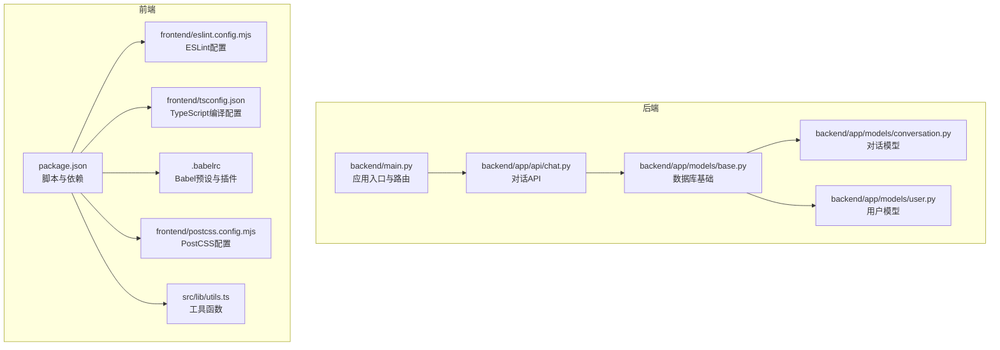
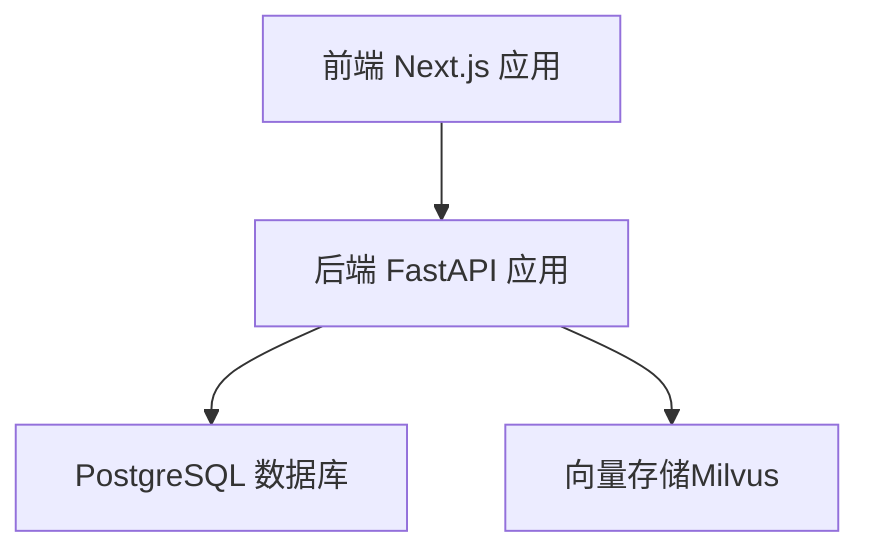
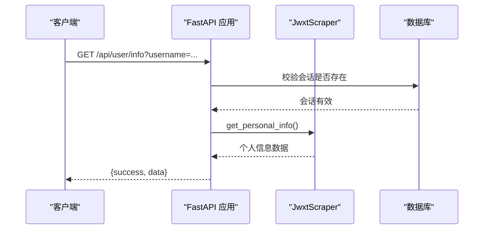
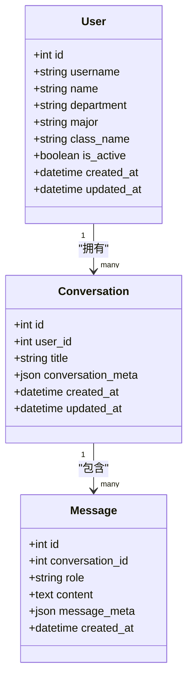
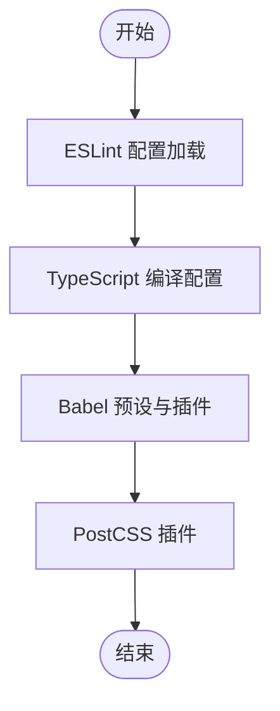
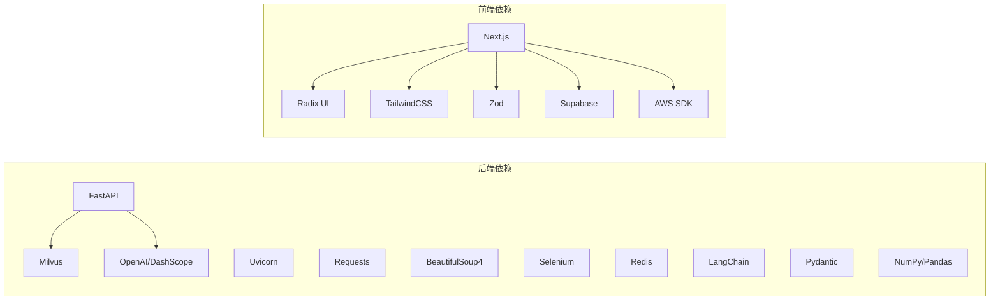

# 代码规范

<cite>
**本文引用的文件**
- [backend/main.py](file://backend/main.py)
- [backend/app/api/chat.py](file://backend/app/api/chat.py)
- [backend/app/models/base.py](file://backend/app/models/base.py)
- [backend/app/models/conversation.py](file://backend/app/models/conversation.py)
- [backend/app/models/user.py](file://backend/app/models/user.py)
- [backend/requirements.txt](file://backend/requirements.txt)
- [frontend/eslint.config.mjs](file://frontend/eslint.config.mjs)
- [frontend/tsconfig.json](file://frontend/tsconfig.json)
- [package.json](file://package.json)
- [.babelrc](file://.babelrc)
- [frontend/postcss.config.mjs](file://frontend/postcss.config.mjs)
- [src/lib/utils.ts](file://src/lib/utils.ts)
</cite>

## 目录
1. [简介](#简介)
2. [项目结构](#项目结构)
3. [核心组件](#核心组件)
4. [架构总览](#架构总览)
5. [详细组件分析](#详细组件分析)
6. [依赖分析](#依赖分析)
7. [性能考虑](#性能考虑)
8. [故障排查指南](#故障排查指南)
9. [结论](#结论)
10. [附录](#附录)

## 简介
本文件为“智能教务系统AI助手”项目的代码规范文档，覆盖后端Python与前端TypeScript两部分的编码风格、注释规范、配置最佳实践以及代码审查要点。目标是统一团队开发标准，提升代码一致性与可维护性。

## 项目结构
项目采用前后端分离架构：
- 后端：FastAPI应用，提供教务系统数据爬取与AI对话能力，数据库模型位于models目录，API路由位于api目录，服务层位于services目录。
- 前端：Next.js应用，TypeScript开发，TailwindCSS样式，组件基于Radix UI与自研UI库。

图表来源
- [backend/main.py:1-120](file://backend/main.py#L1-L120)
- [backend/app/api/chat.py:1-60](file://backend/app/api/chat.py#L1-L60)
- [backend/app/models/base.py:1-29](file://backend/app/models/base.py#L1-L29)
- [backend/app/models/conversation.py:1-42](file://backend/app/models/conversation.py#L1-L42)
- [backend/app/models/user.py:1-33](file://backend/app/models/user.py#L1-L33)
- [frontend/eslint.config.mjs:1-29](file://frontend/eslint.config.mjs#L1-L29)
- [frontend/tsconfig.json:1-35](file://frontend/tsconfig.json#L1-L35)
- [.babelrc:1-16](file://.babelrc#L1-L16)
- [frontend/postcss.config.mjs:1-8](file://frontend/postcss.config.mjs#L1-L8)
- [package.json:1-92](file://package.json#L1-L92)
- [src/lib/utils.ts:1-7](file://src/lib/utils.ts#L1-L7)

章节来源
- [backend/main.py:1-120](file://backend/main.py#L1-L120)
- [frontend/eslint.config.mjs:1-29](file://frontend/eslint.config.mjs#L1-L29)
- [frontend/tsconfig.json:1-35](file://frontend/tsconfig.json#L1-L35)
- [package.json:1-92](file://package.json#L1-L92)
- [.babelrc:1-16](file://.babelrc#L1-L16)
- [frontend/postcss.config.mjs:1-8](file://frontend/postcss.config.mjs#L1-L8)
- [src/lib/utils.ts:1-7](file://src/lib/utils.ts#L1-L7)

## 核心组件
- 后端应用入口与路由：集中注册CORS、健康检查、验证码、登录、数据查询与AI对话等接口。
- 对话API：基于Pydantic模型定义请求/响应，集成RAG检索与向量存储。
- 数据库模型：用户、对话、消息三层关系模型，使用SQLAlchemy ORM。
- 前端配置：ESLint遵循Next.js TypeScript配置，TypeScript严格模式，Babel使用Next预设，PostCSS集成Tailwind。

章节来源
- [backend/main.py:95-130](file://backend/main.py#L95-L130)
- [backend/app/api/chat.py:18-42](file://backend/app/api/chat.py#L18-L42)
- [backend/app/models/conversation.py:11-42](file://backend/app/models/conversation.py#L11-L42)
- [backend/app/models/user.py:11-33](file://backend/app/models/user.py#L11-L33)
- [frontend/eslint.config.mjs:1-29](file://frontend/eslint.config.mjs#L1-L29)
- [frontend/tsconfig.json:1-35](file://frontend/tsconfig.json#L1-L35)
- [.babelrc:1-16](file://.babelrc#L1-L16)
- [frontend/postcss.config.mjs:1-8](file://frontend/postcss.config.mjs#L1-L8)

## 架构总览
后端通过FastAPI提供REST接口，前端Next.js应用调用后端API；数据库使用PostgreSQL，对话与消息模型通过SQLAlchemy管理；AI对话功能结合RAG检索与向量存储。

图表来源
- [backend/main.py:39-79](file://backend/main.py#L39-L79)
- [backend/app/models/base.py:10-29](file://backend/app/models/base.py#L10-L29)
- [backend/requirements.txt:22-25](file://backend/requirements.txt#L22-L25)

章节来源
- [backend/main.py:39-79](file://backend/main.py#L39-L79)
- [backend/app/models/base.py:10-29](file://backend/app/models/base.py#L10-L29)
- [backend/requirements.txt:22-25](file://backend/requirements.txt#L22-L25)

## 详细组件分析

### 后端：FastAPI应用与路由
- 应用初始化：设置标题、版本、CORS策略、日志级别；注册Chat API路由（条件导入）。
- 根路径与健康检查：返回可用端点与文档链接。
- 验证码与登录：按学号选择服务器，生成验证码session并校验登录结果。
- 数据查询接口：个人信息、学籍卡片、成绩、课表、培养方案、学业进度、考试安排、教师/课程查询、选课与执行计划、全量数据聚合。
- 选项查询接口：院系、学期、课程、课表、成绩查询选项。

图表来源
- [backend/main.py:332-368](file://backend/main.py#L332-L368)
- [backend/main.py:350-352](file://backend/main.py#L350-L352)

章节来源
- [backend/main.py:39-79](file://backend/main.py#L39-L79)
- [backend/main.py:95-130](file://backend/main.py#L95-L130)
- [backend/main.py:135-190](file://backend/main.py#L135-L190)
- [backend/main.py:192-328](file://backend/main.py#L192-L328)
- [backend/main.py:332-368](file://backend/main.py#L332-L368)
- [backend/main.py:370-396](file://backend/main.py#L370-L396)
- [backend/main.py:398-453](file://backend/main.py#L398-L453)
- [backend/main.py:455-488](file://backend/main.py#L455-L488)
- [backend/main.py:490-517](file://backend/main.py#L490-L517)
- [backend/main.py:519-548](file://backend/main.py#L519-L548)
- [backend/main.py:550-580](file://backend/main.py#L550-L580)
- [backend/main.py:582-609](file://backend/main.py#L582-L609)
- [backend/main.py:611-639](file://backend/main.py#L611-L639)
- [backend/main.py:641-667](file://backend/main.py#L641-L667)
- [backend/main.py:669-696](file://backend/main.py#L669-L696)
- [backend/main.py:698-725](file://backend/main.py#L698-L725)
- [backend/main.py:729-771](file://backend/main.py#L729-L771)
- [backend/main.py:773-800](file://backend/main.py#L773-L800)

### 后端：对话API与数据模型
- 对话API：定义请求/响应模型，支持发送消息、获取对话列表、获取历史、删除对话；集成RAG检索与向量存储。
- 数据模型：用户、对话、消息三层关系，含JSON字段存储元数据，时间戳自动维护。

图表来源
- [backend/app/models/user.py:11-33](file://backend/app/models/user.py#L11-L33)
- [backend/app/models/conversation.py:11-42](file://backend/app/models/conversation.py#L11-L42)
- [backend/app/models/conversation.py:28-42](file://backend/app/models/conversation.py#L28-L42)

章节来源
- [backend/app/api/chat.py:18-42](file://backend/app/api/chat.py#L18-L42)
- [backend/app/api/chat.py:45-154](file://backend/app/api/chat.py#L45-L154)
- [backend/app/api/chat.py:156-224](file://backend/app/api/chat.py#L156-L224)
- [backend/app/models/user.py:11-33](file://backend/app/models/user.py#L11-L33)
- [backend/app/models/conversation.py:11-42](file://backend/app/models/conversation.py#L11-L42)

### 前端：ESLint、TypeScript、Babel与PostCSS配置
- ESLint：基于Next.js TypeScript配置，关闭特定React Hooks规则，覆盖默认忽略项以纳入服务端脚本与构建产物。
- TypeScript：严格模式、ES2017目标、模块解析bundler、路径别名@/*映射至src/*。
- Babel：使用Next预设与React开发插件，开启开发环境渲染调试。
- PostCSS：集成TailwindCSS插件。
- 依赖与脚本：Next开发/构建/启动命令、类型检查、引擎要求。

图表来源
- [frontend/eslint.config.mjs:1-29](file://frontend/eslint.config.mjs#L1-L29)
- [frontend/tsconfig.json:1-35](file://frontend/tsconfig.json#L1-L35)
- [.babelrc:1-16](file://.babelrc#L1-L16)
- [frontend/postcss.config.mjs:1-8](file://frontend/postcss.config.mjs#L1-L8)

章节来源
- [frontend/eslint.config.mjs:1-29](file://frontend/eslint.config.mjs#L1-L29)
- [frontend/tsconfig.json:1-35](file://frontend/tsconfig.json#L1-L35)
- [.babelrc:1-16](file://.babelrc#L1-L16)
- [frontend/postcss.config.mjs:1-8](file://frontend/postcss.config.mjs#L1-L8)
- [package.json:1-92](file://package.json#L1-L92)

## 依赖分析
- 后端依赖：FastAPI、Uvicorn、Requests、BeautifulSoup、Selenium、Redis、Milvus、LangChain、OpenAI/DashScope、Pydantic、NumPy/Pandas等。
- 前端依赖：Next、Radix UI组件、TailwindCSS、Zod、Supabase、AWS SDK等；开发依赖包含ESLint、TypeScript、TailwindCSS、TSUP等。

图表来源
- [backend/requirements.txt:1-44](file://backend/requirements.txt#L1-L44)
- [package.json:12-68](file://package.json#L12-L68)

章节来源
- [backend/requirements.txt:1-44](file://backend/requirements.txt#L1-L44)
- [package.json:12-68](file://package.json#L12-L68)

## 性能考虑
- 后端接口：对登录与数据查询增加超时控制与异常捕获，避免阻塞；验证码与登录绑定同一服务器，减少跨节点开销。
- 数据库：使用SQLAlchemy延迟加载与关系级联删除，避免N+1查询；对话历史限制最近若干条。
- 前端：严格模式与增量编译提升类型检查效率；Tailwind按需引入，避免打包冗余样式。

章节来源
- [backend/main.py:160-164](file://backend/main.py#L160-L164)
- [backend/app/api/chat.py:89-96](file://backend/app/api/chat.py#L89-L96)
- [frontend/tsconfig.json:7-15](file://frontend/tsconfig.json#L7-L15)
- [frontend/postcss.config.mjs:1-8](file://frontend/postcss.config.mjs#L1-L8)

## 故障排查指南
- 登录失败：检查验证码session是否过期、服务器选择逻辑、返回页面特征判断。
- 未登录访问受限接口：确认会话是否存在于内存字典中。
- 数据库连接：核对环境变量与连接URL，确保get_db依赖正确注入。
- AI对话异常：检查RAG检索与向量存储可用性，关注日志输出。

章节来源
- [backend/main.py:221-234](file://backend/main.py#L221-L234)
- [backend/main.py:342-346](file://backend/main.py#L342-L346)
- [backend/app/models/base.py:10-29](file://backend/app/models/base.py#L10-L29)
- [backend/app/api/chat.py:104-111](file://backend/app/api/chat.py#L104-L111)

## 结论
本规范文档总结了后端Python与前端TypeScript的编码风格、注释规范、配置最佳实践与质量检查要点。建议在团队内推广并持续演进，确保代码一致性与可维护性。

## 附录

### Python后端编码规范（PEP8与项目实践）
- 命名约定
  - 模块与包：小写、下划线分隔（如scraper.py、education_options.py）。
  - 函数与方法：小驼峰或下划线分隔，语义清晰（如select_server、get_user_info）。
  - 常量：全大写+下划线（如JWXT_BASE_URL、SERVERS）。
  - 类：帕斯卡命名（如JwxtScraper、EducationOptions）。
- 函数定义
  - 参数顺序：必填参数在前，可选参数在后；默认值使用None或合理缺省。
  - 异常处理：显式捕获HTTPException并抛出；其他异常统一包装为HTTPException。
  - 文档字符串：模块顶部与函数顶部使用三引号文档字符串，描述用途、参数、返回值与异常。
- 注释格式
  - 单行注释：使用#，空一格后书写，简明扼要。
  - 复杂逻辑：在段落前加注释说明上下文与目的。
- 代码组织
  - 导入分组：标准库、第三方库、本地模块，每组内部字母序排列。
  - 路由注册：集中于应用入口，按功能模块拆分API文件。
- 错误处理
  - 统一异常包装：对外仅暴露HTTPException，内部异常记录日志。
  - 健康检查：提供/health端点，便于运维监控。

章节来源
- [backend/main.py:1-14](file://backend/main.py#L1-L14)
- [backend/main.py:82-93](file://backend/main.py#L82-L93)
- [backend/main.py:332-368](file://backend/main.py#L332-L368)
- [backend/app/api/chat.py:18-42](file://backend/app/api/chat.py#L18-L42)

### TypeScript前端编码风格与类型声明
- 文件命名
  - 页面组件：page.tsx（如chat/page.tsx、login/page.tsx）。
  - UI组件：小驼峰命名（如button.tsx、dialog.tsx），置于components/ui目录。
- 接口与类型
  - 请求/响应模型：使用BaseModel派生类，字段明确标注类型与可选性。
  - 路径别名：通过tsconfig的paths映射@/*至src/*，便于导入。
- 组件命名
  - UI组件首字母大写，功能组件采用语义化命名（如Accordion、AlertDialog）。
- 类型声明
  - 严格模式：开启strict，避免隐式any；使用泛型约束与工具类型提升类型安全。
- 工具函数
  - 工具函数采用小驼峰命名，导出明确，避免副作用。

章节来源
- [frontend/tsconfig.json:21-23](file://frontend/tsconfig.json#L21-L23)
- [backend/app/api/chat.py:20-34](file://backend/app/api/chat.py#L20-L34)
- [src/lib/utils.ts:1-7](file://src/lib/utils.ts#L1-L7)

### Babel与TypeScript编译配置最佳实践
- Babel
  - 使用Next.js预设，保持与Next运行时一致的转译行为。
  - 开发环境启用React Dev Inspector插件，提升调试体验。
- TypeScript
  - 目标与库：ES2017与dom、dom.iterable、esnext。
  - 模块解析：bundler，配合路径别名。
  - 严格模式：开启严格类型检查，禁用emit，交由构建工具统一输出。
  - JSX：使用react-jsx，确保类型感知。

章节来源
- [.babelrc:1-16](file://.babelrc#L1-L16)
- [frontend/tsconfig.json:2-24](file://frontend/tsconfig.json#L2-L24)

### 代码格式化与质量工具配置
- ESLint
  - 基于Next.js TypeScript配置，关闭不适用的React Hooks规则，覆盖默认忽略项以纳入服务端脚本与构建产物。
- TypeScript
  - 通过package.json脚本提供类型检查命令，建议在CI中强制执行。
- Black（Python）
  - 仓库未提供配置文件，建议在本地与CI中统一使用默认规则，保持缩进与行宽一致。
- Prettier（前端）
  - 仓库未提供配置文件，建议与ESLint规则协同，统一代码风格；若使用VS Code，推荐安装Prettier扩展并启用保存时格式化。

章节来源
- [frontend/eslint.config.mjs:1-29](file://frontend/eslint.config.mjs#L1-L29)
- [package.json:5-11](file://package.json#L5-L11)

### 注释规范
- 模块注释：文件顶部使用三引号文档字符串，说明模块用途与职责。
- 函数注释：描述输入参数、返回值、异常与边界条件；复杂流程分段注释。
- 类注释：简述类职责与关键属性；关系模型注释字段含义与约束。
- 示例参考路径
  - [backend/main.py:1-14](file://backend/main.py#L1-L14)
  - [backend/main.py:82-93](file://backend/main.py#L82-L93)
  - [backend/app/models/conversation.py:1-42](file://backend/app/models/conversation.py#L1-L42)

章节来源
- [backend/main.py:1-14](file://backend/main.py#L1-L14)
- [backend/main.py:82-93](file://backend/main.py#L82-L93)
- [backend/app/models/conversation.py:1-42](file://backend/app/models/conversation.py#L1-L42)

### 代码审查清单与质量检查标准
- 后端
  - 路由设计：是否遵循REST语义；是否包含必要的鉴权与限流。
  - 错误处理：是否统一包装异常；日志是否足够详细。
  - 数据库：模型字段是否完备；关系是否正确；事务与回滚是否合理。
  - 安全：CORS策略是否合理；敏感信息是否脱敏；输入参数是否校验。
- 前端
  - 类型安全：是否开启严格模式；是否存在any或未声明类型。
  - 组件设计：是否可复用；Props是否清晰；事件回调是否解耦。
  - 样式与布局：是否使用Tailwind原子类；是否存在重复样式。
  - 构建与部署：是否通过类型检查与ESLint；构建产物是否最小化。
- 通用
  - 提交信息：是否清晰描述变更内容与动机。
  - 测试：是否补充单元测试或集成测试；覆盖率是否达标。
  - 文档：是否更新README或相关注释。

章节来源
- [backend/main.py:41-48](file://backend/main.py#L41-L48)
- [backend/app/api/chat.py:45-154](file://backend/app/api/chat.py#L45-L154)
- [frontend/tsconfig.json:7-15](file://frontend/tsconfig.json#L7-L15)
- [package.json:5-11](file://package.json#L5-L11)