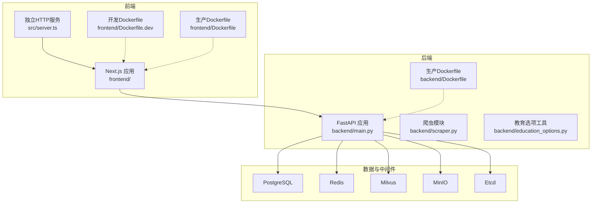
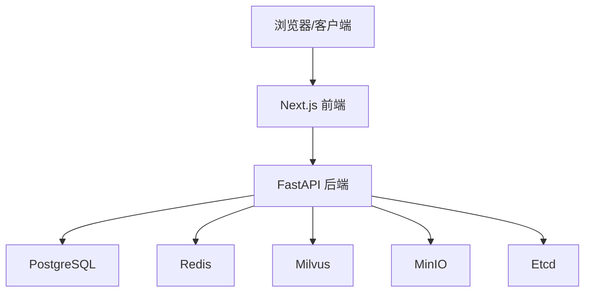
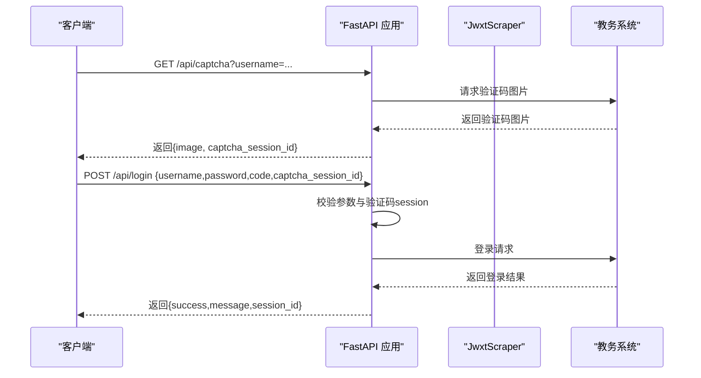
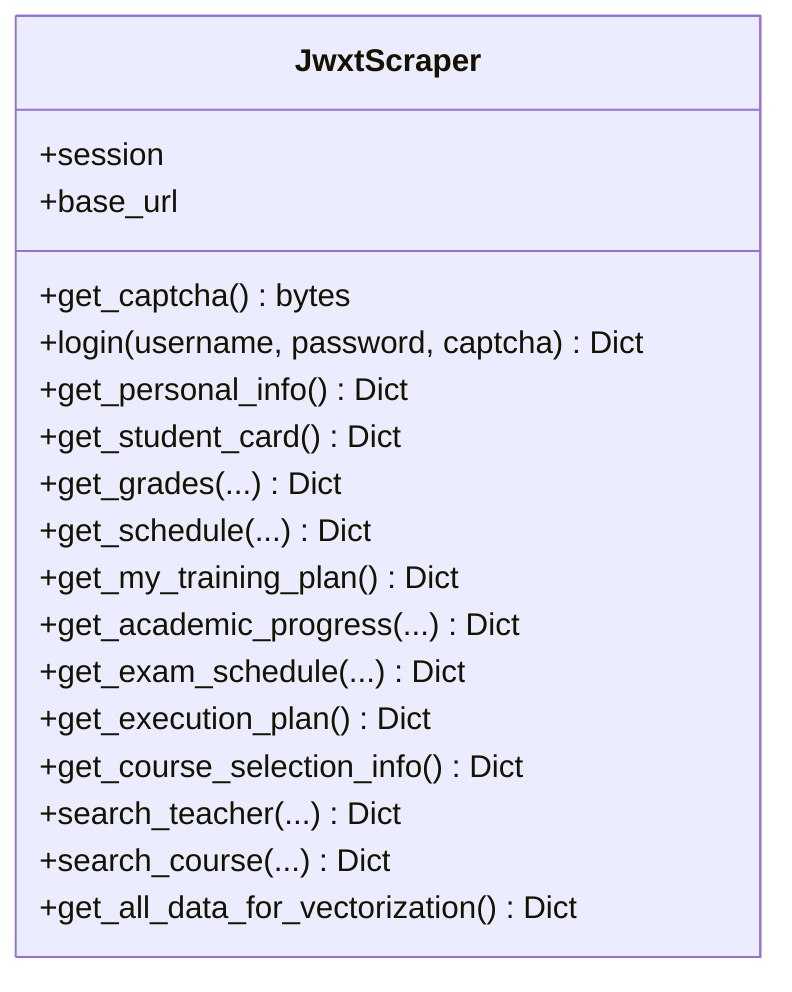
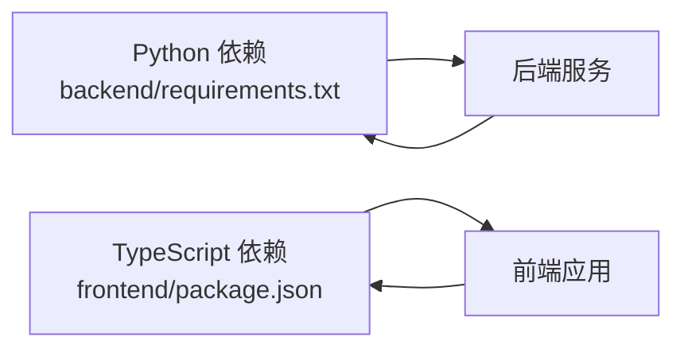

# 开发指南

<cite>
**本文引用的文件**
- [README-Windows.md](file://README-Windows.md)
- [package.json](file://package.json)
- [backend/main.py](file://backend/main.py)
- [backend/requirements.txt](file://backend/requirements.txt)
- [backend/scraper.py](file://backend/scraper.py)
- [backend/education_options.py](file://backend/education_options.py)
- [backend/test_login.py](file://backend/test_login.py)
- [backend/test_scraper.py](file://backend/test_scraper.py)
- [frontend/package.json](file://frontend/package.json)
- [src/server.ts](file://src/server.ts)
- [scripts/build.sh](file://scripts/build.sh)
- [scripts/dev.sh](file://scripts/dev.sh)
- [scripts/start.sh](file://scripts/start.sh)
- [docker-compose.yml](file://docker-compose.yml)
- [backend/Dockerfile](file://backend/Dockerfile)
- [frontend/Dockerfile.dev](file://frontend/Dockerfile.dev)
- [frontend/Dockerfile](file://frontend/Dockerfile)
- [eslint.config.mjs](file://eslint.config.mjs)
- [tsconfig.json](file://tsconfig.json)
- [next.config.ts](file://next.config.ts)
- [frontend/nginx.conf](file://frontend/nginx.conf)
- [.gitignore](file://.gitignore)
</cite>

## 更新摘要
**变更内容**
- 新增专用开发模式Dockerfile.dev，支持热重载和文件监听
- 优化卷挂载策略，改进开发容器化配置
- 统一开发环境端口配置为5000，解决端口冲突问题
- 更新CORS配置以匹配新的端口设置
- 改进Docker编排配置，支持更高效的开发工作流

## 目录
1. [简介](#简介)
2. [项目结构](#项目结构)
3. [核心组件](#核心组件)
4. [架构总览](#架构总览)
5. [详细组件分析](#详细组件分析)
6. [依赖分析](#依赖分析)
7. [性能考虑](#性能考虑)
8. [故障排查指南](#故障排查指南)
9. [结论](#结论)
10. [附录](#附录)

## 简介
本指南面向"智能教务系统AI助手"项目的开发者，提供从代码规范、测试策略、构建与自动化、版本控制到扩展与插件机制的完整开发参考。项目采用前后端分离架构：后端基于FastAPI提供REST API，前端基于Next.js 16（TypeScript），并集成AI与向量检索能力。文档同时覆盖Docker编排与常用脚本，帮助团队高效协作与交付。

**更新** 新增专用开发Dockerfile、热重载配置、优化的卷挂载策略等开发工作流改进，显著提升开发体验与容器化开发效率。开发环境访问地址已更新为 localhost:5000，解决端口绑定冲突问题。

## 项目结构
项目采用多模块组织方式：
- backend：后端API与爬虫逻辑，包含FastAPI应用、数据爬取与教育选项工具
- frontend：前端Next.js应用，包含页面与UI组件
- scripts：构建与开发辅助脚本
- src：独立的Next.js服务入口（server.ts）
- docker-compose.yml：服务编排（PostgreSQL、Redis、Etcd、MinIO、Milvus、前端、后端）
- frontend/Dockerfile.dev：专用开发模式Dockerfile，支持热重载
- frontend/Dockerfile：生产环境Dockerfile
- backend/Dockerfile：生产环境Dockerfile

**图表来源**
- [docker-compose.yml:1-167](file://docker-compose.yml#L1-L167)
- [backend/main.py:1-853](file://backend/main.py#L1-L853)
- [src/server.ts:1-36](file://src/server.ts#L1-L36)
- [frontend/Dockerfile.dev:1-26](file://frontend/Dockerfile.dev#L1-L26)
- [frontend/Dockerfile:1-28](file://frontend/Dockerfile#L1-L28)
- [backend/Dockerfile:1-18](file://backend/Dockerfile#L1-L18)

**章节来源**
- [README-Windows.md:213-228](file://README-Windows.md#L213-L228)
- [docker-compose.yml:1-167](file://docker-compose.yml#L1-L167)

## 核心组件
- 后端FastAPI应用：提供健康检查、验证码、登录、个人信息、成绩、课表、培养方案、学业进度、考试安排、教师与课程查询、AI选项查询等接口
- 爬虫模块：封装对教务系统的登录、验证码、个人信息、学籍卡片、成绩、课表、培养方案、学业进度、考试安排、执行计划、选课信息等数据抓取
- 教育选项工具：提供院系、学期、课程性质、修读类别、成绩显示方式、考核方式、星期、节次、周次等选项数据与查询函数
- 前端Next.js应用：页面与UI组件，通过API与后端交互
- 独立HTTP服务：用于开发环境的热更新与本地调试
- 构建与脚本：统一的构建、开发与打包脚本，配合Docker编排
- **开发容器化**：专用开发Dockerfile支持热重载，优化卷挂载提升开发效率

**更新** 新增专用开发Dockerfile和优化的卷挂载策略，显著改善开发体验。开发环境访问地址已更新为 localhost:5000。

**章节来源**
- [backend/main.py:95-124](file://backend/main.py#L95-L124)
- [backend/scraper.py:13-800](file://backend/scraper.py#L13-L800)
- [backend/education_options.py:1-420](file://backend/education_options.py#L1-L420)
- [frontend/package.json:1-96](file://frontend/package.json#L1-L96)
- [src/server.ts:1-36](file://src/server.ts#L1-L36)
- [frontend/Dockerfile.dev:1-26](file://frontend/Dockerfile.dev#L1-L26)
- [frontend/Dockerfile:1-28](file://frontend/Dockerfile#L1-L28)
- [backend/Dockerfile:1-18](file://backend/Dockerfile#L1-L18)

## 架构总览
系统采用"前端-后端-API网关/反向代理"的典型三层架构。前端通过Next.js提供静态资源与SSR/CSR混合渲染；后端以FastAPI提供REST接口；数据与中间件通过Docker Compose统一编排，包括数据库、缓存、对象存储、向量数据库与配置存储。

**图表来源**
- [docker-compose.yml:94-137](file://docker-compose.yml#L94-L137)
- [backend/main.py:1-853](file://backend/main.py#L1-L853)

## 详细组件分析

### 后端FastAPI应用
- 路由与端点：根路径、健康检查、验证码、登录、个人信息、成绩、课表、培养方案、学业进度、考试安排、教师与课程查询、AI选项查询、全量数据聚合等
- 会话与服务器选择：根据学号选择服务器，保证验证码与登录在同一服务器；验证码session临时存储与清理
- 异常处理：统一HTTP异常与通用异常捕获，返回结构化错误信息
- 插件化路由：尝试导入聊天API路由，失败时输出提示

**图表来源**
- [backend/main.py:135-190](file://backend/main.py#L135-L190)
- [backend/main.py:192-328](file://backend/main.py#L192-L328)

**章节来源**
- [backend/main.py:95-124](file://backend/main.py#L95-L124)
- [backend/main.py:135-190](file://backend/main.py#L135-L190)
- [backend/main.py:192-328](file://backend/main.py#L192-L328)

### 爬虫模块（JwxtScraper）
- 功能覆盖：验证码、登录、个人信息、学籍卡片、成绩、课表、培养方案、我的培养方案、学业进度、考试安排、执行计划、选课信息、教师与课程查询、全量向量化数据聚合
- 数据解析：BeautifulSoup解析HTML表格与文本，正则提取统计信息
- 错误处理：统一返回包含success与message的字典，便于上层API处理

**图表来源**
- [backend/scraper.py:13-800](file://backend/scraper.py#L13-L800)

**章节来源**
- [backend/scraper.py:61-112](file://backend/scraper.py#L61-L112)
- [backend/scraper.py:153-237](file://backend/scraper.py#L153-L237)
- [backend/scraper.py:301-470](file://backend/scraper.py#L301-L470)
- [backend/scraper.py:471-558](file://backend/scraper.py#L471-L558)
- [backend/scraper.py:559-685](file://backend/scraper.py#L559-L685)
- [backend/scraper.py:686-784](file://backend/scraper.py#L686-L784)
- [backend/scraper.py:785-800](file://backend/scraper.py#L785-L800)

### 教育选项工具
- 选项数据：院系、年级、学期、课程性质、修读类别、成绩显示方式、考核方式、星期、节次、周次
- 查询函数：query_departments、query_semesters、query_course_options、query_schedule_options、query_grade_options、get_option_description
- 工具类：EducationOptions提供静态方法与当前学期推断

**图表来源**
- [backend/education_options.py:264-378](file://backend/education_options.py#L264-L378)

**章节来源**
- [backend/education_options.py:130-260](file://backend/education_options.py#L130-L260)
- [backend/education_options.py:264-378](file://backend/education_options.py#L264-L378)

### 前端Next.js应用
- 技术栈：Next.js 16、TypeScript、Shadcn/UI + Tailwind CSS
- 脚本：dev、build、start、lint、type-check
- 类型与路径：tsconfig配置严格模式、路径别名@/*
- ESLint：基于eslint-config-next/typescript与core-web-vitals，自定义规则覆盖
- **开发配置**：next.config.ts支持导出模式和自定义配置

**更新** next.config.ts新增导出模式配置，优化构建输出。开发环境端口已更新为5000。

**章节来源**
- [frontend/package.json:1-96](file://frontend/package.json#L1-L96)
- [tsconfig.json:1-35](file://tsconfig.json#L1-L35)
- [eslint.config.mjs:1-29](file://eslint.config.mjs#L1-L29)
- [next.config.ts:1-21](file://next.config.ts#L1-L21)

### 独立HTTP服务（开发）
- 用途：在开发环境下以tsx watch启动本地HTTP服务，适配Next.js开发模式
- 端口与主机：从环境变量读取，支持动态端口清理与监听
- **端口更新**：默认端口已更新为5000，避免与后端8000端口冲突

**章节来源**
- [src/server.ts:1-36](file://src/server.ts#L1-L36)
- [scripts/dev.sh:1-35](file://scripts/dev.sh#L1-L35)

### 开发容器化配置

#### 专用开发Dockerfile
- **frontend/Dockerfile.dev**：专为开发环境设计，支持热重载
- 基础镜像：node:20-alpine
- 包管理：pnpm配置阿里云镜像源加速
- 依赖安装：先复制package.json和pnpm-lock.yaml，利用Docker缓存
- 热重载：使用pnpm dev启动开发服务器

#### 生产Dockerfile
- **frontend/Dockerfile**：生产环境Dockerfile，支持热更新
- 基础镜像：node:20-alpine
- 系统依赖：安装libc6-compat兼容包
- 包管理：pnpm配置阿里云镜像源加速
- 启动命令：pnpm dev -p 3000支持热更新

- **backend/Dockerfile**：生产环境基础镜像
- 基础镜像：python:3.11-slim
- 依赖安装：使用阿里云pip镜像源
- 启动命令：uvicorn主进程

#### 卷挂载优化
- **前端卷挂载**：挂载src、public、配置文件目录，排除node_modules和.next目录
- **后端卷挂载**：挂载整个backend目录，支持代码热重载
- **环境变量**：NEXT_PUBLIC_API_URL、WATCHPACK_POLLING等开发配置

**更新** 新增专用开发Dockerfile和优化的卷挂载策略，显著提升开发效率。开发容器端口已更新为5000。

**章节来源**
- [frontend/Dockerfile.dev:1-26](file://frontend/Dockerfile.dev#L1-L26)
- [frontend/Dockerfile:1-28](file://frontend/Dockerfile#L1-L28)
- [backend/Dockerfile:1-18](file://backend/Dockerfile#L1-L18)
- [docker-compose.yml:94-167](file://docker-compose.yml#L94-L167)

## 依赖分析
- 后端依赖：FastAPI、Uvicorn、Requests、BeautifulSoup4、Selenium/Pyppeteer、Redis、Milvus、LangChain、OpenAI/DashScope、Pandas/Numpy、Dotenv、Pydantic等
- 前端依赖：Next.js、React、Radix UI、Tailwind、Recharts、Supabase、AWS SDK、Drizzle ORM、Zod等
- 开发与构建：TypeScript、ESLint、tsup、tsx、PostCSS、TailwindCSS

**图表来源**
- [backend/requirements.txt:1-44](file://backend/requirements.txt#L1-L44)
- [frontend/package.json:12-86](file://frontend/package.json#L12-L86)

**章节来源**
- [backend/requirements.txt:1-44](file://backend/requirements.txt#L1-L44)
- [frontend/package.json:12-86](file://frontend/package.json#L12-L86)

## 性能考虑
- 爬虫并发与超时：请求设置合理超时，避免阻塞；解析HTML时尽量减少DOM遍历次数
- 缓存策略：登录态与验证码session短期有效，避免长期驻留内存；Redis可用于会话与中间结果缓存
- 向量检索：批量聚合数据后写入Milvus，注意批处理大小与索引参数
- 前端构建：使用Next.js内置优化与tsup打包，避免冗余资源
- Docker编排：按需调整容器资源限制，确保数据库、缓存与向量库稳定运行
- **开发容器优化**：专用开发Dockerfile利用Docker缓存机制，pnpm镜像源加速依赖安装
- **端口优化**：开发环境使用5000端口，避免与后端8000端口冲突，提升开发效率

**更新** 新增开发容器优化策略和端口优化配置，提升开发环境性能。

## 故障排查指南
- 后端启动失败：检查端口占用，修改端口或释放端口
- 验证码无法显示：确认网络可访问教务系统，必要时连接校园网或VPN
- 登录失败：检查用户名、密码、验证码；查看响应内容中的错误提示
- 依赖安装失败：使用镜像源安装，或更换网络环境
- 前端依赖安装失败：配置npm镜像、关闭代理、清理缓存后重试
- **容器开发问题**：检查卷挂载权限、端口映射冲突、镜像缓存问题
- **端口冲突问题**：开发环境默认使用5000端口，如被占用会自动清理并启动

**更新** 新增容器开发相关故障排查指导和端口冲突解决方案。

**章节来源**
- [README-Windows.md:266-291](file://README-Windows.md#L266-L291)
- [README-Windows.md:232-263](file://README-Windows.md#L232-L263)

## 结论
本指南提供了从代码规范、测试策略、构建与自动化、版本控制到扩展与插件机制的完整开发参考。**更新后的版本**显著增强了开发工作流：新增专用开发Dockerfile、热重载配置、优化的卷挂载策略，配合Docker编排与脚本工具，大幅提升开发效率与交付质量。开发环境访问地址已更新为 localhost:5000，有效解决了端口绑定冲突问题。

## 附录

### 代码规范与开发标准

- Python后端
  - 命名约定：模块与类使用PascalCase，函数与变量使用snake_case；常量使用UPPER_CASE
  - 注释规范：模块顶部提供简要说明；复杂函数提供docstring；关键逻辑添加行内注释
  - 错误处理：统一抛出HTTPException，返回结构化错误信息
  - 日志记录：使用logging模块记录关键事件与错误，便于排查

- TypeScript前端
  - 命名约定：组件类名PascalCase，变量与函数snake_case；类型接口以I开头或使用interface关键字
  - 注释规范：公共API与复杂逻辑提供注释；组件导出前进行类型声明
  - 类型安全：开启tsconfig严格模式，避免any泛滥
  - ESLint规则：遵循eslint-config-next/typescript与core-web-vitals，必要时在eslint.config.mjs中微调

**章节来源**
- [backend/main.py:1-853](file://backend/main.py#L1-L853)
- [backend/scraper.py:1-800](file://backend/scraper.py#L1-L800)
- [backend/education_options.py:1-420](file://backend/education_options.py#L1-L420)
- [eslint.config.mjs:1-29](file://eslint.config.mjs#L1-L29)
- [tsconfig.json:1-35](file://tsconfig.json#L1-L35)

### 测试策略与用例编写指南

- 单元测试
  - 爬虫方法存在性与签名：验证关键方法是否存在与参数签名符合预期
  - 选项查询：验证关键词匹配、当前学期推断、选项描述获取
  - 教师与课程查询：验证返回数据结构与数量

- 集成测试
  - 登录流程：验证码获取、登录请求、响应判定
  - 数据聚合：全量数据向量化接口结构检查

- 端到端测试
  - 健康检查：访问/api/health确认服务可用
  - 验证码接口：访问/api/captcha确认图片返回
  - 登录接口：提交用户名、密码、验证码，验证登录结果

- 测试脚本
  - 登录测试：test_login.py用于验证验证码与登录流程
  - 爬虫测试：test_scraper.py用于验证选项数据、查询接口与方法存在性

**章节来源**
- [backend/test_login.py:1-152](file://backend/test_login.py#L1-L152)
- [backend/test_scraper.py:1-280](file://backend/test_scraper.py#L1-L280)
- [backend/main.py:126-129](file://backend/main.py#L126-L129)
- [backend/main.py:135-190](file://backend/main.py#L135-L190)

### 构建流程与自动化脚本

- 构建脚本
  - build.sh：安装依赖、Next.js构建、tsup打包后端服务
  - dev.sh：清理端口、启动tsx watch开发服务
  - start.sh：部署环境启动HTTP服务

- Docker编排
  - docker-compose.yml：定义PostgreSQL、Redis、Etcd、MinIO、Milvus、前端、后端服务及其依赖关系与健康检查
  - **开发模式**：frontend服务使用Dockerfile.dev，支持热重载和卷挂载
  - **生产模式**：backend服务使用Dockerfile，支持uvicorn主进程

- 前端脚本
  - package.json：dev、build、start、lint、type-check

**更新** 新增start.sh部署脚本和优化的Docker编排配置。开发环境端口已统一更新为5000。

**章节来源**
- [scripts/build.sh:1-18](file://scripts/build.sh#L1-L18)
- [scripts/dev.sh:1-35](file://scripts/dev.sh#L1-L35)
- [scripts/start.sh:1-18](file://scripts/start.sh#L1-L18)
- [docker-compose.yml:1-167](file://docker-compose.yml#L1-L167)
- [frontend/package.json:5-11](file://frontend/package.json#L5-L11)

### 版本控制最佳实践

- 分支管理
  - develop：日常开发分支
  - feature/<name>：功能开发分支
  - release/<version>：发布准备分支
  - hotfix/<issue>：紧急修复分支

- 提交规范
  - type(scope): subject
  - 示例：feat(api): 添加登录接口；fix(scraper): 修正课表解析逻辑

- 代码审查
  - PR必须包含测试用例与变更说明
  - 审查者关注安全性、性能与可维护性

- 忽略文件
  - .gitignore：忽略node_modules、构建产物、日志、缓存、IDE与系统文件

**章节来源**
- [.gitignore:1-101](file://.gitignore#L1-L101)

### 调试技巧与开发工具推荐

- 后端调试
  - 使用日志定位问题；在main.py中查看关键日志输出
  - 使用test_login.py与test_scraper.py快速验证接口与数据

- 前端调试
  - 使用Next.js dev模式与TypeScript类型检查
  - 使用ESLint与Prettier保持代码风格一致

- 开发工具
  - VS Code：推荐扩展（ESLint、Prettier、Tailwind CSS）
  - Docker Desktop：本地容器化开发与测试

- **容器开发调试**
  - 使用专用开发Dockerfile进行快速迭代
  - 利用卷挂载实现代码热重载
  - 通过环境变量配置开发参数
  - **端口管理**：开发环境自动使用5000端口，避免冲突

**更新** 新增容器开发调试技巧和端口管理策略。

**章节来源**
- [backend/test_login.py:1-152](file://backend/test_login.py#L1-L152)
- [backend/test_scraper.py:1-280](file://backend/test_scraper.py#L1-L280)
- [eslint.config.mjs:1-29](file://eslint.config.mjs#L1-L29)

### 扩展点与插件机制

- 新增API端点
  - 在backend/main.py中新增路由与处理逻辑，保持与现有错误处理一致
  - 如需AI工具：在education_options.py中补充选项数据与查询函数

- 新增爬虫功能
  - 在backend/scraper.py中新增方法，遵循现有返回结构
  - 在main.py中注册对应API路由

- 第三方服务集成
  - 数据库：通过PostgreSQL连接字符串配置
  - 缓存：Redis连接参数
  - 向量库：Milvus连接参数
  - 对象存储：MinIO访问密钥
  - 配置管理：通过环境变量注入

**章节来源**
- [backend/main.py:76-79](file://backend/main.py#L76-L79)
- [backend/education_options.py:1-420](file://backend/education_options.py#L1-L420)
- [backend/scraper.py:1-800](file://backend/scraper.py#L1-L800)
- [docker-compose.yml:113-127](file://docker-compose.yml#L113-L127)

### 贡献指南与开源协作规范

- 提交前检查
  - 运行类型检查与ESLint
  - 补充或更新测试用例
  - 更新README与相关文档

- 代码风格
  - Python：PEP8风格，函数与类清晰注释
  - TypeScript：严格类型、简洁命名、合理拆分模块

- 文档与注释
  - 关键API与复杂逻辑提供中文注释
  - README与脚本说明保持最新

**章节来源**
- [eslint.config.mjs:1-29](file://eslint.config.mjs#L1-L29)
- [tsconfig.json:1-35](file://tsconfig.json#L1-L35)
- [README-Windows.md:333-350](file://README-Windows.md#L333-L350)

### 开发环境访问地址说明

**更新** 开发环境访问地址已从 localhost:3000 更改为 localhost:5000

- **本地开发访问**：http://localhost:5000
- **后端API访问**：http://localhost:8000/api
- **开发脚本端口**：5000（自动清理占用端口）
- **CORS配置**：后端允许 http://localhost:5000 访问

**章节来源**
- [README-Windows.md:150-162](file://README-Windows.md#L150-L162)
- [README-Windows.md:318-319](file://README-Windows.md#L318-L319)
- [frontend/package.json:6-8](file://frontend/package.json#L6-L8)
- [package.json:6-8](file://package.json#L6-L8)
- [docker-compose.yml:101](file://docker-compose.yml#L101)
- [docker-compose.yml:140](file://docker-compose.yml#L140)
- [scripts/dev.sh:5](file://scripts/dev.sh#L5)
- [scripts/start.sh:6](file://scripts/start.sh#L6)
- [src/server.ts:7](file://src/server.ts#L7)

### Docker容器化开发配置详解

**更新** 新增详细的Docker容器化开发配置说明

#### 开发模式Dockerfile配置

**frontend/Dockerfile.dev**（开发专用）
- 基础镜像：node:20-alpine（轻量级Alpine Linux）
- 依赖管理：pnpm配置阿里云镜像源，提升安装速度
- 缓存优化：先复制package.json和pnpm-lock.yaml，利用Docker层缓存
- 热重载：使用pnpm dev启动开发服务器，支持文件变更自动刷新
- 端口暴露：EXPOSE 3000，与开发环境端口保持一致

**frontend/Dockerfile**（生产环境）
- 基础镜像：node:20-alpine
- 系统兼容：安装libc6-compat确保二进制兼容性
- 依赖锁定：使用--frozen-lockfile确保依赖版本一致性
- 启动参数：pnpm dev -p 3000指定端口

**backend/Dockerfile**（生产环境）
- 基础镜像：python:3.11-slim（官方精简镜像）
- 依赖优化：阿里云pip镜像源，提升安装速度
- 启动配置：uvicorn主进程，生产环境部署

#### 卷挂载策略优化

**前端开发卷挂载**
- 源码挂载：./frontend/src -> /app/src，实时同步代码变更
- 静态资源：./frontend/public -> /app/public，支持静态文件热更新
- 配置文件：挂载package.json、next.config.ts、tsconfig.json等关键配置
- 排除目录：/app/node_modules和/app/.next，使用容器内缓存

**后端开发卷挂载**
- 代码挂载：./backend -> /app，支持Python代码热重载
- 热重载：command: uvicorn main:app --host 0.0.0.0 --port 8000 --reload

#### 环境变量配置

**开发环境变量**
- NEXT_PUBLIC_API_URL=/api：前端API基础URL
- WATCHPACK_POLLING=true：启用文件监听，支持热重载
- CORS_ORIGINS=["http://localhost:5000"]：允许的跨域来源

**章节来源**
- [frontend/Dockerfile.dev:1-26](file://frontend/Dockerfile.dev#L1-L26)
- [frontend/Dockerfile:1-28](file://frontend/Dockerfile#L1-L28)
- [backend/Dockerfile:1-18](file://backend/Dockerfile#L1-L18)
- [docker-compose.yml:94-167](file://docker-compose.yml#L94-L167)