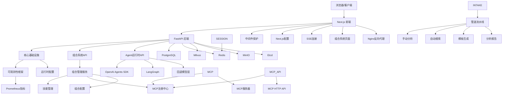
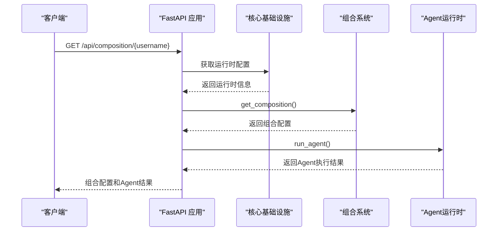
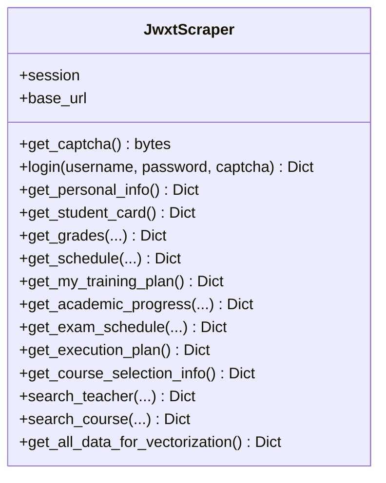
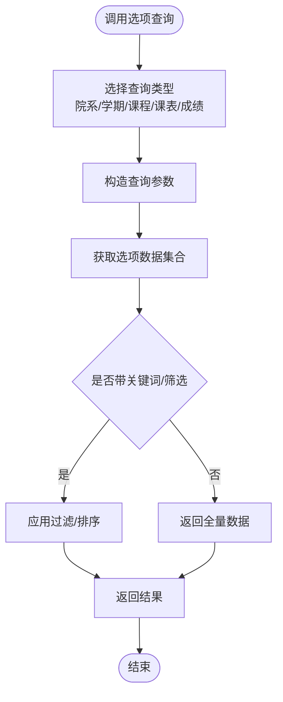

# 开发指南

<cite>
**本文引用的文件**
- [README-Windows.md](file://README-Windows.md)
- [package.json](file://package.json)
- [backend/main.py](file://backend/main.py)
- [backend/requirements.txt](file://backend/requirements.txt)
- [backend/scraper.py](file://backend/scraper.py)
- [backend/education_options.py](file://backend/education_options.py)
- [backend/test_login.py](file://backend/test_login.py)
- [backend/test_scraper.py](file://backend/test_scraper.py)
- [frontend/package.json](file://frontend/package.json)
- [src/server.ts](file://src/server.ts)
- [scripts/build.sh](file://scripts/build.sh)
- [scripts/dev.sh](file://scripts/dev.sh)
- [scripts/start.sh](file://scripts/start.sh)
- [scripts/github-intake.ps1](file://scripts/github-intake.ps1)
- [scripts/github_autopilot.py](file://scripts/github_autopilot.py)
- [scripts/generate_mcp_external_tools.py](file://scripts/generate_mcp_external_tools.py)
- [docker-compose.yml](file://docker-compose.yml)
- [backend/Dockerfile](file://backend/Dockerfile)
- [frontend/Dockerfile.dev](file://frontend/Dockerfile.dev)
- [frontend/Dockerfile](file://frontend/Dockerfile)
- [eslint.config.mjs](file://eslint.config.mjs)
- [tsconfig.json](file://tsconfig.json)
- [frontend/tsconfig.json](file://frontend/tsconfig.json)
- [next.config.ts](file://next.config.ts)
- [frontend/nginx.conf](file://frontend/nginx.conf)
- [frontend/src/middleware.ts](file://frontend/src/middleware.ts)
- [frontend/src/app/chat/page.tsx](file://frontend/src/app/chat/page.tsx)
- [deploy/nginx/prod.conf](file://deploy/nginx/prod.conf)
- [.gitignore](file://.gitignore)
- [docs/PHASE_A_TASKBOARD.md](file://docs/PHASE_A_TASKBOARD.md)
- [docs/PLATFORM_REBUILD_PLAN.md](file://docs/PLATFORM_REBUILD_PLAN.md)
- [docs/github-intake/README.md](file://docs/github-intake/README.md)
- [docs/github-intake/AUTOPILOT.md](file://docs/github-intake/AUTOPILOT.md)
- [docs/github-intake/analysis.json](file://docs/github-intake/analysis.json)
- [docs/github-intake/analysis.md](file://docs/github-intake/analysis.md)
- [docs/github-intake/autopilot-report.json](file://docs/github-intake/autopilot-report.json)
- [docs/github-intake/autopilot-report.md](file://docs/github-intake/autopilot-report.md)
- [docs/github-intake/repos.txt](file://docs/github-intake/repos.txt)
- [backend/app/api/chat.py](file://backend/app/api/chat.py)
- [backend/app/api/mcp.py](file://backend/app/api/mcp.py)
- [backend/app/api/intake.py](file://backend/app/api/intake.py)
- [backend/app/services/__init__.py](file://backend/app/services/__init__.py)
- [backend/app/services/agent_runtime.py](file://backend/app/services/agent_runtime.py)
- [backend/app/services/vector_store.py](file://backend/app/services/vector_store.py)
- [backend/app/services/skill_manager.py](file://backend/app/services/skill_manager.py)
- [backend/app/services/mcp_registry.py](file://backend/app/services/mcp_registry.py)
- [backend/app/mcp/tools.py](file://backend/app/mcp/tools.py)
- [backend/app/mcp/external_tools.json](file://backend/app/mcp/external_tools.json)
- [backend/app/mcp/external_tools.generated.json](file://backend/app/mcp/external_tools.generated.json)
- [backend/mcp_server.py](file://backend/mcp_server.py)
- [backend/app/core/observability.py](file://backend/app/core/observability.py)
- [backend/app/core/runtime.py](file://backend/app/core/runtime.py)
- [backend/app/api/composition.py](file://backend/app/api/composition.py)
- [backend/app/services/composition_manager.py](file://backend/app/services/composition_manager.py)
- [backend/app/api/agents.py](file://backend/app/api/agents.py)
- [frontend/src/app/composition/page.tsx](file://frontend/src/app/composition/page.tsx)
- [backend/app/services/session_store.py](file://backend/app/services/session_store.py)
</cite>

## 更新摘要
**变更内容**
- 开发环境热重载配置从硬编码改为条件环境变量，提升跨平台兼容性
- 新增NEXT_TELEMETRY_DISABLED=1配置，禁用Next.js遥测收集
- 优化文件监听机制，支持Linux开发环境的inotify和跨平台挂载场景
- 统一开发端口配置为5000，避免端口冲突
- **更新** 移除了对dist和tsconfig.tsbuildinfo的显式排除规则，新增了TypeScript构建信息文件位置的配置说明

## 目录
1. [简介](#简介)
2. [项目结构](#项目结构)
3. [核心组件](#核心组件)
4. [架构总览](#架构总览)
5. [详细组件分析](#详细组件分析)
6. [依赖分析](#依赖分析)
7. [性能考虑](#性能考虑)
8. [故障排查指南](#故障排查指南)
9. [结论](#结论)
10. [附录](#附录)

## 简介
本指南面向"智能教务系统AI助手"项目的开发者，提供从代码规范、测试策略、构建与自动化、版本控制到扩展与插件机制的完整开发参考。项目采用前后端分离架构：后端基于FastAPI提供REST API，前端基于Next.js 16（TypeScript），并集成AI与向量检索能力。

**更新** 新增组合系统、可观测性框架和管道基础设施改进的开发指南。新增组合系统支持按用户管理 skill 和 MCP 工具的自由拼接配置，提供灵活的系统扩展能力。新增可观测性框架包含 trace_id 上下文管理和 Prometheus 指标监控，为系统提供完整的监控和追踪能力。新增管道基础设施支持 GitHub Autopilot 全自动接入流水线，实现从仓库搜索到工具配置的完整自动化流程。

## 项目结构
项目采用多模块组织方式：
- backend：后端API与爬虫逻辑，包含FastAPI应用、数据爬取与教育选项工具
- frontend：前端Next.js应用，包含页面与UI组件
- scripts：构建与开发辅助脚本，新增GitHub Intake相关脚本和MCP工具模板生成脚本
- src：独立的Next.js服务入口（server.ts）
- docker-compose.yml：服务编排（PostgreSQL、Redis、Etcd、MinIO、Milvus、前端、后端）
- frontend/Dockerfile.dev：专用开发模式Dockerfile，支持热重载
- frontend/Dockerfile：生产环境Dockerfile
- backend/Dockerfile：生产环境Dockerfile
- **新增** backend/app/core：核心基础设施模块，包含可观测性框架和运行时配置
- **新增** backend/app/api/composition.py：组合系统API路由
- **新增** backend/app/services/composition_manager.py：组合管理系统服务
- **新增** backend/app/api/agents.py：Agent运行时API
- **新增** frontend/src/app/composition：组合系统前端页面
- **新增** backend/app/services/session_store.py：会话存储服务
- **新增** docs/github-intake：GitHub Intake工作流相关文档和分析报告
- **新增** scripts/github-intake.ps1：PowerShell仓库分析脚本
- **新增** scripts/github_autopilot.py：Python全自动仓库搜索脚本
- **新增** scripts/generate_mcp_external_tools.py：MCP外部工具模板生成脚本

```mermaid
graph TB
subgraph "前端"
FE["Next.js 应用<br/>frontend/"]
SRV["独立HTTP服务<br/>src/server.ts"]
FD["开发Dockerfile<br/>frontend/Dockerfile.dev"]
FP["生产Dockerfile<br/>frontend/Dockerfile"]
MW["中间件配置<br/>frontend/src/middleware.ts"]
NC["Next.js配置<br/>frontend/next.config.ts"]
SSE["SSE连接<br/>frontend/src/app/chat/page.tsx"]
COMP["组合系统页面<br/>frontend/src/app/composition/page.tsx"]
end
subgraph "后端"
API["FastAPI 应用<br/>backend/main.py"]
SCR["爬虫模块<br/>backend/scraper.py"]
OPT["教育选项工具<br/>backend/education_options.py"]
BD["生产Dockerfile<br/>backend/Dockerfile"]
CORE["核心基础设施<br/>backend/app/core/"]
COMP_API["组合系统API<br/>backend/app/api/composition.py"]
COMP_SRV["组合管理服务<br/>backend/app/services/composition_manager.py"]
AGENT_API["Agent运行时API<br/>backend/app/api/agents.py"]
OBS["可观测性框架<br/>backend/app/core/observability.py"]
RUNTIME["运行时配置<br/>backend/app/core/runtime.py"]
SESSION["会话存储<br/>backend/app/services/session_store.py"]
INTAKE["GitHub Intake<br/>backend/app/api/intake.py"]
MCP["MCP工具定义<br/>backend/app/mcp/tools.py"]
MCP_EXT["外部工具配置<br/>backend/app/mcp/external_tools.json"]
MCP_EXT_GEN["外部工具模板<br/>backend/app/mcp/external_tools.generated.json"]
MCP_SRV["MCP服务器<br/>backend/mcp_server.py"]
MCP_API["MCP HTTP API<br/>backend/app/api/mcp.py"]
end
subgraph "数据与中间件"
PG["PostgreSQL"]
RD["Redis"]
ML["Milvus"]
MC["MinIO"]
ET["Etcd"]
NGINX["Nginx反向代理<br/>deploy/nginx/prod.conf"]
end
subgraph "GitHub Intake工作流"
GI["手动分析<br/>scripts/github-intake.ps1"]
GA["自动搜索<br/>scripts/github_autopilot.py"]
GEN["模板生成<br/>scripts/generate_mcp_external_tools.py"]
DOC["分析报告<br/>docs/github-intake/"]
VEND["仓库克隆<br/>vendor/autopilot/"]
PIPE["管道流水线<br/>Intake Pipeline"]
END
subgraph "组合系统"
SKILLS["技能管理<br/>backend/app/services/skill_manager.py"]
MCP_REG["MCP注册中心<br/>backend/app/services/mcp_registry.py"]
COMPOSITION["组合配置<br/>backend/data/composition/"]
end
subgraph "Agent运行时"
OPENAI["OpenAI Agents SDK"]
LANGGRAPH["LangGraph"]
FALLBACK["回退模型层"]
END
FE --> API
SRV --> FE
API --> CORE
API --> COMP_API
API --> AGENT_API
API --> PG
API --> RD
API --> ML
API --> MC
API --> ET
CORE --> OBS
CORE --> RUNTIME
COMP_API --> COMP_SRV
COMP_SRV --> SKILLS
COMP_SRV --> MCP_REG
COMP_SRV --> COMPOSITION
AGENT_API --> OPENAI
AGENT_API --> LANGGRAPH
AGENT_API --> FALLBACK
SESSION --> RD
INTAKE --> PIPE
PIPE --> GI
PIPE --> GA
PIPE --> GEN
PIPE --> DOC
PIPE --> VEND
MCP --> MCP_REG
MCP_EXT --> MCP_REG
MCP_EXT_GEN --> GEN
MCP_SRV --> MCP
MCP_API --> MCP_REG
FD -.-> FE
FP -.-> FE
BD -.-> API
MW --> FE
NC --> FE
SSE --> FE
COMP --> COMP_API
COMP --> COMP_SRV
NGINX --> API
```

**图表来源**
- [docker-compose.yml:1-174](file://docker-compose.yml#L1-L174)
- [backend/main.py:1-170](file://backend/main.py#L1-L170)
- [src/server.ts:1-36](file://src/server.ts#L1-L36)
- [frontend/Dockerfile.dev:1-26](file://frontend/Dockerfile.dev#L1-L26)
- [frontend/Dockerfile:1-28](file://frontend/Dockerfile#L1-L28)
- [backend/Dockerfile:1-18](file://backend/Dockerfile#L1-L18)
- [frontend/src/middleware.ts:1-33](file://frontend/src/middleware.ts#L1-L33)
- [frontend/next.config.ts:1-44](file://frontend/next.config.ts#L1-L44)
- [frontend/src/app/chat/page.tsx:240-336](file://frontend/src/app/chat/page.tsx#L240-L336)
- [frontend/src/app/composition/page.tsx:1-236](file://frontend/src/app/composition/page.tsx#L1-L236)
- [deploy/nginx/prod.conf:1-49](file://deploy/nginx/prod.conf#L1-L49)
- [docs/PHASE_A_TASKBOARD.md:1-61](file://docs/PHASE_A_TASKBOARD.md#L1-L61)
- [docs/PLATFORM_REBUILD_PLAN.md:1-105](file://docs/PLATFORM_REBUILD_PLAN.md#L1-L105)
- [scripts/github-intake.ps1:1-112](file://scripts/github-intake.ps1#L1-L112)
- [scripts/github_autopilot.py:1-344](file://scripts/github_autopilot.py#L1-L344)
- [scripts/generate_mcp_external_tools.py:1-93](file://scripts/generate_mcp_external_tools.py#L1-L93)
- [docs/github-intake/README.md:1-23](file://docs/github-intake/README.md#L1-L23)
- [backend/app/core/observability.py:1-90](file://backend/app/core/observability.py#L1-L90)
- [backend/app/core/runtime.py:1-28](file://backend/app/core/runtime.py#L1-L28)
- [backend/app/api/composition.py:1-68](file://backend/app/api/composition.py#L1-L68)
- [backend/app/services/composition_manager.py:1-146](file://backend/app/services/composition_manager.py#L1-L146)
- [backend/app/api/agents.py:1-40](file://backend/app/api/agents.py#L1-L40)
- [backend/app/services/session_store.py:1-234](file://backend/app/services/session_store.py#L1-L234)

**章节来源**
- [README-Windows.md:213-228](file://README-Windows.md#L213-L228)
- [docker-compose.yml:1-174](file://docker-compose.yml#L1-L174)
- [docs/PHASE_A_TASKBOARD.md:1-61](file://docs/PHASE_A_TASKBOARD.md#L1-L61)
- [docs/PLATFORM_REBUILD_PLAN.md:1-105](file://docs/PLATFORM_REBUILD_PLAN.md#L1-L105)

## 核心组件
- 后端FastAPI应用：提供健康检查、验证码、登录、个人信息、成绩、课表、培养方案、学业进度、考试安排、教师与课程查询、AI选项查询等接口
- 爬虫模块：封装对教务系统的登录、验证码、个人信息、学籍卡片、成绩、课表、培养方案、学业进度、考试安排、执行计划、选课信息等数据抓取
- 教育选项工具：提供院系、学期、课程性质、修读类别、成绩显示方式、考核方式、星期、节次、周次等选项数据与查询函数
- 前端Next.js应用：页面与UI组件，通过API与后端交互
- 独立HTTP服务：用于开发环境的热更新与本地调试
- 构建与脚本：统一的构建、开发与打包脚本，配合Docker编排
- **开发容器化**：专用开发Dockerfile支持热重载，优化卷挂载提升开发效率
- **中间件优化**：开发环境不介入，生产环境仅保护特定路由
- **Next.js配置扩展**：支持反向代理、重写规则和开发源配置
- **SSE连接稳定化**：通过Nginx配置和前端代码优化流式连接稳定性
- **组合系统**：支持按用户管理 skill 和 MCP 工具的自由拼接配置，提供灵活的系统扩展能力
- **可观测性框架**：包含 trace_id 上下文管理和 Prometheus 指标监控，为系统提供完整的监控和追踪能力
- **管道基础设施**：支持 GitHub Autopilot 全自动接入流水线，实现从仓库搜索到工具配置的完整自动化流程
- **Agent运行时服务**：支持多框架编排（OpenAI Agents SDK、LangGraph），提供灵活的Agent执行能力
- **会话存储服务**：支持 Redis 持久化和内存回退机制，提供可靠的会话管理
- **MCP注册中心**：工具注册、发现与调用的统一入口，支持外部工具配置和HTTP工具适配器
- **MCP HTTP API**：通过HTTP提供MCP服务，支持远程调用MCP工具
- **MCP服务器**：支持stdio模式的MCP服务实现，可被OpenClaw等AI Agent调用
- **MCP外部工具模板**：支持从GitHub Autopilot报告自动生成外部工具配置
- **服务层兼容层**：向后兼容的模型提供层切换机制
- **GitHub Intake工作流**：新增仓库分析、自动化搜索、集成建议系统
- **向量存储服务**：基于Milvus的向量数据库集成
- **技能管理服务**：基于YAML的声明式技能管理
- **MCP工具定义**：将教务系统功能暴露为MCP工具，支持OpenClaw等AI Agent调用
- **MCP工具规格**：MCPToolSpec定义工具名称、描述、参数、输入模式等

**更新** 新增组合系统、可观测性框架和管道基础设施改进的开发指南。新增组合系统支持按用户管理 skill 和 MCP 工具的自由拼接配置，提供灵活的系统扩展能力。新增可观测性框架包含 trace_id 上下文管理和 Prometheus 指标监控，为系统提供完整的监控和追踪能力。新增管道基础设施支持 GitHub Autopilot 全自动接入流水线，实现从仓库搜索到工具配置的完整自动化流程。

**章节来源**
- [backend/main.py:95-124](file://backend/main.py#L95-L124)
- [backend/scraper.py:13-800](file://backend/scraper.py#L13-L800)
- [backend/education_options.py:1-420](file://backend/education_options.py#L1-L420)
- [frontend/package.json:1-96](file://frontend/package.json#L1-L96)
- [src/server.ts:1-36](file://src/server.ts#L1-L36)
- [frontend/Dockerfile.dev:1-26](file://frontend/Dockerfile.dev#L1-L26)
- [frontend/Dockerfile:1-28](file://frontend/Dockerfile#L1-L28)
- [backend/Dockerfile:1-18](file://backend/Dockerfile#L1-L18)
- [frontend/src/middleware.ts:1-33](file://frontend/src/middleware.ts#L1-L33)
- [frontend/next.config.ts:1-44](file://frontend/next.config.ts#L1-L44)
- [frontend/src/app/chat/page.tsx:240-336](file://frontend/src/app/chat/page.tsx#L240-L336)
- [frontend/src/app/composition/page.tsx:1-236](file://frontend/src/app/composition/page.tsx#L1-L236)
- [docs/PHASE_A_TASKBOARD.md:1-61](file://docs/PHASE_A_TASKBOARD.md#L1-L61)
- [docs/PLATFORM_REBUILD_PLAN.md:12-16](file://docs/PLATFORM_REBUILD_PLAN.md#L12-L16)
- [scripts/github-intake.ps1:1-112](file://scripts/github-intake.ps1#L1-L112)
- [scripts/github_autopilot.py:1-344](file://scripts/github_autopilot.py#L1-L344)
- [scripts/generate_mcp_external_tools.py:1-93](file://scripts/generate_mcp_external_tools.py#L1-L93)
- [backend/app/core/observability.py:1-90](file://backend/app/core/observability.py#L1-L90)
- [backend/app/core/runtime.py:1-28](file://backend/app/core/runtime.py#L1-L28)
- [backend/app/api/composition.py:1-68](file://backend/app/api/composition.py#L1-L68)
- [backend/app/services/composition_manager.py:1-146](file://backend/app/services/composition_manager.py#L1-L146)
- [backend/app/api/agents.py:1-40](file://backend/app/api/agents.py#L1-L40)
- [backend/app/services/session_store.py:1-234](file://backend/app/services/session_store.py#L1-L234)

## 架构总览
系统采用"前端-后端-API网关/反向代理"的典型三层架构。前端通过Next.js提供静态资源与SSR/CSR混合渲染；后端以FastAPI提供REST接口；数据与中间件通过Docker Compose统一编排，包括数据库、缓存、对象存储、向量数据库与配置存储。

**更新** 新增组合系统、可观测性框架和管道基础设施的架构集成。新增组合系统支持按用户管理 skill 和 MCP 工具的自由拼接配置，提供灵活的系统扩展能力。新增可观测性框架包含 trace_id 上下文管理和 Prometheus 指标监控，为系统提供完整的监控和追踪能力。新增管道基础设施支持 GitHub Autopilot 全自动接入流水线，实现从仓库搜索到工具配置的完整自动化流程。



**图表来源**
- [docker-compose.yml:94-137](file://docker-compose.yml#L94-L137)
- [backend/main.py:1-170](file://backend/main.py#L1-L170)
- [frontend/src/middleware.ts:1-33](file://frontend/src/middleware.ts#L1-L33)
- [frontend/next.config.ts:1-44](file://frontend/next.config.ts#L1-L44)
- [frontend/src/app/chat/page.tsx:240-336](file://frontend/src/app/chat/page.tsx#L240-L336)
- [frontend/src/app/composition/page.tsx:1-236](file://frontend/src/app/composition/page.tsx#L1-L236)
- [deploy/nginx/prod.conf:1-49](file://deploy/nginx/prod.conf#L1-L49)
- [docs/PLATFORM_REBUILD_PLAN.md:12-16](file://docs/PLATFORM_REBUILD_PLAN.md#L12-L16)
- [scripts/github-intake.ps1:1-112](file://scripts/github-intake.ps1#L1-L112)
- [scripts/github_autopilot.py:1-344](file://scripts/github_autopilot.py#L1-L344)
- [scripts/generate_mcp_external_tools.py:1-93](file://scripts/generate_mcp_external_tools.py#L1-L93)
- [backend/app/core/observability.py:1-90](file://backend/app/core/observability.py#L1-L90)
- [backend/app/core/runtime.py:1-28](file://backend/app/core/runtime.py#L1-L28)
- [backend/app/api/composition.py:1-68](file://backend/app/api/composition.py#L1-L68)
- [backend/app/services/composition_manager.py:1-146](file://backend/app/services/composition_manager.py#L1-L146)
- [backend/app/api/agents.py:1-40](file://backend/app/api/agents.py#L1-L40)
- [backend/app/services/session_store.py:1-234](file://backend/app/services/session_store.py#L1-L234)

## 详细组件分析

### 开发环境热重载配置优化

**热重载配置变更概述**
开发环境热重载配置已从硬编码改为条件环境变量，显著提升跨平台兼容性和开发体验。主要变更包括：

- **WATCHPACK_POLLING**：从硬编码true改为条件环境变量${WATCHPACK_POLLING:-false}
- **CHOKIDAR_USEPOLLING**：新增条件环境变量${CHOKIDAR_USEPOLLING:-false}
- **NEXT_TELEMETRY_DISABLED**：新增NEXT_TELEMETRY_DISABLED=1配置，禁用Next.js遥测收集
- **Linux开发优化**：默认使用inotify文件监听，跨平台挂载时自动启用轮询模式
- **构建产物排除**：**更新** 移除了对/dist和/tsconfig.tsbuildinfo的显式排除规则，改为通过TypeScript配置精确控制构建信息文件位置

**配置实现细节**
- Linux开发环境默认使用inotify机制进行文件监听，性能更佳
- 跨平台挂载场景（如Docker卷挂载）自动启用轮询模式
- 条件环境变量提供灵活的配置覆盖机制
- NEXT_TELEMETRY_DISABLED=1确保开发环境无遥测数据收集
- **更新** 构建产物排除策略：通过frontend/tsconfig.json中的tsBuildInfoFile配置将TypeScript增量编译信息文件精确放置在.app/.next/cache目录中，避免开发服务器监控构建产物导致的无限重载循环
- **更新** TypeScript构建信息文件位置：frontend/tsconfig.json中tsBuildInfoFile配置为".next/cache/tsconfig.tsbuildinfo"，确保构建信息文件位于.app/.next/cache目录，与Next.js的构建缓存机制保持一致

**章节来源**
- [docker-compose.yml:106-109](file://docker-compose.yml#L106-L109)
- [docker-compose.yml:121-125](file://docker-compose.yml#L121-L125)
- [frontend/tsconfig.json:15-16](file://frontend/tsconfig.json#L15-L16)

### 组合系统（Composition System）

**组合系统概述**
组合系统支持按用户管理 skill 和 MCP 工具的自由拼接配置，提供灵活的系统扩展能力。系统通过组合配置文件管理用户的技能启用状态、MCP工具启用状态和执行优先级。

**核心组件**
- 组合API路由：提供获取、设置和重新排序组合配置的REST API
- 组合管理服务：负责组合配置的持久化、验证和解析
- 组合配置文件：以JSON格式存储用户级别的组合配置

**API端点**
- GET /api/composition/{username}：获取指定用户的组合配置
- POST /api/composition/skills：设置技能启用状态和优先级
- POST /api/composition/mcp：设置MCP工具启用状态和权重
- POST /api/composition/mcp/reorder：重新排序MCP工具执行顺序

**配置管理**
- 默认配置：当用户没有组合配置时，系统返回默认配置
- 持久化存储：使用JSON文件存储组合配置，支持自动创建目录
- 配置验证：确保配置结构的完整性和有效性

**章节来源**
- [backend/app/api/composition.py:1-68](file://backend/app/api/composition.py#L1-L68)
- [backend/app/services/composition_manager.py:1-146](file://backend/app/services/composition_manager.py#L1-L146)

### 可观测性框架（Observability Framework）

**可观测性框架概述**
可观测性框架提供完整的监控和追踪能力，包括 trace_id 上下文管理和 Prometheus 指标监控。框架支持HTTP请求监控、Intake任务监控和聊天流监控。

**核心组件**
- Trace ID上下文：使用contextvars管理trace_id，支持请求级追踪
- HTTP请求监控：记录请求总数、请求时长分布
- Intake任务监控：监控仓库分析任务的排队、执行和完成情况
- 聊天流监控：监控流式对话的请求和中断情况

**监控指标**
- HTTP_REQUEST_TOTAL：HTTP请求总数，按方法、路径、状态码分类
- HTTP_REQUEST_DURATION：HTTP请求时长分布，按方法和路径分类
- INTAKE_TASK_ENQUEUED_TOTAL：Intake任务排队总数
- INTAKE_TASK_STARTED_TOTAL：Intake任务开始总数
- INTAKE_TASK_FINISHED_TOTAL：Intake任务完成总数，按结果分类
- INTAKE_TASK_DURATION：Intake任务时长分布，按结果分类
- INTAKE_QUEUE_SIZE：Intake队列大小
- INTAKE_RUNNING_SIZE：正在运行的Intake任务数量
- CHAT_STREAM_REQUESTS_TOTAL：聊天流请求总数
- CHAT_STREAM_ABORTED_TOTAL：聊天流被客户端中断总数
- CHAT_STREAM_DURATION：聊天流时长分布，按结果分类

**章节来源**
- [backend/app/core/observability.py:1-90](file://backend/app/core/observability.py#L1-L90)

### 管道基础设施（Pipeline Infrastructure）

**管道基础设施概述**
管道基础设施支持 GitHub Autopilot 全自动接入流水线，实现从仓库搜索到工具配置的完整自动化流程。系统支持异步任务执行、任务队列管理和熔断机制。

**核心组件**
- 任务队列：支持优先级队列和去重机制
- 工作线程：后台worker线程串行执行任务，避免接口长时间阻塞
- 熔断机制：防止外部依赖故障影响系统稳定性
- 快照管理：支持任务执行过程的快照和回滚

**流水线步骤**
1. Autopilot搜索：自动搜索GitHub仓库并生成报告
2. 模板生成：根据报告生成MCP外部工具模板
3. 工具丰富：丰富工具配置信息
4. 工具探测：探测工具可用性和配置
5. 注册中心重载：在进程内重载MCP注册中心

**任务管理**
- 任务状态：queued、claimed、running、success、failed、cancelled、retry_wait
- 重试机制：支持指数退避重试
- 取消机制：支持任务取消和进程终止
- 日志系统：支持任务日志的实时流式输出

**章节来源**
- [backend/app/api/intake.py:1-1233](file://backend/app/api/intake.py#L1-L1233)

### Agent运行时服务

**框架支持与降级策略**
- OpenAI Agents SDK：高活跃、轻量、MCP友好，推荐使用
- LangGraph：高星、生产编排能力强，作为兼容入口
- 降级机制：当框架不可用或执行失败时，自动降级到统一模型层

**运行策略**
- 框架检测：动态检测可用框架，避免硬编码依赖
- 参数传递：支持framework参数选择不同运行策略
- 结果封装：统一返回结构，包含success、content、framework等字段

**章节来源**
- [backend/app/api/agents.py:1-40](file://backend/app/api/agents.py#L1-L40)
- [backend/app/services/agent_runtime.py:1-177](file://backend/app/services/agent_runtime.py#L1-L177)

### 会话存储服务

**会话存储概述**
会话存储服务支持 Redis 持久化和内存回退机制，提供可靠的会话管理。系统支持多种会话类型：验证码会话、用户会话、同步状态、认证会话和模型偏好。

**核心特性**
- Redis集成：自动检测Redis可用性，优先使用Redis存储
- 内存回退：Redis不可用时自动回退到内存存储
- 序列化机制：支持会话对象的序列化和反序列化
- TTL管理：支持会话过期时间和自动清理

**会话类型**
- 验证码会话：存储验证码生成的会话状态
- 用户会话：存储用户登录后的会话信息和服务器URL
- 同步状态：存储数据同步的状态信息
- 认证会话：存储用户认证信息
- 模型偏好：存储用户模型配置偏好

**章节来源**
- [backend/app/services/session_store.py:1-234](file://backend/app/services/session_store.py#L1-L234)

### 后端FastAPI应用
- 路由与端点：根路径、健康检查、验证码、登录、个人信息、成绩、课表、培养方案、学业进度、考试安排、教师与课程查询、AI选项查询、全量数据聚合等
- 会话与服务器选择：根据学号选择服务器，保证验证码与登录在同一服务器；验证码session临时存储与清理
- 异常处理：统一HTTP异常与通用异常捕获，返回结构化错误信息
- 插件化路由：尝试导入聊天API路由，失败时输出提示
- **核心基础设施集成**：通过core模块集成可观测性框架和运行时配置
- **组合系统集成**：通过include_router(composition_router)集成组合系统API路由
- **Agent运行时集成**：通过include_router(agents_router)集成Agent运行时API路由
- **MCP注册中心集成**：通过get_mcp_registry获取工具注册中心实例
- **MCP HTTP API集成**：通过include_router(mcp_router.router)集成MCP HTTP API路由



**图表来源**
- [backend/app/api/composition.py:38-42](file://backend/app/api/composition.py#L38-L42)
- [backend/app/api/agents.py:26-39](file://backend/app/api/agents.py#L26-L39)
- [backend/app/core/runtime.py:12-27](file://backend/app/core/runtime.py#L12-L27)

**章节来源**
- [backend/main.py:95-124](file://backend/main.py#L95-L124)
- [backend/main.py:135-190](file://backend/main.py#L135-L190)
- [backend/main.py:192-328](file://backend/main.py#L192-L328)
- [backend/app/api/composition.py:38-67](file://backend/app/api/composition.py#L38-L67)
- [backend/app/api/agents.py:26-39](file://backend/app/api/agents.py#L26-L39)
- [backend/app/core/runtime.py:12-27](file://backend/app/core/runtime.py#L12-L27)

### 爬虫模块（JwxtScraper）
- 功能覆盖：验证码、登录、个人信息、学籍卡片、成绩、课表、培养方案、我的培养方案、学业进度、考试安排、执行计划、选课信息、教师与课程查询、全量向量化数据聚合
- 数据解析：BeautifulSoup解析HTML表格与文本，正则提取统计信息
- 错误处理：统一返回包含success与message的字典，便于上层API处理



**图表来源**
- [backend/scraper.py:13-800](file://backend/scraper.py#L13-L800)

**章节来源**
- [backend/scraper.py:61-112](file://backend/scraper.py#L61-L112)
- [backend/scraper.py:153-237](file://backend/scraper.py#L153-L237)
- [backend/scraper.py:301-470](file://backend/scraper.py#L301-L470)
- [backend/scraper.py:471-558](file://backend/scraper.py#L471-L558)
- [backend/scraper.py:559-685](file://backend/scraper.py#L559-L685)
- [backend/scraper.py:686-784](file://backend/scraper.py#L686-L784)
- [backend/scraper.py:785-800](file://backend/scraper.py#L785-L800)

### 教育选项工具
- 选项数据：院系、年级、学期、课程性质、修读类别、成绩显示方式、考核方式、星期、节次、周次
- 查询函数：query_departments、query_semesters、query_course_options、query_schedule_options、query_grade_options、get_option_description
- 工具类：EducationOptions提供静态方法与当前学期推断



**图表来源**
- [backend/education_options.py:264-378](file://backend/education_options.py#L264-L378)

**章节来源**
- [backend/education_options.py:130-260](file://backend/education_options.py#L130-L260)
- [backend/education_options.py:264-378](file://backend/education_options.py#L264-L378)

### 前端Next.js应用
- 技术栈：Next.js 16、TypeScript、Shadcn/UI + Tailwind CSS
- 脚本：dev、build、start、lint、type-check
- 类型与路径：tsconfig配置严格模式、路径别名@/*
- ESLint：基于eslint-config-next/typescript与core-web-vitals，自定义规则覆盖
- **开发配置**：next.config.ts支持导出模式和自定义配置

**更新** next.config.ts新增导出模式配置，优化构建输出。开发环境端口已更新为5000。**新增** 中间件配置优化，开发环境不介入，生产环境仅保护特定路由。**新增** 组合系统页面，支持用户级别的技能和MCP工具管理。

**章节来源**
- [frontend/package.json:1-96](file://frontend/package.json#L1-L96)
- [tsconfig.json:1-35](file://tsconfig.json#L1-L35)
- [eslint.config.mjs:1-29](file://eslint.config.mjs#L1-L29)
- [next.config.ts:1-44](file://next.config.ts#L1-L44)
- [frontend/src/middleware.ts:1-33](file://frontend/src/middleware.ts#L1-L33)
- [frontend/src/app/composition/page.tsx:1-236](file://frontend/src/app/composition/page.tsx#L1-L236)

### 中间件配置优化

**开发环境中间件策略**
- 开发环境完全不介入：开发模式下直接返回NextResponse.next()
- 生产环境路由保护：仅对/chat路径进行保护
- HTML文档验证：仅当Accept头包含text/html时才进行认证检查
- 会话验证：检查auth_session_id cookie，缺失时重定向到登录页

**配置细节**
- matcher配置：['/chat/:path*'] 仅匹配聊天相关路由
- 环境检测：process.env.NODE_ENV !== 'production'
- Cookie验证：request.cookies.get('auth_session_id')
- 重定向处理：自动携带redirect参数

**章节来源**
- [frontend/src/middleware.ts:1-33](file://frontend/src/middleware.ts#L1-L33)

### Next.js配置扩展

**开发源配置**
- allowedDevOrigins：支持多种开发源，包括localhost:5000、127.0.0.1:5000、192.168.88.100:5000等
- 图片优化：remotePatterns配置支持HTTPS协议的远程图片

**反向代理配置**
- rewrites函数：将/api/:path*重写到http://backend:8000/api/:path*
- distDir：设置构建输出目录为dist

**开发脚本集成**
- dev脚本：pnpm dev --webpack --hostname 0.0.0.0 --port 5000
- start脚本：pnpm start --port 5000

**章节来源**
- [frontend/next.config.ts:1-44](file://frontend/next.config.ts#L1-L44)
- [frontend/package.json:6-10](file://frontend/package.json#L6-L10)

### SSE连接稳定化

**前端SSE处理优化**
- 缓冲区管理：使用sseBuffer处理网络分片，兼容\n\n与\r\n\r\n两种分隔符
- 事件解析：逐行解析SSE事件，提取data:行并解析JSON数据
- 节流刷新：使用60ms节流避免高频分片导致的整页重绘抖动
- 保活帧处理：忽略ping类型的保活帧，避免干扰

**兜底处理机制**
- 最后事件处理：网络切分导致的最后一个事件兜底处理
- 错误恢复：try-catch包裹JSON解析，忽略解析错误
- 状态同步：确保conversation_id和content的正确同步

**配置细节**
- 流式刷新：flushAssistantContent函数节流刷新
- 时间控制：streamFlushTimerRef控制刷新时机
- 内容累积：aiContent累积流式内容

**章节来源**
- [frontend/src/app/chat/page.tsx:240-336](file://frontend/src/app/chat/page.tsx#L240-L336)

### 独立HTTP服务（开发）
- 用途：在开发环境下以tsx watch启动本地HTTP服务，适配Next.js开发模式
- 端口与主机：从环境变量读取，支持动态端口清理与监听
- **端口更新**：默认端口已更新为5000，避免与后端8000端口冲突

**章节来源**
- [src/server.ts:1-36](file://src/server.ts#L1-L36)
- [scripts/dev.sh:1-35](file://scripts/dev.sh#L1-L35)

### 开发容器化配置

#### 专用开发Dockerfile
- **frontend/Dockerfile.dev**：专为开发环境设计，支持热重载
- 基础镜像：node:20-alpine
- 包管理：pnpm配置阿里云镜像源加速
- 依赖安装：先复制package.json和pnpm-lock.yaml，利用Docker缓存
- 热重载：使用pnpm dev启动开发服务器

#### 生产Dockerfile
- **frontend/Dockerfile**：生产环境Dockerfile，支持热更新
- 基础镜像：node:20-alpine
- 系统依赖：安装libc6-compat兼容包
- 包管理：pnpm配置阿里云镜像源加速
- 启动命令：pnpm dev -p 3000支持热更新

- **backend/Dockerfile**：生产环境基础镜像
- 基础镜像：python:3.11-slim
- 依赖安装：使用阿里云pip镜像源
- 启动命令：uvicorn主进程

#### 卷挂载优化
- **前端卷挂载**：挂载src、public、配置文件目录，排除node_modules和.next目录
- **后端卷挂载**：挂载整个backend目录，支持代码热重载
- **环境变量**：NEXT_PUBLIC_API_URL、WATCHPACK_POLLING等开发配置
- **更新** **构建产物排除**：**移除了**对/dist和/tsconfig.tsbuildinfo目录的显式排除，改为通过TypeScript配置精确控制构建信息文件位置

**更新** 新增专用开发Dockerfile和优化的卷挂载策略，显著提升开发效率。开发容器端口已更新为5000。**更新** 移除了对/dist和/tsconfig.tsbuildinfo的显式排除规则，改为通过TypeScript配置精确控制构建信息文件位置。

**章节来源**
- [frontend/Dockerfile.dev:1-26](file://frontend/Dockerfile.dev#L1-L26)
- [frontend/Dockerfile:1-28](file://frontend/Dockerfile#L1-L28)
- [backend/Dockerfile:1-18](file://backend/Dockerfile#L1-L18)
- [docker-compose.yml:94-167](file://docker-compose.yml#L94-L167)

### Nginx反向代理配置

**SSE连接优化**
- 独立location配置：/api/chat/send-stream专门处理SSE流式接口
- 禁用缓冲：proxy_buffering off; proxy_request_buffering off;
- 超时配置：proxy_read_timeout 3600s; proxy_send_timeout 3600s
- 缓冲头：add_header X-Accel-Buffering no;

**通用API代理**
- 统一代理：/api/路径统一转发到后端
- 头部设置：Host、X-Real-IP、X-Forwarded-For、X-Forwarded-Proto
- WebSocket支持：proxy_set_header Upgrade $http_upgrade; proxy_cache_bypass $http_upgrade

**前端代理**
- 静态资源：/路径代理到前端静态文件
- SPA支持：try_files $uri $uri.html $uri/ /index.html

**章节来源**
- [deploy/nginx/prod.conf:1-49](file://deploy/nginx/prod.conf#L1-L49)

### GitHub Intake工作流

**GitHub Intake手动分析工作流**
- 用途：批量拉取开源仓库，自动生成可融入项目的评估报告
- 配置文件：docs/github-intake/repos.txt，每行一个owner/repo格式的仓库
- 执行脚本：scripts/github-intake.ps1，支持分析和可选克隆
- 输出报告：analysis.json和analysis.md，包含仓库星级、更新时间、语言、许可证、适配度等信息
- README说明：docs/github-intake/README.md，包含完整的使用指南

**GitHub Autopilot自动搜索工作流**
- 用途：全自动仓库搜索与集成建议，基于项目需求文档自动提取主题
- 输入源：PLATFORM_UPGRADE_GUIDE.md和.qoder/项目结构.txt
- 主题检测：自动提取multi_agent、mcp、rag、workflow、evaluation、skill_plugin主题
- 仓库搜索：基于主题在GitHub搜索高星且近期活跃仓库
- 评分排序：综合星数、更新时效、语言/许可证等因素进行自动评分
- 集成建议：生成可融入路径建议报告，指导具体集成位置
- 输出报告：autopilot-report.json和autopilot-report.md，包含Top仓库列表和集成建议

**MCP外部工具模板生成**
- 用途：根据GitHub Autopilot报告自动生成MCP外部工具模板
- 输入源：docs/github-intake/autopilot-report.json
- 生成文件：backend/app/mcp/external_tools.generated.json
- 工具规范：自动生成的工具名称、描述、参数、HTTP适配器配置
- 主题映射：将仓库主题映射到MCP工具配置

**集成建议与服务层映射**
- 多Agent框架：映射到backend/app/services/agent_runtime.py，扩展framework分派与路由策略
- RAG框架：映射到backend/app/services/vector_store.py与检索过滤策略
- MCP工具：映射到backend/app/services/mcp_registry.py，新增registry adapter
- 技能插件：映射到backend/app/services/skill_manager.py与skills API

**章节来源**
- [docs/github-intake/README.md:1-23](file://docs/github-intake/README.md#L1-L23)
- [docs/github-intake/AUTOPILOT.md:1-25](file://docs/github-intake/AUTOPILOT.md#L1-L25)
- [docs/github-intake/analysis.json:1-53](file://docs/github-intake/analysis.json#L1-L53)
- [docs/github-intake/analysis.md:1-10](file://docs/github-intake/analysis.md#L1-L10)
- [docs/github-intake/autopilot-report.json:1-507](file://docs/github-intake/autopilot-report.json#L1-L507)
- [docs/github-intake/autopilot-report.md:1-48](file://docs/github-intake/autopilot-report.md#L1-L48)
- [docs/github-intake/repos.txt:1-22](file://docs/github-intake/repos.txt#L1-L22)
- [scripts/github-intake.ps1:1-112](file://scripts/github-intake.ps1#L1-L112)
- [scripts/github_autopilot.py:1-344](file://scripts/github_autopilot.py#L1-L344)
- [scripts/generate_mcp_external_tools.py:1-93](file://scripts/generate_mcp_external_tools.py#L1-L93)

### Agent运行时服务

**框架支持与降级策略**
- OpenAI Agents SDK：高活跃、轻量、MCP友好，推荐使用
- LangGraph：高星、生产编排能力强，作为兼容入口
- 降级机制：当框架不可用或执行失败时，自动降级到统一模型层

**运行策略**
- 框架检测：动态检测可用框架，避免硬编码依赖
- 参数传递：支持framework参数选择不同运行策略
- 结果封装：统一返回结构，包含success、content、framework等字段

**章节来源**
- [backend/app/services/agent_runtime.py:1-177](file://backend/app/services/agent_runtime.py#L1-L177)

### 向量存储服务

**Milvus集成**
- 连接管理：支持环境变量配置，自动连接和可用性检测
- 集合管理：自动创建集合，定义字段结构和索引参数
- 文档操作：支持添加文档、搜索相似文档、删除用户数据
- 去重机制：自动过滤已存在的文本，避免重复存储

**查询策略**
- 搜索参数：支持top_k、data_types、semester等过滤条件
- 结果格式：标准化返回结构，包含id、text、source、metadata、score
- 性能优化：支持索引类型和nprobe参数调优

**章节来源**
- [backend/app/services/vector_store.py:1-253](file://backend/app/services/vector_store.py#L1-L253)

### 技能管理服务

**YAML声明式管理**
- 配置验证：强制要求name、version、description、tools字段
- 工具校验：每个tool必须包含name字段
- 文件大小限制：最大256KB，防止恶意上传

**导入机制**
- URL支持：支持GitHub原始链接自动转换
- 主机白名单：仅允许github.com和raw.githubusercontent.com
- 內容长度检查：防止超大文件上传

**生命周期管理**
- 上传：支持本地YAML文件上传和URL导入
- 列表：按owner分组列出所有技能
- 启停：支持启用/禁用技能
- 删除：彻底删除技能配置文件

**章节来源**
- [backend/app/services/skill_manager.py:1-189](file://backend/app/services/skill_manager.py#L1-L189)

### MCP工具注册中心

**工具注册与发现**
- 内置工具：查询成绩、课程表、学业进度、培养方案、考试安排、个人信息等
- 外部工具：通过external_tools.json配置外部工具，支持Python模块和HTTP工具
- 工具规格：MCPToolSpec定义工具名称、描述、参数、输入模式等
- 动态加载：支持运行时加载外部工具配置
- HTTP工具适配器：支持GET/POST等HTTP方法，自动处理JSON响应

**工具调用机制**
- Python工具：通过importlib动态导入模块并调用函数
- HTTP工具：支持GET/POST等HTTP方法，自动处理JSON响应
- 参数合并：自动合并username参数和用户传入参数
- 错误处理：统一的异常处理和错误信息格式化

**配置管理**
- 外部配置：external_tools.json支持工具别名和HTTP适配器
- 工具验证：配置验证确保必需字段存在
- 兼容性：外部配置失败不影响内置工具的正常工作
- 热重载：支持reload_mcp_registry()热重载工具配置

**章节来源**
- [backend/app/services/mcp_registry.py:1-254](file://backend/app/services/mcp_registry.py#L1-L254)
- [backend/app/mcp/external_tools.json:1-67](file://backend/app/mcp/external_tools.json#L1-L67)
- [backend/app/mcp/external_tools.generated.json:1-425](file://backend/app/mcp/external_tools.generated.json#L1-L425)

### MCP工具定义

**工具实现**
- 成绩查询：query_grades，支持按学期查询成绩，格式化输出
- 课表查询：query_schedule，按星期分组显示课程信息
- 学业进度：query_academic_progress，显示学分要求和模块进度
- 培养方案：query_training_plan，按课程类型分组显示培养要求
- 考试安排：query_exam_schedule，按时间排序显示考试信息
- 个人信息：query_personal_info，显示学生基本信息

**MCP装饰器**
- @mcp.tool()：工具装饰器，自动注册工具到MCP服务
- 参数验证：自动验证必需参数和类型
- 异常处理：统一的异常处理和错误信息格式化

**会话管理**
- 用户会话：从SessionStore获取用户session和server_url
- 爬虫实例：创建JwxtScraper实例进行数据抓取
- 错误处理：用户未登录时的明确错误提示

**章节来源**
- [backend/app/mcp/tools.py:1-306](file://backend/app/mcp/tools.py#L1-L306)

### MCP服务器实现

**服务器启动**
- stdio模式：支持本地调用和外部Agent集成
- 工具注册：自动加载app.mcp.tools中的所有工具
- 命令行界面：显示可用工具列表和使用说明

**集成支持**
- OpenClaw：支持OpenClaw等支持MCP的AI Agent
- Claude Desktop：支持Claude Desktop等桌面AI助手
- 标准接口：遵循MCP标准协议，确保兼容性

**章节来源**
- [backend/mcp_server.py:1-35](file://backend/mcp_server.py#L1-L35)

### MCP HTTP API

**API端点**
- GET /api/mcp/tools：列出所有可用的MCP工具
- POST /api/mcp/tools/{tool_name}：调用指定MCP工具
- GET /api/mcp/tools/{tool_name}/schema：获取工具的JSON Schema
- POST /api/mcp/tools/reload：热重载 MCP 工具配置

**工具调用**
- 参数验证：username必需，params可选
- 错误处理：工具不存在、调用失败等情况的统一处理
- 响应格式：标准化的success、tool、result、error字段

**章节来源**
- [backend/app/api/mcp.py:1-109](file://backend/app/api/mcp.py#L1-L109)

### GitHub Intake API

**端点功能**
- POST /api/intake/generate-mcp-tools：根据GitHub Autopilot报告生成MCP外部工具模板
- 脚本执行：调用scripts/generate_mcp_external_tools.py生成external_tools.generated.json
- 错误处理：脚本不存在、执行超时、执行失败等情况的处理

**集成流程**
- 输入验证：检查generate_mcp_external_tools.py脚本是否存在
- 超时控制：设置合理的执行超时时间
- 输出生成：生成backend/app/mcp/external_tools.generated.json文件

**章节来源**
- [backend/app/api/intake.py:85-108](file://backend/app/api/intake.py#L85-L108)

## 依赖分析
- 后端依赖：FastAPI、Uvicorn、Requests、BeautifulSoup4、Selenium/Pyppeteer、Redis、Milvus、LangChain、OpenAI/DashScope、Pandas/Numpy、Dotenv、Pydantic等
- 前端依赖：Next.js、React、Radix UI、Tailwind、Recharts、Supabase、AWS SDK、Drizzle ORM、Zod等
- 开发与构建：TypeScript、ESLint、tsup、tsx、PostCSS、TailwindCSS
- **新增** GitHub Intake相关依赖：requests、argparse、datetime、pathlib等
- **新增** 平台重建相关依赖：LiteLLM、LangGraph等
- **新增** MCP相关依赖：mcp==1.8.0、openai-agents==0.0.15等
- **新增** 可观测性相关依赖：prometheus-client==0.21.1
- **新增** 组合系统相关依赖：json、time、pathlib等Python标准库
- **新增** Agent运行时相关依赖：agents、langgraph、langchain-openai等

```mermaid
graph LR
PY["Python 依赖<br/>backend/requirements.txt"] --> BE["后端服务"]
TS["TypeScript 依赖<br/>frontend/package.json"] --> FE["前端应用"]
BE --> PY
FE --> TS
subgraph "GitHub Intake依赖"
REQ["requests"] --> GI["github-intake.ps1"]
ARG["argparse"] --> GA["github_autopilot.py"]
DT["datetime"] --> GA
PATH["pathlib"] --> GA
END
subgraph "MCP依赖"
MCP["mcp==1.8.0"] --> MRS["mcp_server.py"]
FM["fastmcp"] --> MT["mcp/tools.py"]
OA["openai-agents==0.0.15"] --> INTAKE["intake API"]
END
subgraph "可观测性依赖"
PROM["prometheus-client==0.21.1"] --> OBS["observability.py"]
END
subgraph "组合系统依赖"
JSON["json"] --> COMP["composition_manager.py"]
TIME["time"] --> COMP
PATHLIB["pathlib"] --> COMP
END
subgraph "Agent运行时依赖"
AG["agents"] --> AG_RUN["agent_runtime.py"]
LG["langgraph"] --> AG_RUN
LCO["langchain-openai"] --> AG_RUN
END
```

**图表来源**
- [backend/requirements.txt:1-61](file://backend/requirements.txt#L1-L61)
- [frontend/package.json:12-86](file://frontend/package.json#L12-L86)
- [scripts/github-intake.ps1:25-41](file://scripts/github-intake.ps1#L25-L41)
- [scripts/github_autopilot.py:13-25](file://scripts/github_autopilot.py#L13-L25)
- [backend/mcp_server.py:1-35](file://backend/mcp_server.py#L1-L35)
- [backend/app/mcp/tools.py:6](file://backend/app/mcp/tools.py#L6)
- [backend/app/api/intake.py:88](file://backend/app/api/intake.py#L88)
- [backend/app/core/observability.py:12](file://backend/app/core/observability.py#L12)
- [backend/app/services/composition_manager.py:8-11](file://backend/app/services/composition_manager.py#L8-L11)
- [backend/app/services/agent_runtime.py:11-14](file://backend/app/services/agent_runtime.py#L11-L14)

**章节来源**
- [backend/requirements.txt:1-61](file://backend/requirements.txt#L1-L61)
- [frontend/package.json:12-86](file://frontend/package.json#L12-L86)

## 性能考虑
- 爬虫并发与超时：请求设置合理超时，避免阻塞；解析HTML时尽量减少DOM遍历次数
- 缓存策略：登录态与验证码session短期有效，避免长期驻留内存；Redis可用于会话与中间结果缓存
- 向量检索：批量聚合数据后写入Milvus，注意批处理大小与索引参数
- 前端构建：使用Next.js内置优化与tsup打包，避免冗余资源
- Docker编排：按需调整容器资源限制，确保数据库、缓存与向量库稳定运行
- **开发容器优化**：专用开发Dockerfile利用Docker缓存机制，pnpm镜像源加速依赖安装
- **端口优化**：开发环境使用5000端口，避免与后端8000端口冲突，提升开发效率
- **中间件优化**：开发环境不介入，减少不必要的请求处理开销
- **SSE优化**：前端节流刷新避免频繁重绘，Nginx禁用缓冲确保流式传输稳定性
- **模型提供层优化**：统一的Provider接口减少重复实现，提升可维护性
- **MCP注册中心优化**：集中管理工具调用，避免分散的工具实现
- **MCP HTTP API优化**：支持异步调用，避免阻塞主线程
- **GitHub Intake优化**：批量API请求时添加延时，避免GitHub限流；README内容匹配使用正则表达式优化性能
- **MCP工具优化**：外部工具配置缓存，HTTP工具超时控制，动态导入模块的性能优化
- **组合系统优化**：组合配置文件使用JSON格式，支持快速读取和写入；提供默认配置避免空配置
- **可观测性优化**：Prometheus指标使用标签区分不同维度，避免指标爆炸；trace_id上下文管理避免全局状态污染
- **管道基础设施优化**：任务队列使用SQLite持久化，支持任务状态恢复；熔断机制防止级联故障
- **Agent运行时优化**：框架检测使用importlib.util.find_spec，避免导入失败；提供回退机制确保服务可用性
- **会话存储优化**：Redis连接池复用，内存回退提供容错能力；TTL管理避免内存泄漏
- **热重载优化**：条件环境变量支持跨平台文件监听，Linux使用inotify提升性能，Windows/macOS使用轮询模式
- **构建产物优化**：**更新** 通过TypeScript配置精确控制构建信息文件位置，避免无限重载循环问题，显著提升开发稳定性

**更新** 新增组合系统、可观测性框架、管道基础设施、Agent运行时和会话存储相关的性能考虑，包括组合配置文件的快速读写、Prometheus指标的标签管理、SQLite数据库的持久化和Agent运行时的框架检测优化。**更新** 通过TypeScript配置精确控制构建信息文件位置，移除对/dist和/tsconfig.tsbuildinfo的显式排除规则，显著提升开发稳定性。

## 故障排查指南
- 后端启动失败：检查端口占用，修改端口或释放端口
- 验证码无法显示：确认网络可访问教务系统，必要时连接校园网或VPN
- 登录失败：检查用户名、密码、验证码；查看响应内容中的错误提示
- 依赖安装失败：使用镜像源安装，或更换网络环境
- 前端依赖安装失败：配置npm镜像、关闭代理、清理缓存后重试
- **容器开发问题**：检查卷挂载权限、端口映射冲突、镜像缓存问题
- **端口冲突问题**：开发环境默认使用5000端口，如被占用会自动清理并启动
- **中间件问题**：检查NODE_ENV环境变量，确认开发/生产模式正确
- **SSE连接问题**：检查Nginx配置，确认proxy_buffering off设置正确
- **Webpack开发服务器**：确认pnpm dev --webpack参数正确，端口5000可用
- **模型提供层问题**：检查MODEL_PROVIDER环境变量，确认Provider配置正确
- **MCP注册中心问题**：检查工具注册状态，确认工具可用性和参数正确
- **MCP HTTP API问题**：检查工具名称是否正确，验证外部工具配置，确认HTTP工具URL可达
- **MCP服务器启动失败**：检查Python路径配置，确认app.mcp.tools模块可导入
- **GitHub Intake问题**：检查GITHUB_TOKEN环境变量，确认API访问权限；验证repos.txt格式正确性
- **Autopilot搜索失败**：检查网络连接，确认GitHub API可用性；验证项目需求文档存在且可读
- **MCP外部工具模板生成失败**：检查autopilot-report.json文件是否存在，确认生成脚本权限
- **组合系统问题**：检查组合配置文件权限，确认JSON格式正确；验证用户权限隔离
- **可观测性问题**：检查Prometheus端点访问，确认指标标签格式正确；验证trace_id上下文传播
- **管道基础设施问题**：检查SQLite数据库权限，确认任务队列状态；验证worker线程运行状态
- **Agent运行时问题**：检查框架依赖安装，确认OPENAI_API_KEY配置；验证回退机制正常工作
- **会话存储问题**：检查Redis连接状态，确认会话数据序列化正确；验证TTL设置合理
- **热重载问题**：检查WATCHPACK_POLLING和CHOKIDAR_USEPOLLING环境变量配置；确认文件监听模式正确
- **遥测问题**：检查NEXT_TELEMETRY_DISABLED配置，确认开发环境无遥测数据收集
- **构建产物重载问题**：**更新** 检查frontend/tsconfig.json中的tsBuildInfoFile配置，确认TypeScript构建信息文件位置正确

**更新** 新增组合系统、可观测性框架、管道基础设施、Agent运行时、会话存储和热重载相关的故障排查指导，包括组合配置文件权限检查、Prometheus指标标签验证、SQLite数据库权限验证、Agent运行时框架依赖检查、热重载环境变量配置和**更新** 构建产物重载问题排查，涵盖TypeScript构建信息文件位置的验证。

**章节来源**
- [README-Windows.md:266-291](file://README-Windows.md#L266-L291)
- [README-Windows.md:232-263](file://README-Windows.md#L232-L263)
- [frontend/src/middleware.ts:1-33](file://frontend/src/middleware.ts#L1-L33)
- [deploy/nginx/prod.conf:15-28](file://deploy/nginx/prod.conf#L15-L28)
- [docs/PHASE_A_TASKBOARD.md:46-53](file://docs/PHASE_A_TASKBOARD.md#L46-L53)

## 结论
本指南提供了从代码规范、测试策略、构建与自动化、版本控制到扩展与插件机制的完整开发参考。**更新后的版本**显著增强了开发工作流：新增专用开发Dockerfile、热重载配置、优化的卷挂载策略，配合Docker编排与脚本工具，大幅提升开发效率与交付质量。开发环境访问地址已更新为 localhost:5000，有效解决了端口绑定冲突问题。

**新增** 组合系统支持按用户管理 skill 和 MCP 工具的自由拼接配置，提供灵活的系统扩展能力。新增可观测性框架包含 trace_id 上下文管理和 Prometheus 指标监控，为系统提供完整的监控和追踪能力。新增管道基础设施支持 GitHub Autopilot 全自动接入流水线，实现从仓库搜索到工具配置的完整自动化流程。

**新增** Agent运行时服务支持多框架编排（OpenAI Agents SDK、LangGraph），提供灵活的Agent执行能力。新增会话存储服务支持 Redis 持久化和内存回退机制，提供可靠的会话管理。新增中间件配置优化、Next.js配置扩展、Web开发服务器集成和SSE连接稳定化等改进，进一步提升了开发环境的稳定性与用户体验。

**新增** 平台重建计划和Phase A任务看板详细描述了从教务问答应用升级为可扩展校园Agent平台的架构重构方案。新增的模型提供层抽象和MCP注册中心为后续的多Agent编排和技能系统奠定了坚实基础。中间件配置优化、Next.js配置扩展、Web开发服务器集成和SSE连接稳定化等改进，进一步提升了开发环境的稳定性与用户体验。

**更新** Docker Compose热重载修复：**移除了**对/dist和/tsconfig.tsbuildinfo的显式排除规则，改为通过TypeScript配置精确控制构建信息文件位置，显著提升开发稳定性。

## 附录

### 代码规范与开发标准

- Python后端
  - 命名约定：模块与类使用PascalCase，函数与变量使用snake_case；常量使用UPPER_CASE
  - 注释规范：模块顶部提供简要说明；复杂函数提供docstring；关键逻辑添加行内注释
  - 错误处理：统一抛出HTTPException，返回结构化错误信息
  - 日志记录：使用logging模块记录关键事件与错误，便于排查
  - **新增** 服务层抽象：遵循统一接口规范，确保向后兼容性
  - **新增** GitHub Intake脚本：PowerShell脚本使用PascalCase命名，Python脚本遵循PEP8规范
  - **新增** MCP工具规范：工具函数使用清晰的docstring，参数验证和异常处理规范化
  - **新增** MCP注册中心规范：MCPToolSpec定义工具规格，支持Python和HTTP两种工具类型
  - **新增** MCP HTTP API规范：标准化的请求响应格式，支持异步调用
  - **新增** 组合系统规范：组合配置使用JSON格式，提供默认配置和验证机制
  - **新增** 可观测性规范：trace_id上下文管理，Prometheus指标标签规范化
  - **新增** 管道基础设施规范：任务队列状态管理，熔断机制和重试策略
  - **新增** Agent运行时规范：框架检测和降级策略，统一结果格式
  - **新增** 会话存储规范：Redis集成和内存回退，TTL管理

- TypeScript前端
  - 命名约定：组件类名PascalCase，变量与函数snake_case；类型接口以I开头或使用interface关键字
  - 注释规范：公共API与复杂逻辑提供注释；组件导出前进行类型声明
  - 类型安全：开启tsconfig严格模式，避免any泛滥
  - ESLint规则：遵循eslint-config-next/typescript与core-web-vitals，必要时在eslint.config.mjs中微调
  - **新增** 组合系统前端规范：用户级别配置管理，实时状态更新
  - **新增** Agent运行时前端规范：框架选择和结果展示，错误处理

**章节来源**
- [backend/main.py:1-170](file://backend/main.py#L1-L170)
- [backend/scraper.py:1-800](file://backend/scraper.py#L1-L800)
- [backend/education_options.py:1-420](file://backend/education_options.py#L1-L420)
- [eslint.config.mjs:1-29](file://eslint.config.mjs#L1-L29)
- [tsconfig.json:1-35](file://tsconfig.json#L1-L35)
- [backend/app/core/observability.py:1-90](file://backend/app/core/observability.py#L1-L90)
- [backend/app/api/composition.py:1-68](file://backend/app/api/composition.py#L1-L68)
- [backend/app/services/composition_manager.py:1-146](file://backend/app/services/composition_manager.py#L1-L146)
- [backend/app/api/agents.py:1-40](file://backend/app/api/agents.py#L1-L40)
- [frontend/src/app/composition/page.tsx:1-236](file://frontend/src/app/composition/page.tsx#L1-L236)

### 测试策略与用例编写指南

- 单元测试
  - 爬虫方法存在性与签名：验证关键方法是否存在与参数签名符合预期
  - 选项查询：验证关键词匹配、当前学期推断、选项描述获取
  - 教师与课程查询：验证返回数据结构与数量
  - **新增** 模型提供层测试：验证Provider接口、回退机制、异常处理
  - **新增** MCP注册中心测试：验证工具注册、发现、调用功能
  - **新增** MCP工具测试：验证工具函数调用、参数验证、异常处理
  - **新增** MCP服务器测试：验证服务器启动、工具注册、stdio通信
  - **新增** MCP HTTP API测试：验证HTTP工具调用、参数传递、响应格式
  - **新增** GitHub Intake测试：验证报告生成、模板文件创建、脚本执行
  - **新增** 组合系统测试：验证组合配置读写、用户权限隔离、默认配置
  - **新增** 可观测性测试：验证trace_id上下文传播、指标收集、Prometheus端点
  - **新增** 管道基础设施测试：验证任务队列、worker线程、熔断机制
  - **新增** Agent运行时测试：验证多框架编排、降级机制、统一结果格式
  - **新增** 会话存储测试：验证Redis集成、内存回退、TTL管理
  - **新增** 热重载测试**：验证条件环境变量配置、文件监听模式切换
  - **新增** 构建产物重载测试**：**更新** 验证TypeScript构建信息文件位置配置

- 集成测试
  - 登录流程：验证码获取、登录请求、响应判定
  - 数据聚合：全量数据向量化接口结构检查
  - **新增** 中间件测试：验证开发/生产环境中间件行为差异
  - **新增** SSE连接测试：验证流式连接稳定性与数据完整性
  - **新增** 模型提供层集成测试：验证统一接口与Provider切换
  - **新增** GitHub Intake集成测试：验证仓库分析、报告生成、README匹配
  - **新增** Autopilot搜索测试：验证主题检测、仓库搜索、评分排序
  - **新增** MCP工具集成测试：验证工具调用、参数传递、响应格式
  - **新增** MCP服务器集成测试：验证stdio通信、工具发现、Agent集成
  - **新增** MCP HTTP API集成测试：验证HTTP远程调用、工具发现、参数合并
  - **新增** 组合系统集成测试：验证用户级别配置管理、权限隔离、配置持久化
  - **新增** 可观测性集成测试：验证trace_id传播、指标收集、Prometheus集成
  - **新增** 管道基础设施集成测试：验证任务队列、worker执行、状态管理
  - **新增** Agent运行时集成测试：验证多框架编排、降级机制、结果格式统一
  - **新增** 会话存储集成测试：验证Redis连接、内存回退、会话序列化
  - **新增** 热重载集成测试**：验证跨平台文件监听、条件环境变量生效
  - **新增** 构建产物重载集成测试**：**更新** 验证TypeScript构建信息文件位置配置

- 端到端测试
  - 健康检查：访问/api/health确认服务可用
  - 验证码接口：访问/api/captcha确认图片返回
  - 登录接口：提交用户名、密码、验证码，验证登录结果
  - **新增** 流式对话测试：验证SSE连接与消息流式传输
  - **新增** 工具调用测试：验证MCP工具注册与调用功能
  - **新增** Agent运行时测试：验证多框架编排与降级机制
  - **新增** RAG检索测试：验证向量检索与结果过滤
  - **新增** 技能管理测试：验证技能上传、列表、启停、删除
  - **新增** MCP工具端到端测试：验证工具调用完整流程
  - **新增** MCP服务器端到端测试：验证服务器启动与Agent集成
  - **新增** MCP HTTP API端到端测试：验证HTTP远程调用与工具发现
  - **新增** 组合系统端到端测试：验证用户级别配置管理与权限控制
  - **新增** 可观测性端到端测试：验证trace_id追踪与指标监控
  - **新增** 管道基础设施端到端测试：验证任务队列与worker执行
  - **新增** Agent运行时端到端测试：验证多框架编排与结果格式
  - **新增** 会话存储端到端测试：验证Redis集成与内存回退
  - **新增** 热重载端到端测试**：验证跨平台开发环境文件监听
  - **新增** 构建产物重载端到端测试**：**更新** 验证TypeScript构建信息文件位置配置

- 测试脚本
  - 登录测试：test_login.py用于验证验证码与登录流程
  - 爬虫测试：test_scraper.py用于验证选项数据、查询接口与方法存在性
  - **新增** 模型提供层测试：test_model_provider.py验证Provider接口
  - **新增** MCP注册中心测试：test_mcp_registry.py验证工具管理功能
  - **新增** MCP工具测试：test_mcp_tools.py验证工具函数
  - **新增** MCP服务器测试：test_mcp_server.py验证服务器功能
  - **新增** MCP HTTP API测试：test_mcp_api.py验证HTTP API功能
  - **新增** GitHub Intake测试：test_intake_api.py验证Intake API功能
  - **新增** 组合系统测试：test_composition.py验证组合配置管理
  - **新增** 可观测性测试：test_observability.py验证指标监控
  - **新增** 管道基础设施测试：test_intake_pipeline.py验证任务队列
  - **新增** Agent运行时测试：test_agent_runtime.py验证多框架编排
  - **新增** 会话存储测试：test_session_store.py验证会话管理
  - **新增** 热重载测试**：test_hot_reload.py验证文件监听配置
  - **新增** 构建产物重载测试**：**更新** test_build_artifacts_reload.py验证TypeScript构建信息文件位置

**章节来源**
- [backend/test_login.py:1-152](file://backend/test_login.py#L1-L152)
- [backend/test_scraper.py:1-280](file://backend/test_scraper.py#L1-L280)
- [backend/main.py:126-129](file://backend/main.py#L126-L129)
- [backend/main.py:135-190](file://backend/main.py#L135-L190)
- [docs/PHASE_A_TASKBOARD.md:37-44](file://docs/PHASE_A_TASKBOARD.md#L37-L44)

### 构建流程与自动化脚本

- 构建脚本
  - build.sh：安装依赖、Next.js构建、tsup打包后端服务
  - dev.sh：清理端口、启动tsx watch开发服务
  - start.sh：部署环境启动HTTP服务
  - **新增** github-intake.ps1：PowerShell仓库分析脚本，支持分析和可选克隆
  - **新增** github_autopilot.py：Python全自动仓库搜索脚本，支持主题检测、仓库搜索、评分排序
  - **新增** generate_mcp_external_tools.py：MCP外部工具模板生成脚本，支持从报告自动生成配置

- Docker编排
  - docker-compose.yml：定义PostgreSQL、Redis、Etcd、MinIO、Milvus、前端、后端服务及其依赖关系与健康检查
  - **开发模式**：frontend服务使用Dockerfile.dev，支持热重载和卷挂载
  - **生产模式**：backend服务使用Dockerfile，支持uvicorn主进程
  - **更新** **热重载修复**：**移除了**对/dist和/tsconfig.tsbuildinfo的显式排除规则，改为通过TypeScript配置精确控制构建信息文件位置

- 前端脚本
  - package.json：dev、build、start、lint、type-check

**更新** 新增start.sh部署脚本和优化的Docker编排配置。开发环境端口已统一更新为5000。**新增** Webpack开发服务器集成配置和GitHub Intake相关脚本，以及MCP外部工具模板生成脚本。**更新** 移除了对/dist和/tsconfig.tsbuildinfo的显式排除规则。

**章节来源**
- [scripts/build.sh:1-18](file://scripts/build.sh#L1-L18)
- [scripts/dev.sh:1-35](file://scripts/dev.sh#L1-L35)
- [scripts/start.sh:1-18](file://scripts/start.sh#L1-L18)
- [scripts/github-intake.ps1:1-112](file://scripts/github-intake.ps1#L1-L112)
- [scripts/github_autopilot.py:1-344](file://scripts/github_autopilot.py#L1-L344)
- [scripts/generate_mcp_external_tools.py:1-93](file://scripts/generate_mcp_external_tools.py#L1-L93)
- [docker-compose.yml:1-174](file://docker-compose.yml#L1-L174)
- [frontend/package.json:5-11](file://frontend/package.json#L5-L11)

### 版本控制最佳实践

- 分支管理
  - develop：日常开发分支
  - feature/<name>：功能开发分支
  - release/<version>：发布准备分支
  - hotfix/<issue>：紧急修复分支

- 提交规范
  - type(scope): subject
  - 示例：feat(api): 添加登录接口；fix(scraper): 修正课表解析逻辑；chore(platform): 更新平台重建计划；feat(github-intake): 添加仓库分析工作流；feat(mcp): 增强MCP工具注册中心；feat(mcp-http): 添加MCP HTTP API；feat(mcp-server): 实现MCP服务器；feat(mcp-template): 添加MCP模板生成脚本；feat(composition): 添加组合系统；feat(observability): 添加可观测性框架；feat(pipeline): 添加管道基础设施；feat(agent-runtime): 添加Agent运行时；feat(session-store): 添加会话存储；chore(hot-reload): 优化热重载配置；feat(telemetry): 禁用遥测收集；fix(docker-compose): 修复热重载无限循环问题；**更新** chore(tsconfig): 更新TypeScript构建信息文件位置配置

- 代码审查
  - PR必须包含测试用例与变更说明
  - 审查者关注安全性、性能与可维护性
  - **新增** 架构变更审查：平台重建相关的重大架构变更需要特别审查
  - **新增** GitHub Intake审查：新增工作流和脚本需要特别审查
  - **新增** MCP功能审查：新增MCP工具和服务器功能需要特别审查
  - **新增** HTTP API审查：新增MCP HTTP API需要特别审查
  - **新增** 组合系统审查：新增组合配置管理功能需要特别审查
  - **新增** 可观测性审查：新增监控和追踪功能需要特别审查
  - **新增** 管道基础设施审查：新增任务队列和worker功能需要特别审查
  - **新增** Agent运行时审查：新增多框架编排功能需要特别审查
  - **新增** 会话存储审查：新增Redis集成和内存回退功能需要特别审查
  - **新增** 热重载审查**：新增跨平台文件监听配置需要特别审查
  - **新增** Docker Compose热重载修复审查**：**更新** 新增TypeScript构建信息文件位置配置需要特别审查

- 忽略文件
  - .gitignore：忽略node_modules、构建产物、日志、缓存、IDE与系统文件
  - **新增** GitHub Intake产物：忽略docs/github-intake/下的分析报告和vendor/autopilot/下的仓库克隆
  - **新增** MCP产物：忽略mcp_server.py生成的日志文件和external_tools.generated.json生成文件
  - **新增** 组合系统产物：忽略backend/data/composition/下的用户组合配置文件
  - **新增** 管道基础设施产物：忽略backend/data/intake/下的任务队列数据库文件
  - **新增** 构建产物排除**：**更新** 忽略.app/.next/cache目录下的TypeScript构建信息文件，防止热重载无限循环

**章节来源**
- [.gitignore:1-101](file://.gitignore#L1-L101)

### 调试技巧与开发工具推荐

- 后端调试
  - 使用日志定位问题；在main.py中查看关键日志输出
  - 使用test_login.py与test_scraper.py快速验证接口与数据
  - **新增** 模型提供层调试：检查MODEL_PROVIDER环境变量，验证Provider切换
  - **新增** MCP注册中心调试：验证工具注册状态和调用结果
  - **新增** MCP工具调试：验证工具函数调用，检查参数传递和异常处理
  - **新增** MCP服务器调试：验证服务器启动，检查工具注册和stdio通信
  - **新增** MCP HTTP API调试：验证HTTP工具调用，检查参数合并和响应格式
  - **新增** GitHub Intake调试：检查GITHUB_TOKEN配置，验证仓库列表格式和报告生成
  - **新增** 组合系统调试：验证组合配置文件权限，检查JSON格式和用户权限
  - **新增** 可观测性调试：验证trace_id上下文传播，检查Prometheus指标收集
  - **新增** 管道基础设施调试：验证任务队列状态，检查worker线程运行
  - **新增** Agent运行时调试：验证多框架编排，检查回退机制
  - **新增** 会话存储调试：验证Redis连接，检查内存回退和TTL管理
  - **新增** 热重载调试**：验证条件环境变量配置，检查文件监听模式
  - **新增** 构建产物重载调试**：**更新** 验证TypeScript构建信息文件位置配置

- 前端调试
  - 使用Next.js dev模式与TypeScript类型检查
  - 使用ESLint与Prettier保持代码风格一致
  - **新增** 组合系统调试：验证用户级别配置管理，检查实时状态更新
  - **新增** Agent运行时调试：验证框架选择和结果展示

- 开发工具
  - VS Code：推荐扩展（ESLint、Prettier、Tailwind CSS）
  - Docker Desktop：本地容器化开发与测试
  - **新增** PowerShell：用于GitHub Intake手动分析工作流
  - **新增** Python：用于GitHub Autopilot自动搜索工作流和MCP模板生成
  - **新增** Prometheus：用于可观测性指标监控
  - **新增** SQLite Browser：用于管道基础设施任务队列调试

- **容器开发调试**
  - 使用专用开发Dockerfile进行快速迭代
  - 利用卷挂载实现代码热重载
  - 通过环境变量配置开发参数
  - **端口管理**：开发环境自动使用5000端口，避免冲突
  - **中间件调试**：检查NODE_ENV环境变量，验证开发/生产模式行为
  - **SSE调试**：使用浏览器开发者工具Network面板监控SSE连接状态
  - **平台重建调试**：使用docs/PHASE_A_TASKBOARD.md跟踪任务进度
  - **GitHub Intake调试**：检查GITHUB_TOKEN配置，验证仓库列表格式和报告生成
  - **MCP调试**：使用mcp_server.py验证工具注册和stdio通信
  - **MCP HTTP API调试**：使用curl或Postman测试HTTP工具调用
  - **MCP模板生成调试**：验证autopilot-report.json文件格式和生成脚本执行
  - **组合系统调试**：使用组合系统页面验证用户级别配置管理
  - **可观测性调试**：使用Prometheus UI验证指标收集和trace_id追踪
  - **管道基础设施调试**：使用SQLite Browser验证任务队列状态
  - **Agent运行时调试**：验证多框架编排和回退机制
  - **会话存储调试**：验证Redis连接和内存回退
  - **热重载调试**：验证条件环境变量生效和文件监听模式
  - **构建产物重载调试**：**更新** 验证TypeScript构建信息文件位置配置

**更新** 新增组合系统、可观测性框架、管道基础设施、Agent运行时、会话存储和热重载相关的调试技巧，包括组合配置文件权限检查、Prometheus指标验证、SQLite数据库状态检查、多框架编排验证、热重载环境变量配置和**更新** 构建产物重载调试，涵盖TypeScript构建信息文件位置的验证。

**章节来源**
- [backend/test_login.py:1-152](file://backend/test_login.py#L1-L152)
- [backend/test_scraper.py:1-280](file://backend/test_scraper.py#L1-L280)
- [eslint.config.mjs:1-29](file://eslint.config.mjs#L1-L29)
- [frontend/src/middleware.ts:1-33](file://frontend/src/middleware.ts#L1-L33)
- [docs/PHASE_A_TASKBOARD.md:46-53](file://docs/PHASE_A_TASKBOARD.md#L46-L53)

### 扩展点与插件机制

- 新增API端点
  - 在backend/main.py中新增路由与处理逻辑，保持与现有错误处理一致
  - 如需AI工具：在education_options.py中补充选项数据与查询函数
  - **新增** 模型管理API：/api/models/available、/api/models/preference/*
  - **新增** Skill管理API：/api/skills/*，支持上传、列表、启停、删除
  - **新增** Agent运行时API：/api/agents/run，支持多框架编排
  - **新增** MCP工具API：/api/mcp/tools/*，支持工具注册、发现、调用
  - **新增** GitHub Intake API：/api/intake/generate-mcp-tools，支持模板生成
  - **新增** 组合系统API：/api/composition/*，支持用户级别配置管理
  - **新增** 可观测性API：/api/metrics，支持Prometheus指标导出
  - **新增** 管道基础设施API：/api/intake/pipeline/*，支持任务队列管理
  - **新增** 会话存储API：/api/session/*，支持会话管理

- 新增爬虫功能
  - 在backend/scraper.py中新增方法，遵循现有返回结构
  - 在main.py中注册对应API路由

- 第三方服务集成
  - 数据库：通过PostgreSQL连接字符串配置
  - 缓存：Redis连接参数
  - 向量库：Milvus连接参数
  - 对象存储：MinIO访问密钥
  - 配置管理：通过环境变量注入

- **平台重建扩展**
  - **新增** Provider扩展：支持更多模型提供商（如Ollama等）
  - **新增** Agent扩展：实现AcademicAgent、GeneralAgent等不同类型的Agent
  - **新增** Router扩展：实现意图分类和工具路由的轻量Router
  - **新增** GitHub Intake扩展：支持更多主题检测、仓库搜索策略、集成建议算法
  - **新增** MCP扩展：支持更多外部工具适配器、HTTP工具配置、动态工具加载
  - **新增** MCP HTTP API扩展：支持更多HTTP工具类型、参数验证、响应格式化
  - **新增** 组合系统扩展：支持更多配置维度、权重计算、优先级排序
  - **新增** 可观测性扩展：支持更多指标类型、trace_id传播、日志聚合
  - **新增** 管道基础设施扩展：支持更多任务类型、worker扩展、监控告警
  - **新增** 会话存储扩展：支持更多会话类型、存储后端、TTL策略

**章节来源**
- [backend/main.py:76-79](file://backend/main.py#L76-L79)
- [backend/education_options.py:1-420](file://backend/education_options.py#L1-L420)
- [backend/scraper.py:1-800](file://backend/scraper.py#L1-L800)
- [docker-compose.yml:113-127](file://docker-compose.yml#L113-L127)
- [docs/PLATFORM_REBUILD_PLAN.md:56-71](file://docs/PLATFORM_REBUILD_PLAN.md#L56-L71)
- [backend/app/services/agent_runtime.py:21-38](file://backend/app/services/agent_runtime.py#L21-L38)
- [backend/app/api/composition.py:16-67](file://backend/app/api/composition.py#L16-L67)
- [backend/app/core/observability.py:30-88](file://backend/app/core/observability.py#L30-L88)
- [backend/app/api/intake.py:984-1233](file://backend/app/api/intake.py#L984-L1233)
- [backend/app/services/session_store.py:39-53](file://backend/app/services/session_store.py#L39-L53)

### 贡献指南与开源协作规范

- 提交前检查
  - 运行类型检查与ESLint
  - 补充或更新测试用例
  - 更新README与相关文档
  - **新增** 平台重建相关文档更新：及时更新PHASE_A_TASKBOARD.md和PLATFORM_REBUILD_PLAN.md
  - **新增** GitHub Intake文档更新：及时更新github-intake相关文档和分析报告
  - **新增** MCP相关文档更新：及时更新MCP工具和服务器相关文档
  - **新增** HTTP API文档更新：及时更新MCP HTTP API相关文档
  - **新增** 组合系统文档更新：及时更新组合配置管理相关文档
  - **新增** 可观测性文档更新：及时更新监控和追踪相关文档
  - **新增** 管道基础设施文档更新：及时更新任务队列和worker相关文档
  - **新增** Agent运行时文档更新：及时更新多框架编排相关文档
  - **新增** 会话存储文档更新：及时更新Redis集成和内存回退相关文档
  - **新增** 热重载文档更新**：及时更新跨平台文件监听配置相关文档
  - **新增** Docker Compose热重载修复文档更新**：**更新** 及时更新TypeScript构建信息文件位置配置相关文档

- 代码风格
  - Python：PEP8风格，函数与类清晰注释
  - TypeScript：严格类型、简洁命名、合理拆分模块
  - **新增** PowerShell：PascalCase命名，清晰注释
  - **新增** Python脚本：遵循PEP8规范，使用类型注解
  - **新增** MCP工具：清晰的docstring，规范的参数验证
  - **新增** MCP注册中心：MCPToolSpec规范，支持Python和HTTP工具类型
  - **新增** 组合系统：JSON配置格式，清晰的默认值和验证
  - **新增** 可观测性：trace_id上下文管理，Prometheus指标标签规范
  - **新增** 管道基础设施：SQLite数据库操作，线程安全和熔断机制
  - **新增** Agent运行时：框架检测和降级策略，统一结果格式
  - **新增** 会话存储：Redis连接和内存回退，TTL管理
  - **新增** 热重载配置**：条件环境变量使用，跨平台兼容性
  - **新增** Docker Compose热重载修复**：**更新** TypeScript构建信息文件位置配置，无限重载循环防护

- 文档与注释
  - 关键API与复杂逻辑提供中文注释
  - README与脚本说明保持最新
  - **新增** 架构文档：平台重建相关的架构设计文档需要定期更新
  - **新增** 工作流文档：GitHub Intake工作流的使用说明和最佳实践
  - **新增** MCP文档：MCP工具定义和服务器使用的详细说明
  - **新增** HTTP API文档：MCP HTTP API的使用说明和集成指南
  - **新增** 组合系统文档：用户级别配置管理的详细说明
  - **新增** 可观测性文档：监控和追踪系统的使用说明
  - **新增** 管道基础设施文档：任务队列和worker的使用说明
  - **新增** Agent运行时文档：多框架编排的使用说明
  - **新增** 会话存储文档：Redis集成和内存回退的使用说明
  - **新增** 热重载文档**：跨平台文件监听配置的详细说明
  - **新增** Docker Compose热重载修复文档**：**更新** TypeScript构建信息文件位置配置的详细说明

**章节来源**
- [eslint.config.mjs:1-29](file://eslint.config.mjs#L1-L29)
- [tsconfig.json:1-35](file://tsconfig.json#L1-L35)
- [README-Windows.md:333-350](file://README-Windows.md#L333-L350)
- [docs/PHASE_A_TASKBOARD.md:1-61](file://docs/PHASE_A_TASKBOARD.md#L1-L61)
- [docs/PLATFORM_REBUILD_PLAN.md:1-105](file://docs/PLATFORM_REBUILD_PLAN.md#L1-L105)

### 开发环境访问地址说明

**更新** 开发环境访问地址已从 localhost:3000 更改为 localhost:5000

- **本地开发访问**：http://localhost:5000
- **后端API访问**：http://localhost:8000/api
- **开发脚本端口**：5000（自动清理占用端口）
- **CORS配置**：后端允许 http://localhost:5000 访问
- **中间件配置**：开发环境不介入，生产环境仅保护/chat路径
- **组合系统访问**：http://localhost:5000/composition
- **可观测性端点**：http://localhost:8000/api/metrics
- **管道基础设施**：http://localhost:8000/api/intake/pipeline

**章节来源**
- [README-Windows.md:150-162](file://README-Windows.md#L150-L162)
- [README-Windows.md:318-319](file://README-Windows.md#L318-L319)
- [frontend/package.json:6-8](file://frontend/package.json#L6-L8)
- [package.json:6-8](file://package.json#L6-L8)
- [docker-compose.yml:101](file://docker-compose.yml#L101)
- [docker-compose.yml:140](file://docker-compose.yml#L140)
- [scripts/dev.sh:5](file://scripts/dev.sh#L5)
- [scripts/start.sh:6](file://scripts/start.sh#L6)
- [src/server.ts:7](file://src/server.ts#L7)
- [frontend/src/middleware.ts:6](file://frontend/src/middleware.ts#L6)
- [frontend/src/app/composition/page.tsx:29](file://frontend/src/app/composition/page.tsx#L29)
- [backend/main.py:127](file://backend/main.py#L127)
- [backend/app/api/intake.py:1068](file://backend/app/api/intake.py#L1068)

### Docker容器化开发配置详解

**更新** 新增详细的Docker容器化开发配置说明

#### 开发模式Dockerfile配置

**frontend/Dockerfile.dev**（开发专用）
- 基础镜像：node:20-alpine（轻量级Alpine Linux）
- 依赖管理：pnpm配置阿里云镜像源，提升安装速度
- 缓存优化：先复制package.json和pnpm-lock.yaml，利用Docker层缓存
- 热重载：使用pnpm dev启动开发服务器，支持文件变更自动刷新
- 端口暴露：EXPOSE 3000，与开发环境端口保持一致

**frontend/Dockerfile**（生产环境）
- 基础镜像：node:20-alpine
- 系统兼容：安装libc6-compat确保二进制兼容性
- 依赖锁定：使用--frozen-lockfile确保依赖版本一致性
- 启动参数：pnpm dev -p 3000指定端口

**backend/Dockerfile**（生产环境）
- 基础镜像：python:3.11-slim（官方精简镜像）
- 依赖优化：阿里云pip镜像源，提升安装速度
- 启动配置：uvicorn主进程，生产环境部署

#### 卷挂载策略优化

**前端开发卷挂载**
- 源码挂载：./frontend/src -> /app/src，实时同步代码变更
- 静态资源：./frontend/public -> /app/public，支持静态文件热更新
- 配置文件：挂载package.json、next.config.ts、tsconfig.json等关键配置
- 排除目录：/app/node_modules和/app/.next，使用容器内缓存
- **更新** 构建产物排除：**移除了**对/dist和/tsconfig.tsbuildinfo的显式排除，改为通过TypeScript配置精确控制构建信息文件位置

**后端开发卷挂载**
- 代码挂载：./backend -> /app，支持Python代码热重载
- 热重载：command: uvicorn main:app --host 0.0.0.0 --port 8000 --reload

**数据卷挂载**
- 组合配置：./backend/data/composition -> /app/backend/data/composition
- 管道任务：./backend/data/intake -> /app/backend/data/intake
- 外部工具：./backend/app/mcp -> /app/backend/app/mcp

#### 环境变量配置

**开发环境变量**
- NEXT_PUBLIC_API_URL=/api：前端API基础URL
- **新增** WATCHPACK_POLLING=${WATCHPACK_POLLING:-false}：条件文件监听开关
- **新增** CHOKIDAR_USEPOLLING=${CHOKIDAR_USEPOLLING:-false}：条件轮询模式开关
- **新增** NEXT_TELEMETRY_DISABLED=1：禁用Next.js遥测收集
- CORS_ORIGINS=["http://localhost:5000"]：允许的跨域来源
- **新增** MODEL_PROVIDER=qwen：默认使用Qwen模型提供者
- **新增** TRACE_LOGGING=true：启用观测日志记录
- **新增** GITHUB_TOKEN：GitHub API访问令牌（可选）
- **新增** MCP_SERVER_MODE=stdio：MCP服务器运行模式
- **新增** MYPYPATH=/app/backend：Python类型检查路径
- **新增** INTAKE_WORKERS=2：管道基础设施worker数量
- **新增** REDIS_HOST=redis：Redis连接主机
- **新增** REDIS_PORT=6379：Redis连接端口

**章节来源**
- [frontend/Dockerfile.dev:1-26](file://frontend/Dockerfile.dev#L1-L26)
- [frontend/Dockerfile:1-28](file://frontend/Dockerfile#L1-L28)
- [backend/Dockerfile:1-18](file://backend/Dockerfile#L1-L18)
- [docker-compose.yml:94-167](file://docker-compose.yml#L94-L167)

### 中间件与SSE配置优化详解

**中间件配置优化**

**开发环境策略**
- NODE_ENV !== 'production'时直接返回NextResponse.next()
- 不介入任何请求处理，提升开发环境性能
- 避免不必要的认证检查和路由拦截

**生产环境策略**
- 仅对/chat路径进行保护：matcher: ['/chat/:path*']
- HTML文档验证：Accept头必须包含text/html
- 会话验证：检查auth_session_id cookie
- 自动重定向：缺失会话时重定向到登录页并携带redirect参数

**SSE连接优化**

**前端实现**
- 缓冲区管理：sseBuffer处理网络分片
- 事件解析：兼容\n\n与\r\n\r\n两种分隔符
- 节流刷新：60ms节流避免频繁重绘
- 兜底处理：最后事件的额外处理逻辑

**Nginx配置**
- 独立location：/api/chat/send-stream专门处理SSE
- 禁用缓冲：proxy_buffering off; proxy_request_buffering off;
- 超时配置：3600秒长超时支持长时间流式传输
- 缓冲头：X-Accel-Buffering no确保非缓冲模式

**章节来源**
- [frontend/src/middleware.ts:1-33](file://frontend/src/middleware.ts#L1-L33)
- [frontend/src/app/chat/page.tsx:240-336](file://frontend/src/app/chat/page.tsx#L240-L336)
- [deploy/nginx/prod.conf:15-28](file://deploy/nginx/prod.conf#L15-L28)

### 平台重建计划详细说明

**架构演进路线图**
- **Phase A（1-2周）**：平台内核抽象
  - 模型层解耦：统一模型提供层
  - 工具层平台化：MCP注册中心
  - 验收标准：不改变现有API协议，确保SSE功能回归

- **Phase B（2-3周）**：Skill系统落地
  - 技能管理：上传、列表、启停、删除
  - 前端页面：技能管理页面
  - 验收标准：可上传示例技能并被识别

- **Phase C（2-3周）**：多Agent编排
  - 轻量Router：意图分类+工具路由
  - Agent拆分：AcademicAgent、GeneralAgent
  - 观测指标：trace_id、首token时间、工具延迟

- **Phase D（持续）**：生态与产品化
  - MCP安装源与版本管理
  - Skill Marketplace基础能力
  - 文档、SDK、贡献规范

**GitHub Intake集成**
- **手动分析**：支持批量仓库元信息分析，生成详细报告
- **自动搜索**：基于项目需求文档的全自动仓库搜索与集成建议
- **工作流集成**：与现有开发流程无缝集成，支持增量更新
- **模板生成**：自动生成MCP外部工具配置模板

**MCP集成增强**
- **工具注册中心**：支持外部工具配置和动态加载
- **HTTP工具适配器**：支持HTTP API工具的统一调用
- **Agent集成**：支持OpenClaw等AI Agent的工具调用
- **服务器实现**：支持stdio模式的MCP服务
- **HTTP API实现**：支持通过HTTP远程调用MCP工具

**新增功能集成**
- **组合系统**：支持按用户管理 skill 和 MCP 工具的自由拼接配置
- **可观测性框架**：包含 trace_id 上下文管理和 Prometheus 指标监控
- **管道基础设施**：支持 GitHub Autopilot 全自动接入流水线
- **Agent运行时服务**：支持多框架编排（OpenAI Agents SDK、LangGraph）
- **会话存储服务**：支持 Redis 持久化和内存回退机制

**章节来源**
- [docs/PLATFORM_REBUILD_PLAN.md:18-55](file://docs/PLATFORM_REBUILD_PLAN.md#L18-L55)
- [docs/PHASE_A_TASKBOARD.md:18-36](file://docs/PHASE_A_TASKBOARD.md#L18-L36)

### 开发环境热重载配置详解

**热重载配置优化概述**
开发环境热重载配置已从硬编码改为条件环境变量，显著提升跨平台兼容性和开发体验。主要优化包括：

- **Linux开发优化**：默认使用inotify文件监听机制，性能更佳
- **跨平台兼容**：Windows/macOS等非Linux系统自动使用轮询模式
- **条件环境变量**：支持通过环境变量覆盖默认行为
- **NEXT_TELEMETRY_DISABLED**：禁用Next.js遥测收集，提升开发隐私保护
- **构建产物排除**：**更新** 移除了对/dist和/tsconfig.tsbuildinfo的显式排除规则，改为通过TypeScript配置精确控制构建信息文件位置

**配置实现细节**
- **WATCHPACK_POLLING**：条件环境变量${WATCHPACK_POLLING:-false}
  - 未设置时默认false，使用系统原生文件监听
  - 设置为true时强制启用轮询模式
  - 适用于Docker卷挂载等跨平台场景

- **CHOKIDAR_USEPOLLING**：条件环境变量${CHOKIDAR_USEPOLLING:-false}
  - 控制Chokidar文件监听器的轮询模式
  - 与WATCHPACK_POLLING配合使用
  - 支持细粒度的文件监听控制

- **NEXT_TELEMETRY_DISABLED**：NEXT_TELEMETRY_DISABLED=1
  - 禁用Next.js遥测收集功能
  - 提升开发环境隐私保护
  - 减少不必要的网络请求

- **构建产物排除策略**：**更新** 通过frontend/tsconfig.json中的tsBuildInfoFile配置将TypeScript增量编译信息文件精确放置在.app/.next/cache目录中，避免开发服务器监控构建产物导致的无限重载循环
- **TypeScript构建信息文件位置**：**更新** frontend/tsconfig.json中tsBuildInfoFile配置为".next/cache/tsconfig.tsbuildinfo"，确保构建信息文件位于.app/.next/cache目录，与Next.js的构建缓存机制保持一致

**章节来源**
- [docker-compose.yml:106-109](file://docker-compose.yml#L106-L109)
- [docker-compose.yml:121-125](file://docker-compose.yml#L121-L125)
- [frontend/tsconfig.json:15-16](file://frontend/tsconfig.json#L15-L16)