# AI服务插件扩展

<cite>
**本文档引用的文件**
- [main.py](file://backend/main.py)
- [education_options.py](file://backend/education_options.py)
- [chat.py](file://backend/app/api/chat.py)
- [education.py](file://backend/app/api/education.py)
- [qwen_service.py](file://backend/app/services/qwen_service.py)
- [vector_store.py](file://backend/app/services/vector_store.py)
- [scraper.py](file://backend/scraper.py)
- [education_data.py](file://backend/app/models/education_data.py)
- [requirements.txt](file://backend/requirements.txt)
- [test_scraper.py](file://backend/test_scraper.py)
- [test_login.py](file://backend/test_login.py)
- [agent_runtime.py](file://backend/app/services/agent_runtime.py)
- [skill_manager.py](file://backend/app/services/skill_manager.py)
- [skill_router.py](file://backend/app/services/skill_router.py)
- [model_provider.py](file://backend/app/services/model_provider.py)
- [session_store.py](file://backend/app/services/session_store.py)
- [skills.py](file://backend/app/api/skills.py)
- [runtime.py](file://backend/app/core/runtime.py)
- [README.md](file://skills/README.md)
- [skill.json](file://openclaw/skill.json)
</cite>

## 更新摘要
**所做更改**
- 新增Agent Runtime服务和技能管理服务集成
- 添加框架无关的代理运行支持
- 扩展智能技能路由功能
- 增强统一模型提供层的多框架支持
- 完善会话存储和用户偏好管理

## 目录
1. [简介](#简介)
2. [项目结构](#项目结构)
3. [核心组件](#核心组件)
4. [架构概览](#架构概览)
5. [详细组件分析](#详细组件分析)
6. [依赖关系分析](#依赖关系分析)
7. [性能考虑](#性能考虑)
8. [故障排除指南](#故障排除指南)
9. [结论](#结论)

## 简介

智能教务系统AI助手是一个基于FastAPI构建的教育管理系统，集成了AI对话能力和教务数据爬取功能。该系统采用插件化架构设计，支持灵活的大语言模型集成、自定义AI工具函数扩展和教育选项查询功能的定制化。

**最新更新**：系统现已集成Agent Runtime服务和技能管理服务，支持框架无关的代理运行和智能技能路由，为AI助手功能扩展提供了更强大的基础架构。

系统的核心特色包括：
- **插件化AI架构**：支持多种大语言模型的无缝集成
- **教育选项工具体系**：提供完整的教育数据查询工具函数
- **RAG增强对话**：结合向量检索的智能问答能力
- **可扩展的数据模型**：支持多种教育数据类型的存储和查询
- **智能代理运行**：支持OpenAI Agents SDK和LangGraph框架
- **技能管理服务**：提供声明式的技能管理和路由功能
- **统一模型提供层**：支持多框架、多模型的统一接口

## 项目结构

智能教务系统采用清晰的分层架构，主要分为以下几个层次：

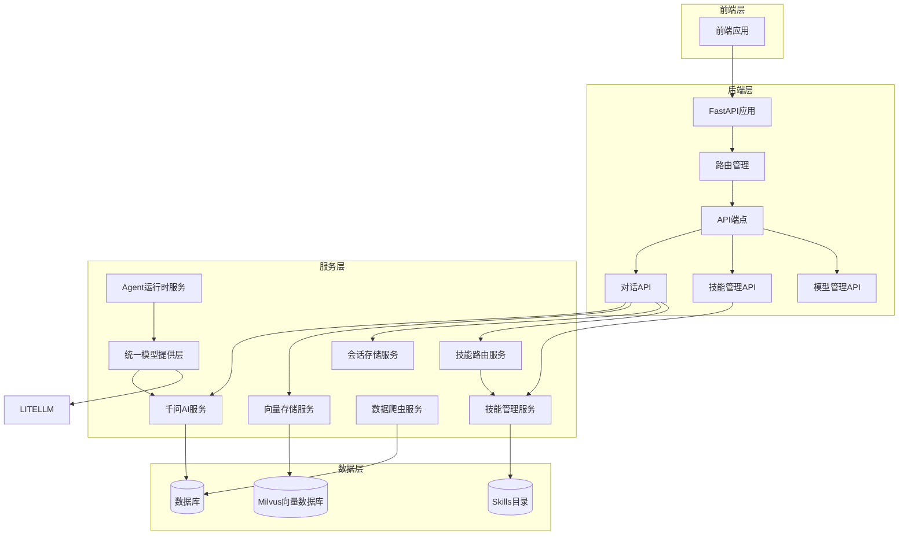

**图表来源**
- [main.py:1-853](file://backend/main.py#L1-L853)
- [chat.py:1-224](file://backend/app/api/chat.py#L1-L224)
- [agent_runtime.py:1-136](file://backend/app/services/agent_runtime.py#L1-L136)
- [skill_manager.py:1-189](file://backend/app/services/skill_manager.py#L1-L189)

**章节来源**
- [main.py:1-853](file://backend/main.py#L1-L853)
- [requirements.txt:1-56](file://backend/requirements.txt#L1-L56)

## 核心组件

### AI服务插件架构

系统采用插件化设计，主要核心组件包括：

#### 1. EducationOptions类
教育选项查询的核心工具类，提供完整的教育数据选项管理：

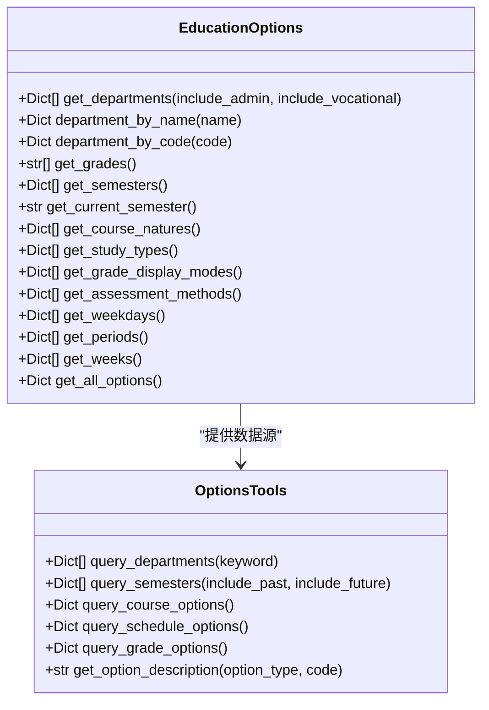

**图表来源**
- [education_options.py:130-420](file://backend/education_options.py#L130-L420)

#### 2. Agent运行时服务
支持框架无关的代理执行，提供OpenAI Agents SDK和LangGraph的统一接口：

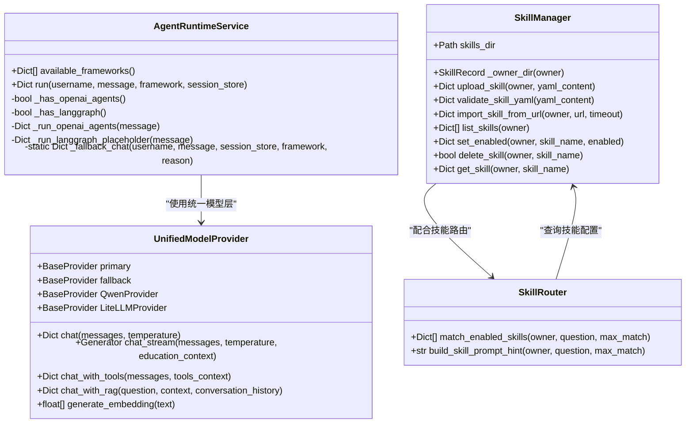

**图表来源**
- [agent_runtime.py:21-135](file://backend/app/services/agent_runtime.py#L21-L135)
- [skill_manager.py:28-188](file://backend/app/services/skill_manager.py#L28-L188)
- [skill_router.py:13-50](file://backend/app/services/skill_router.py#L13-L50)
- [model_provider.py:189-299](file://backend/app/services/model_provider.py#L189-L299)

#### 3. AI服务接口
系统支持多种AI服务提供商的统一接口：

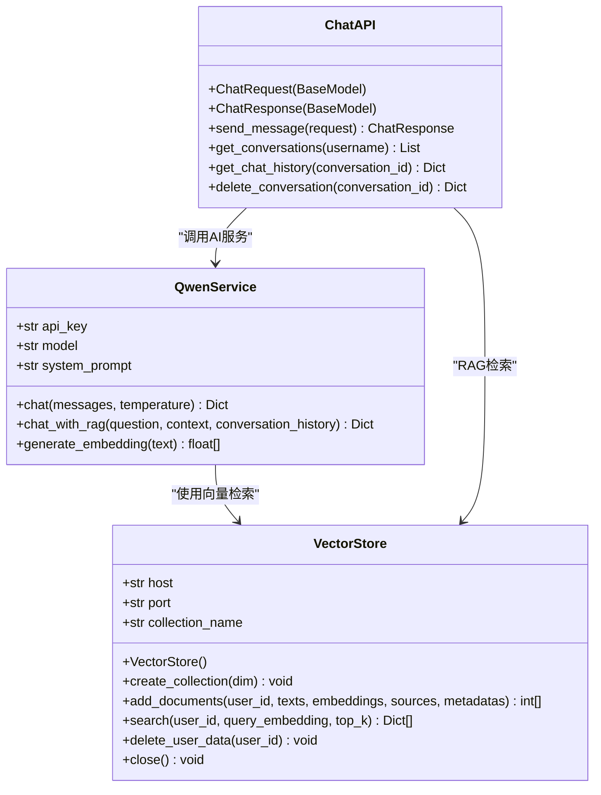

**图表来源**
- [qwen_service.py:15-178](file://backend/app/services/qwen_service.py#L15-L178)
- [vector_store.py:14-164](file://backend/app/services/vector_store.py#L14-L164)
- [chat.py:18-224](file://backend/app/api/chat.py#L18-L224)

**章节来源**
- [education_options.py:130-420](file://backend/education_options.py#L130-L420)
- [agent_runtime.py:21-135](file://backend/app/services/agent_runtime.py#L21-L135)
- [skill_manager.py:28-188](file://backend/app/services/skill_manager.py#L28-L188)
- [model_provider.py:189-299](file://backend/app/services/model_provider.py#L189-L299)
- [qwen_service.py:15-178](file://backend/app/services/qwen_service.py#L15-L178)
- [vector_store.py:14-164](file://backend/app/services/vector_store.py#L14-L164)
- [chat.py:18-224](file://backend/app/api/chat.py#L18-L224)

## 架构概览

系统采用微服务架构，通过API网关统一对外提供服务：

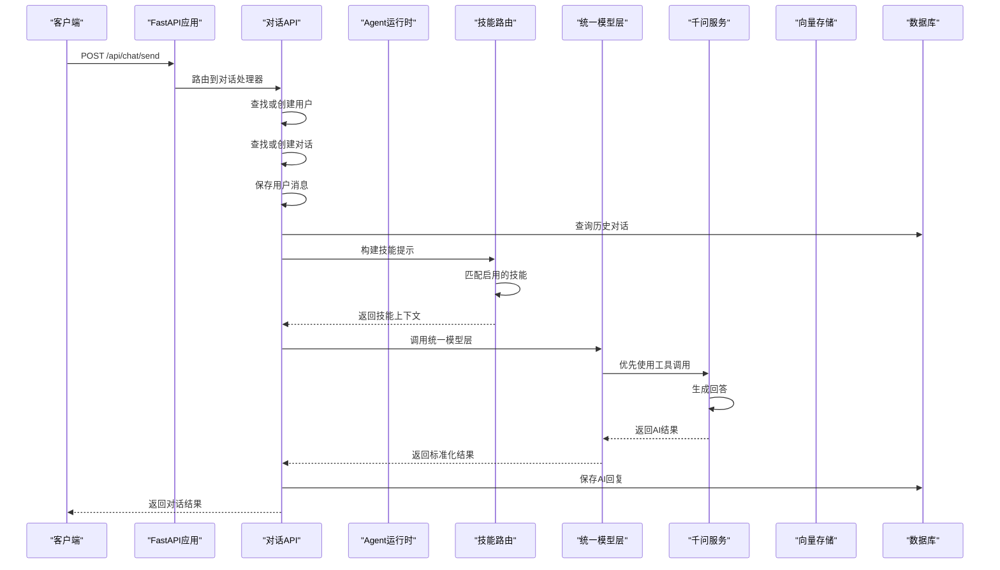

**图表来源**
- [chat.py:82-227](file://backend/app/api/chat.py#L82-L227)
- [agent_runtime.py:40-135](file://backend/app/services/agent_runtime.py#L40-L135)
- [skill_router.py:13-50](file://backend/app/services/skill_router.py#L13-L50)
- [model_provider.py:224-299](file://backend/app/services/model_provider.py#L224-L299)

## 详细组件分析

### AI工具函数体系详解

#### 1. 院系查询工具
`query_departments`函数提供灵活的院系查询能力：

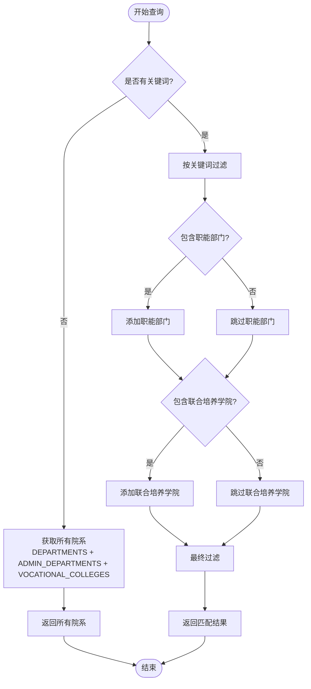

**图表来源**
- [education_options.py:264-287](file://backend/education_options.py#L264-L287)

#### 2. 学期查询工具
`query_semesters`函数支持灵活的学期查询策略：


**图表来源**
- [education_options.py:289-330](file://backend/education_options.py#L289-L330)

#### 3. 课程选项查询工具
`query_course_options`提供课程相关的完整选项体系：

| 选项类型 | 数据来源 | 用途 |
|---------|---------|------|
| 课程性质 | `COURSE_NATURES` | 必修、选修、通识等分类 |
| 修读类别 | `STUDY_TYPES` | 主修、辅修课程区分 |
| 考核方式 | `ASSESSMENT_METHODS` | 考试、考查等评估方式 |

**章节来源**
- [education_options.py:262-378](file://backend/education_options.py#L262-L378)

### Agent运行时服务详解

#### 1. 框架检测与选择
Agent运行时服务支持多种AI框架的自动检测和选择：

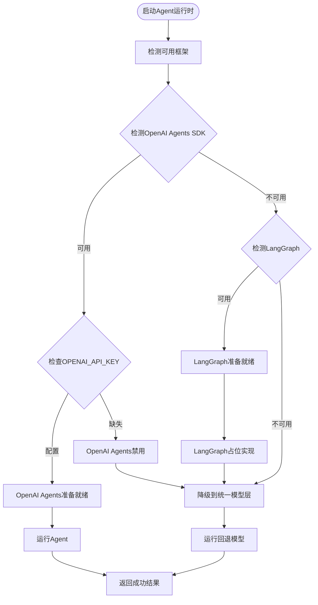

**图表来源**
- [agent_runtime.py:21-135](file://backend/app/services/agent_runtime.py#L21-L135)

#### 2. 技能管理服务
技能管理服务提供声明式的技能定义和管理功能：

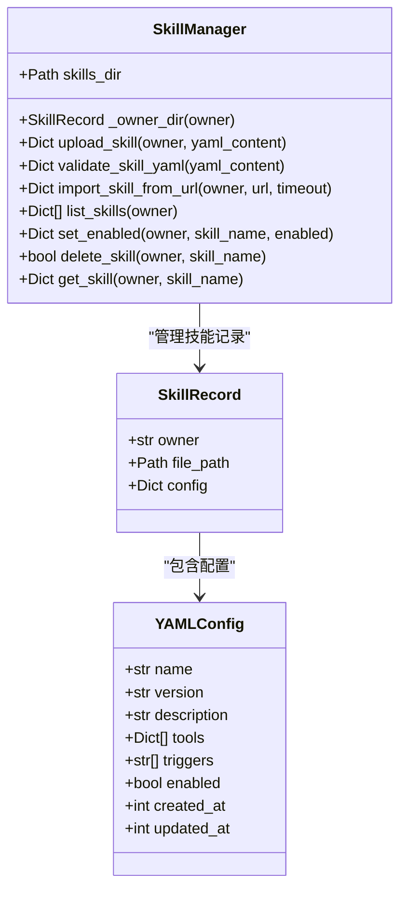

**图表来源**
- [skill_manager.py:28-188](file://backend/app/services/skill_manager.py#L28-L188)

#### 3. 技能路由服务
技能路由服务根据用户问题智能匹配启用的技能：

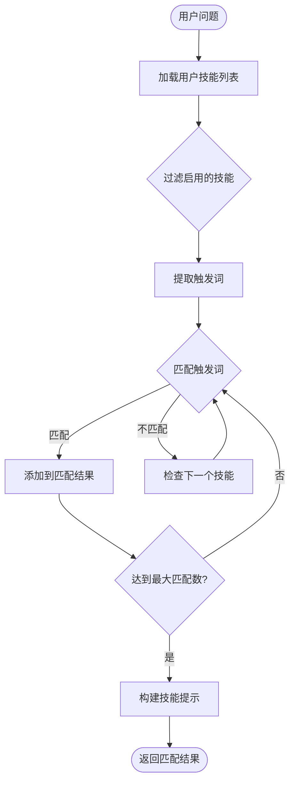

**图表来源**
- [skill_router.py:13-50](file://backend/app/services/skill_router.py#L13-L50)

### 统一模型提供层

#### 1. 多框架支持架构
统一模型提供层支持多种AI框架的无缝切换：

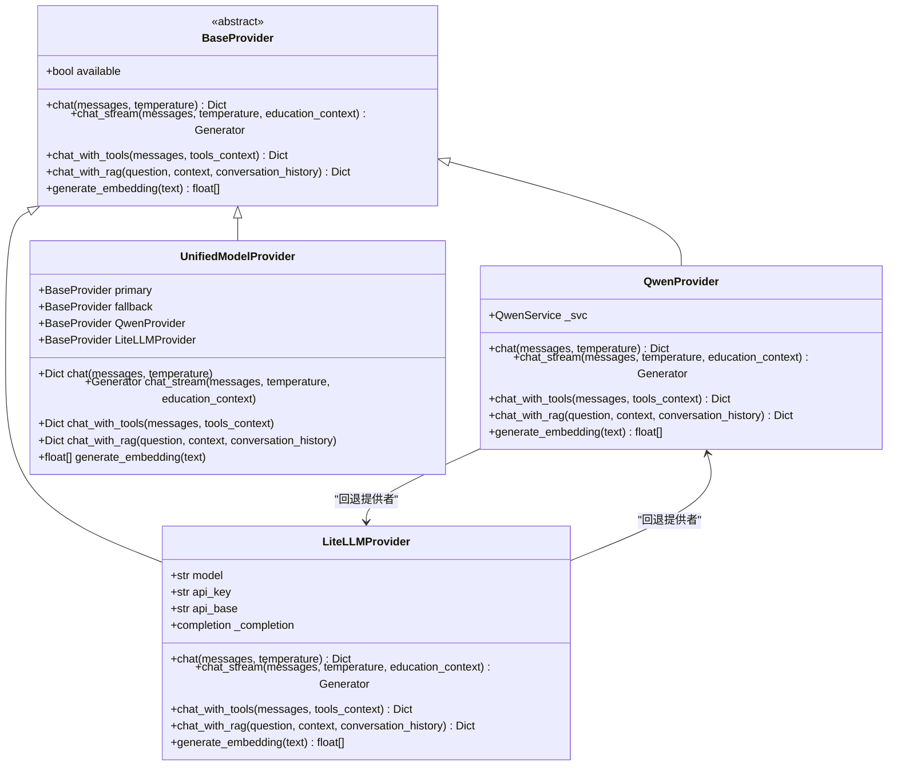

**图表来源**
- [model_provider.py:20-299](file://backend/app/services/model_provider.py#L20-L299)

#### 2. 会话存储与用户偏好
会话存储服务支持用户模型偏好的持久化管理：

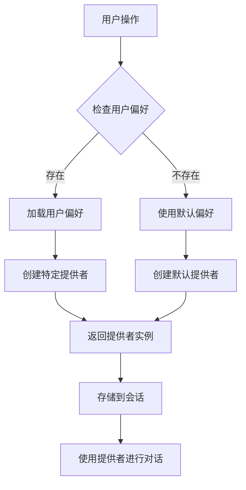

**图表来源**
- [session_store.py:195-211](file://backend/app/services/session_store.py#L195-L211)

### 新AI模型集成指南

#### 1. 模型接口定义
要集成新的AI模型，需要实现以下接口：

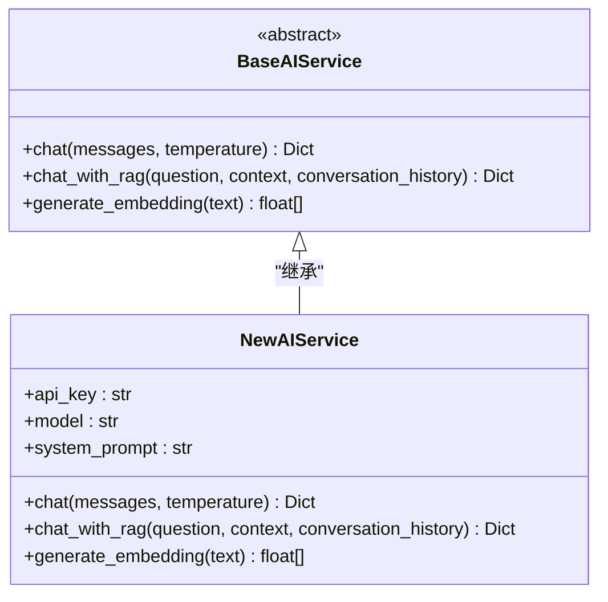

**图表来源**
- [qwen_service.py:15-178](file://backend/app/services/qwen_service.py#L15-L178)

#### 2. 配置参数
新模型的配置参数包括：

| 参数名称 | 类型 | 必需 | 默认值 | 描述 |
|---------|------|------|--------|------|
| `API_KEY` | str | 是 | - | AI服务API密钥 |
| `MODEL_NAME` | str | 否 | "qwen-plus" | 模型名称 |
| `TEMPERATURE` | float | 否 | 0.7 | 生成随机性控制 |
| `MAX_TOKENS` | int | 否 | 2048 | 最大生成tokens数 |

#### 3. 调用方式
新模型的调用遵循统一的接口规范：

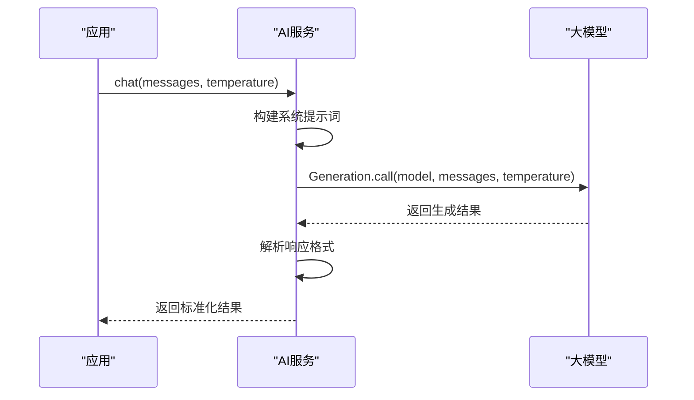

**图表来源**
- [qwen_service.py:39-90](file://backend/app/services/qwen_service.py#L39-L90)

**章节来源**
- [agent_runtime.py:21-135](file://backend/app/services/agent_runtime.py#L21-L135)
- [skill_manager.py:28-188](file://backend/app/services/skill_manager.py#L28-L188)
- [skill_router.py:13-50](file://backend/app/services/skill_router.py#L13-L50)
- [model_provider.py:189-299](file://backend/app/services/model_provider.py#L189-L299)
- [session_store.py:195-211](file://backend/app/services/session_store.py#L195-L211)
- [qwen_service.py:15-178](file://backend/app/services/qwen_service.py#L15-L178)

### AI工具函数开发规范

#### 1. 输入输出格式规范

##### 统一响应格式
所有AI工具函数应返回标准化的响应格式：

```json
{
  "success": true,
  "data": {},
  "count": 0,
  "message": ""
}
```

##### 错误处理规范
- **HTTP状态码**：使用标准HTTP状态码
- **错误消息**：提供清晰的错误描述
- **异常捕获**：统一的异常处理机制

#### 2. 性能优化策略

##### 缓存机制
- **会话缓存**：短期会话数据缓存
- **静态数据缓存**：教育选项数据缓存
- **向量缓存**：RAG检索结果缓存
- **技能缓存**：技能配置和匹配结果缓存

##### 异步处理
- **并发请求**：支持多个API请求并发处理
- **超时控制**：合理的请求超时设置
- **重试机制**：网络异常的自动重试

**章节来源**
- [chat.py:82-227](file://backend/app/api/chat.py#L82-L227)
- [main.py:132-328](file://backend/main.py#L132-L328)

### 教育选项查询功能扩展

#### 1. 新查询类型添加流程

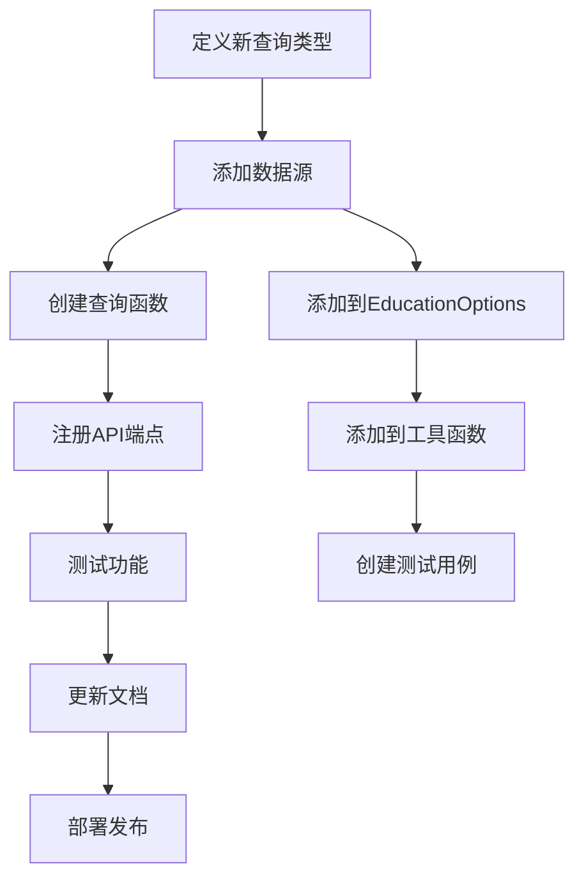

#### 2. 自定义选项扩展

##### 数据结构设计
```python
CUSTOM_OPTIONS = [
    {"code": "custom_code", "name": "自定义选项名称", "description": "详细描述"},
    # 更多选项...
]
```

##### 查询函数实现
```python
def query_custom_options(filter_param: str = "") -> List[Dict]:
    """AI工具：查询自定义选项
    
    Args:
        filter_param: 过滤参数
        
    Returns:
        匹配的选项列表
    """
    # 实现查询逻辑
    pass
```

**章节来源**
- [education_options.py:130-420](file://backend/education_options.py#L130-L420)

### 技能管理API详解

#### 1. 技能管理端点
系统提供完整的技能管理API接口：

| 端点 | 方法 | 功能 | 认证 |
|------|------|------|------|
| `/api/skills/{username}` | GET | 列出用户技能 | 是 |
| `/api/skills/upload` | POST | 上传技能YAML | 是 |
| `/api/skills/validate` | POST | 校验技能YAML | 是 |
| `/api/skills/import-url` | POST | 从URL导入技能 | 是 |
| `/api/skills/{skill_name}/enable` | POST | 启用/禁用技能 | 是 |
| `/api/skills/{skill_name}` | DELETE | 删除技能 | 是 |

#### 2. 技能配置规范
技能配置采用YAML声明式格式：

```yaml
name: sample_skill
version: 1.0.0
description: 示例技能
enabled: true
triggers:
  - "查询"
  - "课表"
  - "schedule"
tools:
  - name: query_schedule
    description: 查询课表
  - name: query_grades
    description: 查询成绩
```

**章节来源**
- [skills.py:38-104](file://backend/app/api/skills.py#L38-L104)
- [skill_manager.py:50-82](file://backend/app/services/skill_manager.py#L50-L82)
- [README.md:8-17](file://skills/README.md#L8-L17)

## 依赖关系分析

系统采用模块化的依赖管理，主要依赖关系如下：

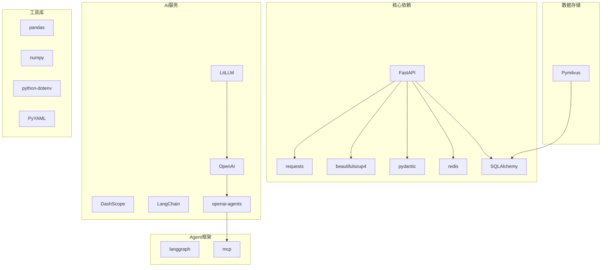

**图表来源**
- [requirements.txt:1-56](file://backend/requirements.txt#L1-L56)

**章节来源**
- [requirements.txt:1-56](file://backend/requirements.txt#L1-L56)

## 性能考虑

### 1. 缓存策略
- **短期缓存**：会话数据缓存5分钟
- **长期缓存**：教育选项数据缓存24小时
- **向量缓存**：RAG检索结果缓存1小时
- **技能缓存**：技能配置和匹配结果缓存10分钟

### 2. 并发处理
- **异步API**：支持高并发请求处理
- **连接池**：数据库和HTTP连接池管理
- **限流控制**：防止API滥用
- **框架检测**：动态选择最优执行框架

### 3. 内存优化
- **流式处理**：大文件下载和处理
- **分页查询**：大量数据的分页处理
- **及时释放**：及时释放不再使用的资源
- **会话隔离**：按用户隔离的内存管理

## 故障排除指南

### 1. 常见问题诊断

#### 登录问题
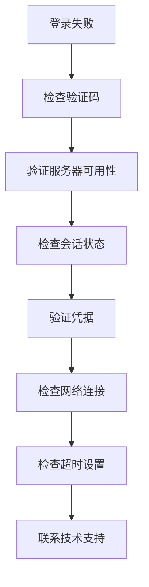

#### AI服务问题
- **API密钥错误**：检查环境变量配置
- **模型不可用**：验证模型名称和版本
- **请求超时**：调整超时参数和重试策略
- **框架检测失败**：检查依赖包安装状态

#### Agent运行时问题
- **OpenAI Agents不可用**：检查openai-agents包和API密钥
- **LangGraph未启用**：确认langgraph依赖安装
- **技能加载失败**：验证YAML格式和权限设置
- **回退机制异常**：检查统一模型层配置

### 2. 日志监控
系统提供详细的日志记录，包括：
- **请求日志**：所有API请求的详细信息
- **错误日志**：异常和错误的完整堆栈跟踪
- **性能日志**：响应时间和资源使用情况
- **框架日志**：Agent运行时和技能路由的详细信息

**章节来源**
- [main.py:132-328](file://backend/main.py#L132-L328)
- [chat.py:149-154](file://backend/app/api/chat.py#L149-L154)
- [agent_runtime.py:108-125](file://backend/app/services/agent_runtime.py#L108-L125)

## 结论

智能教务系统AI助手通过其插件化架构设计，为教育AI应用提供了高度可扩展的基础框架。**最新更新**增强了系统的智能化水平，主要优势包括：

1. **模块化设计**：清晰的分层架构便于维护和扩展
2. **插件化AI**：支持多种大语言模型的无缝集成
3. **智能代理运行**：支持OpenAI Agents SDK和LangGraph框架
4. **技能管理服务**：提供声明式的技能定义和路由功能
5. **统一模型提供层**：支持多框架、多模型的统一接口
6. **丰富的工具函数**：完善的教育选项查询体系
7. **RAG增强**：结合向量检索的智能问答能力
8. **性能优化**：全面的缓存和并发处理机制

该系统为后续的AI助手功能扩展奠定了坚实的基础，开发者可以根据具体需求添加新的AI模型、自定义工具函数、教育数据查询功能和智能技能。Agent Runtime服务和技能管理服务的集成，使得系统能够支持更复杂的代理运行场景和更灵活的技能组合，为构建真正智能的教务系统AI助手提供了强大的技术支撑。