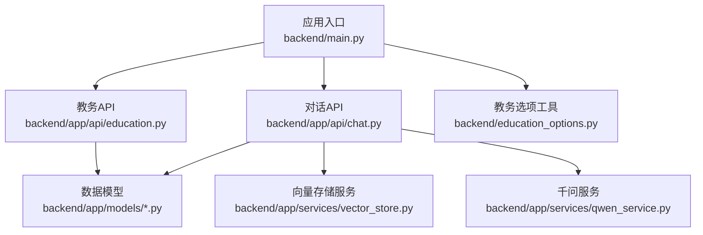
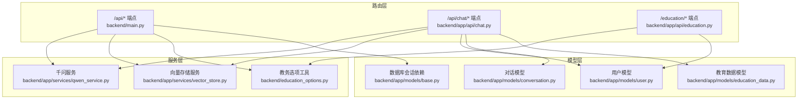
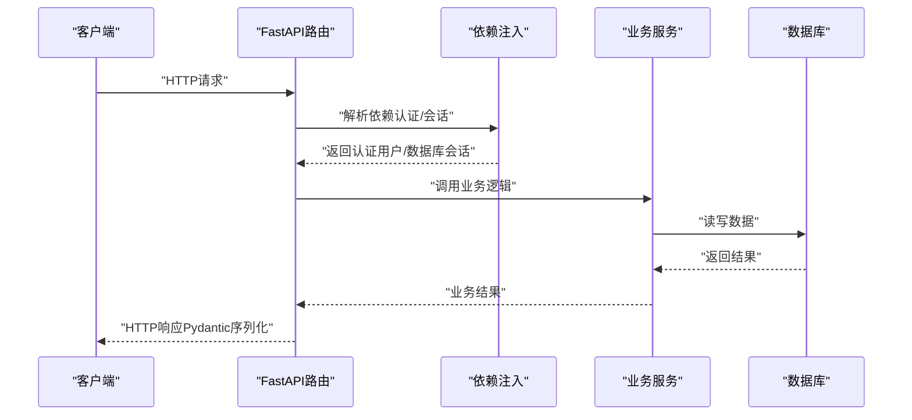
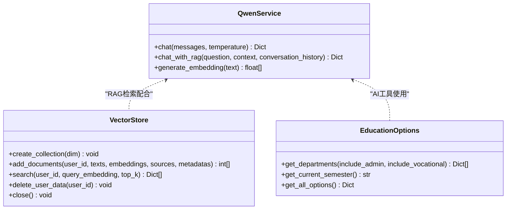
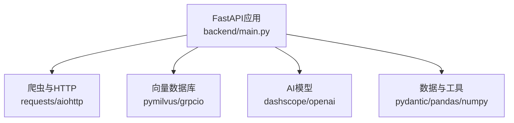
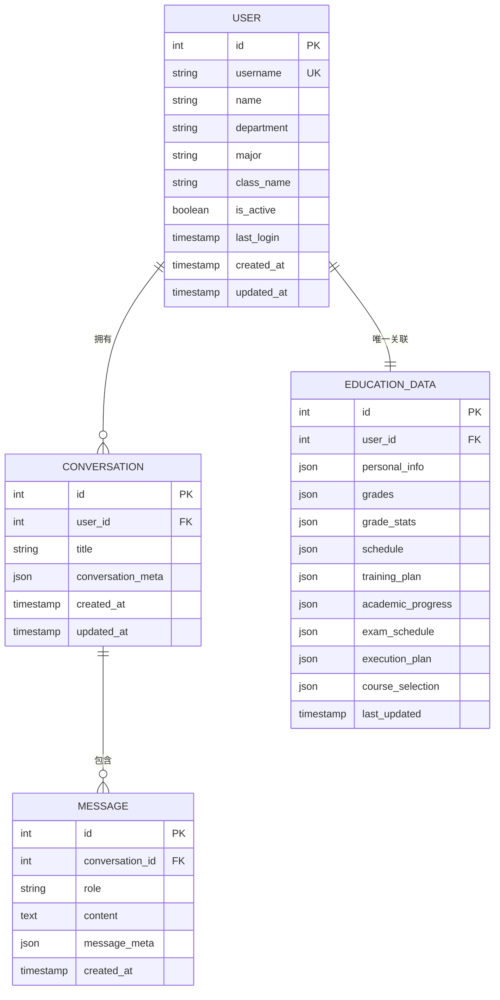

# API扩展点

<cite>
**本文档引用的文件**
- [backend/main.py](file://backend/main.py)
- [backend/app/api/education.py](file://backend/app/api/education.py)
- [backend/app/api/chat.py](file://backend/app/api/chat.py)
- [backend/app/models/base.py](file://backend/app/models/base.py)
- [backend/app/models/user.py](file://backend/app/models/user.py)
- [backend/app/models/conversation.py](file://backend/app/models/conversation.py)
- [backend/app/models/education_data.py](file://backend/app/models/education_data.py)
- [backend/app/services/vector_store.py](file://backend/app/services/vector_store.py)
- [backend/app/services/qwen_service.py](file://backend/app/services/qwen_service.py)
- [backend/education_options.py](file://backend/education_options.py)
- [backend/requirements.txt](file://backend/requirements.txt)
- [backend/test_login.py](file://backend/test_login.py)
</cite>

## 目录
1. [简介](#简介)
2. [项目结构](#项目结构)
3. [核心组件](#核心组件)
4. [架构总览](#架构总览)
5. [详细组件分析](#详细组件分析)
6. [依赖分析](#依赖分析)
7. [性能考虑](#性能考虑)
8. [故障排查指南](#故障排查指南)
9. [结论](#结论)
10. [附录](#附录)

## 简介
本文件面向智能教务系统API的扩展点，系统性阐述如何在现有FastAPI应用基础上添加新的API端点、自定义中间件与业务逻辑插件；详解路由扩展方法、请求处理链定制、中间件开发（认证、日志、性能监控）、业务插件架构（接口定义、生命周期、依赖注入）、API版本控制与向后兼容、安全扩展（CORS、速率限制、输入验证）、以及文档生成与测试扩展机制。

## 项目结构
后端采用FastAPI框架，按功能域划分模块：
- 应用入口与路由注册：backend/main.py
- 教务系统API：backend/app/api/education.py
- 对话API：backend/app/api/chat.py
- 数据模型：backend/app/models/*
- 服务层：backend/app/services/*
- 教务选项工具：backend/education_options.py
- 依赖声明：backend/requirements.txt
- 登录测试脚本：backend/test_login.py

**图表来源**
- [backend/main.py:1-120](file://backend/main.py#L1-L120)
- [backend/app/api/education.py:1-104](file://backend/app/api/education.py#L1-L104)
- [backend/app/api/chat.py:1-224](file://backend/app/api/chat.py#L1-L224)
- [backend/app/models/base.py:1-28](file://backend/app/models/base.py#L1-L28)
- [backend/app/services/vector_store.py:1-164](file://backend/app/services/vector_store.py#L1-L164)
- [backend/app/services/qwen_service.py:1-178](file://backend/app/services/qwen_service.py#L1-L178)
- [backend/education_options.py:1-420](file://backend/education_options.py#L1-L420)

**章节来源**
- [backend/main.py:1-120](file://backend/main.py#L1-L120)
- [backend/app/api/education.py:1-104](file://backend/app/api/education.py#L1-L104)
- [backend/app/api/chat.py:1-224](file://backend/app/api/chat.py#L1-L224)
- [backend/app/models/base.py:1-28](file://backend/app/models/base.py#L1-L28)
- [backend/education_options.py:1-420](file://backend/education_options.py#L1-L420)

## 核心组件
- FastAPI应用与中间件
  - CORS中间件配置，支持跨域访问
  - 根路径与健康检查端点
- 教务系统API
  - 验证码获取、登录、成绩查询、课表查询等
  - 使用Pydantic模型进行输入输出校验
- 对话API
  - 用户会话、消息持久化
  - RAG检索与千问对话集成
- 数据模型
  - 用户、对话、消息、教育数据等ORM模型
- 服务层
  - 向量存储（Milvus）与千问（DashScope）服务
- 教务选项工具
  - 院系、学期、课程性质等选项查询与AI工具函数

**章节来源**
- [backend/main.py:39-48](file://backend/main.py#L39-L48)
- [backend/app/api/education.py:13-104](file://backend/app/api/education.py#L13-L104)
- [backend/app/api/chat.py:14-224](file://backend/app/api/chat.py#L14-L224)
- [backend/app/models/user.py:11-33](file://backend/app/models/user.py#L11-L33)
- [backend/app/models/conversation.py:11-42](file://backend/app/models/conversation.py#L11-L42)
- [backend/app/models/education_data.py:11-103](file://backend/app/models/education_data.py#L11-L103)
- [backend/app/services/vector_store.py:14-164](file://backend/app/services/vector_store.py#L14-L164)
- [backend/app/services/qwen_service.py:15-178](file://backend/app/services/qwen_service.py#L15-L178)
- [backend/education_options.py:130-420](file://backend/education_options.py#L130-L420)

## 架构总览
系统采用“路由-服务-模型”三层结构：
- 路由层：FastAPI路由注册与装饰器
- 服务层：业务逻辑封装（如教务爬虫、AI服务、向量检索）
- 模型层：SQLAlchemy ORM模型与数据库会话依赖

**图表来源**
- [backend/main.py:27-80](file://backend/main.py#L27-L80)
- [backend/app/api/chat.py:11-14](file://backend/app/api/chat.py#L11-L14)
- [backend/app/api/education.py:8-11](file://backend/app/api/education.py#L8-L11)
- [backend/app/services/qwen_service.py:15-178](file://backend/app/services/qwen_service.py#L15-L178)
- [backend/app/services/vector_store.py:14-164](file://backend/app/services/vector_store.py#L14-L164)
- [backend/education_options.py:130-420](file://backend/education_options.py#L130-L420)
- [backend/app/models/user.py:11-33](file://backend/app/models/user.py#L11-L33)
- [backend/app/models/conversation.py:11-42](file://backend/app/models/conversation.py#L11-L42)
- [backend/app/models/education_data.py:11-103](file://backend/app/models/education_data.py#L11-L103)
- [backend/app/models/base.py:22-28](file://backend/app/models/base.py#L22-L28)

## 详细组件分析

### 路由扩展机制
- 新增API端点步骤
  - 在对应模块新增FastAPI路由与处理函数
  - 使用依赖注入获取数据库会话或认证用户
  - 使用Pydantic模型定义请求/响应结构
  - 在应用入口注册路由（如需动态导入）
- 路由装饰器与请求处理链
  - 使用依赖项（Depends）串联认证、数据库会话、业务服务
  - 异常统一通过HTTPException抛出，便于客户端处理
- 示例参考
  - 教务API路由与处理函数：[backend/app/api/education.py:13-104](file://backend/app/api/education.py#L13-L104)
  - 对话API路由与处理函数：[backend/app/api/chat.py:15-224](file://backend/app/api/chat.py#L15-L224)
  - 应用入口路由注册与CORS配置：[backend/main.py:27-80](file://backend/main.py#L27-L80)

**图表来源**
- [backend/app/api/education.py:59-77](file://backend/app/api/education.py#L59-L77)
- [backend/app/api/chat.py:46-154](file://backend/app/api/chat.py#L46-L154)
- [backend/app/models/base.py:22-28](file://backend/app/models/base.py#L22-L28)

**章节来源**
- [backend/app/api/education.py:13-104](file://backend/app/api/education.py#L13-L104)
- [backend/app/api/chat.py:15-224](file://backend/app/api/chat.py#L15-L224)
- [backend/main.py:27-80](file://backend/main.py#L27-L80)

### 中间件开发指南
- CORS中间件
  - 配置允许的源、方法、头等，开发默认允许所有，生产需收紧
  - 参考：[backend/main.py:41-48](file://backend/main.py#L41-L48)
- 认证中间件
  - 可在应用级别添加认证中间件，或在路由上使用Depends(get_current_user)
  - 参考认证依赖：[backend/app/api/education.py:10](file://backend/app/api/education.py#L10)
- 日志中间件
  - 使用标准日志库记录请求/响应与异常
  - 参考：[backend/app/api/chat.py:14](file://backend/app/api/chat.py#L14)
- 性能监控中间件
  - 可在应用级别添加中间件统计请求耗时、并发数等指标
  - 参考：[backend/main.py:35-37](file://backend/main.py#L35-L37)

**章节来源**
- [backend/main.py:41-48](file://backend/main.py#L41-L48)
- [backend/app/api/education.py:10](file://backend/app/api/education.py#L10)
- [backend/app/api/chat.py:14](file://backend/app/api/chat.py#L14)
- [backend/main.py:35-37](file://backend/main.py#L35-L37)

### 业务逻辑插件架构
- 插件接口定义
  - 以服务类形式暴露统一方法（如chat、chat_with_rag、search、add_documents等）
  - 通过全局实例在路由中注入使用
- 生命周期管理
  - 初始化连接（数据库、向量库、第三方API）
  - 资源清理（关闭连接）
- 依赖注入机制
  - 使用FastAPI依赖项注入数据库会话与认证用户
  - 服务类内部通过构造函数注入配置与外部依赖

**图表来源**
- [backend/app/services/qwen_service.py:15-178](file://backend/app/services/qwen_service.py#L15-L178)
- [backend/app/services/vector_store.py:14-164](file://backend/app/services/vector_store.py#L14-L164)
- [backend/education_options.py:130-420](file://backend/education_options.py#L130-L420)

**章节来源**
- [backend/app/services/qwen_service.py:15-178](file://backend/app/services/qwen_service.py#L15-L178)
- [backend/app/services/vector_store.py:14-164](file://backend/app/services/vector_store.py#L14-L164)
- [backend/education_options.py:130-420](file://backend/education_options.py#L130-L420)

### API版本控制与向后兼容
- 版本路由
  - 可在应用入口为不同版本设置前缀（如/v1、/v2），并分别注册路由
  - 参考现有路由前缀风格：[backend/app/api/education.py:13](file://backend/app/api/education.py#L13)、[backend/app/api/chat.py:15](file://backend/app/api/chat.py#L15)
- 弃用策略
  - 对即将废弃的端点返回弃用警告头或在响应中注明
  - 在文档中明确标注弃用时间线
- 迁移指南
  - 提供新旧端点对比与迁移步骤
  - 逐步引导客户端切换至新版本端点

**章节来源**
- [backend/app/api/education.py:13](file://backend/app/api/education.py#L13)
- [backend/app/api/chat.py:15](file://backend/app/api/chat.py#L15)

### API安全扩展最佳实践
- CORS配置
  - 生产环境限制allow_origins，仅允许可信域名
  - 参考：[backend/main.py:41-48](file://backend/main.py#L41-L48)
- 速率限制
  - 可在应用级或路由级添加限流中间件，防止滥用
- 输入验证
  - 使用Pydantic模型进行请求参数校验
  - 参考：[backend/app/api/education.py:21-31](file://backend/app/api/education.py#L21-L31)、[backend/app/api/chat.py:20-33](file://backend/app/api/chat.py#L20-L33)
- 认证与授权
  - 使用依赖注入获取当前用户，未登录拒绝访问
  - 参考：[backend/app/api/education.py:60-64](file://backend/app/api/education.py#L60-L64)

**章节来源**
- [backend/main.py:41-48](file://backend/main.py#L41-L48)
- [backend/app/api/education.py:21-31](file://backend/app/api/education.py#L21-L31)
- [backend/app/api/chat.py:20-33](file://backend/app/api/chat.py#L20-L33)
- [backend/app/api/education.py:60-64](file://backend/app/api/education.py#L60-L64)

### API文档生成与测试扩展
- 文档生成
  - FastAPI自动基于路由与Pydantic模型生成OpenAPI文档
  - 可通过应用标题与版本进行标识
  - 参考：[backend/main.py:39](file://backend/main.py#L39)
- 自动化测试
  - 登录测试脚本演示验证码与登录流程
  - 参考：[backend/test_login.py:19-74](file://backend/test_login.py#L19-L74)
- 性能基准测试
  - 可结合负载测试工具对关键端点（如登录、成绩查询、对话）进行压测
  - 结合日志与指标中间件评估吞吐与延迟

**章节来源**
- [backend/main.py:39](file://backend/main.py#L39)
- [backend/test_login.py:19-74](file://backend/test_login.py#L19-L74)

## 依赖分析
- 外部依赖
  - web框架与HTTP：fastapi、uvicorn、requests、aiohttp
  - HTML解析与爬虫：beautifulsoup4、lxml、pyppeteer、selenium
  - 缓存与向量：redis、grpcio、pymilvus
  - AI模型：dashscope、openai
  - 工具与数据：python-dotenv、pillow、pydantic、pandas、numpy
- 依赖安装与版本
  - 参考：[backend/requirements.txt:1-44](file://backend/requirements.txt#L1-L44)

**图表来源**
- [backend/requirements.txt:1-44](file://backend/requirements.txt#L1-L44)
- [backend/main.py:5-13](file://backend/main.py#L5-L13)

**章节来源**
- [backend/requirements.txt:1-44](file://backend/requirements.txt#L1-L44)
- [backend/main.py:5-13](file://backend/main.py#L5-L13)

## 性能考虑
- 连接池与会话管理
  - 数据库会话按请求创建与释放，避免长连接泄漏
  - 参考：[backend/app/models/base.py:22-28](file://backend/app/models/base.py#L22-L28)
- 向量检索优化
  - 合理设置索引参数与nprobe，平衡召回率与性能
  - 参考：[backend/app/services/vector_store.py:60-65](file://backend/app/services/vector_store.py#L60-L65)
- AI调用成本控制
  - 控制上下文长度与温度参数，减少token消耗
  - 参考：[backend/app/services/qwen_service.py:39-89](file://backend/app/services/qwen_service.py#L39-L89)

**章节来源**
- [backend/app/models/base.py:22-28](file://backend/app/models/base.py#L22-L28)
- [backend/app/services/vector_store.py:60-65](file://backend/app/services/vector_store.py#L60-L65)
- [backend/app/services/qwen_service.py:39-89](file://backend/app/services/qwen_service.py#L39-L89)

## 故障排查指南
- 登录失败排查
  - 验证验证码是否过期、服务器选择是否正确
  - 参考：[backend/main.py:192-327](file://backend/main.py#L192-L327)
- 数据库连接问题
  - 检查DATABASE_URL环境变量与PostgreSQL服务状态
  - 参考：[backend/app/models/base.py:10-18](file://backend/app/models/base.py#L10-L18)
- 向量库连接失败
  - 检查MILVUS_HOST/MILVUS_PORT与集合是否存在
  - 参考：[backend/app/services/vector_store.py:24-35](file://backend/app/services/vector_store.py#L24-L35)
- AI服务异常
  - 检查QWEN_API_KEY与模型配置
  - 参考：[backend/app/services/qwen_service.py:18-21](file://backend/app/services/qwen_service.py#L18-L21)

**章节来源**
- [backend/main.py:192-327](file://backend/main.py#L192-L327)
- [backend/app/models/base.py:10-18](file://backend/app/models/base.py#L10-L18)
- [backend/app/services/vector_store.py:24-35](file://backend/app/services/vector_store.py#L24-L35)
- [backend/app/services/qwen_service.py:18-21](file://backend/app/services/qwen_service.py#L18-L21)

## 结论
本系统通过清晰的路由-服务-模型分层与依赖注入，提供了良好的扩展性。新增API端点只需遵循现有模式（路由+依赖+Pydantic模型），并通过应用入口注册即可快速上线。中间件与安全策略可按需增强，版本控制与向后兼容可通过前缀路由与弃用策略保障。结合日志与指标中间件，可有效支撑性能优化与故障排查。

## 附录
- 新功能模块集成清单
  - 定义路由与处理函数
  - 定义Pydantic请求/响应模型
  - 实现业务服务类与依赖注入
  - 在应用入口注册路由
  - 补充单元测试与集成测试
- 教育数据模型概览

**图表来源**
- [backend/app/models/user.py:11-33](file://backend/app/models/user.py#L11-L33)
- [backend/app/models/conversation.py:11-42](file://backend/app/models/conversation.py#L11-L42)
- [backend/app/models/education_data.py:11-103](file://backend/app/models/education_data.py#L11-L103)