# Agent运行时服务

<cite>
**本文档引用的文件**
- [backend/main.py](file://backend/main.py)
- [backend/app/core/runtime.py](file://backend/app/core/runtime.py)
- [backend/app/services/agent_runtime.py](file://backend/app/services/agent_runtime.py)
- [backend/app/api/agents.py](file://backend/app/api/agents.py)
- [backend/app/models/conversation.py](file://backend/app/models/conversation.py)
- [backend/app/services/model_provider.py](file://backend/app/services/model_provider.py)
- [backend/app/services/session_store.py](file://backend/app/services/session_store.py)
- [backend/app/security.py](file://backend/app/security.py)
- [backend/app/models/base.py](file://backend/app/models/base.py)
- [backend/app/api/chat.py](file://backend/app/api/chat.py)
- [backend/app/services/qwen_service.py](file://backend/app/services/qwen_service.py)
- [backend/app/services/vector_store.py](file://backend/app/services/vector_store.py)
- [backend/app/services/skill_router.py](file://backend/app/services/skill_router.py)
- [backend/app/models/user.py](file://backend/app/models/user.py)
- [backend/app/models/education_data.py](file://backend/app/models/education_data.py)
- [backend/requirements.txt](file://backend/requirements.txt)
</cite>

## 更新摘要
**变更内容**
- 更新了LangGraph集成章节，反映完整的StateGraph实现
- 新增了环境变量验证和错误处理机制的详细说明
- 补充了状态管理功能的技术细节
- 更新了依赖关系和配置要求

## 目录
1. [简介](#简介)
2. [项目结构](#项目结构)
3. [核心组件](#核心组件)
4. [架构总览](#架构总览)
5. [详细组件分析](#详细组件分析)
6. [依赖关系分析](#依赖关系分析)
7. [性能考虑](#性能考虑)
8. [故障排除指南](#故障排除指南)
9. [结论](#结论)

## 简介
本项目是一个面向高校教务场景的智能体运行时服务，提供统一的Agent运行框架、多模型提供层、会话与安全隔离、以及与教务系统的工具链集成。系统支持多种运行框架（OpenAI Agents SDK、LangGraph），具备自动降级机制，优先通过工具调用访问真实教务数据，其次使用向量检索（RAG）增强回答，最后回退到纯模型对话。同时提供完整的对话历史管理、用户会话存储、以及严格的用户名隔离保障。

## 项目结构
后端采用FastAPI框架，按功能模块划分清晰：
- 应用入口与路由注册：backend/main.py
- 运行时与可选依赖探测：backend/app/core/runtime.py
- Agent运行时服务：backend/app/services/agent_runtime.py
- Agent运行时API：backend/app/api/agents.py
- 模型提供层（统一抽象）：backend/app/services/model_provider.py
- 会话存储（Redis/内存）：backend/app/services/session_store.py
- 安全隔离（用户名校验）：backend/app/security.py
- 数据库基础与模型：backend/app/models/base.py、backend/app/models/user.py、backend/app/models/education_data.py、backend/app/models/conversation.py
- 对话API（含工具调用、RAG、流式）：backend/app/api/chat.py
- 千问服务（DashScope）：backend/app/services/qwen_service.py
- 向量库服务（Milvus）：backend/app/services/vector_store.py
- 技能路由：backend/app/services/skill_router.py

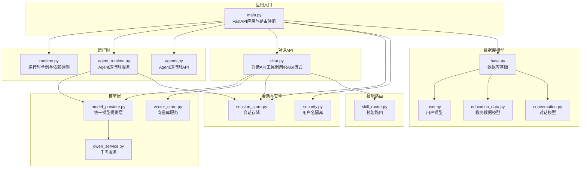

**图表来源**
- [backend/main.py:1-120](file://backend/main.py#L1-L120)
- [backend/app/core/runtime.py:1-28](file://backend/app/core/runtime.py#L1-L28)
- [backend/app/services/agent_runtime.py:1-177](file://backend/app/services/agent_runtime.py#L1-L177)
- [backend/app/api/agents.py:1-40](file://backend/app/api/agents.py#L1-L40)
- [backend/app/services/model_provider.py:1-299](file://backend/app/services/model_provider.py#L1-L299)
- [backend/app/services/qwen_service.py:1-604](file://backend/app/services/qwen_service.py#L1-L604)
- [backend/app/services/vector_store.py:1-253](file://backend/app/services/vector_store.py#L1-L253)
- [backend/app/services/session_store.py:1-225](file://backend/app/services/session_store.py#L1-L225)
- [backend/app/security.py:1-26](file://backend/app/security.py#L1-L26)
- [backend/app/models/base.py:1-29](file://backend/app/models/base.py#L1-L29)
- [backend/app/models/user.py:1-33](file://backend/app/models/user.py#L1-L33)
- [backend/app/models/education_data.py:1-103](file://backend/app/models/education_data.py#L1-L103)
- [backend/app/models/conversation.py:1-42](file://backend/app/models/conversation.py#L1-L42)
- [backend/app/api/chat.py:1-609](file://backend/app/api/chat.py#L1-L609)
- [backend/app/services/skill_router.py:1-50](file://backend/app/services/skill_router.py#L1-L50)

**章节来源**
- [backend/main.py:1-120](file://backend/main.py#L1-L120)
- [backend/app/core/runtime.py:1-28](file://backend/app/core/runtime.py#L1-L28)

## 核心组件
- Agent运行时服务：支持OpenAI Agents SDK与LangGraph两种框架，具备自动检测与降级能力，优先通过统一模型层进行回退。
- 统一模型提供层：抽象不同模型提供商（Qwen/LiteLLM），提供统一接口，支持工具调用、RAG、流式对话与嵌入生成。
- 会话存储：支持Redis持久化与内存回退，提供验证码、用户会话、认证会话、同步状态与模型偏好等会话管理。
- 安全隔离：通过服务端会话与Cookie双重校验，确保用户名隔离，防止越权访问。
- 数据库模型：用户、教育数据、对话与消息的ORM模型，支持对话历史与教务数据的持久化。
- 对话API：提供消息发送、对话历史查询、删除、以及SSE流式对话，内置工具调用与RAG增强。
- 向量库服务：基于Milvus的向量检索，支持按用户、数据类型与学期过滤，用于RAG增强。
- 技能路由：根据用户问题匹配启用的技能，生成系统提示以引导模型优先使用相应工具。

**章节来源**
- [backend/app/services/agent_runtime.py:1-177](file://backend/app/services/agent_runtime.py#L1-L177)
- [backend/app/services/model_provider.py:1-299](file://backend/app/services/model_provider.py#L1-L299)
- [backend/app/services/session_store.py:1-225](file://backend/app/services/session_store.py#L1-L225)
- [backend/app/security.py:1-26](file://backend/app/security.py#L1-L26)
- [backend/app/models/user.py:1-33](file://backend/app/models/user.py#L1-L33)
- [backend/app/models/education_data.py:1-103](file://backend/app/models/education_data.py#L1-L103)
- [backend/app/models/conversation.py:1-42](file://backend/app/models/conversation.py#L1-L42)
- [backend/app/api/chat.py:1-609](file://backend/app/api/chat.py#L1-L609)
- [backend/app/services/vector_store.py:1-253](file://backend/app/services/vector_store.py#L1-L253)
- [backend/app/services/skill_router.py:1-50](file://backend/app/services/skill_router.py#L1-L50)

## 架构总览
系统采用"API层-运行时层-模型层-数据层"的分层架构。Agent运行时服务作为可插拔框架入口，统一调度模型提供层；对话API负责用户交互与上下文构建，优先触发工具调用，其次RAG检索，最后纯模型对话；会话存储与安全隔离贯穿始终，确保数据与会话安全。

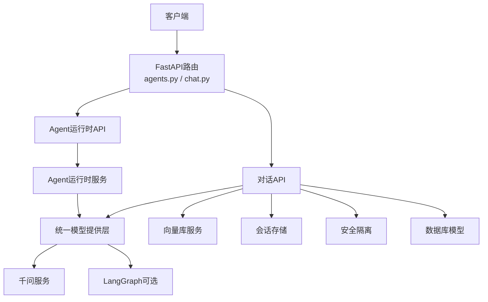

**图表来源**
- [backend/app/api/agents.py:1-40](file://backend/app/api/agents.py#L1-L40)
- [backend/app/services/agent_runtime.py:1-177](file://backend/app/services/agent_runtime.py#L1-L177)
- [backend/app/services/model_provider.py:1-299](file://backend/app/services/model_provider.py#L1-L299)
- [backend/app/services/qwen_service.py:1-604](file://backend/app/services/qwen_service.py#L1-L604)
- [backend/app/api/chat.py:1-609](file://backend/app/api/chat.py#L1-L609)
- [backend/app/services/vector_store.py:1-253](file://backend/app/services/vector_store.py#L1-L253)
- [backend/app/services/session_store.py:1-225](file://backend/app/services/session_store.py#L1-L225)
- [backend/app/security.py:1-26](file://backend/app/security.py#L1-L26)
- [backend/app/models/base.py:1-29](file://backend/app/models/base.py#L1-L29)

## 详细组件分析

### Agent运行时服务
- 功能概述：提供可插拔的Agent运行框架选择（OpenAI Agents SDK、LangGraph），自动检测依赖并降级至统一模型层。
- 关键特性：
  - 框架检测：通过模块导入检测可用框架。
  - 降级策略：任一框架失败时，自动回退到统一模型层的chat接口。
  - 统一输出：标准化返回success/content/framework/usage等字段。
  - 环境变量验证：LangGraph需要OPENAI_API_KEY配置。
  - 错误处理：捕获异常并返回详细错误信息，包括事件循环冲突检测。
- **LangGraph重大改进**：
  - 实现了完整的StateGraph状态管理
  - 支持GraphState类进行状态跟踪
  - 添加了事件循环冲突的专门错误处理
  - 集成了ChatOpenAI作为LangGraph的LLM后端

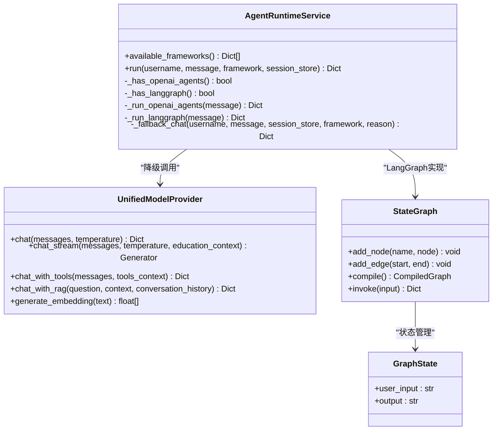

**图表来源**
- [backend/app/services/agent_runtime.py:21-177](file://backend/app/services/agent_runtime.py#L21-L177)
- [backend/app/services/model_provider.py:189-299](file://backend/app/services/model_provider.py#L189-L299)

**章节来源**
- [backend/app/services/agent_runtime.py:1-177](file://backend/app/services/agent_runtime.py#L1-L177)

### Agent运行时API
- 功能概述：提供Agent运行时的HTTP接口，支持查询可用框架与执行Agent。
- 关键特性：
  - GET /api/agents/frameworks：返回可用框架列表与依赖要求。
  - POST /api/agents/run：执行Agent，强制用户名隔离校验，传递会话存储。
- 错误处理：框架不可用或执行失败时返回HTTP 500。

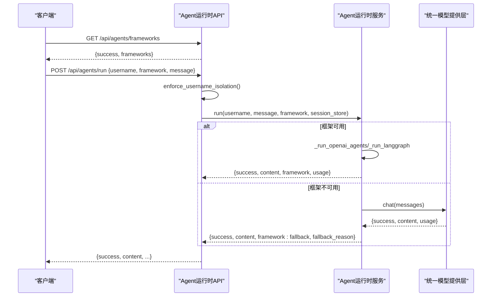

**图表来源**
- [backend/app/api/agents.py:20-40](file://backend/app/api/agents.py#L20-L40)
- [backend/app/services/agent_runtime.py:40-166](file://backend/app/services/agent_runtime.py#L40-L166)
- [backend/app/services/model_provider.py:224-272](file://backend/app/services/model_provider.py#L224-L272)

**章节来源**
- [backend/app/api/agents.py:1-40](file://backend/app/api/agents.py#L1-L40)

### 统一模型提供层
- 功能概述：抽象不同模型提供商，提供统一接口，支持工具调用、RAG、流式对话与嵌入生成。
- 设计要点：
  - BaseProvider：定义统一接口。
  - QwenProvider：兼容现有实现，封装DashScope调用。
  - LiteLLMProvider：可选接入，部分功能回退到QwenProvider。
  - UnifiedModelProvider：主Provider由环境变量决定，默认Qwen；失败时自动回退。
- 流式与工具调用：在主通道异常时自动回退到QwenProvider，保证可用性。

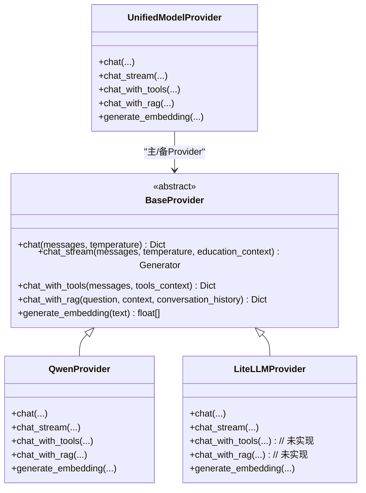

**图表来源**
- [backend/app/services/model_provider.py:20-299](file://backend/app/services/model_provider.py#L20-L299)

**章节来源**
- [backend/app/services/model_provider.py:1-299](file://backend/app/services/model_provider.py#L1-L299)

### 会话存储服务
- 功能概述：提供Redis与内存双栈会话存储，支持验证码、用户会话、认证会话、同步状态与模型偏好。
- 设计要点：
  - 自动探测Redis可用性，不可用时回退内存存储。
  - 提供序列化/反序列化会话对象，确保跨模块共享。
  - TTL控制与键空间管理，支持列表查询与清理。

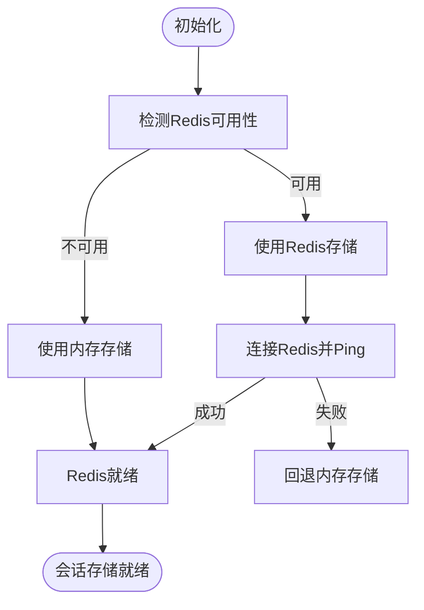

**图表来源**
- [backend/app/services/session_store.py:39-54](file://backend/app/services/session_store.py#L39-L54)

**章节来源**
- [backend/app/services/session_store.py:1-225](file://backend/app/services/session_store.py#L1-L225)

### 安全隔离
- 功能概述：通过服务端会话与Cookie双重校验，确保用户名隔离，防止越权访问。
- 校验流程：
  - 优先使用auth_session_id从会话存储获取username并比对。
  - 兼容旧版session_username Cookie校验。
  - 任一不一致即返回401/403。

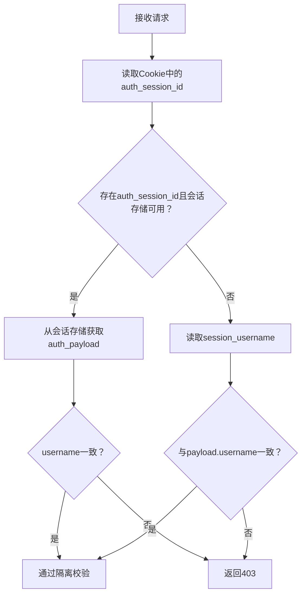

**图表来源**
- [backend/app/security.py:4-26](file://backend/app/security.py#L4-L26)

**章节来源**
- [backend/app/security.py:1-26](file://backend/app/security.py#L1-L26)

### 数据库模型
- 用户模型：包含学号、姓名、学院、专业、班级、激活状态与时间戳。
- 教务数据模型：存储个人信息、成绩、课表、培养方案、学业进度、考试安排、执行计划、选课信息等JSON字段。
- 对话模型：会话与消息的关联关系，支持级联删除与元数据存储。

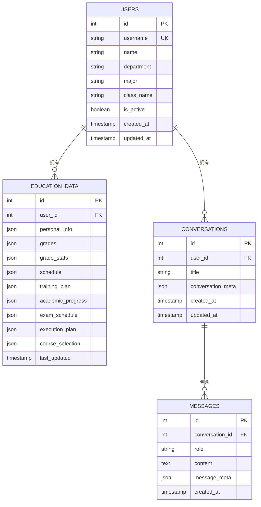

**图表来源**
- [backend/app/models/user.py:11-33](file://backend/app/models/user.py#L11-L33)
- [backend/app/models/education_data.py:11-103](file://backend/app/models/education_data.py#L11-L103)
- [backend/app/models/conversation.py:11-42](file://backend/app/models/conversation.py#L11-L42)

**章节来源**
- [backend/app/models/user.py:1-33](file://backend/app/models/user.py#L1-L33)
- [backend/app/models/education_data.py:1-103](file://backend/app/models/education_data.py#L1-L103)
- [backend/app/models/conversation.py:1-42](file://backend/app/models/conversation.py#L1-L42)

### 对话API（工具调用/RAG/流式）
- 功能概述：提供消息发送、对话历史查询、删除与SSE流式对话；优先工具调用，其次RAG，最后纯对话。
- 关键流程：
  - 用户隔离校验与会话存储获取。
  - 构建历史消息与技能提示上下文。
  - 工具调用（Function Calling）：优先尝试，失败则回退。
  - RAG兜底：向量检索+模型增强回答。
  - 纯对话：无数据时直接调用模型。
  - 流式对话：SSE推送增量内容，支持keepalive与异常恢复。
- 输出：标准化success/message/conversation_id/sources/tool_calls/usage。

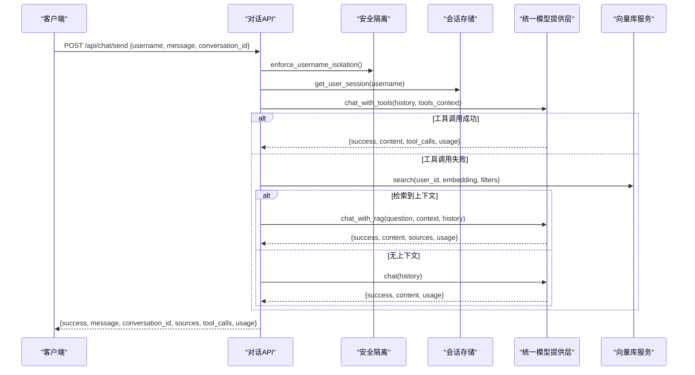

**图表来源**
- [backend/app/api/chat.py:82-227](file://backend/app/api/chat.py#L82-L227)
- [backend/app/services/model_provider.py:246-272](file://backend/app/services/model_provider.py#L246-L272)
- [backend/app/services/vector_store.py:149-210](file://backend/app/services/vector_store.py#L149-L210)

**章节来源**
- [backend/app/api/chat.py:1-609](file://backend/app/api/chat.py#L1-L609)

### 千问服务（DashScope）
- 功能概述：封装DashScope Generation API，提供对话、流式对话、工具调用、RAG与嵌入生成。
- 工具调用：定义多类工具（个人信息、成绩、课表、考试、学业进度、培养方案、刷新数据），与爬虫JwxtScraper协作获取真实数据。
- RAG增强：基于检索到的上下文构造提示词，调用模型生成回答并返回引用来源。
- 嵌入生成：调用TextEmbedding接口生成向量（实际项目中可替换为专用embedding服务）。

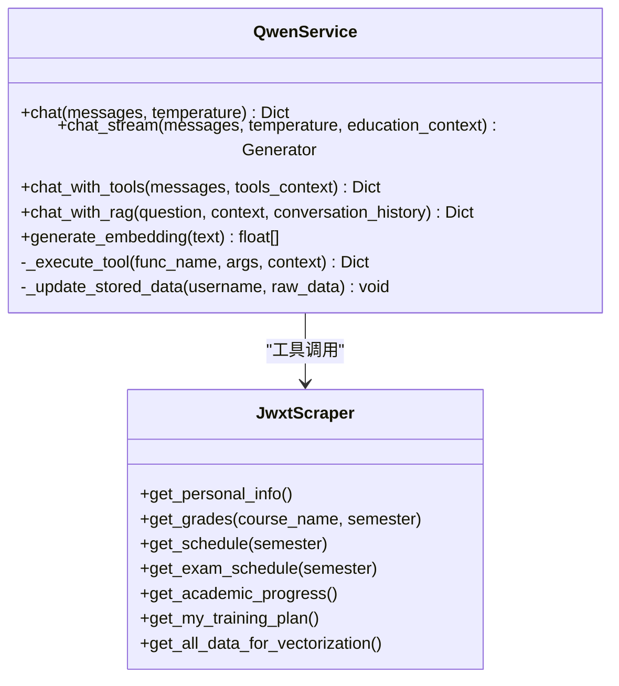

**图表来源**
- [backend/app/services/qwen_service.py:16-604](file://backend/app/services/qwen_service.py#L16-L604)

**章节来源**
- [backend/app/services/qwen_service.py:1-604](file://backend/app/services/qwen_service.py#L1-L604)

### 向量库服务（Milvus）
- 功能概述：提供Milvus连接、集合创建、文档插入（去重）、相似度检索、用户数据删除与连接关闭。
- 检索过滤：支持按用户ID、数据类型（成绩/课表/考试/培养方案/学业进度/个人信息）与学期过滤。
- 性能优化：索引类型IVF_FLAT，余弦距离度量，nprobe参数控制召回与性能平衡。

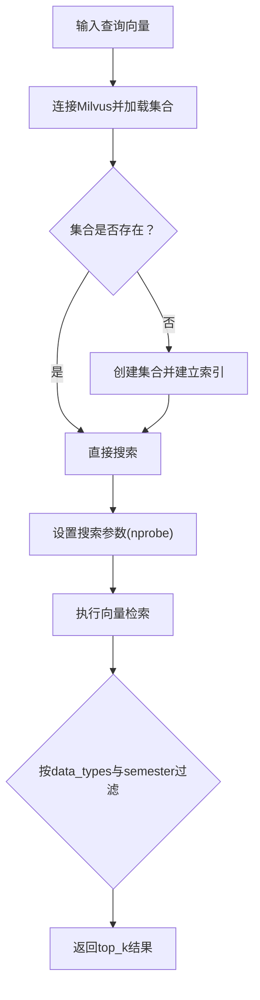

**图表来源**
- [backend/app/services/vector_store.py:25-77](file://backend/app/services/vector_store.py#L25-L77)
- [backend/app/services/vector_store.py:149-210](file://backend/app/services/vector_store.py#L149-L210)

**章节来源**
- [backend/app/services/vector_store.py:1-253](file://backend/app/services/vector_store.py#L1-L253)

### 技能路由
- 功能概述：根据用户问题匹配启用的技能，生成系统提示注入模型，引导优先使用相应工具。
- 匹配策略：关键词触发、最多匹配N个技能，生成结构化提示文本。

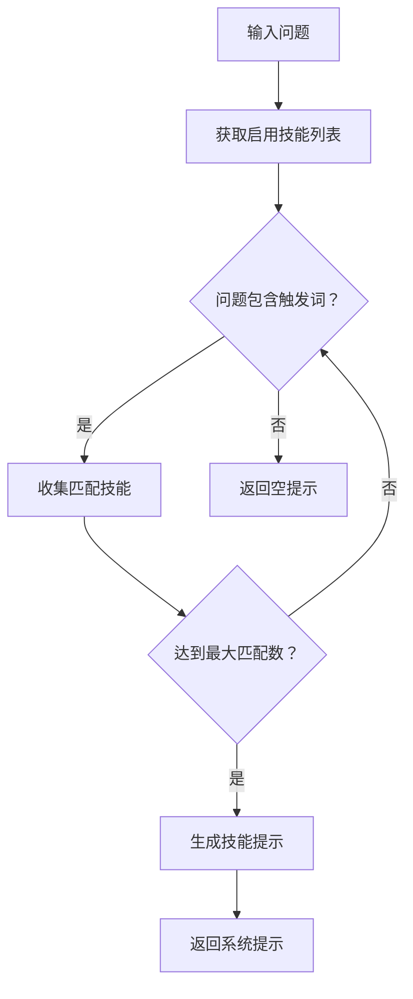

**图表来源**
- [backend/app/services/skill_router.py:13-50](file://backend/app/services/skill_router.py#L13-L50)

**章节来源**
- [backend/app/services/skill_router.py:1-50](file://backend/app/services/skill_router.py#L1-L50)

## 依赖关系分析
- 组件耦合：
  - Agent运行时服务依赖统一模型提供层，形成松耦合的可插拔架构。
  - 对话API依赖模型层、向量库、会话存储与安全模块，职责清晰。
  - 数据库模型通过ORM与API层解耦，便于扩展。
- 外部依赖：
  - DashScope（千问）、Milvus（向量库）、Redis（会话存储）、SQLAlchemy（ORM）、**LangGraph（新增）**。
- 循环依赖规避：
  - 通过延迟导入与单例模式（如get_session_store、get_model_provider）避免循环导入。

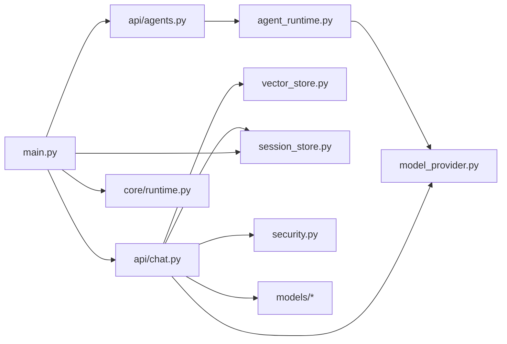

**图表来源**
- [backend/app/services/agent_runtime.py:16-177](file://backend/app/services/agent_runtime.py#L16-L177)
- [backend/app/services/model_provider.py:277-299](file://backend/app/services/model_provider.py#L277-L299)
- [backend/app/api/chat.py:16-21](file://backend/app/api/chat.py#L16-L21)
- [backend/app/api/agents.py:8-10](file://backend/app/api/agents.py#L8-L10)
- [backend/main.py:9-17](file://backend/main.py#L9-L17)

**章节来源**
- [backend/app/services/agent_runtime.py:1-177](file://backend/app/services/agent_runtime.py#L1-L177)
- [backend/app/api/chat.py:1-609](file://backend/app/api/chat.py#L1-L609)
- [backend/app/api/agents.py:1-40](file://backend/app/api/agents.py#L1-L40)
- [backend/main.py:1-120](file://backend/main.py#L1-L120)

## 性能考虑
- 框架选择：OpenAI Agents SDK轻量、MCP友好；LangGraph功能强大但需注意事件循环冲突。
- 流式对话：SSE推送与线程池配合，避免阻塞；超时心跳与异常恢复保障用户体验。
- 向量检索：合理设置nprobe与索引类型，在召回率与性能间平衡。
- 会话存储：Redis优先，内存回退仅限开发测试；TTL与键空间管理降低内存压力。
- 数据库：ORM查询限制返回条数，避免大事务；对话与消息级联删除减少碎片。
- **LangGraph性能优化**：
  - StateGraph编译后复用，避免重复编译开销。
  - GraphState最小化状态存储，只保留必要字段。
  - 事件循环冲突检测，避免阻塞主线程。

## 故障排除指南
- Agent运行失败：
  - 检查框架依赖与OPENAI_API_KEY配置。
  - 查看降级原因（fallback_reason），确认统一模型层可用性。
  - **LangGraph特定问题**：检查事件循环冲突，确保没有与其他异步框架冲突。
- 模型服务不可用：
  - 确认QWEN_API_KEY与MODEL_PROVIDER配置。
  - LiteLLM未就绪时自动回退QwenProvider。
- 向量检索失败：
  - 检查Milvus连接参数与集合状态。
  - 确认embedding维度与索引配置一致。
- 会话存储异常：
  - Redis不可用时自动回退内存，注意重启后数据丢失。
  - 检查TTL与键空间，避免内存泄漏。
- 安全隔离失败：
  - 确认auth_session_id与session_username一致性。
  - 重新登录获取新的会话。
- **环境变量配置**：
  - OPENAI_API_KEY：LangGraph和OpenAI Agents SDK都需要此配置。
  - OPENAI_MODEL：LangGraph使用的模型名称，默认gpt-4o-mini。
  - QWEN_API_KEY：千问服务的API密钥。
  - MODEL_PROVIDER：主模型提供者，默认qwen。

**章节来源**
- [backend/app/services/agent_runtime.py:66-101](file://backend/app/services/agent_runtime.py#L66-L101)
- [backend/app/services/model_provider.py:120-140](file://backend/app/services/model_provider.py#L120-L140)
- [backend/app/services/vector_store.py:25-38](file://backend/app/services/vector_store.py#L25-L38)
- [backend/app/services/session_store.py:39-54](file://backend/app/services/session_store.py#L39-L54)
- [backend/app/security.py:14-26](file://backend/app/security.py#L14-L26)

## 结论
本Agent运行时服务通过可插拔框架、统一模型提供层与完善的会话/安全机制，实现了教务场景下的智能问答闭环：优先工具调用获取真实数据，其次RAG增强回答，最后回退到纯模型对话。系统具备良好的扩展性与稳定性，适合在生产环境中持续演进与部署。

**LangGraph集成的重大改进**：
- 完整的StateGraph实现，支持复杂的状态管理
- 事件循环冲突检测与处理机制
- 环境变量验证和错误处理增强
- 与ChatOpenAI的无缝集成
- 生产级的错误恢复和降级策略

这些改进使得LangGraph成为了一个稳定可靠的Agent运行框架选项，为系统提供了更强的编排能力和更好的用户体验。