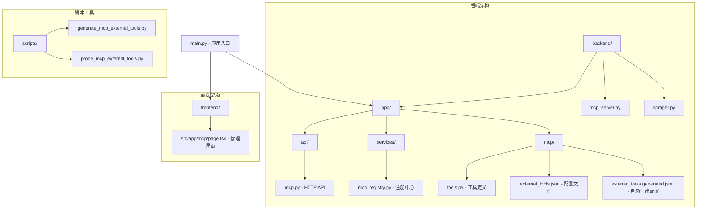
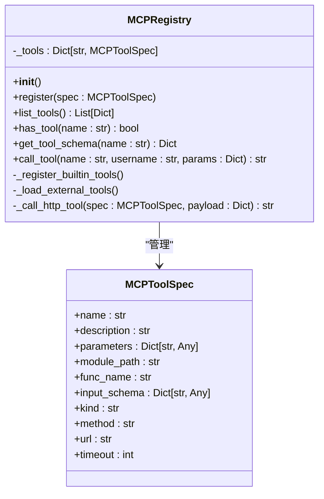
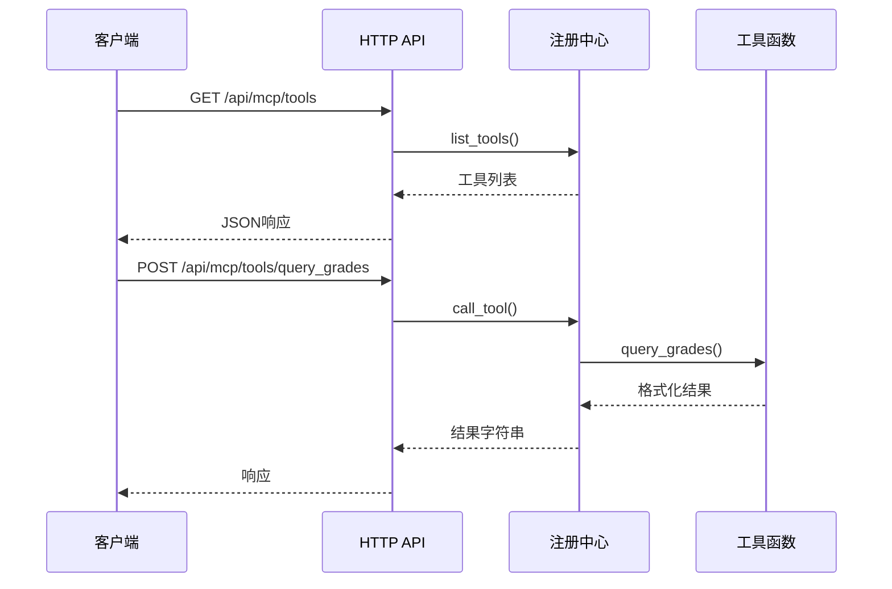
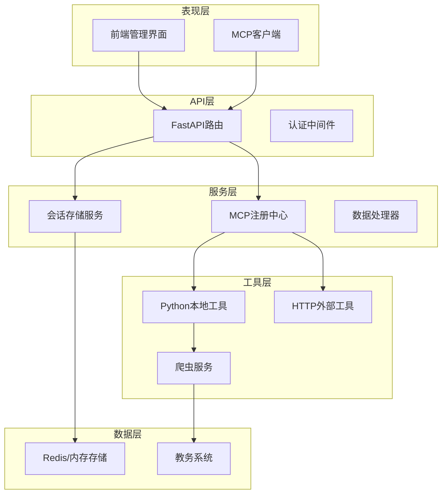
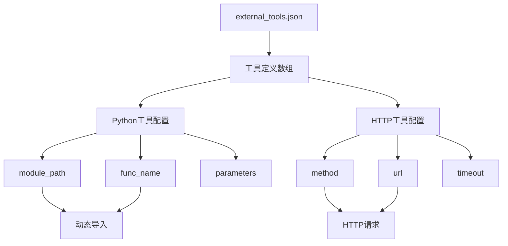
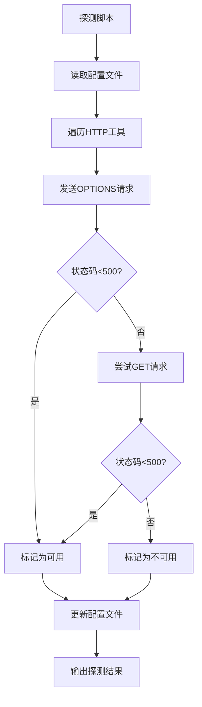
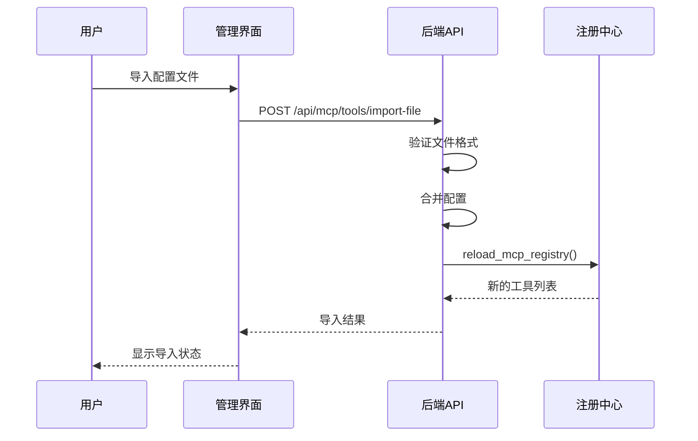
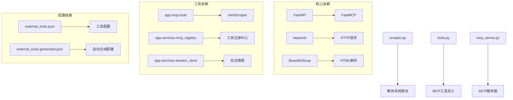

# MCP管理功能

<cite>
**本文档引用的文件**
- [backend/app/mcp/tools.py](file://backend/app/mcp/tools.py)
- [backend/app/mcp/external_tools.json](file://backend/app/mcp/external_tools.json)
- [backend/app/mcp/external_tools.generated.json](file://backend/app/mcp/external_tools.generated.json)
- [backend/app/api/mcp.py](file://backend/app/api/mcp.py)
- [backend/app/services/mcp_registry.py](file://backend/app/services/mcp_registry.py)
- [backend/mcp_server.py](file://backend/mcp_server.py)
- [backend/scraper.py](file://backend/scraper.py)
- [backend/app/services/session_store.py](file://backend/app/services/session_store.py)
- [backend/main.py](file://backend/main.py)
- [frontend/src/app/mcp/page.tsx](file://frontend/src/app/mcp/page.tsx)
- [scripts/generate_mcp_external_tools.py](file://scripts/generate_mcp_external_tools.py)
- [scripts/probe_mcp_external_tools.py](file://scripts/probe_mcp_external_tools.py)
</cite>

## 目录
1. [简介](#简介)
2. [项目结构](#项目结构)
3. [核心组件](#核心组件)
4. [架构概览](#架构概览)
5. [详细组件分析](#详细组件分析)
6. [依赖关系分析](#依赖关系分析)
7. [性能考虑](#性能考虑)
8. [故障排除指南](#故障排除指南)
9. [结论](#结论)

## 简介

MCP（Model Context Protocol）管理功能是本项目的核心智能体工具管理系统，负责将教务系统的各项功能通过标准化的MCP协议暴露给AI Agent调用。该系统支持多种工具类型，包括Python本地工具和HTTP外部工具，为OpenClaw、Claude Desktop等支持MCP协议的AI客户端提供统一的工具接口。

系统采用模块化设计，通过注册中心统一管理工具生命周期，支持动态导入、热重载和健康探测功能。前端提供了直观的管理界面，支持工具配置的导入、导出和实时监控。

## 项目结构

该项目采用前后端分离的架构设计，MCP管理功能主要分布在以下目录：

**图表来源**
- [backend/main.py:1-122](file://backend/main.py#L1-L122)
- [backend/app/mcp/tools.py:1-306](file://backend/app/mcp/tools.py#L1-L306)
- [backend/app/api/mcp.py:1-271](file://backend/app/api/mcp.py#L1-L271)

**章节来源**
- [backend/main.py:1-122](file://backend/main.py#L1-L122)
- [backend/app/mcp/tools.py:1-306](file://backend/app/mcp/tools.py#L1-L306)
- [backend/app/api/mcp.py:1-271](file://backend/app/api/mcp.py#L1-L271)

## 核心组件

### MCP工具注册中心

MCP注册中心是整个系统的核心组件，负责管理所有可用的MCP工具。它实现了统一的工具注册、发现、调用接口，并支持内置工具和外部工具的混合管理。

**图表来源**
- [backend/app/services/mcp_registry.py:34-254](file://backend/app/services/mcp_registry.py#L34-L254)

### 教务系统工具集

系统提供了六个核心的教务系统查询工具，每个工具都经过精心设计，提供友好的用户输出格式：

| 工具名称 | 功能描述 | 参数 | 返回值 |
|---------|----------|------|--------|
| query_grades | 查询学生成绩 | username, semester | 成绩列表的JSON字符串 |
| query_schedule | 查询课程表 | username, semester | 课表信息的格式化文本 |
| query_academic_progress | 查询学业进度 | username | 学业进度统计信息 |
| query_training_plan | 查询培养方案 | username | 培养方案详情 |
| query_exam_schedule | 查询考试安排 | username, semester | 考试安排信息 |
| query_personal_info | 查询个人信息 | username | 个人信息摘要 |

**章节来源**
- [backend/app/mcp/tools.py:40-306](file://backend/app/mcp/tools.py#L40-L306)

### HTTP API层

HTTP API层提供了RESTful接口，支持工具的动态管理和配置导入：

**图表来源**
- [backend/app/api/mcp.py:53-96](file://backend/app/api/mcp.py#L53-L96)
- [backend/app/services/mcp_registry.py:207-218](file://backend/app/services/mcp_registry.py#L207-L218)

**章节来源**
- [backend/app/api/mcp.py:1-271](file://backend/app/api/mcp.py#L1-L271)

## 架构概览

系统采用分层架构设计，确保了良好的可维护性和扩展性：

**图表来源**
- [backend/main.py:20-47](file://backend/main.py#L20-L47)
- [backend/app/services/mcp_registry.py:34-38](file://backend/app/services/mcp_registry.py#L34-L38)

## 详细组件分析

### 工具配置管理系统

系统支持两种工具配置方式：手动配置和自动生成。

#### 手动配置文件

手动配置文件采用JSON格式，支持Python本地工具和HTTP外部工具的定义：

**图表来源**
- [backend/app/mcp/external_tools.json:1-80](file://backend/app/mcp/external_tools.json#L1-L80)

#### 自动生成配置

系统提供了自动化工具生成脚本，可以根据项目分析报告生成初始配置：

**章节来源**
- [backend/app/mcp/external_tools.json:1-80](file://backend/app/mcp/external_tools.json#L1-L80)
- [backend/app/mcp/external_tools.generated.json:1-154](file://backend/app/mcp/external_tools.generated.json#L1-L154)

### 健康探测机制

系统实现了HTTP工具的健康探测功能，确保外部工具的可用性：

**图表来源**
- [scripts/probe_mcp_external_tools.py:20-54](file://scripts/probe_mcp_external_tools.py#L20-L54)

**章节来源**
- [scripts/probe_mcp_external_tools.py:1-67](file://scripts/probe_mcp_external_tools.py#L1-L67)

### 前端管理界面

前端提供了完整的MCP工具管理界面，支持以下功能：

- 工具列表展示和搜索
- 配置文件导入（本地文件和URL）
- 工具重载和健康探测
- 任务队列监控
- 流水线管理

**图表来源**
- [frontend/src/app/mcp/page.tsx:133-156](file://frontend/src/app/mcp/page.tsx#L133-L156)

**章节来源**
- [frontend/src/app/mcp/page.tsx:1-451](file://frontend/src/app/mcp/page.tsx#L1-L451)

## 依赖关系分析

系统的关键依赖关系如下：

**图表来源**
- [backend/app/mcp/tools.py:6-12](file://backend/app/mcp/tools.py#L6-L12)
- [backend/app/services/mcp_registry.py:12-17](file://backend/app/services/mcp_registry.py#L12-L17)

**章节来源**
- [backend/app/mcp/tools.py:1-306](file://backend/app/mcp/tools.py#L1-L306)
- [backend/app/services/mcp_registry.py:1-254](file://backend/app/services/mcp_registry.py#L1-L254)

## 性能考虑

### 工具调用优化

1. **异步处理**：所有MCP工具都采用异步实现，提高并发处理能力
2. **缓存策略**：会话信息使用Redis进行缓存，减少重复认证开销
3. **超时控制**：HTTP工具设置合理的超时时间，防止阻塞
4. **错误处理**：完善的异常捕获和错误恢复机制

### 内存管理

- 使用单例模式管理注册中心，避免重复实例化
- 会话存储支持Redis持久化，确保高可用性
- 工具配置采用延迟加载，只在需要时解析

### 网络优化

- HTTP工具支持OPTIONS预检请求，提高探测效率
- 自动编码检测，避免重复网络请求
- 连接池复用，减少TCP连接开销

## 故障排除指南

### 常见问题及解决方案

#### 工具调用失败

**症状**：调用MCP工具返回错误信息
**可能原因**：
- 用户未登录或会话过期
- 工具配置不正确
- 外部服务不可达

**解决步骤**：
1. 检查用户登录状态
2. 验证工具配置文件格式
3. 使用健康探测功能检查外部服务

#### 工具导入失败

**症状**：导入配置文件时报错
**可能原因**：
- JSON格式不正确
- 缺少必需字段
- 文件权限问题

**解决步骤**：
1. 验证JSON语法
2. 检查必需字段完整性
3. 确认文件写入权限

#### 前端界面异常

**症状**：管理界面无法正常显示
**可能原因**：
- API服务未启动
- CORS配置问题
- 网络连接异常

**解决步骤**：
1. 检查后端服务状态
2. 验证CORS配置
3. 确认网络连通性

**章节来源**
- [backend/app/api/mcp.py:81-95](file://backend/app/api/mcp.py#L81-L95)
- [backend/app/mcp/tools.py:73-77](file://backend/app/mcp/tools.py#L73-L77)

## 结论

MCP管理功能通过模块化的设计和标准化的接口，成功地将复杂的教务系统功能封装为易于使用的工具集合。系统具有以下优势：

1. **高度模块化**：清晰的组件分离和职责划分
2. **灵活扩展**：支持Python本地工具和HTTP外部工具
3. **易于管理**：提供完整的配置管理和监控界面
4. **稳定可靠**：完善的错误处理和健康监测机制
5. **性能优化**：异步处理和缓存策略提升系统性能

该系统为AI Agent与教务系统的集成提供了坚实的基础，支持未来更多的功能扩展和第三方工具接入。通过持续的优化和改进，MCP管理功能将成为智能教育服务的重要基础设施。