# 向量数据库适配器扩展

<cite>
**本文档引用的文件**
- [backend/app/services/vector_store.py](file://backend/app/services/vector_store.py)
- [backend/main.py](file://backend/main.py)
- [backend/scraper.py](file://backend/scraper.py)
- [backend/app/models/education_data.py](file://backend/app/models/education_data.py)
- [backend/app/models/base.py](file://backend/app/models/base.py)
- [backend/requirements.txt](file://backend/requirements.txt)
- [docker-compose.yml](file://docker-compose.yml)
</cite>

## 目录
1. [简介](#简介)
2. [项目结构](#项目结构)
3. [核心组件](#核心组件)
4. [架构概览](#架构概览)
5. [详细组件分析](#详细组件分析)
6. [依赖分析](#依赖分析)
7. [性能考虑](#性能考虑)
8. [故障排除指南](#故障排除指南)
9. [结论](#结论)
10. [附录](#附录)

## 简介

本文件为智能教务系统向量数据库适配器扩展文档，重点围绕VectorStore类的架构设计与适配器模式实现进行深入分析。文档详细阐述了如何支持新的向量数据库、自定义索引策略和查询优化，解释了向量存储服务的扩展机制，包括新向量数据库的集成方法、数据迁移和兼容性处理。同时提供了向量检索算法的扩展指南，涵盖相似度计算、过滤条件和排序规则的自定义。文档还介绍了索引管理的最佳实践，包括索引创建、更新策略和性能调优，并详细说明了如何实现自定义向量编码器和嵌入模型，包括数据预处理、批量处理和内存管理。最后，提供了向量数据库配置和连接管理的指导，包括连接池、超时设置和故障恢复机制。

## 项目结构

智能教务系统采用前后端分离架构，后端基于FastAPI框架，前端基于Next.js。向量数据库适配器位于后端Python服务中，主要文件包括：

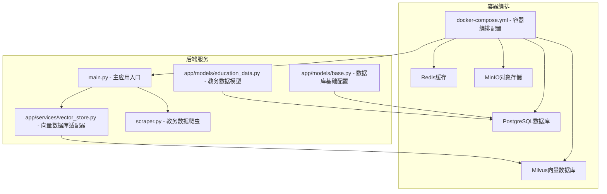

**图表来源**
- [backend/main.py:1-853](file://backend/main.py#L1-L853)
- [backend/app/services/vector_store.py:1-164](file://backend/app/services/vector_store.py#L1-L164)
- [backend/scraper.py:1-1220](file://backend/scraper.py#L1-L1220)
- [docker-compose.yml:53-147](file://docker-compose.yml#L53-L147)

**章节来源**
- [backend/main.py:1-853](file://backend/main.py#L1-L853)
- [backend/app/services/vector_store.py:1-164](file://backend/app/services/vector_store.py#L1-L164)
- [backend/scraper.py:1-1220](file://backend/scraper.py#L1-L1220)
- [docker-compose.yml:53-147](file://docker-compose.yml#L53-L147)

## 核心组件

### VectorStore类架构设计

VectorStore类是系统的核心向量数据库适配器，采用适配器模式设计，封装了Milvus向量数据库的具体实现细节，为上层应用提供统一的接口。

#### 类结构图

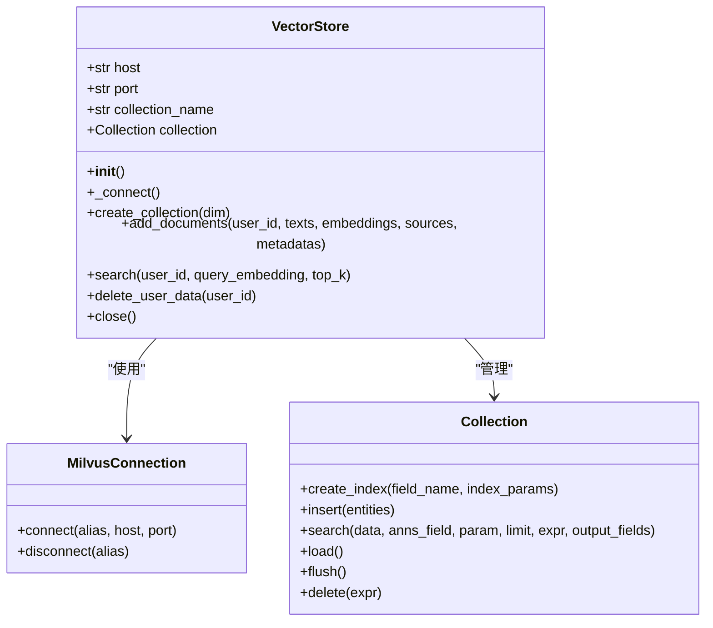

**图表来源**
- [backend/app/services/vector_store.py:14-164](file://backend/app/services/vector_store.py#L14-L164)

#### 核心功能特性

1. **连接管理**: 自动连接Milvus数据库，支持环境变量配置
2. **集合管理**: 动态创建集合，定义字段结构和索引策略
3. **文档操作**: 支持批量插入文档和向量数据
4. **向量检索**: 基于余弦相似度的相似性搜索
5. **数据清理**: 支持按用户维度删除数据

**章节来源**
- [backend/app/services/vector_store.py:14-164](file://backend/app/services/vector_store.py#L14-L164)

## 架构概览

系统采用分层架构设计，向量数据库适配器位于服务层，向上提供统一接口，向下封装具体数据库实现。

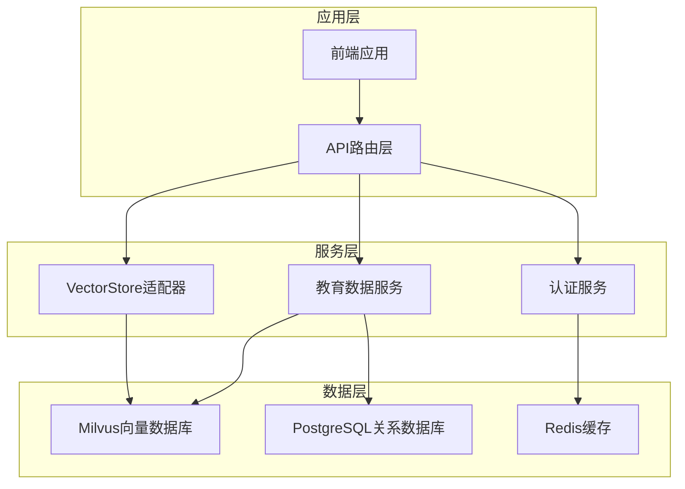

**图表来源**
- [backend/main.py:1-853](file://backend/main.py#L1-L853)
- [backend/app/services/vector_store.py:1-164](file://backend/app/services/vector_store.py#L1-L164)

## 详细组件分析

### VectorStore类详细分析

#### 初始化流程

VectorStore类的初始化过程体现了依赖注入和配置管理的最佳实践：

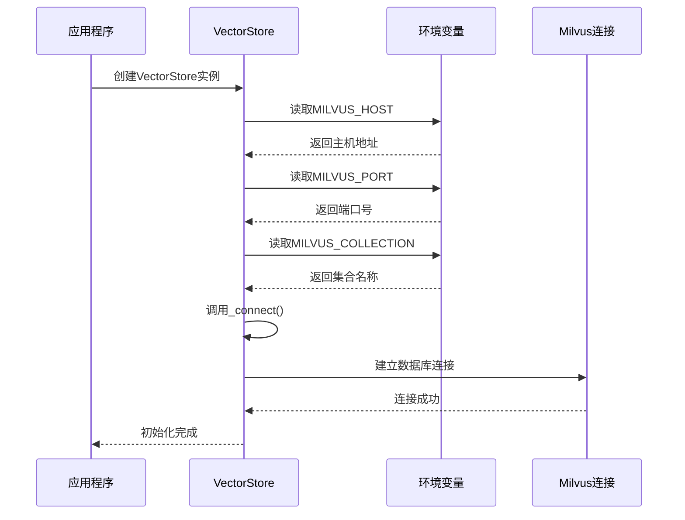

**图表来源**
- [backend/app/services/vector_store.py:17-35](file://backend/app/services/vector_store.py#L17-L35)

#### 集合创建机制

VectorStore实现了动态集合创建功能，支持自定义向量维度：

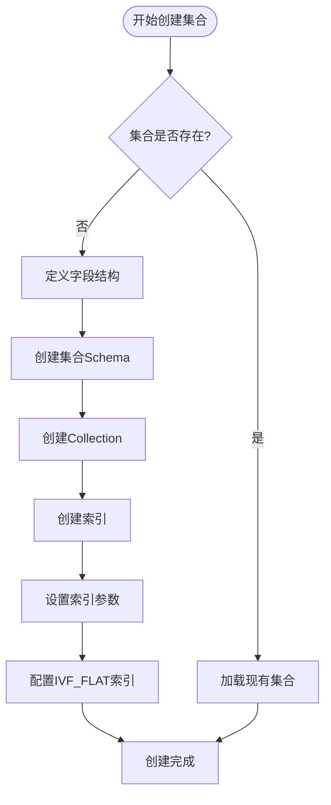

**图表来源**
- [backend/app/services/vector_store.py:37-71](file://backend/app/services/vector_store.py#L37-L71)

#### 文档插入流程

VectorStore支持批量文档插入，包含数据预处理和错误处理：

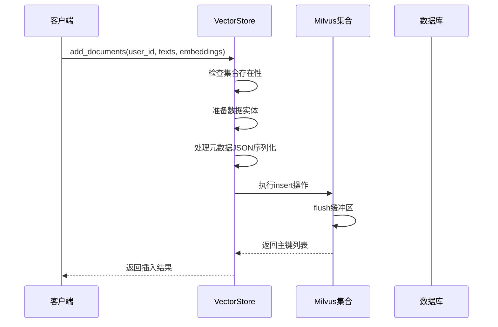

**图表来源**
- [backend/app/services/vector_store.py:73-98](file://backend/app/services/vector_store.py#L73-L98)

#### 搜索算法实现

VectorStore采用余弦相似度进行向量检索，支持用户级过滤：

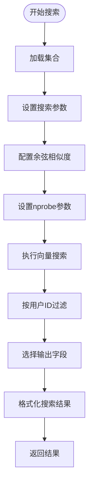

**图表来源**
- [backend/app/services/vector_store.py:100-141](file://backend/app/services/vector_store.py#L100-L141)

**章节来源**
- [backend/app/services/vector_store.py:14-164](file://backend/app/services/vector_store.py#L14-L164)

### 数据爬取与向量化集成

系统通过JwxtScraper类获取教务数据，并将其转换为向量数据：

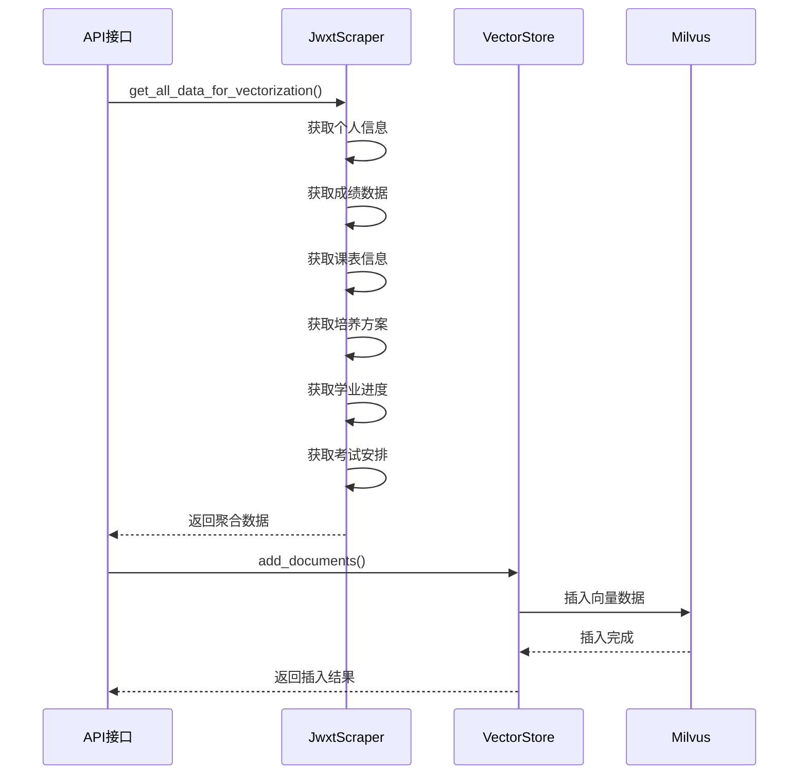

**图表来源**
- [backend/scraper.py:1154-1219](file://backend/scraper.py#L1154-L1219)
- [backend/app/services/vector_store.py:73-98](file://backend/app/services/vector_store.py#L73-L98)

**章节来源**
- [backend/scraper.py:1154-1219](file://backend/scraper.py#L1154-L1219)
- [backend/main.py:698-724](file://backend/main.py#L698-L724)

### 教务数据模型

系统使用SQLAlchemy ORM定义了完整的教务数据模型：

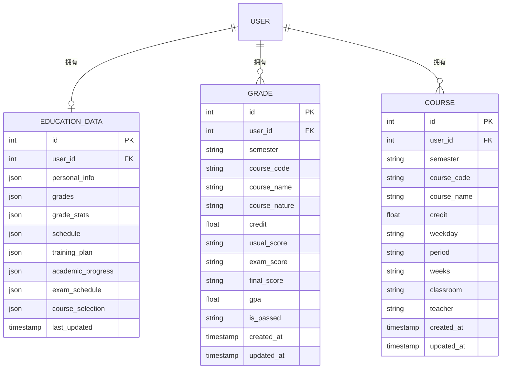

**图表来源**
- [backend/app/models/education_data.py:11-103](file://backend/app/models/education_data.py#L11-L103)

**章节来源**
- [backend/app/models/education_data.py:11-103](file://backend/app/models/education_data.py#L11-L103)
- [backend/app/models/base.py:1-29](file://backend/app/models/base.py#L1-L29)

## 依赖分析

### 外部依赖关系

系统使用Docker Compose进行容器编排，包含多个服务组件：

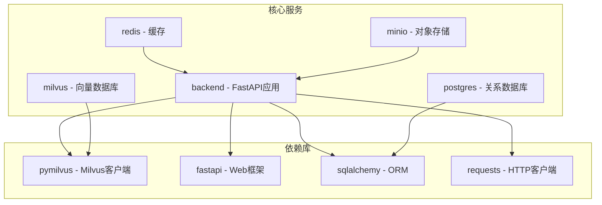

**图表来源**
- [docker-compose.yml:53-147](file://docker-compose.yml#L53-L147)
- [backend/requirements.txt:1-44](file://backend/requirements.txt#L1-L44)

### 内部模块依赖

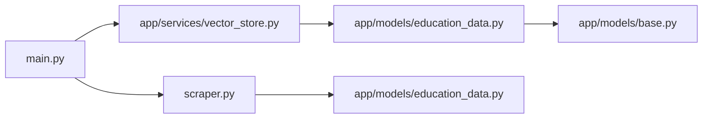

**图表来源**
- [backend/main.py:1-853](file://backend/main.py#L1-L853)
- [backend/app/services/vector_store.py:1-164](file://backend/app/services/vector_store.py#L1-L164)
- [backend/scraper.py:1-1220](file://backend/scraper.py#L1-L1220)

**章节来源**
- [backend/requirements.txt:1-44](file://backend/requirements.txt#L1-L44)
- [docker-compose.yml:53-147](file://docker-compose.yml#L53-L147)

## 性能考虑

### 索引优化策略

VectorStore默认使用IVF_FLAT索引类型，支持以下优化参数：

| 参数 | 默认值 | 说明 | 性能影响 |
|------|--------|------|----------|
| metric_type | COSINE | 相似度计算方法 | 影响搜索精度 |
| index_type | IVF_FLAT | 索引类型 | 影响查询速度 |
| nlist | 128 | 聚类数量 | 内存占用与精度平衡 |
| nprobe | 10 | 搜索的聚类数 | 查询延迟与召回率权衡 |

### 批量处理优化

系统支持批量文档插入，建议的批量大小策略：

- **小批量**: 1-10条，低延迟，适合实时场景
- **中批量**: 10-100条，平衡吞吐量和延迟
- **大批量**: 100+条，高吞吐量，适合离线导入

### 内存管理

VectorStore在插入大量数据时需要注意内存管理：

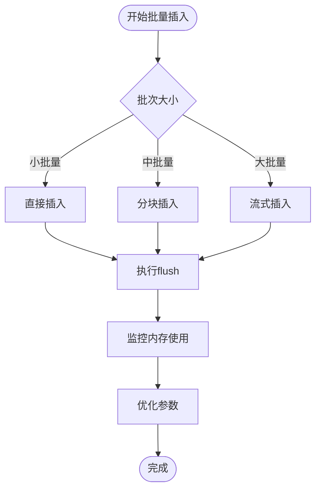

## 故障排除指南

### 常见问题诊断

#### 连接问题

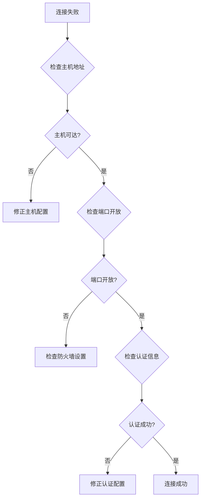

#### 搜索性能问题

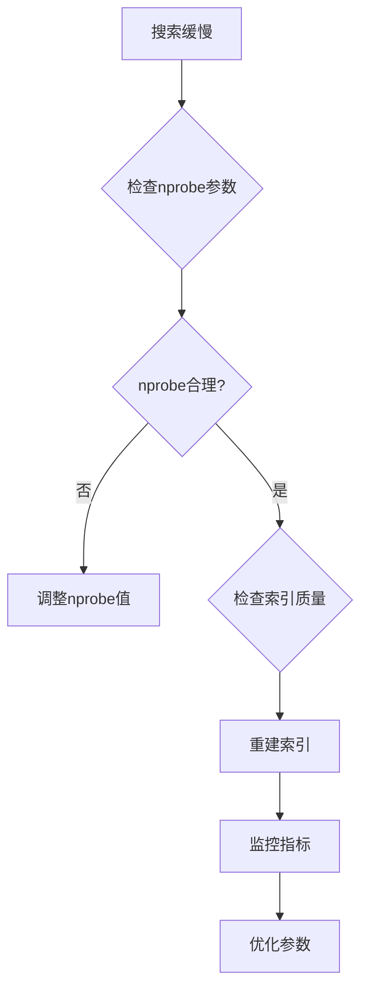

**章节来源**
- [backend/app/services/vector_store.py:24-35](file://backend/app/services/vector_store.py#L24-L35)
- [backend/app/services/vector_store.py:108-112](file://backend/app/services/vector_store.py#L108-L112)

## 结论

智能教务系统向量数据库适配器通过VectorStore类实现了对Milvus向量数据库的统一抽象，采用适配器模式设计，为系统提供了良好的扩展性和维护性。该适配器支持动态集合创建、批量文档插入、基于余弦相似度的向量检索等功能，并通过环境变量配置实现了灵活的部署能力。

系统架构清晰，职责分离明确，向量数据库适配器作为独立的服务组件，既满足了当前的Milvus集成需求，又为未来支持其他向量数据库奠定了基础。通过合理的索引策略、批量处理优化和内存管理，系统能够在保证查询性能的同时，支持大规模向量数据的存储和检索。

## 附录

### 扩展指南

#### 新向量数据库集成步骤

1. **创建适配器接口**: 定义统一的VectorStore接口
2. **实现具体适配器**: 实现目标向量数据库的具体操作
3. **配置依赖**: 在requirements.txt中添加依赖
4. **更新配置**: 在docker-compose.yml中添加服务
5. **测试验证**: 编写单元测试验证功能

#### 自定义索引策略

```python
# 示例：自定义索引参数
custom_index_params = {
    "metric_type": "IP",  # 内积相似度
    "index_type": "HNSW",  # HNSW索引
    "params": {
        "M": 16,
        "efConstruction": 200
    }
}
```

#### 相似度计算自定义

支持的相似度计算方法：
- **COSINE**: 余弦相似度（默认）
- **IP**: 内积相似度
- **L2**: 欧几里得距离

#### 过滤条件扩展

支持的过滤表达式：
- **用户级过滤**: `user_id == 123`
- **范围查询**: `score >= 0.8`
- **组合条件**: `user_id == 123 && score >= 0.8`

#### 排序规则自定义

支持的排序方式：
- **相似度降序**: 默认行为
- **时间倒序**: 按创建时间排序
- **自定义字段**: 按元数据字段排序