# 扩展点与插件

<cite>
**本文档引用的文件**
- [backend/main.py](file://backend/main.py)
- [backend/education_options.py](file://backend/education_options.py)
- [backend/app/services/vector_store.py](file://backend/app/services/vector_store.py)
- [backend/app/services/session_store.py](file://backend/app/services/session_store.py)
- [backend/scraper.py](file://backend/scraper.py)
- [backend/app/api/chat.py](file://backend/app/api/chat.py)
- [backend/app/models/education_data.py](file://backend/app/models/education_data.py)
- [backend/app/models/base.py](file://backend/app/models/base.py)
- [backend/app/models/conversation.py](file://backend/app/models/conversation.py)
- [backend/app/models/user.py](file://backend/app/models/user.py)
- [backend/app/core/runtime.py](file://backend/app/core/runtime.py)
- [backend/app/api/auth_sync.py](file://backend/app/api/auth_sync.py)
- [backend/app/security.py](file://backend/app/security.py)
- [backend/app/mcp/tools.py](file://backend/app/mcp/tools.py)
- [backend/app/services/education_sync.py](file://backend/app/services/education_sync.py)
- [backend/test_scraper.py](file://backend/test_scraper.py)
- [backend/requirements.txt](file://backend/requirements.txt)
- [backend/docker-compose.prod.yml](file://backend/docker-compose.prod.yml)
- [backend/tests/test_session_store_singleton.py](file://backend/tests/test_session_store_singleton.py)
- [README.md](file://README.md)
- [backend/app/api/composition.py](file://backend/app/api/composition.py)
- [backend/app/api/mcp.py](file://backend/app/api/mcp.py)
- [backend/app/api/skills.py](file://backend/app/api/skills.py)
- [backend/app/services/composition_manager.py](file://backend/app/services/composition_manager.py)
- [backend/app/services/mcp_registry.py](file://backend/app/services/mcp_registry.py)
- [backend/app/services/skill_manager.py](file://backend/app/services/skill_manager.py)
- [backend/app/services/skill_router.py](file://backend/app/services/skill_router.py)
- [backend/app/core/observability.py](file://backend/app/core/observability.py)
- [backend/app/mcp/external_tools.json](file://backend/app/mcp/external_tools.json)
- [backend/app/mcp/external_tools.generated.json](file://backend/app/mcp/external_tools.generated.json)
- [frontend/src/app/composition/page.tsx](file://frontend/src/app/composition/page.tsx)
</cite>

## 更新摘要
**变更内容**
- 新增组合系统扩展点，包括技能管理和MCP工具组合功能
- 新增可观测性集成，包括Prometheus指标和trace_id追踪
- 新增MCP工具注册中心和外部工具配置系统
- 新增技能管理API和组合配置管理
- 新增前端组合页面和工具排序功能

## 目录
1. [简介](#简介)
2. [项目结构](#项目结构)
3. [核心组件](#核心组件)
4. [架构总览](#架构总览)
5. [详细组件分析](#详细组件分析)
6. [依赖分析](#依赖分析)
7. [性能考虑](#性能考虑)
8. [故障排查指南](#故障排查指南)
9. [结论](#结论)
10. [附录](#附录)

## 简介
本文件面向"智能教务系统AI助手"的扩展与插件化需求，系统性梳理后端可扩展架构，重点覆盖以下方面：
- AI服务插件化：如何替换或扩展对话与RAG能力（当前以千问为例）。
- 向量数据库适配器：如何新增或切换向量存储后端（当前以Milvus为例）。
- 爬虫模块扩展：如何接入新的数据源或适配不同教务系统。
- 教育选项系统插件架构：如何扩展AI工具可用的选项数据与查询能力。
- API扩展点：中间件、认证扩展、业务逻辑插件的开发方法。
- 第三方服务集成：如何安全、稳定地接入新的AI模型、缓存与向量库。
- **新增** 组合系统扩展点：技能管理和MCP工具组合功能，支持用户级别的自由拼接配置。
- **新增** 可观测性集成：Prometheus指标收集、trace_id追踪和健康检查端点。
- **新增** MCP工具注册中心：支持内置和外部工具的统一管理与动态加载。

## 项目结构
后端采用FastAPI + SQLAlchemy + LangChain生态的分层组织：
- 应用入口与路由：backend/main.py
- 教育选项系统：backend/education_options.py
- 爬虫模块：backend/scraper.py
- 向量存储服务：backend/app/services/vector_store.py
- **新增** 会话存储服务：backend/app/services/session_store.py
- **新增** 组合管理服务：backend/app/services/composition_manager.py
- **新增** MCP注册中心：backend/app/services/mcp_registry.py
- **新增** 技能管理服务：backend/app/services/skill_manager.py
- **新增** 可观测性服务：backend/app/core/observability.py
- 对话API与RAG流程：backend/app/api/chat.py
- **新增** 组合API：backend/app/api/composition.py
- **新增** MCP API：backend/app/api/mcp.py
- **新增** 技能API：backend/app/api/skills.py
- 数据模型与数据库会话：backend/app/models/*
- 测试与依赖：backend/test_scraper.py、backend/requirements.txt

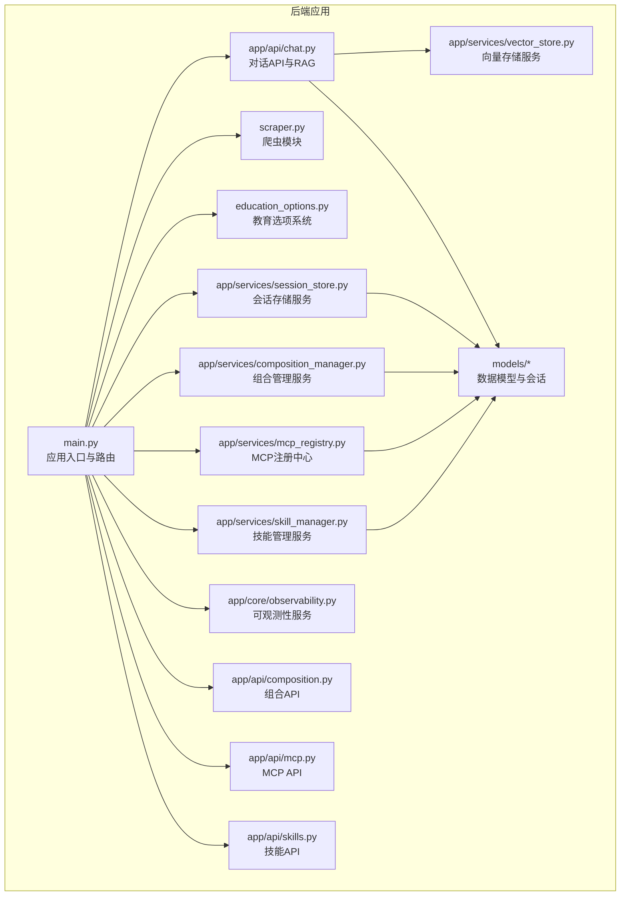

**图表来源**
- [backend/main.py:1-170](file://backend/main.py#L1-L170)
- [backend/app/api/chat.py:1-224](file://backend/app/api/chat.py#L1-L224)
- [backend/app/services/vector_store.py:1-164](file://backend/app/services/vector_store.py#L1-L164)
- [backend/app/services/session_store.py:1-201](file://backend/app/services/session_store.py#L1-L201)
- [backend/app/services/composition_manager.py:1-146](file://backend/app/services/composition_manager.py#L1-L146)
- [backend/app/services/mcp_registry.py:1-259](file://backend/app/services/mcp_registry.py#L1-L259)
- [backend/app/services/skill_manager.py:1-189](file://backend/app/services/skill_manager.py#L1-L189)
- [backend/app/core/observability.py:1-90](file://backend/app/core/observability.py#L1-L90)
- [backend/scraper.py:1-800](file://backend/scraper.py#L1-L800)
- [backend/education_options.py:1-420](file://backend/education_options.py#L1-L420)
- [backend/app/models/base.py:1-29](file://backend/app/models/base.py#L1-L29)

**章节来源**
- [backend/main.py:1-170](file://backend/main.py#L1-L170)
- [README.md:25-41](file://README.md#L25-L41)

## 核心组件
- 应用入口与路由：负责注册API、CORS中间件、健康检查、根路径说明，并按模块动态加载聊天API、组合API、MCP API和技能API。
- 教育选项系统：集中维护下拉选项、AI工具函数与描述映射，作为AI工具的数据源。
- 爬虫模块：封装对教务系统的登录、验证码、个人信息、成绩、课表、培养方案、学业进度、考试安排等数据抓取。
- 向量存储服务：封装Milvus连接、集合创建、索引策略、增删改查与用户数据隔离。
- **新增** 会话存储服务：提供Redis持久化会话存储，支持自动回退到内存存储，管理用户会话、验证码会话、同步状态和认证会话。
- **新增** 组合管理服务：按用户维护技能和MCP工具的可组合配置，支持启用/禁用、优先级和权重设置。
- **新增** MCP注册中心：统一管理内置和外部MCP工具，支持动态加载和HTTP工具适配。
- **新增** 技能管理服务：基于YAML声明式的技能管理，支持上传、验证、导入和启用/禁用。
- **新增** 可观测性服务：提供trace_id上下文、Prometheus指标收集和健康检查端点。
- 对话API与RAG：封装用户/对话/消息模型，实现RAG检索与AI回复的流水线。
- 数据模型与会话：统一数据库连接、会话管理与实体定义。

**章节来源**
- [backend/main.py:30-82](file://backend/main.py#L30-L82)
- [backend/education_options.py:130-260](file://backend/education_options.py#L130-L260)
- [backend/scraper.py:13-60](file://backend/scraper.py#L13-L60)
- [backend/app/services/vector_store.py:14-40](file://backend/app/services/vector_store.py#L14-L40)
- [backend/app/services/session_store.py:25-53](file://backend/app/services/session_store.py#L25-L53)
- [backend/app/services/composition_manager.py:16-32](file://backend/app/services/composition_manager.py#L16-L32)
- [backend/app/services/mcp_registry.py:34-40](file://backend/app/services/mcp_registry.py#L34-L40)
- [backend/app/services/skill_manager.py:28-32](file://backend/app/services/skill_manager.py#L28-L32)
- [backend/app/core/observability.py:14-28](file://backend/app/core/observability.py#L14-L28)
- [backend/app/api/chat.py:18-42](file://backend/app/api/chat.py#L18-L42)
- [backend/app/models/base.py:10-29](file://backend/app/models/base.py#L10-L29)

## 架构总览
后端通过FastAPI提供REST接口，爬虫模块负责数据采集，向量存储服务承载RAG向量索引，会话存储服务管理用户会话状态，组合管理服务协调技能和MCP工具，MCP注册中心统一管理工具调用，技能管理服务处理YAML声明式配置，可观测性服务提供监控指标，对话API串联数据库、向量检索与AI服务，形成"采集-索引-检索-生成-组合-监控"的完整闭环。

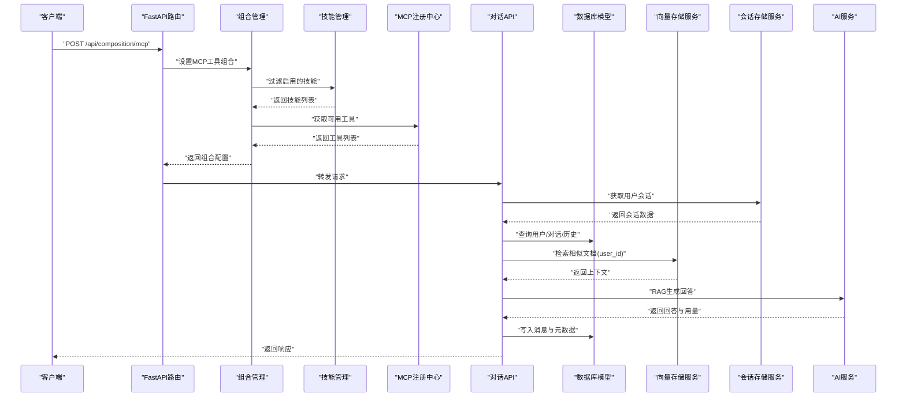

**图表来源**
- [backend/app/api/composition.py:38-68](file://backend/app/api/composition.py#L38-L68)
- [backend/app/services/composition_manager.py:117-136](file://backend/app/services/composition_manager.py#L117-L136)
- [backend/app/services/mcp_registry.py:168-180](file://backend/app/services/mcp_registry.py#L168-L180)
- [backend/app/api/chat.py:45-154](file://backend/app/api/chat.py#L45-L154)
- [backend/app/services/vector_store.py:100-142](file://backend/app/services/vector_store.py#L100-L142)
- [backend/app/services/session_store.py:124-151](file://backend/app/services/session_store.py#L124-L151)
- [backend/app/models/education_data.py:11-48](file://backend/app/models/education_data.py#L11-L48)

## 详细组件分析

### 组件A：教育选项系统（插件化AI工具数据源）
- 设计要点
  - 集中式选项数据：院系、学期、课程性质、修读类别、成绩显示方式、考核方式、星期/节次/周次等。
  - 工具函数：query_departments、query_semesters、query_course_options、query_schedule_options、query_grade_options、get_option_description。
  - 可扩展性：新增选项类型只需在类中新增字段与工具函数，对外保持稳定的API。
- 扩展方法
  - 新增选项类型：在类中添加枚举列表与静态方法，同时在工具函数中暴露查询接口。
  - 新增AI工具：编写工具函数，返回结构化选项数据，供对话API与前端使用。
- 生命周期
  - 初始化：随模块导入加载，无需显式初始化。
  - 查询：通过HTTP接口或内部函数调用，避免重复计算。

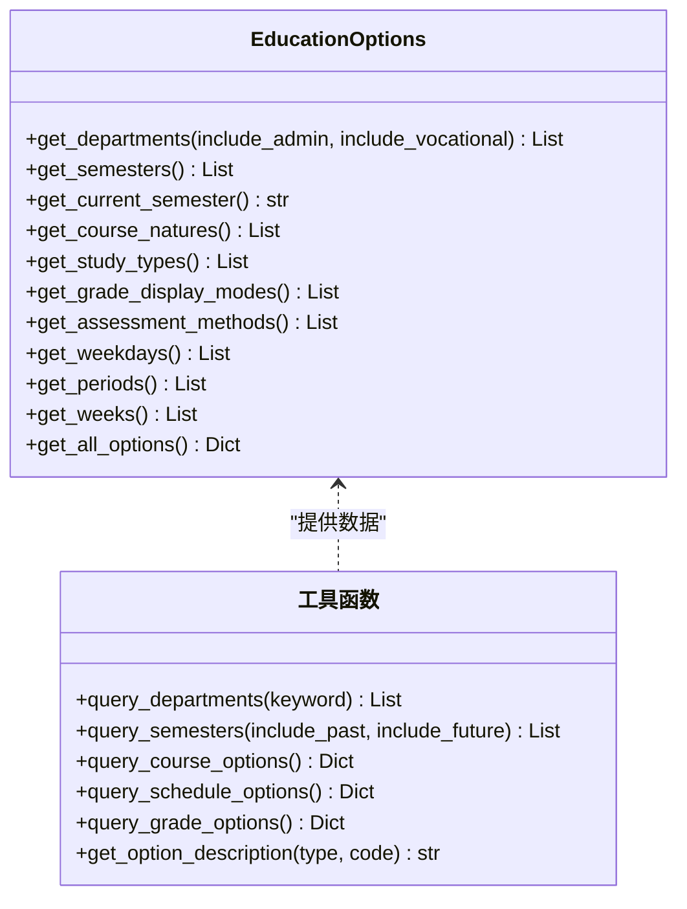

**图表来源**
- [backend/education_options.py:130-260](file://backend/education_options.py#L130-L260)
- [backend/education_options.py:262-420](file://backend/education_options.py#L262-L420)

**章节来源**
- [backend/education_options.py:1-420](file://backend/education_options.py#L1-L420)

### 组件B：爬虫模块（数据采集插件化）
- 设计要点
  - JwxtScraper类封装登录、验证码、个人信息、成绩、课表、培养方案、学业进度、考试安排、执行计划、选课信息等。
  - 无需登录接口：教师/课程查询等公开接口。
  - 登录相关接口：依赖会话与服务器选择逻辑。
- 扩展方法
  - 新增数据源：新增方法，遵循现有返回结构（success/data/count/stats等），并在main.py中注册对应API。
  - 多系统适配：通过构造函数注入base_url与登录URL，实现多学校/多版本兼容。
- 生命周期
  - 初始化：传入requests.Session与基础URL。
  - 调用：按需调用对应方法，注意异常处理与编码设置。

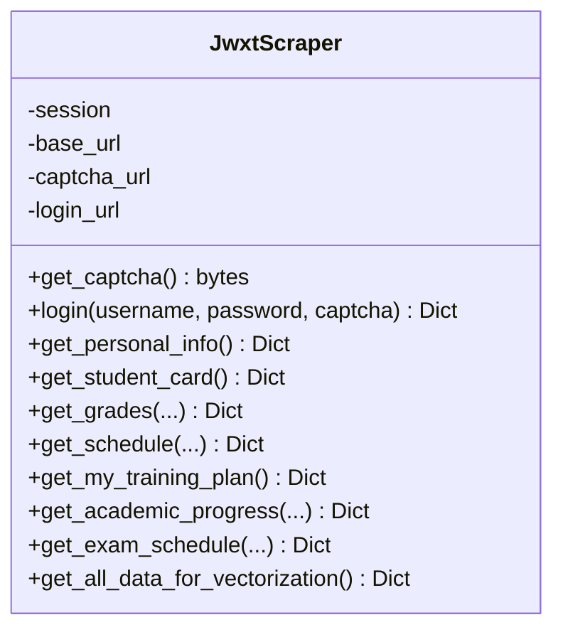

**图表来源**
- [backend/scraper.py:13-60](file://backend/scraper.py#L13-L60)
- [backend/scraper.py:61-120](file://backend/scraper.py#L61-L120)
- [backend/scraper.py:153-237](file://backend/scraper.py#L153-L237)

**章节来源**
- [backend/scraper.py:1-800](file://backend/scraper.py#L1-L800)
- [backend/test_scraper.py:103-118](file://backend/test_scraper.py#L103-L118)

### 组件C：向量存储服务（适配器模式）
- 设计要点
  - VectorStore封装Milvus连接、集合创建、索引策略、插入、检索、删除与关闭。
  - 用户隔离：通过user_id过滤与删除，保证数据边界。
  - 环境变量：通过MILVUS_HOST/MILVUS_PORT/MILVUS_COLLECTION控制连接参数。
- 扩展方法
  - 新增向量库：实现同名接口（连接、创建集合、索引、增删改查、关闭），在应用中注入新实例。
  - 自定义索引策略：调整index_params与metric_type，平衡召回率与性能。
- 生命周期
  - 初始化：读取环境变量并连接。
  - 使用：按需创建集合与索引，插入与检索时自动加载。
  - 关闭：释放连接。

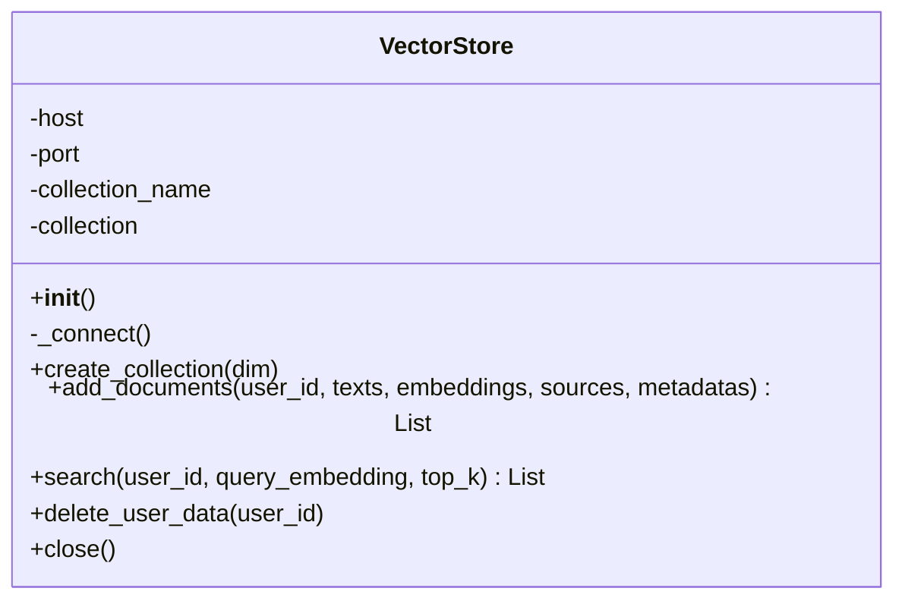

**图表来源**
- [backend/app/services/vector_store.py:14-40](file://backend/app/services/vector_store.py#L14-L40)
- [backend/app/services/vector_store.py:73-99](file://backend/app/services/vector_store.py#L73-L99)
- [backend/app/services/vector_store.py:100-142](file://backend/app/services/vector_store.py#L100-L142)

**章节来源**
- [backend/app/services/vector_store.py:1-164](file://backend/app/services/vector_store.py#L1-L164)

### 组件D：会话存储服务（持久化插件化）
- 设计要点
  - **新增** SessionStore提供Redis持久化会话存储，支持自动回退到内存存储。
  - 多种会话类型：用户会话、验证码会话、同步状态、认证会话，每种都有独立的TTL管理。
  - 序列化机制：自动序列化和反序列化requests.Session对象，包括cookies和headers。
  - 环境变量配置：通过REDIS_HOST和REDIS_PORT控制Redis连接参数。
  - 单例模式：提供进程级单例，避免循环依赖问题。
- 扩展方法
  - **新增** 新增存储后端：实现同名接口（set/get/pop/list），支持TTL和序列化。
  - **新增** 自定义会话类型：在SessionStore中添加新的会话类型方法。
  - **新增** 配置管理：通过环境变量控制存储后端行为。
- 生命周期
  - 初始化：检测Redis可用性，建立连接或准备内存存储。
  - 使用：按需设置和获取会话数据，自动处理Redis或内存存储。
  - 关闭：释放Redis连接，清理内存存储。

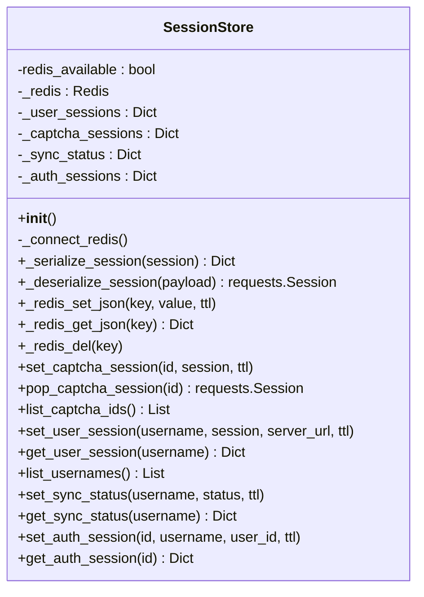

**图表来源**
- [backend/app/services/session_store.py:25-53](file://backend/app/services/session_store.py#L25-L53)
- [backend/app/services/session_store.py:54-70](file://backend/app/services/session_store.py#L54-L70)
- [backend/app/services/session_store.py:72-91](file://backend/app/services/session_store.py#L72-L91)
- [backend/app/services/session_store.py:92-121](file://backend/app/services/session_store.py#L92-L121)
- [backend/app/services/session_store.py:123-186](file://backend/app/services/session_store.py#L123-L186)

**章节来源**
- [backend/app/services/session_store.py:1-201](file://backend/app/services/session_store.py#L1-L201)

### 组件E：组合管理系统（技能与MCP工具组合）
- 设计要点
  - **新增** CompositionManager按用户维护技能和MCP工具的可组合配置，支持启用/禁用、优先级和权重设置。
  - **新增** 支持技能过滤和MCP工具排序，基于权重和用户配置进行优先级排列。
  - **新增** 组合配置持久化到JSON文件，支持用户级别的个性化设置。
- 扩展方法
  - **新增** 新增组合配置：通过API设置技能启用状态、MCP工具启用状态和权重。
  - **新增** 自定义排序策略：根据权重、用户配置和工具类型进行排序。
  - **新增** 组合解析：将技能和MCP工具组合解析为可执行的配置。
- 生命周期
  - 初始化：创建组合管理器实例，确保数据目录存在。
  - 使用：按需读取和保存组合配置，支持实时更新。
  - 关闭：无需特殊处理，配置自动持久化。

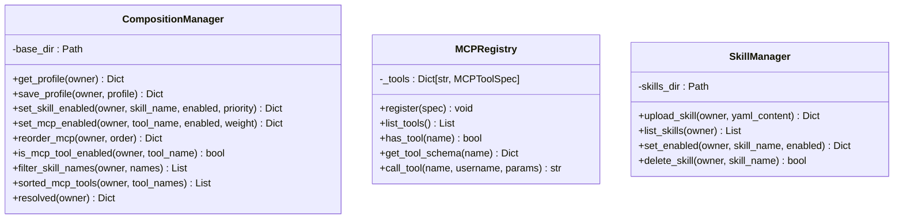

**图表来源**
- [backend/app/services/composition_manager.py:16-32](file://backend/app/services/composition_manager.py#L16-L32)
- [backend/app/services/mcp_registry.py:34-40](file://backend/app/services/mcp_registry.py#L34-L40)
- [backend/app/services/skill_manager.py:28-32](file://backend/app/services/skill_manager.py#L28-L32)

**章节来源**
- [backend/app/services/composition_manager.py:1-146](file://backend/app/services/composition_manager.py#L1-L146)
- [backend/app/services/mcp_registry.py:1-259](file://backend/app/services/mcp_registry.py#L1-L259)
- [backend/app/services/skill_manager.py:1-189](file://backend/app/services/skill_manager.py#L1-L189)

### 组件F：MCP工具注册中心（外部工具集成）
- 设计要点
  - **新增** MCPRegistry统一管理内置和外部MCP工具，支持动态加载和HTTP工具适配。
  - **新增** 支持Python模块工具和HTTP工具两种类型，提供统一的调用接口。
  - **新增** 外部工具配置系统，支持JSON配置文件和动态导入。
- 扩展方法
  - **新增** 新增工具类型：支持Python模块工具和HTTP工具，统一注册和调用。
  - **新增** 外部工具导入：支持从文件和URL导入MCP工具配置。
  - **新增** 工具模式验证：提供输入模式验证和Schema生成。
- 生命周期
  - 初始化：注册内置工具，加载外部工具配置。
  - 使用：按需查找和调用工具，支持异步调用。
  - 关闭：无需特殊处理，工具实例自动管理。

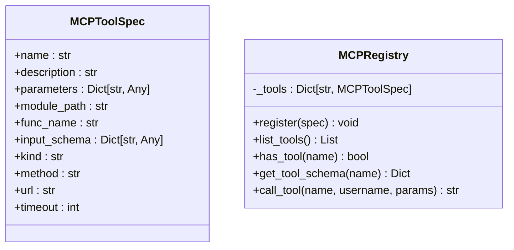

**图表来源**
- [backend/app/services/mcp_registry.py:20-32](file://backend/app/services/mcp_registry.py#L20-L32)
- [backend/app/services/mcp_registry.py:121-123](file://backend/app/services/mcp_registry.py#L121-L123)
- [backend/app/services/mcp_registry.py:181-183](file://backend/app/services/mcp_registry.py#L181-L183)

**章节来源**
- [backend/app/services/mcp_registry.py:1-259](file://backend/app/services/mcp_registry.py#L1-L259)

### 组件G：技能管理服务（YAML声明式）
- 设计要点
  - **新增** SkillManager基于YAML声明式管理技能，支持上传、验证、导入和启用/禁用。
  - **新增** 支持GitHub URL导入，提供内容长度和格式验证。
  - **新增** 技能路由服务，将用户问题映射到启用的skills。
- 扩展方法
  - **新增** 新增技能格式：支持YAML声明式配置，包含必需字段和工具列表。
  - **新增** 外部导入：支持从GitHub等平台导入技能配置。
  - **新增** 路由匹配：基于触发词和工具列表进行智能路由。
- 生命周期
  - 初始化：创建技能目录，确保文件系统结构。
  - 使用：按需读取和保存技能配置，支持实时更新。
  - 关闭：无需特殊处理，配置自动持久化。

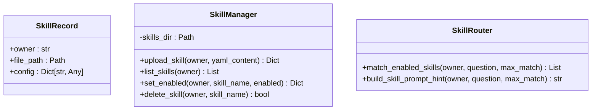

**图表来源**
- [backend/app/services/skill_manager.py:21-26](file://backend/app/services/skill_manager.py#L21-L26)
- [backend/app/services/skill_manager.py:135-156](file://backend/app/services/skill_manager.py#L135-L156)
- [backend/app/services/skill_router.py:14-36](file://backend/app/services/skill_router.py#L14-L36)

**章节来源**
- [backend/app/services/skill_manager.py:1-189](file://backend/app/services/skill_manager.py#L1-L189)
- [backend/app/services/skill_router.py:1-55](file://backend/app/services/skill_router.py#L1-L55)

### 组件H：可观测性服务（监控与追踪）
- 设计要点
  - **新增** Observability提供trace_id上下文管理和Prometheus指标收集。
  - **新增** 支持HTTP请求计数、延迟监控、任务队列状态和聊天流监控。
  - **新增** 中间件集成，自动为所有请求添加trace_id和指标收集。
- 扩展方法
  - **新增** 新增指标类型：支持请求总数、延迟直方图、任务状态等指标。
  - **新增** trace_id追踪：提供上下文变量和工具函数，支持分布式追踪。
  - **新增** 健康检查：提供/metrics端点，支持Prometheus抓取。
- 生命周期
  - 初始化：注册指标和中间件，确保监控系统就绪。
  - 使用：自动收集指标，支持手动追踪ID设置。
  - 关闭：无需特殊处理，指标自动导出。

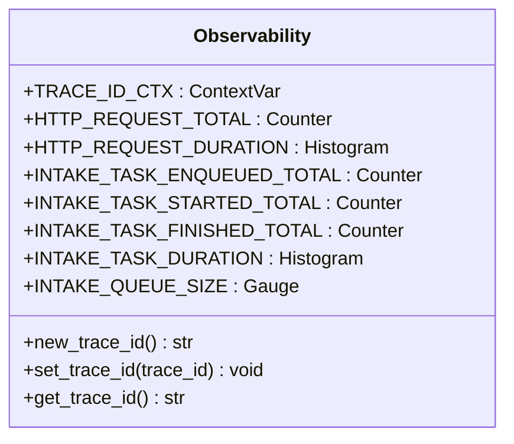

**图表来源**
- [backend/app/core/observability.py:14-28](file://backend/app/core/observability.py#L14-L28)
- [backend/app/core/observability.py:30-67](file://backend/app/core/observability.py#L30-L67)
- [backend/app/core/observability.py:69-90](file://backend/app/core/observability.py#L69-L90)

**章节来源**
- [backend/app/core/observability.py:1-90](file://backend/app/core/observability.py#L1-L90)

### 组件I：对话API与RAG（业务逻辑插件）
- 设计要点
  - 路由：/api/chat/send、/api/chat/conversations/{username}、/api/chat/history/{conversation_id}、/api/chat/conversations/{conversation_id}。
  - 流程：用户/对话/消息模型管理；RAG检索；AI生成；持久化。
  - 可插拔：qwen_service与vector_store通过依赖注入，便于替换。
  - **新增** 会话集成：通过会话存储服务获取用户会话状态。
  - **新增** 组合集成：通过组合管理服务获取技能和MCP工具配置。
- 扩展方法
  - 新AI模型：实现generate_embedding与chat/chat_with_rag接口，替换qwen_service。
  - 新检索策略：调整top_k、search_params或引入混合检索。
  - 新业务：在router中新增子路由，复用现有模型与服务。
  - **新增** 会话管理：通过会话存储服务管理用户会话状态。
  - **新增** 组合管理：通过组合管理服务管理技能和MCP工具配置。

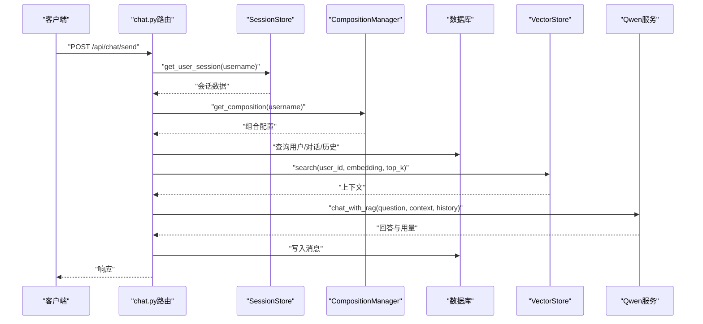

**图表来源**
- [backend/app/api/chat.py:45-154](file://backend/app/api/chat.py#L45-L154)
- [backend/app/services/vector_store.py:100-142](file://backend/app/services/vector_store.py#L100-L142)
- [backend/app/services/session_store.py:135-151](file://backend/app/services/session_store.py#L135-L151)
- [backend/app/services/composition_manager.py:117-136](file://backend/app/services/composition_manager.py#L117-L136)

**章节来源**
- [backend/app/api/chat.py:1-224](file://backend/app/api/chat.py#L1-L224)

### 组件J：数据模型与会话（持久化插件）
- 设计要点
  - 用户、对话、消息、教育数据、成绩、课程等模型，统一通过Base与get_db会话管理。
  - 教育数据表按用户唯一关联，便于RAG检索与用户隔离。
- 扩展方法
  - 新实体：继承Base，定义列与关系，加入__init__.py并创建表。
  - 新字段：在现有模型上扩展JSON字段或新增明细表，保持向后兼容。

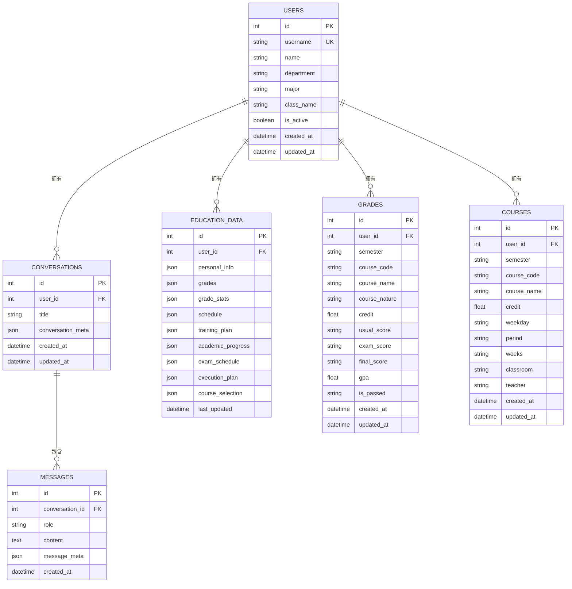

**图表来源**
- [backend/app/models/user.py:11-33](file://backend/app/models/user.py#L11-L33)
- [backend/app/models/conversation.py:11-42](file://backend/app/models/conversation.py#L11-L42)
- [backend/app/models/education_data.py:11-103](file://backend/app/models/education_data.py#L11-L103)
- [backend/app/models/base.py:10-29](file://backend/app/models/base.py#L10-L29)

**章节来源**
- [backend/app/models/user.py:1-33](file://backend/app/models/user.py#L1-L33)
- [backend/app/models/conversation.py:1-42](file://backend/app/models/conversation.py#L1-L42)
- [backend/app/models/education_data.py:1-103](file://backend/app/models/education_data.py#L1-L103)
- [backend/app/models/base.py:1-29](file://backend/app/models/base.py#L1-L29)

## 依赖分析
- 外部依赖：FastAPI、requests、beautifulsoup4、pymilvus、openai/dashscope、langchain、**redis**、**prometheus_client**等。
- 内部耦合：main.py动态导入chat路由、组合路由、MCP路由和技能路由；chat.py依赖数据库、qwen_service与vector_store；**新增** 会话存储服务被多个模块共享使用；**新增** 组合管理服务协调技能和MCP工具；**新增** MCP注册中心统一管理工具；**新增** 可观测性服务提供监控指标。

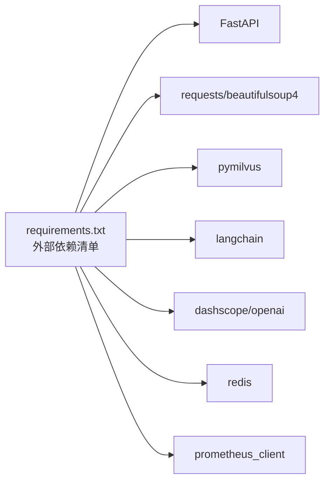

**图表来源**
- [backend/requirements.txt:1-51](file://backend/requirements.txt#L1-L51)

**章节来源**
- [backend/requirements.txt:1-51](file://backend/requirements.txt#L1-L51)

## 性能考虑
- 爬虫性能
  - 合理设置超时与重试，避免阻塞请求。
  - 对于大列表查询（如成绩、课表），分页或限制返回数量。
- 向量检索
  - 调整nprobe与索引类型，在召回与速度间权衡。
  - 按用户维度检索，减少扫描范围。
- **新增** 会话存储性能
  - Redis存储提供高性能访问，适合高并发场景。
  - 内存存储作为回退方案，适合单实例部署。
  - TTL机制自动清理过期会话，避免内存泄漏。
  - 序列化开销较小，适合频繁的会话操作。
- **新增** 组合管理性能
  - 组合配置缓存到本地文件，减少数据库访问。
  - 工具排序基于权重和配置，支持快速计算。
  - 技能过滤基于启用状态，提高查询效率。
- **新增** MCP工具性能
  - 工具注册中心支持动态加载，减少启动时间。
  - HTTP工具支持超时控制，避免阻塞。
  - 工具调用支持异步执行，提高并发性能。
- **新增** 可观测性性能
  - 指标收集使用轻量级实现，避免性能开销。
  - trace_id上下文使用ContextVar，提供高效访问。
  - 中间件自动处理指标收集，无需额外代码。
- 数据库存取
  - 使用合适的索引（外键、JSON字段按需索引）。
  - 批量插入与flush时机控制。
- 缓存与中间件
  - 引入Redis缓存热点数据（如选项、验证码）。
  - CORS与限流中间件按需开启。

## 故障排查指南
- 登录失败
  - 检查验证码session是否过期、服务器选择是否一致。
  - 查看响应内容中的错误提示（密码/验证码/用户名）。
- 向量检索失败
  - 确认Milvus连接正常、集合存在且已load。
  - 检查embedding维度与索引参数是否匹配。
- **新增** 会话存储问题
  - 检查Redis连接是否正常，确认REDIS_HOST和REDIS_PORT配置正确。
  - 查看会话存储日志，确认Redis不可用时是否正确回退到内存存储。
  - 验证会话TTL设置是否合理，避免会话过早过期。
  - 检查会话序列化/反序列化是否正常工作。
- **新增** 组合管理问题
  - 检查组合配置文件是否存在和可读。
  - 验证技能和MCP工具的启用状态配置。
  - 查看组合解析日志，确认工具排序和权重设置。
- **新增** MCP工具问题
  - 检查工具注册中心是否正常初始化。
  - 验证外部工具配置文件格式和内容。
  - 查看工具调用日志，确认参数传递和返回值。
- **新增** 技能管理问题
  - 检查技能文件是否存在和可读。
  - 验证YAML格式和必需字段。
  - 查看技能路由匹配日志，确认触发词识别。
- **新增** 可观测性问题
  - 检查Prometheus端点是否可访问。
  - 验证trace_id中间件是否正常工作。
  - 查看指标收集日志，确认指标标签正确。
- 数据库连接异常
  - 检查DATABASE_URL环境变量与PostgreSQL可达性。
- API不可用
  - 确认chat模块导入状态与路由注册。
  - 检查组合、MCP和技能路由是否正确注册。

**章节来源**
- [backend/main.py:192-328](file://backend/main.py#L192-L328)
- [backend/app/services/vector_store.py:24-36](file://backend/app/services/vector_store.py#L24-L36)
- [backend/app/services/session_store.py:38-52](file://backend/app/services/session_store.py#L38-L52)
- [backend/app/services/composition_manager.py:33-43](file://backend/app/services/composition_manager.py#L33-L43)
- [backend/app/services/mcp_registry.py:124-167](file://backend/app/services/mcp_registry.py#L124-L167)
- [backend/app/services/skill_manager.py:50-73](file://backend/app/services/skill_manager.py#L50-L73)
- [backend/app/core/observability.py:30-67](file://backend/app/core/observability.py#L30-L67)
- [backend/app/models/base.py:10-18](file://backend/app/models/base.py#L10-L18)

## 结论
本项目通过清晰的分层与模块化设计，为扩展与插件化提供了良好基础：
- 教育选项系统与爬虫模块可独立演进，API保持稳定。
- 向量存储服务采用适配器模式，易于替换后端。
- **新增** 会话存储服务提供Redis持久化和自动回退机制，支持水平扩展。
- **新增** 组合管理系统支持用户级别的技能和MCP工具自由拼接，提供灵活的AI能力组合。
- **新增** MCP注册中心统一管理内外部工具，支持动态加载和HTTP适配。
- **新增** 技能管理服务提供YAML声明式配置，支持社区化的技能分享。
- **新增** 可观测性服务提供完整的监控指标和追踪能力，支持生产环境部署。
- 对话API与RAG流程通过依赖注入实现AI服务替换。
- 建议后续完善：统一中间件与认证扩展点、缓存策略、按学号数据隔离、完善的单元测试与监控告警。

## 附录

### 插件开发指南（最佳实践）
- 接口定义
  - AI服务：提供generate_embedding与chat/chat_with_rag接口，返回success/content/usage/sources等字段。
  - 向量存储：提供create_collection/add_documents/search/delete_user_data/close等方法。
  - **新增** 会话存储：提供set/get/pop/list方法，支持TTL和序列化。
  - **新增** 组合管理：提供set_skill_enabled/set_mcp_enabled/reorder_mcp等方法。
  - **新增** MCP工具：提供register/list_tools/call_tool等统一接口。
  - **新增** 技能管理：提供upload_skill/list_skills/set_enabled等方法。
  - 爬虫：统一返回结构(success/data/count/stats)，便于上层处理。
- 配置管理
  - 使用环境变量控制服务地址、模型与索引参数，避免硬编码。
  - **新增** 会话存储配置：REDIS_HOST、REDIS_PORT控制Redis连接。
  - **新增** 组合配置：支持用户级别的技能和工具配置文件。
  - **新增** MCP工具配置：external_tools.json支持外部工具声明式配置。
  - 在main.py中按需启用/禁用模块（如chat路由）。
- 生命周期管理
  - 初始化：在应用启动时建立连接与索引。
  - 使用：按需加载集合、插入与检索。
  - **新增** 会话存储：自动检测Redis可用性，建立连接或准备内存存储。
  - **新增** 组合管理：自动加载用户配置，支持实时更新。
  - **新增** MCP工具：动态加载外部配置，支持热重载。
  - **新增** 技能管理：自动扫描技能文件，支持YAML验证。
  - 关闭：释放连接与资源，避免泄露。

**章节来源**
- [backend/app/api/chat.py:45-154](file://backend/app/api/chat.py#L45-L154)
- [backend/app/services/vector_store.py:14-40](file://backend/app/services/vector_store.py#L14-L40)
- [backend/app/services/session_store.py:25-53](file://backend/app/services/session_store.py#L25-L53)
- [backend/app/services/composition_manager.py:16-32](file://backend/app/services/composition_manager.py#L16-L32)
- [backend/app/services/mcp_registry.py:34-40](file://backend/app/services/mcp_registry.py#L34-L40)
- [backend/app/services/skill_manager.py:28-32](file://backend/app/services/skill_manager.py#L28-L32)
- [backend/scraper.py:13-60](file://backend/scraper.py#L13-L60)
- [backend/main.py:27-38](file://backend/main.py#L27-L38)

### API扩展点设计
- 中间件集成
  - CORS、限流、日志、认证中间件按需注册。
  - **新增** 可观测性中间件：自动添加trace_id和指标收集。
- 认证扩展
  - 支持多认证方式（学号登录、第三方Token），在main.py中统一处理。
  - **新增** 会话存储集成：通过会话存储服务管理认证状态。
- 业务逻辑插件
  - 在chat.py中新增子路由，复用现有模型与服务，保持一致性。
  - **新增** 组合管理集成：通过组合管理服务获取技能和MCP工具配置。
  - **新增** MCP工具集成：通过MCP注册中心统一管理工具调用。
  - **新增** 技能路由集成：通过技能路由服务进行智能问题匹配。
  - **新增** 会话状态管理：通过会话存储服务获取用户会话状态。

**章节来源**
- [backend/main.py:41-48](file://backend/main.py#L41-L48)
- [backend/app/api/chat.py:156-224](file://backend/app/api/chat.py#L156-L224)
- [backend/app/services/session_store.py:171-186](file://backend/app/services/session_store.py#L171-L186)
- [backend/app/services/composition_manager.py:117-136](file://backend/app/services/composition_manager.py#L117-L136)
- [backend/app/services/mcp_registry.py:207-224](file://backend/app/services/mcp_registry.py#L207-224)
- [backend/app/services/skill_router.py:14-36](file://backend/app/services/skill_router.py#L14-L36)

### 第三方服务集成指南
- 新增AI模型
  - 实现与qwen_service相同的接口，替换依赖注入。
  - 配置API Key与模型参数，确保generate_embedding与chat返回一致结构。
- 新增向量库
  - 实现VectorStore接口，设置连接参数与索引策略。
  - 在应用中注入新实例，替换全局vector_store。
- **新增** 新增会话存储后端
  - 实现SessionStore接口，支持TTL和序列化功能。
  - 在应用中注入新实例，替换全局session_store。
  - 配置环境变量控制连接参数。
- **新增** 新增MCP工具
  - 实现MCPToolSpec规范，支持Python模块和HTTP工具。
  - 在external_tools.json中声明工具配置，支持动态加载。
  - 提供输入Schema和参数验证，确保工具安全性。
- **新增** 新增技能
  - 编写YAML配置文件，包含必需字段和工具列表。
  - 支持GitHub导入和本地上传，提供格式验证。
  - 通过技能路由服务进行智能匹配和提示生成。
- **新增** 新增可观测性
  - 集成Prometheus指标收集，提供标准监控端点。
  - 实现trace_id追踪，支持分布式系统监控。
  - 提供健康检查和指标导出功能。
- 缓存与监控
  - 引入Redis缓存热点数据，降低后端压力。
  - 增加健康检查与指标上报，提升可观测性。

**章节来源**
- [backend/requirements.txt:22-34](file://backend/requirements.txt#L22-L34)
- [backend/app/services/vector_store.py:14-40](file://backend/app/services/vector_store.py#L14-L40)
- [backend/app/services/session_store.py:25-53](file://backend/app/services/session_store.py#L25-L53)
- [backend/app/services/mcp_registry.py:20-32](file://backend/app/services/mcp_registry.py#L20-L32)
- [backend/app/services/skill_manager.py:38-49](file://backend/app/services/skill_manager.py#L38-L49)
- [backend/app/core/observability.py:30-67](file://backend/app/core/observability.py#L30-L67)
- [backend/main.py:39-48](file://backend/main.py#L39-L48)

### 组合系统详细说明
- **新增** 组合配置结构
  - skills.entries：技能启用状态和优先级配置
  - mcp.entries：MCP工具启用状态和权重配置
  - mcp.order：MCP工具执行顺序配置
  - updated_at：配置更新时间戳
- **新增** 技能管理功能
  - 技能上传：支持YAML文件上传和内容验证
  - 技能导入：支持GitHub URL导入和内容长度限制
  - 技能启用：支持启用/禁用和优先级设置
  - 技能路由：基于触发词的问题匹配和提示生成
- **新增** MCP工具管理功能
  - 工具注册：支持内置和外部工具统一注册
  - 工具调用：支持Python模块和HTTP工具异步调用
  - 工具配置：支持JSON配置文件和动态导入
  - 工具排序：基于权重和用户配置的优先级排序
- **新增** 外部工具配置
  - external_tools.json：用户自定义外部工具配置
  - external_tools.generated.json：自动生成的工具配置模板
  - 支持HTTP工具适配和参数验证
  - 提供工具Schema和健康检查功能

**章节来源**
- [backend/app/services/composition_manager.py:25-32](file://backend/app/services/composition_manager.py#L25-L32)
- [backend/app/services/skill_manager.py:50-61](file://backend/app/services/skill_manager.py#L50-L61)
- [backend/app/services/mcp_registry.py:124-167](file://backend/app/services/mcp_registry.py#L124-L167)
- [backend/app/mcp/external_tools.json:1-80](file://backend/app/mcp/external_tools.json#L1-L80)
- [backend/app/mcp/external_tools.generated.json:1-154](file://backend/app/mcp/external_tools.generated.json#L1-L154)

### 可观测性系统详细说明
- **新增** 指标类型
  - HTTP请求指标：campus_http_requests_total，包含方法、路径、状态标签
  - HTTP请求延迟：campus_http_request_duration_seconds，包含方法、路径标签
  - Intake任务指标：enqueue/start/finish/duration，包含结果状态标签
  - 队列状态指标：campus_intake_queue_size和campus_intake_running_size
  - 聊天流指标：campus_chat_stream_requests_total和campus_chat_stream_duration
- **新增** 追踪功能
  - trace_id上下文：使用ContextVar提供线程安全的追踪ID管理
  - 中间件集成：自动为所有请求添加x-trace-id响应头
  - 异常追踪：在异常情况下自动记录追踪ID和指标
- **新增** 健康检查
  - /api/health：基本健康检查端点
  - /api/metrics：Prometheus指标导出端点
  - 工具健康检查：MCP工具的存活状态检查
  - 数据库连接检查：自动检测数据库可用性

**章节来源**
- [backend/app/core/observability.py:30-90](file://backend/app/core/observability.py#L30-L90)
- [backend/main.py:49-69](file://backend/main.py#L49-L69)
- [backend/main.py:127-129](file://backend/main.py#L127-L129)

### 前端组合页面详细说明
- **新增** 组合页面功能
  - 技能管理：显示用户拥有的技能列表，支持启用/禁用和优先级设置
  - MCP工具管理：显示MCP工具列表，支持启用/禁用和权重设置
  - 工具排序：支持拖拽排序，调整MCP工具的执行优先级
  - 实时更新：支持保存后立即刷新显示状态
- **新增** API交互
  - GET /api/composition/{username}：获取用户组合配置
  - POST /api/composition/skills：设置技能启用状态
  - POST /api/composition/mcp：设置MCP工具启用状态和权重
  - POST /api/composition/mcp/reorder：重新排序MCP工具
- **新增** 错误处理
  - 保存失败：显示详细的错误信息和状态码
  - 网络异常：提供友好的错误提示和重试机制
  - 权限验证：确保用户只能访问自己的组合配置

**章节来源**
- [frontend/src/app/composition/page.tsx:95-137](file://frontend/src/app/composition/page.tsx#L95-L137)
- [frontend/src/app/composition/page.tsx:139-149](file://frontend/src/app/composition/page.tsx#L139-L149)
- [frontend/src/app/composition/page.tsx:151-158](file://frontend/src/app/composition/page.tsx#L151-L158)