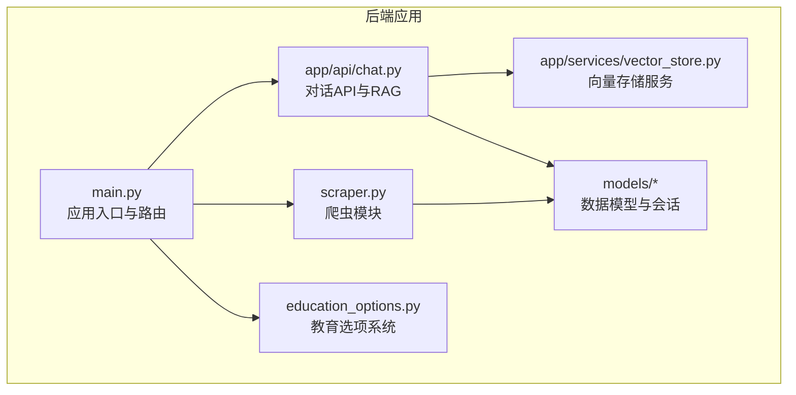
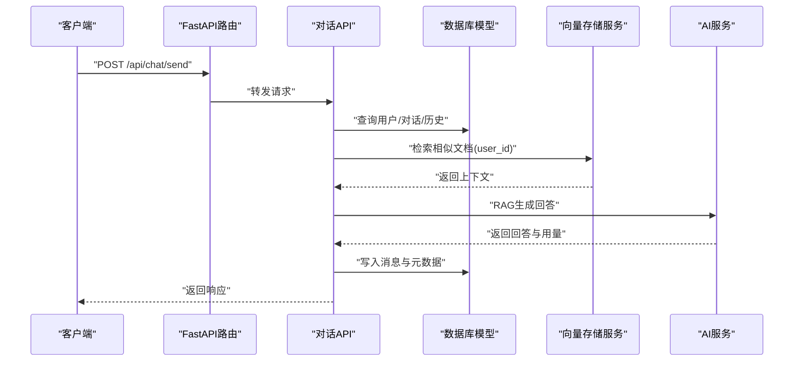
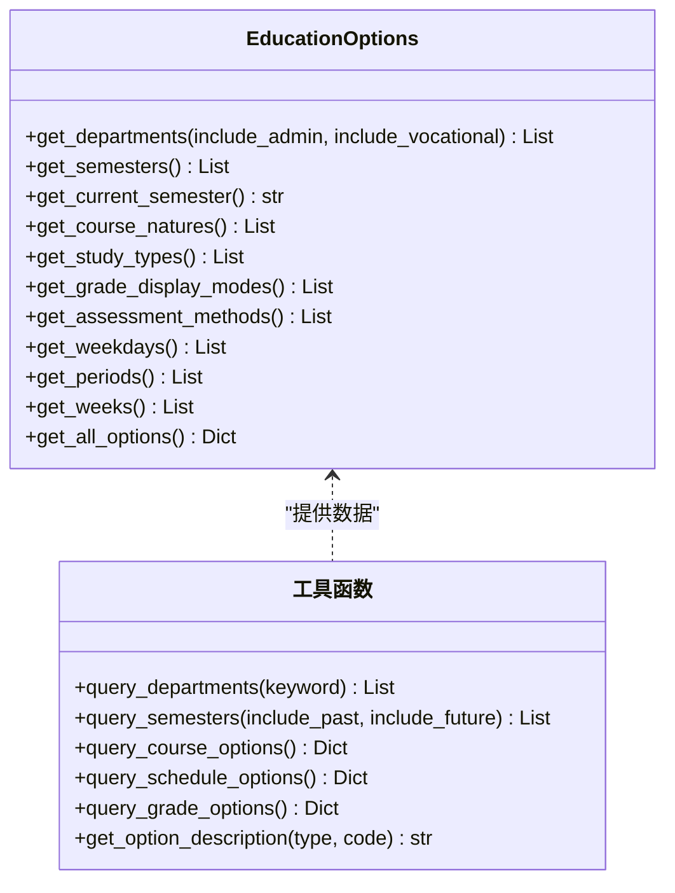
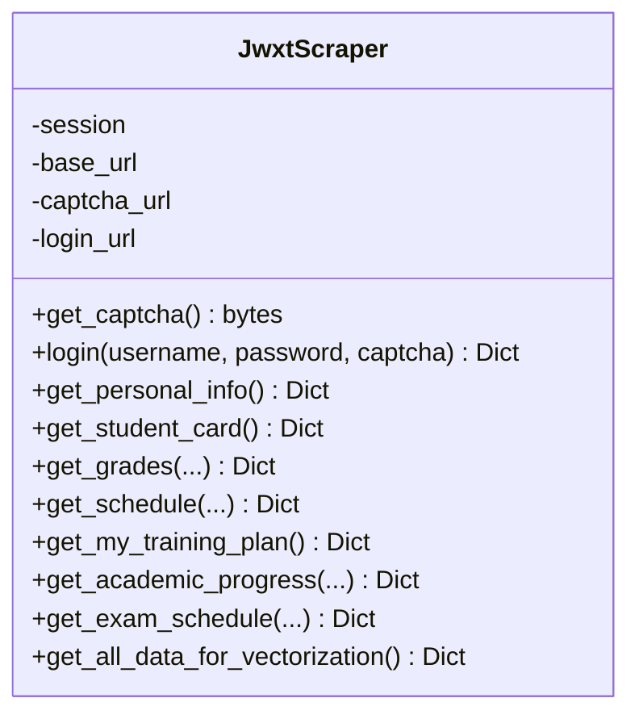
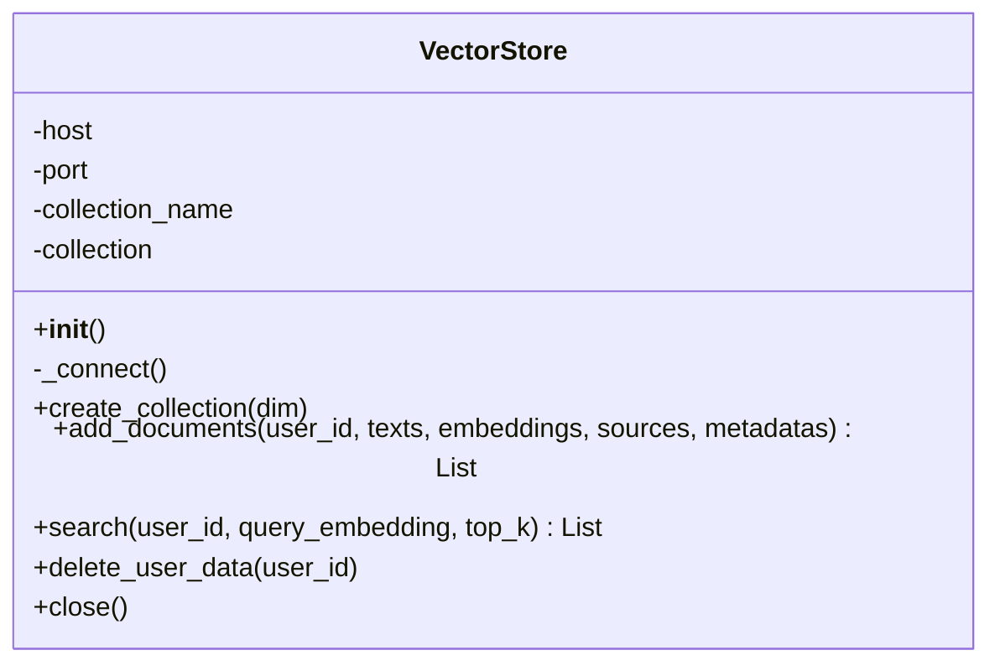
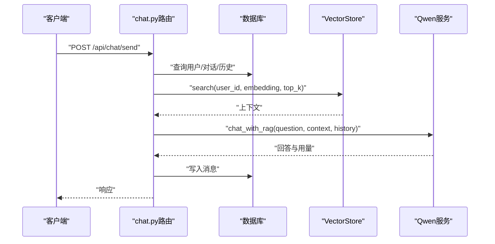
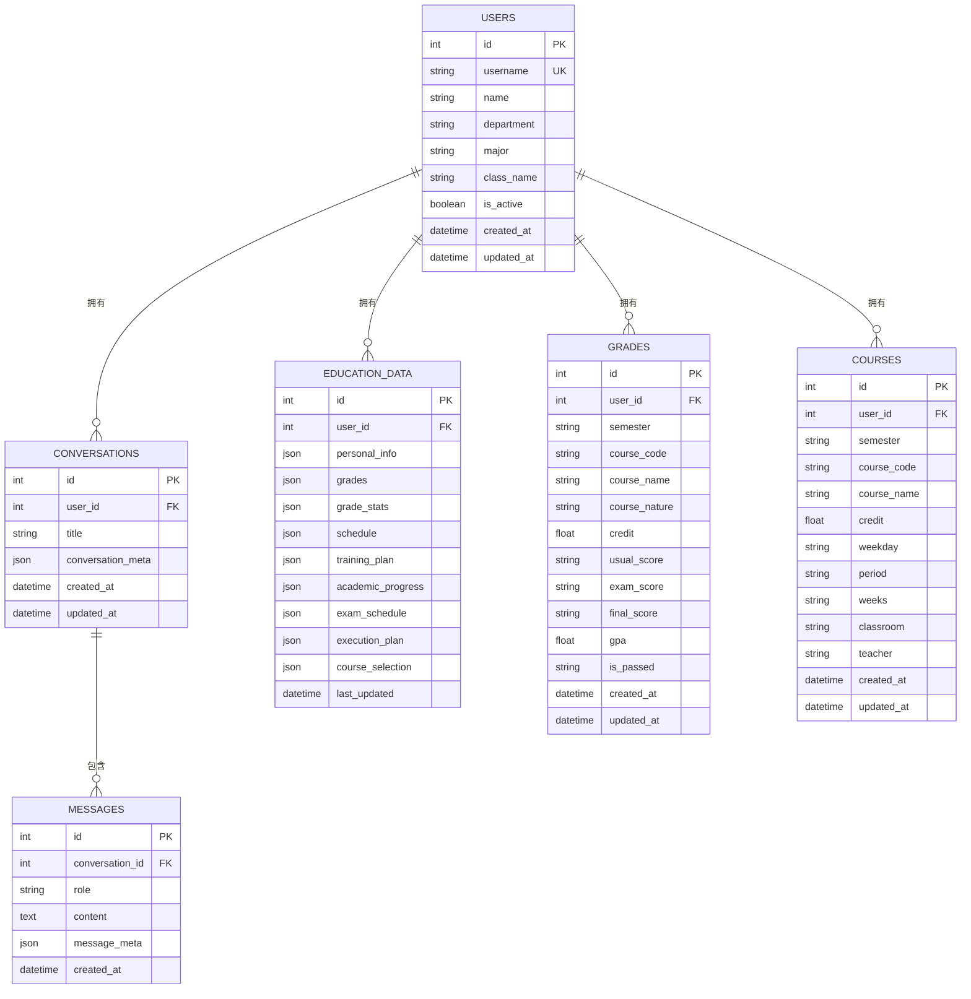
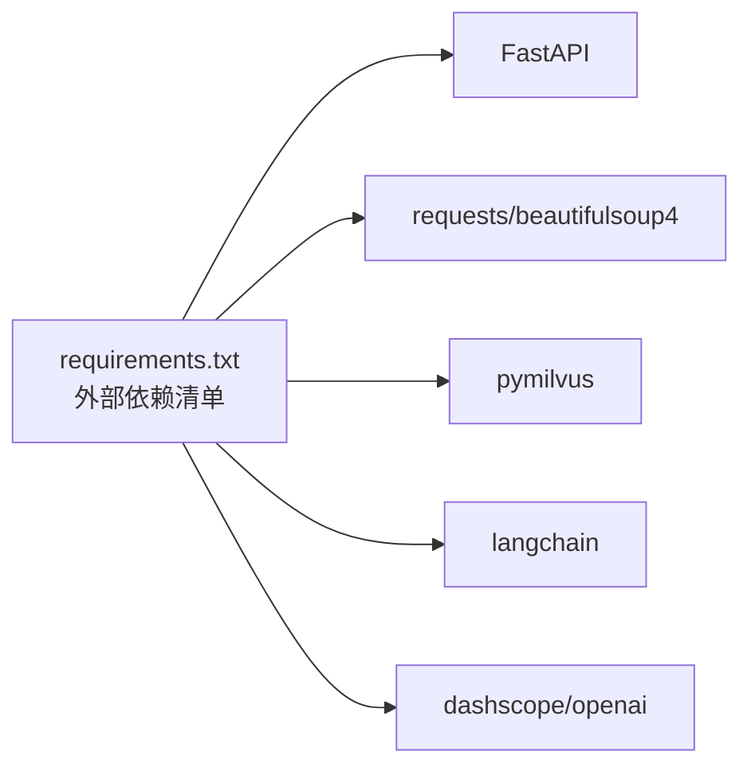

# 扩展点与插件

<cite>
**本文档引用的文件**
- [backend/main.py](file://backend/main.py)
- [backend/education_options.py](file://backend/education_options.py)
- [backend/app/services/vector_store.py](file://backend/app/services/vector_store.py)
- [backend/scraper.py](file://backend/scraper.py)
- [backend/app/api/chat.py](file://backend/app/api/chat.py)
- [backend/app/models/education_data.py](file://backend/app/models/education_data.py)
- [backend/app/models/base.py](file://backend/app/models/base.py)
- [backend/app/models/conversation.py](file://backend/app/models/conversation.py)
- [backend/app/models/user.py](file://backend/app/models/user.py)
- [backend/test_scraper.py](file://backend/test_scraper.py)
- [backend/requirements.txt](file://backend/requirements.txt)
- [README.md](file://README.md)
</cite>

## 目录
1. [简介](#简介)
2. [项目结构](#项目结构)
3. [核心组件](#核心组件)
4. [架构总览](#架构总览)
5. [详细组件分析](#详细组件分析)
6. [依赖分析](#依赖分析)
7. [性能考虑](#性能考虑)
8. [故障排查指南](#故障排查指南)
9. [结论](#结论)
10. [附录](#附录)

## 简介
本文件面向“智能教务系统AI助手”的扩展与插件化需求，系统性梳理后端可扩展架构，重点覆盖以下方面：
- AI服务插件化：如何替换或扩展对话与RAG能力（当前以千问为例）。
- 向量数据库适配器：如何新增或切换向量存储后端（当前以Milvus为例）。
- 爬虫模块扩展：如何接入新的数据源或适配不同教务系统。
- 教育选项系统插件架构：如何扩展AI工具可用的选项数据与查询能力。
- API扩展点：中间件、认证扩展、业务逻辑插件的开发方法。
- 第三方服务集成：如何安全、稳定地接入新的AI模型、缓存与向量库。

## 项目结构
后端采用FastAPI + SQLAlchemy + LangChain生态的分层组织：
- 应用入口与路由：backend/main.py
- 教育选项系统：backend/education_options.py
- 爬虫模块：backend/scraper.py
- 向量存储服务：backend/app/services/vector_store.py
- 对话API与RAG流程：backend/app/api/chat.py
- 数据模型与数据库会话：backend/app/models/*
- 测试与依赖：backend/test_scraper.py、backend/requirements.txt

**图表来源**
- [backend/main.py:1-120](file://backend/main.py#L1-L120)
- [backend/app/api/chat.py:1-60](file://backend/app/api/chat.py#L1-L60)
- [backend/app/services/vector_store.py:1-40](file://backend/app/services/vector_store.py#L1-L40)
- [backend/scraper.py:1-40](file://backend/scraper.py#L1-L40)
- [backend/education_options.py:1-40](file://backend/education_options.py#L1-L40)
- [backend/app/models/base.py:1-29](file://backend/app/models/base.py#L1-L29)

**章节来源**
- [backend/main.py:1-120](file://backend/main.py#L1-L120)
- [README.md:25-41](file://README.md#L25-L41)

## 核心组件
- 应用入口与路由：负责注册API、CORS中间件、健康检查、根路径说明，并按模块动态加载聊天API。
- 教育选项系统：集中维护下拉选项、AI工具函数与描述映射，作为AI工具的数据源。
- 爬虫模块：封装对教务系统的登录、验证码、个人信息、成绩、课表、培养方案、学业进度、考试安排等数据抓取。
- 向量存储服务：封装Milvus连接、集合创建、索引策略、增删改查与用户数据隔离。
- 对话API与RAG：封装用户/对话/消息模型，实现RAG检索与AI回复的流水线。
- 数据模型与会话：统一数据库连接、会话管理与实体定义。

**章节来源**
- [backend/main.py:39-80](file://backend/main.py#L39-L80)
- [backend/education_options.py:130-260](file://backend/education_options.py#L130-L260)
- [backend/scraper.py:13-60](file://backend/scraper.py#L13-L60)
- [backend/app/services/vector_store.py:14-40](file://backend/app/services/vector_store.py#L14-L40)
- [backend/app/api/chat.py:18-42](file://backend/app/api/chat.py#L18-L42)
- [backend/app/models/base.py:10-29](file://backend/app/models/base.py#L10-L29)

## 架构总览
后端通过FastAPI提供REST接口，爬虫模块负责数据采集，向量存储服务承载RAG向量索引，对话API串联数据库、向量检索与AI服务，形成“采集-索引-检索-生成”的闭环。

**图表来源**
- [backend/app/api/chat.py:45-154](file://backend/app/api/chat.py#L45-L154)
- [backend/app/services/vector_store.py:100-142](file://backend/app/services/vector_store.py#L100-L142)
- [backend/app/models/education_data.py:11-48](file://backend/app/models/education_data.py#L11-L48)

## 详细组件分析

### 组件A：教育选项系统（插件化AI工具数据源）
- 设计要点
  - 集中式选项数据：院系、学期、课程性质、修读类别、成绩显示方式、考核方式、星期/节次/周次等。
  - 工具函数：query_departments、query_semesters、query_course_options、query_schedule_options、query_grade_options、get_option_description。
  - 可扩展性：新增选项类型只需在类中新增字段与工具函数，对外保持稳定的API。
- 扩展方法
  - 新增选项类型：在类中添加枚举列表与静态方法，同时在工具函数中暴露查询接口。
  - 新增AI工具：编写工具函数，返回结构化选项数据，供对话API与前端使用。
- 生命周期
  - 初始化：随模块导入加载，无需显式初始化。
  - 查询：通过HTTP接口或内部函数调用，避免重复计算。

**图表来源**
- [backend/education_options.py:130-260](file://backend/education_options.py#L130-L260)
- [backend/education_options.py:262-420](file://backend/education_options.py#L262-L420)

**章节来源**
- [backend/education_options.py:1-420](file://backend/education_options.py#L1-L420)

### 组件B：爬虫模块（数据采集插件化）
- 设计要点
  - JwxtScraper类封装登录、验证码、个人信息、成绩、课表、培养方案、学业进度、考试安排、执行计划、选课信息等。
  - 无需登录接口：教师/课程查询等公开接口。
  - 登录相关接口：依赖会话与服务器选择逻辑。
- 扩展方法
  - 新增数据源：新增方法，遵循现有返回结构（success/data/count/stats等），并在main.py中注册对应API。
  - 多系统适配：通过构造函数注入base_url与登录URL，实现多学校/多版本兼容。
- 生命周期
  - 初始化：传入requests.Session与基础URL。
  - 调用：按需调用对应方法，注意异常处理与编码设置。

**图表来源**
- [backend/scraper.py:13-60](file://backend/scraper.py#L13-L60)
- [backend/scraper.py:61-120](file://backend/scraper.py#L61-L120)
- [backend/scraper.py:153-237](file://backend/scraper.py#L153-L237)

**章节来源**
- [backend/scraper.py:1-800](file://backend/scraper.py#L1-L800)
- [backend/test_scraper.py:103-118](file://backend/test_scraper.py#L103-L118)

### 组件C：向量存储服务（适配器模式）
- 设计要点
  - VectorStore封装Milvus连接、集合创建、索引策略、插入、检索、删除与关闭。
  - 用户隔离：通过user_id过滤与删除，保证数据边界。
  - 环境变量：通过MILVUS_HOST/MILVUS_PORT/MILVUS_COLLECTION控制连接参数。
- 扩展方法
  - 新增向量库：实现同名接口（连接、创建集合、索引、增删改查、关闭），在应用中注入新实例。
  - 自定义索引策略：调整index_params与metric_type，平衡召回率与性能。
- 生命周期
  - 初始化：读取环境变量并连接。
  - 使用：按需创建集合与索引，插入与检索时自动加载。
  - 关闭：释放连接。

**图表来源**
- [backend/app/services/vector_store.py:14-40](file://backend/app/services/vector_store.py#L14-L40)
- [backend/app/services/vector_store.py:73-99](file://backend/app/services/vector_store.py#L73-L99)
- [backend/app/services/vector_store.py:100-142](file://backend/app/services/vector_store.py#L100-L142)

**章节来源**
- [backend/app/services/vector_store.py:1-164](file://backend/app/services/vector_store.py#L1-L164)

### 组件D：对话API与RAG（业务逻辑插件）
- 设计要点
  - 路由：/api/chat/send、/api/chat/conversations/{username}、/api/chat/history/{conversation_id}、/api/chat/conversations/{conversation_id}。
  - 流程：用户/对话/消息模型管理；RAG检索；AI生成；持久化。
  - 可插拔：qwen_service与vector_store通过依赖注入，便于替换。
- 扩展方法
  - 新AI模型：实现generate_embedding与chat/chat_with_rag接口，替换qwen_service。
  - 新检索策略：调整top_k、search_params或引入混合检索。
  - 新业务：在router中新增子路由，复用现有模型与服务。

**图表来源**
- [backend/app/api/chat.py:45-154](file://backend/app/api/chat.py#L45-L154)
- [backend/app/services/vector_store.py:100-142](file://backend/app/services/vector_store.py#L100-L142)

**章节来源**
- [backend/app/api/chat.py:1-224](file://backend/app/api/chat.py#L1-L224)

### 组件E：数据模型与会话（持久化插件）
- 设计要点
  - 用户、对话、消息、教育数据、成绩、课程等模型，统一通过Base与get_db会话管理。
  - 教育数据表按用户唯一关联，便于RAG检索与用户隔离。
- 扩展方法
  - 新实体：继承Base，定义列与关系，加入__init__.py并创建表。
  - 新字段：在现有模型上扩展JSON字段或新增明细表，保持向后兼容。

**图表来源**
- [backend/app/models/user.py:11-33](file://backend/app/models/user.py#L11-L33)
- [backend/app/models/conversation.py:11-42](file://backend/app/models/conversation.py#L11-L42)
- [backend/app/models/education_data.py:11-103](file://backend/app/models/education_data.py#L11-L103)
- [backend/app/models/base.py:10-29](file://backend/app/models/base.py#L10-L29)

**章节来源**
- [backend/app/models/user.py:1-33](file://backend/app/models/user.py#L1-L33)
- [backend/app/models/conversation.py:1-42](file://backend/app/models/conversation.py#L1-L42)
- [backend/app/models/education_data.py:1-103](file://backend/app/models/education_data.py#L1-L103)
- [backend/app/models/base.py:1-29](file://backend/app/models/base.py#L1-L29)

## 依赖分析
- 外部依赖：FastAPI、requests、beautifulsoup4、pymilvus、openai/dashscope、langchain等。
- 内部耦合：main.py动态导入chat路由；chat.py依赖数据库、qwen_service与vector_store；scraper与models解耦，通过API间接使用。

**图表来源**
- [backend/requirements.txt:1-44](file://backend/requirements.txt#L1-L44)

**章节来源**
- [backend/requirements.txt:1-44](file://backend/requirements.txt#L1-L44)

## 性能考虑
- 爬虫性能
  - 合理设置超时与重试，避免阻塞请求。
  - 对于大列表查询（如成绩、课表），分页或限制返回数量。
- 向量检索
  - 调整nprobe与索引类型，在召回与速度间权衡。
  - 按用户维度检索，减少扫描范围。
- 数据库存取
  - 使用合适的索引（外键、JSON字段按需索引）。
  - 批量插入与flush时机控制。
- 缓存与中间件
  - 引入Redis缓存热点数据（如选项、验证码）。
  - CORS与限流中间件按需开启。

[本节为通用指导，不直接分析具体文件]

## 故障排查指南
- 登录失败
  - 检查验证码session是否过期、服务器选择是否一致。
  - 查看响应内容中的错误提示（密码/验证码/用户名）。
- 向量检索失败
  - 确认Milvus连接正常、集合存在且已load。
  - 检查embedding维度与索引参数是否匹配。
- 数据库连接异常
  - 检查DATABASE_URL环境变量与PostgreSQL可达性。
- API不可用
  - 确认chat模块导入状态与路由注册。

**章节来源**
- [backend/main.py:192-328](file://backend/main.py#L192-L328)
- [backend/app/services/vector_store.py:24-36](file://backend/app/services/vector_store.py#L24-L36)
- [backend/app/models/base.py:10-18](file://backend/app/models/base.py#L10-L18)

## 结论
本项目通过清晰的分层与模块化设计，为扩展与插件化提供了良好基础：
- 教育选项系统与爬虫模块可独立演进，API保持稳定。
- 向量存储服务采用适配器模式，易于替换后端。
- 对话API与RAG流程通过依赖注入实现AI服务替换。
- 建议后续完善：统一中间件与认证扩展点、缓存策略、按学号数据隔离、完善的单元测试与监控告警。

[本节为总结性内容，不直接分析具体文件]

## 附录

### 插件开发指南（最佳实践）
- 接口定义
  - AI服务：提供generate_embedding与chat/chat_with_rag接口，返回success/content/usage/sources等字段。
  - 向量存储：提供create_collection/add_documents/search/delete_user_data/close等方法。
  - 爬虫：统一返回结构(success/data/count/stats)，便于上层处理。
- 配置管理
  - 使用环境变量控制服务地址、模型与索引参数，避免硬编码。
  - 在main.py中按需启用/禁用模块（如chat路由）。
- 生命周期管理
  - 初始化：在应用启动时建立连接与索引。
  - 使用：按需加载集合、插入与检索。
  - 关闭：释放连接与资源，避免泄露。

**章节来源**
- [backend/app/api/chat.py:45-154](file://backend/app/api/chat.py#L45-L154)
- [backend/app/services/vector_store.py:14-40](file://backend/app/services/vector_store.py#L14-L40)
- [backend/scraper.py:13-60](file://backend/scraper.py#L13-L60)
- [backend/main.py:27-38](file://backend/main.py#L27-L38)

### API扩展点设计
- 中间件集成
  - CORS、限流、日志、认证中间件按需注册。
- 认证扩展
  - 支持多认证方式（学号登录、第三方Token），在main.py中统一处理。
- 业务逻辑插件
  - 在chat.py中新增子路由，复用现有模型与服务，保持一致性。

**章节来源**
- [backend/main.py:41-48](file://backend/main.py#L41-L48)
- [backend/app/api/chat.py:156-224](file://backend/app/api/chat.py#L156-L224)

### 第三方服务集成指南
- 新增AI模型
  - 实现与qwen_service相同的接口，替换依赖注入。
  - 配置API Key与模型参数，确保generate_embedding与chat返回一致结构。
- 新增向量库
  - 实现VectorStore接口，设置连接参数与索引策略。
  - 在应用中注入新实例，替换全局vector_store。
- 缓存与监控
  - 引入Redis缓存热点数据，降低后端压力。
  - 增加健康检查与指标上报，提升可观测性。

**章节来源**
- [backend/requirements.txt:22-34](file://backend/requirements.txt#L22-L34)
- [backend/app/services/vector_store.py:14-40](file://backend/app/services/vector_store.py#L14-L40)
- [backend/main.py:39-48](file://backend/main.py#L39-L48)