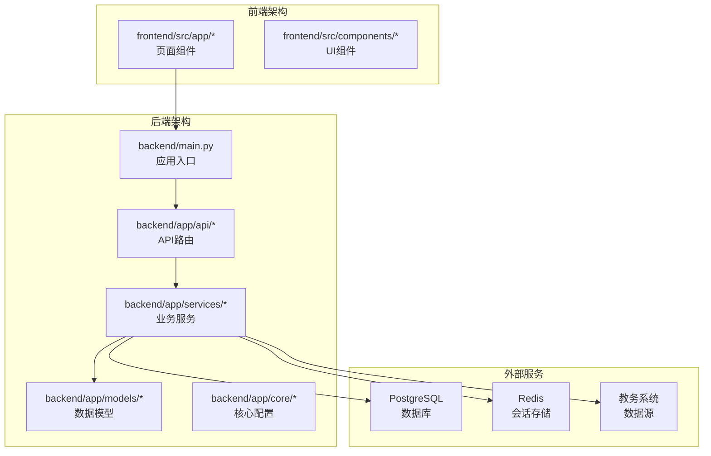
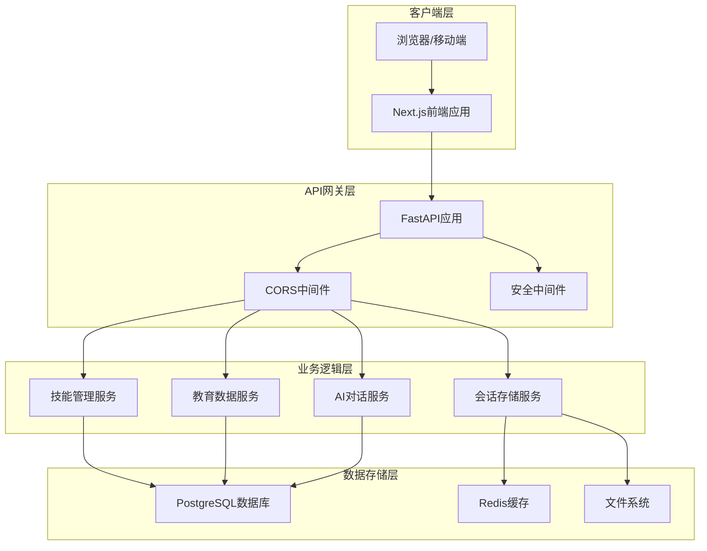
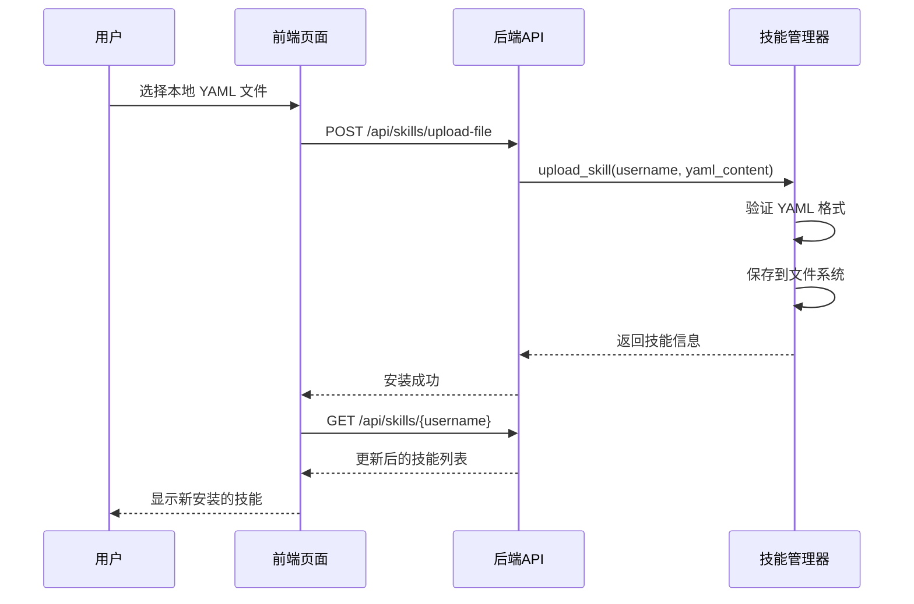
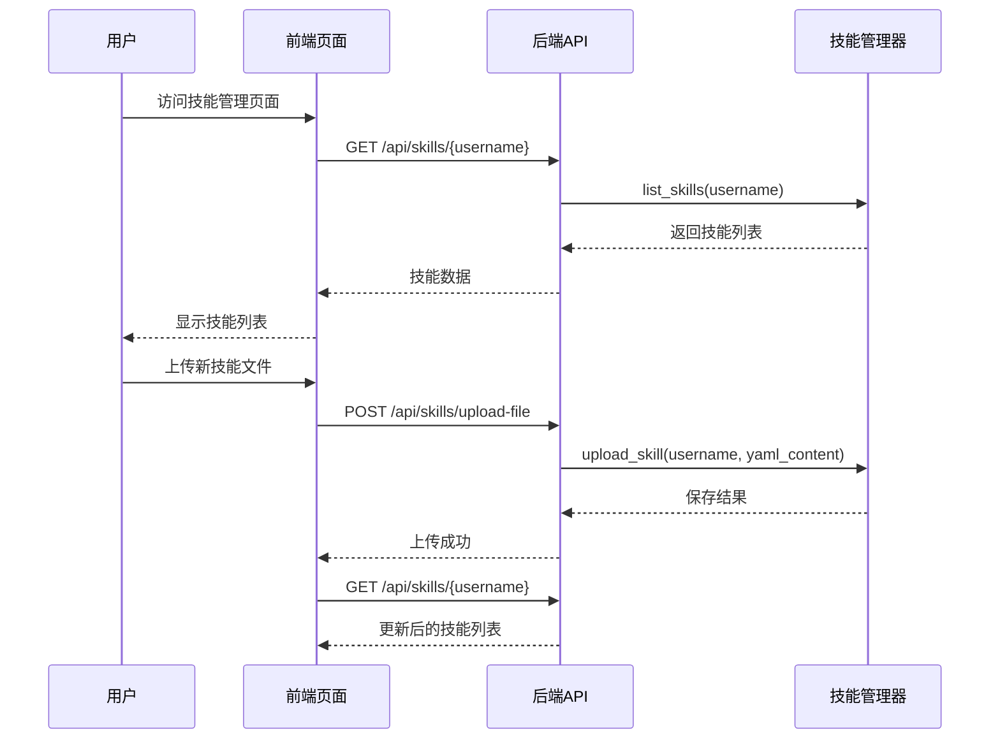
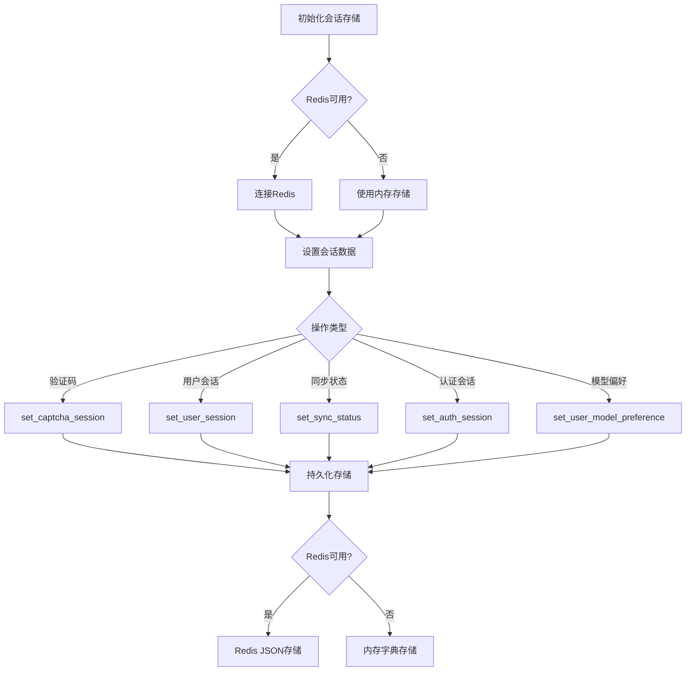
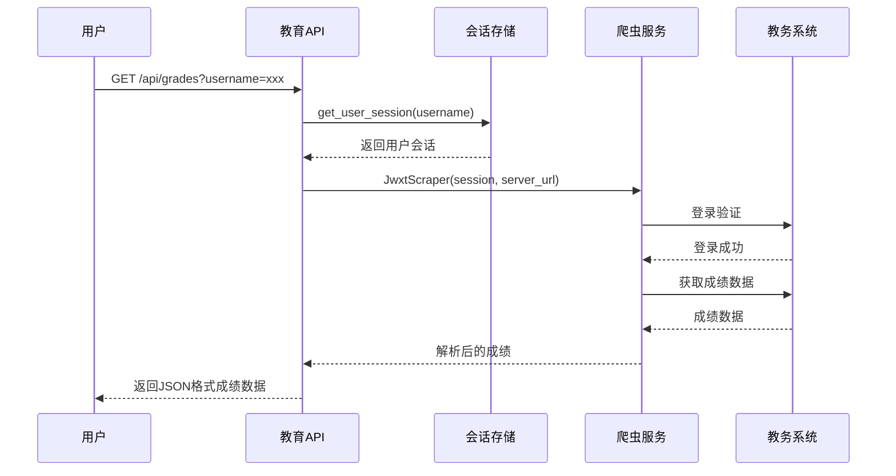
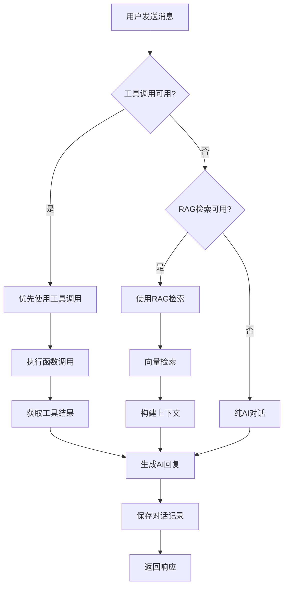
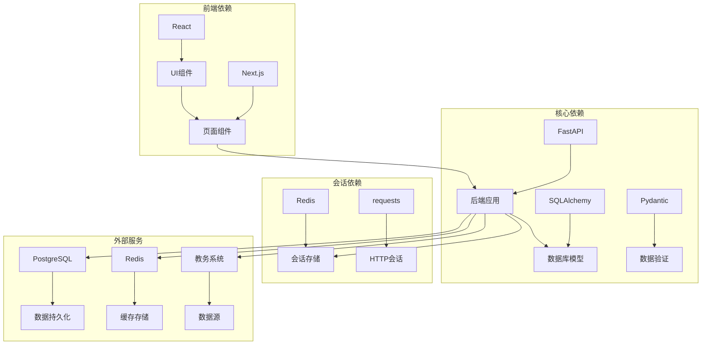
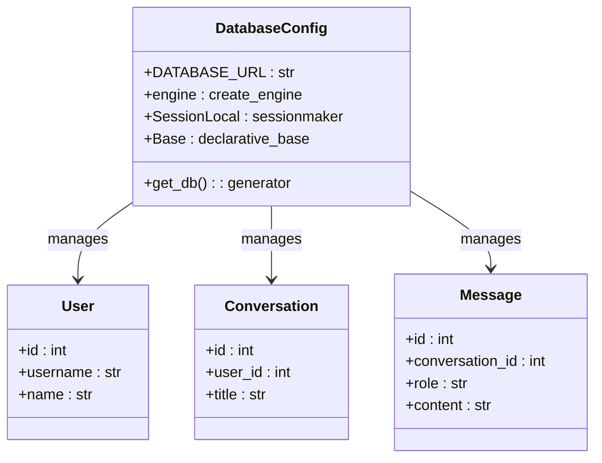

# 技能管理系统

<cite>
**本文档引用的文件**
- [backend/main.py](file://backend/main.py)
- [backend/app/api/skills.py](file://backend/app/api/skills.py)
- [backend/app/services/skill_manager.py](file://backend/app/services/skill_manager.py)
- [frontend/src/app/skills/page.tsx](file://frontend/src/app/skills/page.tsx)
- [skills/README.md](file://skills/README.md)
- [backend/app/models/base.py](file://backend/app/models/base.py)
- [backend/app/core/runtime.py](file://backend/app/core/runtime.py)
- [backend/app/security.py](file://backend/app/security.py)
- [backend/app/services/session_store.py](file://backend/app/services/session_store.py)
- [backend/app/api/chat.py](file://backend/app/api/chat.py)
- [backend/app/api/education.py](file://backend/app/api/education.py)
</cite>

## 更新摘要
**变更内容**
- 新增文件上传功能，支持 .yaml/.yml 文件直接上传安装技能
- 增强技能管理的灵活性，提供多种技能安装方式
- 更新前端界面以支持文件上传操作
- 完善技能验证和安装流程

## 目录
1. [简介](#简介)
2. [项目结构](#项目结构)
3. [核心组件](#核心组件)
4. [架构概览](#架构概览)
5. [详细组件分析](#详细组件分析)
6. [依赖关系分析](#依赖关系分析)
7. [性能考虑](#性能考虑)
8. [故障排除指南](#故障排除指南)
9. [结论](#结论)

## 简介

技能管理系统是一个基于FastAPI和React的智能体技能管理平台，主要功能包括：

- **技能管理**：支持YAML格式的技能定义、上传、验证、启用/禁用和删除
- **文件上传安装**：新增支持 .yaml/.yml 文件直接上传安装技能的功能
- **会话管理**：提供Redis和内存两种存储方式的会话持久化
- **教育数据集成**：与教务系统深度集成，提供成绩、课表、考试等查询功能
- **AI对话**：支持函数调用、RAG检索和流式对话
- **安全隔离**：实现严格的用户名隔离和会话验证

该系统采用前后端分离架构，后端使用Python FastAPI框架，前端使用Next.js React应用。

## 项目结构



**图表来源**
- [backend/main.py:1-120](file://backend/main.py#L1-L120)
- [frontend/src/app/skills/page.tsx:1-269](file://frontend/src/app/skills/page.tsx#L1-L269)

**章节来源**
- [backend/main.py:1-120](file://backend/main.py#L1-L120)
- [frontend/src/app/skills/page.tsx:1-269](file://frontend/src/app/skills/page.tsx#L1-L269)

## 核心组件

### 应用入口与路由注册

后端应用通过FastAPI框架提供RESTful API服务，主要包含以下路由：

- **技能管理路由**：`/api/skills` - 提供技能的增删改查功能
- **文件上传路由**：`/api/skills/upload-file` - 支持 .yaml/.yml 文件直接上传安装
- **教育数据路由**：`/api/education` - 提供教务系统数据查询
- **聊天路由**：`/api/chat` - 提供AI对话和流式响应
- **代理路由**：`/api/agents` - 提供智能体运行时管理
- **认证同步路由**：`/api/auth_sync` - 处理用户认证状态

### 会话存储服务

系统实现了灵活的会话存储机制，支持Redis和内存两种存储方式：

- **Redis存储**：生产环境推荐，提供持久化和高可用性
- **内存存储**：开发环境回退方案，进程内存储
- **多种会话类型**：验证码会话、用户会话、同步状态、认证会话、模型偏好

### 安全隔离机制

实现了双重安全验证机制：

1. **新版会话验证**：使用`auth_session_id`进行强校验
2. **兼容性验证**：使用`session_username`进行最小化校验
3. **用户名隔离**：确保用户只能访问自己的数据

**章节来源**
- [backend/main.py:19-45](file://backend/main.py#L19-L45)
- [backend/app/services/session_store.py:25-225](file://backend/app/services/session_store.py#L25-L225)
- [backend/app/security.py:4-26](file://backend/app/security.py#L4-L26)

## 架构概览



**图表来源**
- [backend/main.py:6-45](file://backend/main.py#L6-L45)
- [backend/app/core/runtime.py:14-27](file://backend/app/core/runtime.py#L14-L27)

## 详细组件分析

### 技能管理系统

#### 技能API设计

技能管理提供了完整的CRUD操作，现已增强文件上传功能：

```mermaid
classDiagram
class SkillAPI {
+GET /api/skills/{username}
+POST /api/skills/upload
+POST /api/skills/upload-file
+POST /api/skills/validate
+POST /api/skills/import-url
+POST /api/skills/{skill_name}/enable
+DELETE /api/skills/{skill_name}
}
class SkillManager {
+list_skills(username)
+upload_skill(username, yaml_content)
+validate_skill_yaml(yaml_content)
+import_skill_from_url(username, url)
+set_enabled(username, skill_name, enabled)
+delete_skill(username, skill_name)
}
class SkillUploadRequest {
+username : str
+yaml_content : str
}
class SkillFileUploadRequest {
+username : str
+skill_file : UploadFile
}
class SkillValidateRequest {
+username : str
+yaml_content : str
}
class SkillToggleRequest {
+username : str
+enabled : bool
}
class SkillDeleteRequest {
+username : str
}
class SkillImportUrlRequest {
+username : str
+url : str
}
SkillAPI --> SkillManager : uses
SkillAPI --> SkillUploadRequest : validates
SkillAPI --> SkillFileUploadRequest : handles
SkillAPI --> SkillValidateRequest : validates
SkillAPI --> SkillToggleRequest : toggles
SkillAPI --> SkillDeleteRequest : deletes
SkillAPI --> SkillImportUrlRequest : imports
```

**图表来源**
- [backend/app/api/skills.py:14-130](file://backend/app/api/skills.py#L14-L130)

#### 文件上传功能

新增的文件上传功能支持直接上传 .yaml/.yml 文件：



**图表来源**
- [backend/app/api/skills.py:58-80](file://backend/app/api/skills.py#L58-L80)
- [frontend/src/app/skills/page.tsx:125-148](file://frontend/src/app/skills/page.tsx#L125-L148)

#### 前端技能管理界面

前端提供了直观的技能管理界面，现已支持文件上传：



**图表来源**
- [frontend/src/app/skills/page.tsx:41-148](file://frontend/src/app/skills/page.tsx#L41-L148)
- [backend/app/api/skills.py:38-130](file://backend/app/api/skills.py#L38-L130)

**章节来源**
- [backend/app/api/skills.py:1-130](file://backend/app/api/skills.py#L1-L130)
- [frontend/src/app/skills/page.tsx:1-269](file://frontend/src/app/skills/page.tsx#L1-L269)

### 会话存储系统

#### 存储策略设计

会话存储系统采用了优雅降级的设计：



**图表来源**
- [backend/app/services/session_store.py:39-225](file://backend/app/services/session_store.py#L39-L225)

#### 会话类型说明

系统支持多种会话类型，每种都有特定的用途和生命周期：

| 会话类型 | 用途 | TTL | 关键字段 |
|---------|------|-----|----------|
| 验证码会话 | 图片验证码验证 | 5分钟 | session, created_at |
| 用户会话 | 教务系统登录态 | 24小时 | server_url, session, updated_at |
| 同步状态 | 数据同步进度 | 6小时 | status, updated_at |
| 认证会话 | 用户登录状态 | 24小时 | username, user_id, updated_at |
| 模型偏好 | 用户AI模型选择 | 30天 | provider, model, updated_at |

**章节来源**
- [backend/app/services/session_store.py:1-225](file://backend/app/services/session_store.py#L1-L225)

### 教育数据查询系统

#### 数据查询流程

教育数据查询系统提供了完整的教务数据访问能力：



**图表来源**
- [backend/app/api/education.py:15-78](file://backend/app/api/education.py#L15-L78)

#### 支持的数据类型

系统支持多种教务数据类型的查询：

| 数据类型 | API端点 | 功能描述 |
|---------|---------|----------|
| 个人信息 | `/api/user/info` | 获取学生基本信息 |
| 学籍卡片 | `/api/user/card` | 获取学籍详细信息 |
| 成绩查询 | `/api/grades` | 获取成绩列表 |
| 课表查询 | `/api/schedule` | 获取学期课表 |
| 培养方案 | `/api/training-plan/my` | 获取个人培养方案 |
| 学业进度 | `/api/academic-progress` | 获取学业完成进度 |
| 考试安排 | `/api/exam-schedule` | 获取考试时间安排 |
| 教师查询 | `/api/teacher/search` | 搜索教师信息 |
| 课程查询 | `/api/course/search` | 搜索课程信息 |
| 选课信息 | `/api/course-selection` | 获取选课状态 |
| 执行计划 | `/api/execution-plan` | 获取执行计划 |

**章节来源**
- [backend/app/api/education.py:1-239](file://backend/app/api/education.py#L1-L239)

### AI对话系统

#### 对话处理流程

AI对话系统实现了多层处理策略：



**图表来源**
- [backend/app/api/chat.py:82-227](file://backend/app/api/chat.py#L82-L227)

#### 对话历史管理

系统提供了完整的对话历史管理功能：

| 功能 | API端点 | 描述 |
|------|---------|------|
| 获取对话列表 | `GET /api/chat/conversations/{username}` | 获取用户所有对话 |
| 获取对话历史 | `GET /api/chat/history/{conversation_id}` | 获取指定对话历史 |
| 删除对话 | `DELETE /api/chat/conversations/{conversation_id}` | 删除对话及其消息 |
| 流式对话 | `POST /api/chat/send-stream` | SSE流式对话 |

**章节来源**
- [backend/app/api/chat.py:1-609](file://backend/app/api/chat.py#L1-L609)

## 依赖关系分析

### 组件依赖图



**图表来源**
- [backend/app/models/base.py:5-29](file://backend/app/models/base.py#L5-L29)
- [backend/app/core/runtime.py:14-27](file://backend/app/core/runtime.py#L14-L27)

### 数据库连接配置

系统使用SQLAlchemy ORM进行数据库操作：



**图表来源**
- [backend/app/models/base.py:10-29](file://backend/app/models/base.py#L10-L29)

**章节来源**
- [backend/app/models/base.py:1-29](file://backend/app/models/base.py#L1-L29)
- [backend/app/core/runtime.py:1-28](file://backend/app/core/runtime.py#L1-L28)

## 性能考虑

### 缓存策略

系统实现了多层次的缓存策略以提升性能：

1. **会话缓存**：使用Redis缓存用户会话和认证信息
2. **向量检索缓存**：缓存AI模型的嵌入向量
3. **数据库查询缓存**：缓存常用的查询结果

### 并发处理

系统采用异步编程模式处理高并发请求：

- **流式响应**：使用Server-Sent Events实现实时对话
- **异步任务**：工具调用和数据处理采用异步模式
- **连接池**：数据库和HTTP请求使用连接池优化

### 错误处理

实现了完善的错误处理机制：

- **HTTP异常**：标准化的HTTP状态码返回
- **日志记录**：详细的错误日志便于调试
- **降级策略**：Redis不可用时自动切换到内存存储

## 故障排除指南

### 常见问题诊断

#### 会话相关问题

**问题**：用户无法登录或会话失效
**排查步骤**：
1. 检查Redis服务是否正常运行
2. 验证`auth_session_id`是否正确传递
3. 确认会话存储中的用户数据是否存在

**解决方案**：
- 重启Redis服务
- 清除浏览器Cookie中的过期会话
- 检查会话TTL配置

#### 数据库连接问题

**问题**：应用启动时报数据库连接错误
**排查步骤**：
1. 验证数据库URL配置
2. 检查数据库服务状态
3. 确认网络连接是否正常

**解决方案**：
- 更新正确的数据库连接信息
- 检查防火墙设置
- 验证数据库凭据

#### 技能上传失败

**问题**：YAML格式验证失败
**排查步骤**：
1. 检查YAML语法是否正确
2. 验证必需字段是否完整
3. 确认技能名称唯一性

**解决方案**：
- 使用在线YAML验证工具
- 参考示例技能模板
- 检查技能文件编码

#### 文件上传问题

**问题**：文件上传失败或不支持的文件类型
**排查步骤**：
1. 确认文件扩展名为 .yaml 或 .yml
2. 检查文件大小是否超过限制
3. 验证文件内容是否为有效的YAML格式

**解决方案**：
- 确保使用正确的文件扩展名
- 检查文件大小是否超过256KB限制
- 使用标准的YAML格式编写技能文件

**章节来源**
- [backend/app/services/session_store.py:39-54](file://backend/app/services/session_store.py#L39-L54)
- [backend/app/security.py:4-26](file://backend/app/security.py#L4-L26)

## 结论

技能管理系统是一个功能完整、架构清晰的智能体技能管理平台。系统的主要优势包括：

1. **模块化设计**：采用清晰的分层架构，各组件职责明确
2. **安全性强**：实现了多重安全验证和数据隔离
3. **可扩展性好**：支持插件化的技能管理和灵活的会话存储
4. **用户体验佳**：提供了直观的前端界面和流畅的交互体验
5. **灵活性增强**：新增文件上传功能，支持多种技能安装方式

系统现已支持三种技能安装方式：
- **文本编辑安装**：通过在线编辑器直接输入YAML内容
- **URL导入安装**：从GitHub等平台导入远程YAML文件
- **文件上传安装**：直接上传本地 .yaml/.yml 文件

这些功能适用于高校智能体助手、教育数据集成平台等场景，为用户提供了一站式的技能管理和AI对话服务。