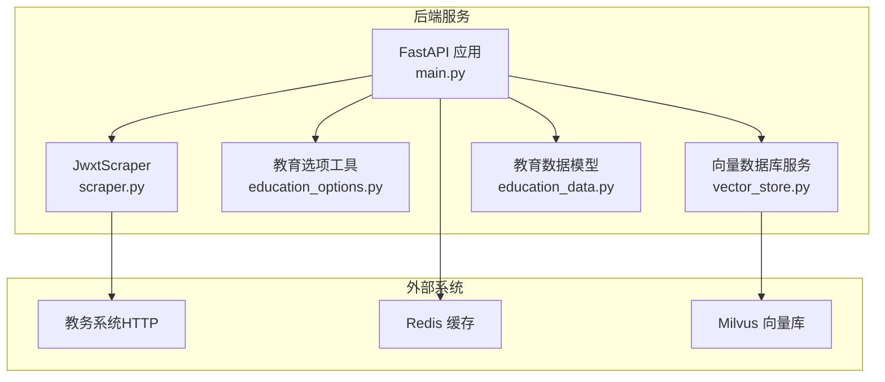
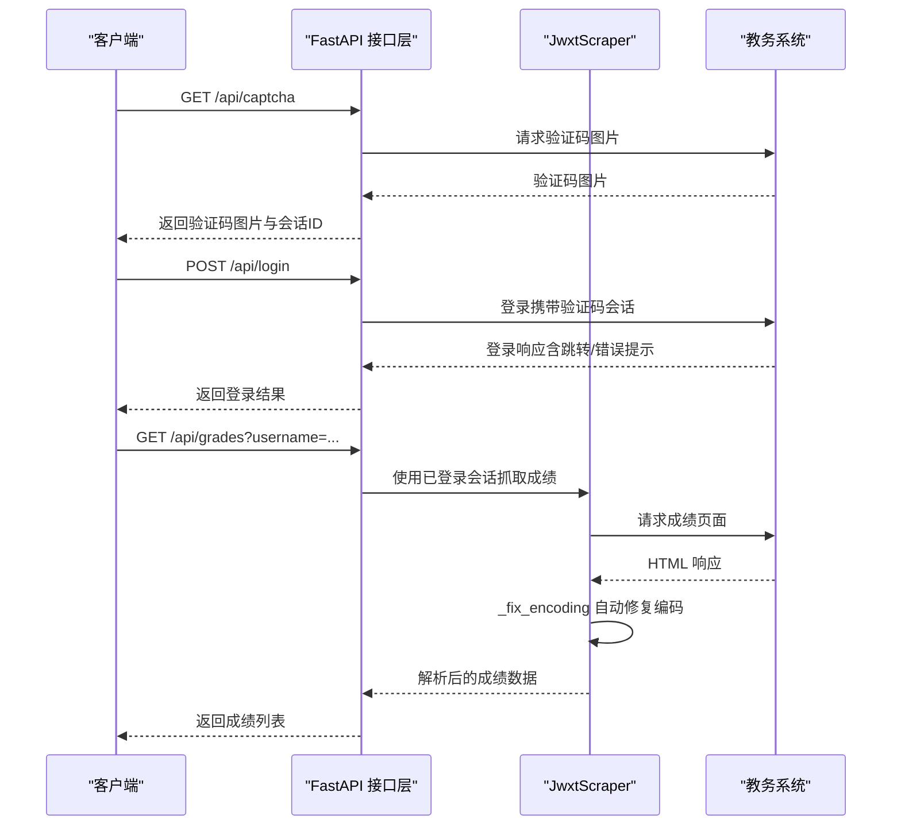
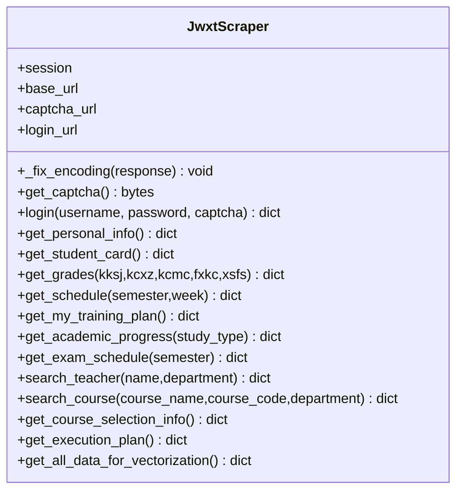
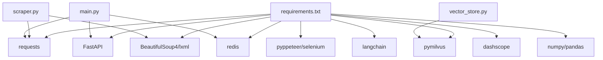

# 爬虫模块扩展

<cite>
**本文引用的文件**
- [scraper.py](file://backend/scraper.py)
- [main.py](file://backend/main.py)
- [education.py](file://backend/app/api/education.py)
- [education_options.py](file://backend/education_options.py)
- [education_data.py](file://backend/app/models/education_data.py)
- [vector_store.py](file://backend/app/services/vector_store.py)
- [test_scraper.py](file://backend/test_scraper.py)
- [test_login.py](file://backend/test_login.py)
- [requirements.txt](file://backend/requirements.txt)
- [README.md](file://README.md)
</cite>

## 目录
1. [简介](#简介)
2. [项目结构](#项目结构)
3. [核心组件](#核心组件)
4. [架构总览](#架构总览)
5. [详细组件分析](#详细组件分析)
6. [编码处理机制](#编码处理机制)
7. [依赖分析](#依赖分析)
8. [性能考虑](#性能考虑)
9. [故障排查指南](#故障排查指南)
10. [结论](#结论)
11. [附录](#附录)

## 简介
本文件面向"智能教务系统爬虫模块"的扩展与二次开发，围绕 JwxtScraper 类的架构设计、扩展机制与最佳实践展开，重点覆盖以下主题：
- 如何适配新的教务系统（URL、登录流程、页面结构）
- 自定义数据解析规则与 HTML 解析器定制
- 反爬虫策略应对（验证码、会话保持、请求频率控制）
- 新数据源接入、HTML 解析器定制与数据提取规则实现
- 代理服务器配置与管理（概念性指导）
- 验证码处理扩展（OCR、人工干预、智能刷新策略）
- 数据缓存与存储优化（Redis、向量数据库、持久化）
- 异常处理与重试机制（网络超时、数据验证、错误恢复）
- 爬虫监控与日志记录（性能指标、错误追踪）
- **编码处理机制**（GBK/UTF-8/GB18030 混合场景自动修复）

## 项目结构
后端采用 FastAPI 提供 API，JwxtScraper 负责与教务系统的交互，教育选项工具提供 AI 工具所需的静态选项数据，向量数据库服务负责 RAG 数据存储。



**图表来源**
- [main.py:1-853](file://backend/main.py#L1-L853)
- [scraper.py:1-1237](file://backend/scraper.py#L1-L1237)
- [education_options.py:1-420](file://backend/education_options.py#L1-L420)
- [vector_store.py:1-164](file://backend/app/services/vector_store.py#L1-L164)
- [education_data.py:1-103](file://backend/app/models/education_data.py#L1-L103)

## 核心组件
- JwxtScraper：封装教务系统登录、验证码获取、个人信息、成绩、课表、培养方案、学业进度、考试安排、教师/课程查询、选课信息、执行计划等数据抓取能力。
- FastAPI 接口层：提供验证码获取、登录、各类数据查询接口，统一会话管理与错误处理。
- 教育选项工具：提供院系、学期、课程性质、修读类别、成绩显示方式等静态选项，供 AI 工具调用。
- 向量数据库服务：封装 Milvus 的连接、集合创建、文档插入与检索，支持按用户隔离。
- 教育数据模型：定义数据库表结构，用于持久化存储用户教务数据。

**章节来源**
- [scraper.py:13-1237](file://backend/scraper.py#L13-L1237)
- [main.py:132-725](file://backend/main.py#L132-L725)
- [education_options.py:130-420](file://backend/education_options.py#L130-L420)
- [vector_store.py:14-164](file://backend/app/services/vector_store.py#L14-L164)
- [education_data.py:11-103](file://backend/app/models/education_data.py#L11-L103)

## 架构总览
JwxtScraper 作为核心爬虫类，通过 requests.Session 维持会话，使用 BeautifulSoup 解析 HTML。FastAPI 在接口层负责：
- 验证码获取与会话绑定（CAPTCHA_SESSIONS）
- 登录流程与会话持久化（SESSIONS）
- 各类数据查询接口，内部复用 JwxtScraper
- 选项查询接口，直接调用教育选项工具



**图表来源**
- [main.py:135-328](file://backend/main.py#L135-L328)
- [scraper.py:33-236](file://backend/scraper.py#L33-L236)

**章节来源**
- [main.py:132-725](file://backend/main.py#L132-L725)
- [scraper.py:13-1237](file://backend/scraper.py#L13-L1237)

## 详细组件分析

### JwxtScraper 类设计与扩展点
- 会话与基础 URL：构造函数接收 session 与 base_url，默认指向特定教务系统地址。
- 验证码获取：通过独立 URL 获取验证码图片字节流。
- 登录流程：构造表单数据，提交至登录接口，依据响应内容判断登录状态。
- 数据抓取方法：
  - 个人信息：从主页面解析姓名、学号等基础信息。
  - 学籍卡片：解析学籍信息表格。
  - 成绩列表：提交查询表单，解析成绩表格与统计信息。
  - 课表：解析课表表格，处理多课程、周次、教室、节次等字段。
  - 培养方案：解析培养方案与课程列表、学分统计。
  - 我的培养方案：解析个人培养方案，提取课程类别/模块/学分等。
  - 学业进度：解析修读类型、总学分、已获学分、还需学分等。
  - 考试安排：解析考试时间、地点、座位号等。
  - 教师/课程查询：无需登录的查询接口，支持模糊匹配与筛选。
  - 选课信息与执行计划：解析当前轮次与已选课程。
  - 向量化聚合：聚合多类数据，便于一次性写入向量库。



**图表来源**
- [scraper.py:13-1237](file://backend/scraper.py#L13-L1237)

**章节来源**
- [scraper.py:13-1237](file://backend/scraper.py#L13-L1237)

### 适配新教务系统的扩展方法
- 基础 URL 与端点映射：修改构造函数中的 base_url、captcha_url、login_url，或在调用侧传入自定义 base_url。
- 登录流程适配：若登录页结构变化，可在 login 方法中调整表单字段与响应判断逻辑。
- HTML 结构适配：针对不同页面的表格/字段，调整 BeautifulSoup 选择器与字段映射（如 get_grades、get_schedule、get_my_training_plan 等）。
- 选项数据扩展：在 education_options.py 中新增或扩展选项数据与查询函数，以满足新系统的需求。
- 会话与 Cookie：确保 requests.Session 正确传递 Cookie，避免跨域/跨子域导致的会话丢失。

**章节来源**
- [scraper.py:16-59](file://backend/scraper.py#L16-L59)
- [education_options.py:130-420](file://backend/education_options.py#L130-L420)

### HTML 解析器定制与数据提取规则
- BeautifulSoup 选择器：在各抓取方法中使用 find/find_all 定位表格与字段，注意区分表头、数据行与备注行。
- 字段映射与清洗：对提取的文本进行 strip、正则匹配与数值转换，确保数据一致性。
- 多课程/多周次处理：对课表中的多门课程、周次范围进行分割与合并，避免遗漏。
- 统计信息提取：使用正则表达式从页面文本中抽取学分、绩点、排名等统计信息。

**章节来源**
- [scraper.py:61-469](file://backend/scraper.py#L61-L469)
- [scraper.py:471-847](file://backend/scraper.py#L471-L847)
- [scraper.py:849-1090](file://backend/scraper.py#L849-L1090)
- [scraper.py:1092-1237](file://backend/scraper.py#L1092-L1237)

### 反爬虫策略应对
- 验证码处理：验证码图片通过独立接口获取并绑定会话，登录时必须使用同一会话，避免跨会话导致的验证码失效。
- 会话保持：登录成功后将 session 存入内存字典（生产环境建议使用 Redis），按用户名索引，避免重复登录。
- 请求频率控制：在接口层设置合理的超时与重试间隔，避免触发限流。
- User-Agent 与头部：在获取验证码与登录时设置合理的请求头，模拟浏览器行为。

**章节来源**
- [main.py:132-328](file://backend/main.py#L132-L328)
- [main.py:330-725](file://backend/main.py#L330-L725)

## 编码处理机制

### _fix_encoding 方法详解
**更新** JwxtScraper 类新增了增强版的 `_fix_encoding` 方法，专门用于处理教务系统中复杂的 GBK/UTF-8/GB18030 混合编码问题，显著提升了中文字符显示的准确性。

#### 方法实现原理
```python
def _fix_encoding(self, response) -> None:
    """自动修正响应编码，适配教务系统 GBK/UTF-8/GB18030 混合场景"""
    import re
    # 先尝试 GB18030（兼容 GBK/GB2312）
    response.encoding = 'gb18030'
    text_gb = response.text
    # 如果 GB18030 解码后有中文，就用它
    if re.search(r'[\u4e00-\u9fff]', text_gb):
        response.encoding = 'gb18030'
        return
    # 否则尝试 UTF-8
    try:
        response.content.decode('utf-8')
        response.encoding = 'utf-8'
    except UnicodeDecodeError:
        response.encoding = 'gb18030'
```

#### 工作流程
1. **GB18030 优先检测**：首先使用 GB18030 编码解码响应内容
2. **中文字符验证**：使用正则表达式 `[\u4e00-\u9fff]` 检测解码后的文本是否包含中文字符
3. **智能编码选择**：如果检测到中文字符，确认使用 GB18030 编码
4. **UTF-8 回退机制**：如果没有检测到中文字符，尝试 UTF-8 解码
5. **异常安全处理**：UTF-8 解码失败时回退到 GB18030 编码

#### 编码处理优势
- **智能检测**：通过中文字符检测而非简单的异常捕获，提高了编码选择的准确性
- **兼容性强**：GB18030 编码兼容 GBK 和 GB2312，解决学术系统界面中复杂的中文字符显示问题
- **稳定性提升**：相比之前的简单异常回退机制，新的检测逻辑更加稳健
- **透明处理**：对上层调用者完全透明，无需关心底层编码细节

#### 应用范围
该方法在 JwxtScraper 类的所有数据抓取方法中都会被调用：
- 登录流程：`login()` 方法
- 个人信息：`get_personal_info()` 方法  
- 学籍卡片：`get_student_card()` 方法
- 成绩查询：`get_grades()` 方法
- 课表查询：`get_schedule()` 方法
- 培养方案：`get_training_plan()` 和 `get_my_training_plan()` 方法
- 学业进度：`get_academic_progress()` 方法
- 考试安排：`get_exam_schedule()` 方法
- 教师查询：`search_teacher()` 方法
- 课程查询：`search_course()` 方法
- 选课信息：`get_course_selection_info()` 方法
- 执行计划：`get_execution_plan()` 方法

**章节来源**
- [scraper.py:22-38](file://backend/scraper.py#L22-L38)
- [scraper.py:50-59](file://backend/scraper.py#L50-L59)
- [scraper.py:85-86](file://backend/scraper.py#L85-L86)
- [scraper.py:137-138](file://backend/scraper.py#L137-L138)
- [scraper.py:193-194](file://backend/scraper.py#L193-L194)
- [scraper.py:342-343](file://backend/scraper.py#L342-L343)
- [scraper.py:511-512](file://backend/scraper.py#L511-L512)
- [scraper.py:584-585](file://backend/scraper.py#L584-L585)
- [scraper.py:719-720](file://backend/scraper.py#L719-L720)
- [scraper.py:815-816](file://backend/scraper.py#L815-L816)
- [scraper.py:884-885](file://backend/scraper.py#L884-L885)
- [scraper.py:953-954](file://backend/scraper.py#L953-L954)
- [scraper.py:1007-1008](file://backend/scraper.py#L1007-L1008)
- [scraper.py:1070-1071](file://backend/scraper.py#L1070-L1071)
- [scraper.py:1116-1117](file://backend/scraper.py#L1116-L1117)

### 代理服务器配置与管理（概念性指导）
- 代理池维护：可维护一个代理池列表，按轮询或权重策略选择代理，结合失败率动态剔除不可用代理。
- IP 轮换：在每次请求前随机选择代理，或在连续失败时切换代理。
- 请求频率控制：对同一代理设置并发上限与速率限制，避免被封禁。
- 健康检查：定期探测代理可用性，更新代理状态。
- 注意：本仓库未内置代理池实现，以上为通用扩展建议。

### 验证码处理扩展机制
- OCR 识别：可引入 OCR 库（如 tesseract）自动识别验证码，减少人工输入。
- 人工干预：保留手动输入流程，适用于复杂验证码场景。
- 智能刷新策略：当识别失败或登录失败时，自动重新获取验证码并重试，设置最大重试次数与退避策略。

### 数据缓存与存储优化
- Redis 缓存集成：用于存储验证码会话、登录会话、短期查询结果，提升响应速度与降低后端压力。
- 向量数据库：使用 Milvus 存储用户教务数据的向量表示，支持按用户隔离与相似度检索。
- 持久化策略：教育数据模型定义了 JSON 字段存储各类数据，适合快速原型与中小规模数据；大规模场景建议拆分表或使用专门的向量/文档存储。

**章节来源**
- [requirements.txt:19-24](file://backend/requirements.txt#L19-L24)
- [vector_store.py:14-164](file://backend/app/services/vector_store.py#L14-L164)
- [education_data.py:11-103](file://backend/app/models/education_data.py#L11-L103)

### 异常处理与重试机制最佳实践
- 网络超时处理：为每个 HTTP 请求设置合理超时，捕获异常并返回结构化错误信息。
- 数据验证：对解析结果进行基本校验（如表格是否存在、字段数量是否足够），缺失时返回空列表或警告。
- 错误恢复：登录失败时区分"密码错误/验证码错误/用户名不存在"等具体原因，便于前端提示与用户自助修复。
- 重试策略：对偶发性网络错误可增加指数退避重试，但需限制总重试次数与总等待时间。

**章节来源**
- [scraper.py:22-59](file://backend/scraper.py#L22-L59)
- [scraper.py:153-236](file://backend/scraper.py#L153-L236)
- [main.py:264-322](file://backend/main.py#L264-L322)

### 爬虫监控与日志记录
- 日志级别：INFO 记录关键流程（如登录成功、数据抓取成功），WARNING 记录异常（如未找到表格），ERROR 记录错误堆栈。
- 性能指标：可扩展埋点记录请求耗时、成功率、失败原因分布等，便于后续优化。
- 错误追踪：在 FastAPI 层统一捕获异常并返回标准错误响应，便于前端与运维定位问题。

**章节来源**
- [scraper.py:10](file://backend/scraper.py#L10)
- [main.py:35-37](file://backend/main.py#L35-L37)

## 依赖分析
- 第三方库：FastAPI、requests、BeautifulSoup4、lxml、aiohttp、pyppeteer、selenium、redis、pymilvus、langchain、dashscope、numpy、pandas 等。
- 向量数据库：Milvus，提供向量索引与相似度检索。
- 缓存：Redis，用于会话与短期缓存。
- AI 模型：DashScope（阿里云千问）、OpenAI 等（用于 RAG 与问答，当前仓库主要聚焦于数据爬取与存储）。



**图表来源**
- [requirements.txt:1-44](file://backend/requirements.txt#L1-L44)
- [scraper.py:5-12](file://backend/scraper.py#L5-L12)
- [main.py:5-25](file://backend/main.py#L5-L25)
- [vector_store.py:5-11](file://backend/app/services/vector_store.py#L5-L11)

**章节来源**
- [requirements.txt:1-44](file://backend/requirements.txt#L1-L44)
- [scraper.py:5-12](file://backend/scraper.py#L5-L12)
- [main.py:5-25](file://backend/main.py#L5-L25)
- [vector_store.py:5-11](file://backend/app/services/vector_store.py#L5-L11)

## 性能考虑
- 会话复用：使用 requests.Session 避免重复握手，减少延迟。
- 解析优化：尽量使用精确的选择器，减少不必要的 DOM 遍历。
- 缓存策略：对不频繁变动的数据（如选项、静态页面）进行缓存，缩短响应时间。
- 并发与限流：对外暴露的接口应设置并发上限与速率限制，避免对教务系统造成过大压力。
- 向量化入库：批量插入向量数据，减少多次往返；建立合适的索引参数以平衡检索精度与速度。
- **编码优化**：增强版 _fix_encoding 方法通过智能中文字符检测，显著提升了编码处理的可靠性和准确性，减少了因编码错误导致的解析失败和重试开销。

## 故障排查指南
- 验证码获取失败：检查后端服务是否启动、网络连通性、教务系统 URL 是否正确。
- 登录失败：确认用户名/密码/验证码是否正确；检查服务器选择逻辑与会话绑定。
- 数据抓取为空：确认登录成功后再调用需要登录的接口；检查目标页面结构是否发生变化。
- 向量检索无结果：确认 Milvus 连接正常、集合已创建、用户 ID 表达式正确。
- **编码问题**：如出现乱码或解析失败，检查增强版 _fix_encoding 方法是否正确应用，确认响应编码是否被正确设置。新版本通过中文字符检测机制，应该能有效解决 GBK/UTF-8/GB18030 混合编码问题。

**章节来源**
- [README.md:200-216](file://README.md#L200-L216)
- [main.py:132-328](file://backend/main.py#L132-L328)
- [scraper.py:153-236](file://backend/scraper.py#L153-L236)
- [vector_store.py:24-72](file://backend/app/services/vector_store.py#L24-L72)

## 结论
JwxtScraper 提供了完整的教务系统数据抓取能力，配合 FastAPI 接口层与教育选项工具，能够快速构建面向 AI 的 RAG 系统。通过扩展基础 URL、适配页面结构、完善异常处理与缓存策略，可有效应对多校区、多系统的差异化需求。**新增的增强版 _fix_encoding 方法通过智能中文字符检测机制，显著提升了编码处理的可靠性，解决了 GBK/UTF-8/GB18030 混合编码问题，进一步增强了数据抓取的稳定性和准确性，特别是在学术系统界面中复杂的中文字符显示问题得到了有效解决。**建议在生产环境中引入 Redis 缓存、代理池与更完善的监控体系，持续优化性能与稳定性。

## 附录
- 测试脚本：包含对 JwxtScraper 的方法存在性检查、参数签名检查与数据格式示例，便于集成测试与回归验证。
- 登录测试：演示验证码获取与登录流程，帮助定位登录相关问题。

**章节来源**
- [test_scraper.py:1-280](file://backend/test_scraper.py#L1-L280)
- [test_login.py:1-152](file://backend/test_login.py#L1-L152)