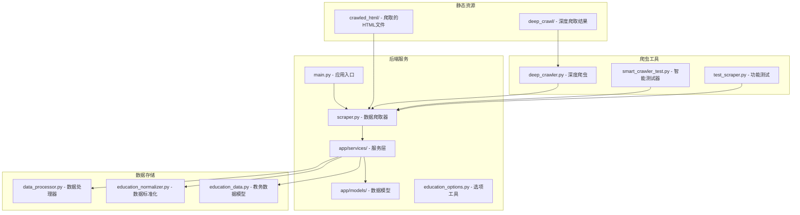
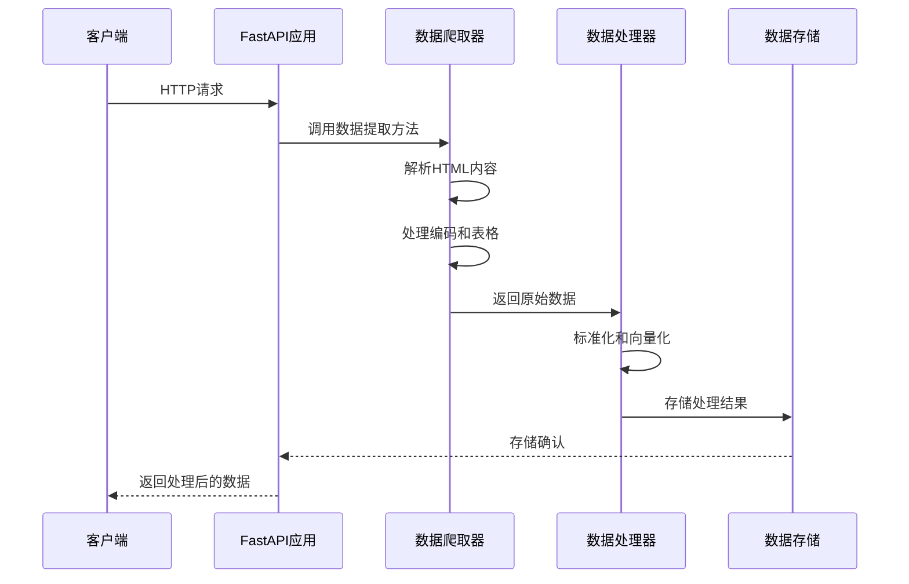
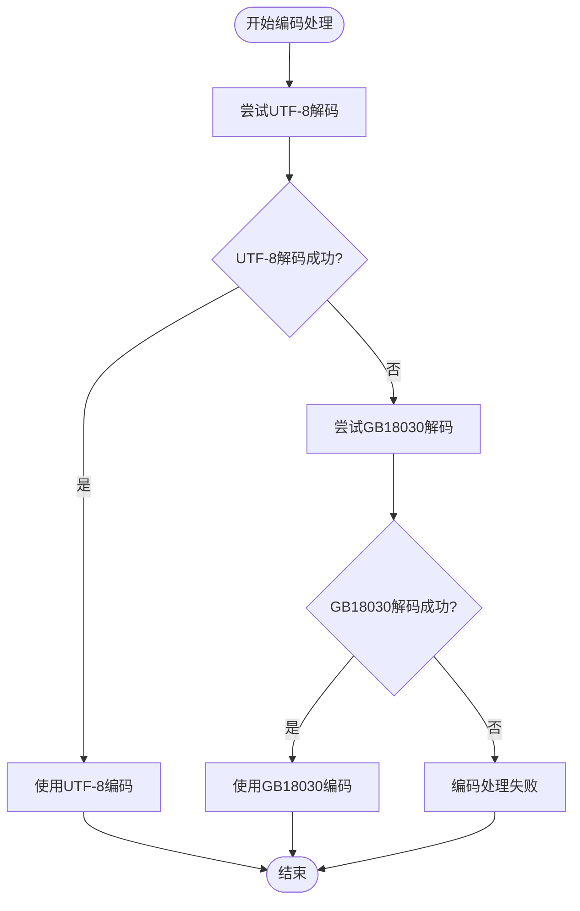
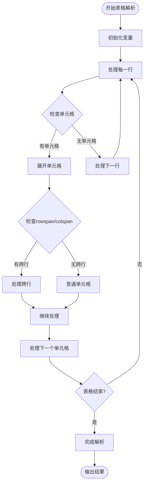
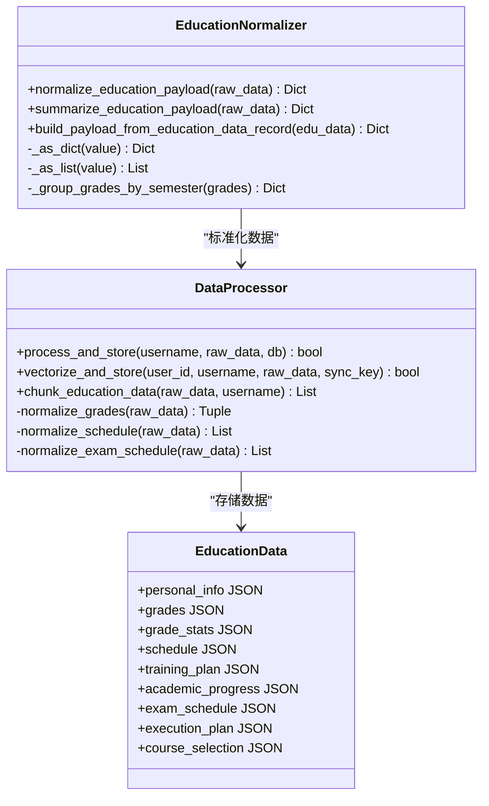
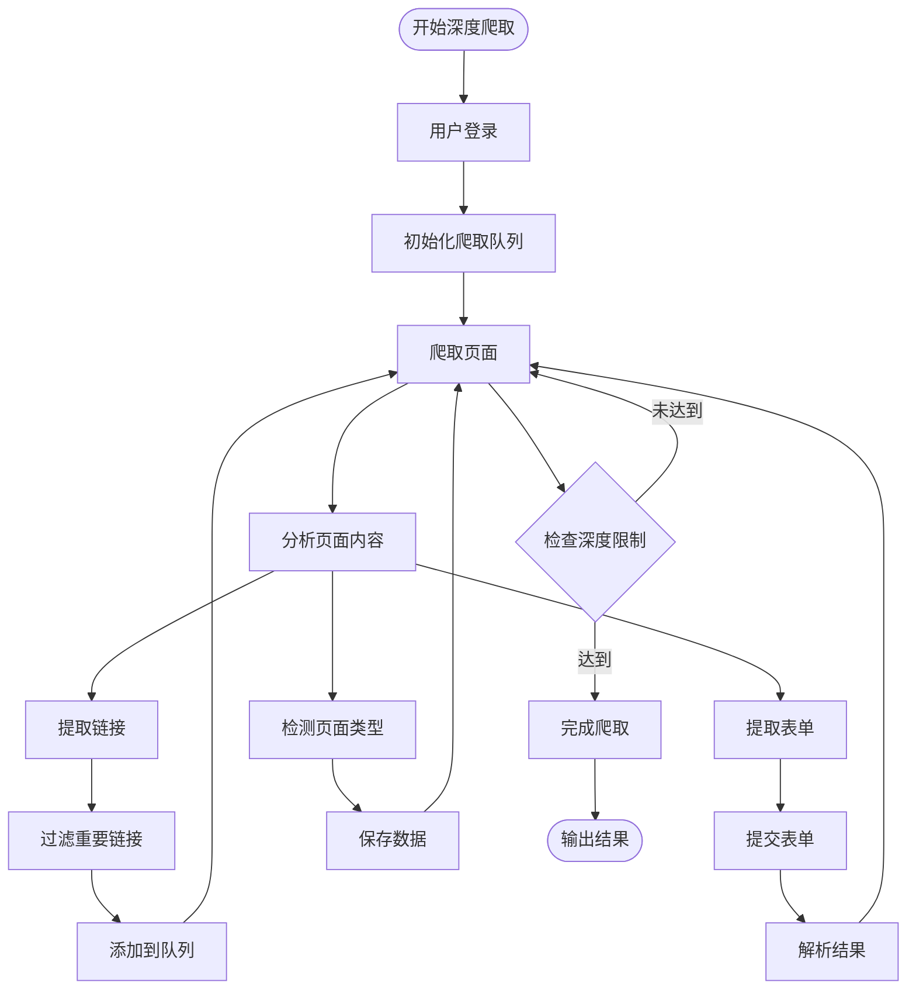
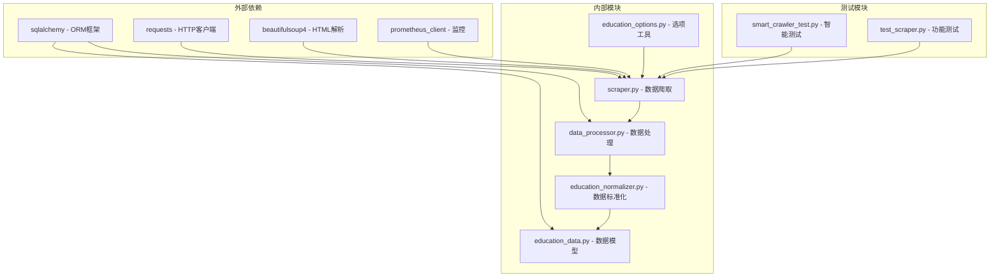

# 数据提取算法优化

<cite>
**本文档引用的文件**
- [backend/main.py](file://backend/main.py)
- [backend/scraper.py](file://backend/scraper.py)
- [backend/deep_crawler.py](file://backend/deep_crawler.py)
- [backend/smart_crawler_test.py](file://backend/smart_crawler_test.py)
- [backend/app/services/data_processor.py](file://backend/app/services/data_processor.py)
- [backend/app/services/education_normalizer.py](file://backend/app/services/education_normalizer.py)
- [backend/app/models/education_data.py](file://backend/app/models/education_data.py)
- [backend/education_options.py](file://backend/education_options.py)
- [backend/test_scraper.py](file://backend/test_scraper.py)
- [crawled_html/01_main_page.html](file://crawled_html/01_main_page.html)
- [crawled_html/02_课程成绩查询.html](file://crawled_html/02_课程成绩查询.html)
- [deep_crawl/depth_1/1__jsxsd_kscj_cjcx_query.html](file://deep_crawl/depth_1/1__jsxsd_kscj_cjcx_query.html)
</cite>

## 目录
1. [项目概述](#项目概述)
2. [项目结构](#项目结构)
3. [核心组件](#核心组件)
4. [架构概览](#架构概览)
5. [详细组件分析](#详细组件分析)
6. [依赖关系分析](#依赖关系分析)
7. [性能考虑](#性能考虑)
8. [故障排除指南](#故障排除指南)
9. [结论](#结论)

## 项目概述

这是一个基于FastAPI的教务系统AI助手后端服务，专注于数据提取算法的优化。项目实现了完整的教务系统数据爬取、解析、存储和向量化处理，支持学生成绩、课表、培养方案、学业进度等多维度数据的提取和分析。

## 项目结构

**图表来源**
- [backend/main.py:1-170](file://backend/main.py#L1-L170)
- [backend/scraper.py:1-1704](file://backend/scraper.py#L1-L1704)
- [backend/deep_crawler.py:1-589](file://backend/deep_crawler.py#L1-L589)

## 核心组件

### 数据爬取器 (JwxtScraper)

JwxtScraper是整个系统的核心组件，负责从教务系统中提取各种类型的数据：

- **编码处理**：自动检测和修复GBK/UTF-8混合编码问题
- **表格解析**：支持rowspan/colspan的复杂表格展开
- **多格式兼容**：兼容不同版本教务系统的数据结构
- **错误处理**：完善的异常捕获和重试机制

### 数据处理器 (DataProcessor)

负责将爬取的数据进行标准化处理和向量化：

- **数据标准化**：统一不同来源的数据格式
- **向量化处理**：将文本数据转换为向量嵌入
- **批量处理**：支持大规模数据的高效处理
- **元数据管理**：维护数据的上下文信息

### 深度爬虫 (DeepCrawler)

实现智能化的网页爬取和分析：

- **树形结构爬取**：按照页面层级关系进行深度优先遍历
- **智能表单提交**：自动识别和提交表单数据
- **HTML分析**：提取页面结构和关键信息
- **数据收集**：自动识别和保存不同类型的数据

**章节来源**
- [backend/scraper.py:13-1704](file://backend/scraper.py#L13-L1704)
- [backend/app/services/data_processor.py:14-538](file://backend/app/services/data_processor.py#L14-L538)
- [backend/deep_crawler.py:27-589](file://backend/deep_crawler.py#L27-L589)

## 架构概览

**图表来源**
- [backend/main.py:49-129](file://backend/main.py#L49-L129)
- [backend/scraper.py:145-172](file://backend/scraper.py#L145-L172)
- [backend/app/services/data_processor.py:63-147](file://backend/app/services/data_processor.py#L63-L147)

## 详细组件分析

### 编码处理算法

数据爬取过程中遇到的编码问题是影响数据提取质量的关键因素。系统实现了智能编码检测和修复机制：

**图表来源**
- [backend/scraper.py:23-46](file://backend/scraper.py#L23-L46)

### 表格解析算法

针对教务系统中复杂的表格结构，系统实现了rowspan/colspan的智能展开算法：

**图表来源**
- [backend/scraper.py:56-103](file://backend/scraper.py#L56-L103)

### 数据标准化流程

系统实现了统一的数据标准化处理，确保不同来源的数据能够保持一致的结构：

**图表来源**
- [backend/app/services/education_normalizer.py:27-142](file://backend/app/services/education_normalizer.py#L27-L142)
- [backend/app/services/data_processor.py:14-538](file://backend/app/services/data_processor.py#L14-L538)
- [backend/app/models/education_data.py:11-126](file://backend/app/models/education_data.py#L11-L126)

**章节来源**
- [backend/app/services/education_normalizer.py:27-142](file://backend/app/services/education_normalizer.py#L27-L142)
- [backend/app/services/data_processor.py:14-538](file://backend/app/services/data_processor.py#L14-L538)
- [backend/app/models/education_data.py:11-126](file://backend/app/models/education_data.py#L11-L126)

### 深度爬取算法

智能爬虫实现了基于树形结构的深度优先爬取策略：

**图表来源**
- [backend/deep_crawler.py:206-354](file://backend/deep_crawler.py#L206-L354)

**章节来源**
- [backend/deep_crawler.py:27-589](file://backend/deep_crawler.py#L27-L589)

## 依赖关系分析

**图表来源**
- [backend/scraper.py:5-10](file://backend/scraper.py#L5-L10)
- [backend/app/services/data_processor.py:5-11](file://backend/app/services/data_processor.py#L5-L11)
- [backend/app/models/education_data.py:5-8](file://backend/app/models/education_data.py#L5-L8)

**章节来源**
- [backend/scraper.py:5-10](file://backend/scraper.py#L5-L10)
- [backend/app/services/data_processor.py:5-11](file://backend/app/services/data_processor.py#L5-L11)
- [backend/app/models/education_data.py:5-8](file://backend/app/models/education_data.py#L5-L8)

## 性能考虑

### 编码处理优化

系统采用的编码检测策略避免了不必要的解码尝试：

- **优先UTF-8策略**：先尝试UTF-8解码，失败后再降级到GB18030
- **错误处理**：使用errors='ignore'参数避免解码错误导致的程序崩溃
- **日志记录**：记录编码转换过程，便于问题排查

### 表格解析优化

针对rowspan/colspan的处理采用了高效的算法：

- **延迟展开**：使用active_rowspans字典延迟处理跨行单元格
- **索引追踪**：通过col_idx精确控制单元格位置
- **内存优化**：避免创建不必要的中间变量

### 批量处理优化

数据处理器实现了高效的批量处理机制：

- **分批向量化**：batch_size=10的分批处理策略
- **占位向量**：对生成失败的向量使用零向量占位
- **去重处理**：过滤重复的元数据信息

## 故障排除指南

### 常见问题及解决方案

1. **编码问题**
   - 症状：中文显示为乱码
   - 解决：检查服务器编码设置，确认使用UTF-8

2. **表格解析失败**
   - 症状：表格数据缺失或错位
   - 解决：检查HTML结构变化，更新解析逻辑

3. **会话过期**
   - 症状：返回登录页面
   - 解决：重新登录，检查会话超时设置

4. **网络超时**
   - 症状：请求超时异常
   - 解决：增加超时时间，检查网络连接

**章节来源**
- [backend/scraper.py:48-54](file://backend/scraper.py#L48-L54)
- [backend/scraper.py:134-172](file://backend/scraper.py#L134-L172)

## 结论

该项目在数据提取算法方面展现了高度的专业性和实用性，主要体现在：

1. **智能编码处理**：解决了教务系统中复杂的编码问题
2. **灵活的表格解析**：能够处理各种复杂的表格结构
3. **标准化数据处理**：确保数据的一致性和可用性
4. **高效的批量处理**：支持大规模数据的快速处理
5. **完善的错误处理**：提供了健壮的异常处理机制

通过这些优化措施，系统能够稳定地从教务系统中提取高质量的数据，为后续的AI分析和应用提供了坚实的基础。