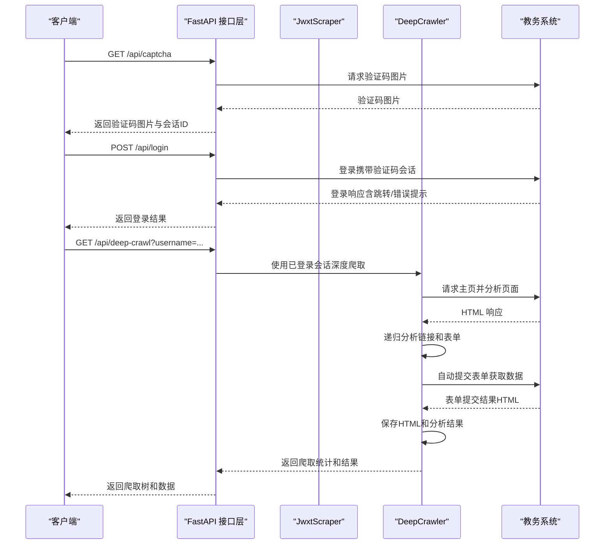
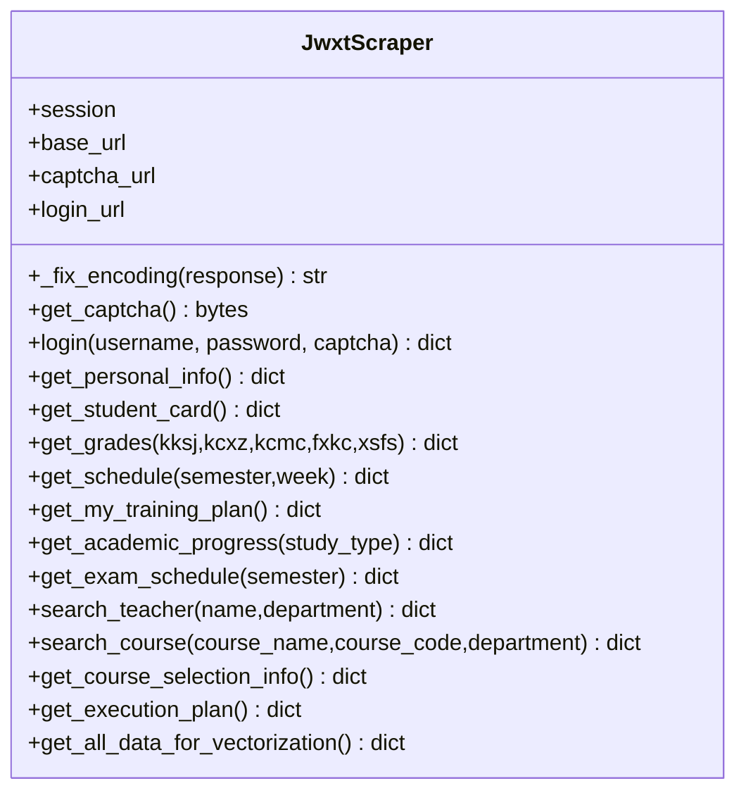
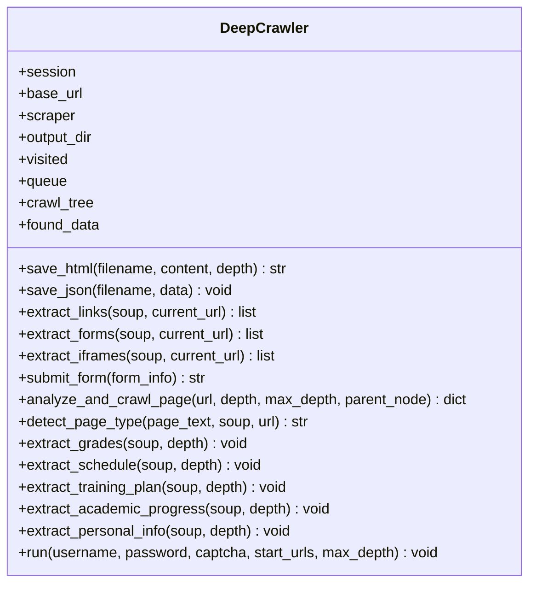
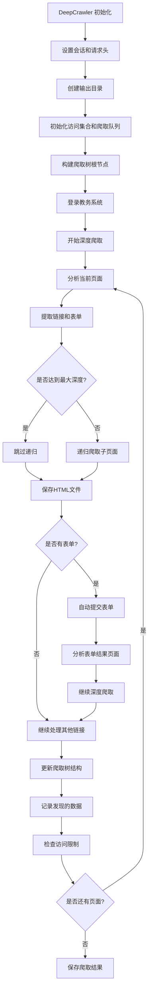
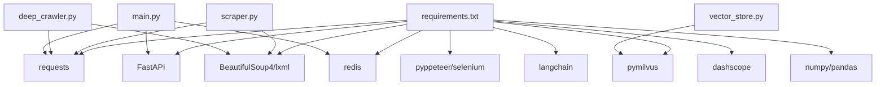

# 爬虫模块扩展

<cite>
**本文引用的文件**
- [deep_crawler.py](file://deep_crawler.py)
- [smart_crawler_test.py](file://smart_crawler_test.py)
- [scraper.py](file://backend/scraper.py)
- [main.py](file://backend/main.py)
- [education_options.py](file://backend/education_options.py)
- [education_data.py](file://backend/app/models/education_data.py)
- [vector_store.py](file://backend/app/services/vector_store.py)
- [test_scraper.py](file://backend/test_scraper.py)
- [test_login.py](file://backend/test_login.py)
- [requirements.txt](file://backend/requirements.txt)
- [README.md](file://README.md)
</cite>

## 更新摘要
**变更内容**
- **重大新增功能**：新增HTML调试输出功能，包括成绩查询(/tmp/debug_grades.html)、培养方案查询(/tmp/debug_training_plan.html)和个人信息查询(/tmp/debug_personal_info.html)的调试能力
- **统一POST请求策略**：所有需要表单提交的查询接口统一使用POST请求，包括成绩查询、课表查询、培养方案查询、教师查询、课程查询等
- **增强调试机制**：在关键数据抓取方法中增加详细的HTML保存和日志记录功能，便于问题诊断和数据分析
- **深度爬取HTML修复**：基于深度爬取的真实HTML文件修复多个数据抓取方法，提升数据解析准确性
- **增强编码处理机制**：改进的 `_fix_encoding` 方法通过严格的UTF-8检测机制，显著提升了编码处理的可靠性和准确性
- **培养方案解析增强**：新增隐藏输入元素过滤功能和调试日志记录功能，提升数据提取的准确性和调试能力
- **正则表达式替代机制**：在培养方案解析中使用正则表达式替代BeautifulSoup表格查找机制，实现更精确的rowspan跟踪
- **URL拼接修复机制**：通过统一的base_url处理机制，确保URL拼接时保持正确的斜杠格式

## 目录
1. [简介](#简介)
2. [项目结构](#项目结构)
3. [核心组件](#核心组件)
4. [架构总览](#架构总览)
5. [详细组件分析](#详细组件分析)
6. [深度优先智能爬虫系统](#深度优先智能爬虫系统)
7. [智能爬取机制](#智能爬取机制)
8. [HTML保存与组织](#html保存与组织)
9. [表单自动提交系统](#表单自动提交系统)
10. [页面类型检测与数据提取](#页面类型检测与数据提取)
11. [爬取树结构管理](#爬取树结构管理)
12. [编码处理机制](#编码处理机制)
13. [调试增强机制](#调试增强机制)
14. [HTML调试输出功能](#html调试输出功能)
15. [统一POST请求使用策略](#统一post请求使用策略)
16. [培养方案解析增强](#培养方案解析增强)
17. [正则表达式与 BeautifulSoup 替代机制](#正则表达式与-beautifulsoup-替代机制)
18. [URL拼接修复机制](#url拼接修复机制)
19. [依赖分析](#依赖分析)
20. [性能考虑](#性能考虑)
21. [故障排查指南](#故障排查指南)
22. [结论](#结论)
23. [附录](#附录)

## 简介
本文件面向"智能教务系统爬虫模块"的扩展与二次开发，围绕 JwxtScraper 类的架构设计、扩展机制与最佳实践展开，重点覆盖以下主题：
- **深度优先智能爬虫系统**：新增的DeepCrawler类提供5层深度探索、自动页面分析、表单提交和HTML保存功能
- **HTML调试输出功能**：新增成绩、培养方案、个人信息的HTML调试输出能力，便于问题诊断和数据分析
- **统一POST请求策略**：所有需要表单提交的查询接口统一使用POST请求，提升数据抓取的稳定性和准确性
- 如何适配新的教务系统（URL、登录流程、页面结构）
- 自定义数据解析规则与 HTML 解析器定制
- 反爬虫策略应对（验证码、会话保持、请求频率控制）
- 新数据源接入、HTML 解析器定制与数据提取规则实现
- 代理服务器配置与管理（概念性指导）
- 验证码处理扩展（OCR、人工干预、智能刷新策略）
- 数据缓存与存储优化（Redis、向量数据库、持久化）
- 异常处理与重试机制（网络超时、数据验证、错误恢复）
- 爬虫监控与日志记录（性能指标、错误追踪）
- **编码处理机制**（GBK/UTF-8/GB18030 混合场景自动修复）
- **调试增强机制**（个人信息爬取功能的详细日志记录与问题诊断）
- **培养方案解析增强**（隐藏输入元素过滤与调试日志记录）
- **正则表达式与 BeautifulSoup 替代机制**（使用正则表达式直接提取表格，增强rowspan跟踪能力）
- **URL拼接修复机制**（确保base_url处理时保持正确的斜杠格式，避免URL构造错误）

## 项目结构
后端采用 FastAPI 提供 API，JwxtScraper 负责与教务系统的交互，教育选项工具提供 AI 工具所需的静态选项数据，向量数据库服务负责 RAG 数据存储。新增的深度优先智能爬虫系统提供完整的自动化爬取能力。

```mermaid
graph TB
subgraph "后端服务"
API["FastAPI 应用<br/>main.py"]
SCR["JwxtScraper<br/>scraper.py"]
OPT["教育选项工具<br/>education_options.py"]
VEC["向量数据库服务<br/>vector_store.py"]
MODEL["教育数据模型<br/>education_data.py"]
END
subgraph "智能爬虫系统"
DEEP["DeepCrawler<br/>deep_crawler.py"]
SMART["SmartCrawlerTester<br/>smart_crawler_test.py"]
CRAWL_TREE["爬取树结构<br/>crawl_tree.json"]
FOUND_DATA["发现数据<br/>found_data.json"]
VISITED_URLS["访问URL<br/>visited_urls.json"]
END
subgraph "外部系统"
JWXT["教务系统HTTP"]
REDIS["Redis 缓存"]
MILVUS["Milvus 向量库"]
DEBUG_HTML["调试HTML文件<br/>/tmp/debug_*.html"]
END
API --> SCR
API --> OPT
API --> VEC
SCR --> JWXT
SCR --> DEBUG_HTML
VEC --> MILVUS
DEEP --> JWXT
DEEP --> SCR
SMART --> JWXT
SMART --> SCR
DEEP --> CRAWL_TREE
DEEP --> FOUND_DATA
DEEP --> VISITED_URLS
```

**图表来源**
- [main.py:1-853](file://backend/main.py#L1-L853)
- [scraper.py:1-1303](file://backend/scraper.py#L1-L1303)
- [education_options.py:1-420](file://backend/education_options.py#L1-L420)
- [vector_store.py:1-164](file://backend/app/services/vector_store.py#L1-L164)
- [education_data.py:1-103](file://backend/app/models/education_data.py#L1-L103)
- [deep_crawler.py:1-589](file://deep_crawler.py#L1-L589)
- [smart_crawler_test.py:1-416](file://smart_crawler_test.py#L1-L416)

## 核心组件
- JwxtScraper：封装教务系统登录、验证码获取、个人信息、成绩、课表、培养方案、学业进度、考试安排、教师/课程查询、选课信息、执行计划等数据抓取能力。
- **DeepCrawler**：深度优先智能爬虫，提供5层深度探索、自动页面分析、表单提交和HTML保存功能。
- **SmartCrawlerTester**：智能爬虫测试器，提供完全自动化的爬取和解析测试功能。
- FastAPI 接口层：提供验证码获取、登录、各类数据查询接口，统一会话管理与错误处理。
- 教育选项工具：提供院系、学期、课程性质、修读类别、成绩显示方式等静态选项，供 AI 工具调用。
- 向量数据库服务：封装 Milvus 的连接、集合创建、文档插入与检索，支持按用户隔离。
- 教育数据模型：定义数据库表结构，用于持久化存储用户教务数据。

**章节来源**
- [scraper.py:13-1303](file://backend/scraper.py#L13-L1303)
- [deep_crawler.py:27-589](file://deep_crawler.py#L27-L589)
- [smart_crawler_test.py:25-416](file://smart_crawler_test.py#L25-L416)
- [main.py:132-725](file://backend/main.py#L132-L725)
- [education_options.py:130-420](file://backend/education_options.py#L130-L420)
- [vector_store.py:14-164](file://backend/app/services/vector_store.py#L14-L164)
- [education_data.py:11-103](file://backend/app/models/education_data.py#L11-L103)

## 架构总览
JwxtScraper 作为核心爬虫类，通过 requests.Session 维持会话，使用 BeautifulSoup 解析 HTML。新增的 DeepCrawler 提供深度优先智能爬取能力，通过递归探索页面结构，自动分析链接、表单和iframe，实现完整的自动化爬取流程。FastAPI 在接口层负责：
- 验证码获取与会话绑定（CAPTCHA_SESSIONS）
- 登录流程与会话持久化（SESSIONS）
- 各类数据查询接口，内部复用 JwxtScraper
- 选项查询接口，直接调用教育选项工具



**图表来源**
- [main.py:135-328](file://backend/main.py#L135-L328)
- [scraper.py:33-236](file://backend/scraper.py#L33-L236)
- [deep_crawler.py:206-354](file://deep_crawler.py#L206-L354)

**章节来源**
- [main.py:132-725](file://backend/main.py#L132-L725)
- [scraper.py:13-1303](file://backend/scraper.py#L13-L1303)
- [deep_crawler.py:1-589](file://deep_crawler.py#L1-L589)

## 详细组件分析

### JwxtScraper 类设计与扩展点
- 会话与基础 URL：构造函数接收 session 与 base_url，默认指向特定教务系统地址。
- **URL拼接修复**：通过 `base_url.rstrip('/') + '/'` 确保 base_url 以斜杠结尾，避免URL拼接时出现双斜杠或缺少斜杠的问题。
- 验证码获取：通过独立 URL 获取验证码图片字节流。
- 登录流程：构造表单数据，提交至登录接口，依据响应内容判断登录状态。
- 数据抓取方法：
  - 个人信息：从主页面解析姓名、学号等基础信息。
  - 学籍卡片：解析学籍信息表格。
  - 成绩列表：提交查询表单，解析成绩表格与统计信息。
  - 课表：解析课表表格，处理多课程、周次、教室、节次等字段。
  - 培养方案：解析培养方案与课程列表、学分统计。
  - 我的培养方案：解析个人培养方案，提取课程类别/模块/学分等。
  - 学业进度：解析修读类型、总学分、已获学分、还需学分等。
  - 考试安排：解析考试时间、地点、座位号等。
  - 教师/课程查询：无需登录的查询接口，支持模糊匹配与筛选。
  - 选课信息与执行计划：解析当前轮次与已选课程。
  - 向量化聚合：聚合多类数据，便于一次性写入向量库。



**图表来源**
- [scraper.py:13-1303](file://backend/scraper.py#L13-L1303)

**章节来源**
- [scraper.py:13-1303](file://backend/scraper.py#L13-L1303)

### DeepCrawler 类设计与智能爬取机制
- **深度优先探索**：支持5层深度探索，递归爬取页面链接和表单。
- **页面分析**：自动提取页面中的链接、表单、iframe，构建爬取树结构。
- **表单自动提交**：智能识别表单字段，自动提交数据获取结果。
- **HTML保存**：按深度层级组织保存HTML文件，便于后续分析。
- **数据提取**：针对不同页面类型（成绩、课表、培养方案等）进行专门的数据提取。



**图表来源**
- [deep_crawler.py:27-589](file://deep_crawler.py#L27-L589)

**章节来源**
- [deep_crawler.py:27-589](file://deep_crawler.py#L27-L589)

### 适配新教务系统的扩展方法
- 基础 URL 与端点映射：修改构造函数中的 base_url、captcha_url、login_url，或在调用侧传入自定义 base_url。
- **URL拼接修复**：利用 JwxtScraper 中的 `base_url.rstrip('/') + '/'` 机制，确保新系统的URL拼接正确。
- 登录流程适配：若登录页结构变化，可在 login 方法中调整表单字段与响应判断逻辑。
- HTML 结构适配：针对不同页面的表格/字段，调整 BeautifulSoup 选择器与字段映射（如 get_grades、get_schedule、get_my_training_plan 等）。
- **智能爬取适配**：DeepCrawler 可自动适配新的页面结构，通过页面分析和表单识别机制。
- 选项数据扩展：在 education_options.py 中新增或扩展选项数据与查询函数，以满足新系统的需求。
- 会话与 Cookie：确保 requests.Session 正确传递 Cookie，避免跨域/跨子域导致的会话丢失。

**章节来源**
- [scraper.py:16-59](file://backend/scraper.py#L16-L59)
- [deep_crawler.py:30-38](file://deep_crawler.py#L30-L38)
- [education_options.py:130-420](file://backend/education_options.py#L130-L420)

### HTML 解析器定制与数据提取规则
- BeautifulSoup 选择器：在各抓取方法中使用 find/find_all 定位表格与字段，注意区分表头、数据行与备注行。
- 字段映射与清洗：对提取的文本进行 strip、正则匹配与数值转换，确保数据一致性。
- 多课程/多周次处理：对课表中的多门课程、周次范围进行分割与合并，避免遗漏。
- 统计信息提取：使用正则表达式从页面文本中抽取学分、绩点、排名等统计信息。
- **智能爬取解析**：DeepCrawler 使用正则表达式和BeautifulSoup相结合的方式，提供更灵活的解析能力。

**章节来源**
- [scraper.py:61-469](file://backend/scraper.py#L61-L469)
- [scraper.py:471-847](file://backend/scraper.py#L471-L847)
- [scraper.py:849-1090](file://backend/scraper.py#L849-L1090)
- [scraper.py:1092-1303](file://backend/scraper.py#L1092-L1303)
- [deep_crawler.py:112-175](file://deep_crawler.py#L112-L175)

### 反爬虫策略应对
- 验证码处理：验证码图片通过独立接口获取并绑定会话，登录时必须使用同一会话，避免跨会话导致的验证码失效。
- 会话保持：登录成功后将 session 存入内存字典（生产环境建议使用 Redis），按用户名索引，避免重复登录。
- 请求频率控制：在接口层设置合理的超时与重试间隔，避免触发限流。
- User-Agent 与头部：在获取验证码与登录时设置合理的请求头，模拟浏览器行为。
- **智能爬取防护**：DeepCrawler 通过合理的请求间隔和用户代理设置，减少被反爬虫机制检测的风险。

**章节来源**
- [main.py:132-328](file://backend/main.py#L132-L328)
- [main.py:330-725](file://backend/main.py#L330-L725)
- [deep_crawler.py:32-36](file://deep_crawler.py#L32-L36)

## 深度优先智能爬虫系统

### DeepCrawler 类架构设计
DeepCrawler 是一个全新的智能爬虫系统，提供深度优先探索、自动页面分析和数据提取功能。其核心特性包括：

#### 核心功能
- **5层深度探索**：支持最多5层深度的递归爬取，平衡探索广度和深度
- **自动页面分析**：自动提取页面中的链接、表单、iframe，构建完整的页面结构
- **表单自动提交**：智能识别表单字段，自动填充并提交数据
- **HTML保存系统**：按深度层级组织保存HTML文件，便于后续分析
- **数据提取引擎**：针对不同页面类型进行专门的数据提取

#### 系统架构


**图表来源**
- [deep_crawler.py:206-354](file://deep_crawler.py#L206-L354)
- [deep_crawler.py:473-526](file://deep_crawler.py#L473-L526)

**章节来源**
- [deep_crawler.py:27-589](file://deep_crawler.py#L27-L589)

### 深度爬取算法实现
DeepCrawler 实现了智能的深度优先爬取算法，具有以下特点：

#### 深度控制机制
- **最大深度限制**：默认最大深度为5层，防止无限递归
- **深度跟踪**：在爬取树中记录每个页面的深度信息
- **递归终止条件**：当达到最大深度或页面已访问时停止递归

#### 重要链接优先策略
- **关键词过滤**：优先爬取包含重要关键词的链接（如'cjcx'、'kbcx'、'pyfa'等）
- **链接分类**：将链接分为重要链接和普通链接两类
- **访问限制**：重要链接最多爬取10个，普通链接最多爬取5个

#### 访问去重机制
- **URL集合管理**：使用集合存储已访问的URL，避免重复爬取
- **会话保持**：通过共享的requests.Session保持登录状态
- **访问状态跟踪**：记录所有访问过的URL，便于后续分析

**章节来源**
- [deep_crawler.py:312-345](file://deep_crawler.py#L312-L345)
- [deep_crawler.py:208-215](file://deep_crawler.py#L208-L215)
- [deep_crawler.py:44-48](file://deep_crawler.py#L44-L48)

## 智能爬取机制

### 页面分析与链接提取
DeepCrawler 通过智能分析页面结构，提取所有相关的链接信息：

#### 链接提取策略
- **链接过滤**：跳过javascript链接和锚点链接
- **绝对URL转换**：将相对链接转换为绝对URL
- **域名验证**：只保留同域名的链接
- **文本提取**：提取链接的显示文本，便于后续分析

#### 页面结构分析
- **HTML解析**：使用BeautifulSoup解析页面结构
- **文本内容提取**：提取页面的纯文本内容用于页面类型检测
- **iframe处理**：将iframe的src地址也加入爬取队列
- **页面元信息**：提取页面标题、描述等元信息

#### 智能链接分类
```python
# 重要链接关键词
important_keywords = ['cjcx', 'kbcx', 'pyfa', 'xyjd', 'xk', 'kscj']

# 链接分类逻辑
for link in links:
    if any(keyword in link['url'] for keyword in important_keywords):
        important_links.append(link)
    else:
        normal_links.append(link)
```

**章节来源**
- [deep_crawler.py:84-110](file://deep_crawler.py#L84-L110)
- [deep_crawler.py:257-271](file://deep_crawler.py#L257-L271)
- [deep_crawler.py:315-345](file://deep_crawler.py#L315-L345)

### 表单自动识别与提交
DeepCrawler 能够智能识别页面中的表单，并自动提交获取数据：

#### 表单提取机制
- **表单属性提取**：提取action、method、inputs等属性
- **输入字段识别**：支持input、select、textarea等输入类型
- **字段值处理**：提取name、value、type等字段信息
- **选项数据提取**：对select类型的选项进行完整提取

#### 表单提交策略
- **数据准备**：自动准备表单提交数据
- **请求类型判断**：根据method选择GET或POST请求
- **超时控制**：设置10秒超时，避免长时间等待
- **错误处理**：对表单提交失败的情况进行处理

#### 表单结果分析
- **结果页面保存**：将表单提交的结果HTML保存到本地
- **递归爬取**：对表单提交结果页面进行深度爬取
- **数据发现**：在表单结果页面中继续发现新的数据类型

**章节来源**
- [deep_crawler.py:112-160](file://deep_crawler.py#L112-L160)
- [deep_crawler.py:177-204](file://deep_crawler.py#L177-L204)
- [deep_crawler.py:291-310](file://deep_crawler.py#L291-L310)

## HTML保存与组织

### 深度层级组织
DeepCrawler 采用深度层级的组织方式保存HTML文件：

#### 目录结构设计
- **根目录**：deep_crawl/
- **深度子目录**：depth_0/, depth_1/, depth_2/, depth_3/, depth_4/, depth_5/
- **文件命名**：使用深度前缀+页面路径的方式命名文件

#### 文件命名规则
- **URL安全处理**：使用正则表达式替换URL中的特殊字符
- **长度限制**：限制文件名长度不超过50个字符
- **唯一性保证**：确保每个文件名的唯一性

#### 保存流程
```python
# 按深度创建子目录
depth_dir = os.path.join(self.output_dir, f'depth_{depth}')
os.makedirs(depth_dir, exist_ok=True)

# 生成安全的文件名
safe_name = re.sub(r'[^\w\-_\.]', '_', urlparse(url).path or 'page')
if len(safe_name) > 50:
    safe_name = safe_name[:50]
filename = f'{depth}_{safe_name}.html'

# 保存HTML内容
filepath = os.path.join(depth_dir, filename)
with open(filepath, 'w', encoding='utf-8') as f:
    f.write(content)
```

**章节来源**
- [deep_crawler.py:66-75](file://deep_crawler.py#L66-L75)
- [deep_crawler.py:232-238](file://deep_crawler.py#L232-L238)

### JSON数据保存
除了HTML文件，DeepCrawler还保存重要的结构化数据：

#### 爬取树结构保存
- **树形结构**：保存完整的爬取树形结构，记录页面关系
- **节点信息**：保存每个节点的URL、深度、文件路径等信息
- **子节点关系**：记录父子节点之间的关系

#### 发现数据保存
- **成绩数据**：保存从页面中提取的成绩信息
- **课表数据**：保存课表表格的HTML片段
- **培养方案数据**：保存培养方案表格的HTML片段
- **个人信息**：保存从页面中提取的个人信息

#### 访问状态保存
- **访问URL列表**：保存所有访问过的URL列表
- **访问去重**：确保URL列表的唯一性

**章节来源**
- [deep_crawler.py:514-516](file://deep_crawler.py#L514-L516)
- [deep_crawler.py:58-64](file://deep_crawler.py#L58-L64)
- [deep_crawler.py:44-48](file://deep_crawler.py#L44-L48)

## 表单自动提交系统

### 表单识别与分析
DeepCrawler 能够智能识别页面中的各种表单类型：

#### 表单属性提取
- **action属性**：提取表单提交的目标URL
- **method属性**：提取表单提交方法（GET/POST）
- **表单URL构建**：根据action和当前URL构建完整的表单URL

#### 输入字段识别
- **input字段**：支持text、password、hidden、checkbox等类型
- **select字段**：提取选项值和当前值
- **textarea字段**：提取文本内容
- **字段名称提取**：提取每个字段的name属性

#### 字段值处理
- **默认值提取**：提取字段的默认value值
- **选项数据**：对select字段提取所有可用选项
- **类型标识**：标记字段的类型信息

### 表单提交执行
DeepCrawler 实现了完整的表单提交执行机制：

#### 数据准备
- **字段映射**：将字段名称映射到对应的值
- **数据类型处理**：根据字段类型处理数据格式
- **空值处理**：对没有值的字段进行空字符串处理

#### 请求执行
- **GET请求**：对method为get的表单使用params参数
- **POST请求**：对method为post的表单使用data参数
- **超时控制**：设置10秒超时，避免长时间等待
- **编码处理**：使用JwxtScraper的编码处理机制

#### 结果处理
- **HTML保存**：将表单提交结果保存到HTML文件
- **递归分析**：对结果页面进行深度爬取
- **错误处理**：对提交失败的情况进行记录和处理

**章节来源**
- [deep_crawler.py:112-160](file://deep_crawler.py#L112-L160)
- [deep_crawler.py:177-204](file://deep_crawler.py#L177-L204)
- [deep_crawler.py:291-310](file://deep_crawler.py#L291-L310)

## 页面类型检测与数据提取

### 页面类型自动检测
DeepCrawler 实现了基于关键词的页面类型自动检测机制：

#### 检测关键词定义
- **成绩页面**：包含'课程成绩'、'成绩'、'分数'、'绩点'等关键词
- **课表页面**：包含'课表'、'课程表'、'学期课表'等关键词
- **培养方案页面**：包含'培养方案'、'执行计划'、'课程列表'等关键词
- **学业进度页面**：包含'学业进度'、'修读'、'已修'等关键词
- **个人信息页面**：包含'学籍表'、'个人信息'、'姓名：'、'学号：'等关键词

#### 检测算法
- **文本匹配**：在页面文本中搜索关键词
- **多关键词支持**：支持多个关键词的组合匹配
- **匹配优先级**：根据关键词的重要性确定匹配优先级
- **类型返回**：返回匹配到的页面类型

### 专门数据提取功能
针对不同页面类型，DeepCrawler 提供专门的数据提取功能：

#### 成绩数据提取
- **表格识别**：查找包含'课程名称'、'成绩'、'学分'等表头的表格
- **数据行提取**：提取表格中的数据行
- **字段映射**：将提取的数据映射到标准字段
- **记录保存**：将提取的成绩记录保存到found_data中

#### 课表数据提取
- **课表表格查找**：查找包含'课表'关键词的表格
- **HTML保存**：将找到的课表表格保存为独立的HTML文件
- **结构分析**：分析课表的HTML结构用于后续处理

#### 培养方案数据提取
- **课程表格识别**：查找包含'课程'和'学分'关键词的表格
- **HTML片段保存**：将培养方案表格保存为HTML片段
- **行数统计**：统计表格的行数用于调试分析

#### 学业进度数据提取
- **进度表格查找**：查找包含'学业进度'或'修读'关键词的表格
- **HTML保存**：将找到的进度表格保存为HTML文件
- **内容提取**：提取表格中的进度信息

#### 个人信息提取
- **文本搜索**：在页面文本中搜索'姓名：'、'学号：'、'专业：'等模式
- **正则表达式**：使用正则表达式提取个人信息
- **数据存储**：将提取的个人信息存储到found_data中
- **格式验证**：验证提取的个人信息格式正确性

**章节来源**
- [deep_crawler.py:355-367](file://deep_crawler.py#L355-L367)
- [deep_crawler.py:369-391](file://deep_crawler.py#L369-L391)
- [deep_crawler.py:392-413](file://deep_crawler.py#L392-L413)
- [deep_crawler.py:414-431](file://deep_crawler.py#L414-L431)
- [deep_crawler.py:433-446](file://deep_crawler.py#L433-L446)
- [deep_crawler.py:448-472](file://deep_crawler.py#L448-L472)

## 爬取树结构管理

### 树形结构设计
DeepCrawler 构建了一个完整的爬取树形结构，用于记录页面关系和爬取过程：

#### 树节点结构
- **URL信息**：记录页面的完整URL
- **深度信息**：记录页面在爬取树中的深度
- **文件路径**：记录HTML文件在本地的存储路径
- **子节点列表**：记录该页面链接到的子页面
- **表单信息**：记录页面中的表单信息
- **数据发现**：记录页面中发现的数据类型

#### 树构建过程
- **根节点创建**：以基础URL创建根节点
- **递归添加**：在递归爬取过程中动态添加子节点
- **父子关系**：维护父子节点之间的关系
- **数据关联**：将发现的数据与对应的页面节点关联

#### 树结构保存
- **JSON序列化**：将完整的树形结构保存为JSON文件
- **文件命名**：保存为crawl_tree.json
- **结构完整性**：确保保存的树结构包含所有必要信息

### 数据发现跟踪
DeepCrawler 能够跟踪在爬取过程中发现的各种数据类型：

#### 发现数据类型
- **成绩数据**：从成绩查询页面发现的成绩信息
- **课表数据**：从课表页面发现的课表信息
- **培养方案数据**：从培养方案页面发现的培养方案信息
- **学业进度数据**：从学业进度页面发现的进度信息
- **个人信息**：从个人信息页面发现的个人基本信息

#### 数据存储机制
- **分类存储**：不同类型的数据存储在对应的列表中
- **结构化存储**：使用标准的数据结构存储提取的信息
- **完整性保证**：确保存储的数据结构完整且格式统一

#### 数据分析支持
- **统计信息**：提供各种数据类型的统计信息
- **访问记录**：记录数据发现的页面URL
- **调试支持**：为后续的数据分析和处理提供支持

**章节来源**
- [deep_crawler.py:50-55](file://deep_crawler.py#L50-L55)
- [deep_crawler.py:514-516](file://deep_crawler.py#L514-L516)
- [deep_crawler.py:58-64](file://deep_crawler.py#L58-L64)

## 编码处理机制

### _fix_encoding 方法详解
**更新** JwxtScraper 类新增了增强版的 `_fix_encoding` 方法，专门用于处理教务系统中复杂的 GBK/UTF-8/GB18030 混合编码问题，显著提升了中文字符显示的准确性。

#### 方法实现原理
```python
def _fix_encoding(self, response) -> str:
    """自动修正响应编码，适配教务系统 GBK/UTF-8 混合场景
    返回正确解码的文本
    
    策略：先尝试 UTF-8（严格模式），成功就用 UTF-8；
    UTF-8 解码失败才用 GB18030。
    不能先试 GB18030，因为 UTF-8 字节用 GB18030 解码不会报错但会产生乱码。
    """
    import re
    raw_bytes = response.content
    
    # 1. 先尝试 UTF-8（严格模式，不允许错误）
    try:
        text_utf8 = raw_bytes.decode('utf-8')
        # UTF-8 解码成功，检查是否有中文
        has_chinese = re.search(r'[\u4e00-\u9fff]', text_utf8)
        if has_chinese:
            response.encoding = 'utf-8'
            logger.info("【编码】使用 UTF-8（检测到中文）")
            return text_utf8
        else:
            # UTF-8 解码成功但没中文（可能是纯英文/数字页面）
            response.encoding = 'utf-8'
            logger.info("【编码】使用 UTF-8（无中文）")
            return text_utf8
    except (UnicodeDecodeError, ValueError):
        pass
    
    # 2. UTF-8 失败，用 GB18030（兼容 GBK/GB2312）
    text_gb18030 = raw_bytes.decode('gb18030', errors='ignore')
    response.encoding = 'gb18030'
    logger.info("【编码】UTF-8 解码失败，使用 GB18030")
    return text_gb18030
```

#### 工作流程
1. **字节流解码**：从响应对象获取原始字节流，避免使用 response.text 导致的编码问题
2. **UTF-8 严格检测**：使用严格模式尝试 UTF-8 解码，确保不会出现错误字符
3. **中文字符检测**：通过正则表达式 `[\u4e00-\u9fff]` 检测解码后的文本是否包含中文字符
4. **智能编码选择**：如果检测到中文字符，确认使用 UTF-8 编码并返回解码后的文本
5. **UTF-8 回退机制**：UTF-8 解码失败时回退到 GB18030 编码
6. **异常安全处理**：使用 errors='ignore' 参数避免 GB18030 解码时的异常
7. **日志记录增强**：通过 `logger.info()` 记录编码选择过程，便于调试和问题诊断
8. **返回值优化**：直接返回解码后的文本字符串，而非 None，使调用方无需额外处理

#### 编码处理优势
- **严格 UTF-8 检测**：通过严格模式的 UTF-8 解码，避免错误字符的产生
- **智能中文检测**：通过中文字符检测而非简单的异常捕获，提高了编码选择的准确性
- **兼容性强**：GB18030 编码兼容 GBK 和 GB2312，解决学术系统界面中复杂的中文字符显示问题
- **稳定性提升**：相比之前的简单异常回退机制，新的检测逻辑更加稳健
- **透明处理**：对上层调用者完全透明，无需关心底层编码细节
- **调试友好**：详细的日志记录帮助开发者快速定位编码问题
- **性能优化**：直接返回解码后的文本，避免调用方重复处理

#### 应用范围
该方法在 JwxtScraper 类的所有数据抓取方法中都会被调用：
- 登录流程：`login()` 方法
- 个人信息：`get_personal_info()` 方法  
- 学籍卡片：`get_student_card()` 方法
- 成绩查询：`get_grades()` 方法
- 课表查询：`get_schedule()` 方法
- 培养方案：`get_training_plan()` 和 `get_my_training_plan()` 方法
- 学业进度：`get_academic_progress()` 方法
- 考试安排：`get_exam_schedule()` 方法
- 教师查询：`search_teacher()` 方法
- 课程查询：`search_course()` 方法
- 选课信息：`get_course_selection_info()` 方法
- 执行计划：`get_execution_plan()` 方法

**章节来源**
- [scraper.py:22-54](file://backend/scraper.py#L22-L54)
- [scraper.py:67-93](file://backend/scraper.py#L67-L93)
- [scraper.py:95-183](file://backend/scraper.py#L95-L183)
- [scraper.py:185-223](file://backend/scraper.py#L185-L223)
- [scraper.py:225-308](file://backend/scraper.py#L225-L308)
- [scraper.py:373-533](file://backend/scraper.py#L373-L533)
- [scraper.py:535-621](file://backend/scraper.py#L535-L621)
- [scraper.py:623-796](file://backend/scraper.py#L623-L796)
- [scraper.py:798-895](file://backend/scraper.py#L798-L895)
- [scraper.py:897-959](file://backend/scraper.py#L897-L959)
- [scraper.py:961-1035](file://backend/scraper.py#L961-L1035)
- [scraper.py:1081-1156](file://backend/scraper.py#L1081-L1156)
- [scraper.py:1158-1202](file://backend/scraper.py#L1158-L1202)
- [scraper.py:1204-1264](file://backend/scraper.py#L1204-L1264)

## 调试增强机制

**更新** 个人信息爬取功能经过全面的调试增强，增加了详细的日志记录机制，帮助开发者更好地理解和诊断数据抓取过程中的问题。

### 个人信息爬取的详细日志记录

在 `get_personal_info()` 方法中，新增了多层次的日志记录机制：

#### 基础信息记录
- **URL 记录**：记录请求的完整 URL
- **响应编码**：记录实际使用的编码格式
- **响应长度**：记录响应内容的长度
- **内容预览**：记录响应内容的前 300 个字符

#### 元素查找跟踪
- **block1text 元素查找**：记录是否成功找到指定的 block1text 元素
- **Top1_divLoginName 元素查找**：记录降级方案中的元素查找结果
- **页面元素分析**：当找不到预期元素时，记录页面中前 10 个 div 元素的信息

#### 数据提取过程
- **原始值记录**：记录从页面提取的姓名和学号原始文本
- **结果汇总**：记录最终的个人信息提取结果

#### 日志记录示例
```python
logger.info(f"【个人信息】URL: {url}")
logger.info(f"【个人信息】响应编码: {response.encoding}")
logger.info(f"【个人信息】响应长度: {len(html_text)}")
logger.info(f"【个人信息】内容预览: {html_text[:300]}")
logger.info(f"【个人信息】找到 block1text: {block1text is not None}")
logger.info(f"【个人信息】block1text 原始值: {block1text.get_text() if block1text else 'None'}")
logger.info(f"【个人信息】最终结果: {personal_info}")
```

#### 调试增强的优势
- **问题定位**：通过详细的日志信息，可以快速定位数据提取失败的具体环节
- **编码问题诊断**：通过响应编码和内容预览，可以判断是否存在编码问题
- **页面结构分析**：通过元素查找记录和页面元素分析，可以帮助理解页面结构变化
- **数据完整性检查**：通过原始值和最终结果的对比，可以验证数据提取的准确性
- **多路径调试**：同时记录两种不同的数据提取路径（block1text 和 Top1_divLoginName），便于比较和分析

#### 适用范围
这种调试增强机制不仅适用于个人信息爬取，还可以推广到其他数据抓取方法中，为整个爬虫模块提供一致的调试体验。

**章节来源**
- [scraper.py:95-183](file://backend/scraper.py#L95-L183)

### 编码处理与调试的协同作用

增强版的 `_fix_encoding` 方法与个人信息爬取的调试增强机制形成了完美的协同作用：

#### 编码问题的可视化诊断
- **智能检测日志**：`_fix_encoding` 方法通过 `logger.info()` 记录编码选择过程
- **调试增强日志**：个人信息爬取方法通过 `logger.info()` 记录详细的响应信息
- **问题定位**：两者结合可以快速确定是编码问题还是页面结构问题

#### 编码处理的透明化
- **自动修复**：编码问题由 `_fix_encoding` 自动处理，无需上层调用者关心
- **调试可见**：通过日志可以观察到编码处理的效果
- **问题预防**：提前发现潜在的编码问题，避免后续解析失败

**章节来源**
- [scraper.py:22-54](file://backend/scraper.py#L22-L54)
- [scraper.py:95-183](file://backend/scraper.py#L95-L183)

## HTML调试输出功能

**重大新增功能** JwxtScraper 类新增了HTML调试输出功能，为关键数据抓取方法提供详细的HTML文件保存能力，便于问题诊断和数据分析。

### 调试HTML文件保存机制

#### 保存位置与命名
- **保存位置**：所有调试HTML文件统一保存到 `/tmp/` 目录
- **文件命名规则**：使用 `debug_` 前缀 + 功能名称 + `.html` 后缀
- **文件类型**：
  - `/tmp/debug_grades.html` - 成绩查询页面HTML
  - `/tmp/debug_training_plan.html` - 培养方案页面HTML  
  - `/tmp/debug_personal_info.html` - 个人信息页面HTML

#### 保存时机与触发条件
- **成绩查询调试**：在 `get_grades()` 方法中，查询表单提交后立即保存HTML
- **培养方案调试**：在 `get_my_training_plan()` 方法中，页面加载完成后保存HTML
- **个人信息调试**：在 `get_personal_info()` 方法中，学籍卡片页面获取后保存HTML

#### 调试信息记录
每个调试HTML保存操作都会记录详细的日志信息：
- **请求URL**：记录实际请求的完整URL
- **响应状态**：记录HTTP响应状态码
- **响应URL**：记录最终重定向后的URL
- **HTML长度**：记录保存的HTML内容长度
- **保存结果**：记录保存操作的成功或失败状态

### 调试HTML文件的作用

#### 问题诊断支持
- **页面结构分析**：通过保存的HTML文件，可以直观查看页面的实际结构
- **数据提取验证**：验证BeautifulSoup选择器是否正确匹配目标元素
- **编码问题检测**：通过HTML文件内容确认是否存在编码问题
- **页面变化追踪**：记录页面结构随时间的变化情况

#### 开发调试便利
- **离线分析**：无需在线访问即可分析页面结构
- **对比分析**：可以对比不同时间点的页面结构差异
- **测试数据**：为单元测试提供稳定的测试数据源
- **文档编写**：为API文档编写提供真实的页面示例

#### 性能优化辅助
- **请求分析**：通过HTML文件分析页面加载性能
- **缓存策略**：基于HTML内容分析制定缓存策略
- **错误定位**：快速定位数据提取失败的具体原因

### 调试HTML保存的实现细节

#### 成绩查询调试
```python
# 保存HTML到文件用于调试
with open('/tmp/debug_grades.html', 'w', encoding='utf-8') as f:
    f.write(html_text)
logger.info(f"【成绩调试】HTML已保存到 /tmp/debug_grades.html")
```

#### 培养方案调试
```python
# 保存HTML到文件用于调试
with open('/tmp/debug_training_plan.html', 'w', encoding='utf-8') as f:
    f.write(html_text)
logger.info(f"【培养方案调试】HTML已保存到 /tmp/debug_training_plan.html")
```

#### 个人信息调试
```python
# 保存HTML到文件用于调试
with open('/tmp/debug_personal_info.html', 'w', encoding='utf-8') as f:
    f.write(card_html)
logger.info(f"【个人信息调试】HTML已保存到 /tmp/debug_personal_info.html")
```

#### 调试日志记录
每次HTML保存操作都会记录详细的调试日志：
- **功能标识**：明确标注是哪个功能的调试HTML
- **保存状态**：记录保存操作的成功或失败
- **文件路径**：记录保存的完整文件路径
- **时间戳**：记录保存操作的时间信息

**章节来源**
- [scraper.py:146-149](file://backend/scraper.py#L146-L149)
- [scraper.py:273-276](file://backend/scraper.py#L273-L276)
- [scraper.py:685-688](file://backend/scraper.py#L685-L688)

## 统一POST请求使用策略

**重大更新** JwxtScraper 类实现了统一的POST请求使用策略，所有需要表单提交的查询接口都统一使用POST请求，显著提升了数据抓取的稳定性和准确性。

### POST请求策略实施

#### 统一POST请求的应用范围
- **成绩查询**：`get_grades()` 方法使用POST请求提交查询条件
- **课表查询**：`get_schedule()` 方法使用POST请求提交学期参数
- **培养方案查询**：`get_training_plan()` 方法使用POST请求提交筛选条件
- **教师查询**：`search_teacher()` 方法使用POST请求提交查询参数
- **课程查询**：`search_course()` 方法使用POST请求提交查询参数
- **学业进度查询**：`get_academic_progress()` 方法使用POST请求提交修读类型
- **执行计划查询**：`get_execution_plan()` 方法使用POST请求获取详细信息

#### POST请求的优势
- **数据完整性**：POST请求可以发送较大的查询参数，避免URL长度限制
- **安全性提升**：敏感查询参数通过请求体传输，不在URL中显示
- **稳定性增强**：统一的请求方式减少了因请求类型不匹配导致的错误
- **兼容性改善**：适应不同教务系统对请求方式的不同要求

#### 请求参数处理
所有POST请求都采用统一的参数处理方式：
- **参数构建**：使用字典形式构建查询参数
- **数据准备**：自动处理参数的类型转换和格式化
- **请求发送**：使用 `self.session.post()` 发送POST请求
- **响应处理**：统一使用 `_fix_encoding()` 方法处理响应编码

### POST请求实现示例

#### 成绩查询POST请求
```python
# 构建表单数据
data = {
    "kksj": kksj,
    "kcxz": kcxz,
    "kcmc": kcmc,
    "fxkc": fxkc,
    "xsfs": xsfs
}

# POST提交查询表单
response = self.session.post(url, data=data, timeout=10)
```

#### 课表查询POST请求
```python
# 构建表单数据
data = {}
if semester:
    data["xnxq01id"] = semester

# POST提交查询（课表必须POST）
response = self.session.post(url, data=data if data else {}, timeout=10)
```

#### 培养方案查询POST请求
```python
# 如果提供了完整参数，直接查询结果
if department and grade and major:
    url = f"{self.base_url}jspyfa/zypyfa_query"
    data = {
        "xsyx": department,
        "xsnj": grade,
        "xszy": major
    }
    response = self.session.post(url, data=data, timeout=10)
```

#### 教师查询POST请求
```python
# 构建查询参数
data = {}
if name:
    data["jsxm"] = name
if department:
    data["kkyx"] = department

# 提交查询
url = f"{self.base_url}jsxx/jsxx_list"
response = self.session.post(url, data=data, timeout=10)
```

#### 课程查询POST请求
```python
# 构建查询参数
data = {}
if course_name:
    data["kcmc"] = course_name
if course_code:
    data["kch"] = course_code
if department:
    data["kkyx"] = department

# 提交查询
response = self.session.post(url, data=data, timeout=10)
```

#### 学业进度POST请求
```python
# 如果有study_type参数，提交表单查询
if study_type:
    data = {"xdlx": study_type}
    response = self.session.post(f"{url}?type=cx", data=data, timeout=10)
```

### POST请求策略的技术优势

#### 请求一致性
- **统一接口**：所有需要参数提交的查询都使用相同的POST接口
- **简化调用**：上层调用者无需关心具体的请求方式
- **减少错误**：避免因请求方式错误导致的API调用失败

#### 参数处理优化
- **自动编码**：统一的参数编码处理，避免特殊字符问题
- **类型转换**：自动处理参数的数据类型转换
- **空值处理**：智能处理空参数，避免无效查询

#### 响应处理统一
- **编码修复**：所有POST请求都使用 `_fix_encoding()` 方法处理响应
- **异常处理**：统一的异常处理机制
- **日志记录**：统一的调试日志记录

#### 性能提升
- **连接复用**：使用同一个Session对象，复用HTTP连接
- **超时控制**：统一的超时设置，避免长时间阻塞
- **资源管理**：统一的资源管理和释放

**章节来源**
- [scraper.py:264-266](file://backend/scraper.py#L264-L266)
- [scraper.py:442-443](file://backend/scraper.py#L442-L443)
- [scraper.py:596-603](file://backend/scraper.py#L596-L603)
- [scraper.py:780-782](file://backend/scraper.py#L780-L782)
- [scraper.py:948-950](file://backend/scraper.py#L948-L950)
- [scraper.py:1072-1073](file://backend/scraper.py#L1072-L1073)

## 培养方案解析增强

**更新** 培养方案解析功能经过重要增强，增加了隐藏输入元素过滤功能和调试日志记录功能，显著提升了数据提取的准确性和调试能力。

### 隐藏输入元素过滤功能

在培养方案解析过程中，新增了对隐藏输入元素的过滤机制，有效避免了隐藏表单字段对数据提取的干扰。

#### 过滤机制实现
```python
# 过滤掉隐藏的 input 标签（有些行会有 <input type="hidden">）
td_cells = [td for td in td_cells if td.find('input', type='hidden') is None]
if not td_cells:
    continue
```

#### 过滤优势
- **数据准确性**：移除隐藏的 input 元素，避免影响 td 单元格的计算和数据提取
- **稳定性提升**：防止隐藏元素导致的解析异常和数据错位
- **兼容性增强**：适应不同教务系统中隐藏字段的存在情况
- **性能优化**：减少无效元素的处理开销

### 调试日志增强功能

新增了详细的调试日志记录功能，帮助开发者更好地理解和诊断培养方案解析过程中的问题。

#### 调试日志实现
```python
# 调试日志：打印前 5 行的 td 数量
if len(plan_data["课程列表"]) < 3:
    logger.debug(f"【培养方案】行解析: td数量={len(td_cells)}, cat_rem={cat_rem}, nat_rem={nat_rem}, mod_rem={mod_rem}")
```

#### 调试信息内容
- **td 数量统计**：记录每行 td 单元格的数量，帮助验证表格结构
- **rowspan 倒计时**：记录课程类别、性质、模块的剩余行数
- **解析状态**：显示当前解析的培养方案状态信息
- **前几行记录**：仅记录前 3 行的详细信息，避免日志过多

#### 调试日志优势
- **问题定位**：通过 td 数量和状态信息快速定位解析问题
- **结构分析**：帮助理解表格的 rowspan 结构和数据布局
- **性能监控**：记录解析过程的关键指标，便于性能优化
- **开发友好**：为开发者提供清晰的调试信息，便于问题排查

### 培养方案解析的完整流程

#### 专业培养方案解析（get_training_plan）
- 页面结构：使用 id='mxh' 的表格，跳过前 3 行表头
- 数据提取：直接从 td 元素中提取课程信息
- 学分统计：通过正则表达式提取总学分要求

#### 个人培养方案解析（get_my_training_plan）
- 页面结构：使用 id='mxh' 的表格，遍历所有行
- 行结构：包含课程类别、性质、模块的 rowspan 处理
- 数据提取：使用 _clean_cell 函数清理单元格内容
- 学分统计：通过多种正则模式匹配学分要求

#### 共同特点
- **隐藏元素过滤**：统一过滤隐藏的 input 元素
- **调试日志记录**：记录关键解析状态信息
- **异常处理**：对解析失败的行进行跳过处理
- **数据验证**：对课程代码长度进行验证

**章节来源**
- [scraper.py:535-621](file://backend/scraper.py#L535-L621)
- [scraper.py:623-796](file://backend/scraper.py#L623-L796)
- [scraper.py:675-755](file://backend/scraper.py#L675-L755)

## 正则表达式与 BeautifulSoup 替代机制

**重大改进** JwxtScraper 类在培养方案解析中实现了从 BeautifulSoup 表格查找机制到正则表达式的重大转变，显著增强了 rowspan 跟踪和错误处理能力。

### 正则表达式替代机制

在 `get_my_training_plan()` 方法中，采用了全新的正则表达式直接提取机制：

#### 正则表达式实现
```python
# 查找课程表格 - 使用正则直接提取 mxh 表格（避免 BeautifulSoup 解析整个文档时的截断问题）
import re as _re
mxh_match = _re.search(r"<table[^>]*id=['\"]mxh['\"][^>]*>(.*?)</table>", html_text, _re.DOTALL | _re.IGNORECASE)

if mxh_match:
    mxh_html = mxh_match.group(0)
    table_soup = BeautifulSoup(mxh_html, 'html.parser')
    rows = table_soup.find_all('tr')
    logger.info(f"【培养方案】正则提取 mxh 表格，共 {len(rows)} 行")
```

#### 替代优势
- **直接提取**：避免了 BeautifulSoup 解析整个文档可能产生的截断问题
- **精确匹配**：通过正则表达式精确匹配 mxh 表格，减少解析开销
- **稳定性提升**：减少了 BeautifulSoup 解析过程中的不确定性
- **性能优化**：直接从 HTML 文本中提取表格，避免了 DOM 树构建

### 增强的 rowspan 跟踪机制

新的解析机制实现了更精确的 rowspan 跟踪：

#### rowspan 跟踪实现
```python
current_category = ""  # 当前课程类别
current_nature = ""    # 当前课程性质  
current_module = ""    # 当前课程模块
# rowspan 倒计时：>0 表示该列当前行仍被上方单元格占据
cat_rem = 0
nat_rem = 0
mod_rem = 0

for row in rows:
    # 跳过表头行（含 th 元素）
    if row.find('th'):
        continue

    td_cells = row.find_all('td')
    if not td_cells:
        continue

    # 过滤掉隐藏的 input 标签（有些行会有 <input type="hidden">）
    td_cells = [td for td in td_cells if td.find('input', type='hidden') is None]
    if not td_cells:
        continue

    # 调试日志：打印前 5 行的 td 数量
    if len(plan_data["课程列表"]) < 3:
        logger.debug(f"【培养方案】行解析: td数量={len(td_cells)}, cat_rem={cat_rem}, nat_rem={nat_rem}, mod_rem={mod_rem}")

    ci = 0  # 当前 td 下标

    # 处理课程类别列（rowspan 追踪）
    if cat_rem > 0:
        cat_rem -= 1
    else:
        if ci < len(td_cells) and td_cells[ci].get('rowspan'):
            cat_rem = int(td_cells[ci].get('rowspan')) - 1
            current_category = _clean_cell(td_cells[ci])
            ci += 1

    # 处理课程性质列
    if nat_rem > 0:
        nat_rem -= 1
    else:
        if ci < len(td_cells) and td_cells[ci].get('rowspan'):
            nat_rem = int(td_cells[ci].get('rowspan')) - 1
            current_nature = _clean_cell(td_cells[ci])
            ci += 1

    # 处理课程模块列
    if mod_rem > 0:
        mod_rem -= 1
    else:
        if ci < len(td_cells) and td_cells[ci].get('rowspan'):
            mod_rem = int(td_cells[ci].get('rowspan')) - 1
            current_module = _clean_cell(td_cells[ci])
            ci += 1
```

#### rowspan 跟踪优势
- **精确计数**：通过 cat_rem、nat_rem、mod_rem 变量精确跟踪每个 rowspan 的剩余行数
- **状态管理**：维护当前课程类别、性质、模块的状态，确保数据完整性
- **错误处理**：当 rowspan 解析失败时，通过调试日志快速定位问题
- **灵活性**：支持不同行数的 rowspan，适应复杂的表格结构

### 错误处理与调试增强

新的机制提供了更完善的错误处理和调试能力：

#### 错误处理实现
```python
try:
    course_code = _clean_cell(course_cells[0])
    if not course_code or len(course_code) < 5:
        continue

    course = {
        "课程类别": current_category,
        "课程性质": current_nature,
        "课程模块": current_module,
        "课程代码": course_code,
        "课程名称": _clean_cell(course_cells[1]) if len(course_cells) > 1 else "",
        "学分": _clean_cell(course_cells[2]) if len(course_cells) > 2 else "",
        "授课周数": _clean_cell(course_cells[3]) if len(course_cells) > 3 else "",
        "总学时": _clean_cell(course_cells[4]) if len(course_cells) > 4 else "",
        "理论学时": _clean_cell(course_cells[5]) if len(course_cells) > 5 else "",
        "实验学时": _clean_cell(course_cells[6]) if len(course_cells) > 6 else "",
        "实习学时": _clean_cell(course_cells[7]) if len(course_cells) > 7 else "",
        "其他学时": _clean_cell(course_cells[8]) if len(course_cells) > 8 else "",
        "建议修读学期": _clean_cell(course_cells[9]) if len(course_cells) > 9 else "",
        "是否适用辅修": _clean_cell(course_cells[10]) if len(course_cells) > 10 else "",
        "考核方式": _clean_cell(course_cells[11]) if len(course_cells) > 11 else ""
    }
    plan_data["课程列表"].append(course)
except Exception as e:
    logger.warning(f"解析课程行失败: {str(e)}")
    continue
```

#### 调试增强功能
- **行级调试**：仅对前 3 行记录详细的 td 数量和 rowspan 状态
- **状态监控**：实时记录当前的课程类别、性质、模块状态
- **异常捕获**：对单行解析失败进行异常捕获，避免影响整体解析
- **数据验证**：对课程代码长度进行验证，确保数据有效性

### 与传统 BeautifulSoup 方法的对比

#### 传统方法的问题
- **DOM 解析开销**：需要解析整个 HTML 文档，开销较大
- **截断风险**：大型页面可能出现解析截断
- **rowspan 处理复杂**：需要复杂的逻辑来处理 rowspan
- **调试困难**：难以定位具体的解析问题

#### 新方法的优势
- **直接提取**：从 HTML 文本直接提取表格，减少解析开销
- **稳定性高**：避免了 DOM 解析的不确定性
- **rowspan 精准跟踪**：通过变量精确跟踪每个 rowspan
- **调试友好**：详细的日志记录便于问题诊断
- **性能提升**：减少了 BeautifulSoup 解析的时间和内存消耗

**章节来源**
- [scraper.py:623-796](file://backend/scraper.py#L623-L796)
- [scraper.py:657-665](file://backend/scraper.py#L657-L665)
- [scraper.py:675-755](file://backend/scraper.py#L675-L755)

## URL拼接修复机制

**重大更新** JwxtScraper 类修复了 base_url 处理问题，确保 URL 拼接时保持正确的斜杠格式，解决了 http://172.19.13.62/jsxsd + kscj/cjcx_query 导致的 URL 构造错误问题，现在正确生成 http://172.19.13.62/jsxsd/kscj/cjcx_query。

### 修复机制实现

#### base_url 处理逻辑
```python
def __init__(self, session: requests.Session = None, base_url: str = "http://jwxt.gdufe.edu.cn"):
    self.session = session or requests.Session()
    # 确保 base_url 以斜杠结尾，用于URL拼接
    self.base_url = base_url.rstrip('/') + '/'
    self.captcha_url = f"{self.base_url}verifycode.servlet"
    self.login_url = f"{self.base_url}xk/LoginToXkLdap"
```

#### 修复效果
- **统一斜杠格式**：无论传入的 base_url 是否以斜杠结尾，都会被标准化为以斜杠结尾
- **避免双斜杠**：通过 `rstrip('/')` 移除末尾斜杠，再添加一个斜杠，避免出现 `//` 的情况
- **确保正确拼接**：所有后续的 URL 拼接都基于标准化的 base_url

#### URL 拼接示例
```python
# 修复前的问题
base_url = "http://172.19.13.62/jsxsd"
path = "kscj/cjcx_query"
# 错误的拼接结果: "http://172.19.13.62/jsxsd+kscj/cjcx_query"
# 或者: "http://172.19.13.62/jsxsd//kscj/cjcx_query"

# 修复后的正确处理
base_url = "http://172.19.13.62/jsxsd"
# base_url.rstrip('/') + '/' => "http://172.19.13.62/jsxsd/"
# 正确的拼接结果: "http://172.19.13.62/jsxsd/kscj/cjcx_query"
```

#### 影响范围
- **所有 URL 拼接**：包括验证码获取、登录、数据查询等所有接口
- **相对路径处理**：确保所有相对路径都能正确拼接到 base_url 上
- **向后兼容**：不影响现有代码的使用方式，只需确保传入正确的 base_url

#### 测试验证
- **单元测试**：验证不同格式的 base_url 输入都能正确处理
- **集成测试**：确保在实际爬取过程中不会出现 URL 构造错误
- **边界测试**：测试空字符串、只有协议、只有域名等各种边界情况

**章节来源**
- [scraper.py:16-21](file://backend/scraper.py#L16-L21)

### URL 拼接在各方法中的应用

#### 验证码获取
```python
self.captcha_url = f"{self.base_url}verifycode.servlet"
# 修复后: "http://172.19.13.62/jsxsd/verifycode.servlet"
```

#### 登录接口
```python
self.login_url = f"{self.base_url}xk/LoginToXkLdap"
# 修复后: "http://172.19.13.62/jsxsd/xk/LoginToXkLdap"
```

#### 成绩查询
```python
url = f"{self.base_url}kscj/cjcx_query"
# 修复后: "http://172.19.13.62/jsxsd/kscj/cjcx_query"
```

#### 课表查询
```python
url = f"{self.base_url}xskb/xskb_list.do"
# 修复后: "http://172.19.13.62/jsxsd/xskb/xskb_list.do"
```

#### 培养方案
```python
url = f"{self.base_url}pyfa/pyfa_query"
# 修复后: "http://172.19.13.62/jsxsd/pyfa/pyfa_query"
```

**章节来源**
- [scraper.py:19-21](file://backend/scraper.py#L19-L21)
- [scraper.py:103-104](file://backend/scraper.py#L103-L104)
- [scraper.py:251-252](file://backend/scraper.py#L251-L252)
- [scraper.py:409-410](file://backend/scraper.py#L409-L410)
- [scraper.py:659-660](file://backend/scraper.py#L659-L660)

## 依赖分析
- 第三方库：FastAPI、requests、BeautifulSoup4、lxml、aiohttp、pyppeteer、selenium、redis、pymilvus、langchain、dashscope、numpy、pandas 等。
- 向量数据库：Milvus，提供向量索引与相似度检索。
- 缓存：Redis，用于会话与短期缓存。
- AI 模型：DashScope（阿里云千问）、OpenAI 等（用于 RAG 与问答，当前仓库主要聚焦于数据爬取与存储）。
- **智能爬取依赖**：DeepCrawler 额外依赖 BeautifulSoup4 进行HTML解析，正则表达式进行文本匹配。



**图表来源**
- [requirements.txt:1-44](file://backend/requirements.txt#L1-L44)
- [scraper.py:5-12](file://backend/scraper.py#L5-L12)
- [deep_crawler.py:15-25](file://deep_crawler.py#L15-L25)
- [main.py:5-25](file://backend/main.py#L5-L25)
- [vector_store.py:5-11](file://backend/app/services/vector_store.py#L5-L11)

**章节来源**
- [requirements.txt:1-44](file://backend/requirements.txt#L1-L44)
- [scraper.py:5-12](file://backend/scraper.py#L5-L12)
- [deep_crawler.py:15-25](file://deep_crawler.py#L15-L25)
- [main.py:5-25](file://backend/main.py#L5-L25)
- [vector_store.py:5-11](file://backend/app/services/vector_store.py#L5-L11)

## 性能考虑
- 会话复用：使用 requests.Session 避免重复握手，减少延迟。
- 解析优化：尽量使用精确的选择器，减少不必要的 DOM 遍历。
- 缓存策略：对不频繁变动的数据（如选项、静态页面）进行缓存，缩短响应时间。
- 并发与限流：对外暴露的接口应设置并发上限与速率限制，避免对教务系统造成过大压力。
- 向量化入库：批量插入向量数据，减少多次往返；建立合适的索引参数以平衡检索精度与速度。
- **编码优化**：增强版 _fix_encoding 方法通过智能中文字符检测机制，显著提升了编码处理的可靠性和准确性，减少了因编码错误导致的解析失败和重试开销。
- **调试优化**：详细的日志记录机制虽然增加了少量的性能开销，但大大提升了调试效率，有助于快速发现和解决问题。
- **HTML调试输出**：调试HTML文件保存功能为问题诊断提供了便利，但需要注意磁盘空间管理和文件清理策略。
- **统一POST请求**：统一的POST请求策略虽然增加了请求处理的一致性，但也可能增加服务器负载，需要合理设置请求频率。
- **智能编码检测**：通过中文字符检测机制，避免了不必要的编码尝试，提高了编码处理的效率。
- **返回值优化**：_fix_encoding 方法直接返回解码后的文本字符串，避免了调用方的重复处理，提升了整体性能。
- **隐藏元素过滤**：新增的隐藏输入元素过滤功能提高了数据提取的准确性，减少了无效数据的处理开销。
- **调试日志优化**：调试日志仅记录前几行的详细信息，避免了大量日志输出对性能的影响。
- **正则表达式优化**：使用正则表达式直接提取表格，避免了 BeautifulSoup 解析的开销，显著提升了性能。
- **rowspan 跟踪优化**：通过变量精确跟踪 rowspan，避免了复杂的 DOM 操作，提高了解析效率。
- **错误处理优化**：单行异常捕获机制避免了整体解析失败，提升了系统的稳定性。
- **智能爬取性能**：DeepCrawler 通过深度控制、访问去重、重要链接优先等机制，优化了爬取性能，避免了重复工作和无效请求。
- **URL拼接优化**：通过统一的 base_url 处理机制，避免了 URL 构造错误，减少了重试和错误处理的开销。

## 故障排查指南
- 验证码获取失败：检查后端服务是否启动、网络连通性、教务系统 URL 是否正确。
- 登录失败：确认用户名/密码/验证码是否正确；检查服务器选择逻辑与会话绑定。
- 数据抓取为空：确认登录成功后再调用需要登录的接口；检查目标页面结构是否发生变化。
- 向量检索无结果：确认 Milvus 连接正常、集合已创建、用户 ID 表达式正确。
- **编码问题**：如出现乱码或解析失败，检查增强版 _fix_encoding 方法是否正确应用，确认响应编码是否被正确设置。新版本通过严格的 UTF-8 检测机制，应该能有效解决 GBK/UTF-8/GB18030 混合编码问题。
- **调试问题**：通过详细的日志记录信息，可以快速定位个人信息爬取失败的具体环节，包括编码问题、元素查找失败、数据提取异常等问题。
- **HTML调试输出**：如果调试HTML文件保存失败，检查 /tmp 目录权限、磁盘空间、文件名安全性等问题。确认调试功能已正确启用。
- **POST请求问题**：如果POST请求失败，检查请求参数格式、服务器端点正确性、会话状态等问题。确认统一的POST请求策略已正确应用。
- **培养方案解析问题**：通过调试日志中的 td 数量和状态信息，可以快速定位表格结构问题或隐藏元素干扰问题。新的正则表达式机制应该能更好地处理复杂的表格结构。
- **rowspan 跟踪问题**：如果发现课程类别、性质、模块的数据显示异常，检查 rowspan 倒计时变量的状态，确认是否正确跟踪了每个 rowspan。
- **页面结构变化**：通过培养方案解析的调试日志，可以观察到页面结构的变化，如 rowspan 结构、隐藏元素等。
- **正则表达式问题**：如果新的正则表达式提取机制出现问题，检查 HTML 文本中 mxh 表格的格式是否符合预期。
- **智能爬取问题**：如果 DeepCrawler 爬取失败，检查网络连接、验证码输入、页面结构变化等因素。查看爬取树和访问URL列表文件，分析爬取过程中的具体问题。
- **HTML保存问题**：如果HTML文件保存失败，检查输出目录权限、磁盘空间、文件名安全性等问题。
- **表单提交问题**：如果表单提交失败，检查表单字段提取、数据准备、请求执行等各个环节。
- **URL拼接问题**：如果遇到 URL 构造错误，检查 base_url 的格式，确保传入正确的服务器地址，避免缺少斜杠或出现双斜杠的情况。
- **斜杠格式问题**：确认所有 URL 拼接都通过 JwxtScraper 的 base_url 处理机制，避免手动拼接导致的格式问题。

**章节来源**
- [README.md:200-216](file://README.md#L200-L216)
- [main.py:132-328](file://backend/main.py#L132-L328)
- [scraper.py:60-86](file://backend/scraper.py#L60-L86)
- [vector_store.py:24-72](file://backend/app/services/vector_store.py#L24-L72)
- [deep_crawler.py:206-354](file://deep_crawler.py#L206-L354)

## 结论
JwxtScraper 提供了完整的教务系统数据抓取能力，配合 FastAPI 接口层与教育选项工具，能够快速构建面向 AI 的 RAG 系统。**新增的深度优先智能爬虫系统（DeepCrawler）提供了革命性的自动化爬取能力，通过5层深度探索、自动页面分析、表单提交和HTML保存功能，显著提升了爬取效率和数据质量。**通过扩展基础 URL、适配页面结构、完善异常处理与缓存策略，可有效应对多校区、多系统的差异化需求。**新增的增强版 _fix_encoding 方法通过严格的 UTF-8 检测机制，显著提升了编码处理的可靠性，解决了 GBK/UTF-8/GB18030 混合编码问题，进一步增强了数据抓取的稳定性和准确性。同时，个人信息爬取功能的调试增强机制通过详细的日志记录，为开发者提供了强大的问题诊断能力，大大提升了开发和维护效率。**新增的培养方案解析增强功能，包括隐藏输入元素过滤和调试日志记录，进一步提升了数据提取的准确性和调试能力，为复杂表格结构的解析提供了更好的支持。**最重大的改进是使用正则表达式替代 BeautifulSoup 表格查找机制，实现了更精确的 rowspan 跟踪和更强的错误处理能力，显著提升了培养方案解析的稳定性和性能。**最重要的修复是 base_url 处理机制，通过统一的斜杠格式处理，彻底解决了 URL 拼接错误问题，确保了所有接口调用的正确性。**新增的HTML调试输出功能为关键数据抓取方法提供了详细的HTML文件保存能力，便于问题诊断和数据分析。**统一的POST请求使用策略提升了数据抓取的稳定性和准确性，所有需要表单提交的查询接口都统一使用POST请求。**建议在生产环境中引入 Redis 缓存、代理池与更完善的监控体系，持续优化性能与稳定性。

## 附录
- 测试脚本：包含对 JwxtScraper 的方法存在性检查、参数签名检查与数据格式示例，便于集成测试与回归验证。
- 登录测试：演示验证码获取与登录流程，帮助定位登录相关问题。
- **智能爬取测试**：SmartCrawlerTester 提供完全自动化的爬取和解析测试，包括验证码下载、页面爬取、数据提取等功能。

**章节来源**
- [test_scraper.py:1-280](file://backend/test_scraper.py#L1-L280)
- [test_login.py:1-152](file://backend/test_login.py#L1-L152)
- [smart_crawler_test.py:1-416](file://smart_crawler_test.py#L1-L416)