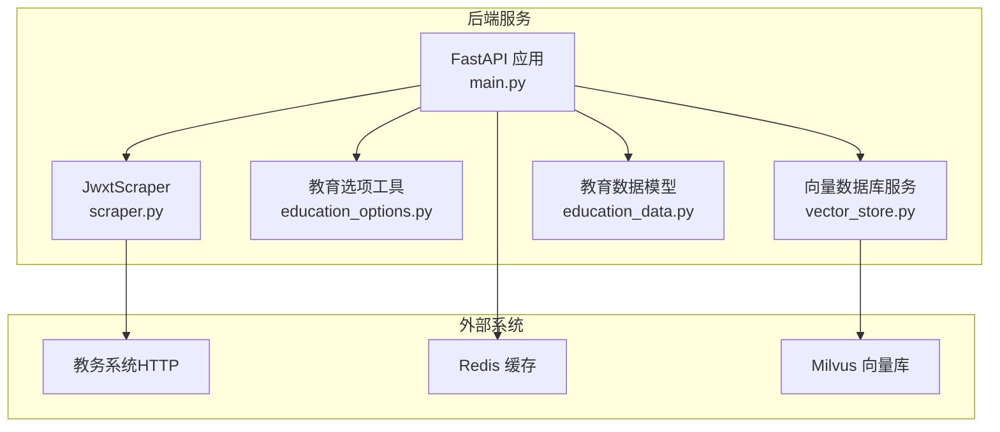
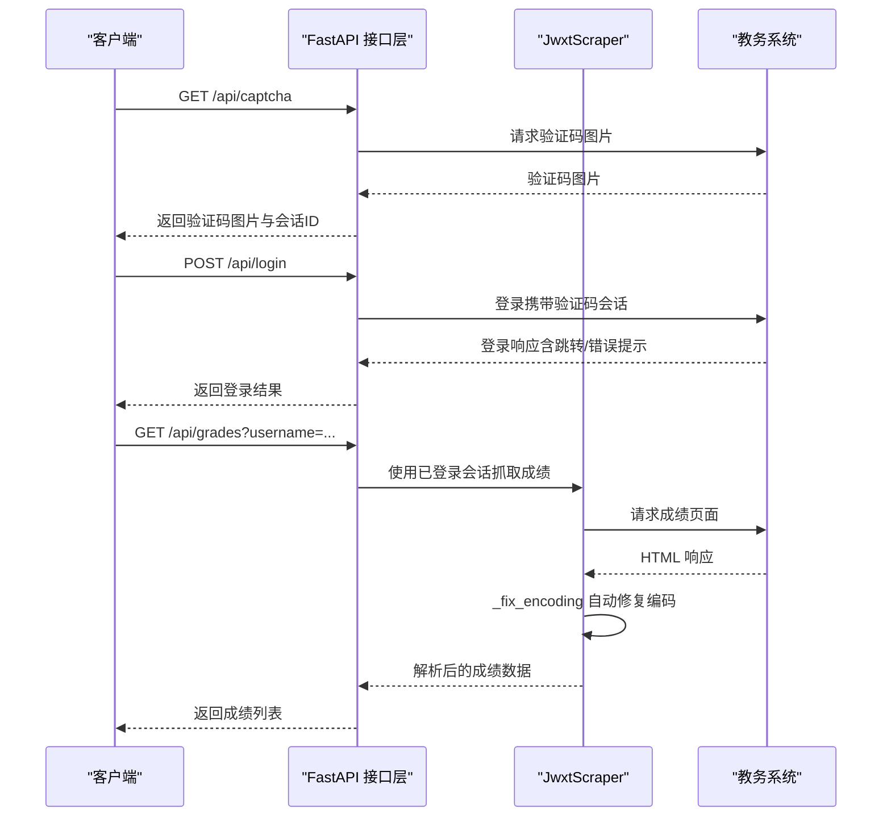
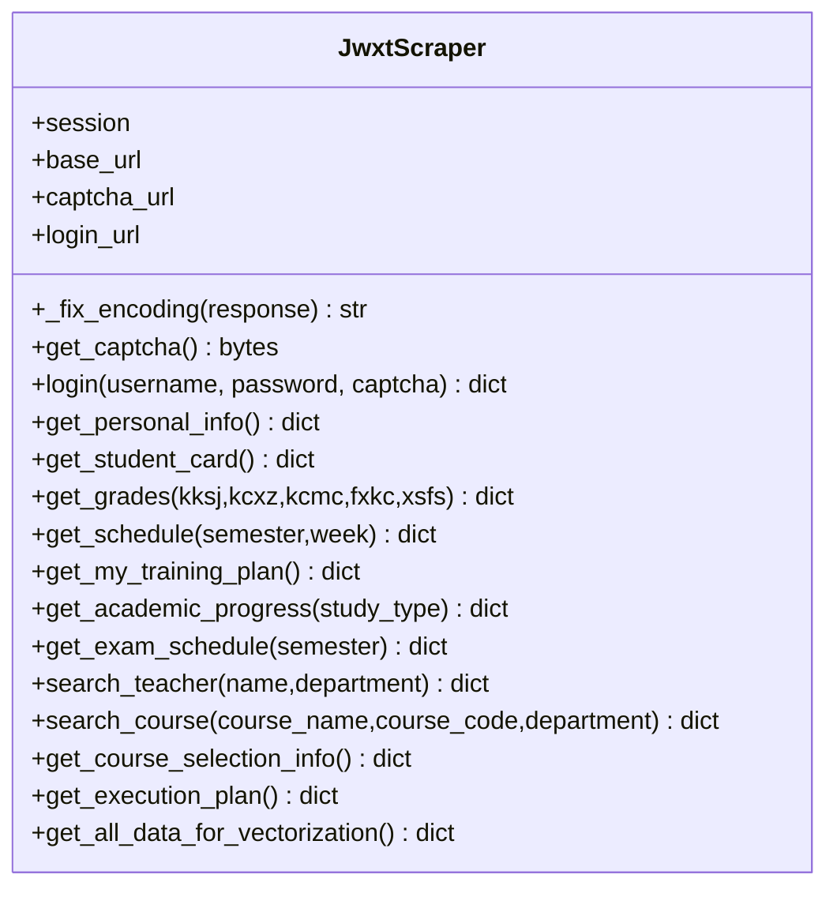
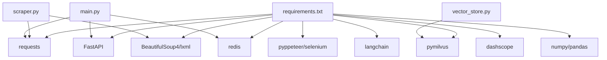

# 爬虫模块扩展

<cite>
**本文引用的文件**
- [scraper.py](file://backend/scraper.py)
- [main.py](file://backend/main.py)
- [education_options.py](file://backend/education_options.py)
- [education_data.py](file://backend/app/models/education_data.py)
- [vector_store.py](file://backend/app/services/vector_store.py)
- [test_scraper.py](file://backend/test_scraper.py)
- [test_login.py](file://backend/test_login.py)
- [requirements.txt](file://backend/requirements.txt)
- [README.md](file://README.md)
</cite>

## 更新摘要
**变更内容**
- 更新编码处理机制：增强 _fix_encoding 方法，从返回 None 改为返回解码后的文本字符串，改进中文字符检测逻辑，增加详细的日志记录和错误处理机制
- 更新个人信息爬取功能的调试增强机制，包括详细的日志记录、编码处理改进和智能中文字符检测机制
- 新增培养方案解析的隐藏输入元素过滤功能，提高数据提取的准确性和稳定性
- 增强培养方案解析的调试日志功能，记录 td 数量等关键调试信息
- **重大改进**：使用正则表达式替代 BeautifulSoup 表格查找机制，增强 rowspan 跟踪和错误处理能力
- 新增详细的日志记录机制说明，展示如何通过日志信息进行问题诊断和调试
- 增强编码处理机制的说明，突出智能中文字符检测的优势
- 扩展调试增强机制的应用范围，涵盖培养方案解析的完整调试流程

## 目录
1. [简介](#简介)
2. [项目结构](#项目结构)
3. [核心组件](#核心组件)
4. [架构总览](#架构总览)
5. [详细组件分析](#详细组件分析)
6. [编码处理机制](#编码处理机制)
7. [调试增强机制](#调试增强机制)
8. [培养方案解析增强](#培养方案解析增强)
9. [正则表达式与 BeautifulSoup 替代机制](#正则表达式与-beautifulsoup-替代机制)
10. [依赖分析](#依赖分析)
11. [性能考虑](#性能考虑)
12. [故障排查指南](#故障排查指南)
13. [结论](#结论)
14. [附录](#附录)

## 简介
本文件面向"智能教务系统爬虫模块"的扩展与二次开发，围绕 JwxtScraper 类的架构设计、扩展机制与最佳实践展开，重点覆盖以下主题：
- 如何适配新的教务系统（URL、登录流程、页面结构）
- 自定义数据解析规则与 HTML 解析器定制
- 反爬虫策略应对（验证码、会话保持、请求频率控制）
- 新数据源接入、HTML 解析器定制与数据提取规则实现
- 代理服务器配置与管理（概念性指导）
- 验证码处理扩展（OCR、人工干预、智能刷新策略）
- 数据缓存与存储优化（Redis、向量数据库、持久化）
- 异常处理与重试机制（网络超时、数据验证、错误恢复）
- 爬虫监控与日志记录（性能指标、错误追踪）
- **编码处理机制**（GBK/UTF-8/GB18030 混合场景自动修复）
- **调试增强机制**（个人信息爬取功能的详细日志记录与问题诊断）
- **培养方案解析增强**（隐藏输入元素过滤与调试日志记录）
- **正则表达式与 BeautifulSoup 替代机制**（使用正则表达式直接提取表格，增强 rowspan 跟踪能力）

## 项目结构
后端采用 FastAPI 提供 API，JwxtScraper 负责与教务系统的交互，教育选项工具提供 AI 工具所需的静态选项数据，向量数据库服务负责 RAG 数据存储。



**图表来源**
- [main.py:1-853](file://backend/main.py#L1-L853)
- [scraper.py:1-1332](file://backend/scraper.py#L1-L1332)
- [education_options.py:1-420](file://backend/education_options.py#L1-L420)
- [vector_store.py:1-164](file://backend/app/services/vector_store.py#L1-L164)
- [education_data.py:1-103](file://backend/app/models/education_data.py#L1-L103)

## 核心组件
- JwxtScraper：封装教务系统登录、验证码获取、个人信息、成绩、课表、培养方案、学业进度、考试安排、教师/课程查询、选课信息、执行计划等数据抓取能力。
- FastAPI 接口层：提供验证码获取、登录、各类数据查询接口，统一会话管理与错误处理。
- 教育选项工具：提供院系、学期、课程性质、修读类别、成绩显示方式等静态选项，供 AI 工具调用。
- 向量数据库服务：封装 Milvus 的连接、集合创建、文档插入与检索，支持按用户隔离。
- 教育数据模型：定义数据库表结构，用于持久化存储用户教务数据。

**章节来源**
- [scraper.py:13-1332](file://backend/scraper.py#L13-L1332)
- [main.py:132-725](file://backend/main.py#L132-L725)
- [education_options.py:130-420](file://backend/education_options.py#L130-L420)
- [vector_store.py:14-164](file://backend/app/services/vector_store.py#L14-L164)
- [education_data.py:11-103](file://backend/app/models/education_data.py#L11-L103)

## 架构总览
JwxtScraper 作为核心爬虫类，通过 requests.Session 维持会话，使用 BeautifulSoup 解析 HTML。FastAPI 在接口层负责：
- 验证码获取与会话绑定（CAPTCHA_SESSIONS）
- 登录流程与会话持久化（SESSIONS）
- 各类数据查询接口，内部复用 JwxtScraper
- 选项查询接口，直接调用教育选项工具



**图表来源**
- [main.py:135-328](file://backend/main.py#L135-L328)
- [scraper.py:33-236](file://backend/scraper.py#L33-L236)

**章节来源**
- [main.py:132-725](file://backend/main.py#L132-L725)
- [scraper.py:13-1332](file://backend/scraper.py#L13-L1332)

## 详细组件分析

### JwxtScraper 类设计与扩展点
- 会话与基础 URL：构造函数接收 session 与 base_url，默认指向特定教务系统地址。
- 验证码获取：通过独立 URL 获取验证码图片字节流。
- 登录流程：构造表单数据，提交至登录接口，依据响应内容判断登录状态。
- 数据抓取方法：
  - 个人信息：从主页面解析姓名、学号等基础信息。
  - 学籍卡片：解析学籍信息表格。
  - 成绩列表：提交查询表单，解析成绩表格与统计信息。
  - 课表：解析课表表格，处理多课程、周次、教室、节次等字段。
  - 培养方案：解析培养方案与课程列表、学分统计。
  - 我的培养方案：解析个人培养方案，提取课程类别/模块/学分等。
  - 学业进度：解析修读类型、总学分、已获学分、还需学分等。
  - 考试安排：解析考试时间、地点、座位号等。
  - 教师/课程查询：无需登录的查询接口，支持模糊匹配与筛选。
  - 选课信息与执行计划：解析当前轮次与已选课程。
  - 向量化聚合：聚合多类数据，便于一次性写入向量库。



**图表来源**
- [scraper.py:13-1332](file://backend/scraper.py#L13-L1332)

**章节来源**
- [scraper.py:13-1332](file://backend/scraper.py#L13-L1332)

### 适配新教务系统的扩展方法
- 基础 URL 与端点映射：修改构造函数中的 base_url、captcha_url、login_url，或在调用侧传入自定义 base_url。
- 登录流程适配：若登录页结构变化，可在 login 方法中调整表单字段与响应判断逻辑。
- HTML 结构适配：针对不同页面的表格/字段，调整 BeautifulSoup 选择器与字段映射（如 get_grades、get_schedule、get_my_training_plan 等）。
- 选项数据扩展：在 education_options.py 中新增或扩展选项数据与查询函数，以满足新系统的需求。
- 会话与 Cookie：确保 requests.Session 正确传递 Cookie，避免跨域/跨子域导致的会话丢失。

**章节来源**
- [scraper.py:16-59](file://backend/scraper.py#L16-L59)
- [education_options.py:130-420](file://backend/education_options.py#L130-L420)

### HTML 解析器定制与数据提取规则
- BeautifulSoup 选择器：在各抓取方法中使用 find/find_all 定位表格与字段，注意区分表头、数据行与备注行。
- 字段映射与清洗：对提取的文本进行 strip、正则匹配与数值转换，确保数据一致性。
- 多课程/多周次处理：对课表中的多门课程、周次范围进行分割与合并，避免遗漏。
- 统计信息提取：使用正则表达式从页面文本中抽取学分、绩点、排名等统计信息。

**章节来源**
- [scraper.py:61-469](file://backend/scraper.py#L61-L469)
- [scraper.py:471-847](file://backend/scraper.py#L471-L847)
- [scraper.py:849-1090](file://backend/scraper.py#L849-L1090)
- [scraper.py:1092-1332](file://backend/scraper.py#L1092-L1332)

### 反爬虫策略应对
- 验证码处理：验证码图片通过独立接口获取并绑定会话，登录时必须使用同一会话，避免跨会话导致的验证码失效。
- 会话保持：登录成功后将 session 存入内存字典（生产环境建议使用 Redis），按用户名索引，避免重复登录。
- 请求频率控制：在接口层设置合理的超时与重试间隔，避免触发限流。
- User-Agent 与头部：在获取验证码与登录时设置合理的请求头，模拟浏览器行为。

**章节来源**
- [main.py:132-328](file://backend/main.py#L132-L328)
- [main.py:330-725](file://backend/main.py#L330-L725)

## 编码处理机制

### _fix_encoding 方法详解
**更新** JwxtScraper 类新增了增强版的 `_fix_encoding` 方法，专门用于处理教务系统中复杂的 GBK/UTF-8/GB18030 混合编码问题，显著提升了中文字符显示的准确性。

#### 方法实现原理
```python
def _fix_encoding(self, response) -> str:
    """自动修正响应编码，适配教务系统 GBK/UTF-8 混合场景
    返回正确解码的文本
    
    策略：先尝试 UTF-8（严格模式），成功就用 UTF-8；
    UTF-8 解码失败才用 GB18030。
    不能先试 GB18030，因为 UTF-8 字节用 GB18030 解码不会报错但会产生乱码。
    """
    import re
    raw_bytes = response.content
    
    # 1. 先尝试 UTF-8（严格模式，不允许错误）
    try:
        text_utf8 = raw_bytes.decode('utf-8')
        # UTF-8 解码成功，检查是否有中文
        has_chinese = re.search(r'[\u4e00-\u9fff]', text_utf8)
        if has_chinese:
            response.encoding = 'utf-8'
            logger.info("【编码】使用 UTF-8（检测到中文）")
            return text_utf8
        else:
            # UTF-8 解码成功但没中文（可能是纯英文/数字页面）
            response.encoding = 'utf-8'
            logger.info("【编码】使用 UTF-8（无中文）")
            return text_utf8
    except (UnicodeDecodeError, ValueError):
        pass
    
    # 2. UTF-8 失败，用 GB18030（兼容 GBK/GB2312）
    text_gb18030 = raw_bytes.decode('gb18030', errors='ignore')
    response.encoding = 'gb18030'
    logger.info("【编码】UTF-8 解码失败，使用 GB18030")
    return text_gb18030
```

#### 工作流程
1. **字节流解码**：从响应对象获取原始字节流，避免使用 response.text 导致的编码问题
2. **UTF-8 严格检测**：使用严格模式尝试 UTF-8 解码，确保不会出现错误字符
3. **中文字符检测**：通过正则表达式 `[\u4e00-\u9fff]` 检测解码后的文本是否包含中文字符
4. **智能编码选择**：如果检测到中文字符，确认使用 UTF-8 编码并返回解码后的文本
5. **UTF-8 回退机制**：UTF-8 解码失败时回退到 GB18030 编码
6. **异常安全处理**：使用 errors='ignore' 参数避免 GB18030 解码时的异常
7. **日志记录增强**：通过 `logger.info()` 记录编码选择过程，便于调试和问题诊断
8. **返回值优化**：直接返回解码后的文本字符串，而非 None，使调用方无需额外处理

#### 编码处理优势
- **严格 UTF-8 检测**：通过严格模式的 UTF-8 解码，避免错误字符的产生
- **智能中文检测**：通过中文字符检测而非简单的异常捕获，提高了编码选择的准确性
- **兼容性强**：GB18030 编码兼容 GBK 和 GB2312，解决学术系统界面中复杂的中文字符显示问题
- **稳定性提升**：相比之前的简单异常回退机制，新的检测逻辑更加稳健
- **透明处理**：对上层调用者完全透明，无需关心底层编码细节
- **调试友好**：详细的日志记录帮助开发者快速定位编码问题
- **性能优化**：直接返回解码后的文本，避免调用方重复处理

#### 应用范围
该方法在 JwxtScraper 类的所有数据抓取方法中都会被调用：
- 登录流程：`login()` 方法
- 个人信息：`get_personal_info()` 方法  
- 学籍卡片：`get_student_card()` 方法
- 成绩查询：`get_grades()` 方法
- 课表查询：`get_schedule()` 方法
- 培养方案：`get_training_plan()` 和 `get_my_training_plan()` 方法
- 学业进度：`get_academic_progress()` 方法
- 考试安排：`get_exam_schedule()` 方法
- 教师查询：`search_teacher()` 方法
- 课程查询：`search_course()` 方法
- 选课信息：`get_course_selection_info()` 方法
- 执行计划：`get_execution_plan()` 方法

**章节来源**
- [scraper.py:22-54](file://backend/scraper.py#L22-L54)
- [scraper.py:67-93](file://backend/scraper.py#L67-L93)
- [scraper.py:95-183](file://backend/scraper.py#L95-L183)
- [scraper.py:185-223](file://backend/scraper.py#L185-L223)
- [scraper.py:225-308](file://backend/scraper.py#L225-L308)
- [scraper.py:373-533](file://backend/scraper.py#L373-L533)
- [scraper.py:535-621](file://backend/scraper.py#L535-L621)
- [scraper.py:623-796](file://backend/scraper.py#L623-L796)
- [scraper.py:798-895](file://backend/scraper.py#L798-L895)
- [scraper.py:897-959](file://backend/scraper.py#L897-L959)
- [scraper.py:961-1035](file://backend/scraper.py#L961-L1035)
- [scraper.py:1081-1156](file://backend/scraper.py#L1081-L1156)
- [scraper.py:1158-1202](file://backend/scraper.py#L1158-L1202)
- [scraper.py:1204-1264](file://backend/scraper.py#L1204-L1264)

## 调试增强机制

**更新** 个人信息爬取功能经过全面的调试增强，增加了详细的日志记录机制，帮助开发者更好地理解和诊断数据抓取过程中的问题。

### 个人信息爬取的详细日志记录

在 `get_personal_info()` 方法中，新增了多层次的日志记录机制：

#### 基础信息记录
- **URL 记录**：记录请求的完整 URL
- **响应编码**：记录实际使用的编码格式
- **响应长度**：记录响应内容的长度
- **内容预览**：记录响应内容的前 300 个字符

#### 元素查找跟踪
- **block1text 元素查找**：记录是否成功找到指定的 block1text 元素
- **Top1_divLoginName 元素查找**：记录降级方案中的元素查找结果
- **页面元素分析**：当找不到预期元素时，记录页面中前 10 个 div 元素的信息

#### 数据提取过程
- **原始值记录**：记录从页面提取的姓名和学号原始文本
- **结果汇总**：记录最终的个人信息提取结果

#### 日志记录示例
```python
logger.info(f"【个人信息】URL: {url}")
logger.info(f"【个人信息】响应编码: {response.encoding}")
logger.info(f"【个人信息】响应长度: {len(html_text)}")
logger.info(f"【个人信息】内容预览: {html_text[:300]}")
logger.info(f"【个人信息】找到 block1text: {block1text is not None}")
logger.info(f"【个人信息】block1text 原始值: {block1text.get_text() if block1text else 'None'}")
logger.info(f"【个人信息】最终结果: {personal_info}")
```

#### 调试增强的优势
- **问题定位**：通过详细的日志信息，可以快速定位数据提取失败的具体环节
- **编码问题诊断**：通过响应编码和内容预览，可以判断是否存在编码问题
- **页面结构分析**：通过元素查找记录和页面元素分析，可以帮助理解页面结构变化
- **数据完整性检查**：通过原始值和最终结果的对比，可以验证数据提取的准确性
- **多路径调试**：同时记录两种不同的数据提取路径（block1text 和 Top1_divLoginName），便于比较和分析

#### 适用范围
这种调试增强机制不仅适用于个人信息爬取，还可以推广到其他数据抓取方法中，为整个爬虫模块提供一致的调试体验。

**章节来源**
- [scraper.py:95-183](file://backend/scraper.py#L95-L183)

### 编码处理与调试的协同作用

增强版的 `_fix_encoding` 方法与个人信息爬取的调试增强机制形成了完美的协同作用：

#### 编码问题的可视化诊断
- **智能检测日志**：`_fix_encoding` 方法通过 `logger.info()` 记录编码选择过程
- **调试增强日志**：个人信息爬取方法通过 `logger.info()` 记录详细的响应信息
- **问题定位**：两者结合可以快速确定是编码问题还是页面结构问题

#### 编码处理的透明化
- **自动修复**：编码问题由 `_fix_encoding` 自动处理，无需上层调用者关心
- **调试可见**：通过日志可以观察到编码处理的效果
- **问题预防**：提前发现潜在的编码问题，避免后续解析失败

**章节来源**
- [scraper.py:22-54](file://backend/scraper.py#L22-L54)
- [scraper.py:95-183](file://backend/scraper.py#L95-L183)

## 培养方案解析增强

**更新** 培养方案解析功能经过重要增强，增加了隐藏输入元素过滤功能和调试日志记录功能，显著提升了数据提取的准确性和调试能力。

### 隐藏输入元素过滤功能

在培养方案解析过程中，新增了对隐藏输入元素的过滤机制，有效避免了隐藏表单字段对数据提取的干扰。

#### 过滤机制实现
```python
# 过滤掉隐藏的 input 标签（有些行会有 <input type="hidden">）
td_cells = [td for td in td_cells if td.find('input', type='hidden') is None]
if not td_cells:
    continue
```

#### 过滤优势
- **数据准确性**：移除隐藏的 input 元素，避免影响 td 单元格的计算和数据提取
- **稳定性提升**：防止隐藏元素导致的解析异常和数据错位
- **兼容性增强**：适应不同教务系统中隐藏字段的存在情况
- **性能优化**：减少无效元素的处理开销

### 调试日志增强功能

新增了详细的调试日志记录功能，帮助开发者更好地理解和诊断培养方案解析过程中的问题。

#### 调试日志实现
```python
# 调试日志：打印前 5 行的 td 数量
if len(plan_data["课程列表"]) < 3:
    logger.debug(f"【培养方案】行解析: td数量={len(td_cells)}, cat_rem={cat_rem}, nat_rem={nat_rem}, mod_rem={mod_rem}")
```

#### 调试信息内容
- **td 数量统计**：记录每行 td 单元格的数量，帮助验证表格结构
- **rowspan 倒计时**：记录课程类别、性质、模块的剩余行数
- **解析状态**：显示当前解析的培养方案状态信息
- **前几行记录**：仅记录前 3 行的详细信息，避免日志过多

#### 调试日志优势
- **问题定位**：通过 td 数量和状态信息快速定位解析问题
- **结构分析**：帮助理解表格的 rowspan 结构和数据布局
- **性能监控**：记录解析过程的关键指标，便于性能优化
- **开发友好**：为开发者提供清晰的调试信息，便于问题排查

### 培养方案解析的完整流程

#### 专业培养方案解析（get_training_plan）
- 页面结构：使用 id='mxh' 的表格，跳过前 3 行表头
- 数据提取：直接从 td 元素中提取课程信息
- 学分统计：通过正则表达式提取总学分要求

#### 个人培养方案解析（get_my_training_plan）
- 页面结构：使用 id='mxh' 的表格，遍历所有行
- 行结构：包含课程类别、性质、模块的 rowspan 处理
- 数据提取：使用 _clean_cell 函数清理单元格内容
- 学分统计：通过多种正则模式匹配学分要求

#### 共同特点
- **隐藏元素过滤**：统一过滤隐藏的 input 元素
- **调试日志记录**：记录关键解析状态信息
- **异常处理**：对解析失败的行进行跳过处理
- **数据验证**：对课程代码长度进行验证

**章节来源**
- [scraper.py:535-621](file://backend/scraper.py#L535-L621)
- [scraper.py:623-796](file://backend/scraper.py#L623-L796)
- [scraper.py:675-755](file://backend/scraper.py#L675-L755)

## 正则表达式与 BeautifulSoup 替代机制

**重大改进** JwxtScraper 类在培养方案解析中实现了从 BeautifulSoup 表格查找机制到正则表达式的重大转变，显著增强了 rowspan 跟踪和错误处理能力。

### 正则表达式替代机制

在 `get_my_training_plan()` 方法中，采用了全新的正则表达式直接提取机制：

#### 正则表达式实现
```python
# 查找课程表格 - 使用正则直接提取 mxh 表格（避免 BeautifulSoup 解析整个文档时的截断问题）
import re as _re
mxh_match = _re.search(r"<table[^>]*id=['\"]mxh['\"][^>]*>(.*?)</table>", html_text, _re.DOTALL | _re.IGNORECASE)

if mxh_match:
    mxh_html = mxh_match.group(0)
    table_soup = BeautifulSoup(mxh_html, 'html.parser')
    rows = table_soup.find_all('tr')
    logger.info(f"【培养方案】正则提取 mxh 表格，共 {len(rows)} 行")
```

#### 替代优势
- **直接提取**：避免了 BeautifulSoup 解析整个文档可能产生的截断问题
- **精确匹配**：通过正则表达式精确匹配 mxh 表格，减少解析开销
- **稳定性提升**：减少了 BeautifulSoup 解析过程中的不确定性
- **性能优化**：直接从 HTML 文本中提取表格，避免了 DOM 树构建

### 增强的 rowspan 跟踪机制

新的解析机制实现了更精确的 rowspan 跟踪：

#### rowspan 跟踪实现
```python
current_category = ""  # 当前课程类别
current_nature = ""    # 当前课程性质  
current_module = ""    # 当前课程模块
# rowspan 倒计时：>0 表示该列当前行仍被上方单元格占据
cat_rem = 0
nat_rem = 0
mod_rem = 0

for row in rows:
    # 跳过表头行（含 th 元素）
    if row.find('th'):
        continue

    td_cells = row.find_all('td')
    if not td_cells:
        continue

    # 过滤掉隐藏的 input 标签（有些行会有 <input type="hidden">）
    td_cells = [td for td in td_cells if td.find('input', type='hidden') is None]
    if not td_cells:
        continue

    # 调试日志：打印前 5 行的 td 数量
    if len(plan_data["课程列表"]) < 3:
        logger.debug(f"【培养方案】行解析: td数量={len(td_cells)}, cat_rem={cat_rem}, nat_rem={nat_rem}, mod_rem={mod_rem}")

    ci = 0  # 当前 td 下标

    # 处理课程类别列（rowspan 追踪）
    if cat_rem > 0:
        cat_rem -= 1
    else:
        if ci < len(td_cells) and td_cells[ci].get('rowspan'):
            cat_rem = int(td_cells[ci].get('rowspan')) - 1
            current_category = _clean_cell(td_cells[ci])
            ci += 1

    # 处理课程性质列
    if nat_rem > 0:
        nat_rem -= 1
    else:
        if ci < len(td_cells) and td_cells[ci].get('rowspan'):
            nat_rem = int(td_cells[ci].get('rowspan')) - 1
            current_nature = _clean_cell(td_cells[ci])
            ci += 1

    # 处理课程模块列
    if mod_rem > 0:
        mod_rem -= 1
    else:
        if ci < len(td_cells) and td_cells[ci].get('rowspan'):
            mod_rem = int(td_cells[ci].get('rowspan')) - 1
            current_module = _clean_cell(td_cells[ci])
            ci += 1
```

#### rowspan 跟踪优势
- **精确计数**：通过 cat_rem、nat_rem、mod_rem 变量精确跟踪每个 rowspan 的剩余行数
- **状态管理**：维护当前课程类别、性质、模块的状态，确保数据完整性
- **错误处理**：当 rowspan 解析失败时，通过调试日志快速定位问题
- **灵活性**：支持不同行数的 rowspan，适应复杂的表格结构

### 错误处理与调试增强

新的机制提供了更完善的错误处理和调试能力：

#### 错误处理实现
```python
try:
    course_code = _clean_cell(course_cells[0])
    if not course_code or len(course_code) < 5:
        continue

    course = {
        "课程类别": current_category,
        "课程性质": current_nature,
        "课程模块": current_module,
        "课程代码": course_code,
        "课程名称": _clean_cell(course_cells[1]) if len(course_cells) > 1 else "",
        "学分": _clean_cell(course_cells[2]) if len(course_cells) > 2 else "",
        "授课周数": _clean_cell(course_cells[3]) if len(course_cells) > 3 else "",
        "总学时": _clean_cell(course_cells[4]) if len(course_cells) > 4 else "",
        "理论学时": _clean_cell(course_cells[5]) if len(course_cells) > 5 else "",
        "实验学时": _clean_cell(course_cells[6]) if len(course_cells) > 6 else "",
        "实习学时": _clean_cell(course_cells[7]) if len(course_cells) > 7 else "",
        "其他学时": _clean_cell(course_cells[8]) if len(course_cells) > 8 else "",
        "建议修读学期": _clean_cell(course_cells[9]) if len(course_cells) > 9 else "",
        "是否适用辅修": _clean_cell(course_cells[10]) if len(course_cells) > 10 else "",
        "考核方式": _clean_cell(course_cells[11]) if len(course_cells) > 11 else ""
    }
    plan_data["课程列表"].append(course)
except Exception as e:
    logger.warning(f"解析课程行失败: {str(e)}")
    continue
```

#### 调试增强功能
- **行级调试**：仅对前 3 行记录详细的 td 数量和 rowspan 状态
- **状态监控**：实时记录当前的课程类别、性质、模块状态
- **异常捕获**：对单行解析失败进行异常捕获，避免影响整体解析
- **数据验证**：对课程代码长度进行验证，确保数据有效性

### 与传统 BeautifulSoup 方法的对比

#### 传统方法的问题
- **DOM 解析开销**：需要解析整个 HTML 文档，开销较大
- **截断风险**：大型页面可能出现解析截断
- **rowspan 处理复杂**：需要复杂的逻辑来处理 rowspan
- **调试困难**：难以定位具体的解析问题

#### 新方法的优势
- **直接提取**：从 HTML 文本直接提取表格，减少解析开销
- **稳定性高**：避免了 DOM 解析的不确定性
- **rowspan 精准跟踪**：通过变量精确跟踪每个 rowspan
- **调试友好**：详细的日志记录便于问题诊断
- **性能提升**：减少了 BeautifulSoup 解析的时间和内存消耗

**章节来源**
- [scraper.py:623-796](file://backend/scraper.py#L623-L796)
- [scraper.py:657-665](file://backend/scraper.py#L657-L665)
- [scraper.py:675-755](file://backend/scraper.py#L675-L755)

### 代理服务器配置与管理（概念性指导）
- 代理池维护：可维护一个代理池列表，按轮询或权重策略选择代理，结合失败率动态剔除不可用代理。
- IP 轮换：在每次请求前随机选择代理，或在连续失败时切换代理。
- 请求频率控制：对同一代理设置并发上限与速率限制，避免被封禁。
- 健康检查：定期探测代理可用性，更新代理状态。
- 注意：本仓库未内置代理池实现，以上为通用扩展建议。

### 验证码处理扩展机制
- OCR 识别：可引入 OCR 库（如 tesseract）自动识别验证码，减少人工输入。
- 人工干预：保留手动输入流程，适用于复杂验证码场景。
- 智能刷新策略：当识别失败或登录失败时，自动重新获取验证码并重试，设置最大重试次数与退避策略。

### 数据缓存与存储优化
- Redis 缓存集成：用于存储验证码会话、登录会话、短期查询结果，提升响应速度与降低后端压力。
- 向量数据库：使用 Milvus 存储用户教务数据的向量表示，支持按用户隔离与相似度检索。
- 持久化策略：教育数据模型定义了 JSON 字段存储各类数据，适合快速原型与中小规模数据；大规模场景建议拆分表或使用专门的向量/文档存储。

**章节来源**
- [requirements.txt:19-24](file://backend/requirements.txt#L19-L24)
- [vector_store.py:14-164](file://backend/app/services/vector_store.py#L14-L164)
- [education_data.py:11-103](file://backend/app/models/education_data.py#L11-L103)

### 异常处理与重试机制最佳实践
- 网络超时处理：为每个 HTTP 请求设置合理超时，捕获异常并返回结构化错误信息。
- 数据验证：对解析结果进行基本校验（如表格是否存在、字段数量是否足够），缺失时返回空列表或警告。
- 错误恢复：登录失败时区分"密码错误/验证码错误/用户名不存在"等具体原因，便于前端提示与用户自助修复。
- 重试策略：对偶发性网络错误可增加指数退避重试，但需限制总重试次数与总等待时间。

**章节来源**
- [scraper.py:22-59](file://backend/scraper.py#L22-L59)
- [scraper.py:60-86](file://backend/scraper.py#L60-L86)
- [main.py:264-322](file://backend/main.py#L264-L322)

### 爬虫监控与日志记录
- 日志级别：INFO 记录关键流程（如登录成功、数据抓取成功），WARNING 记录异常（如未找到表格），ERROR 记录错误堆栈。
- 性能指标：可扩展埋点记录请求耗时、成功率、失败原因分布等，便于后续优化。
- 错误追踪：在 FastAPI 层统一捕获异常并返回标准错误响应，便于前端与运维定位问题。
- **调试增强**：通过详细的日志记录机制，为个人信息爬取和培养方案解析等功能提供强大的调试支持。

**章节来源**
- [scraper.py:10](file://backend/scraper.py#L10)
- [main.py:35-37](file://backend/main.py#L35-L37)

## 依赖分析
- 第三方库：FastAPI、requests、BeautifulSoup4、lxml、aiohttp、pyppeteer、selenium、redis、pymilvus、langchain、dashscope、numpy、pandas 等。
- 向量数据库：Milvus，提供向量索引与相似度检索。
- 缓存：Redis，用于会话与短期缓存。
- AI 模型：DashScope（阿里云千问）、OpenAI 等（用于 RAG 与问答，当前仓库主要聚焦于数据爬取与存储）。



**图表来源**
- [requirements.txt:1-44](file://backend/requirements.txt#L1-L44)
- [scraper.py:5-12](file://backend/scraper.py#L5-L12)
- [main.py:5-25](file://backend/main.py#L5-L25)
- [vector_store.py:5-11](file://backend/app/services/vector_store.py#L5-L11)

**章节来源**
- [requirements.txt:1-44](file://backend/requirements.txt#L1-L44)
- [scraper.py:5-12](file://backend/scraper.py#L5-L12)
- [main.py:5-25](file://backend/main.py#L5-L25)
- [vector_store.py:5-11](file://backend/app/services/vector_store.py#L5-L11)

## 性能考虑
- 会话复用：使用 requests.Session 避免重复握手，减少延迟。
- 解析优化：尽量使用精确的选择器，减少不必要的 DOM 遍历。
- 缓存策略：对不频繁变动的数据（如选项、静态页面）进行缓存，缩短响应时间。
- 并发与限流：对外暴露的接口应设置并发上限与速率限制，避免对教务系统造成过大压力。
- 向量化入库：批量插入向量数据，减少多次往返；建立合适的索引参数以平衡检索精度与速度。
- **编码优化**：增强版 _fix_encoding 方法通过智能中文字符检测机制，显著提升了编码处理的可靠性和准确性，减少了因编码错误导致的解析失败和重试开销。
- **调试优化**：详细的日志记录机制虽然增加了少量的性能开销，但大大提升了调试效率，有助于快速发现和解决问题。
- **智能编码检测**：通过中文字符检测机制，避免了不必要的编码尝试，提高了编码处理的效率。
- **返回值优化**：_fix_encoding 方法直接返回解码后的文本字符串，避免了调用方的重复处理，提升了整体性能。
- **隐藏元素过滤**：新增的隐藏输入元素过滤功能提高了数据提取的准确性，减少了无效数据的处理开销。
- **调试日志优化**：调试日志仅记录前几行的详细信息，避免了大量日志输出对性能的影响。
- **正则表达式优化**：使用正则表达式直接提取表格，避免了 BeautifulSoup 解析的开销，显著提升了性能。
- **rowspan 跟踪优化**：通过变量精确跟踪 rowspan，避免了复杂的 DOM 操作，提高了解析效率。
- **错误处理优化**：单行异常捕获机制避免了整体解析失败，提升了系统的稳定性。

## 故障排查指南
- 验证码获取失败：检查后端服务是否启动、网络连通性、教务系统 URL 是否正确。
- 登录失败：确认用户名/密码/验证码是否正确；检查服务器选择逻辑与会话绑定。
- 数据抓取为空：确认登录成功后再调用需要登录的接口；检查目标页面结构是否发生变化。
- 向量检索无结果：确认 Milvus 连接正常、集合已创建、用户 ID 表达式正确。
- **编码问题**：如出现乱码或解析失败，检查增强版 _fix_encoding 方法是否正确应用，确认响应编码是否被正确设置。新版本通过严格的 UTF-8 检测机制，应该能有效解决 GBK/UTF-8/GB18030 混合编码问题。
- **调试问题**：通过详细的日志记录信息，可以快速定位个人信息爬取失败的具体环节，包括编码问题、元素查找失败、数据提取异常等问题。
- **培养方案解析问题**：通过调试日志中的 td 数量和状态信息，可以快速定位表格结构问题或隐藏元素干扰问题。新的正则表达式机制应该能更好地处理复杂的表格结构。
- **rowspan 跟踪问题**：如果发现课程类别、性质、模块的数据显示异常，检查 rowspan 倒计时变量的状态，确认是否正确跟踪了每个 rowspan。
- **页面结构变化**：通过培养方案解析的调试日志，可以观察到页面结构的变化，如 rowspan 结构、隐藏元素等。
- **正则表达式问题**：如果新的正则表达式提取机制出现问题，检查 HTML 文本中 mxh 表格的格式是否符合预期。

**章节来源**
- [README.md:200-216](file://README.md#L200-L216)
- [main.py:132-328](file://backend/main.py#L132-L328)
- [scraper.py:60-86](file://backend/scraper.py#L60-L86)
- [vector_store.py:24-72](file://backend/app/services/vector_store.py#L24-L72)

## 结论
JwxtScraper 提供了完整的教务系统数据抓取能力，配合 FastAPI 接口层与教育选项工具，能够快速构建面向 AI 的 RAG 系统。通过扩展基础 URL、适配页面结构、完善异常处理与缓存策略，可有效应对多校区、多系统的差异化需求。**新增的增强版 _fix_encoding 方法通过严格的 UTF-8 检测机制，显著提升了编码处理的可靠性，解决了 GBK/UTF-8/GB18030 混合编码问题，进一步增强了数据抓取的稳定性和准确性。同时，个人信息爬取功能的调试增强机制通过详细的日志记录，为开发者提供了强大的问题诊断能力，大大提升了开发和维护效率。**新增的培养方案解析增强功能，包括隐藏输入元素过滤和调试日志记录，进一步提升了数据提取的准确性和调试能力，为复杂表格结构的解析提供了更好的支持。**最重大的改进是使用正则表达式替代 BeautifulSoup 表格查找机制，实现了更精确的 rowspan 跟踪和更强的错误处理能力，显著提升了培养方案解析的稳定性和性能。**建议在生产环境中引入 Redis 缓存、代理池与更完善的监控体系，持续优化性能与稳定性。

## 附录
- 测试脚本：包含对 JwxtScraper 的方法存在性检查、参数签名检查与数据格式示例，便于集成测试与回归验证。
- 登录测试：演示验证码获取与登录流程，帮助定位登录相关问题。

**章节来源**
- [test_scraper.py:1-280](file://backend/test_scraper.py#L1-L280)
- [test_login.py:1-152](file://backend/test_login.py#L1-L152)