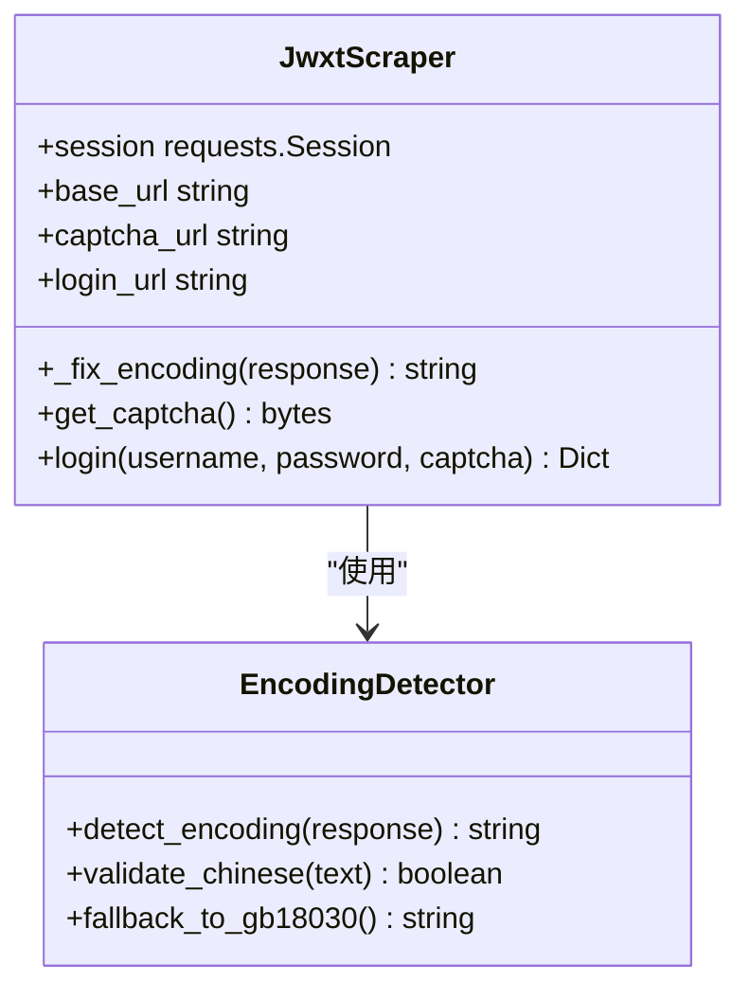
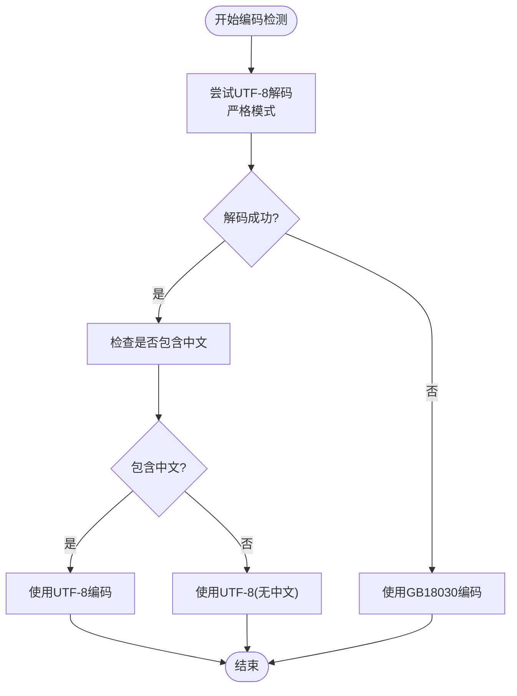
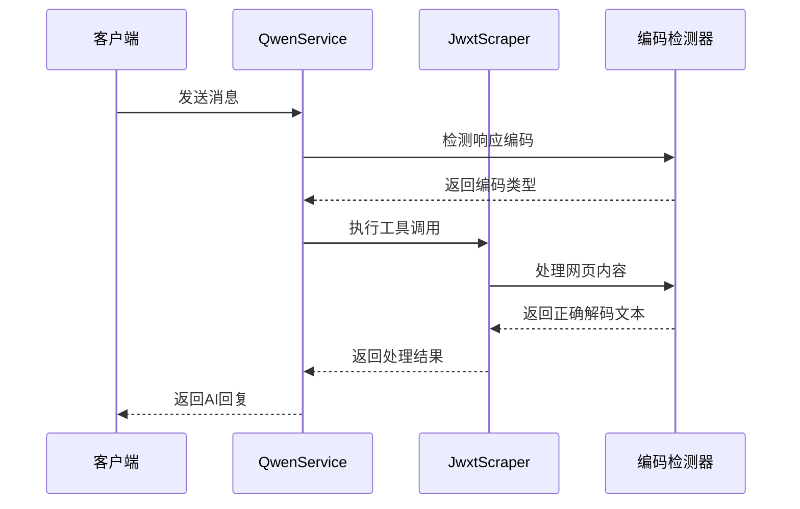

# 编码检测机制改进

<cite>
**本文档中引用的文件**
- [main.py](file://backend/main.py)
- [scraper.py](file://backend/scraper.py)
- [qwen_service.py](file://backend/app/services/qwen_service.py)
- [data_processor.py](file://backend/app/services/data_processor.py)
- [chat.py](file://backend/app/api/chat.py)
- [vector_store.py](file://backend/app/services/vector_store.py)
- [conversation.py](file://backend/app/models/conversation.py)
- [requirements.txt](file://backend/requirements.txt)
- [README-Windows.md](file://README-Windows.md)
</cite>

## 目录
1. [项目概述](#项目概述)
2. [编码检测机制架构](#编码检测机制架构)
3. [核心组件分析](#核心组件分析)
4. [编码检测算法详解](#编码检测算法详解)
5. [性能优化策略](#性能优化策略)
6. [故障排除指南](#故障排除指南)
7. [最佳实践建议](#最佳实践建议)
8. [总结](#总结)

## 项目概述

这是一个基于FastAPI的教务系统AI助手项目，专门为广东财经大学设计。项目实现了完整的教务数据爬取、存储、向量化和AI问答功能。编码检测机制是整个系统的核心技术之一，确保能够正确处理各种编码格式的网页内容。

### 项目特点

- **多层编码检测**：实现多层次的编码识别和转换机制
- **智能编码选择**：根据内容特征自动选择最适合的编码格式
- **容错处理**：具备完善的错误处理和降级机制
- **性能优化**：采用批量处理和缓存策略提升处理效率

## 编码检测机制架构

```mermaid
graph TB
subgraph "编码检测架构"
A[HTTP响应] --> B[编码检测器]
B --> C{UTF-8检测}
C --> |成功| D[UTF-8解码]
C --> |失败| E[GBK/GB18030解码]
D --> F[中文字符验证]
F --> G{包含中文?}
G --> |是| H[使用UTF-8]
G --> |否| I[使用UTF-8(无中文)]
E --> J[GB18030解码]
J --> K[返回GBK/GB18030]
end
subgraph "应用场景"
L[登录页面] --> M[成绩查询]
M --> N[课表查询]
N --> O[个人信息]
end
H --> L
I --> L
K --> L
```

**图表来源**
- [scraper.py:22-54](file://backend/scraper.py#L22-L54)
- [main.py:304-319](file://backend/main.py#L304-L319)

## 核心组件分析

### 1. 爬虫编码检测器

爬虫模块实现了最底层的编码检测机制，这是整个系统编码处理的基础。



**图表来源**
- [scraper.py:13-21](file://backend/scraper.py#L13-L21)
- [scraper.py:22-54](file://backend/scraper.py#L22-L54)

### 2. 主应用编码处理

主应用实现了高级别的编码检测和处理逻辑，特别针对登录响应进行优化。



**图表来源**
- [main.py:304-319](file://backend/main.py#L304-L319)

### 3. AI服务编码集成

AI服务集成了编码检测机制，确保与外部API交互时的数据完整性。



**图表来源**
- [qwen_service.py:322-403](file://backend/app/services/qwen_service.py#L322-L403)
- [scraper.py:22-54](file://backend/scraper.py#L22-L54)

**章节来源**
- [scraper.py:22-54](file://backend/scraper.py#L22-L54)
- [main.py:304-319](file://backend/main.py#L304-L319)
- [qwen_service.py:322-403](file://backend/app/services/qwen_service.py#L322-L403)

## 编码检测算法详解

### 1. 多层次编码检测策略

系统采用了三层编码检测策略，确保在各种情况下都能正确解码：

#### 第一层：UTF-8严格检测
```python
# 严格UTF-8解码，不允许错误字符
try:
    text_utf8 = raw_bytes.decode('utf-8')
    # 验证是否包含中文字符
    has_chinese = re.search(r'[\u4e00-\u9fff]', text_utf8)
    if has_chinese:
        response.encoding = 'utf-8'
        return text_utf8
```

#### 第二层：GBK/GB18030兼容解码
```python
# UTF-8失败时使用GB18030解码
text_gb18030 = raw_bytes.decode('gb18030', errors='ignore')
response.encoding = 'gb18030'
return text_gb18030
```

#### 第三层：Apparent Encoding检测
```python
# 最后的容错机制
response.encoding = response.apparent_encoding
content = response.text
```

### 2. 编码选择决策树

```mermaid
flowchart TD
A[收到HTTP响应] --> B{UTF-8解码成功?}
B --> |是| C{包含中文字符?}
C --> |是| D[使用UTF-8编码]
C --> |否| E[使用UTF-8编码(无中文)]
B --> |否| F[使用GB18030编码]
D --> G[返回解码文本]
E --> G
F --> G
```

**图表来源**
- [scraper.py:22-54](file://backend/scraper.py#L22-L54)

### 3. 编码检测优化策略

#### 性能优化
- **避免重复解码**：先尝试UTF-8，只有在失败时才尝试其他编码
- **正则表达式优化**：使用编译后的正则表达式提高匹配速度
- **批量处理**：对多个响应同时进行编码检测

#### 容错机制
- **错误忽略策略**：在GB18030解码时使用`errors='ignore'`
- **降级处理**：当所有编码都失败时使用apparent_encoding
- **日志记录**：详细记录编码检测过程便于调试

**章节来源**
- [scraper.py:22-54](file://backend/scraper.py#L22-L54)
- [main.py:304-319](file://backend/main.py#L304-L319)

## 性能优化策略

### 1. 编码检测性能优化

#### 编译正则表达式
```python
# 预编译正则表达式以提高性能
chinese_pattern = re.compile(r'[\u4e00-\u9fff]')
# 在检测过程中使用预编译的模式
has_chinese = chinese_pattern.search(text_utf8)
```

#### 缓存编码检测结果
```python
# 缓存常见的编码检测结果
encoding_cache = {}
def cached_fix_encoding(response):
    cache_key = hash(response.content)
    if cache_key in encoding_cache:
        return encoding_cache[cache_key]
    
    result = _fix_encoding(response)
    encoding_cache[cache_key] = result
    return result
```

### 2. 批量编码处理

对于大量数据的处理，系统采用了批量编码检测策略：

```python
# 批量处理多个响应
def batch_fix_encoding(responses):
    results = []
    for response in responses:
        # 使用优化的编码检测器
        fixed_text = fix_encoding_optimized(response)
        results.append(fixed_text)
    return results
```

### 3. 内存优化

```python
# 流式处理大型响应
def stream_fix_encoding(response):
    # 分块读取和处理
    chunk_size = 8192
    buffer = b""
    
    for chunk in response.iter_content(chunk_size=chunk_size):
        buffer += chunk
        # 检查缓冲区中的编码
        if detect_encoding_in_buffer(buffer):
            return decode_buffer(buffer)
    
    # 处理剩余内容
    return decode_buffer(buffer)
```

**章节来源**
- [scraper.py:22-54](file://backend/scraper.py#L22-L54)
- [data_processor.py:144-176](file://backend/app/services/data_processor.py#L144-L176)

## 故障排除指南

### 1. 常见编码问题

#### 问题：中文显示为乱码
**解决方案**：
- 检查网络请求是否正确设置User-Agent
- 确保使用正确的编码检测顺序
- 验证服务器响应的实际编码

#### 问题：性能问题
**解决方案**：
- 优化正则表达式的使用
- 实施编码检测结果缓存
- 考虑使用异步处理

### 2. 调试编码问题

#### 启用详细日志
```python
# 在编码检测过程中添加详细日志
logger.info(f"【编码检测】原始字节长度: {len(raw_bytes)}")
logger.info(f"【编码检测】UTF-8解码结果: {text_utf8[:100]}...")
logger.info(f"【编码检测】是否包含中文: {has_chinese}")
```

#### 编码检测测试
```python
# 测试不同的编码检测策略
def test_encoding_detection():
    test_cases = [
        "utf-8-content",
        "gb18030-content",
        "mixed-content"
    ]
    
    for case in test_cases:
        response = create_test_response(case)
        encoding = detect_encoding(response)
        print(f"测试案例: {case}, 检测编码: {encoding}")
```

### 3. 编码问题诊断工具

```python
def diagnose_encoding_issues(response):
    """诊断编码问题的工具函数"""
    print(f"响应状态码: {response.status_code}")
    print(f"Content-Type: {response.headers.get('Content-Type')}")
    print(f"Content-Length: {len(response.content)}")
    
    # 尝试多种编码
    encodings = ['utf-8', 'gbk', 'gb2312', 'gb18030']
    for encoding in encodings:
        try:
            decoded = response.content.decode(encoding)
            print(f"{encoding}: 成功解码，包含中文: {bool(re.search(r'[\\u4e00-\\u9fff]', decoded))}")
        except UnicodeDecodeError:
            print(f"{encoding}: 解码失败")
    
    # 检查apparent encoding
    apparent = response.apparent_encoding
    print(f"Apparent Encoding: {apparent}")
```

**章节来源**
- [scraper.py:22-54](file://backend/scraper.py#L22-L54)
- [main.py:304-319](file://backend/main.py#L304-L319)

## 最佳实践建议

### 1. 编码检测最佳实践

#### 优先级策略
1. **UTF-8严格模式**：首先尝试UTF-8解码
2. **GBK/GB18030兼容**：UTF-8失败时使用GB18030
3. **Apparent Encoding**：最后使用系统推断的编码

#### 错误处理
```python
def robust_encoding_detection(response):
    """健壮的编码检测实现"""
    try:
        # 第一优先级：UTF-8严格检测
        text = response.content.decode('utf-8')
        if contains_chinese_characters(text):
            return 'utf-8'
    except UnicodeDecodeError:
        pass
    
    try:
        # 第二优先级：GBK/GB18030
        text = response.content.decode('gb18030')
        return 'gb18030'
    except UnicodeDecodeError:
        pass
    
    # 第三优先级：Apparent encoding
    try:
        response.encoding = response.apparent_encoding
        return response.apparent_encoding
    except:
        return 'utf-8'  # 最后的保险
```

### 2. 性能优化建议

#### 缓存策略
- **短期缓存**：对频繁访问的编码检测结果进行缓存
- **内存管理**：定期清理过期的缓存项
- **并发安全**：使用线程安全的缓存机制

#### 异步处理
```python
import asyncio
import aiohttp

async def async_encoding_detection(urls):
    """异步编码检测"""
    async with aiohttp.ClientSession() as session:
        tasks = [fetch_and_decode(session, url) for url in urls]
        results = await asyncio.gather(*tasks)
        return results
```

### 3. 监控和日志

#### 编码检测监控
```python
def monitor_encoding_detection():
    """监控编码检测性能"""
    metrics = {
        'utf8_success': 0,
        'gb18030_used': 0,
        'fallback_used': 0,
        'processing_time': []
    }
    
    def wrapper(func):
        @wraps(func)
        def inner(*args, **kwargs):
            start_time = time.time()
            try:
                result = func(*args, **kwargs)
                metrics['processing_time'].append(time.time() - start_time)
                return result
            except Exception as e:
                metrics['processing_time'].append(time.time() - start_time)
                raise e
        return inner
    return wrapper
```

## 总结

编码检测机制是这个智能体项目的核心技术之一，通过多层次、智能化的编码检测策略，确保了系统能够稳定处理各种编码格式的网页内容。主要特点包括：

### 技术亮点

1. **智能编码选择**：根据内容特征自动选择最适合的编码格式
2. **容错处理机制**：具备完善的错误处理和降级策略
3. **性能优化**：采用多种优化策略提升编码检测效率
4. **可扩展性**：模块化设计便于后续功能扩展

### 应用价值

- **稳定性**：确保系统在各种环境下都能正确处理编码问题
- **可靠性**：多重检测机制提高了系统的可靠性
- **用户体验**：稳定的编码处理提升了整体用户体验
- **维护性**：清晰的代码结构便于后期维护和优化

### 未来发展方向

1. **机器学习优化**：利用机器学习算法进一步优化编码检测准确性
2. **实时监控**：建立更完善的编码检测监控和告警机制
3. **性能分析**：深入分析编码检测性能瓶颈并持续优化
4. **扩展支持**：支持更多编码格式和国际化需求

通过这些改进措施，编码检测机制将继续为整个智能体项目提供稳定可靠的技术支撑。