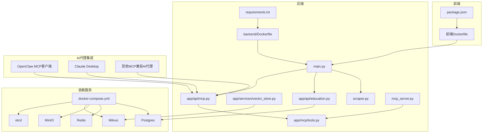
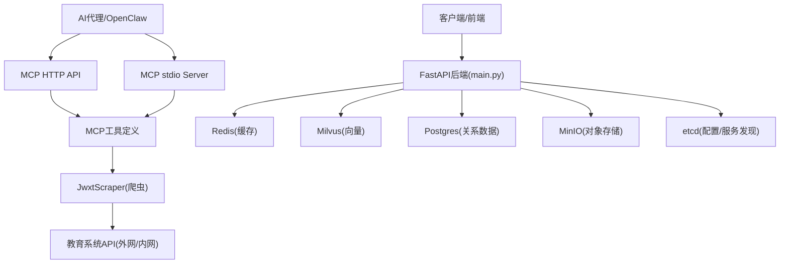
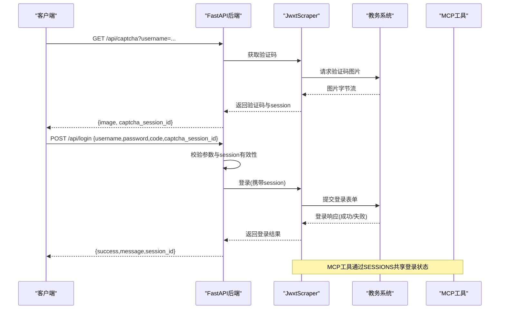
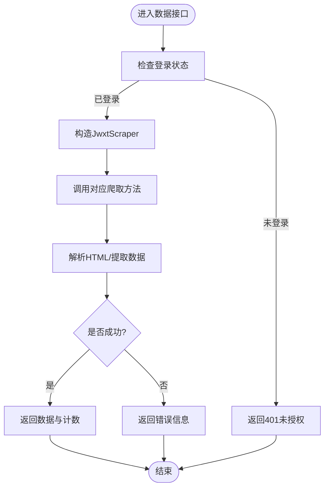
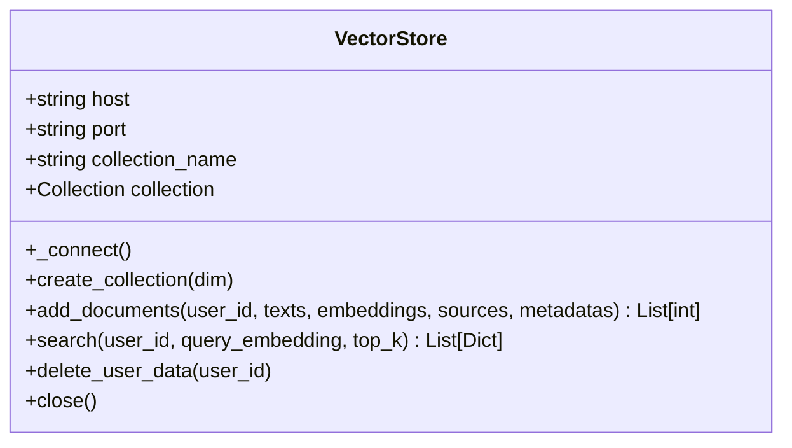
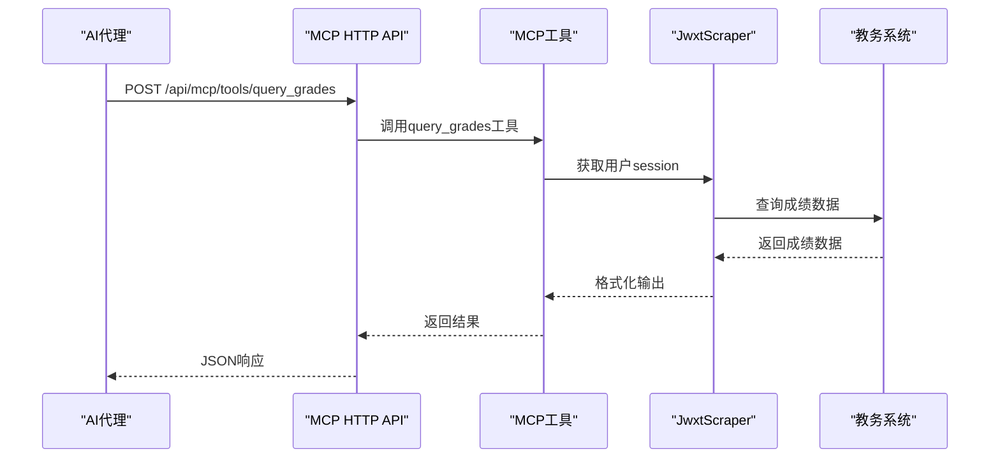
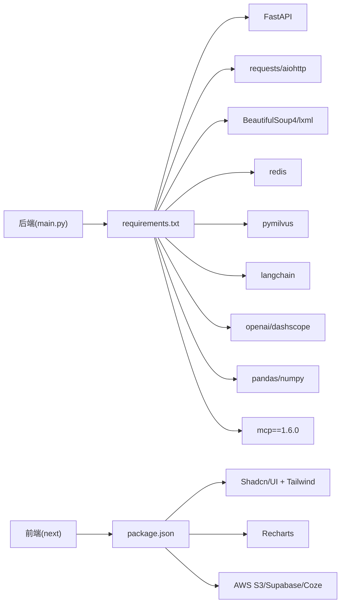

# 第三方服务集成

<cite>
**本文引用的文件**
- [backend/main.py](file://backend/main.py)
- [backend/scraper.py](file://backend/scraper.py)
- [backend/app/api/education.py](file://backend/app/api/education.py)
- [backend/app/api/mcp.py](file://backend/app/api/mcp.py)
- [backend/app/mcp/tools.py](file://backend/app/mcp/tools.py)
- [backend/mcp_server.py](file://backend/mcp_server.py)
- [openclaw/skill.json](file://openclaw/skill.json)
- [backend/app/services/vector_store.py](file://backend/app/services/vector_store.py)
- [backend/docker-compose.yml](file://backend/docker-compose.yml)
- [backend/Dockerfile](file://backend/Dockerfile)
- [backend/requirements.txt](file://backend/requirements.txt)
- [backend/test_login.py](file://backend/test_login.py)
- [backend/test_scraper.py](file://backend/test_scraper.py)
- [frontend/Dockerfile](file://frontend/Dockerfile)
- [package.json](file://package.json)
- [scripts/build.sh](file://scripts/build.sh)
- [scripts/start.sh](file://scripts/start.sh)
- [README-Windows.md](file://README-Windows.md)
- [README.md](file://README.md)
</cite>

## 目录
1. [简介](#简介)
2. [项目结构](#项目结构)
3. [核心组件](#核心组件)
4. [架构总览](#架构总览)
5. [详细组件分析](#详细组件分析)
6. [依赖分析](#依赖分析)
7. [性能考虑](#性能考虑)
8. [故障排查指南](#故障排查指南)
9. [结论](#结论)
10. [附录](#附录)

## 简介
本文件面向"智能教务系统"的第三方服务集成扩展，围绕以下主题提供系统化指导：
- 如何接入新的外部服务与API（认证、数据同步、错误处理）
- 服务发现与配置管理（环境变量、服务注册、负载均衡）
- 缓存服务集成（Redis集群、缓存策略、数据一致性）
- 消息队列与异步任务（任务调度、失败重试、监控告警）
- 日志与监控（分布式追踪、指标采集、告警通知）
- 安全服务集成（OAuth、API密钥、访问控制）
- DevOps工具链（CI/CD、容器编排、自动化部署）
- **新增** AI代理标准化交互协议（MCP集成，OpenClaw支持）

本项目已具备基础的后端API、爬虫模块、向量数据库（Milvus）与缓存（Redis）能力，并新增了完整的MCP（Model Context Protocol）集成，可作为扩展第三方服务与AI代理的标准接口。

## 项目结构
后端采用FastAPI，提供教务系统数据爬取与聚合接口；前端基于Next.js；通过Docker Compose编排数据库、缓存、对象存储与向量数据库等依赖服务。新增的MCP模块提供了标准化的AI工具调用接口。

**图示来源**
- [backend/docker-compose.yml:1-148](file://backend/docker-compose.yml#L1-L148)
- [backend/Dockerfile:1-18](file://backend/Dockerfile#L1-L18)
- [frontend/Dockerfile:1-33](file://frontend/Dockerfile#L1-L33)
- [backend/main.py:1-853](file://backend/main.py#L1-L853)
- [backend/scraper.py:1-1220](file://backend/scraper.py#L1-L1220)
- [backend/app/services/vector_store.py:1-164](file://backend/app/services/vector_store.py#L1-L164)
- [backend/app/api/education.py:1-104](file://backend/app/api/education.py#L1-L104)
- [backend/app/api/mcp.py:1-195](file://backend/app/api/mcp.py#L1-L195)
- [backend/app/mcp/tools.py:1-310](file://backend/app/mcp/tools.py#L1-L310)
- [backend/mcp_server.py:1-35](file://backend/mcp_server.py#L1-L35)
- [backend/requirements.txt:1-51](file://backend/requirements.txt#L1-L51)

**章节来源**
- [backend/docker-compose.yml:1-148](file://backend/docker-compose.yml#L1-L148)
- [backend/Dockerfile:1-18](file://backend/Dockerfile#L1-L18)
- [frontend/Dockerfile:1-33](file://frontend/Dockerfile#L1-L33)
- [backend/requirements.txt:1-51](file://backend/requirements.txt#L1-L51)

## 核心组件
- FastAPI后端服务：提供验证码、登录、个人信息、成绩、课表、培养方案、考试安排、教师/课程查询等接口；内置健康检查与CORS；**新增** MCP HTTP API路由。
- 教务系统爬虫模块：封装验证码获取、登录、个人信息、学籍卡片、成绩、课表、培养方案、学业进度、考试安排、选课信息等数据抓取逻辑。
- **新增** MCP工具模块：将教务系统功能暴露为标准化MCP工具，支持OpenClaw、Claude Desktop等AI代理调用。
- **新增** MCP服务器：提供stdio模式的MCP服务，支持本地调试和OpenClaw集成。
- **新增** OpenClaw技能配置：完整的技能描述、工具定义和使用示例。
- 向量数据库服务（Milvus）：封装连接、集合创建、文档插入、相似度检索、用户数据清理与连接关闭。
- 依赖服务编排：PostgreSQL、Redis、MinIO、Milvus、etcd，通过docker-compose统一管理。
- 前后端Dockerfile与构建脚本：前端使用Nginx静态托管，后端使用uvicorn运行FastAPI。

**章节来源**
- [backend/main.py:1-853](file://backend/main.py#L1-L853)
- [backend/scraper.py:1-1220](file://backend/scraper.py#L1-L1220)
- [backend/app/mcp/tools.py:1-310](file://backend/app/mcp/tools.py#L1-L310)
- [backend/mcp_server.py:1-35](file://backend/mcp_server.py#L1-L35)
- [openclaw/skill.json:1-107](file://openclaw/skill.json#L1-L107)
- [backend/app/services/vector_store.py:1-164](file://backend/app/services/vector_store.py#L1-L164)
- [backend/docker-compose.yml:1-148](file://backend/docker-compose.yml#L1-L148)
- [frontend/Dockerfile:1-33](file://frontend/Dockerfile#L1-L33)
- [backend/Dockerfile:1-18](file://backend/Dockerfile#L1-L18)

## 架构总览
系统采用"后端API + 爬虫 + 向量数据库 + 缓存 + 对象存储 + 数据库 + MCP工具层"的组合架构，支持扩展第三方服务与API，以及AI代理的标准化交互。

**图示来源**
- [backend/main.py:1-853](file://backend/main.py#L1-L853)
- [backend/scraper.py:1-1220](file://backend/scraper.py#L1-L1220)
- [backend/docker-compose.yml:1-148](file://backend/docker-compose.yml#L1-L148)
- [backend/app/services/vector_store.py:1-164](file://backend/app/services/vector_store.py#L1-L164)
- [backend/app/api/mcp.py:1-195](file://backend/app/api/mcp.py#L1-L195)
- [backend/app/mcp/tools.py:1-310](file://backend/app/mcp/tools.py#L1-L310)
- [backend/mcp_server.py:1-35](file://backend/mcp_server.py#L1-L35)

## 详细组件分析

### 组件A：认证与会话管理
- 验证码与登录流程：后端提供获取验证码与登录接口，使用requests.Session维持会话，验证码与登录绑定同一服务器以避免跨节点问题。
- 会话存储：开发态使用内存字典存储会话，生产建议替换为Redis等持久化缓存。
- CORS与健康检查：默认允许所有来源，生产需限制；提供健康检查端点。
- **新增** MCP会话共享：MCP工具通过全局SESSIONS访问现有登录状态，无需重复认证。

**图示来源**
- [backend/main.py:135-328](file://backend/main.py#L135-L328)
- [backend/scraper.py:22-60](file://backend/scraper.py#L22-L60)
- [backend/app/mcp/tools.py:21-42](file://backend/app/mcp/tools.py#L21-L42)

**章节来源**
- [backend/main.py:135-328](file://backend/main.py#L135-L328)
- [backend/scraper.py:22-60](file://backend/scraper.py#L22-L60)
- [backend/app/mcp/tools.py:21-42](file://backend/app/mcp/tools.py#L21-L42)

### 组件B：数据同步与聚合
- 数据接口：提供个人信息、学籍卡片、成绩、课表、培养方案、学业进度、考试安排、教师/课程查询等接口。
- 聚合接口：提供"所有数据"接口，便于一次性向量化与RAG入库。
- 爬虫模块：封装HTML解析与数据抽取，支持多种查询参数与统计信息提取。
- **新增** MCP工具：将上述功能封装为标准化MCP工具，支持AI代理调用。

**图示来源**
- [backend/main.py:332-725](file://backend/main.py#L332-L725)
- [backend/scraper.py:61-800](file://backend/scraper.py#L61-L800)
- [backend/app/mcp/tools.py:44-310](file://backend/app/mcp/tools.py#L44-L310)

**章节来源**
- [backend/main.py:332-725](file://backend/main.py#L332-L725)
- [backend/scraper.py:61-800](file://backend/scraper.py#L61-L800)
- [backend/app/mcp/tools.py:44-310](file://backend/app/mcp/tools.py#L44-L310)

### 组件C：向量数据库集成（Milvus）
- 连接与集合：通过环境变量配置主机、端口与集合名，自动创建集合与索引。
- 文档插入：支持批量插入文本、向量、来源与元数据。
- 检索：按用户维度过滤，执行相似度搜索并返回命中结果。
- 清理：按用户ID删除其所有向量数据。

**图示来源**
- [backend/app/services/vector_store.py:14-164](file://backend/app/services/vector_store.py#L14-L164)

**章节来源**
- [backend/app/services/vector_store.py:1-164](file://backend/app/services/vector_store.py#L1-L164)

### 组件D：缓存服务集成（Redis）
- 现状：后端使用内存字典存储验证码与登录会话，适合开发；生产需替换为Redis。
- 建议：将验证码session、登录会话、热点查询结果迁移至Redis，结合过期策略与持久化保障一致性。
- 集群与高可用：可参考docker-compose中的Redis服务，扩展为Redis Sentinel或Redis Cluster以提升可用性。

**章节来源**
- [backend/main.py:73-74](file://backend/main.py#L73-L74)
- [backend/docker-compose.yml:20-34](file://backend/docker-compose.yml#L20-L34)

### 组件E：服务发现与配置管理
- 现状：通过环境变量注入服务地址（Postgres、Redis、Milvus、AI模型等），容器间通过服务名通信。
- 建议：引入etcd作为配置中心，集中管理服务注册与动态配置；在后端通过环境变量或配置中心读取服务地址与参数。

**章节来源**
- [backend/docker-compose.yml:113-127](file://backend/docker-compose.yml#L113-L127)
- [backend/main.py:35-37](file://backend/main.py#L35-L37)

### 组件F：消息队列与异步任务
- 现状：未发现显式的异步任务或消息队列组件。
- 建议：引入RQ或Celery + Redis，将耗时任务（如批量数据爬取、向量化入库、报表生成）异步化；配置失败重试与死信队列；结合监控告警。

**章节来源**
- [backend/requirements.txt:1-51](file://backend/requirements.txt#L1-L51)

### 组件G：日志与监控
- 日志：后端使用标准日志模块，建议接入结构化日志（如JSON）与集中式日志系统（如ELK/Fluentd）。
- 监控：建议集成Prometheus + Grafana，暴露指标端点；结合OpenTelemetry实现分布式追踪。
- 告警：基于阈值规则触发告警，对接企业微信/钉钉/邮件。

**章节来源**
- [backend/main.py:35-37](file://backend/main.py#L35-L37)

### 组件H：安全与访问控制
- OAuth：建议在现有登录流程基础上增加OAuth登录入口，统一用户体系。
- API密钥：为第三方服务调用设置API密钥与权限控制，后端在路由层校验。
- 访问控制：基于角色的访问控制（RBAC），限制敏感接口访问。
- **新增** MCP安全：通过工具参数验证和错误处理保障MCP调用安全。

**章节来源**
- [backend/main.py:41-48](file://backend/main.py#L41-L48)
- [backend/app/api/mcp.py:96-146](file://backend/app/api/mcp.py#L96-L146)

### 组件I：DevOps工具链
- CI/CD：建议使用GitHub Actions/GitLab CI，包含依赖安装、构建、测试与镜像推送。
- 容器编排：现有docker-compose满足本地开发；生产建议使用Kubernetes，配合Helm Chart管理。
- 自动化部署：结合GitOps（如ArgoCD）实现声明式部署与回滚。

**章节来源**
- [backend/docker-compose.yml:1-148](file://backend/docker-compose.yml#L1-L148)
- [scripts/build.sh:1-18](file://scripts/build.sh#L1-L18)
- [scripts/start.sh:1-18](file://scripts/start.sh#L1-L18)

### 组件J：AI代理标准化交互（新增）
- **MCP HTTP API**：提供RESTful接口调用MCP工具，支持Web端和其他客户端。
- **MCP工具定义**：将教务系统功能封装为标准化工具，包括成绩查询、课表查询、学业进度等。
- **MCP服务器**：支持stdio模式，便于本地调试和OpenClaw集成。
- **OpenClaw技能配置**：完整的技能描述、工具映射和使用示例。

**图示来源**
- [backend/app/api/mcp.py:96-146](file://backend/app/api/mcp.py#L96-L146)
- [backend/app/mcp/tools.py:44-82](file://backend/app/mcp/tools.py#L44-L82)
- [backend/mcp_server.py:22-35](file://backend/mcp_server.py#L22-L35)

**章节来源**
- [backend/app/api/mcp.py:1-195](file://backend/app/api/mcp.py#L1-L195)
- [backend/app/mcp/tools.py:1-310](file://backend/app/mcp/tools.py#L1-L310)
- [backend/mcp_server.py:1-35](file://backend/mcp_server.py#L1-L35)
- [openclaw/skill.json:1-107](file://openclaw/skill.json#L1-L107)

## 依赖分析
后端依赖包括Web框架、HTTP请求、HTML解析、缓存、向量数据库、LangChain、AI模型、数据处理、**MCP协议支持**等模块；前端依赖包括UI组件、图表库、SDK等。

**图示来源**
- [backend/requirements.txt:1-51](file://backend/requirements.txt#L1-L51)
- [package.json:12-68](file://package.json#L12-L68)

**章节来源**
- [backend/requirements.txt:1-51](file://backend/requirements.txt#L1-L51)
- [package.json:12-68](file://package.json#L12-L68)

## 性能考虑
- 爬虫并发与限流：对目标站点施加合理延时与并发上限，避免触发反爬机制。
- 缓存策略：热点数据（验证码、登录态、查询结果）使用Redis缓存，设置合理TTL与失效策略。
- 向量检索优化：Milvus索引参数（如nlist）与metric_type需结合数据规模与查询延迟权衡。
- 异步化：将耗时操作异步化，减少请求阻塞。
- CDN与对象存储：静态资源与大文件使用MinIO/对象存储，结合CDN加速。
- **新增** MCP性能：工具调用采用异步模式，避免阻塞主进程；合理设置工具参数限制。

## 故障排查指南
- 登录失败：检查VPN/校园网连通性、验证码是否过期、服务器选择是否一致。
- 验证码异常：确认验证码接口可达、会话是否正确传递、超时设置是否合理。
- Milvus连接失败：检查容器健康状态、网络连通、索引创建是否成功。
- Redis不可用：确认容器健康、连接参数、集群模式（如使用Sentinel/Cluster）。
- 前端静态资源404：确认Nginx配置与构建产物路径。
- **新增** MCP工具调用失败：检查工具名称是否正确、参数格式是否符合Schema、用户是否已登录。
- **新增** OpenClaw集成问题：确认skill.json配置正确、MCP服务器可访问、工具映射表完整。

**章节来源**
- [backend/test_login.py:1-152](file://backend/test_login.py#L1-L152)
- [backend/test_scraper.py:1-280](file://backend/test_scraper.py#L1-L280)
- [backend/docker-compose.yml:1-148](file://backend/docker-compose.yml#L1-L148)
- [frontend/Dockerfile:1-33](file://frontend/Dockerfile#L1-L33)
- [backend/app/api/mcp.py:96-146](file://backend/app/api/mcp.py#L96-L146)
- [openclaw/skill.json:1-107](file://openclaw/skill.json#L1-L107)

## 结论
本项目已具备接入第三方服务的良好基础：清晰的API边界、可扩展的爬虫模块、成熟的向量与缓存能力，并**新增了完整的MCP集成**，支持AI代理的标准化交互。建议在生产环境中重点补齐以下能力：Redis集群与高可用、etcd配置中心、消息队列与异步任务、分布式追踪与监控告警、OAuth与API密钥管理、以及完善的CI/CD与容器编排方案。

## 附录
- 快速启动与测试：参考Windows部署文档中的步骤与端点，验证健康检查、验证码与登录流程。
- 构建与启动脚本：前端构建与后端服务启动脚本可用于本地开发与部署。
- **新增** MCP集成测试：可通过HTTP API或OpenClaw客户端测试MCP工具调用。
- **新增** OpenClaw技能配置：完整的技能描述、工具定义和使用示例。

**章节来源**
- [README-Windows.md:171-211](file://README-Windows.md#L171-L211)
- [scripts/build.sh:1-18](file://scripts/build.sh#L1-L18)
- [scripts/start.sh:1-18](file://scripts/start.sh#L1-L18)
- [README.md:151-185](file://README.md#L151-L185)
- [openclaw/skill.json:1-107](file://openclaw/skill.json#L1-L107)