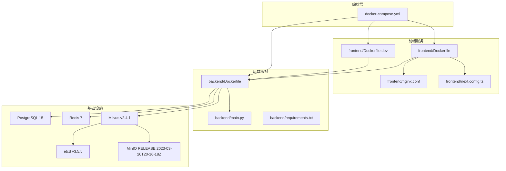
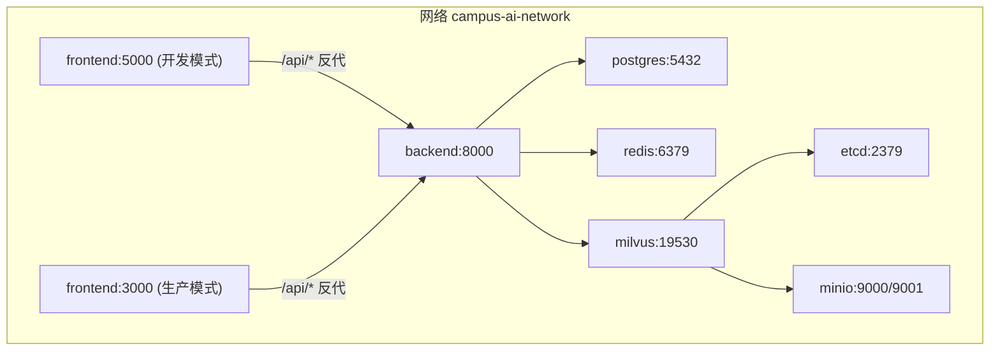
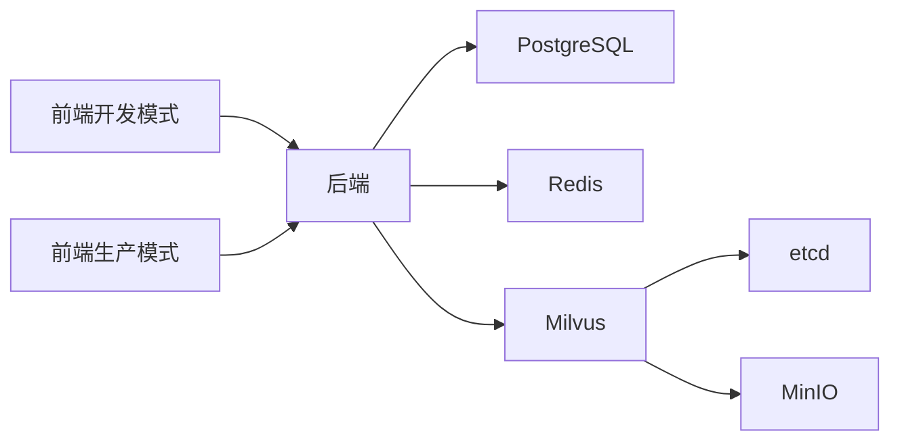
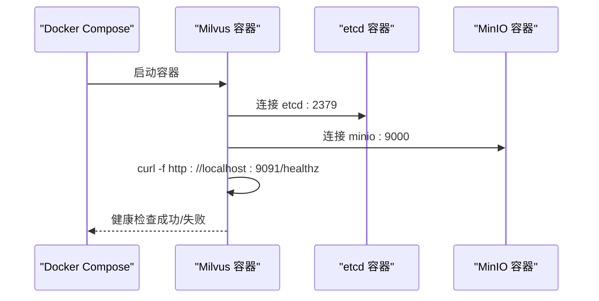
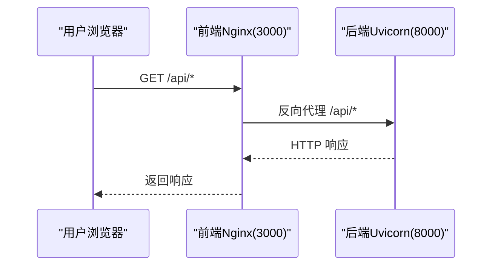

# Docker部署

<cite>
**本文引用的文件**
- [docker-compose.yml](file://docker-compose.yml)
- [backend/Dockerfile](file://backend/Dockerfile)
- [frontend/Dockerfile](file://frontend/Dockerfile)
- [frontend/Dockerfile.dev](file://frontend/Dockerfile.dev)
- [backend/requirements.txt](file://backend/requirements.txt)
- [package.json](file://package.json)
- [frontend/nginx.conf](file://frontend/nginx.conf)
- [backend/main.py](file://backend/main.py)
- [frontend/next.config.ts](file://frontend/next.config.ts)
- [scripts/build.sh](file://scripts/build.sh)
- [scripts/start.sh](file://scripts/start.sh)
- [scripts/prepare.sh](file://scripts/prepare.sh)
- [scripts/dev.sh](file://scripts/dev.sh)
- [.coze](file://.coze)
</cite>

## 更新摘要
**所做变更**
- 更新前端服务配置，现在使用Dockerfile.dev支持热重载和实时代码同步
- 新增开发模式下的文件监听和代码挂载配置
- 更新前端Dockerfile.dev的构建流程说明，强调单阶段开发构建和系统依赖安装
- 增强开发环境的实时同步功能描述
- 改进pnpm镜像源配置，支持国内网络环境

## 目录
1. [简介](#简介)
2. [项目结构](#项目结构)
3. [核心组件](#核心组件)
4. [架构总览](#架构总览)
5. [详细组件分析](#详细组件分析)
6. [依赖关系分析](#依赖关系分析)
7. [性能考虑](#性能考虑)
8. [故障排查指南](#故障排查指南)
9. [结论](#结论)
10. [附录](#附录)

## 简介
本文件面向智能教务系统AI助手的Docker部署，提供从环境准备、镜像构建、容器编排到生产部署最佳实践的完整指南。内容覆盖：
- Docker Compose服务定义与网络、存储、健康检查配置
- 前后端Dockerfile构建流程与运行方式，包括开发模式的热重载支持
- 环境变量、端口映射与容器间通信
- 数据持久化策略与安全加固建议
- 生产环境资源限制、日志与监控配置思路

## 项目结构
该仓库采用多服务单仓结构：前端Next.js应用、后端FastAPI应用、以及数据库、缓存、对象存储、向量数据库等基础设施均通过Compose统一编排。

**图表来源**
- [docker-compose.yml](file://docker-compose.yml)
- [backend/Dockerfile](file://backend/Dockerfile)
- [frontend/Dockerfile](file://frontend/Dockerfile)
- [frontend/Dockerfile.dev](file://frontend/Dockerfile.dev)
- [backend/requirements.txt](file://backend/requirements.txt)
- [backend/main.py](file://backend/main.py)
- [frontend/nginx.conf](file://frontend/nginx.conf)
- [frontend/next.config.ts](file://frontend/next.config.ts)

**章节来源**
- [docker-compose.yml](file://docker-compose.yml)
- [backend/Dockerfile](file://backend/Dockerfile)
- [frontend/Dockerfile](file://frontend/Dockerfile)
- [frontend/Dockerfile.dev](file://frontend/Dockerfile.dev)

## 核心组件
- 数据库：PostgreSQL 15（持久化卷、健康检查）
- 缓存：Redis 7（持久化卷、健康检查）
- 分布式键值：etcd（持久化卷、健康检查）
- 对象存储：MinIO（持久化卷、健康检查）
- 向量数据库：Milvus（依赖etcd与MinIO，持久化卷、健康检查）
- 后端服务：FastAPI应用（uvicorn运行，暴露8000端口）
- 前端服务：Next.js开发模式（Dockerfile.dev）支持热重载，或生产模式（Dockerfile）构建产物由Nginx提供

**章节来源**
- [docker-compose.yml](file://docker-compose.yml)
- [backend/Dockerfile](file://backend/Dockerfile)
- [frontend/Dockerfile](file://frontend/Dockerfile)
- [frontend/Dockerfile.dev](file://frontend/Dockerfile.dev)

## 架构总览
下图展示容器间的依赖与通信关系，以及前端通过Nginx反向代理访问后端API的路径。

**图表来源**
- [docker-compose.yml](file://docker-compose.yml)
- [frontend/nginx.conf](file://frontend/nginx.conf)

## 详细组件分析

### 数据库（PostgreSQL）
- 基础镜像：postgres:15-alpine
- 环境变量：用户名、密码、数据库名（支持默认值与外部注入）
- 存储：挂载postgres_data卷
- 端口：对外映射5432
- 健康检查：使用pg_isready探测
- 依赖：被后端服务健康检查依赖

**章节来源**
- [docker-compose.yml](file://docker-compose.yml)

### 缓存（Redis）
- 基础镜像：redis:7-alpine
- 存储：挂载redis_data卷
- 命令：开启AOF持久化
- 端口：对外映射6379
- 健康检查：redis-cli ping

**章节来源**
- [docker-compose.yml](file://docker-compose.yml)

### 分布式键值（etcd）
- 基础镜像：quay.io/coreos/etcd:v3.5.5
- 存储：挂载etcd_data卷
- 环境变量：自动压缩、配额、快照参数
- 命令：监听0.0.0.0:2379并指定数据目录
- 健康检查：etcdctl endpoint health

**章节来源**
- [docker-compose.yml](file://docker-compose.yml)

### 对象存储（MinIO）
- 基础镜像：minio/minio:RELEASE.2023-03-20T20-16-18Z
- 存储：挂载minio_data卷
- 环境变量：访问密钥与秘密密钥（默认值）
- 命令：以/最小化数据目录启动
- 端口：对外映射9000/9001
- 健康检查：curl探测live接口

**章节来源**
- [docker-compose.yml](file://docker-compose.yml)

### 向量数据库（Milvus）
- 基础镜像：milvusdb/milvus:v2.4.1
- 命令：以standalone模式运行
- 环境变量：ETCD_ENDPOINTS、MINIO_ADDRESS
- 存储：挂载milvus_data卷
- 端口：对外映射19530/9091
- 健康检查：curl探测healthz
- 依赖：依赖etcd与MinIO

**章节来源**
- [docker-compose.yml](file://docker-compose.yml)

### 后端服务（FastAPI + uvicorn）
- 构建：基于python:3.11-slim，复制requirements.txt并离线安装，复制源码，暴露8000端口，使用uvicorn启动
- 环境变量：数据库、缓存、Milvus主机与端口、AI模型密钥与模型、教育系统地址、JWT密钥、CORS来源等
- 端口：对外映射8000
- 依赖：等待postgres、redis、milvus健康后再启动
- **开发模式特性**：使用uvicorn的reload选项实现代码热重载

**章节来源**
- [docker-compose.yml](file://docker-compose.yml)
- [backend/Dockerfile](file://backend/Dockerfile)
- [backend/requirements.txt](file://backend/requirements.txt)
- [backend/main.py](file://backend/main.py)

### 前端服务（Next.js + Nginx）
- **开发模式**（Dockerfile.dev）：基于node:20-alpine，支持热重载和实时代码同步
  - 使用pnpm安装依赖并启动开发服务器
  - 暴露5000端口，支持文件监听（WATCHPACK_POLLING=true）
  - 挂载src、public、配置文件等目录实现代码同步
  - 通过/virtual-host访问容器内代码
- **生产模式**（Dockerfile）：单阶段构建，基于node:20-alpine，安装pnpm与依赖并构建；使用nginx:alpine复制dist与自定义nginx.conf
- 运行：Nginx以daemon off方式启动
- 端口：对外映射3000
- 反向代理：/api前缀转发至backend:8000
- 静态资源：/指向dist目录

**更新** 前端现在提供两种运行模式：开发模式支持热重载和实时代码同步，生产模式提供优化的静态资源服务

**章节来源**
- [docker-compose.yml](file://docker-compose.yml)
- [frontend/Dockerfile](file://frontend/Dockerfile)
- [frontend/Dockerfile.dev](file://frontend/Dockerfile.dev)
- [frontend/nginx.conf](file://frontend/nginx.conf)
- [frontend/next.config.ts](file://frontend/next.config.ts)

### 容器间通信与网络
- 默认网络：default网络名为campus-ai-network
- 服务发现：后端通过服务名访问数据库、缓存、Milvus（如postgres、redis、milvus）
- 健康检查依赖：后端在启动时依赖数据库、缓存、Milvus健康状态
- **开发模式增强**：前端开发容器与后端容器之间建立直接的文件同步机制

**章节来源**
- [docker-compose.yml](file://docker-compose.yml)

### 数据持久化策略
- 卷声明：postgres_data、redis_data、etcd_data、minio_data、milvus_data
- 作用：保证容器重启后数据不丢失
- **开发模式增强**：前端开发容器挂载src、public、配置文件等目录，实现代码的实时同步

**章节来源**
- [docker-compose.yml](file://docker-compose.yml)

### 环境变量与端口映射
- 后端关键变量：数据库连接、缓存连接、Milvus连接、AI模型密钥、教育系统地址、JWT密钥、CORS来源
- 前端关键变量：NEXT_PUBLIC_API_URL（指向/api）、WATCHPACK_POLLING（支持文件监听）
- 端口映射：5000（前端开发模式）、3000（前端生产模式）、8000（后端）、5432（数据库）、6379（缓存）、9000/9001（对象存储）、19530/9091（向量数据库）

**更新** 新增WATCHPACK_POLLING环境变量支持开发模式的文件监听功能

**章节来源**
- [docker-compose.yml](file://docker-compose.yml)
- [frontend/nginx.conf](file://frontend/nginx.conf)

### 健康检查
- PostgreSQL：pg_isready
- Redis：redis-cli ping
- etcd：etcdctl endpoint health
- MinIO：curl探测live
- Milvus：curl探测healthz

**章节来源**
- [docker-compose.yml](file://docker-compose.yml)

## 依赖关系分析
后端对数据库、缓存、向量数据库存在直接依赖；Milvus对etcd与MinIO存在依赖；前端依赖后端提供API。

**图表来源**
- [docker-compose.yml](file://docker-compose.yml)

**章节来源**
- [docker-compose.yml](file://docker-compose.yml)

## 性能考虑
- 镜像体积与构建时间
  - 后端使用python:3.11-slim，前端使用node:20-alpine与nginx:alpine，有助于减小镜像体积与提升构建速度
  - **开发模式优化**：Dockerfile.dev使用轻量级node:20-alpine，支持热重载但不包含生产优化
- 依赖安装优化
  - 后端使用国内镜像源加速pip安装
  - 前端使用pnpm并配置镜像源，提升安装效率
- 运行时性能
  - 后端使用uvicorn标准变体，适合生产部署
  - **开发模式增强**：前端开发服务器支持热重载，提升开发体验
  - Milvus以standalone模式运行，适合开发/小规模场景；生产建议使用分布式模式并配合etcd与对象存储集群
- 资源限制与隔离
  - 建议在生产环境中为各服务设置CPU/内存限制与重启策略，避免资源争用
- 日志与监控
  - 建议统一采集容器日志，结合指标监控（如Prometheus/Grafana）与链路追踪（如Jaeger/OpenTelemetry）
- **开发模式优化**
  - 文件监听：通过WATCHPACK_POLLING环境变量启用文件变化监听
  - 实时同步：通过volumes挂载实现代码的实时同步，无需手动重启容器

## 故障排查指南
- 健康检查失败
  - PostgreSQL/Redis/Milvus/MinIO/etcd的健康检查失败通常意味着容器内部服务未就绪或配置错误。可通过查看对应容器日志定位问题
- 前端无法访问后端API
  - 检查Nginx反向代理配置是否正确，确认后端容器名称与端口一致
  - 确认后端CORS配置与前端访问域名匹配
  - **开发模式注意**：确保前端开发容器正确挂载了代码目录
- 数据库连接失败
  - 检查POSTGRES_HOST/PORT/USER/PASSWORD/DB是否与compose中一致
- Milvus无法启动
  - 确认etcd与MinIO已健康运行，且环境变量ETCD_ENDPOINTS与MINIO_ADDRESS正确
- 端口冲突
  - 若宿主机端口已被占用，修改docker-compose中的端口映射或释放端口
- **开发模式特定问题**
  - 热重载失效：检查WATCHPACK_POLLING环境变量是否正确设置
  - 代码不同步：确认volumes挂载配置是否正确，特别是排除node_modules和.next目录
  - 文件监听异常：检查容器权限和文件系统挂载点

**章节来源**
- [docker-compose.yml](file://docker-compose.yml)
- [frontend/nginx.conf](file://frontend/nginx.conf)

## 结论
本部署方案通过Docker Compose将前后端与数据库、缓存、对象存储、向量数据库统一编排，具备清晰的服务边界与依赖关系。**新增的开发模式**通过Dockerfile.dev提供了强大的热重载和实时代码同步能力，显著提升了开发效率。建议在生产环境中进一步完善资源限制、日志采集、监控告警与安全加固（如密钥管理、网络隔离、只读卷等），以满足高可用与合规要求。

## 附录

### 部署步骤（本地开发）
- 准备环境
  - 安装Docker与Docker Compose
- 构建镜像
  - 在项目根目录执行：docker compose build
- 启动服务
  - 在项目根目录执行：docker compose up -d
- 访问服务
  - 前端开发模式：http://localhost:5000
  - 后端：http://localhost:8000/api
  - 数据库：本地5432端口
  - 缓存：本地6379端口
  - 对象存储：本地9000/9001端口
  - 向量数据库：本地19530/9091端口

**更新** 开发模式下前端提供热重载功能，代码修改后可实时看到效果

**章节来源**
- [docker-compose.yml](file://docker-compose.yml)

### 前后端Dockerfile构建流程
- 后端Dockerfile
  - 基于python:3.11-slim
  - 复制requirements.txt并使用国内镜像源安装依赖
  - 复制源码，暴露8000端口，使用uvicorn启动
- **前端Dockerfile.dev（开发模式）**
  - 基于node:20-alpine，支持热重载和实时代码同步
  - 安装pnpm并配置镜像源
  - 复制依赖文件并安装依赖
  - 暴露5000端口，使用pnpm dev启动开发服务器
  - 挂载src、public、配置文件等目录实现代码同步
- **前端Dockerfile（生产模式）**
  - 单阶段构建：基于node:20-alpine，安装pnpm与依赖并构建Next.js应用；使用nginx:alpine提供静态资源与反向代理

**更新** 新增Dockerfile.dev的详细构建流程，强调开发模式的热重载和代码同步特性

**章节来源**
- [backend/Dockerfile](file://backend/Dockerfile)
- [frontend/Dockerfile](file://frontend/Dockerfile)
- [frontend/Dockerfile.dev](file://frontend/Dockerfile.dev)

### 环境变量清单（后端）
- 数据库相关：POSTGRES_HOST、POSTGRES_PORT、POSTGRES_USER、POSTGRES_PASSWORD、POSTGRES_DB
- 缓存相关：REDIS_HOST、REDIS_PORT
- 向量数据库相关：MILVUS_HOST、MILVUS_PORT
- AI模型相关：QWEN_API_KEY、QWEN_MODEL
- 教务系统相关：EDUCATION_SYSTEM_URL
- 安全相关：JWT_SECRET_KEY
- 跨域相关：CORS_ORIGINS

**章节来源**
- [docker-compose.yml](file://docker-compose.yml)

### 健康检查序列图（Milvus）

**图表来源**
- [docker-compose.yml](file://docker-compose.yml)

### 前后端交互序列图（前端Nginx反向代理）

**图表来源**
- [docker-compose.yml](file://docker-compose.yml)
- [frontend/nginx.conf](file://frontend/nginx.conf)

### 构建脚本与开发脚本
- 构建脚本（前端）
  - 安装依赖、构建Next.js、打包服务端代码
- 启动脚本（服务端）
  - 设置端口并启动dist/server.js
- 准备脚本（开发）
  - 安装依赖
- **开发脚本（开发）**
  - 清理端口、热更新启动服务
  - 支持文件监听和代码热重载

**更新** 开发脚本现在支持更高级的热重载和文件监听功能

**章节来源**
- [scripts/build.sh](file://scripts/build.sh)
- [scripts/start.sh](file://scripts/start.sh)
- [scripts/prepare.sh](file://scripts/prepare.sh)
- [scripts/dev.sh](file://scripts/dev.sh)
- [.coze](file://.coze)

### 开发模式特性详解
- **热重载支持**：通过Dockerfile.dev的pnpm dev命令实现代码修改后的自动重启
- **实时代码同步**：通过volumes挂载实现宿主机与容器内的代码实时同步
- **文件监听增强**：通过WATCHPACK_POLLING=true启用文件变化监听，提升开发体验
- **开发工具集成**：支持React Dev Inspector等开发工具的集成使用
- **系统依赖安装**：在Dockerfile.dev中添加libc6-compat依赖，确保兼容性
- **pnpm镜像源优化**：配置国内镜像源，提升依赖安装速度

**新增章节** 详细说明开发模式下前端容器的特殊配置和功能特性

**章节来源**
- [docker-compose.yml](file://docker-compose.yml)
- [frontend/Dockerfile.dev](file://frontend/Dockerfile.dev)