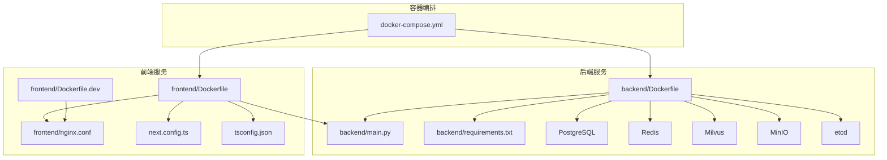
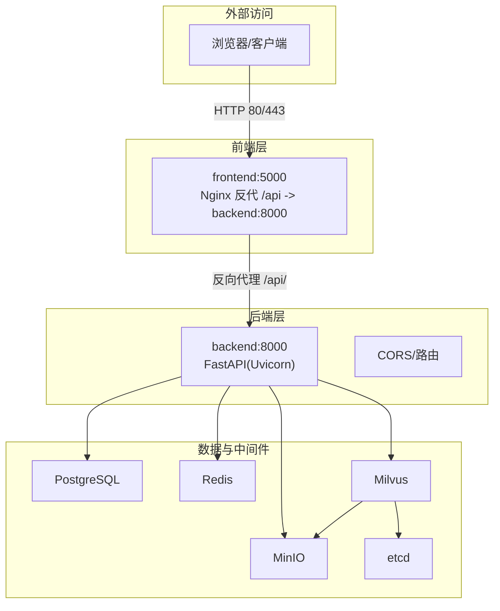
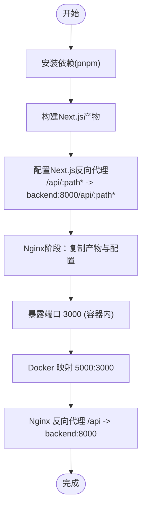
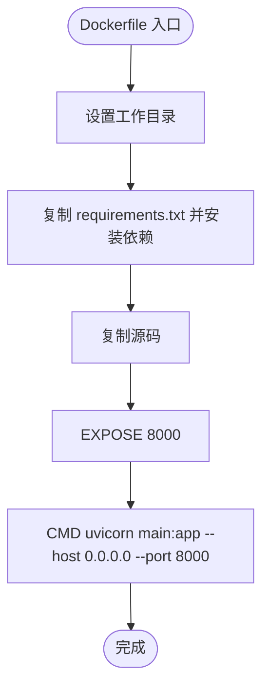
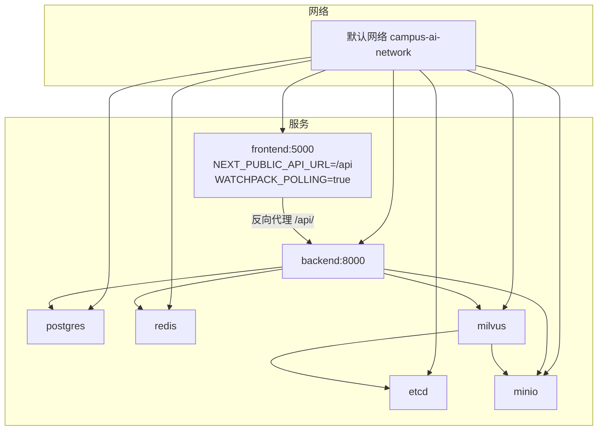
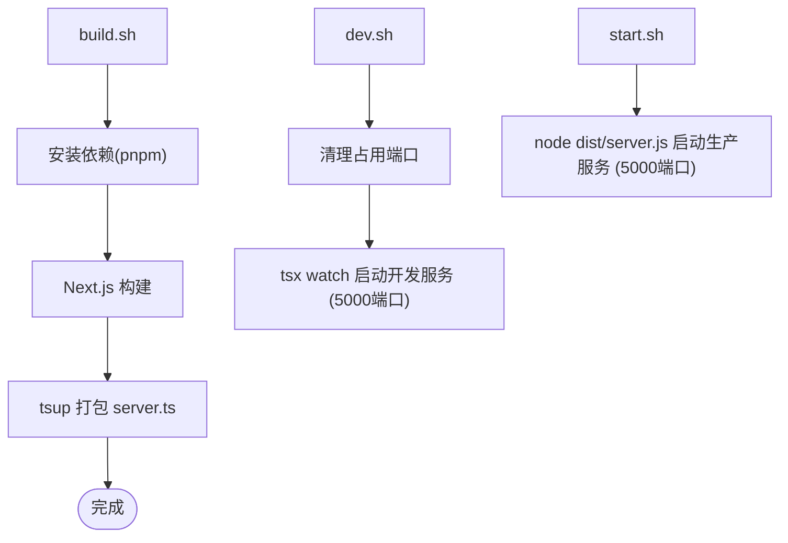
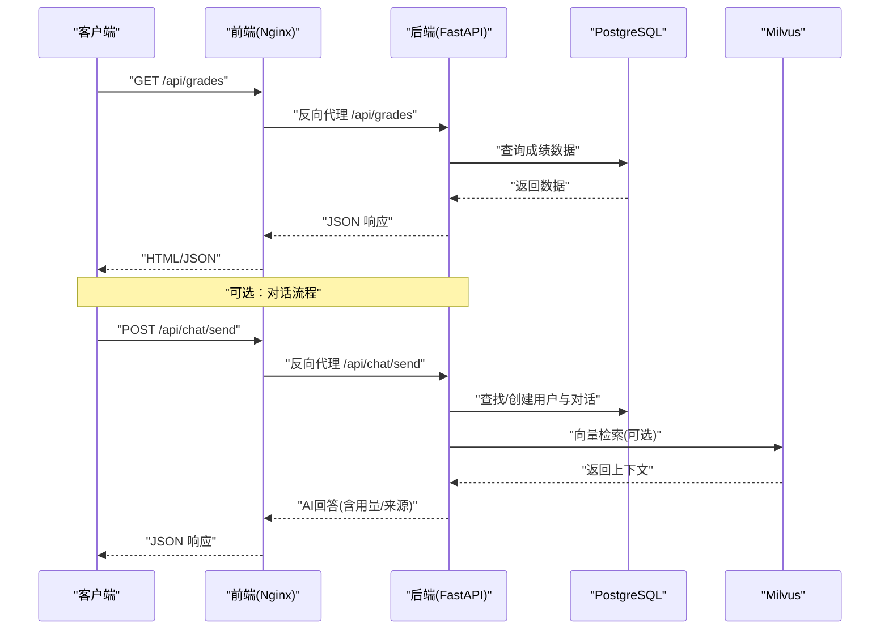
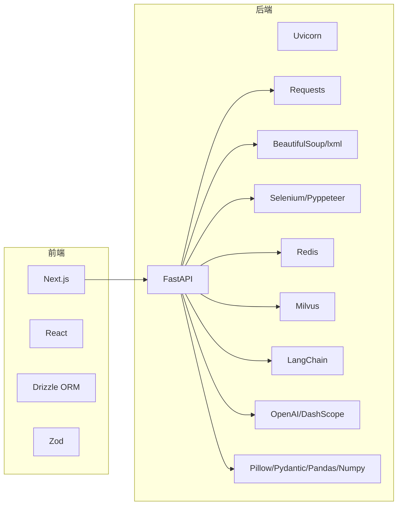

# 构建与部署

<cite>
**本文引用的文件**
- [docker-compose.yml](file://docker-compose.yml)
- [backend/Dockerfile](file://backend/Dockerfile)
- [frontend/Dockerfile](file://frontend/Dockerfile)
- [frontend/Dockerfile.dev](file://frontend/Dockerfile.dev)
- [scripts/build.sh](file://scripts/build.sh)
- [scripts/dev.sh](file://scripts/dev.sh)
- [scripts/prepare.sh](file://scripts/prepare.sh)
- [scripts/start.sh](file://scripts/start.sh)
- [package.json](file://package.json)
- [backend/main.py](file://backend/main.py)
- [backend/app/api/chat.py](file://backend/app/api/chat.py)
- [backend/app/models/base.py](file://backend/app/models/base.py)
- [backend/requirements.txt](file://backend/requirements.txt)
- [frontend/nginx.conf](file://frontend/nginx.conf)
- [next.config.ts](file://next.config.ts)
- [tsconfig.json](file://tsconfig.json)
- [frontend/src/app/login/page.tsx](file://frontend/src/app/login/page.tsx)
- [frontend/src/app/chat/page.tsx](file://frontend/src/app/chat/page.tsx)
</cite>

## 更新摘要
**所做变更**
- 新增前端Dockerfile开发模式支持热重载和实时代码同步
- 更新Docker Compose配置以支持开发模式下的文件挂载和热重载
- 完善前端开发体验，支持实时代码同步和文件监听
- 优化前后端Dockerfile构建流程，提升开发效率

## 目录
1. [简介](#简介)
2. [项目结构](#项目结构)
3. [核心组件](#核心组件)
4. [架构总览](#架构总览)
5. [详细组件分析](#详细组件分析)
6. [依赖关系分析](#依赖关系分析)
7. [性能考虑](#性能考虑)
8. [故障排查指南](#故障排查指南)
9. [结论](#结论)
10. [附录](#附录)

## 简介
本指南面向智能教务系统AI助手的构建与部署，覆盖以下主题：
- 前端构建与打包（Next.js + Nginx反向代理）
- 后端Python应用打包与运行
- Docker镜像构建与Compose服务编排
- 自动化脚本使用（开发、生产、环境准备）
- 环境变量、数据库初始化与依赖安装流程
- 持续集成/持续部署建议
- 部署监控与日志管理最佳实践

## 项目结构
该项目采用前后端分离架构，使用Docker Compose进行多服务编排，包含数据库、缓存、对象存储、向量数据库与Milvus、以及前端Next.js与后端FastAPI服务。

**图表来源**
- [docker-compose.yml:1-167](file://docker-compose.yml#L1-L167)
- [backend/Dockerfile:1-18](file://backend/Dockerfile#L1-L18)
- [frontend/Dockerfile:1-28](file://frontend/Dockerfile#L1-L28)
- [frontend/Dockerfile.dev:1-26](file://frontend/Dockerfile.dev#L1-L26)
- [backend/main.py:1-1060](file://backend/main.py#L1-L1060)
- [backend/requirements.txt:1-51](file://backend/requirements.txt#L1-L51)
- [frontend/nginx.conf:1-31](file://frontend/nginx.conf#L1-L31)
- [next.config.ts:1-19](file://next.config.ts#L1-L19)
- [tsconfig.json:1-35](file://tsconfig.json#L1-L35)

**章节来源**
- [docker-compose.yml:1-167](file://docker-compose.yml#L1-L167)
- [backend/Dockerfile:1-18](file://backend/Dockerfile#L1-L18)
- [frontend/Dockerfile:1-28](file://frontend/Dockerfile#L1-L28)
- [frontend/Dockerfile.dev:1-26](file://frontend/Dockerfile.dev#L1-L26)
- [package.json:1-92](file://package.json#L1-L92)

## 核心组件
- 前端（Next.js + Nginx反向代理）
  - 使用多阶段Dockerfile构建，第一阶段安装依赖并构建产物，第二阶段以Nginx提供静态资源与反向代理。
  - **新增**：Next.js配置中新增`rewrites()`函数，将`/api/:path*`转发到`http://backend:8000/api/:path*`。
  - **新增**：前端代码中使用相对路径`/api`，通过Nginx反向代理到后端服务。
  - **更新**：前端服务端口映射从3000:3000更改为5000:5000，避免与常用开发工具端口冲突。
  - **新增**：开发模式Dockerfile支持热重载和实时代码同步，通过文件挂载实现代码变更即时生效。
- 后端（FastAPI + Uvicorn）
  - Python应用通过Uvicorn在8000端口提供REST API；依赖通过requirements.txt管理。
  - 包含教务系统数据爬取、选项查询、AI对话（可选）等接口。
- 数据与中间件
  - PostgreSQL：持久化用户、会话、对话与教育数据。
  - Redis：缓存与会话存储（注释提示生产建议使用Redis）。
  - Milvus：向量数据库，配合RAG实现智能问答。
  - MinIO：对象存储，用于文件上传/下载。
  - etcd：分布式键值存储，Milvus依赖。
- 自动化脚本
  - build.sh：安装依赖、构建Next.js、打包服务端代码。
  - dev.sh：开发模式启动本地HTTP服务，使用5000端口。
  - start.sh：生产模式启动打包后的服务端，使用5000端口。
  - prepare.sh：仅安装依赖，不构建。

**章节来源**
- [frontend/Dockerfile:1-28](file://frontend/Dockerfile#L1-L28)
- [frontend/nginx.conf:1-31](file://frontend/nginx.conf#L1-L31)
- [frontend/Dockerfile.dev:1-26](file://frontend/Dockerfile.dev#L1-L26)
- [backend/Dockerfile:1-18](file://backend/Dockerfile#L1-L18)
- [backend/main.py:1-1060](file://backend/main.py#L1-L1060)
- [backend/requirements.txt:1-51](file://backend/requirements.txt#L1-L51)
- [scripts/build.sh:1-18](file://scripts/build.sh#L1-L18)
- [scripts/dev.sh:1-35](file://scripts/dev.sh#L1-L35)
- [scripts/start.sh:1-18](file://scripts/start.sh#L1-L18)
- [scripts/prepare.sh:1-10](file://scripts/prepare.sh#L1-L10)

## 架构总览
下图展示容器间通信、端口暴露与反向代理关系：

**更新**：前端服务端口从3000更改为5000，解决端口冲突问题

**图表来源**
- [docker-compose.yml:94-155](file://docker-compose.yml#L94-L155)
- [frontend/nginx.conf:12-23](file://frontend/nginx.conf#L12-L23)
- [backend/main.py:39-48](file://backend/main.py#L39-L48)

## 详细组件分析

### 前端构建与Docker镜像
- 多阶段构建
  - 第一阶段：安装pnpm并安装依赖，随后构建Next.js产物。
  - 第二阶段：基于Nginx，复制构建产物与Nginx配置，暴露3000端口。
- **新增**：Next.js反向代理配置
  - 在`next.config.ts`中配置`rewrites()`函数，将`/api/:path*`转发到`http://backend:8000/api/:path*`。
  - 前端代码中使用相对路径`/api`，通过Nginx反向代理到后端服务。
- **更新**：Docker Compose中前端服务端口映射为5000:5000，实际运行时通过Nginx 3000端口提供服务。
- **新增**：开发模式Dockerfile优化
  - 使用`frontend/Dockerfile.dev`作为开发模式镜像，支持热重载和实时代码同步。
  - 通过文件挂载实现代码变更即时生效，包括src、public、package.json等目录。
  - 配置`WATCHPACK_POLLING=true`环境变量支持文件监听。
  - 排除node_modules和.next目录，使用容器内的依赖以确保一致性。

**图表来源**
- [frontend/Dockerfile:1-28](file://frontend/Dockerfile#L1-L28)
- [frontend/nginx.conf:12-23](file://frontend/nginx.conf#L12-L23)
- [next.config.ts:18-26](file://next.config.ts#L18-L26)
- [docker-compose.yml:100-118](file://docker-compose.yml#L100-L118)

**章节来源**
- [frontend/Dockerfile:1-28](file://frontend/Dockerfile#L1-L28)
- [frontend/nginx.conf:1-31](file://frontend/nginx.conf#L1-L31)
- [frontend/Dockerfile.dev:1-26](file://frontend/Dockerfile.dev#L1-L26)
- [next.config.ts:1-19](file://next.config.ts#L1-L19)
- [tsconfig.json:1-35](file://tsconfig.json#L1-L35)

### 后端打包与运行
- Python环境与依赖
  - 基于python:3.11-slim镜像，使用阿里云pip镜像加速安装requirements.txt。
  - 暴露8000端口，使用Uvicorn启动main:app。
- 应用入口与路由
  - 主程序定义FastAPI实例、CORS策略、健康检查端点与各业务接口。
  - 可选启用对话API（当相关模块可用时）。
- 数据库连接
  - 通过环境变量拼接DATABASE_URL，默认指向PostgreSQL。

**图表来源**
- [backend/Dockerfile:1-18](file://backend/Dockerfile#L1-L18)
- [backend/main.py:39-48](file://backend/main.py#L39-L48)

**章节来源**
- [backend/Dockerfile:1-18](file://backend/Dockerfile#L1-L18)
- [backend/main.py:1-1060](file://backend/main.py#L1-L1060)
- [backend/app/models/base.py:10-14](file://backend/app/models/base.py#L10-L14)
- [backend/requirements.txt:1-51](file://backend/requirements.txt#L1-L51)

### Docker Compose服务编排
- 服务与端口映射
  - postgres:5432, redis:6379, etcd:2379, minio:9000/9001, milvus:19530/9091, **frontend:5000**, backend:8000。
  - **更新**：前端服务端口映射从3000:3000更改为5000:5000，避免端口冲突。
- 健康检查
  - postgres、redis、etcd、minio、milvus均配置健康检查，确保服务可用性。
- 网络与数据卷
  - 统一网络名称，各服务挂载独立命名卷，保障数据持久化。
- **新增**：环境变量配置
  - 后端通过环境变量注入数据库、缓存、向量库、AI模型等配置。
  - 前端通过NEXT_PUBLIC_API_URL指定API前缀为`/api`。
  - **新增**：开发模式环境变量配置
    - WATCHPACK_POLLING=true：支持文件监听和热重载。
    - 文件挂载：将src、public、package.json等目录挂载到容器中，实现代码实时同步。

**更新**：前端服务端口映射为5000:5000，新增API前缀配置和开发模式环境变量

**图表来源**
- [docker-compose.yml:1-167](file://docker-compose.yml#L1-L167)

**章节来源**
- [docker-compose.yml:1-167](file://docker-compose.yml#L1-L167)

### 自动化脚本使用
- build.sh
  - 在COZE_WORKSPACE_PATH目录下安装依赖、构建Next.js、使用tsup打包服务端代码。
- dev.sh
  - 清理冲突端口后，使用tsx watch启动本地开发服务。
  - **更新**：使用5000端口，避免与常用开发工具冲突。
- start.sh
  - 在COZE_WORKSPACE_PATH目录下，使用Node启动dist/server.js。
  - **更新**：使用5000端口，与Docker Compose配置保持一致。
- prepare.sh
  - 仅安装依赖，适合只更新依赖而无需重新构建的场景。

**更新**：所有脚本现在使用5000端口

**图表来源**
- [scripts/build.sh:1-18](file://scripts/build.sh#L1-L18)
- [scripts/dev.sh:1-35](file://scripts/dev.sh#L1-L35)
- [scripts/start.sh:1-18](file://scripts/start.sh#L1-L18)
- [scripts/prepare.sh:1-10](file://scripts/prepare.sh#L1-L10)

**章节来源**
- [scripts/build.sh:1-18](file://scripts/build.sh#L1-L18)
- [scripts/dev.sh:1-35](file://scripts/dev.sh#L1-L35)
- [scripts/start.sh:1-18](file://scripts/start.sh#L1-L18)
- [scripts/prepare.sh:1-10](file://scripts/prepare.sh#L1-L10)

### 环境变量与数据库初始化
- 环境变量（后端）
  - 数据库：POSTGRES_HOST、POSTGRES_PORT、POSTGRES_USER、POSTGRES_PASSWORD、POSTGRES_DB。
  - 缓存：REDIS_HOST、REDIS_PORT。
  - 向量库：MILVUS_HOST、MILVUS_PORT。
  - AI模型：QWEN_API_KEY、QWEN_MODEL、EDUCATION_SYSTEM_URL、JWT_SECRET_KEY。
  - CORS：CORS_ORIGINS。
  - **更新**：CORS_ORIGINS设置为["http://localhost:3000"]，与前端默认端口保持一致。
- **新增**：前端环境变量
  - NEXT_PUBLIC_API_URL：设置为`/api`，用于配置API前缀。
  - **新增**：开发模式环境变量
    - WATCHPACK_POLLING=true：启用文件监听，支持热重载。
- 数据库初始化
  - 使用PostgreSQL容器，首次启动会创建数据库与默认用户；如需初始化迁移，可在后端容器内执行ORM迁移脚本（例如通过自定义entrypoint或在CI中执行）。
- 依赖安装
  - 前端：pnpm install。
  - 后端：pip安装requirements.txt。

**章节来源**
- [docker-compose.yml:113-155](file://docker-compose.yml#L113-L155)
- [backend/app/models/base.py:10-14](file://backend/app/models/base.py#L10-L14)
- [backend/requirements.txt:1-51](file://backend/requirements.txt#L1-L51)
- [package.json:1-92](file://package.json#L1-L92)

### API与对话流程（后端）
- 路由与功能
  - 健康检查、验证码、登录、个人信息、成绩、课表、培养方案、学业进度、考试安排、教师/课程查询、选课与执行计划、聚合数据导出等。
  - 可选启用对话API：发送消息、获取对话列表、获取历史、删除对话。
- 对话流程（RAG）
  - 用户消息写入数据库并生成上下文。
  - 若存在用户教育数据，调用嵌入模型生成向量并在向量库检索相似片段。
  - 将上下文与历史消息合并，调用AI模型生成回答并记录用量与来源。

**图表来源**
- [frontend/nginx.conf:12-23](file://frontend/nginx.conf#L12-L23)
- [backend/main.py:398-452](file://backend/main.py#L398-L452)
- [backend/app/api/chat.py:45-147](file://backend/app/api/chat.py#L45-L147)

**章节来源**
- [backend/main.py:95-123](file://backend/main.py#L95-L123)
- [backend/app/api/chat.py:45-147](file://backend/app/api/chat.py#L45-L147)

## 依赖关系分析
- 前端
  - Next.js、React、TailwindCSS、AWS SDK、Drizzle ORM、Zod等。
- 后端
  - FastAPI、Uvicorn、Requests、BeautifulSoup、Selenium/Pyppeteer、Redis、Milvus、LangChain、OpenAI/DashScope、Pillow、Pydantic、Pandas/Numpy等。
- Compose依赖
  - 各服务之间通过内部DNS与端口通信，Milvus依赖etcd与MinIO。

**图表来源**
- [package.json:12-68](file://package.json#L12-L68)
- [backend/requirements.txt:1-51](file://backend/requirements.txt#L1-L51)

**章节来源**
- [package.json:1-92](file://package.json#L1-L92)
- [backend/requirements.txt:1-51](file://backend/requirements.txt#L1-L51)

## 性能考虑
- 前端
  - 使用Nginx作为静态资源服务器，减少Next服务压力；合理配置缓存与Gzip。
  - 构建时避免不必要的依赖，控制包体积。
  - **新增**：Next.js反向代理配置减少了跨域问题，提高了API调用效率。
  - **更新**：使用5000端口减少与其他开发工具的端口冲突，提高开发效率。
  - **新增**：开发模式下的文件挂载机制支持热重载，提升开发体验。
- 后端
  - 使用Uvicorn异步运行，结合限流与超时设置。
  - Milvus检索建议设置合适的top_k与过滤条件，避免全量扫描。
  - Redis缓存热点数据，降低数据库压力。
- 容器
  - 为各服务设置合理的内存与CPU限制，避免资源争抢。
  - 使用健康检查与重启策略，提升可用性。

## 故障排查指南
- 健康检查失败
  - 检查compose中各服务的健康检查命令与端口映射是否正确。
- CORS跨域问题
  - 生产环境需限制CORS_ORIGINS，避免使用通配符。
  - **更新**：确保CORS_ORIGINS设置为["http://localhost:3000"]以匹配前端端口。
- 数据库连接失败
  - 确认DATABASE_URL拼接正确，PostgreSQL容器已就绪。
- Milvus无法启动
  - 检查etcd与MinIO是否健康，确认环境变量ETCD_ENDPOINTS与MINIO_ADDRESS。
- **新增**：Nginx反代无效
  - 确认`/api`前缀匹配与backend容器名一致，端口映射正确。
  - 检查`next.config.ts`中的`rewrites()`配置是否正确。
- **新增**：API调用失败
  - 确认前端`API_BASE`变量为空字符串，使用相对路径。
  - 检查Docker Compose中`NEXT_PUBLIC_API_URL`是否设置为`/api`。
- **新增**：端口冲突问题
  - 如果5000端口被占用，使用dev.sh脚本会自动清理占用进程。
  - 检查系统中是否有其他服务占用了5000端口。
- **新增**：开发模式热重载问题
  - 确认Docker Compose中使用的是`frontend/Dockerfile.dev`而非`frontend/Dockerfile`。
  - 检查`WATCHPACK_POLLING=true`环境变量是否正确设置。
  - 验证文件挂载是否正常，确保src、public等目录已正确挂载。

**章节来源**
- [docker-compose.yml:14-18](file://docker-compose.yml#L14-L18)
- [docker-compose.yml:47-51](file://docker-compose.yml#L47-L51)
- [docker-compose.yml:66-70](file://docker-compose.yml#L66-L70)
- [docker-compose.yml:88-92](file://docker-compose.yml#L88-L92)
- [frontend/nginx.conf:12-23](file://frontend/nginx.conf#L12-L23)
- [backend/app/models/base.py:10-14](file://backend/app/models/base.py#L10-L14)
- [scripts/dev.sh:12-28](file://scripts/dev.sh#L12-L28)
- [next.config.ts:18-26](file://next.config.ts#L18-L26)

## 结论
本指南提供了从本地开发到生产部署的完整路径：前端Next.js与Nginx镜像、后端FastAPI与Uvicorn、以及Docker Compose多服务编排。通过脚本化构建与环境变量配置，可快速完成开发与生产部署。

**更新**：最新的版本解决了端口冲突问题，将前端服务端口从3000更改为5000，显著改善了开发环境的可用性。**新增**：通过Next.js反向代理配置，实现了更清晰的API路由和部署能力，前端代码使用相对路径`/api`，通过Nginx反向代理到后端服务。**新增**：前端Dockerfile优化支持热重载和实时代码同步，通过文件挂载实现开发模式下的高效开发体验。建议在生产环境中完善CORS策略、数据库迁移、日志与监控体系，并结合CI/CD实现自动化发布。

## 附录

### 构建与部署步骤清单
- 准备环境
  - 安装Docker与Docker Compose。
  - 设置环境变量（见"环境变量与数据库初始化"）。
- 本地开发
  - 运行脚本：prepare.sh安装依赖，dev.sh启动开发服务。
  - **更新**：开发服务将在http://localhost:5000访问，避免端口冲突。
  - **新增**：开发模式使用`frontend/Dockerfile.dev`，支持热重载和实时代码同步。
- 本地构建
  - 运行脚本：build.sh完成前端构建与服务端打包。
- 生产部署
  - 使用docker-compose up -d启动所有服务。
  - 如需单独构建镜像，分别在frontend与backend目录执行构建。
- 数据库初始化
  - 首次启动后，如需ORM迁移，可在后端容器内执行相应脚本（建议通过entrypoint或CI任务执行）。
- 监控与日志
  - 使用Docker日志查看器收集容器日志；对关键服务配置健康检查与告警。
- **新增**：端口配置说明
  - 前端：容器内Nginx监听3000端口，Docker Compose映射到5000端口。
  - 后端：容器内Uvicorn监听8000端口，Docker Compose映射到8000端口。
  - 开发脚本：dev.sh和start.sh均使用5000端口。
- **新增**：API路由配置
  - 前端：使用相对路径`/api`，通过Nginx反向代理到后端。
  - 后端：Next.js配置中`rewrites()`函数处理API路由转发。
  - 环境变量：NEXT_PUBLIC_API_URL设置为`/api`。
- **新增**：开发模式配置
  - 使用`frontend/Dockerfile.dev`作为开发模式镜像。
  - 配置`WATCHPACK_POLLING=true`环境变量支持文件监听。
  - 通过文件挂载实现代码实时同步，包括src、public、package.json等目录。
  - 排除node_modules和.next目录，使用容器内的依赖。

**章节来源**
- [scripts/prepare.sh:1-10](file://scripts/prepare.sh#L1-L10)
- [scripts/dev.sh:1-35](file://scripts/dev.sh#L1-L35)
- [scripts/build.sh:1-18](file://scripts/build.sh#L1-L18)
- [scripts/start.sh:1-18](file://scripts/start.sh#L1-L18)
- [docker-compose.yml:1-167](file://docker-compose.yml#L1-L167)
- [next.config.ts:18-26](file://next.config.ts#L18-L26)