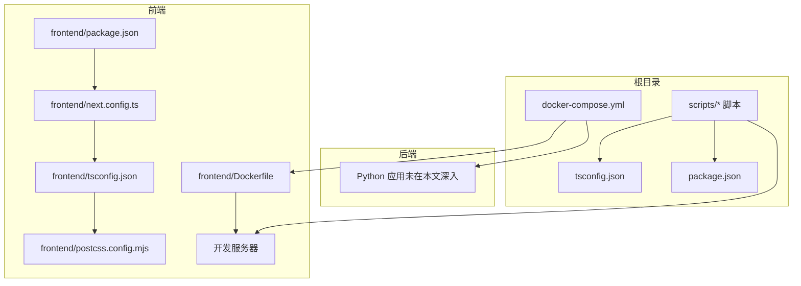
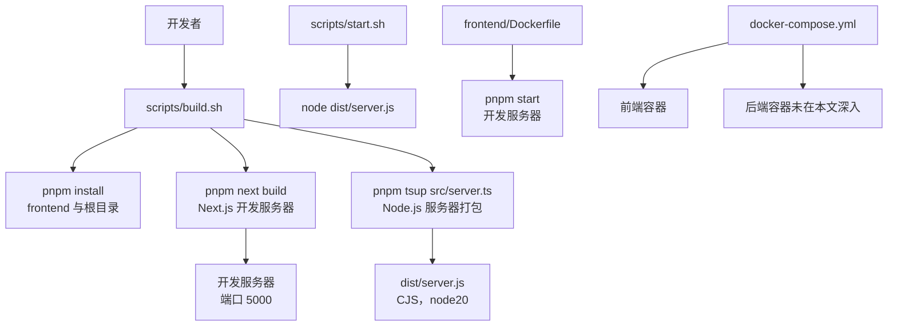
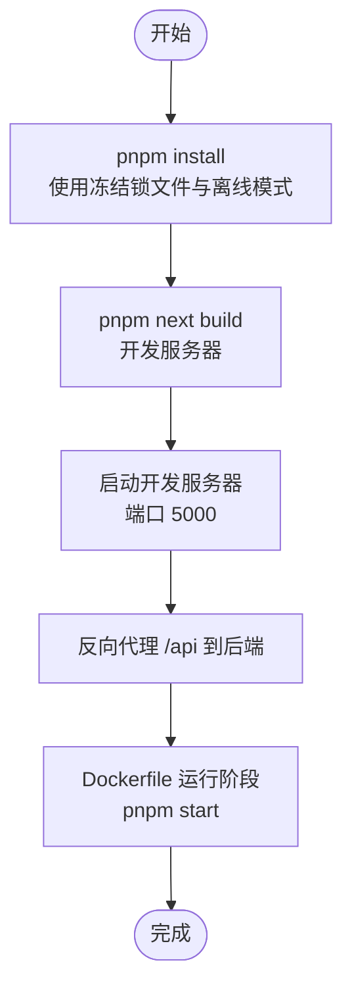
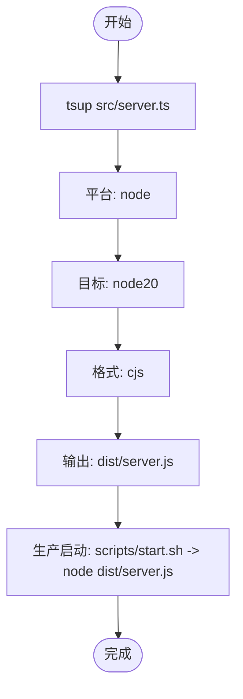
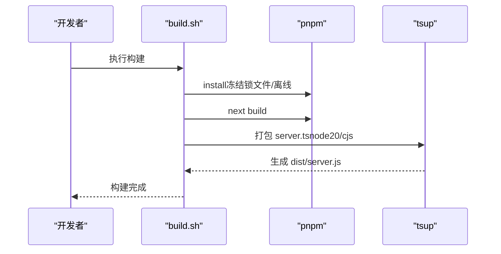
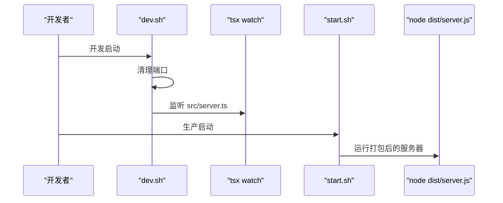
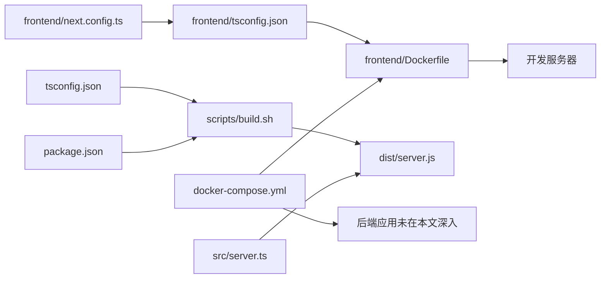

# 构建流程

<cite>
**本文引用的文件**
- [scripts/build.sh](file://scripts/build.sh)
- [scripts/start.sh](file://scripts/start.sh)
- [scripts/dev.sh](file://scripts/dev.sh)
- [frontend/package.json](file://frontend/package.json)
- [frontend/next.config.ts](file://frontend/next.config.ts)
- [frontend/tsconfig.json](file://frontend/tsconfig.json)
- [frontend/Dockerfile](file://frontend/Dockerfile)
- [frontend/postcss.config.mjs](file://frontend/postcss.config.mjs)
- [src/server.ts](file://src/server.ts)
- [tsconfig.json](file://tsconfig.json)
- [package.json](file://package.json)
- [docker-compose.yml](file://docker-compose.yml)
- [next.config.ts](file://next.config.ts)
</cite>

## 更新摘要
**变更内容**
- 移除了Next.js静态导出相关的distDir配置说明
- 更新了TypeScript增量编译配置的描述，强调了incremental和tsBuildInfoFile的作用
- 简化了构建流程说明，反映了当前的开发模式配置

## 目录
1. [简介](#简介)
2. [项目结构](#项目结构)
3. [核心组件](#核心组件)
4. [架构总览](#架构总览)
5. [详细组件分析](#详细组件分析)
6. [依赖关系分析](#依赖关系分析)
7. [性能考虑](#性能考虑)
8. [故障排除指南](#故障排除指南)
9. [结论](#结论)
10. [附录](#附录)

## 简介
本文件面向智能教务系统 AI 助手的构建与部署流程，覆盖以下方面：
- 前端 Next.js 项目的构建：依赖安装、TypeScript 编译、开发服务器启动与反向代理配置。
- 后端 server.ts 的打包：tsup 配置、Node.js 目标版本与输出格式。
- 构建脚本 build.sh 的工作原理：环境变量、错误处理与构建步骤。
- 本地构建完整指南：前置条件、命令执行与产物验证。
- 构建优化策略：代码分割、Tree Shaking、压缩与缓存。
- 故障排除：常见构建错误与解决方案。

## 项目结构
该仓库采用前后端分离与多容器编排的结构：
- 前端目录 frontend：包含 Next.js 应用、构建配置与 Dockerfile。
- 后端目录 backend：包含 Python 服务（未在本文深入），但与前端通过 API 协作。
- 根目录 scripts：提供构建、开发与启动脚本。
- 根目录 src：包含 Node.js 服务器入口 server.ts，用于在生产环境以 HTTP 服务方式运行 Next.js 静态导出产物。
- docker-compose.yml：定义数据库、缓存与 Milvus 等基础设施服务，以及前端/后端容器。

**章节来源**
- [frontend/package.json:1-92](file://frontend/package.json#L1-L92)
- [frontend/next.config.ts:1-43](file://frontend/next.config.ts#L1-L43)
- [frontend/tsconfig.json:1-36](file://frontend/tsconfig.json#L1-L36)
- [frontend/Dockerfile:1-21](file://frontend/Dockerfile#L1-L21)
- [frontend/postcss.config.mjs:1-8](file://frontend/postcss.config.mjs#L1-L8)
- [tsconfig.json:1-35](file://tsconfig.json#L1-L35)
- [package.json:1-92](file://package.json#L1-L92)
- [scripts/build.sh:1-18](file://scripts/build.sh#L1-L18)
- [scripts/start.sh:1-18](file://scripts/start.sh#L1-L18)
- [scripts/dev.sh:1-35](file://scripts/dev.sh#L1-L35)
- [docker-compose.yml:1-148](file://docker-compose.yml#L1-L148)

## 核心组件
- 前端 Next.js 构建链路
  - 依赖管理：使用 pnpm，锁定文件为 pnpm-lock.yaml。
  - TypeScript 编译：遵循 frontend/tsconfig.json 与根 tsconfig.json 的编译选项，启用增量编译。
  - 开发服务器：next.config.ts 配置开发服务器，支持反向代理到后端服务。
  - 反向代理：将 /api 请求转发到 backend:8000，支持多域名开发环境。
  - 样式与 PostCSS：使用 Tailwind PostCSS 插件。
  - Docker 化：前端 Dockerfile 在构建阶段执行 pnpm build，运行阶段使用 pnpm start 启动开发服务器。
- 后端 Node.js 服务器
  - 入口：src/server.ts，基于 http 与 Next.js 的 getRequestHandler，支持开发/生产模式切换。
  - 打包：使用 tsup 对 server.ts 进行打包，目标平台为 Node.js，目标版本为 node20，输出格式为 CJS。
- 构建脚本
  - build.sh：统一安装依赖、构建 Next.js、打包 server.ts 并输出 dist。
  - dev.sh：开发时清理端口占用，使用 tsx watch 监听 server.ts 变更。
  - start.sh：生产启动，通过 node 运行 dist/server.js。

**章节来源**
- [frontend/package.json:1-92](file://frontend/package.json#L1-L92)
- [frontend/next.config.ts:1-43](file://frontend/next.config.ts#L1-L43)
- [frontend/tsconfig.json:1-36](file://frontend/tsconfig.json#L1-L36)
- [frontend/Dockerfile:1-21](file://frontend/Dockerfile#L1-L21)
- [frontend/postcss.config.mjs:1-8](file://frontend/postcss.config.mjs#L1-L8)
- [src/server.ts:1-36](file://src/server.ts#L1-L36)
- [scripts/build.sh:1-18](file://scripts/build.sh#L1-L18)
- [scripts/dev.sh:1-35](file://scripts/dev.sh#L1-L35)
- [scripts/start.sh:1-18](file://scripts/start.sh#L1-L18)

## 架构总览
下图展示从源码到可部署产物的关键路径与工具链：

**图表来源**
- [scripts/build.sh:1-18](file://scripts/build.sh#L1-L18)
- [frontend/package.json:1-92](file://frontend/package.json#L1-L92)
- [frontend/next.config.ts:1-43](file://frontend/next.config.ts#L1-L43)
- [src/server.ts:1-36](file://src/server.ts#L1-L36)
- [scripts/start.sh:1-18](file://scripts/start.sh#L1-L18)
- [frontend/Dockerfile:1-21](file://frontend/Dockerfile#L1-L21)
- [docker-compose.yml:1-148](file://docker-compose.yml#L1-L148)

## 详细组件分析

### 前端 Next.js 构建流程
- 依赖安装
  - 使用 pnpm，优先使用冻结锁文件与离线模式，日志级别为 debug。
- TypeScript 编译
  - 采用严格模式与隔离模块，模块解析策略为 bundler，目标 ES2017。
  - 启用增量编译：`incremental: true` 和 `tsBuildInfoFile` 配置，提升编译性能。
- 开发服务器配置
  - 支持多域名开发环境：allowedDevOrigins 包含多个开发域名和IP地址。
  - 反向代理：将 /api 请求转发到后端服务 `http://backend:8000/api/:path*`。
  - 图片配置：允许 HTTPS 远程图片，支持通配符主机名。
- Docker 化
  - 构建阶段：复制 package.json 与锁文件，安装依赖，复制源码并执行 pnpm build。
  - 运行阶段：使用 pnpm start 启动开发服务器，监听 5000 端口。

**图表来源**
- [scripts/build.sh:8-12](file://scripts/build.sh#L8-L12)
- [frontend/next.config.ts:6-40](file://frontend/next.config.ts#L6-L40)
- [frontend/Dockerfile:16-21](file://frontend/Dockerfile#L16-L21)

**章节来源**
- [scripts/build.sh:8-12](file://scripts/build.sh#L8-L12)
- [frontend/next.config.ts:1-43](file://frontend/next.config.ts#L1-L43)
- [frontend/tsconfig.json:1-36](file://frontend/tsconfig.json#L1-L36)
- [frontend/postcss.config.mjs:1-8](file://frontend/postcss.config.mjs#L1-L8)
- [frontend/Dockerfile:1-21](file://frontend/Dockerfile#L1-L21)

### 后端 server.ts 打包流程
- 目标与输出
  - 平台：node
  - 目标版本：node20
  - 输出格式：cjs
  - 输出目录：dist
  - 关闭拆分与最小化：便于直接运行与调试。
- 运行时行为
  - 读取 HOSTNAME、PORT 环境变量，开发模式由 COZE_PROJECT_ENV 控制。
  - 使用 Next.js 的 getRequestHandler 处理请求，异常时返回 500。

**图表来源**
- [scripts/build.sh:14-15](file://scripts/build.sh#L14-L15)
- [src/server.ts:1-36](file://src/server.ts#L1-L36)
- [scripts/start.sh:10-17](file://scripts/start.sh#L10-L17)

**章节来源**
- [scripts/build.sh:14-15](file://scripts/build.sh#L14-L15)
- [src/server.ts:1-36](file://src/server.ts#L1-L36)
- [scripts/start.sh:1-18](file://scripts/start.sh#L1-L18)

### 构建脚本 build.sh 工作原理
- 错误处理
  - set -Eeuo pipefail：启用扩展错误处理，任何子命令失败即退出。
- 环境变量
  - COZE_WORKSPACE_PATH：默认当前工作目录，作为构建上下文。
- 步骤
  - 安装依赖：pnpm install --prefer-frozen-lockfile --prefer-offline --loglevel debug --reporter=append-only
  - 构建 Next.js：pnpm next build
  - 打包 server.ts：pnpm tsup src/server.ts --format cjs --platform node --target node20 --outDir dist --no-splitting --no-minify
  - 成功提示：Build completed successfully!

**图表来源**
- [scripts/build.sh:1-18](file://scripts/build.sh#L1-L18)

**章节来源**
- [scripts/build.sh:1-18](file://scripts/build.sh#L1-L18)

### 开发与启动脚本
- dev.sh
  - 清理占用端口（默认 5000），使用 tsx watch 监听 src/server.ts 变更并热重载。
- start.sh
  - 设置 DEPLOY_RUN_PORT（默认 5000），通过 node 运行 dist/server.js 提供服务。

**图表来源**
- [scripts/dev.sh:10-35](file://scripts/dev.sh#L10-L35)
- [scripts/start.sh:10-17](file://scripts/start.sh#L10-L17)

**章节来源**
- [scripts/dev.sh:1-35](file://scripts/dev.sh#L1-L35)
- [scripts/start.sh:1-18](file://scripts/start.sh#L1-L18)

### 本地构建完整指南
- 前置条件
  - Node.js 版本要求：根 package.json 与 frontend/package.json 均声明 Node >= 18。
  - 包管理器：pnpm（frontend/Dockerfile 与 scripts 中均使用 pnpm）。
  - 环境变量（可选）：COZE_WORKSPACE_PATH、HOSTNAME、PORT、DEPLOY_RUN_PORT。
- 执行步骤
  - 进入项目根目录，执行 scripts/build.sh 完成依赖安装与 Next.js 构建。
  - 产物位置：
    - 开发服务器：端口 5000
    - Node.js 服务器：dist/server.js
- 产物验证
  - 开发服务器：访问 http://localhost:5000 查看应用。
  - 服务器：确认 dist/server.js 存在且可被 node 正常启动。

**章节来源**
- [package.json:87-90](file://package.json#L87-L90)
- [frontend/package.json:87-90](file://frontend/package.json#L87-L90)
- [scripts/build.sh:1-18](file://scripts/build.sh#L1-L18)
- [frontend/Dockerfile:16-21](file://frontend/Dockerfile#L16-L21)
- [scripts/start.sh:1-18](file://scripts/start.sh#L1-L18)

## 依赖关系分析
- 前端
  - next.config.ts 配置开发服务器、反向代理与图片远程模式。
  - tsconfig.json 与根 tsconfig.json 共同约束编译选项，启用增量编译。
  - Dockerfile 依赖 pnpm 与 Node.js 20。
- 后端
  - server.ts 依赖 http、url 与 next，运行时读取环境变量。
- 根目录
  - scripts 依赖 pnpm 与 tsup。
  - docker-compose.yml 定义前端/后端容器与依赖服务。

**图表来源**
- [frontend/next.config.ts:1-43](file://frontend/next.config.ts#L1-L43)
- [frontend/tsconfig.json:1-36](file://frontend/tsconfig.json#L1-L36)
- [frontend/Dockerfile:1-21](file://frontend/Dockerfile#L1-L21)
- [tsconfig.json:1-35](file://tsconfig.json#L1-L35)
- [package.json:1-92](file://package.json#L1-L92)
- [scripts/build.sh:1-18](file://scripts/build.sh#L1-L18)
- [src/server.ts:1-36](file://src/server.ts#L1-L36)
- [docker-compose.yml:1-148](file://docker-compose.yml#L1-L148)

**章节来源**
- [frontend/next.config.ts:1-43](file://frontend/next.config.ts#L1-L43)
- [frontend/tsconfig.json:1-36](file://frontend/tsconfig.json#L1-L36)
- [frontend/Dockerfile:1-21](file://frontend/Dockerfile#L1-L21)
- [tsconfig.json:1-35](file://tsconfig.json#L1-L35)
- [package.json:1-92](file://package.json#L1-L92)
- [scripts/build.sh:1-18](file://scripts/build.sh#L1-L18)
- [src/server.ts:1-36](file://src/server.ts#L1-L36)
- [docker-compose.yml:1-148](file://docker-compose.yml#L1-L148)

## 性能考虑
- 增量编译优化
  - TypeScript 配置启用 `incremental: true` 和 `tsBuildInfoFile`，显著提升编译速度。
  - 缓存文件 `.next/cache/tsconfig.tsbuildinfo` 存储编译状态。
- 开发服务器性能
  - Next.js 开发服务器支持热重载和快速响应。
  - 反向代理减少跨域问题，提升开发体验。
- 缓存与增量编译
  - TypeScript 配置启用增量编译；pnpm 使用锁定文件提升安装稳定性。
- 静态资源优化
  - Next.js 图片优化与远程图片支持。

**章节来源**
- [frontend/tsconfig.json:15-16](file://frontend/tsconfig.json#L15-L16)
- [tsconfig.json:15](file://tsconfig.json#L15)
- [frontend/next.config.ts:22-30](file://frontend/next.config.ts#L22-L30)

## 故障排除指南
- Node 版本不满足要求
  - 症状：pnpm install 或 tsup 报错。
  - 解决：升级 Node 至 >= 18（根与前端 package.json 均有要求）。
- 端口占用导致启动失败
  - 症状：开发或生产启动时报端口冲突。
  - 解决：使用 scripts/dev.sh 内置的端口清理逻辑，或手动释放端口。
- 构建失败（pnpm install）
  - 症状：网络超时或镜像源问题。
  - 解决：确保网络可用，必要时配置 npm/pnpm 镜像源；使用 --prefer-offline 与冻结锁文件。
- Next.js 开发服务器启动失败
  - 症状：开发服务器无法启动或端口被占用。
  - 解决：检查端口配置，确保端口 5000 未被占用；验证反向代理配置。
- server.ts 打包失败
  - 症状：tsup 报错或运行时报模块找不到。
  - 解决：确认 tsup 配置与 Node 目标版本一致；确保 dist/server.js 生成成功。
- 生产启动失败
  - 症状：node dist/server.js 报错。
  - 解决：检查环境变量（HOSTNAME、PORT）、依赖安装与打包产物完整性。

**章节来源**
- [package.json:87-90](file://package.json#L87-L90)
- [frontend/package.json:87-90](file://frontend/package.json#L87-L90)
- [scripts/dev.sh:12-28](file://scripts/dev.sh#L12-L28)
- [frontend/next.config.ts:6-40](file://frontend/next.config.ts#L6-L40)
- [scripts/build.sh:14-15](file://scripts/build.sh#L14-L15)
- [scripts/start.sh:10-17](file://scripts/start.sh#L10-L17)

## 结论
本构建流程围绕"Next.js 开发服务器 + Node.js 服务器 + Docker 容器化"的现代开发模式展开。通过统一的构建脚本与明确的环境变量约定，能够稳定地产出可部署的开发服务器与服务器产物。当前配置支持多域名开发环境和反向代理，提升了开发效率和用户体验。

## 附录
- 关键配置要点
  - 前端：next.config.ts 的开发服务器配置、反向代理与图片配置；tsconfig.json 的增量编译配置；Dockerfile 的多阶段构建。
  - 后端：tsup 的 --platform node、--target node20、--format cjs；server.ts 的环境变量读取与错误处理。
  - 根目录：scripts 的错误处理与环境变量；docker-compose.yml 的服务编排。