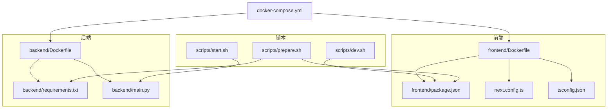
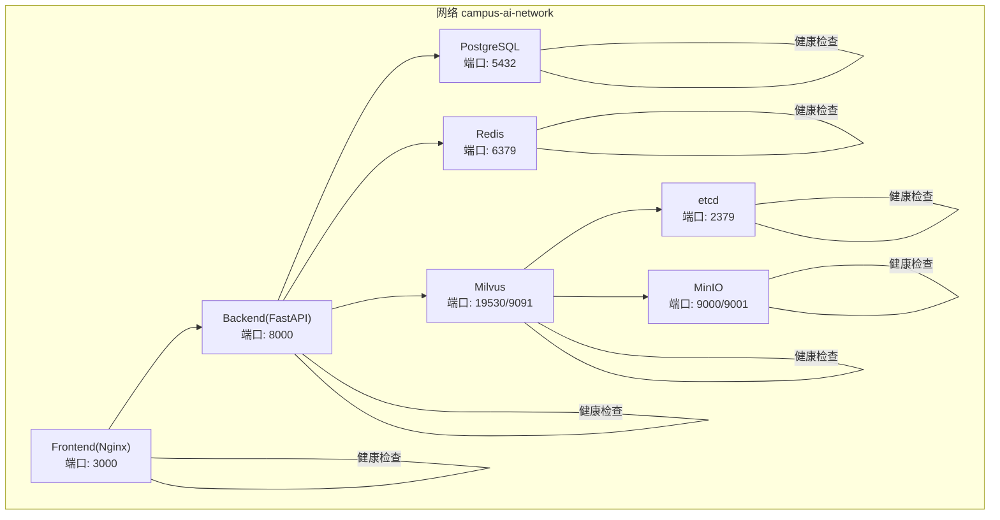
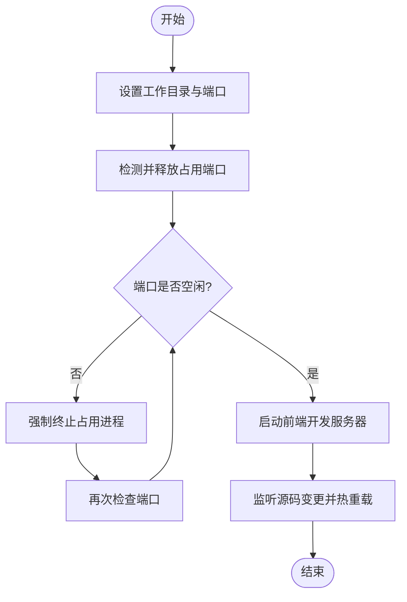
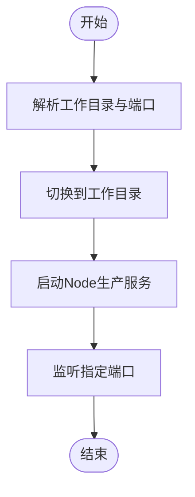
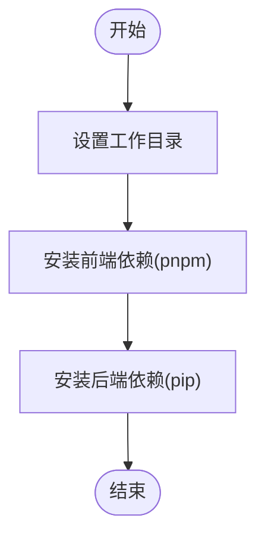
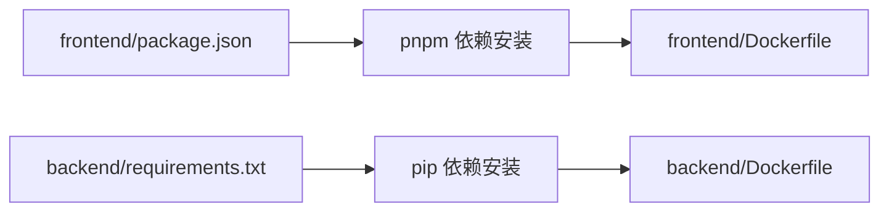

# 环境配置

<cite>
**本文引用的文件**
- [scripts/dev.sh](file://scripts/dev.sh)
- [scripts/start.sh](file://scripts/start.sh)
- [scripts/prepare.sh](file://scripts/prepare.sh)
- [package.json](file://package.json)
- [backend/requirements.txt](file://backend/requirements.txt)
- [docker-compose.yml](file://docker-compose.yml)
- [backend/Dockerfile](file://backend/Dockerfile)
- [frontend/Dockerfile](file://frontend/Dockerfile)
- [src/server.ts](file://src/server.ts)
- [backend/main.py](file://backend/main.py)
- [next.config.ts](file://next.config.ts)
- [tsconfig.json](file://tsconfig.json)
</cite>

## 目录
1. [简介](#简介)
2. [项目结构](#项目结构)
3. [核心组件](#核心组件)
4. [架构总览](#架构总览)
5. [详细组件分析](#详细组件分析)
6. [依赖分析](#依赖分析)
7. [性能考虑](#性能考虑)
8. [故障排查指南](#故障排查指南)
9. [结论](#结论)
10. [附录](#附录)

## 简介
本指南面向“智能教务系统AI助手”项目的环境配置与部署，覆盖开发环境搭建、脚本使用方法、生产启动流程、环境准备步骤以及多环境配置差异与最佳实践。文档同时提供可视化架构图与流程图，帮助开发者快速理解并正确配置各组件。

## 项目结构
项目采用前后端分离架构，前端基于Next.js，后端基于FastAPI，容器编排通过Docker Compose实现。关键目录与文件如下：
- scripts：开发与部署脚本（dev.sh、start.sh、prepare.sh）
- frontend：前端工程（Next.js + React）
- backend：后端工程（Python + FastAPI）
- docker-compose.yml：服务编排与健康检查
- 各自的Dockerfile与依赖清单

图表来源
- [frontend/Dockerfile:1-33](file://frontend/Dockerfile#L1-L33)
- [backend/Dockerfile:1-18](file://backend/Dockerfile#L1-L18)
- [docker-compose.yml:1-148](file://docker-compose.yml#L1-L148)

章节来源
- [package.json:1-92](file://package.json#L1-L92)
- [backend/requirements.txt:1-44](file://backend/requirements.txt#L1-L44)
- [docker-compose.yml:1-148](file://docker-compose.yml#L1-L148)

## 核心组件
- 开发脚本 dev.sh：负责清理端口占用、启动前端开发服务器（热重载），并支持通过环境变量控制工作目录与端口。
- 生产脚本 start.sh：负责在部署环境中启动Node.js服务（生产模式），支持通过环境变量指定运行端口。
- 准备脚本 prepare.sh：统一安装依赖（前端pnpm、后端pip），并以调试级别输出日志。
- 前端工程：Next.js应用，支持TypeScript与严格模式，端口默认5000。
- 后端工程：FastAPI应用，提供教务系统数据爬取与AI相关接口，容器内监听8000端口。
- 容器编排：Compose定义数据库（PostgreSQL）、缓存（Redis）、对象存储（MinIO）、键值存储（etcd）与向量数据库（Milvus），并为前后端服务提供网络与健康检查。

章节来源
- [scripts/dev.sh:1-35](file://scripts/dev.sh#L1-L35)
- [scripts/start.sh:1-18](file://scripts/start.sh#L1-L18)
- [scripts/prepare.sh:1-10](file://scripts/prepare.sh#L1-L10)
- [package.json:1-92](file://package.json#L1-L92)
- [backend/requirements.txt:1-44](file://backend/requirements.txt#L1-L44)
- [docker-compose.yml:1-148](file://docker-compose.yml#L1-L148)

## 架构总览
下图展示容器化环境中的服务关系、端口映射与健康检查策略：

图表来源
- [docker-compose.yml:1-148](file://docker-compose.yml#L1-L148)

章节来源
- [docker-compose.yml:1-148](file://docker-compose.yml#L1-L148)

## 详细组件分析

### 开发环境脚本：dev.sh
- 功能概述
  - 清理目标端口占用（默认5000），避免冲突
  - 在指定工作目录中启动前端开发服务器（热重载）
  - 支持通过环境变量 COZE_WORKSPACE_PATH 指定工作目录
- 关键行为
  - 端口检测与强制释放
  - 使用 tsx 监听源码变化并自动重启
- 使用建议
  - 本地开发时直接运行脚本，确保端口空闲
  - 如需自定义端口，可在调用前设置 DEPLOY_RUN_PORT 或 PORT

图表来源
- [scripts/dev.sh:1-35](file://scripts/dev.sh#L1-L35)

章节来源
- [scripts/dev.sh:1-35](file://scripts/dev.sh#L1-L35)
- [src/server.ts:1-36](file://src/server.ts#L1-L36)

### 生产环境脚本：start.sh
- 功能概述
  - 在部署环境中启动Node.js生产服务
  - 通过环境变量 DEPLOY_RUN_PORT 控制监听端口
- 关键行为
  - 切换至工作目录并启动 dist/server.js
  - 默认端口为5000，可通过环境变量覆盖
- 使用建议
  - 构建完成后运行该脚本
  - 结合进程管理器（如PM2、systemd）实现进程守护与自动重启

图表来源
- [scripts/start.sh:1-18](file://scripts/start.sh#L1-L18)
- [src/server.ts:1-36](file://src/server.ts#L1-L36)

章节来源
- [scripts/start.sh:1-18](file://scripts/start.sh#L1-L18)
- [src/server.ts:1-36](file://src/server.ts#L1-L36)

### 环境准备脚本：prepare.sh
- 功能概述
  - 统一安装前端与后端依赖
  - 前端使用 pnpm，后端使用 pip
  - 输出调试级别日志，便于问题定位
- 使用建议
  - 新环境首次启动或依赖变更后运行
  - 确保网络可访问镜像源，以提升安装速度

图表来源
- [scripts/prepare.sh:1-10](file://scripts/prepare.sh#L1-L10)
- [package.json:1-92](file://package.json#L1-L92)
- [backend/requirements.txt:1-44](file://backend/requirements.txt#L1-L44)

章节来源
- [scripts/prepare.sh:1-10](file://scripts/prepare.sh#L1-L10)
- [package.json:1-92](file://package.json#L1-L92)
- [backend/requirements.txt:1-44](file://backend/requirements.txt#L1-L44)

### 前端工程配置要点
- Node版本要求：package.json声明最低版本要求
- 包管理器：使用 pnpm（package.json中显式依赖）
- 开发端口：默认5000（Next.js dev）
- TypeScript与严格模式：tsconfig.json启用严格模式与路径别名
- 图片与远程资源：next.config.ts配置了允许的远程图片域名与通配符

章节来源
- [package.json:1-92](file://package.json#L1-L92)
- [tsconfig.json:1-35](file://tsconfig.json#L1-L35)
- [next.config.ts:1-19](file://next.config.ts#L1-L19)

### 后端工程配置要点
- Python版本：Dockerfile基于python:3.11-slim
- 依赖安装：requirements.txt集中管理
- 容器端口：Dockerfile暴露8000端口
- 应用入口：uvicorn启动main:app（FastAPI应用）

章节来源
- [backend/Dockerfile:1-18](file://backend/Dockerfile#L1-L18)
- [backend/requirements.txt:1-44](file://backend/requirements.txt#L1-L44)
- [backend/main.py:1-853](file://backend/main.py#L1-L853)

### 容器编排与健康检查
- 数据库：PostgreSQL（5432），健康检查使用 pg_isready
- 缓存：Redis（6379），健康检查使用 redis-cli ping
- 键值存储：etcd（2379），健康检查使用 etcdctl
- 对象存储：MinIO（9000/9001），健康检查使用 curl
- 向量数据库：Milvus（19530/9091），依赖 etcd 与 MinIO
- 前端：Nginx（3000），后端：FastAPI（8000）
- 健康检查间隔与超时：Compose中统一配置

章节来源
- [docker-compose.yml:1-148](file://docker-compose.yml#L1-L148)

## 依赖分析
- 前端依赖管理
  - 使用 pnpm 作为包管理器，安装依赖时优先离线与冻结锁文件，保证一致性
- 后端依赖管理
  - 使用 pip 安装 requirements.txt 中的Python包，镜像源指向国内加速站点
- 容器层依赖
  - 前端镜像分两阶段：构建阶段安装依赖并打包，运行阶段使用Nginx提供静态资源
  - 后端镜像基于Python Slim，仅安装所需依赖并暴露8000端口

图表来源
- [package.json:1-92](file://package.json#L1-L92)
- [backend/requirements.txt:1-44](file://backend/requirements.txt#L1-L44)
- [frontend/Dockerfile:1-33](file://frontend/Dockerfile#L1-L33)
- [backend/Dockerfile:1-18](file://backend/Dockerfile#L1-L18)

章节来源
- [package.json:1-92](file://package.json#L1-L92)
- [backend/requirements.txt:1-44](file://backend/requirements.txt#L1-L44)
- [frontend/Dockerfile:1-33](file://frontend/Dockerfile#L1-L33)
- [backend/Dockerfile:1-18](file://backend/Dockerfile#L1-L18)

## 性能考虑
- 依赖安装优化
  - 前端：pnpm install 使用冻结锁文件与离线优先策略，减少网络波动影响
  - 后端：pip install 使用镜像源与超时配置，提升安装稳定性
- 容器镜像
  - 使用Alpine基础镜像，减小体积；分阶段构建前端镜像，仅复制构建产物与Nginx配置
- 端口与并发
  - 开发端口默认5000，生产端口默认8000；建议在生产环境结合反向代理与负载均衡
- 健康检查
  - 各服务均配置健康检查，缩短故障发现时间，便于自动化运维

章节来源
- [scripts/prepare.sh:1-10](file://scripts/prepare.sh#L1-L10)
- [frontend/Dockerfile:1-33](file://frontend/Dockerfile#L1-L33)
- [backend/Dockerfile:1-18](file://backend/Dockerfile#L1-L18)
- [docker-compose.yml:1-148](file://docker-compose.yml#L1-L148)

## 故障排查指南
- 端口占用
  - 开发脚本会尝试检测并释放占用端口；若仍无法启动，检查系统进程并手动终止
- 依赖安装失败
  - 前端：确认 pnpm 可用与网络可达镜像源；必要时清理缓存后重试
  - 后端：确认pip镜像源可用与超时配置合理
- 健康检查失败
  - 检查各服务容器日志，确认依赖服务（etcd、MinIO、Milvus）已就绪
- 前后端联调
  - 确认前端NEXT_PUBLIC_API_URL与后端服务可达；容器间通过服务名通信

章节来源
- [scripts/dev.sh:1-35](file://scripts/dev.sh#L1-L35)
- [scripts/prepare.sh:1-10](file://scripts/prepare.sh#L1-L10)
- [docker-compose.yml:1-148](file://docker-compose.yml#L1-L148)

## 结论
本指南提供了从开发到生产的完整环境配置路径：通过脚本统一安装与启动，借助Compose实现多服务编排与健康检查，结合前后端工程配置确保一致的开发体验与生产稳定性。建议在团队内统一脚本与配置，配合CI/CD流水线实现自动化部署。

## 附录

### 环境变量与配置项
- 开发脚本
  - COZE_WORKSPACE_PATH：工作目录，默认为当前目录
  - DEPLOY_RUN_PORT：开发时监听端口，默认5000
- 生产脚本
  - COZE_WORKSPACE_PATH：工作目录，默认为当前目录
  - DEPLOY_RUN_PORT：生产时监听端口，默认5000
- 前端
  - HOSTNAME/PORT：由src/server.ts读取，决定监听地址与端口
  - NEXT_PUBLIC_API_URL：前端API代理路径（Compose中已配置）
- 后端
  - POSTGRES_*：数据库连接参数（Compose中注入）
  - REDIS_*：缓存连接参数（Compose中注入）
  - MILVUS_*：向量数据库连接参数（Compose中注入）
  - QWEN_API_KEY/QWEN_MODEL：AI服务密钥与模型（Compose中注入）
  - JWT_SECRET_KEY：JWT密钥（Compose中注入）
  - CORS_ORIGINS：跨域来源（开发默认允许，生产建议限定）

章节来源
- [scripts/dev.sh:1-35](file://scripts/dev.sh#L1-L35)
- [scripts/start.sh:1-18](file://scripts/start.sh#L1-L18)
- [src/server.ts:1-36](file://src/server.ts#L1-L36)
- [docker-compose.yml:104-127](file://docker-compose.yml#L104-L127)

### 不同环境配置差异与最佳实践
- 开发环境
  - 使用 dev.sh 启动前端热重载
  - 允许所有CORS来源，便于本地联调
  - 健康检查间隔较短，便于快速发现问题
- 测试环境
  - 使用 prepare.sh 安装依赖，确保与生产一致
  - 限定CORS来源，启用更严格的日志级别
- 生产环境
  - 使用 start.sh 启动生产服务
  - 通过进程管理器守护进程，结合健康检查实现自动恢复
  - 严格限制CORS来源，使用强密钥与HTTPS

章节来源
- [scripts/dev.sh:1-35](file://scripts/dev.sh#L1-L35)
- [scripts/start.sh:1-18](file://scripts/start.sh#L1-L18)
- [docker-compose.yml:42-48](file://docker-compose.yml#L42-L48)
- [backend/main.py:42-48](file://backend/main.py#L42-L48)