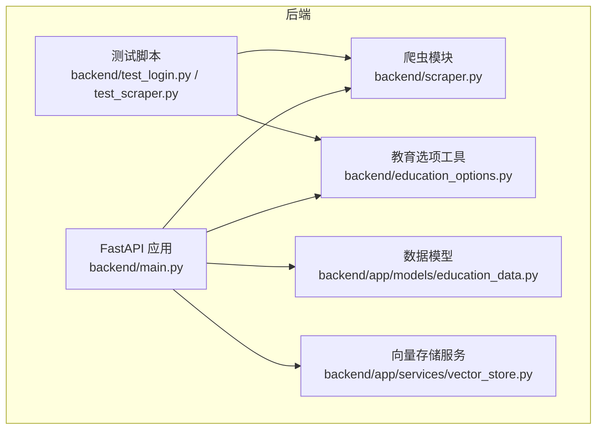
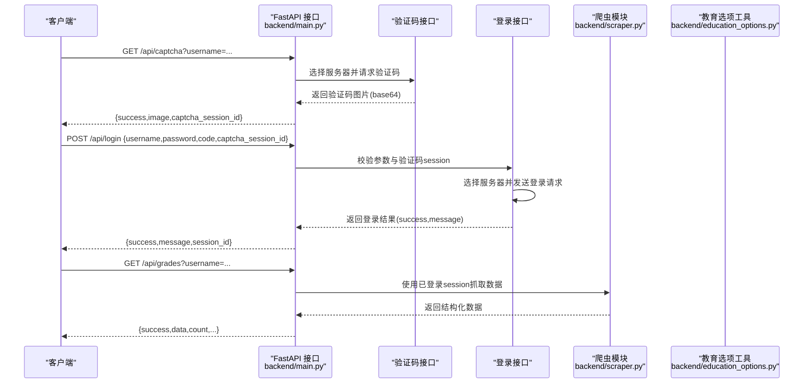

# 单元测试

<cite>
**本文引用的文件**
- [backend/test_login.py](file://backend/test_login.py)
- [backend/test_scraper.py](file://backend/test_scraper.py)
- [backend/scraper.py](file://backend/scraper.py)
- [backend/main.py](file://backend/main.py)
- [backend/education_options.py](file://backend/education_options.py)
- [backend/requirements.txt](file://backend/requirements.txt)
- [backend/app/models/education_data.py](file://backend/app/models/education_data.py)
- [backend/app/services/vector_store.py](file://backend/app/services/vector_store.py)
</cite>

## 目录
1. [简介](#简介)
2. [项目结构](#项目结构)
3. [核心组件](#核心组件)
4. [架构总览](#架构总览)
5. [详细组件分析](#详细组件分析)
6. [依赖分析](#依赖分析)
7. [性能考虑](#性能考虑)
8. [故障排查指南](#故障排查指南)
9. [结论](#结论)
10. [附录](#附录)

## 简介
本文件面向“智能教务系统AI助手”的单元测试与集成测试实践，聚焦以下目标：
- 登录功能测试：验证码获取测试、登录请求测试、服务器切换测试
- 爬虫模块单元测试策略：HTML解析测试、数据提取测试、异常处理测试
- 测试用例设计指南：边界条件、模拟数据、错误场景
- 测试工具使用：pytest框架、requests库测试、BeautifulSoup解析测试的配置与运行

本测试文档基于仓库现有测试脚本与核心业务代码进行分析，并提供可操作的测试实施建议与最佳实践。

## 项目结构
后端采用FastAPI提供REST API，核心业务集中在爬虫模块与教育选项工具模块，测试脚本位于backend目录下，分别覆盖登录流程与爬虫功能的验证。

图表来源
- [backend/main.py:1-853](file://backend/main.py#L1-L853)
- [backend/scraper.py:1-800](file://backend/scraper.py#L1-L800)
- [backend/education_options.py:1-420](file://backend/education_options.py#L1-L420)
- [backend/test_login.py:1-152](file://backend/test_login.py#L1-L152)
- [backend/test_scraper.py:1-280](file://backend/test_scraper.py#L1-L280)
- [backend/app/models/education_data.py:1-103](file://backend/app/models/education_data.py#L1-L103)
- [backend/app/services/vector_store.py:1-164](file://backend/app/services/vector_store.py#L1-L164)

章节来源
- [backend/main.py:1-853](file://backend/main.py#L1-L853)
- [backend/scraper.py:1-800](file://backend/scraper.py#L1-L800)
- [backend/education_options.py:1-420](file://backend/education_options.py#L1-L420)
- [backend/test_login.py:1-152](file://backend/test_login.py#L1-L152)
- [backend/test_scraper.py:1-280](file://backend/test_scraper.py#L1-L280)

## 核心组件
- 登录与验证码接口：负责验证码获取、登录请求、服务器选择与会话保持
- 爬虫模块：封装对教务系统的各类数据抓取逻辑，包括个人信息、成绩、课表、培养方案、学业进度、考试安排等
- 教育选项工具：提供院系、学期、课程性质、修读类别、成绩显示方式等选项查询与辅助函数
- 测试脚本：test_login.py用于登录链路与服务器切换验证；test_scraper.py用于爬虫功能与数据格式检查

章节来源
- [backend/main.py:132-328](file://backend/main.py#L132-L328)
- [backend/scraper.py:13-800](file://backend/scraper.py#L13-L800)
- [backend/education_options.py:130-420](file://backend/education_options.py#L130-L420)
- [backend/test_login.py:1-152](file://backend/test_login.py#L1-L152)
- [backend/test_scraper.py:1-280](file://backend/test_scraper.py#L1-L280)

## 架构总览
登录与数据抓取的整体交互如下：

图表来源
- [backend/main.py:135-328](file://backend/main.py#L135-L328)
- [backend/scraper.py:61-152](file://backend/scraper.py#L61-L152)
- [backend/education_options.py:130-260](file://backend/education_options.py#L130-L260)

## 详细组件分析

### 登录功能测试
本节围绕test_login.py中的登录链路进行测试策略说明，涵盖验证码获取、登录请求与服务器切换。

- 验证码获取测试
  - 使用requests.Session维持会话，设置User-Agent
  - 请求验证码URL，保存图片至本地以人工核验
  - 断言响应状态码、Cookies、URL中包含特定关键字
  - 示例参考：[backend/test_login.py:19-74](file://backend/test_login.py#L19-L74)

- 登录请求测试
  - 组装登录表单数据（用户名、密码、验证码）
  - 发送POST请求至登录URL，检查响应状态码、URL与Cookies
  - 根据响应内容判断登录成功/失败（包含特定关键词检测）
  - 示例参考：[backend/test_login.py:46-74](file://backend/test_login.py#L46-L74)

- 服务器切换测试
  - 内网服务器列表SERVERS用于按学号选择服务器
  - 通过不同服务器地址验证登录稳定性与兼容性
  - 示例参考：[backend/test_login.py:76-139](file://backend/test_login.py#L76-L139)

- 与FastAPI接口的对应关系
  - 验证码接口：/api/captcha，返回base64图片与captcha_session_id
  - 登录接口：/api/login，接收username/password/code/captcha_session_id
  - 示例参考：[backend/main.py:135-328](file://backend/main.py#L135-L328)

章节来源
- [backend/test_login.py:1-152](file://backend/test_login.py#L1-L152)
- [backend/main.py:135-328](file://backend/main.py#L135-L328)

### 爬虫模块单元测试策略
test_scraper.py提供了对JwxtScraper的全面功能检查，包括无需登录的查询、方法存在性与参数签名检查、数据格式示例等。

- 选项数据查询
  - 检查院系、学期、课程性质、修读类别、成绩显示方式、星期与节次等选项
  - 示例参考：[backend/test_scraper.py:17-56](file://backend/test_scraper.py#L17-L56)

- 教师查询（无需登录）
  - 支持按姓名与院系筛选，输出查询结果数量与示例字段
  - 示例参考：[backend/test_scraper.py:59-83](file://backend/test_scraper.py#L59-L83)

- 课程查询（无需登录）
  - 支持按课程名称搜索，输出匹配数量与示例字段
  - 示例参考：[backend/test_scraper.py:86-101](file://backend/test_scraper.py#L86-L101)

- 向量化数据聚合接口检查
  - 检查get_all_data_for_vectorization方法是否存在与签名
  - 示例参考：[backend/test_scraper.py:103-118](file://backend/test_scraper.py#L103-L118)

- 选项查询工具函数
  - query_departments、query_course_options、query_grade_options、get_option_description
  - 示例参考：[backend/test_scraper.py:120-145](file://backend/test_scraper.py#L120-L145)

- 需要登录的功能方法存在性检查
  - 检查get_captcha、login、get_personal_info、get_student_card、get_grades、get_all_grades、get_schedule、get_my_training_plan、get_academic_progress、get_exam_schedule、get_execution_plan、get_course_selection_info等
  - 示例参考：[backend/test_scraper.py:148-180](file://backend/test_scraper.py#L148-L180)

- 关键方法参数检查
  - 使用inspect.signature检查get_grades、get_schedule、get_academic_progress等方法签名与参数说明
  - 示例参考：[backend/test_scraper.py:182-211](file://backend/test_scraper.py#L182-L211)

- 返回数据格式示例
  - 成绩、课表、培养方案等数据结构示例，便于前端与向量化处理
  - 示例参考：[backend/test_scraper.py:213-251](file://backend/test_scraper.py#L213-L251)

- 与JwxtScraper类的对应关系
  - get_captcha、login、get_personal_info、get_student_card、get_grades、get_schedule、get_my_training_plan、get_academic_progress、get_exam_schedule等方法均在JwxtScraper中实现
  - 示例参考：[backend/scraper.py:22-800](file://backend/scraper.py#L22-L800)

章节来源
- [backend/test_scraper.py:1-280](file://backend/test_scraper.py#L1-L280)
- [backend/scraper.py:13-800](file://backend/scraper.py#L13-L800)

### HTML解析与数据提取测试
- BeautifulSoup解析测试
  - 在get_personal_info、get_student_card、get_grades、get_schedule、get_my_training_plan、get_academic_progress、get_exam_schedule等方法中，均使用BeautifulSoup解析HTML
  - 建议在测试中构造模拟HTML片段，验证解析逻辑的健壮性与字段提取准确性
  - 示例参考：[backend/scraper.py:61-800](file://backend/scraper.py#L61-L800)

- 异常处理测试
  - 所有方法均包含try-except捕获与日志记录，测试时应覆盖网络异常、解析异常、空表格等边界场景
  - 示例参考：[backend/scraper.py:61-800](file://backend/scraper.py#L61-L800)

章节来源
- [backend/scraper.py:61-800](file://backend/scraper.py#L61-L800)

### 教育选项工具测试
- 选项查询与辅助函数
  - EducationOptions类提供get_departments、get_current_semester、get_course_natures、get_study_types、get_grade_display_modes、get_assessment_methods、get_weekdays、get_periods、get_weeks等静态方法
  - 工具函数query_departments、query_semesters、query_course_options、query_schedule_options、query_grade_options、get_option_description
  - 示例参考：[backend/education_options.py:130-420](file://backend/education_options.py#L130-L420)

章节来源
- [backend/education_options.py:1-420](file://backend/education_options.py#L1-L420)

### 向量存储与数据模型测试
- 数据模型
  - EducationData、Grade、Course等模型定义了教务数据的持久化结构
  - 示例参考：[backend/app/models/education_data.py:1-103](file://backend/app/models/education_data.py#L1-L103)

- 向量存储服务
  - VectorStore封装Milvus连接、集合创建、文档插入、相似度搜索、用户数据清理等
  - 示例参考：[backend/app/services/vector_store.py:1-164](file://backend/app/services/vector_store.py#L1-L164)

章节来源
- [backend/app/models/education_data.py:1-103](file://backend/app/models/education_data.py#L1-L103)
- [backend/app/services/vector_store.py:1-164](file://backend/app/services/vector_store.py#L1-L164)

## 依赖分析
- 测试依赖
  - requests：HTTP请求与会话管理
  - beautifulsoup4 + lxml：HTML解析
  - pyppeteer / selenium / webdriver-manager：浏览器自动化（用于复杂场景）
  - redis：会话缓存（生产环境）
  - pymilvus：向量数据库集成
  - pandas / numpy：数据处理
  - fastapi / uvicorn：Web框架与ASGI服务器
  - python-dotenv / pydantic / pydantic-settings：配置管理
  - openai / dashscope / langchain：AI能力集成

章节来源
- [backend/requirements.txt:1-44](file://backend/requirements.txt#L1-L44)

## 性能考虑
- 网络超时与重试
  - 所有HTTP请求设置timeout，避免阻塞；在异常处理中考虑重试策略
- 解析性能
  - BeautifulSoup解析大页面时注意DOM树规模，必要时使用更高效的解析器或分段解析
- 会话复用
  - 使用requests.Session减少TCP握手开销，提高连续请求性能
- 向量检索
  - Milvus索引参数与nprobe需结合数据规模与延迟要求调优

## 故障排查指南
- 登录失败常见原因
  - 验证码错误、密码错误、用户名不存在
  - 登录页面仍停留（URL未跳转至framework）
  - 验证码session过期或不存在
  - 参考：[backend/main.py:276-322](file://backend/main.py#L276-L322)

- 爬虫解析失败
  - 页面结构变化导致标签ID/类名变更
  - 空表格或无数据返回
  - 建议增加解析失败的日志与回退策略
  - 参考：[backend/scraper.py:61-800](file://backend/scraper.py#L61-L800)

- 服务器选择问题
  - 按学号取模选择服务器，若某服务器不可达需降级到其他服务器
  - 参考：[backend/main.py:82-93](file://backend/main.py#L82-L93)

章节来源
- [backend/main.py:82-322](file://backend/main.py#L82-L322)
- [backend/scraper.py:61-800](file://backend/scraper.py#L61-L800)

## 结论
本测试文档基于现有测试脚本与核心业务代码，给出了登录链路与爬虫模块的测试策略与最佳实践。建议在后续迭代中引入更完善的单元测试框架（如pytest），针对HTML解析与异常处理场景补充模拟数据与边界条件测试，以提升系统的稳定性与可维护性。

## 附录

### 测试用例设计指南
- 边界条件测试
  - 空输入、非法参数、空表格、无数据返回
- 模拟数据测试
  - 使用HTML片段与JSON样例模拟真实响应，验证解析与数据结构
- 错误场景测试
  - 网络异常、验证码过期、服务器不可达、解析失败

### 测试工具使用
- pytest框架
  - 安装：pip install pytest
  - 运行：pytest backend/test_login.py backend/test_scraper.py
- requests库测试
  - 使用requests.Session与timeout参数，配合HTTPretty或httpx的异步测试
- BeautifulSoup解析测试
  - 使用unittest.mock或pytest-mock构造HTML片段，验证解析逻辑

章节来源
- [backend/test_login.py:1-152](file://backend/test_login.py#L1-L152)
- [backend/test_scraper.py:1-280](file://backend/test_scraper.py#L1-L280)
- [backend/requirements.txt:1-44](file://backend/requirements.txt#L1-L44)