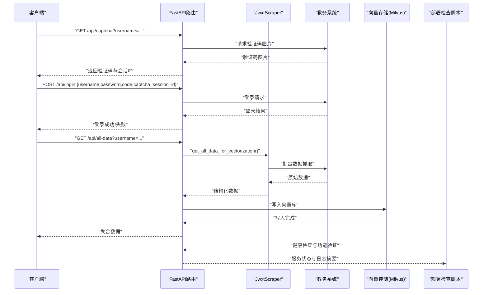

# 测试策略

<cite>
**本文引用的文件**
- [backend/test_login.py](file://backend/test_login.py)
- [backend/test_scraper.py](file://backend/test_scraper.py)
- [backend/main.py](file://backend/main.py)
- [backend/scraper.py](file://backend/scraper.py)
- [backend/app/api/chat.py](file://backend/app/api/chat.py)
- [backend/app/api/education.py](file://backend/app/api/education.py)
- [backend/education_options.py](file://backend/education_options.py)
- [backend/app/models/user.py](file://backend/app/models/user.py)
- [backend/app/services/vector_store.py](file://backend/app/services/vector_store.py)
- [backend/requirements.txt](file://backend/requirements.txt)
- [package.json](file://package.json)
- [docker-compose.yml](file://docker-compose.yml)
- [README-Windows.md](file://README-Windows.md)
- [check-deployment.sh](file://check-deployment.sh)
- [test_scraper_live.py](file://test_scraper_live.py)
- [smart_crawler_test.py](file://smart_crawler_test.py)
- [scripts/build.sh](file://scripts/build.sh)
- [scripts/start.sh](file://scripts/start.sh)
- [scripts/prepare.sh](file://scripts/prepare.sh)
- [scripts/dev.sh](file://scripts/dev.sh)
</cite>

## 目录
1. [简介](#简介)
2. [项目结构](#项目结构)
3. [核心组件](#核心组件)
4. [架构总览](#架构总览)
5. [详细组件测试策略](#详细组件测试策略)
6. [依赖关系分析](#依赖关系分析)
7. [性能考虑](#性能考虑)
8. [故障排查指南](#故障排查指南)
9. [结论](#结论)
10. [附录](#附录)

## 简介
本测试策略面向“智能教务系统AI助手”项目，目标是建立覆盖单元测试、集成测试与端到端测试的完整测试体系，重点保障登录功能、爬虫模块与API接口的稳定性与可靠性。策略涵盖：
- 单元测试：针对登录、爬虫、选项工具函数与API路由的最小可测单元
- 集成测试：验证前后端协作、数据库、缓存与向量库的协同工作
- 端到端测试：模拟真实用户场景，从登录到数据查询与AI对话的全流程
- 测试用例设计：边界条件、异常处理、性能与并发
- 测试数据准备与管理：模拟数据生成、测试环境隔离
- 自动化流程：CI/CD中的测试集成与报告生成
- 调试技巧与工具推荐：日志、断点、Mock与容器化测试
- **新增**：部署检查脚本与实时爬虫测试功能，强化部署验证与实时测试能力

## 项目结构
后端采用FastAPI，提供教务系统数据爬取与AI对话能力；前端基于Next.js；测试脚本位于backend目录；容器编排通过docker-compose定义数据库、缓存与向量库等依赖。**新增**部署检查脚本与智能爬虫测试工具，提供完整的部署验证与实时测试能力。

```mermaid
graph TB
FE["前端(Next.js)"] --> BE["后端(FastAPI)"]
BE --> DB["PostgreSQL"]
BE --> CACHE["Redis"]
BE --> VDB["Milvus"]
BE --> EDU["教务系统(外网/内网)"]
subgraph "测试工具"
DEP["部署检查脚本"]
LIVE["实时爬虫测试"]
SMART["智能爬虫测试"]
END
DEP --> BE
LIVE --> EDU
SMART --> EDU
```

**图示来源**
- [docker-compose.yml:1-148](file://docker-compose.yml#L1-L148)
- [backend/main.py:1-853](file://backend/main.py#L1-L853)
- [check-deployment.sh:1-69](file://check-deployment.sh#L1-L69)
- [test_scraper_live.py:1-241](file://test_scraper_live.py#L1-L241)
- [smart_crawler_test.py:1-416](file://smart_crawler_test.py#L1-L416)

**章节来源**
- [docker-compose.yml:1-148](file://docker-compose.yml#L1-L148)
- [README-Windows.md:1-401](file://README-Windows.md#L1-L401)
- [check-deployment.sh:1-69](file://check-deployment.sh#L1-L69)
- [test_scraper_live.py:1-241](file://test_scraper_live.py#L1-L241)
- [smart_crawler_test.py:1-416](file://smart_crawler_test.py#L1-L416)

## 核心组件
- 登录与验证码：后端提供验证码获取与登录接口，支持外网/内网服务器选择与会话管理
- 爬虫模块：封装对教务系统的数据抓取逻辑，包括个人信息、成绩、课表、培养方案等
- API路由：统一暴露数据查询与AI对话接口，部分路由依赖会话与数据库
- 选项工具：提供院系、学期、课程性质等选项查询与描述映射
- 向量存储：对接Milvus，支持RAG检索与上下文增强
- 前后端交互：前端通过Next.js访问后端API，后端通过FastAPI提供REST接口
- **新增**：部署检查脚本，自动化验证服务状态与关键功能
- **新增**：实时爬虫测试，支持真实环境下的端到端验证
- **新增**：智能爬虫测试，提供完全自动化的爬取与分析能力

**章节来源**
- [backend/main.py:95-800](file://backend/main.py#L95-L800)
- [backend/scraper.py:13-800](file://backend/scraper.py#L13-L800)
- [backend/education_options.py:1-420](file://backend/education_options.py#L1-L420)
- [backend/app/services/vector_store.py:14-164](file://backend/app/services/vector_store.py#L14-L164)
- [backend/app/api/chat.py:1-224](file://backend/app/api/chat.py#L1-L224)
- [backend/app/api/education.py:1-104](file://backend/app/api/education.py#L1-L104)
- [check-deployment.sh:1-69](file://check-deployment.sh#L1-L69)
- [test_scraper_live.py:1-241](file://test_scraper_live.py#L1-L241)
- [smart_crawler_test.py:1-416](file://smart_crawler_test.py#L1-L416)

## 架构总览
后端作为统一入口，负责：
- 验证码与登录：选择服务器、生成验证码会话、校验登录结果
- 数据爬取：封装JwxtScraper，统一返回结构
- 选项查询：EducationOptions与工具函数
- AI对话：RAG检索与千问调用
- 会话与持久化：基于内存/Redis的会话存储与数据库ORM
- **新增**：部署验证：通过shell脚本自动化检查服务状态与关键日志



**图示来源**
- [backend/main.py:135-725](file://backend/main.py#L135-L725)
- [backend/scraper.py:13-800](file://backend/scraper.py#L13-L800)
- [backend/app/services/vector_store.py:73-137](file://backend/app/services/vector_store.py#L73-L137)
- [check-deployment.sh:1-69](file://check-deployment.sh#L1-L69)

## 详细组件测试策略

### 单元测试：登录功能
目标：验证验证码获取、登录流程、错误处理与服务器选择逻辑
- 覆盖点
  - 验证码接口：返回图片与会话ID，超时与状态码校验
  - 登录接口：参数校验、验证码会话有效性、服务器选择、登录结果判定
  - 异常分支：网络异常、验证码过期、账号密码错误、登录页面残留
- 测试方法
  - 使用HTTP客户端调用/api/captcha与/api/login，断言响应结构与状态码
  - Mock外部依赖（requests、session），注入异常场景
  - 边界条件：空参数、非数字学号、无效captcha_session_id
- 关键接口参考
  - 验证码：/api/captcha
  - 登录：/api/login
- 参考实现
  - [backend/test_login.py:19-152](file://backend/test_login.py#L19-L152)
  - [backend/main.py:135-328](file://backend/main.py#L135-L328)

**章节来源**
- [backend/test_login.py:19-152](file://backend/test_login.py#L19-L152)
- [backend/main.py:135-328](file://backend/main.py#L135-L328)

### 单元测试：爬虫模块
目标：验证数据抓取方法的存在性、参数签名与返回结构
- 覆盖点
  - 方法存在性：get_captcha、login、get_personal_info、get_grades、get_schedule、get_my_training_plan、get_academic_progress、get_exam_schedule、get_execution_plan、get_course_selection_info、get_all_data_for_vectorization
  - 参数签名：inspect方法参数，明确kksj、kcxz、kcmc、fxkc、xsfs等
  - 返回结构：数据字段示例（成绩、课表、培养方案）
- 测试方法
  - 动态检查方法是否存在与签名
  - 生成模拟数据，断言字段完整性
  - 边界：空结果、HTML解析失败、网络超时
- 参考实现
  - [backend/test_scraper.py:148-280](file://backend/test_scraper.py#L148-L280)
  - [backend/scraper.py:13-800](file://backend/scraper.py#L13-L800)

**章节来源**
- [backend/test_scraper.py:148-280](file://backend/test_scraper.py#L148-L280)
- [backend/scraper.py:13-800](file://backend/scraper.py#L13-L800)

### 单元测试：API接口
目标：验证路由行为、参数校验、权限控制与错误处理
- 覆盖点
  - 健康检查：/api/health
  - 个人信息：/api/user/info（需登录）
  - 成绩查询：/api/grades（参数过滤）
  - 课表查询：/api/schedule（学期/周次）
  - 培养方案：/api/training-plan/my
  - 学业进度：/api/academic-progress
  - 考试安排：/api/exam-schedule
  - 教师/课程查询：/api/teacher/search、/api/course/search（无需登录）
  - 选项查询：/api/options/*
  - AI对话：/api/chat/send（RAG与历史对话）
- 测试方法
  - 使用HTTP客户端构造请求，断言响应结构与状态码
  - 未登录访问受保护路由时返回401
  - 参数非法时返回400
  - 异常捕获与HTTPException抛出
- 参考实现
  - [backend/main.py:95-800](file://backend/main.py#L95-L800)
  - [backend/app/api/chat.py:45-224](file://backend/app/api/chat.py#L45-L224)

**章节来源**
- [backend/main.py:95-800](file://backend/main.py#L95-L800)
- [backend/app/api/chat.py:45-224](file://backend/app/api/chat.py#L45-L224)

### 单元测试：选项工具与教育数据
目标：验证选项数据查询、描述映射与工具函数
- 覆盖点
  - 院系查询：query_departments、get_department_by_name/code
  - 学期查询：query_semesters、get_current_semester
  - 课程/成绩/课表选项：query_course_options、query_grade_options、query_schedule_options
  - 描述映射：get_option_description
- 测试方法
  - 关键词匹配、范围筛选、默认值与异常返回
  - 边界：空关键词、未知代码、当前学期推断
- 参考实现
  - [backend/education_options.py:130-420](file://backend/education_options.py#L130-L420)

**章节来源**
- [backend/education_options.py:130-420](file://backend/education_options.py#L130-L420)

### 单元测试：向量存储与RAG
目标：验证Milvus连接、集合创建、文档插入与相似度检索
- 覆盖点
  - 连接与健康：连接参数、异常处理
  - 集合创建：字段定义、索引参数
  - 文档插入：多条文本、嵌入向量、元数据
  - 检索：按用户维度过滤、Top-K返回
- 测试方法
  - Mock嵌入生成器，构造固定维度向量
  - 断言插入数量与检索命中
  - 异常：连接失败、集合不存在、查询超时
- 参考实现
  - [backend/app/services/vector_store.py:14-164](file://backend/app/services/vector_store.py#L14-L164)

**章节来源**
- [backend/app/services/vector_store.py:14-164](file://backend/app/services/vector_store.py#L14-L164)

### 集成测试：前后端协作
目标：验证前端通过Next.js访问后端API的端到端流程
- 覆盖点
  - 健康检查：/api/health
  - 验证码：/api/captcha
  - 登录：/api/login
  - 数据查询：/api/grades、/api/schedule、/api/user/info
  - 选项查询：/api/options/*
  - AI对话：/api/chat/send
- 测试方法
  - 使用docker-compose启动后端与依赖服务
  - 前端以NEXT_PUBLIC_API_URL=/api方式访问后端
  - 断言响应结构、状态码与业务语义
- 参考实现
  - [docker-compose.yml:1-148](file://docker-compose.yml#L1-L148)
  - [README-Windows.md:171-212](file://README-Windows.md#L171-L212)

**章节来源**
- [docker-compose.yml:1-148](file://docker-compose.yml#L1-L148)
- [README-Windows.md:171-212](file://README-Windows.md#L171-L212)

### 端到端测试：真实用户场景
目标：模拟真实用户从登录到获取数据再到AI对话的完整流程
- 场景设计
  - 步骤1：获取验证码并保存图片
  - 步骤2：提交登录，校验会话与JSESSIONID
  - 步骤3：查询个人信息、成绩、课表
  - 步骤4：聚合数据写入向量库
  - 步骤5：发起AI对话，携带上下文与来源
- 测试方法
  - 使用真实账号（仅限测试环境）或Mock数据
  - 断言每步返回结构与业务一致性
  - 异常：验证码过期、登录失败、网络中断
- 参考实现
  - [backend/test_login.py:19-152](file://backend/test_login.py#L19-L152)
  - [backend/test_scraper.py:148-280](file://backend/test_scraper.py#L148-L280)
  - [backend/main.py:698-725](file://backend/main.py#L698-L725)
  - [backend/app/api/chat.py:45-224](file://backend/app/api/chat.py#L45-L224)

**章节来源**
- [backend/test_login.py:19-152](file://backend/test_login.py#L19-L152)
- [backend/test_scraper.py:148-280](file://backend/test_scraper.py#L148-L280)
- [backend/main.py:698-725](file://backend/main.py#L698-L725)
- [backend/app/api/chat.py:45-224](file://backend/app/api/chat.py#L45-L224)

### **新增**：部署检查测试
目标：自动化验证服务部署状态与关键功能
- 覆盖点
  - Docker容器状态检查：docker-compose ps
  - 代码更新与重启：git pull && docker-compose restart
  - 关键日志验证：编码修复、登录成功、培养方案解析、成绩/课表解析、向量化
  - 实时监控：持续查看后端日志
- 测试方法
  - 执行check-deployment.sh脚本，自动检查服务状态
  - 验证关键日志模式匹配，确保各功能模块正常工作
  - 支持手动查看日志进行深入分析
- 参考实现
  - [check-deployment.sh:1-69](file://check-deployment.sh#L1-L69)

**章节来源**
- [check-deployment.sh:1-69](file://check-deployment.sh#L1-L69)

### **新增**：实时爬虫测试
目标：在真实环境中验证爬虫功能的完整流程
- 覆盖点
  - 完整登录流程：验证码获取、手动输入、登录验证
  - 多功能测试：个人信息、成绩、课表、培养方案、学业进度
  - 关键功能验证：重点测试培养方案解析准确性
  - 数据保存：保存原始HTML供后续分析
- 测试方法
  - 交互式运行test_scraper_live.py，支持手动输入验证码
  - 自动化验证各功能模块返回的数据结构
  - 保存关键页面的原始HTML，便于对比和分析
- 参考实现
  - [test_scraper_live.py:1-241](file://test_scraper_live.py#L1-L241)

**章节来源**
- [test_scraper_live.py:1-241](file://test_scraper_live.py#L1-L241)

### **新增**：智能爬虫测试
目标：完全自动化的爬取与分析流程
- 覆盖点
  - 自动登录：自动下载验证码、自动输入、自动登录
  - 全面爬取：主页面、菜单项、所有相关页面
  - 智能分析：HTML结构分析、链接提取、表单识别、JavaScript URL发现
  - 方法测试：自动测试所有解析方法的正确性
- 测试方法
  - 运行smart_crawler_test.py，完全自动化执行
  - 自动生成HTML文件，便于后续分析和优化
  - 提供详细的分析报告和数据统计
- 参考实现
  - [smart_crawler_test.py:1-416](file://smart_crawler_test.py#L1-L416)

**章节来源**
- [smart_crawler_test.py:1-416](file://smart_crawler_test.py#L1-L416)

## 依赖关系分析
- 后端依赖
  - Web框架：FastAPI、Uvicorn
  - HTTP：requests、aiohttp
  - 解析：BeautifulSoup4、lxml
  - 爬虫：pyppeteer、selenium
  - 缓存：redis
  - 向量库：grpcio、pymilvus
  - LLM：openai、dashscope
  - 工具：python-dotenv、pydantic、pandas、numpy
- 前端依赖
  - Next.js、React、TailwindCSS、Radix UI等
- 容器依赖
  - PostgreSQL、Redis、Etcd、MinIO、Milvus
- **新增**：测试工具依赖
  - 部署检查：bash shell、docker-compose
  - 实时测试：requests、beautifulsoup4、traceback
  - 智能测试：额外的HTML分析工具和文件操作

```mermaid
graph TB
subgraph "后端依赖"
F["FastAPI"] --> R["requests/aiohttp"]
F --> P["pyppeteer/selenium"]
F --> BS["BeautifulSoup4/lxml"]
F --> VC["pymilvus/grpcio"]
F --> RC["redis"]
F --> LLM["openai/dashscope"]
end
subgraph "前端依赖"
NX["Next.js"] --> React["React"]
NX --> UI["Shadcn/UI"]
end
subgraph "容器依赖"
PG["PostgreSQL"]:::c
RD["Redis"]:::c
ML["Milvus"]:::c
end
subgraph "测试工具依赖"
DEP["部署检查脚本"] --> DC["docker-compose"]
LIVE["实时测试"] --> REQ["requests/beautifulsoup4"]
SMART["智能测试"] --> ALL["综合工具集"]
END
F --> PG
F --> RD
F --> ML
```

**图示来源**
- [backend/requirements.txt:1-44](file://backend/requirements.txt#L1-L44)
- [package.json:12-92](file://package.json#L12-L92)
- [docker-compose.yml:1-148](file://docker-compose.yml#L1-L148)
- [check-deployment.sh:1-69](file://check-deployment.sh#L1-L69)
- [test_scraper_live.py:1-241](file://test_scraper_live.py#L1-L241)
- [smart_crawler_test.py:1-416](file://smart_crawler_test.py#L1-L416)

**章节来源**
- [backend/requirements.txt:1-44](file://backend/requirements.txt#L1-L44)
- [package.json:12-92](file://package.json#L12-L92)
- [docker-compose.yml:1-148](file://docker-compose.yml#L1-L148)
- [check-deployment.sh:1-69](file://check-deployment.sh#L1-L69)
- [test_scraper_live.py:1-241](file://test_scraper_live.py#L1-L241)
- [smart_crawler_test.py:1-416](file://smart_crawler_test.py#L1-L416)

## 性能考虑
- 网络请求超时与重试：验证码与登录接口设置合理超时，避免阻塞
- 并发与会话：SESSIONS字典在生产环境应替换为Redis，避免多进程共享问题
- 向量检索：Milvus索引参数与nprobe需结合数据规模调优
- 日志与监控：在关键路径增加日志埋点，便于性能分析
- 前端缓存：对不敏感的选项数据进行本地缓存，减少重复请求
- **新增**：部署检查性能：脚本执行时间优化，关键日志过滤减少处理开销
- **新增**：实时测试性能：验证码图片处理优化，HTML保存策略调整

## 故障排查指南
- 验证码无法获取
  - 检查网络与VPN连通性
  - 校验/api/captcha返回状态码与会话ID
- 登录失败
  - 核对验证码会话是否过期
  - 检查账号密码与验证码是否正确
  - 观察响应内容中的错误提示
- 数据查询为空
  - 确认已登录且会话有效
  - 检查参数组合（学期、周次、显示方式等）
- 向量检索无结果
  - 确认向量库已创建并加载
  - 检查用户维度过滤表达式与嵌入维度
- 容器依赖异常
  - 使用docker-compose健康检查确认服务状态
  - 查看容器日志定位连接问题
- **新增**：部署检查失败
  - 检查docker-compose服务状态
  - 验证脚本执行权限和环境变量
  - 查看关键日志模式匹配结果
- **新增**：实时测试异常
  - 确认教务系统可访问性和网络连通性
  - 验证验证码图片正确性和手动输入准确性
  - 检查保存的HTML文件完整性

**章节来源**
- [backend/main.py:135-328](file://backend/main.py#L135-L328)
- [backend/app/services/vector_store.py:24-72](file://backend/app/services/vector_store.py#L24-L72)
- [docker-compose.yml:14-92](file://docker-compose.yml#L14-L92)
- [check-deployment.sh:1-69](file://check-deployment.sh#L1-L69)
- [test_scraper_live.py:1-241](file://test_scraper_live.py#L1-L241)
- [smart_crawler_test.py:1-416](file://smart_crawler_test.py#L1-L416)

## 结论
本测试策略围绕登录、爬虫与API三大核心模块，结合单元、集成与端到端测试，形成闭环的质量保障体系。**新增的部署检查脚本和实时爬虫测试功能**进一步增强了系统的可维护性和可靠性。通过明确的测试用例设计、测试数据管理与自动化流程，能够有效提升系统的稳定性与可维护性。建议在CI/CD中集成测试任务，输出测试报告并纳入质量门禁。

## 附录

### 测试用例编写指南
- 边界条件
  - 空参数、非法参数、空结果集、HTML解析异常
- 异常处理
  - 网络超时、验证码过期、登录失败、数据库连接失败
- 性能测试
  - 并发登录与数据查询、向量检索Top-K性能
- 并发与会话
  - 多用户同时登录与查询，验证会话隔离
- **新增**：部署验证测试
  - 服务状态检查、关键日志验证、部署流程自动化
- **新增**：实时测试用例
  - 真实环境验证、交互式测试流程、数据完整性检查

### 测试数据准备与管理
- 模拟数据
  - 使用字典与JSON结构模拟爬虫返回数据
  - 选项工具函数使用内置静态数据
- 测试环境
  - 使用docker-compose启动PostgreSQL、Redis、Milvus
  - 前端NEXT_PUBLIC_API_URL指向后端容器
- **新增**：部署测试数据
  - 准备不同版本的部署脚本和配置文件
  - 创建测试用的HTML样例文件
- **新增**：实时测试数据
  - 准备真实的验证码图片和HTML文件
  - 设置测试账号和环境变量

### 测试自动化流程（CI/CD）
- 流程建议
  - 安装依赖：pip install -r backend/requirements.txt
  - 启动依赖容器：docker-compose up -d
  - 运行后端测试：python -m pytest backend/tests/
  - 运行前端测试：npm run test
  - 生成报告：pytest --junitxml=report.xml
  - **新增**：部署验证：./check-deployment.sh
  - **新增**：实时测试：python test_scraper_live.py
  - **新增**：智能测试：python smart_crawler_test.py
- 环境变量
  - QWEN_API_KEY、JWT_SECRET_KEY、EDUCATION_SYSTEM_URL等
- **新增**：脚本自动化
  - 使用scripts目录中的构建和启动脚本
  - 配置开发和生产环境的不同参数

**章节来源**
- [backend/requirements.txt:1-44](file://backend/requirements.txt#L1-L44)
- [docker-compose.yml:107-137](file://docker-compose.yml#L107-L137)
- [README-Windows.md:171-212](file://README-Windows.md#L171-L212)
- [check-deployment.sh:1-69](file://check-deployment.sh#L1-L69)
- [test_scraper_live.py:1-241](file://test_scraper_live.py#L1-L241)
- [smart_crawler_test.py:1-416](file://smart_crawler_test.py#L1-L416)
- [scripts/build.sh:1-18](file://scripts/build.sh#L1-L18)
- [scripts/start.sh:1-18](file://scripts/start.sh#L1-L18)
- [scripts/prepare.sh:1-10](file://scripts/prepare.sh#L1-L10)
- [scripts/dev.sh:1-35](file://scripts/dev.sh#L1-L35)