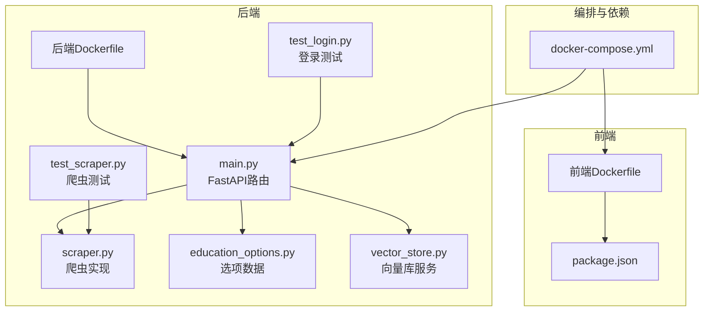
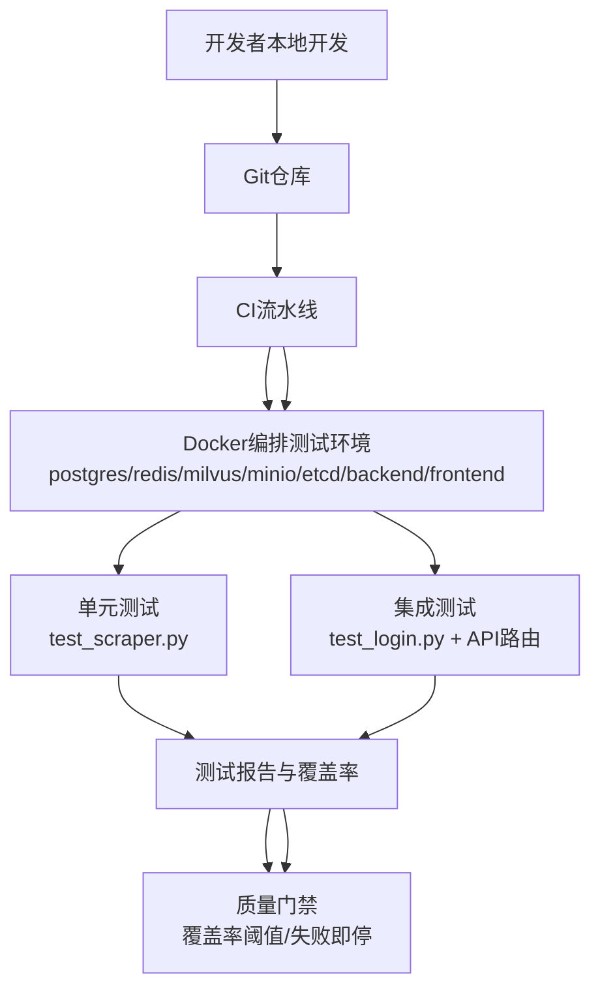
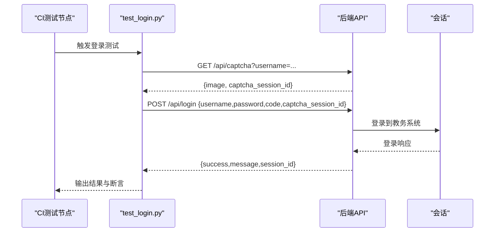
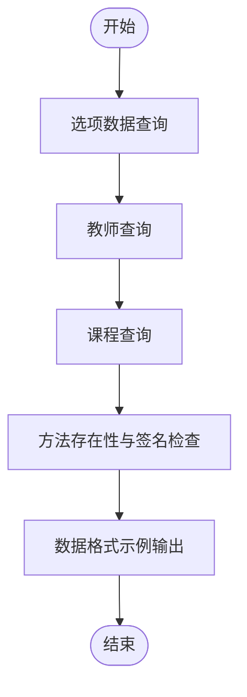
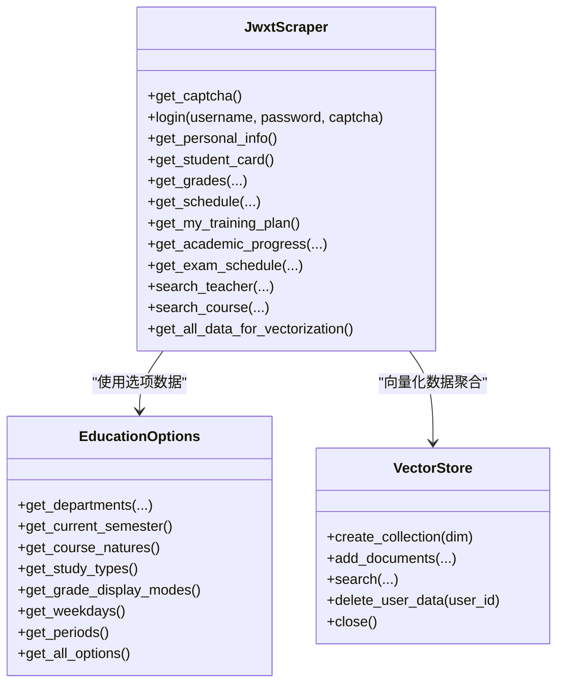
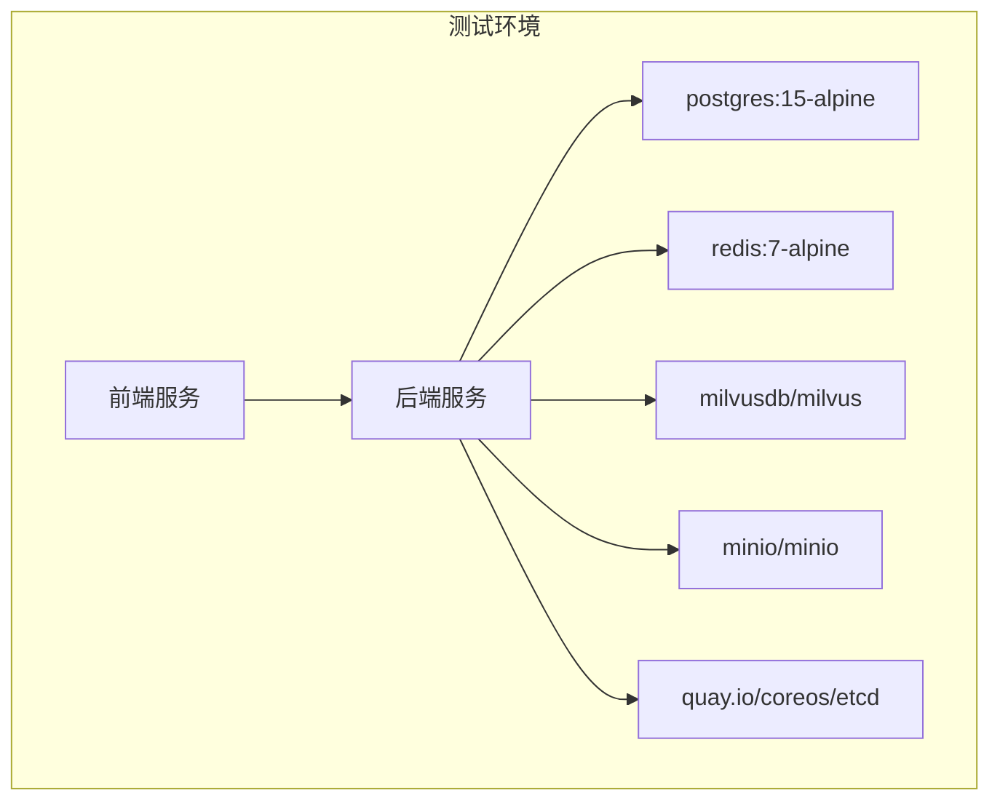
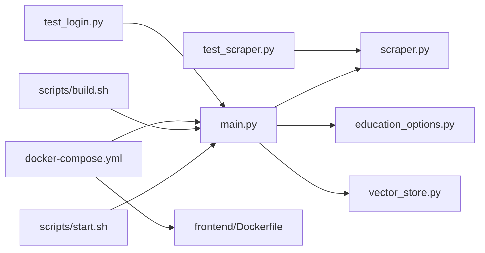

# 测试自动化

<cite>
**本文引用的文件**
- [backend/test_login.py](file://backend/test_login.py)
- [backend/test_scraper.py](file://backend/test_scraper.py)
- [docker-compose.yml](file://docker-compose.yml)
- [backend/Dockerfile](file://backend/Dockerfile)
- [frontend/Dockerfile](file://frontend/Dockerfile)
- [backend/main.py](file://backend/main.py)
- [backend/scraper.py](file://backend/scraper.py)
- [backend/education_options.py](file://backend/education_options.py)
- [backend/app/api/education.py](file://backend/app/api/education.py)
- [backend/app/services/vector_store.py](file://backend/app/services/vector_store.py)
- [scripts/build.sh](file://scripts/build.sh)
- [scripts/start.sh](file://scripts/start.sh)
- [package.json](file://package.json)
- [backend/requirements.txt](file://backend/requirements.txt)
</cite>

## 目录
1. [简介](#简介)
2. [项目结构](#项目结构)
3. [核心组件](#核心组件)
4. [架构总览](#架构总览)
5. [详细组件分析](#详细组件分析)
6. [依赖分析](#依赖分析)
7. [性能考虑](#性能考虑)
8. [故障排查指南](#故障排查指南)
9. [结论](#结论)
10. [附录](#附录)

## 简介
本文件面向“智能教务系统AI助手”项目，系统化构建测试自动化框架文档，覆盖以下目标：
- CI/CD流水线中的测试集成：自动化测试脚本编写、测试执行调度、测试结果报告生成
- 测试环境自动化配置：Docker容器中测试环境搭建、测试数据自动准备、测试服务自动启动
- 覆盖率与质量门禁：代码覆盖率统计、测试失败通知、持续改进流程
- 测试工具链集成：测试框架配置、测试报告生成、测试数据分析

本项目已具备基础的后端API与爬虫能力，并提供独立的测试脚本，适合在此基础上扩展为完整的测试自动化体系。

## 项目结构
项目采用前后端分离与多服务编排的结构：
- 后端FastAPI服务，提供教务系统接口与AI助手能力
- 前端Next.js应用，提供用户界面
- Docker Compose编排数据库、缓存、对象存储、向量库与Milvus等依赖服务
- 测试脚本位于后端目录，分别验证登录与爬虫功能

图表来源
- [docker-compose.yml:1-148](file://docker-compose.yml#L1-L148)
- [backend/Dockerfile:1-18](file://backend/Dockerfile#L1-L18)
- [frontend/Dockerfile:1-33](file://frontend/Dockerfile#L1-L33)
- [backend/main.py:1-853](file://backend/main.py#L1-L853)
- [backend/scraper.py:1-1220](file://backend/scraper.py#L1-L1220)
- [backend/education_options.py:1-420](file://backend/education_options.py#L1-L420)
- [backend/app/services/vector_store.py:1-164](file://backend/app/services/vector_store.py#L1-L164)
- [backend/test_login.py:1-152](file://backend/test_login.py#L1-L152)
- [backend/test_scraper.py:1-280](file://backend/test_scraper.py#L1-L280)

章节来源
- [docker-compose.yml:1-148](file://docker-compose.yml#L1-L148)
- [backend/Dockerfile:1-18](file://backend/Dockerfile#L1-L18)
- [frontend/Dockerfile:1-33](file://frontend/Dockerfile#L1-L33)
- [backend/main.py:1-853](file://backend/main.py#L1-L853)
- [backend/scraper.py:1-1220](file://backend/scraper.py#L1-L1220)
- [backend/education_options.py:1-420](file://backend/education_options.py#L1-L420)
- [backend/app/services/vector_store.py:1-164](file://backend/app/services/vector_store.py#L1-L164)
- [backend/test_login.py:1-152](file://backend/test_login.py#L1-L152)
- [backend/test_scraper.py:1-280](file://backend/test_scraper.py#L1-L280)

## 核心组件
- 测试脚本层
  - 登录测试：验证验证码获取与登录流程，输出人工交互提示与结果判定
  - 爬虫测试：验证选项数据、教师/课程查询、方法存在性与参数签名、数据格式示例
- 应用层
  - FastAPI路由：提供验证码、登录、个人信息、成绩、课表、培养方案、考试安排、教师/课程查询、向量化数据聚合等接口
  - 爬虫实现：封装HTTP会话、验证码与登录、个人信息、学籍卡片、成绩、课表、培养方案、学业进度、考试安排等数据抓取逻辑
  - 选项工具：提供院系、学期、课程性质、修读类别、成绩显示方式、星期与节次等选项查询与AI工具函数
  - 向量库服务：封装Milvus连接、集合创建、文档插入、相似度检索、用户数据清理等操作
- 编排与运行
  - Docker Compose：编排PostgreSQL、Redis、etcd、MinIO、Milvus、后端、前端服务
  - 构建与启动脚本：前端构建、后端打包与启动

章节来源
- [backend/test_login.py:1-152](file://backend/test_login.py#L1-L152)
- [backend/test_scraper.py:1-280](file://backend/test_scraper.py#L1-L280)
- [backend/main.py:1-853](file://backend/main.py#L1-L853)
- [backend/scraper.py:1-1220](file://backend/scraper.py#L1-L1220)
- [backend/education_options.py:1-420](file://backend/education_options.py#L1-L420)
- [backend/app/services/vector_store.py:1-164](file://backend/app/services/vector_store.py#L1-L164)
- [docker-compose.yml:1-148](file://docker-compose.yml#L1-L148)
- [scripts/build.sh:1-18](file://scripts/build.sh#L1-L18)
- [scripts/start.sh:1-18](file://scripts/start.sh#L1-L18)

## 架构总览
测试自动化框架建议以“测试脚本 + Docker编排 + CI流水线”的方式落地，形成如下闭环：
- 测试脚本：基于现有脚本扩展为可被CI调用的单元/集成测试
- 测试环境：通过Docker Compose一键拉起后端与依赖服务，确保测试一致性
- 测试执行：在CI中按阶段触发测试（单元/集成/端到端），并产出报告
- 质量门禁：基于覆盖率阈值与测试通过率控制合并与发布

图表来源
- [docker-compose.yml:1-148](file://docker-compose.yml#L1-L148)
- [backend/test_login.py:1-152](file://backend/test_login.py#L1-L152)
- [backend/test_scraper.py:1-280](file://backend/test_scraper.py#L1-L280)
- [backend/main.py:1-853](file://backend/main.py#L1-L853)

## 详细组件分析

### 组件A：登录测试脚本（test_login.py）
- 目标：验证验证码获取与登录流程，支持外网与内网服务器切换
- 关键流程
  - 获取验证码并保存图片，提示人工输入验证码
  - 提交用户名、密码与验证码，检查响应URL与内容关键字
  - 判定登录成功/失败并输出调试信息
- 适配CI建议
  - 将人工输入替换为外部提供的验证码与凭证（如通过环境变量或测试数据源）
  - 增加断言与日志输出，便于CI收集测试结果
  - 在CI中按顺序拉起后端与依赖服务后再执行

图表来源
- [backend/test_login.py:1-152](file://backend/test_login.py#L1-L152)
- [backend/main.py:126-328](file://backend/main.py#L126-L328)

章节来源
- [backend/test_login.py:1-152](file://backend/test_login.py#L1-L152)
- [backend/main.py:126-328](file://backend/main.py#L126-L328)

### 组件B：爬虫功能测试脚本（test_scraper.py）
- 目标：验证选项数据、教师/课程查询、方法存在性与参数签名、数据格式示例
- 关键流程
  - 选项数据查询：院系、学期、课程性质、修读类别、成绩显示方式、星期与节次
  - 教师/课程查询：支持模糊搜索与筛选
  - 方法存在性与签名检查：对关键API方法进行存在性与参数签名验证
  - 数据格式示例：输出成绩、课表、培养方案等典型数据结构
- 适配CI建议
  - 将“人工输入”替换为固定测试数据，确保可重复性
  - 将“方法签名检查”改为断言，统一输出测试结果
  - 将“数据格式示例”作为期望值比对，提升稳定性

图表来源
- [backend/test_scraper.py:1-280](file://backend/test_scraper.py#L1-L280)
- [backend/scraper.py:1-1220](file://backend/scraper.py#L1-L1220)
- [backend/education_options.py:1-420](file://backend/education_options.py#L1-L420)

章节来源
- [backend/test_scraper.py:1-280](file://backend/test_scraper.py#L1-L280)
- [backend/scraper.py:1-1220](file://backend/scraper.py#L1-L1220)
- [backend/education_options.py:1-420](file://backend/education_options.py#L1-L420)

### 组件C：后端API与爬虫实现
- API路由
  - 健康检查、验证码、登录、个人信息、学籍卡片、成绩、课表、培养方案、学业进度、考试安排、教师/课程查询、向量化数据聚合等
- 爬虫实现
  - 支持验证码获取、登录、个人信息、学籍卡片、成绩、课表、培养方案、学业进度、考试安排等
- 选项工具
  - 提供静态选项数据与AI工具函数，支持关键词查询与描述映射
- 向量库服务
  - 封装Milvus连接、集合创建、文档插入、相似度检索、用户数据清理

图表来源
- [backend/scraper.py:1-1220](file://backend/scraper.py#L1-L1220)
- [backend/education_options.py:1-420](file://backend/education_options.py#L1-L420)
- [backend/app/services/vector_store.py:1-164](file://backend/app/services/vector_store.py#L1-L164)

章节来源
- [backend/main.py:1-853](file://backend/main.py#L1-L853)
- [backend/scraper.py:1-1220](file://backend/scraper.py#L1-L1220)
- [backend/education_options.py:1-420](file://backend/education_options.py#L1-L420)
- [backend/app/services/vector_store.py:1-164](file://backend/app/services/vector_store.py#L1-L164)

### 组件D：测试环境自动化配置（Docker编排）
- 服务编排
  - 数据库：PostgreSQL
  - 缓存：Redis
  - 分布式KV：etcd
  - 对象存储：MinIO
  - 向量库：Milvus
  - 后端：FastAPI服务
  - 前端：Next.js应用
- 健康检查
  - 各服务均配置健康检查，确保测试前服务可用
- 端口映射与依赖
  - 后端通过环境变量连接数据库、缓存与向量库
  - 前端通过环境变量指向后端API

图表来源
- [docker-compose.yml:1-148](file://docker-compose.yml#L1-L148)

章节来源
- [docker-compose.yml:1-148](file://docker-compose.yml#L1-L148)

### 组件E：测试工具链集成（构建与启动）
- 构建脚本
  - 前端：安装依赖并构建Next.js项目
  - 后端：打包Node服务（tsup），输出dist
- 启动脚本
  - 启动Node HTTP服务，用于部署或测试

章节来源
- [scripts/build.sh:1-18](file://scripts/build.sh#L1-L18)
- [scripts/start.sh:1-18](file://scripts/start.sh#L1-L18)
- [package.json:1-92](file://package.json#L1-L92)

## 依赖分析
- 组件耦合
  - 测试脚本依赖后端API与爬虫实现
  - 后端API依赖爬虫与选项工具，向量库服务用于RAG场景
  - Docker编排为测试提供一致的后端与依赖服务
- 外部依赖
  - Python后端依赖：FastAPI、Requests、BeautifulSoup、Redis、Milvus、OpenAI、DashScope等
  - 前端依赖：Next.js、React、TailwindCSS等
- 潜在循环依赖
  - 当前结构清晰，无明显循环依赖

图表来源
- [backend/test_login.py:1-152](file://backend/test_login.py#L1-L152)
- [backend/test_scraper.py:1-280](file://backend/test_scraper.py#L1-L280)
- [backend/main.py:1-853](file://backend/main.py#L1-L853)
- [backend/scraper.py:1-1220](file://backend/scraper.py#L1-L1220)
- [backend/education_options.py:1-420](file://backend/education_options.py#L1-L420)
- [backend/app/services/vector_store.py:1-164](file://backend/app/services/vector_store.py#L1-L164)
- [docker-compose.yml:1-148](file://docker-compose.yml#L1-L148)
- [frontend/Dockerfile:1-33](file://frontend/Dockerfile#L1-L33)
- [scripts/build.sh:1-18](file://scripts/build.sh#L1-L18)
- [scripts/start.sh:1-18](file://scripts/start.sh#L1-L18)

章节来源
- [backend/requirements.txt:1-44](file://backend/requirements.txt#L1-L44)
- [package.json:1-92](file://package.json#L1-L92)

## 性能考虑
- 测试并发与超时
  - 登录与数据查询接口设置合理超时，避免阻塞
  - 爬虫解析HTML时注意网络与解析耗时，建议在CI中增加重试与降噪
- 依赖服务性能
  - Milvus索引参数与nlist可根据数据规模调整
  - Redis与PostgreSQL的连接池与持久化策略需结合负载评估
- 构建与启动
  - 前端构建与后端打包在CI中并行执行，缩短流水线时间

## 故障排查指南
- 登录失败
  - 检查验证码session是否过期、服务器选择是否正确
  - 核对用户名、密码与验证码是否匹配
- 爬虫解析异常
  - 检查目标页面结构变化，更新解析规则
  - 确认会话Cookie有效，避免CSRF或登录态失效
- 向量库检索异常
  - 确认Milvus连接参数与集合存在性
  - 检查向量维度与索引参数是否匹配
- 依赖服务不可用
  - 使用Docker Compose健康检查确认服务状态
  - 检查端口占用与网络连通性

章节来源
- [backend/main.py:126-328](file://backend/main.py#L126-L328)
- [backend/scraper.py:1-1220](file://backend/scraper.py#L1-L1220)
- [backend/app/services/vector_store.py:1-164](file://backend/app/services/vector_store.py#L1-L164)
- [docker-compose.yml:1-148](file://docker-compose.yml#L1-L148)

## 结论
本项目已具备测试脚本与后端API的基础能力，建议在此基础上：
- 将测试脚本改造为可被CI调用的自动化测试
- 通过Docker Compose在CI中自动拉起测试环境
- 引入覆盖率统计与质量门禁，保障合并与发布的质量
- 建立测试报告与失败通知机制，推动持续改进

## 附录
- 测试执行建议
  - 单元测试：针对爬虫与选项工具的纯函数与数据结构
  - 集成测试：针对登录与API路由，结合Docker编排的服务
  - 端到端测试：从前端到后端的完整流程验证
- 覆盖率与门禁
  - 使用覆盖率工具统计Python与TypeScript覆盖率
  - 设定阈值（如语句/分支/函数/行覆盖率），失败即阻断流水线
- 报告与通知
  - 生成JUnit/HTML报告，集成到CI平台
  - 失败邮件/消息通知，追踪修复闭环