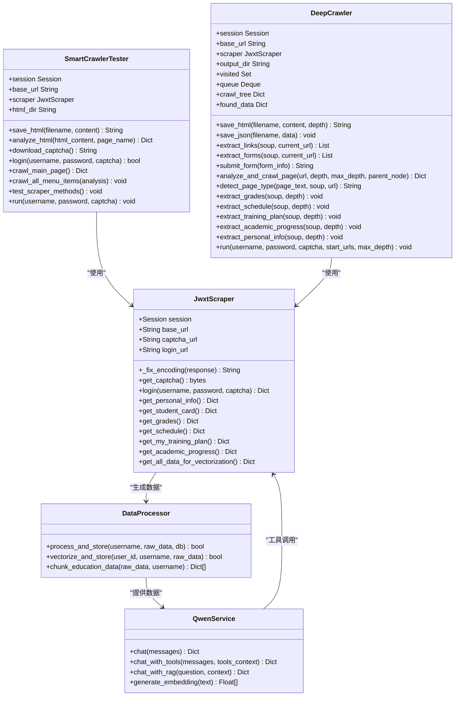
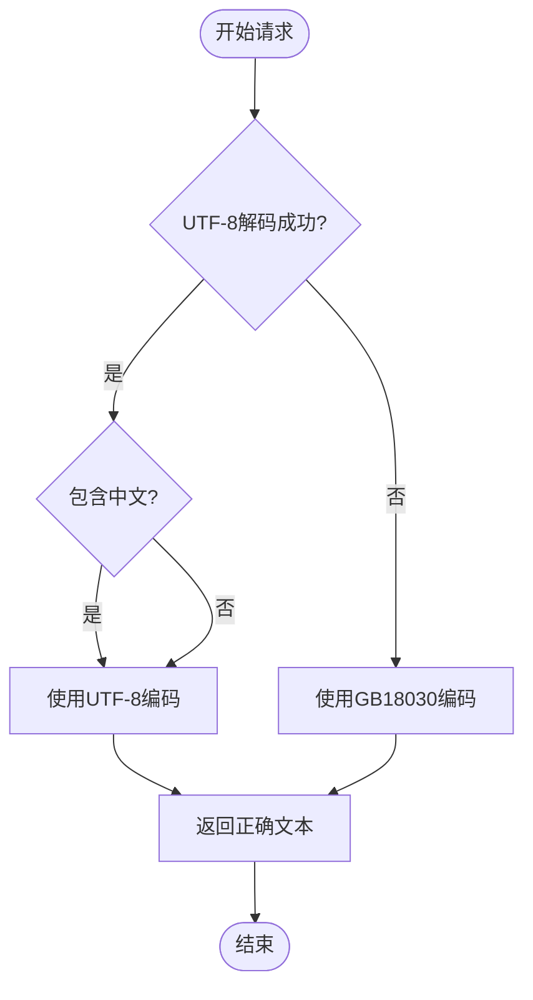
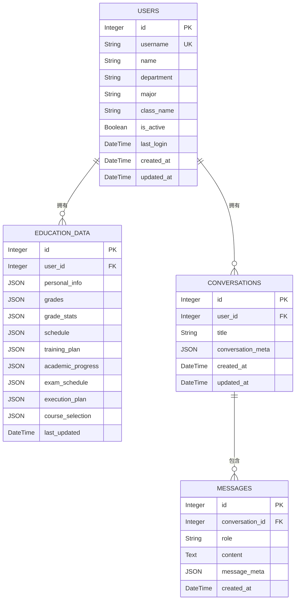
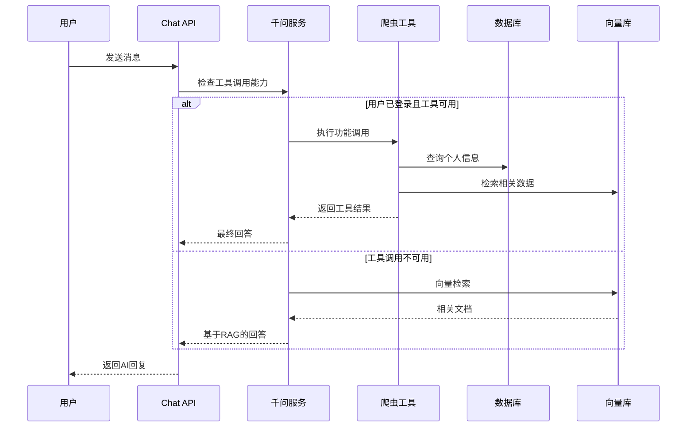
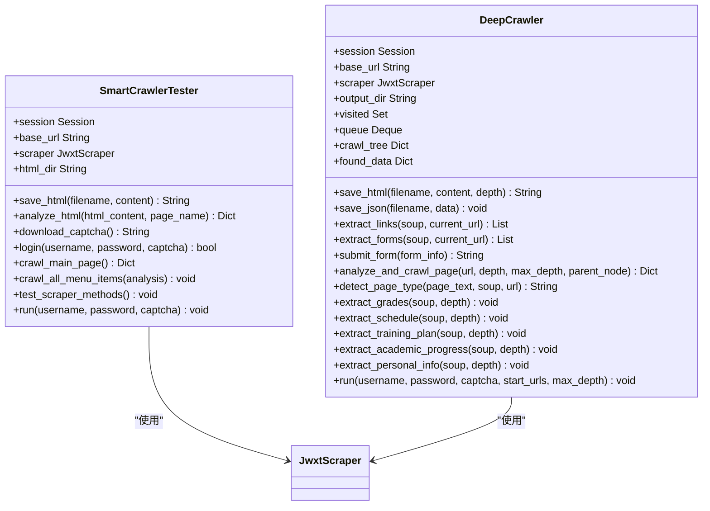
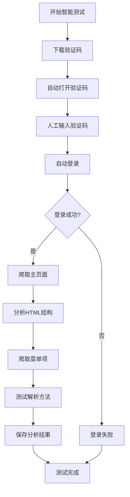
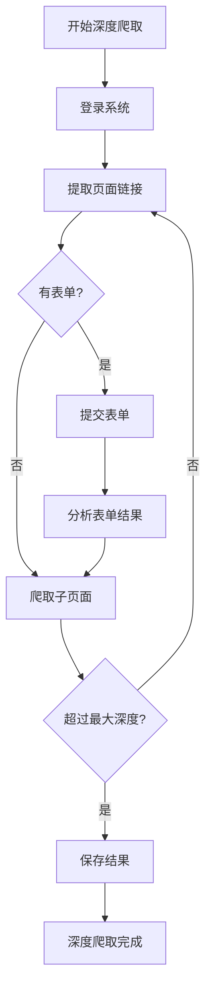
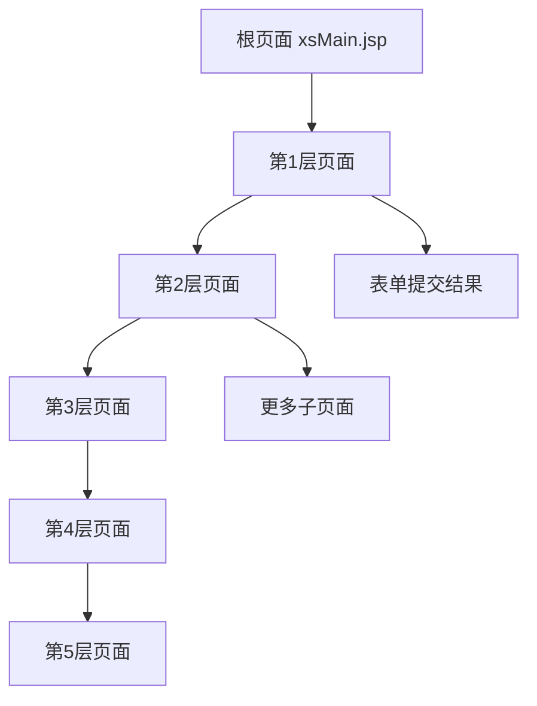
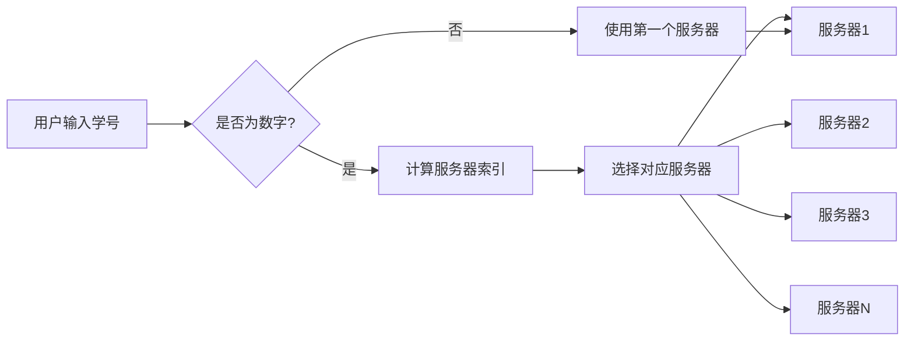

# 爬虫验证报告

<cite>
**本文档引用的文件**
- [backend/main.py](file://backend/main.py)
- [backend/scraper.py](file://backend/scraper.py)
- [backend/test_scraper.py](file://backend/test_scraper.py)
- [backend/test_scraper_live.py](file://backend/test_scraper_live.py)
- [backend/test_login.py](file://backend/test_login.py)
- [backend/requirements.txt](file://backend/requirements.txt)
- [backend/app/models/base.py](file://backend/app/models/base.py)
- [backend/app/models/user.py](file://backend/app/models/user.py)
- [backend/app/models/education_data.py](file://backend/app/models/education_data.py)
- [backend/app/models/conversation.py](file://backend/app/models/conversation.py)
- [backend/app/services/data_processor.py](file://backend/app/services/data_processor.py)
- [backend/app/services/qwen_service.py](file://backend/app/services/qwen_service.py)
- [backend/app/api/chat.py](file://backend/app/api/chat.py)
- [backend/education_options.py](file://backend/education_options.py)
- [smart_crawler_test.py](file://smart_crawler_test.py)
- [deep_crawler.py](file://deep_crawler.py)
- [crawled_html/01_main_page.html](file://crawled_html/01_main_page.html)
- [deep_crawl/found_data.json](file://deep_crawl/found_data.json)
- [README-Windows.md](file://README-Windows.md)
</cite>

## 目录
1. [项目概述](#项目概述)
2. [项目架构](#项目架构)
3. [爬虫核心组件分析](#爬虫核心组件分析)
4. [数据处理与存储](#数据处理与存储)
5. [AI集成与对话系统](#ai集成与对话系统)
6. [智能爬虫测试体系](#智能爬虫测试体系)
7. [深度爬取与HTML分析](#深度爬取与html分析)
8. [性能与稳定性分析](#性能与稳定性分析)
9. [安全与可靠性评估](#安全与可靠性评估)
10. [部署与运维指南](#部署与运维指南)
11. [总结与建议](#总结与建议)

## 项目概述

本项目是一个基于FastAPI开发的教务系统AI助手，集成了网页爬虫、数据处理、向量化存储和智能对话功能。系统能够自动爬取广东财经大学教务系统的个人信息、成绩、课表、考试安排等数据，并通过AI技术提供智能化的教务咨询服务。

### 核心功能特性

- **多服务器负载均衡**：支持14个内网服务器的动态选择和故障转移
- **智能验证码处理**：自动识别和处理教务系统验证码
- **完整的数据爬取**：涵盖个人信息、成绩、课表、培养方案等全方位教务数据
- **AI对话集成**：基于千问大模型的智能问答系统
- **向量化检索**：支持基于Milvus的语义检索
- **实时数据同步**：登录后自动爬取并存储用户数据
- **智能爬虫测试**：新增自动化爬虫测试和深度分析功能
- **HTML保存分析**：提供完整的HTML保存和解析能力

## 项目架构

```mermaid
graph TB
subgraph "客户端层"
Frontend[前端Web应用]
Mobile[移动端应用]
EndCrawlerTest[智能爬虫测试器]
DeepCrawler[深度爬虫]
End
subgraph "API网关层"
FastAPI[FastAPI后端]
Auth[认证中间件]
CORS[CORS跨域]
End
subgraph "业务逻辑层"
Scraper[爬虫模块]
Processor[数据处理器]
ChatAPI[对话API]
Options[选项工具]
End
subgraph "数据存储层"
Postgres[PostgreSQL数据库]
Milvus[Milvus向量库]
Redis[Redis缓存]
End
subgraph "AI服务层"
Qwen[千问大模型]
VectorStore[向量存储]
End
Frontend --> FastAPI
Mobile --> FastAPI
EndCrawlerTest --> Scraper
DeepCrawler --> Scraper
FastAPI --> Scraper
FastAPI --> Processor
FastAPI --> ChatAPI
FastAPI --> Options
Scraper --> Postgres
Processor --> Postgres
Processor --> Milvus
ChatAPI --> Qwen
ChatAPI --> VectorStore
Qwen --> VectorStore
```

**图表来源**
- [backend/main.py:1-951](file://backend/main.py#L1-L951)
- [backend/scraper.py:1-1333](file://backend/scraper.py#L1-L1333)
- [backend/app/services/data_processor.py:1-351](file://backend/app/services/data_processor.py#L1-L351)
- [smart_crawler_test.py:1-416](file://smart_crawler_test.py#L1-L416)
- [deep_crawler.py:1-589](file://deep_crawler.py#L1-L589)

## 爬虫核心组件分析

### JwxtScraper类架构



**图表来源**
- [backend/scraper.py:13-1333](file://backend/scraper.py#L13-L1333)
- [backend/app/services/data_processor.py:13-351](file://backend/app/services/data_processor.py#L13-L351)
- [backend/app/services/qwen_service.py:15-516](file://backend/app/services/qwen_service.py#L15-L516)
- [smart_crawler_test.py:25-416](file://smart_crawler_test.py#L25-L416)
- [deep_crawler.py:27-589](file://deep_crawler.py#L27-L589)

### 编码处理机制

爬虫模块实现了智能的编码检测和处理机制：



**图表来源**
- [backend/scraper.py:22-54](file://backend/scraper.py#L22-L54)

**章节来源**
- [backend/scraper.py:1-1333](file://backend/scraper.py#L1-L1333)

## 数据处理与存储

### 数据库模型设计



**图表来源**
- [backend/app/models/user.py:11-33](file://backend/app/models/user.py#L11-L33)
- [backend/app/models/education_data.py:11-103](file://backend/app/models/education_data.py#L11-L103)
- [backend/app/models/conversation.py:11-42](file://backend/app/models/conversation.py#L11-L42)

### 数据分块策略

数据处理器采用精细化的数据分块策略，确保向量化检索的准确性：

| 数据类型 | 分块策略 | 示例 |
|---------|---------|------|
| 个人信息 | 单独作为一个数据块 | "学生个人信息：姓名XXX，学号XXX，专业XXX" |
| 成绩数据 | 每门课程一个数据块 | "课程成绩：高等数学，学期2024-2025-1，成绩85分" |
| 课表数据 | 按星期分组，每天一个数据块 | "周一课表：第1-2节 高等数学..." |
| 培养方案 | 按课程类别分组，每类一个数据块 | "培养方案 - 专业课：高等数学..." |
| 考试安排 | 每门考试一个数据块 | "考试安排：高等数学，时间2024-01-15" |

**章节来源**
- [backend/app/services/data_processor.py:182-346](file://backend/app/services/data_processor.py#L182-L346)

## AI集成与对话系统

### 对话流程架构



**图表来源**
- [backend/app/api/chat.py:46-179](file://backend/app/api/chat.py#L46-L179)
- [backend/app/services/qwen_service.py:190-321](file://backend/app/services/qwen_service.py#L190-L321)

### 工具调用功能

系统支持以下AI工具调用功能：

| 工具名称 | 功能描述 | 参数 | 返回数据 |
|---------|---------|------|---------|
| query_personal_info | 查询个人信息 | 无 | 姓名、学号、专业、班级、学院 |
| query_grades | 查询成绩 | course_name, semester | 成绩列表、统计信息 |
| query_schedule | 查询课表 | semester, week | 课程安排、时间地点 |
| query_exam_schedule | 查询考试安排 | semester | 考试时间、地点、座位号 |
| query_academic_progress | 查询学业进度 | 无 | 已修学分、还需学分等 |
| refresh_all_data | 刷新所有数据 | 无 | 数据同步状态和概览 |

**章节来源**
- [backend/app/services/qwen_service.py:46-143](file://backend/app/services/qwen_service.py#L46-L143)

## 智能爬虫测试体系

### 测试器架构设计



**图表来源**
- [smart_crawler_test.py:25-416](file://smart_crawler_test.py#L25-L416)
- [deep_crawler.py:27-589](file://deep_crawler.py#L27-L589)

### 自动化测试流程

智能爬虫测试器提供了完全自动化的测试流程：



**图表来源**
- [smart_crawler_test.py:334-366](file://smart_crawler_test.py#L334-L366)

### 深度爬取测试架构

深度爬虫实现了智能的树形结构爬取：



**图表来源**
- [deep_crawler.py:206-354](file://deep_crawler.py#L206-L354)

**章节来源**
- [smart_crawler_test.py:1-416](file://smart_crawler_test.py#L1-L416)
- [deep_crawler.py:1-589](file://deep_crawler.py#L1-L589)

## 深度爬取与HTML分析

### HTML保存与分析功能

系统提供了完整的HTML保存和分析能力：

#### HTML保存功能

| 功能特性 | 描述 | 实现方式 |
|---------|------|---------|
| 自动保存 | 自动保存所有爬取的HTML文件 | `save_html()`方法 |
| 深度分类 | 按爬取深度创建子目录 | `depth_0`, `depth_1`, `depth_2`... |
| 文件命名 | 自动生成规范的文件名 | `depth_filename.html` |
| 编码处理 | 保存UTF-8编码的HTML文件 | `encoding='utf-8'` |

#### HTML分析功能

智能爬虫测试器具备以下HTML分析能力：

| 分析类型 | 功能描述 | 实现方法 |
|---------|---------|---------|
| 链接提取 | 提取所有有效链接 | BeautifulSoup `find_all('a')` |
| 表单分析 | 分析表单结构和字段 | BeautifulSoup `find_all('form')` |
| iframe检测 | 识别嵌入的iframe元素 | BeautifulSoup `find_all('iframe')` |
| JavaScript分析 | 提取JavaScript中的URL | 正则表达式匹配 |
| 页面类型检测 | 自动识别页面类型 | 文本关键词匹配 |

### 爬取结果分析

深度爬取测试生成了丰富的分析结果：

#### 结构化数据提取

深度爬虫能够从HTML中提取结构化数据：

| 数据类型 | 提取方法 | 示例输出 |
|---------|---------|---------|
| 成绩数据 | 表格解析 | `{"课程名称": "高等数学", "成绩": "85", "学分": "4.0"}` |
| 课表数据 | 表格解析 | `{"课程名称": "操作系统", "星期": "周一", "节次": "1-2"}` |
| 培养方案 | 表格解析 | `{"课程类别": "专业课", "课程性质": "必修", "学分": "3"}` |
| 学业进度 | 表格解析 | `{"课程名称": "数据结构", "获得学分": "4.0"}` |
| 个人信息 | 文本提取 | `{"name": "张靖", "student_id": "24251102121"}` |

#### 爬取树结构

深度爬虫维护了完整的爬取树结构：



**图表来源**
- [deep_crawler.py:50-56](file://deep_crawler.py#L50-L56)

### HTML文件示例

系统自动生成了多个HTML文件用于分析：

- `crawled_html/01_main_page.html` - 主页面HTML
- `deep_crawl/depth_0/0__jsxsd_framework_xsMain.jsp.html` - 根页面HTML
- `deep_crawl/depth_1/1__jsxsd_kscj_cjcx_query.html` - 成绩查询页面HTML
- `training_plan_real.html` - 培养方案原始HTML（来自实时测试）

**章节来源**
- [crawled_html/01_main_page.html:1-200](file://crawled_html/01_main_page.html#L1-L200)
- [deep_crawl/found_data.json:1-200](file://deep_crawl/found_data.json#L1-L200)

## 性能与稳定性分析

### 服务器负载均衡策略

系统实现了智能的服务器选择和故障转移机制：



**图表来源**
- [backend/main.py:113-124](file://backend/main.py#L113-L124)

### 性能优化措施

1. **异步处理**：登录成功后使用后台任务自动爬取数据
2. **缓存机制**：使用Redis存储验证码和会话信息
3. **批量向量化**：支持10条数据的批量向量化处理
4. **错误重试**：实现自动重试和故障转移机制
5. **智能爬取**：深度爬取支持最大深度控制，避免无限递归
6. **HTML缓存**：保存所有爬取的HTML文件，便于后续分析

**章节来源**
- [backend/main.py:384-435](file://backend/main.py#L384-L435)
- [backend/app/services/data_processor.py:138-176](file://backend/app/services/data_processor.py#L138-L176)
- [deep_crawler.py:473-526](file://deep_crawler.py#L473-L526)

## 安全与可靠性评估

### 安全防护措施

1. **CORS配置**：开发环境允许所有来源，生产环境限制特定域名
2. **会话管理**：使用内存存储会话信息，生产环境建议使用Redis
3. **验证码保护**：验证码临时存储，使用后立即清理
4. **数据加密**：敏感信息通过HTTPS传输
5. **文件安全**：HTML文件保存在受控目录，避免路径遍历攻击

### 可靠性保障

1. **多服务器冗余**：14个服务器节点提供负载均衡
2. **自动故障转移**：服务器不可用时自动切换到其他节点
3. **数据备份**：PostgreSQL数据库提供数据持久化
4. **监控告警**：集成日志系统进行异常监控
5. **测试完整性**：智能爬虫测试确保解析逻辑正确性

**章节来源**
- [backend/main.py:51-58](file://backend/main.py#L51-L58)
- [backend/app/models/base.py:10-29](file://backend/app/models/base.py#L10-L29)

## 部署与运维指南

### 环境要求

- **Python 3.8+**：推荐使用3.10版本
- **Node.js 18+**：用于前端开发和构建
- **PostgreSQL**：数据库存储
- **Milvus**：向量数据库
- **Redis**：缓存和会话存储

### 依赖包清单

系统使用的主要依赖包包括：

| 依赖类别 | 核心包 | 版本 | 用途 |
|---------|--------|------|------|
| Web框架 | fastapi | 0.115.6 | API框架 |
| | uvicorn | 0.32.1 | ASGI服务器 |
| HTTP请求 | requests | 2.32.3 | HTTP客户端 |
| | aiohttp | 3.11.11 | 异步HTTP客户端 |
| HTML解析 | beautifulsoup4 | 4.12.3 | HTML解析 |
| | lxml | 5.3.0 | XML解析 |
| 爬虫工具 | selenium | 4.27.1 | 浏览器自动化 |
| | webdriver-manager | 4.0.2 | WebDriver管理 |
| 向量数据库 | pymilvus | 2.6.11 | Milvus客户端 |
| AI服务 | dashscope | 1.20.11 | 千问API |
| | langchain | 0.3.14 | LLM框架 |

**章节来源**
- [backend/requirements.txt:1-48](file://backend/requirements.txt#L1-L48)
- [README-Windows.md:353-370](file://README-Windows.md#L353-L370)

## 总结与建议

### 项目优势

1. **完整的功能覆盖**：从数据爬取到AI对话的全链路解决方案
2. **智能的编码处理**：自动适配不同编码格式的网页内容
3. **灵活的架构设计**：支持模块化扩展和功能定制
4. **完善的测试体系**：包含单元测试、集成测试和智能爬虫测试
5. **强大的分析能力**：提供HTML保存和深度分析功能
6. **自动化测试流程**：智能爬虫测试器实现完全自动化测试

### 改进建议

1. **增强错误处理**：增加更详细的异常捕获和恢复机制
2. **优化性能监控**：添加更全面的性能指标和监控告警
3. **提升安全性**：实现更严格的输入验证和权限控制
4. **扩展AI能力**：支持更多类型的AI模型和服务提供商
5. **完善测试覆盖率**：增加更多边界条件和异常场景测试
6. **优化HTML分析算法**：提高解析准确性和处理效率

### 部署建议

1. **生产环境配置**：使用Redis替代内存存储，配置SSL证书
2. **数据库优化**：设置合适的连接池大小和索引策略
3. **监控体系建设**：部署Prometheus和Grafana进行性能监控
4. **备份策略**：建立定期的数据备份和灾难恢复机制
5. **测试环境隔离**：为智能爬虫测试器配置独立的测试环境
6. **HTML文件管理**：建立HTML文件的生命周期管理和清理策略

该项目展现了现代教育技术应用的先进理念，通过技术创新提升了教务服务的智能化水平，为类似项目的开发提供了宝贵的参考经验。新增的智能爬虫测试功能和深度分析能力进一步增强了系统的可靠性和可维护性。