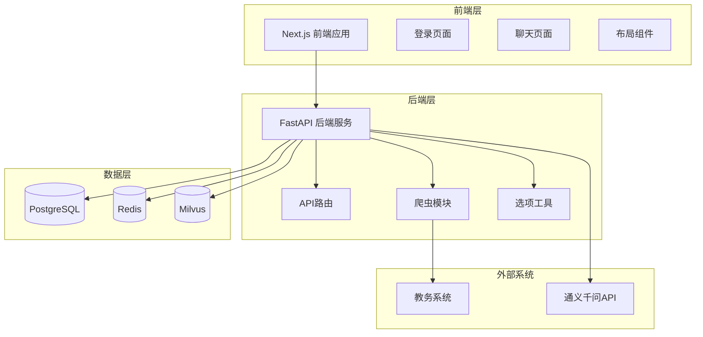
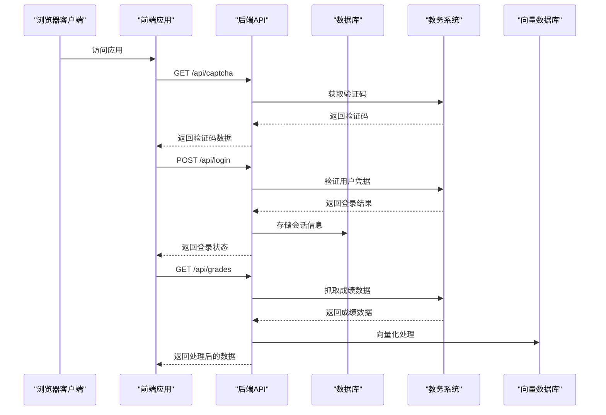
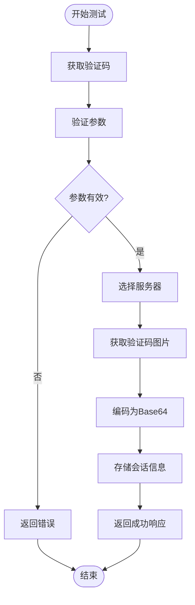
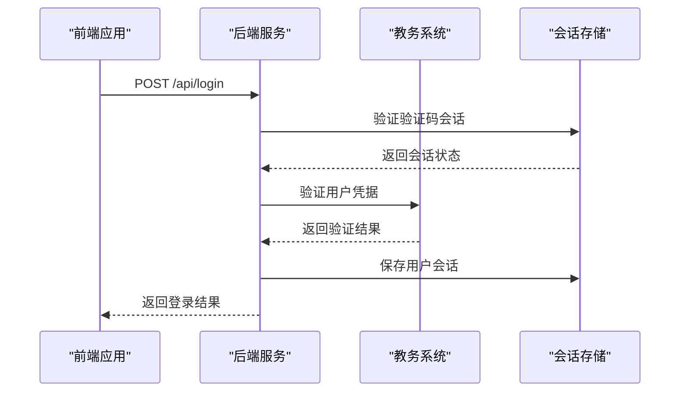
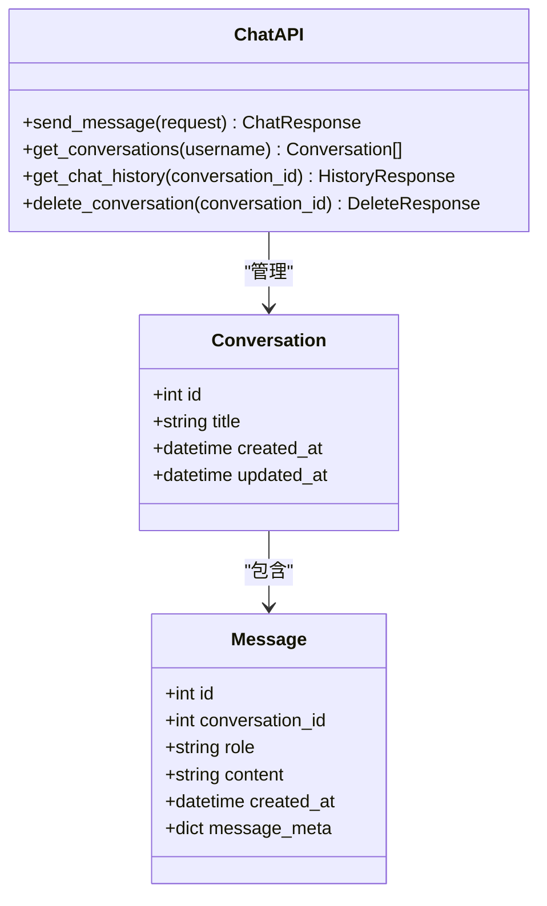
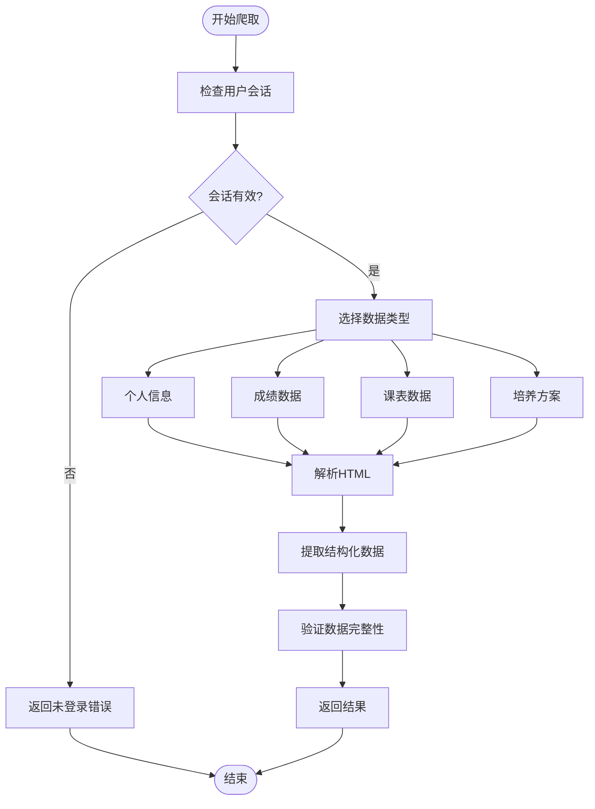
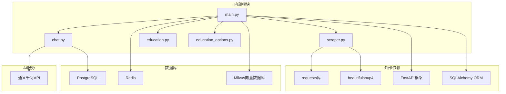
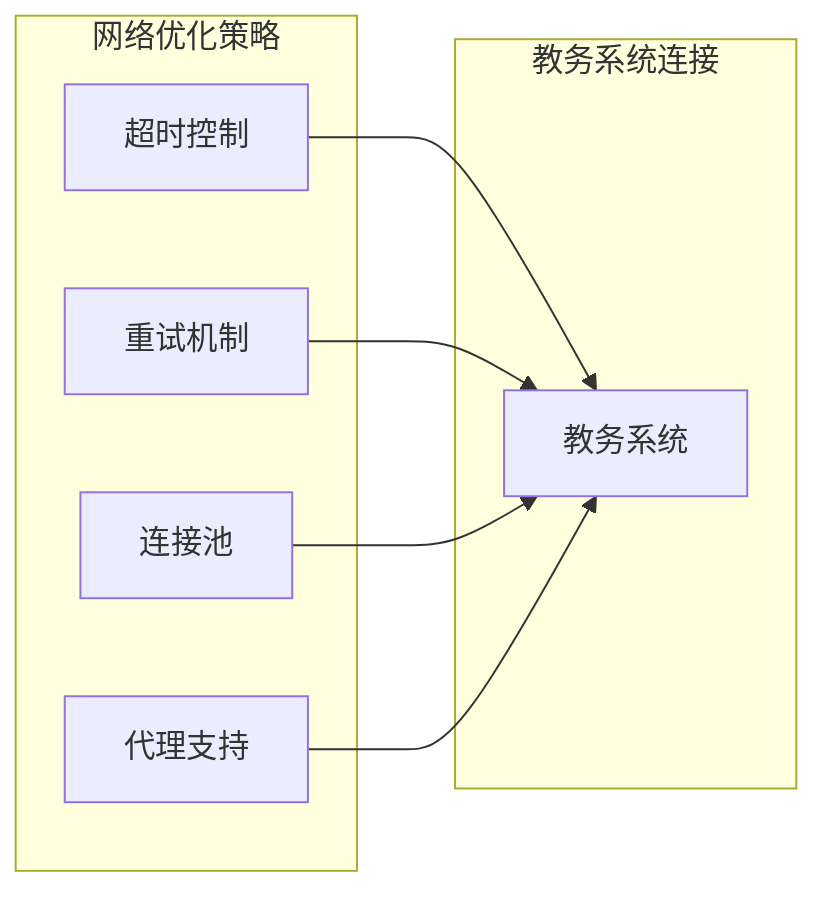

# 集成测试

<cite>
**本文档引用的文件**
- [backend/main.py](file://backend/main.py)
- [backend/app/api/chat.py](file://backend/app/api/chat.py)
- [backend/app/api/education.py](file://backend/app/api/education.py)
- [backend/scraper.py](file://backend/scraper.py)
- [backend/education_options.py](file://backend/education_options.py)
- [backend/test_login.py](file://backend/test_login.py)
- [backend/test_scraper.py](file://backend/test_scraper.py)
- [docker-compose.yml](file://docker-compose.yml)
- [backend/Dockerfile](file://backend/Dockerfile)
- [frontend/Dockerfile](file://frontend/Dockerfile)
- [frontend/src/app/login/page.tsx](file://frontend/src/app/login/page.tsx)
- [frontend/src/app/chat/page.tsx](file://frontend/src/app/chat/page.tsx)
- [frontend/src/app/layout.tsx](file://frontend/src/app/layout.tsx)
- [frontend/src/app/page.tsx](file://frontend/src/app/page.tsx)
</cite>

## 目录
1. [简介](#简介)
2. [项目结构](#项目结构)
3. [核心组件](#核心组件)
4. [架构概览](#架构概览)
5. [详细组件分析](#详细组件分析)
6. [依赖关系分析](#依赖关系分析)
7. [性能考虑](#性能考虑)
8. [故障排除指南](#故障排除指南)
9. [结论](#结论)
10. [附录](#附录)

## 简介

智能教务系统AI助手是一个基于FastAPI的全栈Web应用，集成了AI对话、教务数据查询和爬虫模块。该系统旨在为学生提供智能化的教务信息服务，包括成绩查询、课表管理、培养方案跟踪等功能。

本集成测试策略文档详细介绍了系统的测试方法，包括前后端集成测试、API接口测试、数据流转测试、用户认证集成测试，以及爬虫模块与教务系统的集成测试方法。

## 项目结构

智能教务系统采用前后端分离架构，主要包含以下组件：



**图表来源**
- [backend/main.py:1-120](file://backend/main.py#L1-L120)
- [docker-compose.yml:1-148](file://docker-compose.yml#L1-L148)

**章节来源**
- [backend/main.py:1-120](file://backend/main.py#L1-L120)
- [docker-compose.yml:1-148](file://docker-compose.yml#L1-L148)

## 核心组件

### 后端服务架构

后端服务基于FastAPI框架构建，提供RESTful API接口，主要包含以下核心模块：

1. **认证与会话管理**：处理用户登录、验证码验证和会话存储
2. **数据爬取模块**：从教务系统抓取各类教务数据
3. **AI对话服务**：集成通义千问API提供智能问答功能
4. **选项查询工具**：提供AI工具所需的静态数据选项

### 前端应用架构

前端应用基于Next.js构建，采用客户端渲染模式，主要包含：

1. **登录页面**：处理用户认证流程
2. **聊天页面**：提供AI对话和教务查询功能
3. **路由管理**：基于学号的用户状态管理

**章节来源**
- [backend/main.py:135-328](file://backend/main.py#L135-L328)
- [frontend/src/app/login/page.tsx:1-224](file://frontend/src/app/login/page.tsx#L1-L224)
- [frontend/src/app/chat/page.tsx:1-491](file://frontend/src/app/chat/page.tsx#L1-L491)

## 架构概览

系统采用微服务架构，通过Docker容器化部署，包含以下关键组件：



**图表来源**
- [backend/main.py:192-328](file://backend/main.py#L192-L328)
- [backend/scraper.py:33-60](file://backend/scraper.py#L33-L60)

## 详细组件分析

### 用户认证集成测试

用户认证是系统的核心功能，涉及验证码获取、登录验证和会话管理三个关键流程。

#### 验证码获取流程测试



**图表来源**
- [backend/main.py:135-190](file://backend/main.py#L135-L190)

#### 登录验证流程测试



**图表来源**
- [backend/main.py:192-328](file://backend/main.py#L192-L328)

**章节来源**
- [backend/main.py:135-328](file://backend/main.py#L135-L328)
- [backend/test_login.py:19-152](file://backend/test_login.py#L19-L152)

### API接口测试

系统提供多个RESTful API接口，涵盖教务数据查询、AI对话和选项查询等功能。

#### 教务数据查询API测试

| 接口 | 方法 | 描述 | 认证要求 |
|------|------|------|----------|
| `/api/captcha` | GET | 获取验证码 | 否 |
| `/api/login` | POST | 用户登录 | 否 |
| `/api/user/info` | GET | 获取个人信息 | 是 |
| `/api/grades` | GET | 获取成绩列表 | 是 |
| `/api/schedule` | GET | 获取课表 | 是 |
| `/api/training-plan/my` | GET | 获取培养方案 | 是 |
| `/api/options/departments` | GET | 获取院系选项 | 否 |

#### AI对话API测试



**图表来源**
- [backend/app/api/chat.py:45-224](file://backend/app/api/chat.py#L45-L224)

**章节来源**
- [backend/app/api/chat.py:45-224](file://backend/app/api/chat.py#L45-L224)

### 爬虫模块集成测试

爬虫模块负责从教务系统抓取各类数据，包括个人信息、成绩、课表等。

#### 数据爬取流程测试



**图表来源**
- [backend/scraper.py:61-151](file://backend/scraper.py#L61-L151)

#### 选项查询工具测试

系统提供丰富的选项查询功能，支持AI工具的智能问答。

**章节来源**
- [backend/scraper.py:61-800](file://backend/scraper.py#L61-L800)
- [backend/education_options.py:130-420](file://backend/education_options.py#L130-L420)

## 依赖关系分析

系统采用现代化的技术栈，各组件之间通过清晰的接口进行通信。



**图表来源**
- [backend/main.py:1-800](file://backend/main.py#L1-L800)
- [backend/scraper.py:1-800](file://backend/scraper.py#L1-L800)

**章节来源**
- [backend/main.py:1-800](file://backend/main.py#L1-L800)
- [backend/scraper.py:1-800](file://backend/scraper.py#L1-L800)

## 性能考虑

### 并发处理能力

系统设计支持高并发访问，主要通过以下机制实现：

1. **异步数据库操作**：使用SQLAlchemy异步会话处理数据库查询
2. **会话池管理**：合理配置数据库连接池大小
3. **缓存策略**：利用Redis缓存常用数据和会话信息
4. **向量化查询优化**：Milvus向量数据库提供高效的相似度搜索

### 网络连接优化



## 故障排除指南

### 常见问题及解决方案

#### 登录失败问题

| 问题类型 | 可能原因 | 解决方案 |
|----------|----------|----------|
| 验证码错误 | 验证码过期或输入错误 | 刷新验证码重新输入 |
| 用户名密码错误 | 凭据不正确 | 检查教务系统账号信息 |
| 服务器选择错误 | 学号与服务器不匹配 | 确保输入正确的学号 |
| 会话过期 | 长时间未操作 | 重新登录获取新会话 |

#### 数据查询失败

| 问题类型 | 可能原因 | 解决方案 |
|----------|----------|----------|
| 爬虫解析失败 | 教务系统页面结构变化 | 更新解析逻辑 |
| 网络超时 | 教务系统响应慢 | 增加超时时间或重试 |
| 数据格式错误 | 解析字段不匹配 | 检查数据映射关系 |

**章节来源**
- [backend/test_login.py:19-152](file://backend/test_login.py#L19-L152)
- [backend/test_scraper.py:1-280](file://backend/test_scraper.py#L1-280)

## 结论

智能教务系统AI助手的集成测试策略涵盖了从前端到后端、从API接口到爬虫模块的全方位测试方法。通过合理的测试流程设计和完善的故障排除机制，能够确保系统的稳定性和可靠性。

建议在持续集成环境中定期运行这些测试，以及时发现和解决问题，保证系统的高质量交付。

## 附录

### 测试环境搭建

#### Docker环境配置

系统使用Docker Compose进行容器编排，包含以下服务：

1. **PostgreSQL**：主数据库，存储用户信息和对话历史
2. **Redis**：缓存和会话存储
3. **Milvus**：向量数据库，支持AI功能
4. **前端应用**：Next.js构建的静态网站
5. **后端服务**：FastAPI应用

#### 环境变量配置

| 变量名 | 描述 | 默认值 |
|--------|------|--------|
| POSTGRES_USER | 数据库用户名 | postgres |
| POSTGRES_PASSWORD | 数据库密码 | postgres |
| POSTGRES_DB | 数据库名称 | campus_ai |
| QWEN_API_KEY | 通义千问API密钥 | - |
| JWT_SECRET_KEY | JWT密钥 | your-secret-key-change-in-production |

### 测试数据准备

#### 模拟用户数据

```python
# 测试用户配置
TEST_USERS = [
    {
        "username": "2024110101",
        "password": "test_password",
        "name": "张三",
        "department": "大数据与人工智能学院"
    },
    {
        "username": "2024110102", 
        "password": "test_password",
        "name": "李四",
        "department": "会计学院"
    }
]
```

#### 教务系统测试数据

系统支持多种测试场景，包括：
- 正常登录流程测试
- 验证码过期测试
- 网络连接异常测试
- 数据解析错误测试

**章节来源**
- [docker-compose.yml:1-148](file://docker-compose.yml#L1-L148)