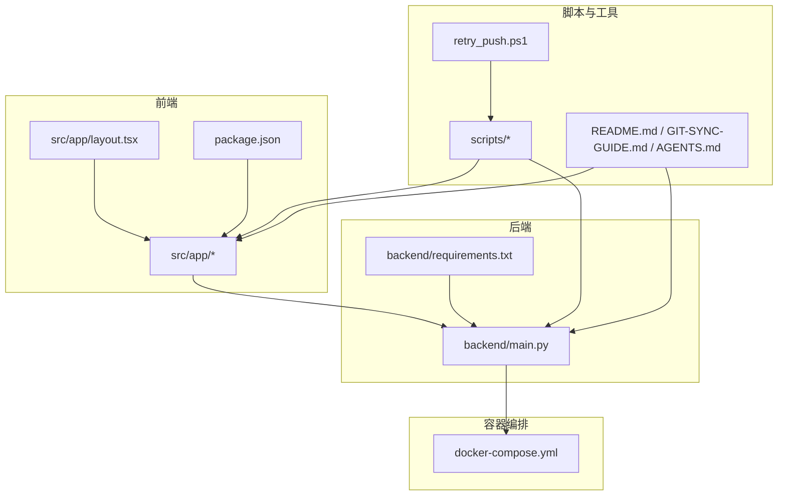
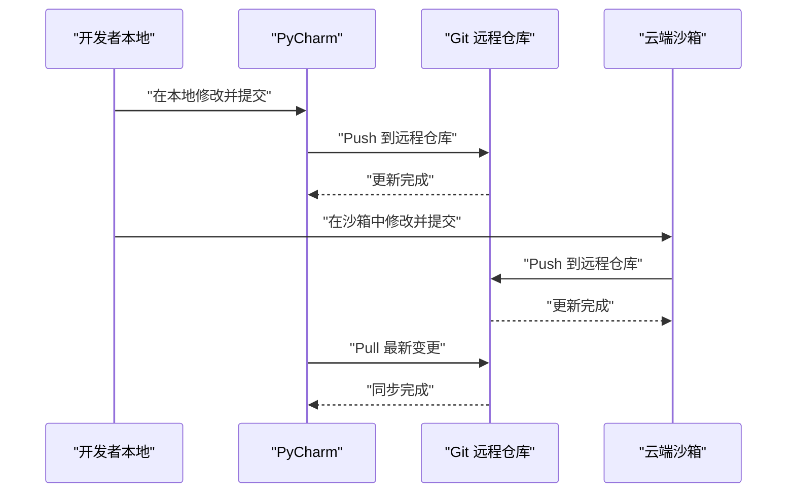
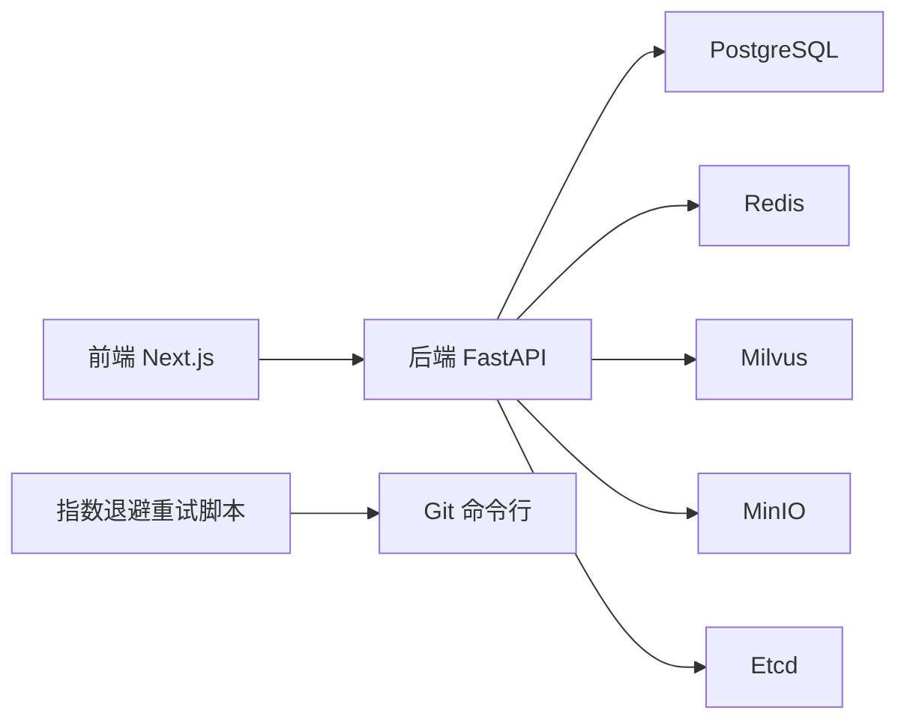

# 版本控制

<cite>
**本文引用的文件**
- [README.md](file://README.md)
- [README-Windows.md](file://README-Windows.md)
- [GIT-SYNC-GUIDE.md](file://GIT-SYNC-GUIDE.md)
- [.gitignore](file://.gitignore)
- [package.json](file://package.json)
- [docker-compose.yml](file://docker-compose.yml)
- [backend/main.py](file://backend/main.py)
- [backend/requirements.txt](file://backend/requirements.txt)
- [frontend/src/app/layout.tsx](file://frontend/src/app/layout.tsx)
- [src/app/layout.tsx](file://src/app/layout.tsx)
- [AGENTS.md](file://AGENTS.md)
- [scripts/build.sh](file://scripts/build.sh)
- [scripts/start.sh](file://scripts/start.sh)
- [scripts/dev.sh](file://scripts/dev.sh)
- [scripts/prepare.sh](file://scripts/prepare.sh)
- [retry_push.ps1](file://retry_push.ps1)
</cite>

## 更新摘要
**变更内容**
- 新增指数退避重试推送脚本章节，介绍 `retry_push.ps1` 的功能特性
- 更新故障排查指南，增加推送失败的自动化解决方案
- 扩展版本控制工具链，提供更完善的Git工作流程支持

## 目录
1. [简介](#简介)
2. [项目结构](#项目结构)
3. [核心组件](#核心组件)
4. [架构总览](#架构总览)
5. [详细组件分析](#详细组件分析)
6. [依赖分析](#依赖分析)
7. [性能考虑](#性能考虑)
8. [故障排查指南](#故障排查指南)
9. [结论](#结论)
10. [附录](#附录)

## 简介
本指南面向"智能教务系统AI助手"项目，提供一套完整的版本控制最佳实践，覆盖Git工作流程、分支管理策略、提交规范、合并流程、代码审查、冲突解决与回滚、标签与发布、以及远程仓库同步与备份策略。目标是在保证代码安全与可追溯性的前提下，提升团队协作效率与交付质量。

**更新** 新增指数退避重试推送脚本，提供自动化、智能化的Git推送解决方案。

## 项目结构
项目采用前后端分离架构，包含前端Next.js应用、后端FastAPI服务、容器编排（Docker Compose）、配套脚本与文档。整体结构清晰，适合实施集中式与功能分支相结合的Git工作流。



**图表来源**
- [README.md:25-41](file://README.md#L25-L41)
- [docker-compose.yml:1-148](file://docker-compose.yml#L1-L148)
- [backend/main.py:1-800](file://backend/main.py#L1-L800)
- [package.json:1-92](file://package.json#L1-L92)
- [retry_push.ps1:1-35](file://retry_push.ps1#L1-L35)

**章节来源**
- [README.md:25-41](file://README.md#L25-L41)
- [docker-compose.yml:1-148](file://docker-compose.yml#L1-L148)
- [backend/main.py:1-800](file://backend/main.py#L1-L800)
- [package.json:1-92](file://package.json#L1-L92)
- [retry_push.ps1:1-35](file://retry_push.ps1#L1-L35)

## 核心组件
- 前端Next.js应用：页面路由、布局、UI组件与工具库，统一使用pnpm进行依赖管理。
- 后端FastAPI服务：提供教务系统登录、数据爬取、AI问答等API。
- 容器编排：通过Docker Compose统一管理数据库、缓存、向量数据库与服务间依赖。
- **自动化工具**：新增指数退避重试推送脚本，提供智能化的Git推送解决方案。
- 脚本与文档：构建、启动、开发与准备脚本，以及同步指南与项目上下文说明。

**更新** 新增指数退避重试推送脚本作为核心组件之一，提供自动化版本控制工具支持。

**章节来源**
- [AGENTS.md:34-55](file://AGENTS.md#L34-L55)
- [docker-compose.yml:1-148](file://docker-compose.yml#L1-L148)
- [backend/main.py:1-800](file://backend/main.py#L1-L800)
- [package.json:1-92](file://package.json#L1-L92)
- [retry_push.ps1:1-35](file://retry_push.ps1#L1-L35)

## 架构总览
下图展示了从开发者本地到远程仓库、再到云端沙箱与PyCharm的同步链路，以及日常开发与发布流程。



**图表来源**
- [GIT-SYNC-GUIDE.md:81-112](file://GIT-SYNC-GUIDE.md#L81-L112)
- [GIT-SYNC-GUIDE.md:186-198](file://GIT-SYNC-GUIDE.md#L186-L198)

**章节来源**
- [GIT-SYNC-GUIDE.md:81-112](file://GIT-SYNC-GUIDE.md#L81-L112)
- [GIT-SYNC-GUIDE.md:186-198](file://GIT-SYNC-GUIDE.md#L186-L198)

## 详细组件分析

### Git工作流程与分支管理策略
- 集中式主干分支：以main为主干，所有稳定发布均通过main分支产出。
- 功能分支（feature/*）：用于实现新功能，命名规范为feature/子系统或功能点，如feature/login-flow。
- 修复分支（bugfix/*）：用于紧急修复，命名规范为bugfix/description，如bugfix/verify-code-session。
- 预发布分支（release/*）：用于准备发布的版本收敛，命名规范为release/vX.Y.Z，如release/v1.2.0。
- 热修复分支（hotfix/*）：用于线上紧急修复，命名规范为hotfix/issue，如hotfix/missing-env-var。

建议流程
- 开发新功能：从main派生feature分支，完成后经代码审查合并至main。
- 修复缺陷：从main派生bugfix分支，修复后合并至main并打标签。
- 准备发布：从main派生release分支，进行最终测试与文档完善，合并至main与develop（如使用双分支模型）。

**章节来源**
- [GIT-SYNC-GUIDE.md:186-198](file://GIT-SYNC-GUIDE.md#L186-L198)

### 提交信息格式标准
建议采用以下格式，确保可读性与自动化工具友好：
- 类型（type）：feat、fix、docs、style、refactor、test、chore、perf、ci、build
- 作用域（scope）：可选，描述影响范围，如backend、frontend、docker、deps
- 描述（description）：简明扼要说明变更内容，首字母小写，不以句号结尾
- 示例：feat(backend): 实现验证码登录接口

**章节来源**
- [GIT-SYNC-GUIDE.md:81-112](file://GIT-SYNC-GUIDE.md#L81-L112)

### 合并流程与代码审查
- Pull Request模板：建议包含变更摘要、影响范围、测试要点、风险评估与回滚预案。
- 审查标准：代码风格一致、无敏感信息泄露、测试覆盖、性能与安全评估、文档更新。
- 合并策略：优先使用squash合并以保持提交历史整洁；复杂变更可使用rebase变基以获得线性历史。

**章节来源**
- [GIT-SYNC-GUIDE.md:81-112](file://GIT-SYNC-GUIDE.md#L81-L112)

### 冲突解决与回滚最佳实践
- 冲突解决：优先使用rebase保持线性历史；冲突集中在功能分支内部解决，避免污染主干。
- 回滚策略：小步快跑，频繁提交与标签；若需回滚，使用git revert生成反向提交，避免强制推送破坏共享历史。
- 常见问题：push被拒绝时，使用git pull --rebase拉取并重放本地提交，再push。

**章节来源**
- [GIT-SYNC-GUIDE.md:141-154](file://GIT-SYNC-GUIDE.md#L141-L154)

### Git标签管理与版本发布
- 标签规范：语义化版本，如v1.2.0；含附注信息的轻量标签用于里程碑标记。
- 发布流程：在release分支完成最终测试后，在main打标签并推送到远程；生成发布说明与变更日志。
- 产物归档：随标签附带构建产物或发布说明，便于审计与回溯。

**章节来源**
- [README.md:382-389](file://README.md#L382-L389)
- [package.json:1-92](file://package.json#L1-L92)

### 远程仓库同步与备份策略
- 同步链路：本地PyCharm ↔ 远程仓库 ↔ 云端沙箱，双向同步，定期pull与push。
- 备份策略：至少两处远程仓库（如Gitee与GitHub），定期导出仓库与分支信息，保留关键标签与提交历史。
- 访问控制：使用个人访问令牌替代密码，限制推送权限，开启保护分支规则。

**章节来源**
- [GIT-SYNC-GUIDE.md:15-78](file://GIT-SYNC-GUIDE.md#L15-L78)
- [GIT-SYNC-GUIDE.md:114-154](file://GIT-SYNC-GUIDE.md#L114-L154)

### .gitignore与敏感信息防护
- 忽略清单：忽略构建产物、依赖缓存、日志、环境变量文件与IDE临时文件，降低仓库膨胀与泄露风险。
- 环境变量：使用.gitignore屏蔽本地.env，通过CI/CD注入密钥；禁止提交任何凭据。

**章节来源**
- [.gitignore:1-101](file://.gitignore#L1-L101)

### 容器化与脚本对版本控制的影响
- Docker Compose：将多服务依赖纳入版本控制，确保一致性；敏感配置通过环境变量注入。
- 构建脚本：build.sh、start.sh、dev.sh、prepare.sh用于标准化构建与启动流程，便于CI/CD集成与回溯。

**章节来源**
- [docker-compose.yml:1-148](file://docker-compose.yml#L1-L148)
- [scripts/build.sh:1-18](file://scripts/build.sh#L1-L18)
- [scripts/start.sh:1-18](file://scripts/start.sh#L1-L18)
- [scripts/dev.sh:1-35](file://scripts/dev.sh#L1-L35)
- [scripts/prepare.sh:1-10](file://scripts/prepare.sh#L1-L10)

### 指数退避重试推送脚本（新增）
**功能概述**
新增的 `retry_push.ps1` PowerShell脚本提供了智能化的Git推送解决方案，专门针对网络不稳定或远程仓库暂时不可用的情况设计。

**核心特性**
- **指数退避算法**：采用2、4、8、16、30、30...秒的等待时间序列，避免过度请求
- **实时进度反馈**：提供详细的执行状态和错误信息输出
- **连续重试机制**：自动循环重试直到推送成功或手动中断
- **智能错误处理**：提取并显示具体的错误信息，便于问题诊断
- **用户友好界面**：彩色输出和中断提示，提升用户体验

**使用场景**
- 网络不稳定导致的推送失败
- 远程仓库维护期间的临时不可用
- CI/CD流水线中的自动化推送
- 批量推送多个分支或标签

**执行方式**
```powershell
# 在项目根目录执行
.\retry_push.ps1
```

**章节来源**
- [retry_push.ps1:1-35](file://retry_push.ps1#L1-L35)

## 依赖分析
- 前端依赖：Next.js、React、Shadcn/UI、Tailwind CSS等，版本在package.json中固定，便于复现与升级。
- 后端依赖：FastAPI、Selenium、BeautifulSoup、LangChain、Milvus、Redis等，集中于requirements.txt，便于容器打包与审计。
- 容器依赖：PostgreSQL、Redis、MinIO、Milvus、Etcd等，通过docker-compose统一管理，确保服务间连通与健康检查。
- **自动化工具依赖**：PowerShell环境、Git命令行工具，确保脚本正常执行。

**更新** 新增自动化工具依赖分析，包括PowerShell和Git命令行工具的要求。



**图表来源**
- [docker-compose.yml:1-148](file://docker-compose.yml#L1-L148)
- [backend/requirements.txt:1-44](file://backend/requirements.txt#L1-L44)
- [package.json:1-92](file://package.json#L1-L92)
- [retry_push.ps1:1-35](file://retry_push.ps1#L1-L35)

**章节来源**
- [docker-compose.yml:1-148](file://docker-compose.yml#L1-L148)
- [backend/requirements.txt:1-44](file://backend/requirements.txt#L1-L44)
- [package.json:1-92](file://package.json#L1-L92)
- [retry_push.ps1:1-35](file://retry_push.ps1#L1-L35)

## 性能考虑
- 提交粒度：小步提交，避免大文件与二进制文件进入仓库；使用Git LFS管理大文件。
- 历史瘦身：定期清理大对象与冗余分支，保持仓库体积可控。
- CI/CD集成：结合脚本与容器化，缩短构建与部署时间，提高迭代速度。
- **自动化工具优化**：指数退避算法减少网络请求频率，避免对远程服务器造成压力。

**更新** 新增自动化工具优化考虑，强调指数退避算法对服务器压力的缓解作用。

## 故障排查指南
- push被拒：使用git pull --rebase拉取并重放，再push；避免强制推送破坏共享历史。
- 身份验证失败：配置全局用户信息，使用个人访问令牌；检查远程仓库URL与权限。
- 本地与沙箱同步：遵循"本地→远程→沙箱"的双向同步流程，定期更新与推送。
- **推送失败自动化处理**：使用 `retry_push.ps1` 脚本自动处理网络不稳定导致的推送失败，无需手动干预。

**更新** 新增推送失败自动化处理章节，介绍指数退避重试脚本的故障排查功能。

**章节来源**
- [GIT-SYNC-GUIDE.md:114-154](file://GIT-SYNC-GUIDE.md#L114-L154)
- [GIT-SYNC-GUIDE.md:186-198](file://GIT-SYNC-GUIDE.md#L186-L198)
- [retry_push.ps1:1-35](file://retry_push.ps1#L1-L35)

## 结论
通过建立规范的分支策略、提交规范、代码审查流程与标签发布机制，并结合容器化与脚本化的工程化手段，本项目可在保障代码安全与可追溯性的同时，显著提升开发效率与交付质量。**新增的指数退避重试推送脚本进一步增强了版本控制系统的可靠性，为网络不稳定环境下的自动化推送提供了智能化解决方案。** 建议团队在实践中持续优化流程，确保版本控制体系与业务发展同步演进。

## 附录
- 常用命令参考
  - 创建分支：git checkout -b feature/new-feature
  - 推送分支：git push -u origin feature/new-feature
  - 拉取并rebase：git pull --rebase
  - 创建标签：git tag -a v1.2.0 -m "Release v1.2.0"
  - 推送标签：git push origin v1.2.0
  - 回滚提交：git revert <commit-hash>
  - 查看差异：git diff HEAD~1 HEAD
  - **指数退避重试推送**：`.\retry_push.ps1`

**更新** 新增指数退避重试推送命令参考。