# 管道管理系统

<cite>
**本文档引用的文件**
- [backend/main.py](file://backend/main.py)
- [backend/mcp_server.py](file://backend/mcp_server.py)
- [backend/app/core/config.py](file://backend/app/core/config.py)
- [backend/app/core/runtime.py](file://backend/app/core/runtime.py)
- [backend/app/api/chat.py](file://backend/app/api/chat.py)
- [backend/app/api/education.py](file://backend/app/api/education.py)
- [backend/app/api/mcp.py](file://backend/app/api/mcp.py)
- [backend/app/api/intake.py](file://backend/app/api/intake.py)
- [backend/app/models/conversation.py](file://backend/app/models/conversation.py)
- [backend/app/services/agent_runtime.py](file://backend/app/services/agent_runtime.py)
- [backend/app/mcp/tools.py](file://backend/app/mcp/tools.py)
- [backend/app/services/data_processor.py](file://backend/app/services/data_processor.py)
- [backend/app/services/vector_store.py](file://backend/app/services/vector_store.py)
- [backend/scraper.py](file://backend/scraper.py)
- [backend/app/services/session_store.py](file://backend/app/services/session_store.py)
- [backend/app/core/observability.py](file://backend/app/core/observability.py)
- [frontend/src/app/layout.tsx](file://frontend/src/app/layout.tsx)
- [frontend/src/app/mcp/page.tsx](file://frontend/src/app/mcp/page.tsx)
</cite>

## 更新摘要
**所做更改**
- 新增了完整的管道基础设施章节，包括任务生命周期管理和SQLite数据库存储
- 更新了架构概览以反映新的任务队列系统
- 添加了GitHub Intake管道的详细说明
- 更新了任务队列和工作进程的实现细节
- 新增了可观测性指标和监控功能
- 更新了故障排除指南以包含管道相关问题

## 目录
1. [简介](#简介)
2. [项目结构](#项目结构)
3. [核心组件](#核心组件)
4. [架构概览](#架构概览)
5. [详细组件分析](#详细组件分析)
6. [管道基础设施](#管道基础设施)
7. [依赖关系分析](#依赖关系分析)
8. [性能考虑](#性能考虑)
9. [故障排除指南](#故障排除指南)
10. [结论](#结论)

## 简介

管道管理系统是一个基于FastAPI构建的智能教务系统助手，集成了AI对话、MCP工具调用、RAG检索增强和数据管道处理等功能。该系统支持多种AI模型提供商，提供流式对话体验，并通过向量数据库实现智能检索。

**更新** 系统现已集成全新的管道基础设施，包括任务生命周期管理、SQLite数据库存储和完整的任务队列系统，支持异步管道执行和实时监控。

系统主要特点：
- 多模态AI对话支持（Function Calling + RAG + 纯对话）
- MCP工具链集成，支持外部工具调用
- 向量数据库检索增强生成（RAG）
- 多种部署模式（本地、Docker）
- 完整的数据处理管道
- **新增** 异步任务队列和管道执行系统
- **新增** SQLite数据库存储和持久化
- **新增** 实时监控和可观测性指标

## 项目结构

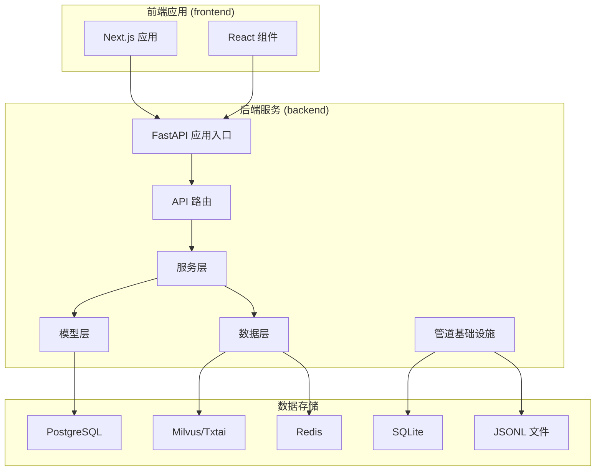

**图表来源**
- [backend/main.py:1-122](file://backend/main.py#L1-L122)
- [backend/app/api/intake.py:121-175](file://backend/app/api/intake.py#L121-L175)
- [frontend/src/app/layout.tsx:1-22](file://frontend/src/app/layout.tsx#L1-L22)

**章节来源**
- [backend/main.py:1-122](file://backend/main.py#L1-L122)
- [frontend/src/app/layout.tsx:1-22](file://frontend/src/app/layout.tsx#L1-L22)

## 核心组件

### API路由系统

系统采用模块化的API路由设计，将不同功能域分离到独立的路由模块中：

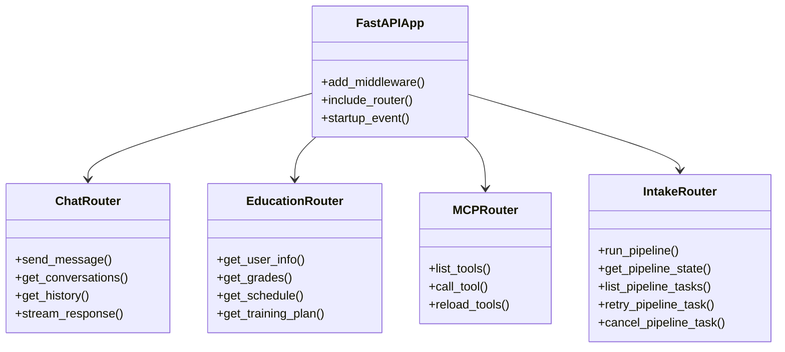

**图表来源**
- [backend/main.py:38-47](file://backend/main.py#L38-L47)
- [backend/app/api/chat.py:82-227](file://backend/app/api/chat.py#L82-L227)
- [backend/app/api/education.py:15-239](file://backend/app/api/education.py#L15-L239)
- [backend/app/api/mcp.py:41-117](file://backend/app/api/mcp.py#L41-L117)
- [backend/app/api/intake.py:33-34](file://backend/app/api/intake.py#L33-L34)

### 会话存储服务

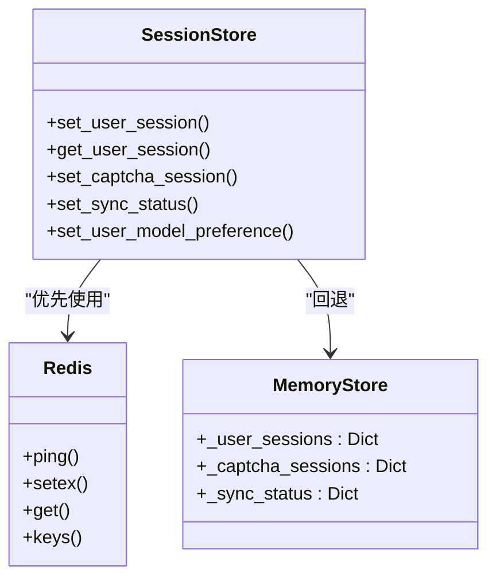

**图表来源**
- [backend/app/services/session_store.py:25-225](file://backend/app/services/session_store.py#L25-L225)

**章节来源**
- [backend/app/services/session_store.py:1-225](file://backend/app/services/session_store.py#L1-L225)

## 架构概览

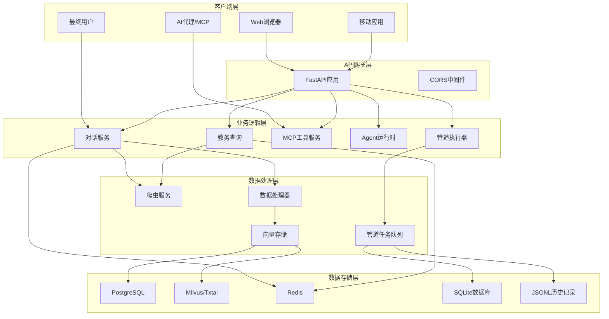

**图表来源**
- [backend/main.py:20-81](file://backend/main.py#L20-L81)
- [backend/app/api/chat.py:82-227](file://backend/app/api/chat.py#L82-L227)
- [backend/app/api/education.py:15-239](file://backend/app/api/education.py#L15-L239)
- [backend/app/api/mcp.py:41-117](file://backend/app/api/mcp.py#L41-L117)
- [backend/app/api/intake.py:121-175](file://backend/app/api/intake.py#L121-L175)

## 详细组件分析

### 对话系统组件

对话系统是整个管道管理的核心组件，实现了多模态的AI交互能力：

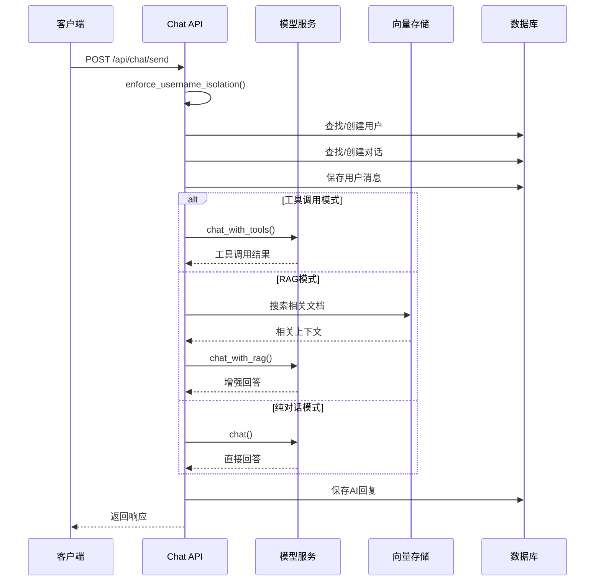

**图表来源**
- [backend/app/api/chat.py:82-227](file://backend/app/api/chat.py#L82-L227)
- [backend/app/api/chat.py:340-577](file://backend/app/api/chat.py#L340-L577)

#### 对话数据模型

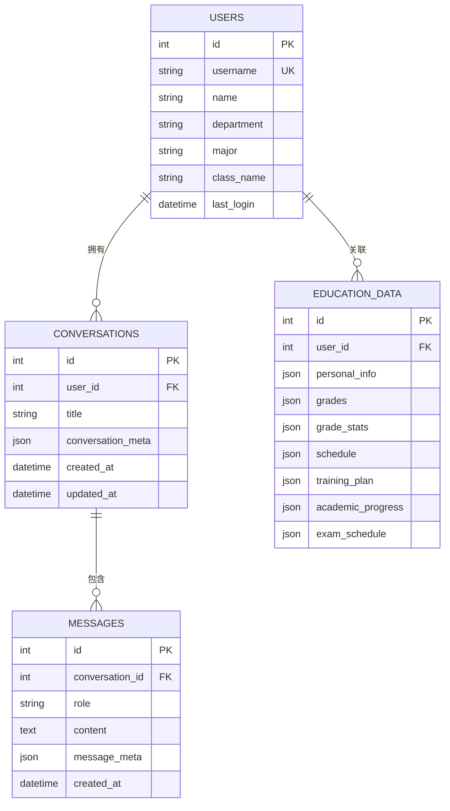

**图表来源**
- [backend/app/models/conversation.py:11-42](file://backend/app/models/conversation.py#L11-L42)

**章节来源**
- [backend/app/api/chat.py:1-609](file://backend/app/api/chat.py#L1-L609)
- [backend/app/models/conversation.py:1-42](file://backend/app/models/conversation.py#L1-L42)

### 教务数据爬取组件

系统实现了完整的教务数据爬取和处理管道：

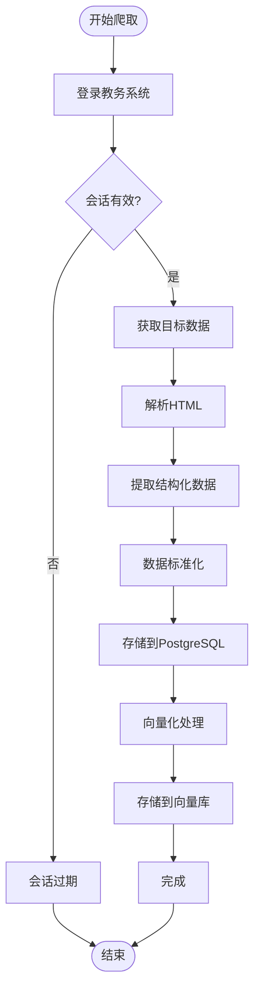

**图表来源**
- [backend/scraper.py:13-800](file://backend/scraper.py#L13-L800)
- [backend/app/services/data_processor.py:63-148](file://backend/app/services/data_processor.py#L63-L148)

#### 支持的教务数据类型

系统支持以下教务数据的爬取和处理：

| 数据类型 | API端点 | 功能描述 |
|---------|---------|----------|
| 个人信息 | `/api/user/info` | 获取学生基本信息（姓名、学号、专业、班级、院系） |
| 学籍卡片 | `/api/user/card` | 获取详细的学籍信息 |
| 成绩查询 | `/api/grades` | 获取成绩列表，支持多种筛选条件 |
| 课表查询 | `/api/schedule` | 获取学期课表，支持按周次查询 |
| 培养方案 | `/api/training-plan/my` | 获取个人培养方案 |
| 学业进度 | `/api/academic-progress` | 获取学业完成进度 |
| 考试安排 | `/api/exam-schedule` | 获取考试时间安排 |
| 教师查询 | `/api/teacher/search` | 搜索教师信息 |
| 课程查询 | `/api/course/search` | 搜索课程信息 |
| 选课信息 | `/api/course-selection` | 获取选课相关信息 |

**章节来源**
- [backend/app/api/education.py:15-239](file://backend/app/api/education.py#L15-L239)
- [backend/scraper.py:95-800](file://backend/scraper.py#L95-L800)

### 向量存储组件

系统提供了灵活的向量存储解决方案，支持多种后端：

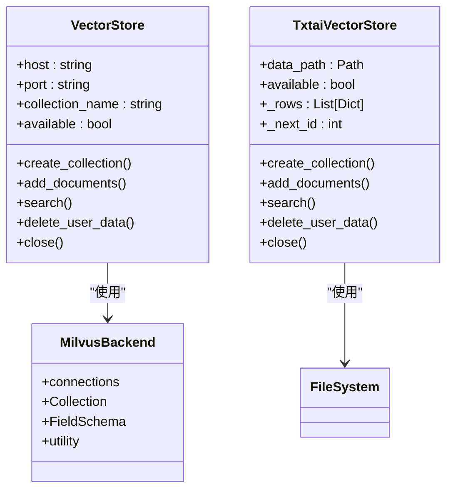

**图表来源**
- [backend/app/services/vector_store.py:21-401](file://backend/app/services/vector_store.py#L21-L401)

**章节来源**
- [backend/app/services/vector_store.py:1-401](file://backend/app/services/vector_store.py#L1-L401)

### MCP工具系统

MCP（Model Context Protocol）工具系统为外部AI代理提供了标准化的工具调用接口：

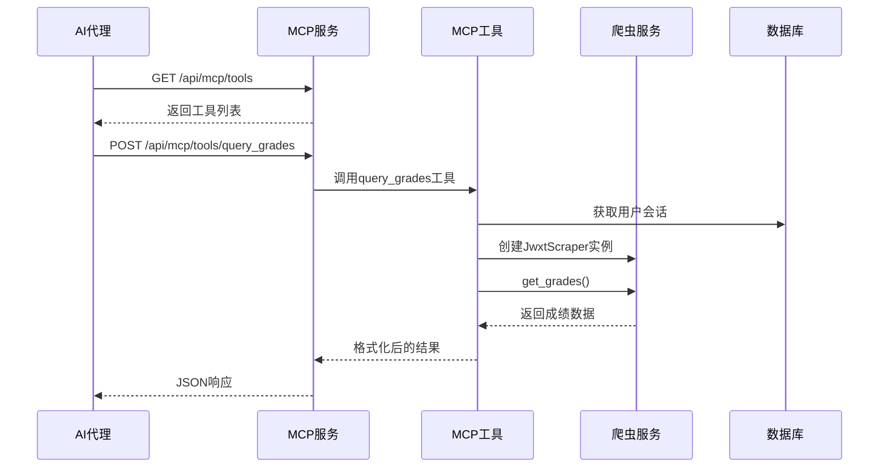

**图表来源**
- [backend/app/api/mcp.py:53-96](file://backend/app/api/mcp.py#L53-L96)
- [backend/app/mcp/tools.py:40-78](file://backend/app/mcp/tools.py#L40-L78)

**章节来源**
- [backend/app/api/mcp.py:1-271](file://backend/app/api/mcp.py#L1-L271)
- [backend/app/mcp/tools.py:1-306](file://backend/app/mcp/tools.py#L1-L306)

## 管道基础设施

**新增** 系统集成了完整的管道基础设施，支持异步任务执行和实时监控。

### GitHub Intake管道

GitHub Intake管道是一个全自动的代码仓库分析和MCP工具生成流水线：

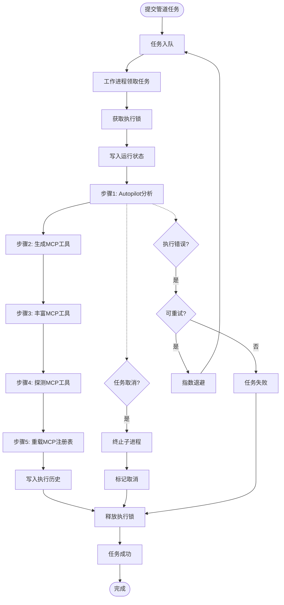

**图表来源**
- [backend/app/api/intake.py:495-650](file://backend/app/api/intake.py#L495-L650)
- [backend/app/api/intake.py:797-895](file://backend/app/api/intake.py#L797-L895)

#### 管道任务生命周期

管道任务具有完整的生命周期管理：

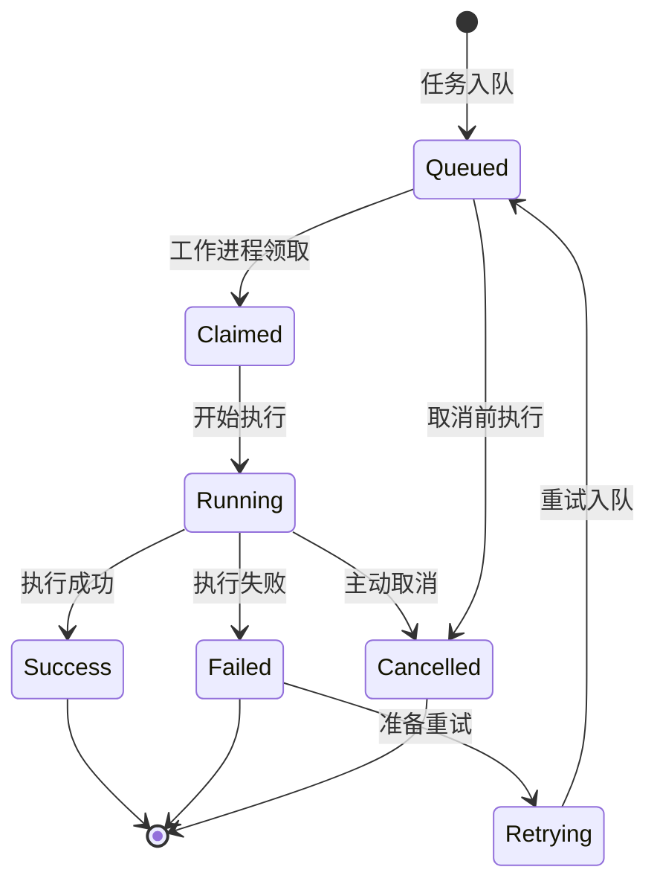

**图表来源**
- [backend/app/api/intake.py:495-650](file://backend/app/api/intake.py#L495-L650)

#### 任务队列系统

系统实现了基于SQLite的任务队列系统：

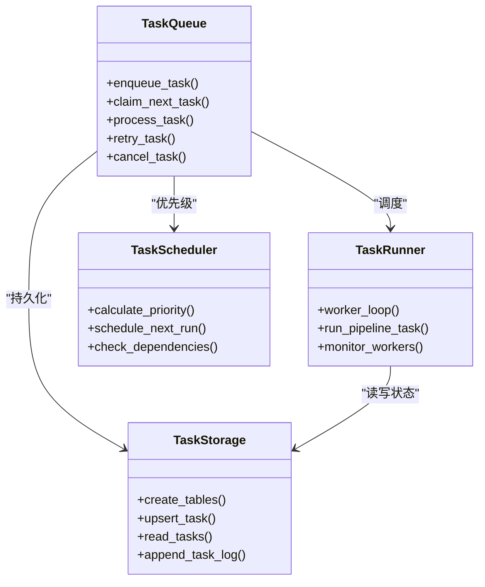

**图表来源**
- [backend/app/api/intake.py:344-411](file://backend/app/api/intake.py#L344-L411)
- [backend/app/api/intake.py:121-175](file://backend/app/api/intake.py#L121-L175)

#### SQLite数据库设计

管道系统使用SQLite作为任务持久化存储：

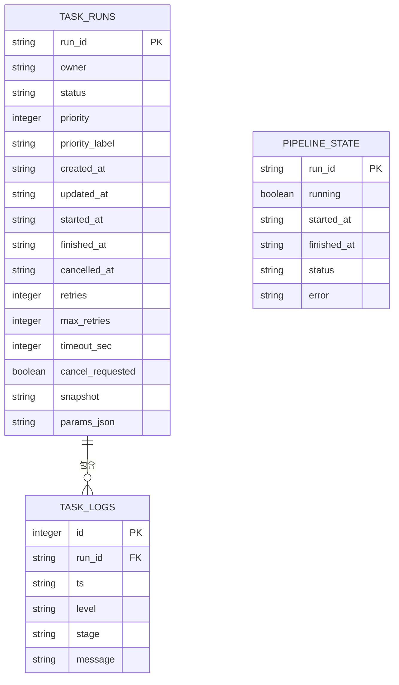

**图表来源**
- [backend/app/api/intake.py:128-154](file://backend/app/api/intake.py#L128-L154)
- [backend/app/api/intake.py:162-169](file://backend/app/api/intake.py#L162-L169)

#### 可观测性指标

系统集成了完整的可观测性指标：

| 指标名称 | 类型 | 描述 | 标签 |
|---------|------|------|------|
| campus_intake_tasks_enqueued_total | Counter | 管道任务入队总数 | 无 |
| campus_intake_tasks_started_total | Counter | 管道任务开始执行总数 | 无 |
| campus_intake_tasks_finished_total | Counter | 管道任务完成总数 | outcome(success, failed, cancelled) |
| campus_intake_task_duration_seconds | Histogram | 管道任务执行时长 | outcome |
| campus_intake_queue_size | Gauge | 当前队列大小 | 无 |
| campus_intake_running_size | Gauge | 当前运行中的任务数 | 无 |

**章节来源**
- [backend/app/api/intake.py:1-1233](file://backend/app/api/intake.py#L1-L1233)
- [backend/app/core/observability.py:1-90](file://backend/app/core/observability.py#L1-L90)

## 依赖关系分析

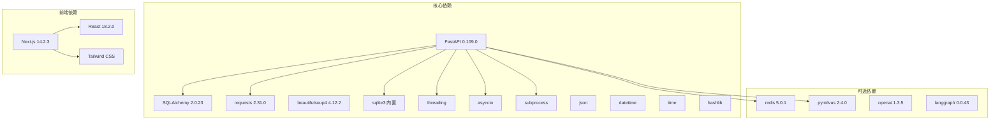

**图表来源**
- [backend/requirements.txt](file://backend/requirements.txt)

**章节来源**
- [backend/app/core/runtime.py:14-26](file://backend/app/core/runtime.py#L14-L26)

## 性能考虑

### 缓存策略

系统采用了多层次的缓存机制来提升性能：

1. **会话缓存**：使用Redis或内存存储用户会话信息
2. **向量缓存**：Milvus向量数据库提供高效的相似性搜索
3. **模型缓存**：支持多种模型提供商的缓存策略
4. **管道缓存**：SQLite数据库提供任务状态持久化

### 异步处理

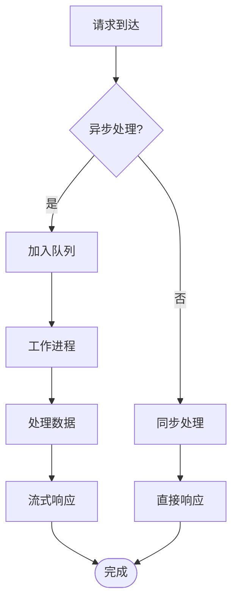

### 数据分块策略

向量存储采用了智能的数据分块策略：

| 数据类型 | 分块策略 | 示例 |
|---------|----------|------|
| 个人信息 | 单独分块 | 姓名、学号、专业、班级、院系 |
| 成绩数据 | 每门课程一个分块 | 课程名称、成绩、学分、学期 |
| 课表数据 | 每天一个分块 | 星期一到星期日的课程列表 |
| 考试安排 | 每门考试一个分块 | 考试时间、地点、课程名称 |
| 培养方案 | 按学期分块 | 每个学期的课程列表 |

### 管道性能优化

**新增** 管道系统采用了多项性能优化策略：

1. **工作进程池**：支持配置的工作进程数量，默认2个
2. **任务优先级**：支持高、正常、低三个优先级
3. **指数退避重试**：失败任务采用指数退避策略
4. **超时控制**：支持任务总超时和步骤超时
5. **幂等性保证**：支持idempotency_key去重
6. **实时监控**：提供SSE流式日志接口

## 故障排除指南

### 常见问题及解决方案

#### 1. 会话过期问题

**症状**：API调用返回"会话已过期"

**原因**：用户登录状态失效

**解决方案**：
- 检查Redis连接状态
- 验证会话存储配置
- 重新登录获取新的会话

#### 2. 向量数据库连接失败

**症状**：向量搜索功能不可用

**原因**：
- Milvus服务未启动
- 网络连接问题
- 配置参数错误

**解决方案**：
- 检查Milvus服务状态
- 验证连接参数
- 切换到Txtai后端进行测试

#### 3. 爬虫数据解析失败

**症状**：教务数据获取失败

**原因**：
- 教务系统页面结构变化
- 网络请求超时
- 编码问题

**解决方案**：
- 检查HTML解析逻辑
- 增加重试机制
- 验证编码处理

#### 4. 管道任务执行失败

**症状**：管道任务无法执行或频繁失败

**原因**：
- SQLite数据库连接问题
- 工作进程异常退出
- 脚本执行权限不足
- 资源限制（CPU/内存/磁盘）

**解决方案**：
- 检查SQLite数据库文件权限
- 验证工作进程配置
- 确认脚本文件存在且可执行
- 监控系统资源使用情况
- 查看任务日志获取详细错误信息

#### 5. 管道队列积压

**症状**：任务队列长时间不为空

**原因**：
- 工作进程数量不足
- 任务执行时间过长
- 系统资源瓶颈

**解决方案**：
- 增加工作进程数量（INTAKE_WORKERS环境变量）
- 优化任务执行效率
- 监控系统资源使用
- 调整任务优先级

#### 6. 实时日志无法获取

**症状**：SSE日志流无法连接或中断

**原因**：
- 网络连接不稳定
- 浏览器兼容性问题
- 服务器配置限制

**解决方案**：
- 检查网络连接稳定性
- 尝试不同的浏览器
- 验证服务器SSE配置
- 检查防火墙设置

**章节来源**
- [backend/app/services/session_store.py:39-54](file://backend/app/services/session_store.py#L39-L54)
- [backend/app/services/vector_store.py:32-49](file://backend/app/services/vector_store.py#L32-L49)
- [backend/scraper.py:48-54](file://backend/scraper.py#L48-L54)
- [backend/app/api/intake.py:466-493](file://backend/app/api/intake.py#L466-L493)

## 结论

管道管理系统是一个功能完整、架构清晰的智能教务系统平台。系统经过全面重构后，主要优势包括：

1. **模块化设计**：各个组件职责明确，便于维护和扩展
2. **多模态AI支持**：集成了Function Calling、RAG和纯对话三种模式
3. **灵活的部署选项**：支持多种后端存储和模型提供商
4. **完整的数据管道**：从爬取到向量化的全流程处理
5. **MCP工具集成**：为外部AI代理提供了标准化的工具调用接口
6. **** **新增** 异步管道执行系统：支持任务队列、工作进程和实时监控
7. **** **新增** SQLite数据库存储：提供可靠的任务状态持久化
8. **** **新增** 完整的可观测性：集成Prometheus指标和SSE日志流

系统在性能方面采用了多种优化策略，包括缓存、异步处理、智能分块和管道并发执行。同时，系统具有良好的可扩展性，可以轻松添加新的功能模块、数据源和管道任务。

未来可以考虑的改进方向：
- 增加更多的AI模型提供商支持
- 优化向量检索算法
- 增强错误处理和监控能力
- 扩展MCP工具生态系统
- **新增** 支持分布式管道执行
- **新增** 增强的管道任务依赖管理
- **新增** 更丰富的可观测性指标