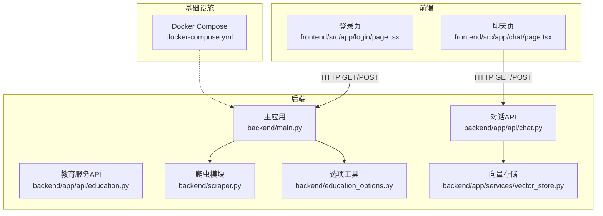
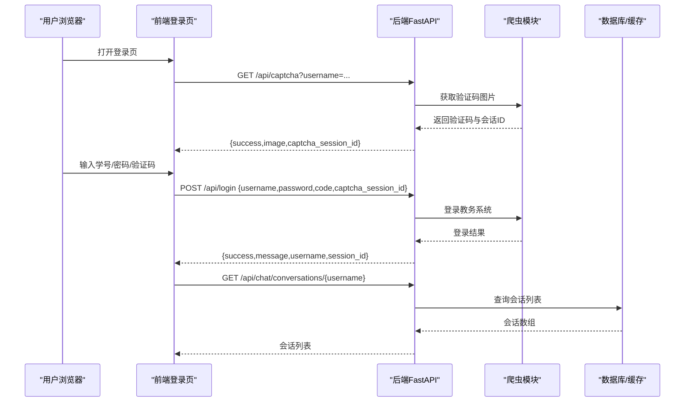
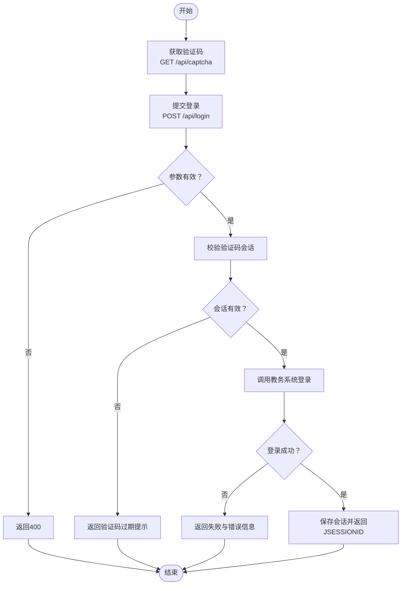
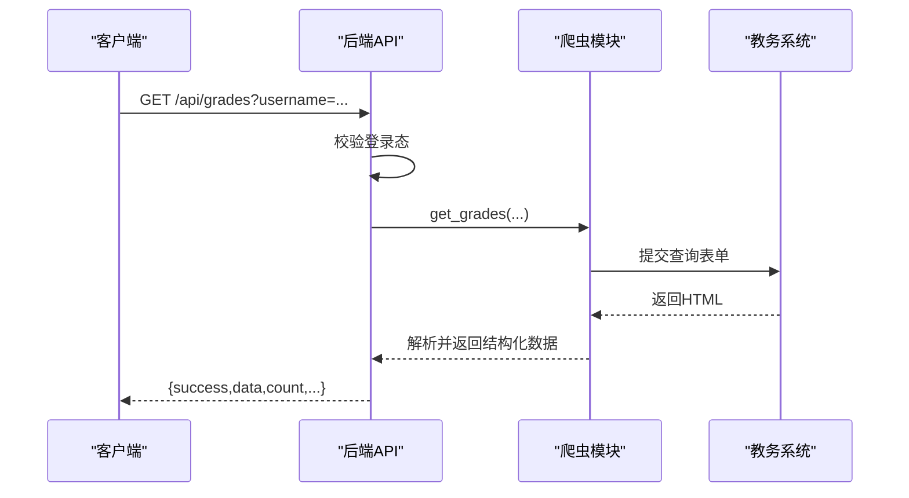
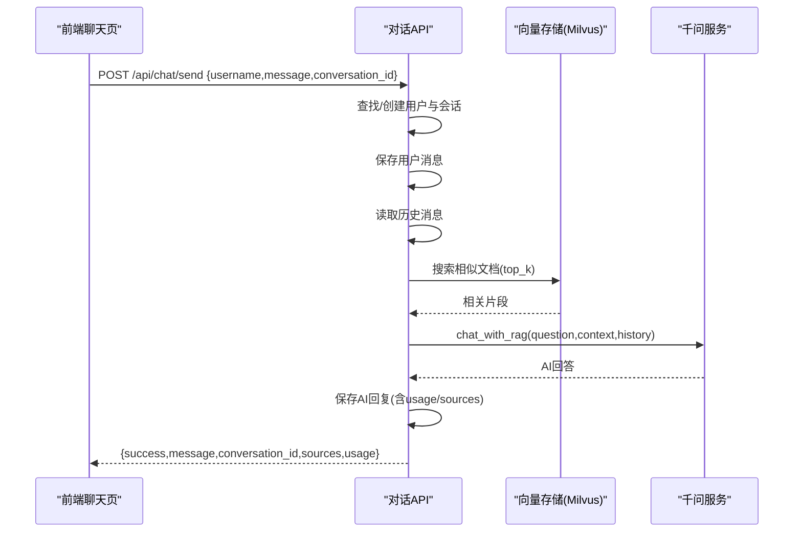
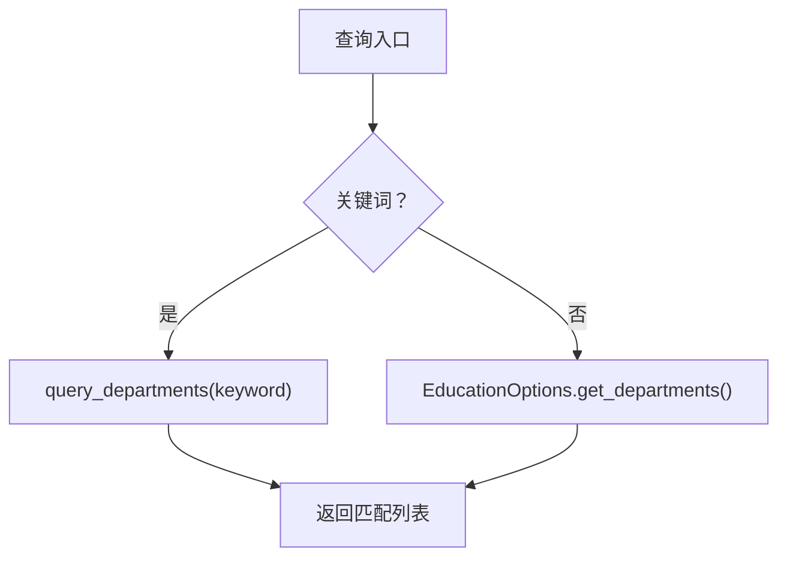
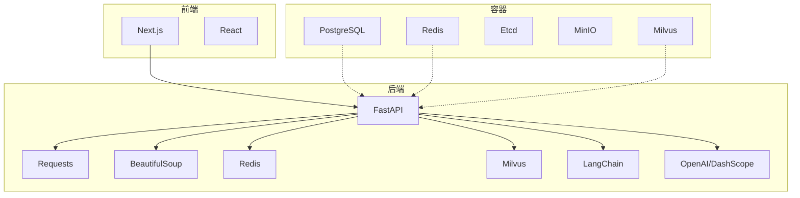

# API调试

<cite>
**本文档引用的文件**
- [backend/main.py](file://backend/main.py)
- [backend/app/api/chat.py](file://backend/app/api/chat.py)
- [backend/app/api/education.py](file://backend/app/api/education.py)
- [backend/scraper.py](file://backend/scraper.py)
- [backend/education_options.py](file://backend/education_options.py)
- [backend/test_login.py](file://backend/test_login.py)
- [backend/test_scraper.py](file://backend/test_scraper.py)
- [frontend/src/app/chat/page.tsx](file://frontend/src/app/chat/page.tsx)
- [frontend/src/app/login/page.tsx](file://frontend/src/app/login/page.tsx)
- [docker-compose.yml](file://docker-compose.yml)
- [scripts/start.sh](file://scripts/start.sh)
- [backend/app/models/__init__.py](file://backend/app/models/__init__.py)
- [backend/app/services/vector_store.py](file://backend/app/services/vector_store.py)
</cite>

## 目录
1. [简介](#简介)
2. [项目结构](#项目结构)
3. [核心组件](#核心组件)
4. [架构总览](#架构总览)
5. [详细组件分析](#详细组件分析)
6. [依赖分析](#依赖分析)
7. [性能考虑](#性能考虑)
8. [故障排查指南](#故障排查指南)
9. [结论](#结论)
10. [附录](#附录)

## 简介
本指南面向智能教务系统AI助手API的调试与运维，覆盖RESTful API调试最佳实践、Postman/curl/HTTP客户端测试、请求/响应格式验证、性能测试、错误处理与安全调试、版本与兼容性测试、文档与契约测试，以及常见问题诊断流程。目标是帮助开发者快速定位问题、稳定交付API能力。

## 项目结构
后端采用FastAPI框架，提供两类API：
- 教务系统数据爬取API：登录、验证码、个人信息、成绩、课表、培养方案、学业进度、考试安排、教师/课程查询、选课与执行计划、全量数据聚合等。
- AI对话API：基于RAG的对话、历史与会话管理。
- 教务系统教育服务API：教育服务封装（异步接口）。

前端Next.js应用通过相对路径经Nginx反向代理访问后端API，提供登录、验证码、聊天对话等功能。

图表来源
- [backend/main.py:1-120](file://backend/main.py#L1-L120)
- [backend/app/api/chat.py:1-50](file://backend/app/api/chat.py#L1-L50)
- [backend/app/api/education.py:1-20](file://backend/app/api/education.py#L1-L20)
- [backend/scraper.py:1-40](file://backend/scraper.py#L1-L40)
- [backend/education_options.py:1-40](file://backend/education_options.py#L1-L40)
- [frontend/src/app/login/page.tsx:18-40](file://frontend/src/app/login/page.tsx#L18-L40)
- [frontend/src/app/chat/page.tsx:45-70](file://frontend/src/app/chat/page.tsx#L45-L70)
- [docker-compose.yml:107-137](file://docker-compose.yml#L107-L137)

章节来源
- [backend/main.py:1-120](file://backend/main.py#L1-L120)
- [frontend/src/app/login/page.tsx:18-40](file://frontend/src/app/login/page.tsx#L18-L40)
- [frontend/src/app/chat/page.tsx:45-70](file://frontend/src/app/chat/page.tsx#L45-L70)
- [docker-compose.yml:107-137](file://docker-compose.yml#L107-L137)

## 核心组件
- FastAPI应用与路由：根路径、健康检查、验证码、登录、各类数据查询接口、选项查询接口。
- 爬虫模块：统一解析教务系统页面，抽取个人信息、成绩、课表、培养方案、学业进度、考试安排等。
- AI对话API：用户/会话/消息模型，RAG检索与千问问答集成，向量存储交互。
- 选项工具：提供院系、学期、课程性质、修读类别、成绩显示方式、星期/节次/周次等静态/动态选项。
- 前端登录与聊天页：通过相对路径调用后端API，处理验证码、登录态、会话列表与历史。

章节来源
- [backend/main.py:95-123](file://backend/main.py#L95-L123)
- [backend/scraper.py:13-60](file://backend/scraper.py#L13-L60)
- [backend/app/api/chat.py:18-42](file://backend/app/api/chat.py#L18-L42)
- [backend/education_options.py:130-260](file://backend/education_options.py#L130-L260)
- [frontend/src/app/login/page.tsx:54-107](file://frontend/src/app/login/page.tsx#L54-L107)
- [frontend/src/app/chat/page.tsx:89-143](file://frontend/src/app/chat/page.tsx#L89-L143)

## 架构总览
后端以FastAPI为核心，统一处理CORS、健康检查、验证码与登录、数据爬取与聚合、AI对话与RAG检索。前端通过Nginx反向代理访问后端API，登录成功后进入聊天界面。

图表来源
- [frontend/src/app/login/page.tsx:20-41](file://frontend/src/app/login/page.tsx#L20-L41)
- [frontend/src/app/login/page.tsx:82-107](file://frontend/src/app/login/page.tsx#L82-L107)
- [backend/main.py:135-189](file://backend/main.py#L135-L189)
- [backend/main.py:192-327](file://backend/main.py#L192-L327)
- [backend/app/api/chat.py:156-178](file://backend/app/api/chat.py#L156-L178)

## 详细组件分析

### 组件A：登录与验证码流程
- 验证码接口：根据学号选择服务器，返回base64图片与会话ID，用于后续登录。
- 登录接口：接收学号、密码、验证码与验证码会话ID，校验参数与会话有效性，调用教务系统登录，返回登录结果与JSESSIONID。
- 登录失败判定：依据响应内容关键字与URL特征判断失败原因，返回明确提示。

图表来源
- [backend/main.py:135-189](file://backend/main.py#L135-L189)
- [backend/main.py:192-327](file://backend/main.py#L192-L327)

章节来源
- [backend/main.py:135-189](file://backend/main.py#L135-L189)
- [backend/main.py:192-327](file://backend/main.py#L192-L327)
- [backend/test_login.py:19-74](file://backend/test_login.py#L19-L74)

### 组件B：数据爬取与聚合
- 支持多种查询：个人信息、学籍卡片、成绩、课表、培养方案、学业进度、考试安排、教师/课程查询、选课与执行计划、全量数据聚合。
- 约定返回结构：统一success布尔值与data字段，部分接口包含count、semester、week等上下文字段。
- 登录态校验：除教师/课程查询外，其余接口均需已登录用户。

图表来源
- [backend/main.py:398-437](file://backend/main.py#L398-L437)
- [backend/scraper.py:153-236](file://backend/scraper.py#L153-L236)

章节来源
- [backend/main.py:398-437](file://backend/main.py#L398-L437)
- [backend/scraper.py:153-236](file://backend/scraper.py#L153-L236)
- [backend/test_scraper.py:103-117](file://backend/test_scraper.py#L103-L117)

### 组件C：AI对话与RAG
- 对话API：发送消息、创建/获取会话、获取历史、删除会话。
- RAG流程：生成问题向量，向量检索，结合历史对话与上下文调用千问生成回答，保存消息与用量/来源信息。
- 向量存储：Milvus集合管理、插入、搜索、删除用户数据。

图表来源
- [backend/app/api/chat.py:45-153](file://backend/app/api/chat.py#L45-L153)
- [backend/app/services/vector_store.py:100-141](file://backend/app/services/vector_store.py#L100-L141)

章节来源
- [backend/app/api/chat.py:45-153](file://backend/app/api/chat.py#L45-L153)
- [backend/app/services/vector_store.py:100-141](file://backend/app/services/vector_store.py#L100-L141)

### 组件D：选项查询工具
- 提供院系、学期、课程性质、修读类别、成绩显示方式、星期/节次/周次等选项。
- 支持AI工具函数：关键词查询、当前学期推断、组合查询等。

图表来源
- [backend/education_options.py:264-286](file://backend/education_options.py#L264-L286)
- [backend/education_options.py:130-260](file://backend/education_options.py#L130-L260)

章节来源
- [backend/education_options.py:264-286](file://backend/education_options.py#L264-L286)
- [backend/education_options.py:130-260](file://backend/education_options.py#L130-L260)

## 依赖分析
- 后端依赖：FastAPI、Uvicorn、Requests、BeautifulSoup、Redis、Milvus、LangChain、OpenAI/DashScope等。
- 前端依赖：Next.js、React、Lucide图标、本地存储。
- 容器编排：PostgreSQL、Redis、Etcd、MinIO、Milvus、Frontend、Backend。

图表来源
- [backend/main.py:5-13](file://backend/main.py#L5-L13)
- [backend/requirements.txt:1-44](file://backend/requirements.txt#L1-L44)
- [docker-compose.yml:1-148](file://docker-compose.yml#L1-L148)

章节来源
- [backend/requirements.txt:1-44](file://backend/requirements.txt#L1-L44)
- [docker-compose.yml:1-148](file://docker-compose.yml#L1-L148)

## 性能考虑
- 并发与超时：请求超时设置、会话复用、避免阻塞操作。
- 缓存策略：登录态与验证码会话短期缓存，Redis用于会话与中间态。
- 向量检索：Milvus索引参数与nprobe调优，top_k合理设置。
- 响应时间监控：对关键接口（登录、验证码、成绩/课表查询）埋点统计。
- 吞吐量评估：压测工具模拟多用户并发登录与查询，观察P95/P99延迟与错误率。

[本节为通用指导，不直接分析具体文件]

## 故障排查指南

### CORS与跨域问题
- 现象：浏览器报跨域错误。
- 排查要点：
  - 检查CORS中间件配置，确认allow_origins、allow_methods、allow_headers。
  - 生产环境限制为具体域名，开发环境允许“*”。
  - 前端通过Nginx反向代理访问后端API，确保Origin与代理头正确。
- 参考
  - [backend/main.py:41-48](file://backend/main.py#L41-L48)
  - [docker-compose.yml:127](file://docker-compose.yml#L127)

章节来源
- [backend/main.py:41-48](file://backend/main.py#L41-L48)
- [docker-compose.yml:127](file://docker-compose.yml#L127)

### 认证与登录失败
- 现象：登录返回失败或验证码过期。
- 排查要点：
  - 验证码会话ID是否传入且未过期；验证码图片与会话ID是否来自同一服务器。
  - 登录参数是否齐全（username/password/code/captcha_session_id）。
  - 教务系统返回内容是否包含“密码错误/验证码错误/用户名不存在”等关键字。
  - 使用测试脚本验证外网/内网服务器连通性与登录流程。
- 参考
  - [backend/main.py:192-327](file://backend/main.py#L192-L327)
  - [backend/test_login.py:19-74](file://backend/test_login.py#L19-L74)

章节来源
- [backend/main.py:192-327](file://backend/main.py#L192-L327)
- [backend/test_login.py:19-74](file://backend/test_login.py#L19-L74)

### 数据格式与字段完整性
- 现象：接口返回结构不符合预期。
- 排查要点：
  - 统一success布尔值与data字段；部分接口包含count、semester、week等上下文字段。
  - 使用测试脚本检查关键方法签名与返回示例，确保字段存在且类型正确。
- 参考
  - [backend/main.py:398-437](file://backend/main.py#L398-L437)
  - [backend/test_scraper.py:213-251](file://backend/test_scraper.py#L213-L251)

章节来源
- [backend/main.py:398-437](file://backend/main.py#L398-L437)
- [backend/test_scraper.py:213-251](file://backend/test_scraper.py#L213-L251)

### 错误处理与HTTP状态码
- 现象：接口返回非2xx状态码或错误消息。
- 排查要点：
  - 400：缺少必要参数或参数非法。
  - 401：未登录或会话失效。
  - 500：内部异常或第三方服务错误。
  - 日志记录：关注关键路径的日志输出，定位异常点。
- 参考
  - [backend/main.py:342-345](file://backend/main.py#L342-L345)
  - [backend/app/api/chat.py:149-153](file://backend/app/api/chat.py#L149-L153)

章节来源
- [backend/main.py:342-345](file://backend/main.py#L342-L345)
- [backend/app/api/chat.py:149-153](file://backend/app/api/chat.py#L149-L153)

### 安全调试
- CORS：生产环境严格限制来源。
- 认证：登录成功后返回JSESSIONID，前端需正确携带Cookie。
- 权限控制：部分接口需登录态，未登录返回401。
- 参考
  - [backend/main.py:41-48](file://backend/main.py#L41-L48)
  - [backend/main.py:342-345](file://backend/main.py#L342-L345)

章节来源
- [backend/main.py:41-48](file://backend/main.py#L41-L48)
- [backend/main.py:342-345](file://backend/main.py#L342-L345)

### 版本与兼容性
- 版本管理：应用版本在根路径返回，接口命名保持稳定。
- 兼容性：新增字段以可选形式返回，保证旧客户端兼容。
- 参考
  - [backend/main.py:95-123](file://backend/main.py#L95-L123)

章节来源
- [backend/main.py:95-123](file://backend/main.py#L95-L123)

### 文档与契约测试
- OpenAPI/Swagger：FastAPI自动生成接口文档，可用于契约测试。
- 契约测试：定义请求/响应模式，自动化验证接口一致性。
- 参考
  - [backend/main.py:39](file://backend/main.py#L39)

章节来源
- [backend/main.py:39](file://backend/main.py#L39)

## 结论
通过本指南的调试方法与最佳实践，可以系统性地验证智能教务系统AI助手API的可用性、稳定性与安全性。建议在开发与生产环境中分别配置CORS策略，完善日志与监控，持续进行性能与兼容性测试，确保用户体验与系统可靠性。

## 附录

### RESTful API调试清单
- 使用Postman/curl/HTTP客户端逐一验证：
  - GET /api/captcha、POST /api/login、GET /api/grades、GET /api/schedule、GET /api/chat/send、GET /api/chat/conversations/{username}
- 校验请求参数与响应结构，关注success与data字段。
- 观察HTTP状态码与错误消息，结合日志定位问题。

### curl示例（示意）
- 获取验证码：curl -X GET "http://localhost:8000/api/captcha?username=学号"
- 登录：curl -X POST "http://localhost:8000/api/login" -H "Content-Type: application/json" -d '{"username":"学号","password":"密码","code":"验证码","captcha_session_id":"会话ID"}'
- 成绩查询：curl "http://localhost:8000/api/grades?username=学号&kksj=&kcxz=&kcmc=&fxkc=0&xsfs=all"

[本节为通用指导，不直接分析具体文件]