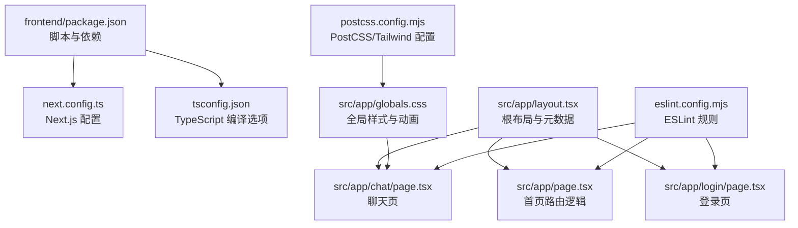
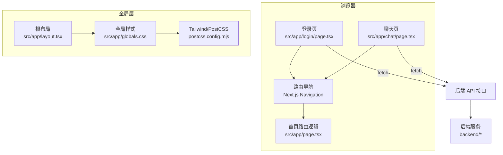
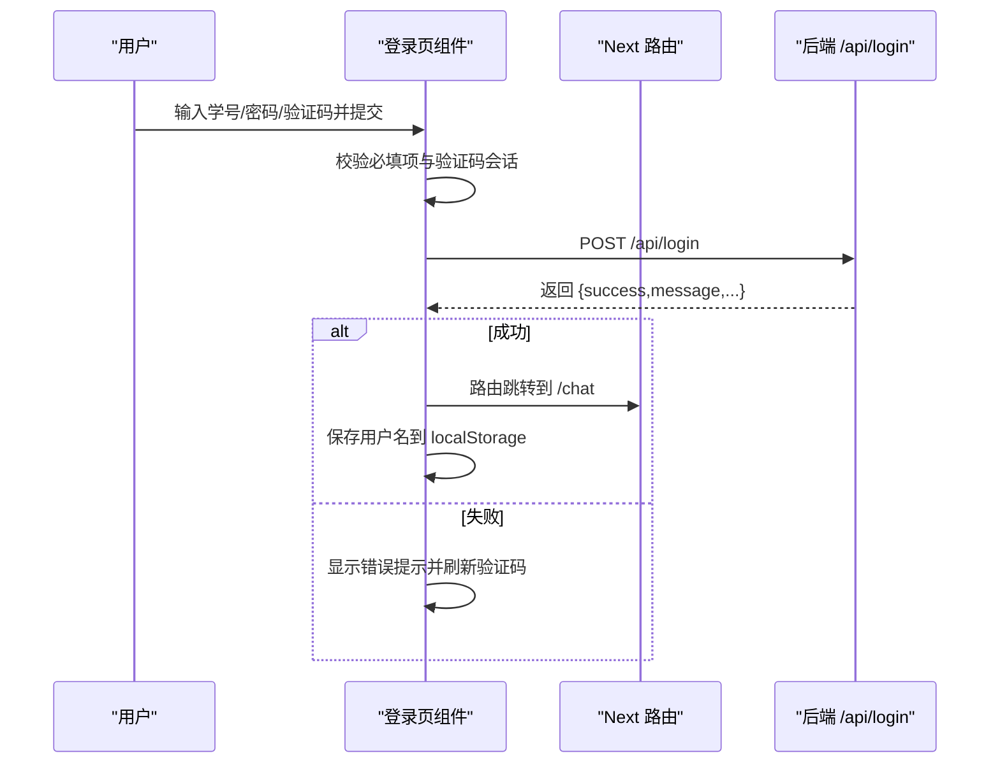
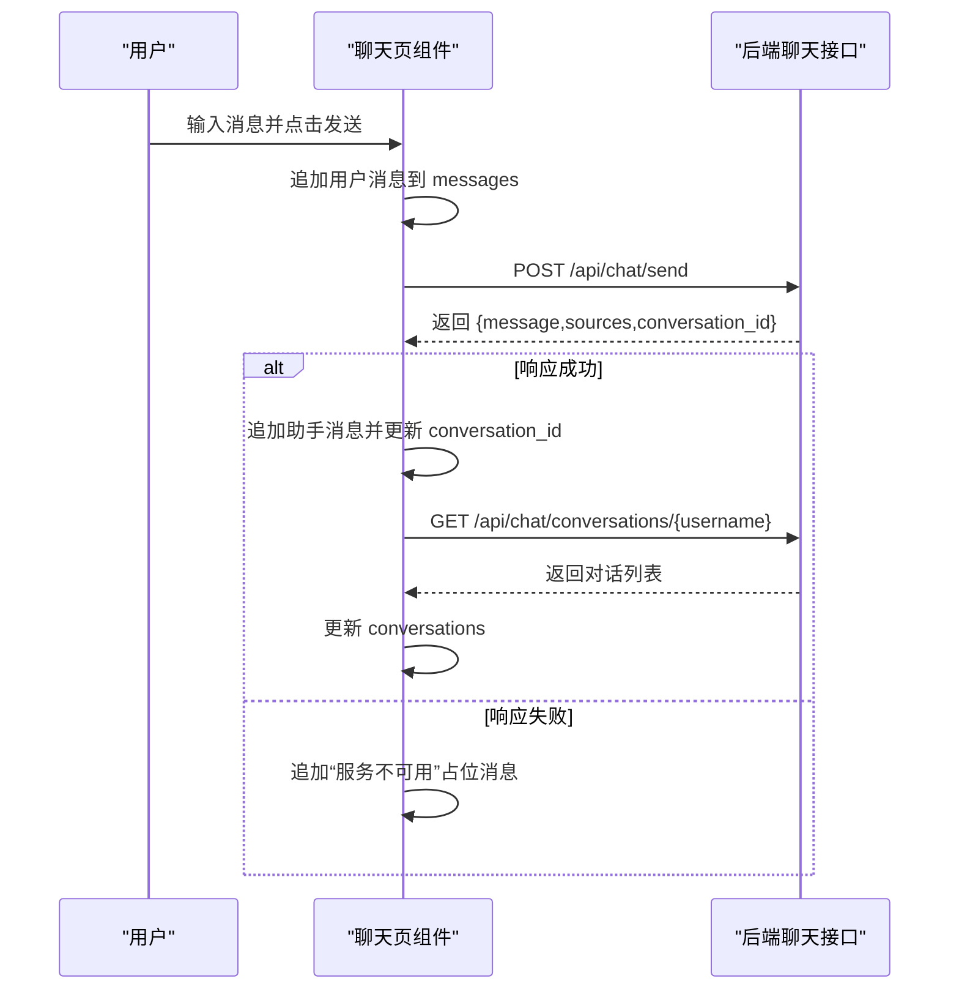
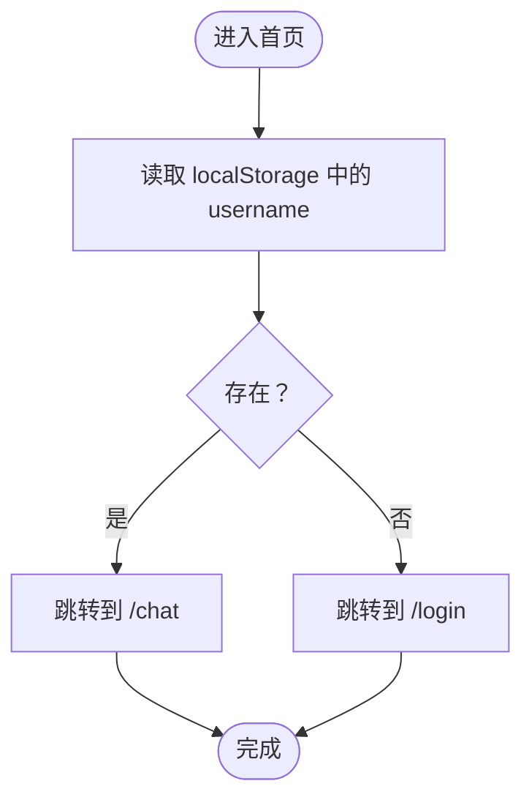
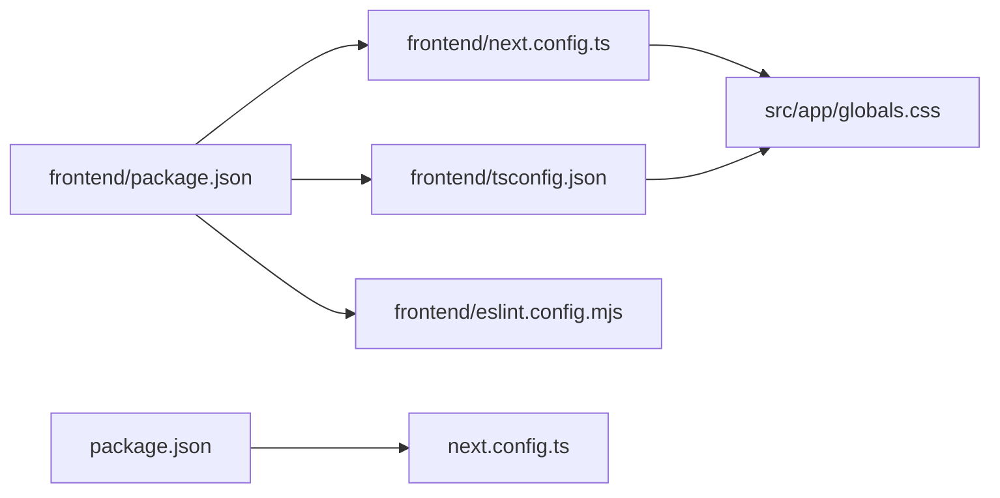

# 前端调试

<cite>
**本文引用的文件**
- [frontend/package.json](file://frontend/package.json)
- [frontend/tsconfig.json](file://frontend/tsconfig.json)
- [frontend/next.config.ts](file://frontend/next.config.ts)
- [frontend/src/app/layout.tsx](file://frontend/src/app/layout.tsx)
- [frontend/src/app/page.tsx](file://frontend/src/app/page.tsx)
- [frontend/src/app/chat/page.tsx](file://frontend/src/app/chat/page.tsx)
- [frontend/src/app/login/page.tsx](file://frontend/src/app/login/page.tsx)
- [frontend/src/app/globals.css](file://frontend/src/app/globals.css)
- [frontend/postcss.config.mjs](file://frontend/postcss.config.mjs)
- [frontend/eslint.config.mjs](file://frontend/eslint.config.mjs)
- [package.json](file://package.json)
- [next.config.ts](file://next.config.ts)
</cite>

## 目录
1. [简介](#简介)
2. [项目结构](#项目结构)
3. [核心组件](#核心组件)
4. [架构总览](#架构总览)
5. [详细组件分析](#详细组件分析)
6. [依赖分析](#依赖分析)
7. [性能考虑](#性能考虑)
8. [故障排查指南](#故障排查指南)
9. [结论](#结论)
10. [附录](#附录)

## 简介
本指南面向智能教务系统AI助手前端（Next.js 应用），提供系统化的调试方法与实践建议，涵盖浏览器开发者工具、React DevTools、TypeScript 源映射、网络请求监控、组件状态与生命周期调试、CSS/样式调试、性能分析工具，以及常见问题的诊断与修复流程。文中所有调试步骤均结合仓库中的实际配置与页面实现进行说明。

## 项目结构
该仓库采用前后端分离结构，前端位于 frontend 目录，使用 Next.js 16、TypeScript 5、TailwindCSS 4 与 React 19。关键目录与文件如下：
- 应用入口与全局样式：src/app/layout.tsx、src/app/globals.css
- 页面：src/app/page.tsx（首页路由逻辑）、src/app/login/page.tsx（登录页）、src/app/chat/page.tsx（聊天页）
- 构建与运行脚本：frontend/package.json、next.config.ts、tsconfig.json
- 样式与工具链：postcss.config.mjs、eslint.config.mjs

图表来源
- [frontend/package.json:1-92](file://frontend/package.json#L1-L92)
- [frontend/next.config.ts:1-21](file://frontend/next.config.ts#L1-L21)
- [frontend/tsconfig.json:1-35](file://frontend/tsconfig.json#L1-L35)
- [frontend/src/app/layout.tsx:1-22](file://frontend/src/app/layout.tsx#L1-L22)
- [frontend/src/app/page.tsx:1-28](file://frontend/src/app/page.tsx#L1-L28)
- [frontend/src/app/login/page.tsx:1-224](file://frontend/src/app/login/page.tsx#L1-L224)
- [frontend/src/app/chat/page.tsx:1-491](file://frontend/src/app/chat/page.tsx#L1-L491)
- [frontend/src/app/globals.css:1-70](file://frontend/src/app/globals.css#L1-L70)
- [frontend/postcss.config.mjs:1-8](file://frontend/postcss.config.mjs#L1-L8)
- [frontend/eslint.config.mjs:1-29](file://frontend/eslint.config.mjs#L1-L29)

章节来源
- [frontend/package.json:1-92](file://frontend/package.json#L1-L92)
- [frontend/next.config.ts:1-21](file://frontend/next.config.ts#L1-L21)
- [frontend/tsconfig.json:1-35](file://frontend/tsconfig.json#L1-L35)
- [frontend/src/app/layout.tsx:1-22](file://frontend/src/app/layout.tsx#L1-L22)
- [frontend/src/app/page.tsx:1-28](file://frontend/src/app/page.tsx#L1-L28)
- [frontend/src/app/login/page.tsx:1-224](file://frontend/src/app/login/page.tsx#L1-L224)
- [frontend/src/app/chat/page.tsx:1-491](file://frontend/src/app/chat/page.tsx#L1-L491)
- [frontend/src/app/globals.css:1-70](file://frontend/src/app/globals.css#L1-L70)
- [frontend/postcss.config.mjs:1-8](file://frontend/postcss.config.mjs#L1-L8)
- [frontend/eslint.config.mjs:1-29](file://frontend/eslint.config.mjs#L1-L29)

## 核心组件
- 根布局与元数据：负责注入全局样式与站点元信息，确保页面基础样式一致。
- 首页路由逻辑：根据本地存储的用户名决定跳转至聊天页或登录页。
- 登录页：包含学号、密码、验证码输入与提交流程；支持动态刷新验证码与错误提示。
- 聊天页：实现消息列表、输入框、侧边栏对话历史管理、快捷问题、在线状态与加载态等交互。

章节来源
- [frontend/src/app/layout.tsx:1-22](file://frontend/src/app/layout.tsx#L1-L22)
- [frontend/src/app/page.tsx:1-28](file://frontend/src/app/page.tsx#L1-L28)
- [frontend/src/app/login/page.tsx:1-224](file://frontend/src/app/login/page.tsx#L1-L224)
- [frontend/src/app/chat/page.tsx:1-491](file://frontend/src/app/chat/page.tsx#L1-L491)

## 架构总览
前端采用客户端渲染（CSR）模式，页面通过 Next.js 的 App Router 组织。聊天与登录页面均标记为客户端组件，使用 React Hooks 管理状态与副作用。样式通过 TailwindCSS 与自定义 CSS 实现，PostCSS 负责编译。

图表来源
- [frontend/src/app/login/page.tsx:1-224](file://frontend/src/app/login/page.tsx#L1-L224)
- [frontend/src/app/chat/page.tsx:1-491](file://frontend/src/app/chat/page.tsx#L1-L491)
- [frontend/src/app/page.tsx:1-28](file://frontend/src/app/page.tsx#L1-L28)
- [frontend/src/app/layout.tsx:1-22](file://frontend/src/app/layout.tsx#L1-L22)
- [frontend/src/app/globals.css:1-70](file://frontend/src/app/globals.css#L1-L70)
- [frontend/postcss.config.mjs:1-8](file://frontend/postcss.config.mjs#L1-L8)

## 详细组件分析

### 登录页调试要点
- 网络请求调试：在登录提交前与后，利用浏览器 Network 面板观察 /api/login 请求的请求体、响应体与状态码；结合控制台日志定位参数校验与错误分支。
- 参数校验与错误提示：关注必填项校验、验证码会话有效性与刷新逻辑；当失败时应清空验证码并重新获取。
- 客户端状态：用户名、密码、验证码、显示/隐藏密码、加载态与错误信息的状态变化。
- 生命周期钩子：useEffect 中的验证码初始化与用户名变更后的延迟刷新。

图表来源
- [frontend/src/app/login/page.tsx:54-107](file://frontend/src/app/login/page.tsx#L54-L107)

章节来源
- [frontend/src/app/login/page.tsx:1-224](file://frontend/src/app/login/page.tsx#L1-L224)

### 聊天页调试要点
- 状态与副作用：messages、conversations、currentConversationId、sidebarOpen、username 等状态的联动更新；useEffect 中的滚动到底部与历史拉取。
- 网络请求调试：监控 /api/chat/conversations/*、/api/chat/history/*、/api/chat/send 与 DELETE /api/chat/conversations/*；关注响应结构与错误兜底消息。
- 交互细节：快捷问题填充、回车发送、移动端侧边栏开关、删除对话后的状态同步。
- 性能与体验：加载态、时间戳格式化、平滑滚动与动画类名。

图表来源
- [frontend/src/app/chat/page.tsx:89-143](file://frontend/src/app/chat/page.tsx#L89-L143)
- [frontend/src/app/chat/page.tsx:56-87](file://frontend/src/app/chat/page.tsx#L56-L87)

章节来源
- [frontend/src/app/chat/page.tsx:1-491](file://frontend/src/app/chat/page.tsx#L1-L491)

### 首页路由逻辑调试要点
- 路由决策：根据 localStorage 中是否存在 username 决定跳转到 /chat 或 /login。
- 加载态：展示旋转加载图标与提示文本，避免空白屏。

图表来源
- [frontend/src/app/page.tsx:9-17](file://frontend/src/app/page.tsx#L9-L17)

章节来源
- [frontend/src/app/page.tsx:1-28](file://frontend/src/app/page.tsx#L1-L28)

### 样式与布局调试要点
- 全局样式：检查全局背景渐变、滚动条样式与动画类名是否生效。
- Tailwind/PostCSS：确认 Tailwind 插件已启用，构建产物中样式是否正确注入。
- 响应式布局：在设备切换模式下观察侧边栏、消息卡片与输入框的适配表现。

章节来源
- [frontend/src/app/globals.css:1-70](file://frontend/src/app/globals.css#L1-L70)
- [frontend/postcss.config.mjs:1-8](file://frontend/postcss.config.mjs#L1-L8)

## 依赖分析
- 构建与运行：前端与根目录共享的 package.json 提供统一的开发、构建与启动脚本，端口均为 5000。
- Next.js 配置：frontend/next.config.ts 设置输出模式为静态导出（export）、distDir 与允许的开发来源；顶层 next.config.ts 仅保留图片远程模式配置。
- TypeScript：严格模式、不输出 JS、模块解析为 bundler、路径别名 @/* 指向 src/*。
- ESLint：基于 next/typescript 与 core-web-vitals，关闭特定规则以适配项目风格。

图表来源
- [frontend/package.json:1-92](file://frontend/package.json#L1-L92)
- [frontend/next.config.ts:1-21](file://frontend/next.config.ts#L1-L21)
- [frontend/tsconfig.json:1-35](file://frontend/tsconfig.json#L1-L35)
- [frontend/eslint.config.mjs:1-29](file://frontend/eslint.config.mjs#L1-L29)
- [package.json:1-92](file://package.json#L1-L92)
- [next.config.ts:1-19](file://next.config.ts#L1-L19)

章节来源
- [frontend/package.json:1-92](file://frontend/package.json#L1-L92)
- [frontend/next.config.ts:1-21](file://frontend/next.config.ts#L1-L21)
- [frontend/tsconfig.json:1-35](file://frontend/tsconfig.json#L1-L35)
- [frontend/eslint.config.mjs:1-29](file://frontend/eslint.config.mjs#L1-L29)
- [package.json:1-92](file://package.json#L1-L92)
- [next.config.ts:1-19](file://next.config.ts#L1-L19)

## 性能考虑
- React Profiler：在开发模式下使用 React DevTools Profiler 分析组件渲染次数与耗时，重点关注聊天页消息列表与登录页表单重渲染。
- 浏览器性能面板：录制 CPU 与网络活动，识别长任务与阻塞渲染的资源。
- 样式与动画：避免在消息列表中频繁触发重排；合理使用 Tailwind 工具类减少内联样式。
- 网络优化：合并与去重请求，对历史消息与对话列表进行缓存策略设计。

## 故障排查指南

### 登录失败
- 现象：登录按钮禁用、出现错误提示、验证码闪烁。
- 排查步骤：
  - 打开 Network 面板，确认 /api/login 是否被调用、请求体字段是否完整（username、password、code、captcha_session_id）。
  - 查看 Console 日志，确认 handleLogin 中的日志输出与错误分支。
  - 检查验证码刷新逻辑：用户名变更后是否触发延迟刷新。
  - 若后端返回失败，确认错误消息字段与前端错误提示逻辑一致。
- 相关实现位置
  - [frontend/src/app/login/page.tsx:54-107](file://frontend/src/app/login/page.tsx#L54-L107)

章节来源
- [frontend/src/app/login/page.tsx:1-224](file://frontend/src/app/login/page.tsx#L1-L224)

### 聊天界面异常
- 现象：消息不显示、无法发送、侧边栏不更新、加载态卡住。
- 排查步骤：
  - Network 面板监控 /api/chat/send、/api/chat/conversations/*、/api/chat/history/* 与 DELETE 请求。
  - Console 检查 fetch 响应与错误分支，确认 messages、conversations、currentConversationId 的状态更新。
  - 检查滚动逻辑与 ref 使用，确保消息列表底部引用有效。
  - 快捷问题点击后焦点与输入框状态是否正确。
- 相关实现位置
  - [frontend/src/app/chat/page.tsx:89-143](file://frontend/src/app/chat/page.tsx#L89-L143)
  - [frontend/src/app/chat/page.tsx:56-87](file://frontend/src/app/chat/page.tsx#L56-L87)
  - [frontend/src/app/chat/page.tsx:181-198](file://frontend/src/app/chat/page.tsx#L181-L198)

章节来源
- [frontend/src/app/chat/page.tsx:1-491](file://frontend/src/app/chat/page.tsx#L1-L491)

### 页面渲染问题
- 现象：空白页、样式错乱、动画不生效。
- 排查步骤：
  - 检查根布局与全局样式是否正确注入。
  - 确认 Tailwind 插件配置与构建产物中样式是否加载。
  - 在设备切换模式下验证响应式布局。
- 相关实现位置
  - [frontend/src/app/layout.tsx:1-22](file://frontend/src/app/layout.tsx#L1-L22)
  - [frontend/src/app/globals.css:1-70](file://frontend/src/app/globals.css#L1-L70)
  - [frontend/postcss.config.mjs:1-8](file://frontend/postcss.config.mjs#L1-L8)

章节来源
- [frontend/src/app/layout.tsx:1-22](file://frontend/src/app/layout.tsx#L1-L22)
- [frontend/src/app/globals.css:1-70](file://frontend/src/app/globals.css#L1-L70)
- [frontend/postcss.config.mjs:1-8](file://frontend/postcss.config.mjs#L1-L8)

### 网络请求调试
- 步骤：
  - 打开浏览器 Network 面板，过滤 XHR/Fetch 请求。
  - 观察请求 URL、方法、请求头与请求体；检查响应状态码与响应体结构。
  - 结合 Console 中的请求日志与错误分支，定位失败原因。
- 相关实现位置
  - 登录页请求：[frontend/src/app/login/page.tsx:82-86](file://frontend/src/app/login/page.tsx#L82-L86)
  - 聊天页请求：[frontend/src/app/chat/page.tsx:104-112](file://frontend/src/app/chat/page.tsx#L104-L112)

章节来源
- [frontend/src/app/login/page.tsx:1-224](file://frontend/src/app/login/page.tsx#L1-L224)
- [frontend/src/app/chat/page.tsx:1-491](file://frontend/src/app/chat/page.tsx#L1-L491)

### 组件调试与状态检查
- 使用 React DevTools：
  - 安装 React DevTools 扩展，打开 Components 面板查看组件树与 props/state。
  - 在 Profiler 面板录制渲染，观察高频更新的组件与原因。
- Props 验证与默认值：在组件外部使用类型约束与默认值，避免运行期错误。
- 生命周期钩子调试：在 useEffect 中打印关键状态变化，确认副作用执行顺序与清理逻辑。

### CSS 与样式调试
- 元素检查：使用 Elements 面板检查 DOM 属性与计算样式，确认 Tailwind 类是否生效。
- 样式覆盖：优先使用 Tailwind 工具类，必要时在全局样式中添加覆盖规则。
- 响应式布局：在设备切换模式下测试断点行为，确保侧边栏与消息卡片的自适应。

### TypeScript 调试配置
- 生成 Source Map：
  - 在 tsconfig.json 中保持 noEmit 为 true，使用 Next.js 默认的开发构建生成 source map。
  - 如需独立类型检查，可使用 type-check 脚本。
- 断点设置：
  - 在 VS Code 中于 .ts/.tsx 文件设置断点，配合浏览器 DevTools 的 Sources 面板进行断点调试。
- 类型约束：
  - 在组件中明确 props 与状态类型，便于 IDE 提示与编译期检查。

章节来源
- [frontend/tsconfig.json:1-35](file://frontend/tsconfig.json#L1-L35)
- [frontend/package.json:1-92](file://frontend/package.json#L1-L92)

## 结论
通过结合浏览器开发者工具、React DevTools、TypeScript 源映射与网络面板，可以高效定位与修复智能教务系统前端的登录、聊天与渲染问题。建议在开发过程中持续使用 React Profiler 与性能面板进行性能监测，并在样式层面遵循 Tailwind 工具类优先的原则，以提升调试效率与维护性。

## 附录
- 启动与构建命令（统一端口 5000）：
  - 开发：frontend/package.json 中的 dev 脚本
  - 构建：frontend/package.json 中的 build 脚本
  - 启动：frontend/package.json 中的 start 脚本
- Next.js 配置要点：
  - 输出模式与 distDir：frontend/next.config.ts
  - 图片远程模式：frontend/next.config.ts
  - 顶层 next.config.ts 仅保留图片远程模式配置：next.config.ts
- TypeScript 与 ESLint：
  - 严格模式与路径别名：frontend/tsconfig.json
  - ESLint 规则与忽略项：frontend/eslint.config.mjs

章节来源
- [frontend/package.json:1-92](file://frontend/package.json#L1-L92)
- [frontend/next.config.ts:1-21](file://frontend/next.config.ts#L1-L21)
- [next.config.ts:1-19](file://next.config.ts#L1-L19)
- [frontend/tsconfig.json:1-35](file://frontend/tsconfig.json#L1-L35)
- [frontend/eslint.config.mjs:1-29](file://frontend/eslint.config.mjs#L1-L29)