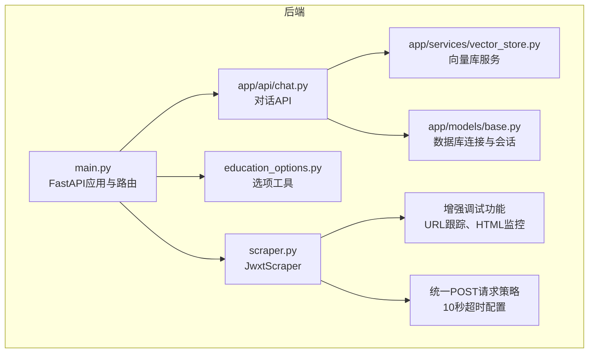
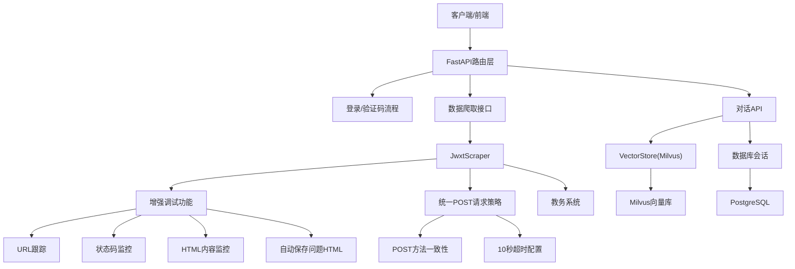
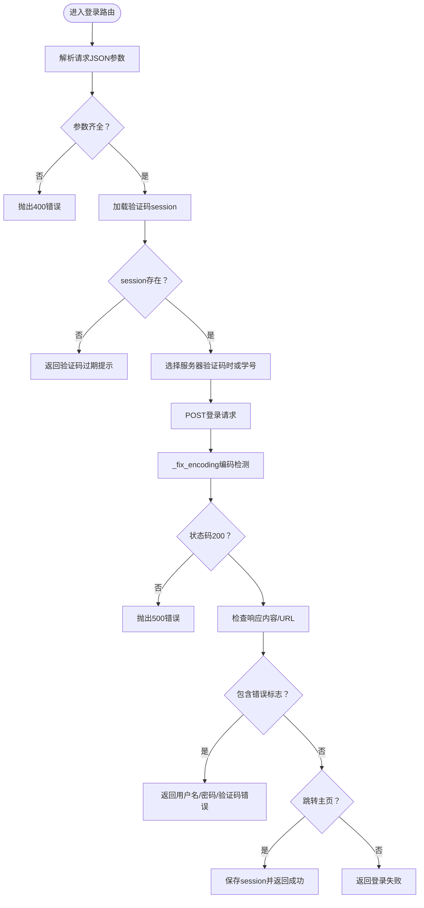
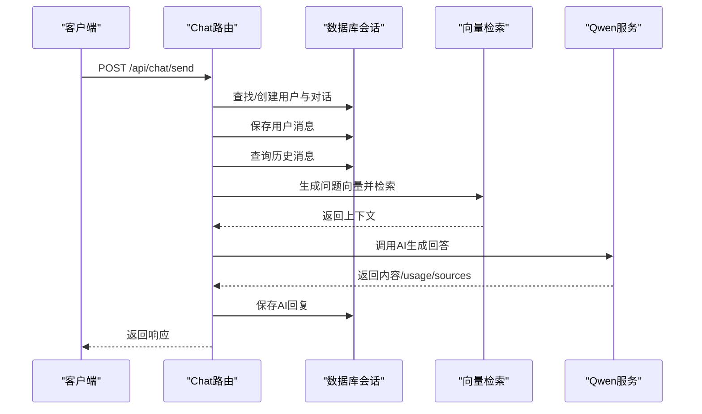
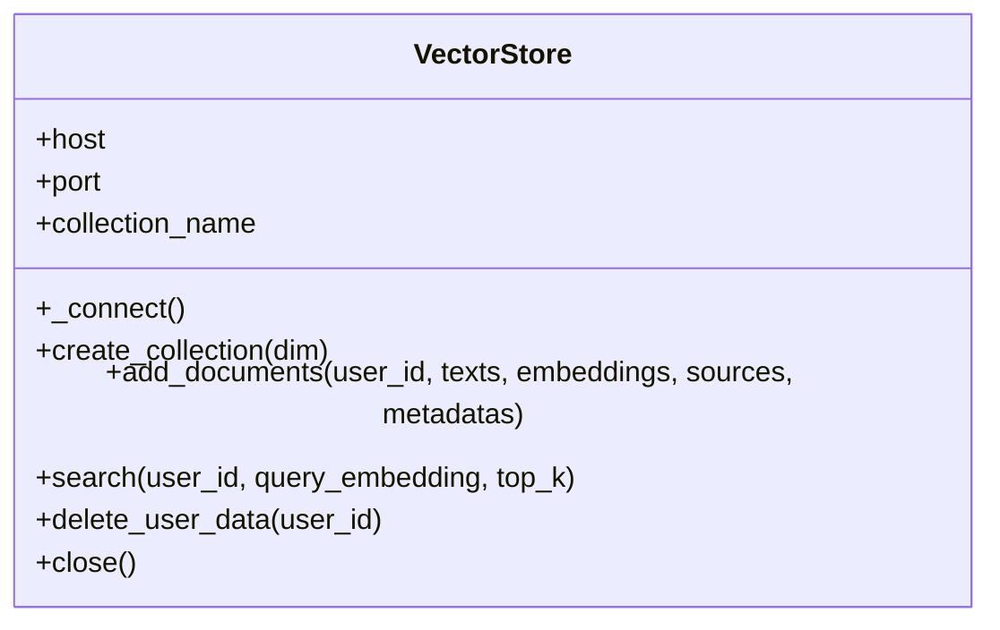
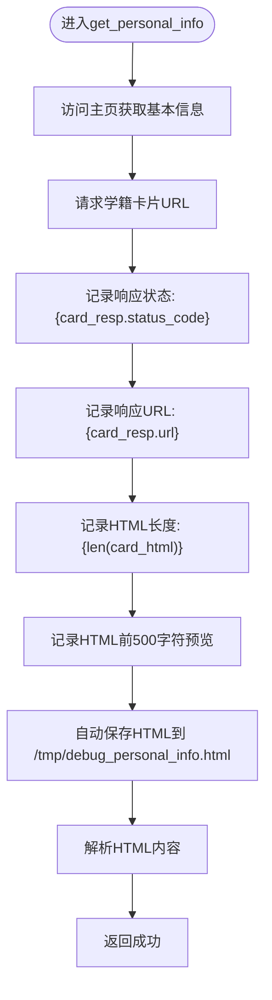
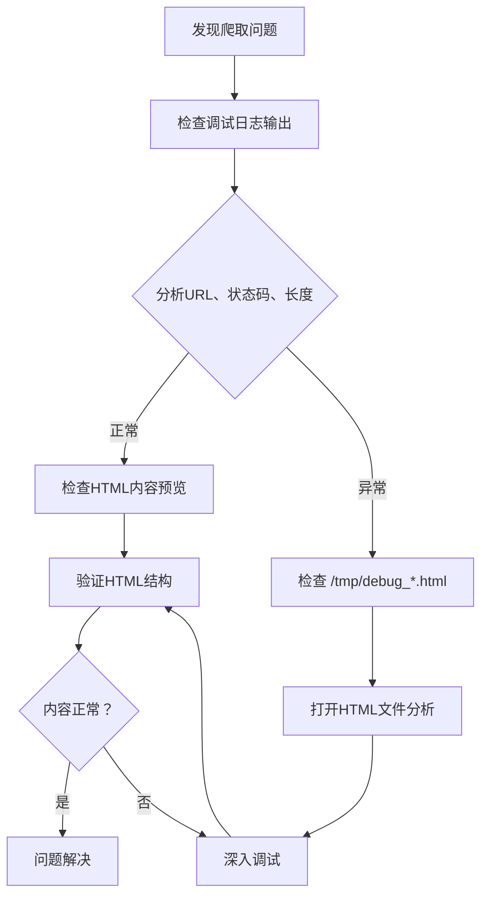
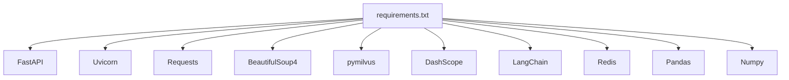

# 后端调试

<cite>
**本文引用的文件**   
- [backend/main.py](file://backend/main.py)
- [backend/app/api/chat.py](file://backend/app/api/chat.py)
- [backend/scraper.py](file://backend/scraper.py)
- [backend/test_login.py](file://backend/test_login.py)
- [backend/test_scraper.py](file://backend/test_scraper.py)
- [backend/requirements.txt](file://backend/requirements.txt)
- [backend/education_options.py](file://backend/education_options.py)
- [backend/app/models/base.py](file://backend/app/models/base.py)
- [backend/app/services/vector_store.py](file://backend/app/services/vector_store.py)
- [backend/Dockerfile](file://backend/Dockerfile)
- [README.md](file://README.md)
</cite>

## 更新摘要
**变更内容**   
- 新增详细的调试功能章节，涵盖URL跟踪、HTTP状态码记录、响应URL监控、HTML内容长度统计和内容预览功能
- 更新爬虫模块调试要点，强调增强的个人信息爬取调试能力
- 新增课程表和学术进度数据的调试功能，分别保存到/tmp/debug_schedule.html和/tmp/debug_academic_progress.html文件
- 新增问题HTML响应自动保存功能，便于手动分析和诊断解析问题
- 增强日志记录与错误追踪章节，突出调试功能的实用价值
- 新增调试功能专项指南
- **新增** 统一的POST请求使用策略：所有数据爬取接口均使用POST方法，提高稳定性
- **新增** 统一的超时配置：所有网络请求均设置10秒超时，确保系统稳定性

## 目录
1. [简介](#简介)
2. [项目结构](#项目结构)
3. [核心组件](#核心组件)
4. [架构总览](#架构总览)
5. [详细组件分析](#详细组件分析)
6. [增强调试功能](#增强调试功能)
7. [统一POST请求策略](#统一post请求策略)
8. [依赖分析](#依赖分析)
9. [性能考虑](#性能考虑)
10. [故障排查指南](#故障排查指南)
11. [结论](#结论)
12. [附录](#附录)

## 简介
本指南面向智能教务系统AI助手后端的调试工作，聚焦于Python FastAPI应用的调试方法，涵盖以下主题：
- 使用pdb调试器进行交互式断点调试，覆盖API路由函数、爬虫模块与AI服务（RAG）路径
- 日志记录配置与级别使用，包括INFO、WARNING、ERROR的输出策略与问题定位
- 异常处理与错误追踪最佳实践，重点讲解HTTPException的捕获与自定义错误响应
- **新增** 增强的调试功能，包括URL跟踪、HTTP状态码记录、响应URL监控、HTML内容长度统计、内容预览功能
- **新增** 课程表和学术进度数据的调试功能，分别保存到/tmp/debug_schedule.html和/tmp/debug_academic_progress.html文件
- **新增** 问题HTML响应的自动保存到 `/tmp/debug_personal_info.html` 文件，便于手动分析和诊断解析问题
- **新增** 统一的POST请求使用策略，所有数据爬取接口均使用POST方法，提高系统稳定性
- **新增** 统一的超时配置，所有网络请求设置10秒超时，确保系统响应性能
- 性能调试方法，包括请求响应时间分析与内存使用监控
- 常见后端问题的诊断流程，如验证码获取失败、登录认证问题与数据爬取异常

## 项目结构
后端采用FastAPI作为Web框架，主要模块包括：
- 应用入口与路由：backend/main.py
- AI对话API：backend/app/api/chat.py
- 爬虫模块：backend/scraper.py
- 选项数据与查询工具：backend/education_options.py
- 向量数据库服务：backend/app/services/vector_store.py
- 数据库基础模型与会话：backend/app/models/base.py
- 测试脚本：backend/test_login.py、backend/test_scraper.py
- 依赖与容器化：backend/requirements.txt、backend/Dockerfile



**图表来源**
- [backend/main.py:1-960](file://backend/main.py#L1-L960)
- [backend/app/api/chat.py:1-249](file://backend/app/api/chat.py#L1-L249)
- [backend/scraper.py:1-1439](file://backend/scraper.py#L1-L1439)
- [backend/education_options.py:1-420](file://backend/education_options.py#L1-L420)
- [backend/app/services/vector_store.py:1-164](file://backend/app/services/vector_store.py#L1-L164)
- [backend/app/models/base.py:1-29](file://backend/app/models/base.py#L1-L29)

**章节来源**
- [backend/main.py:1-960](file://backend/main.py#L1-L960)
- [README.md:25-41](file://README.md#L25-L41)

## 核心组件
- FastAPI应用与中间件：CORS配置、根路径与健康检查、验证码与登录接口、各类数据爬取接口、选项查询接口
- 爬虫模块JwxtScraper：验证码获取、登录、个人信息、学籍卡片、成绩、课表、培养方案、学业进度、考试安排等
- **新增** 增强调试功能：URL跟踪、HTTP状态码记录、响应URL监控、HTML内容长度统计、内容预览和问题HTML响应自动保存
- **新增** 课程表和学术进度数据的调试功能：自动保存HTML到/tmp/debug_schedule.html和/tmp/debug_academic_progress.html文件
- **新增** 统一POST请求策略：所有数据爬取接口均使用POST方法，包括课表查询、培养方案、学业进度、教师查询、课程查询等
- **新增** 统一超时配置：所有网络请求设置10秒超时，确保系统稳定性和响应性能
- AI对话API：用户与对话管理、消息持久化、RAG检索与千问调用
- 选项工具：院系、学期、课程性质、修读类别、成绩显示方式等选项数据与查询函数
- 向量数据库服务：Milvus连接、集合创建、文档插入、相似度检索、用户数据清理
- 数据库基础：PostgreSQL连接字符串、会话工厂、依赖注入

**章节来源**
- [backend/main.py:35-960](file://backend/main.py#L35-L960)
- [backend/scraper.py:13-1439](file://backend/scraper.py#L13-L1439)
- [backend/app/api/chat.py:1-249](file://backend/app/api/chat.py#L1-L249)
- [backend/education_options.py:1-420](file://backend/education_options.py#L1-L420)
- [backend/app/services/vector_store.py:1-164](file://backend/app/services/vector_store.py#L1-L164)
- [backend/app/models/base.py:1-29](file://backend/app/models/base.py#L1-L29)

## 架构总览
后端整体架构围绕FastAPI应用展开，对外提供REST接口，内部通过JwxtScraper与教务系统交互，通过向量数据库与AI服务实现RAG能力。**增强的调试功能**和**统一的POST请求策略**为整个数据爬取流程提供了更全面的监控、诊断能力和稳定性保障。



**图表来源**
- [backend/main.py:95-900](file://backend/main.py#L95-L900)
- [backend/scraper.py:13-1439](file://backend/scraper.py#L13-L1439)
- [backend/app/api/chat.py:45-200](file://backend/app/api/chat.py#L45-L200)
- [backend/app/services/vector_store.py:14-164](file://backend/app/services/vector_store.py#L14-L164)
- [backend/app/models/base.py:10-29](file://backend/app/models/base.py#L10-L29)

## 详细组件分析

### FastAPI应用与路由调试要点
- 断点设置位置
  - 根路径与健康检查：backend/main.py
  - 验证码与登录：backend/main.py
  - 数据爬取接口（个人信息、成绩、课表、培养方案、学业进度、考试安排等）：backend/main.py
  - 选项查询接口（院系、学期、课程、课表、成绩）：backend/main.py
- 调试技巧
  - 在路由函数入口处设置断点，观察请求参数、会话状态与异常分支
  - 利用日志输出关键步骤（服务器选择、登录状态、响应URL、内容长度等）
  - 对异常路径抛出HTTPException，便于统一错误响应
  - **新增** 观察登录流程中的编码检测日志，确认响应解码正确性
- 关键流程图（登录）



**图表来源**
- [backend/main.py:192-385](file://backend/main.py#L192-L385)

**章节来源**
- [backend/main.py:95-960](file://backend/main.py#L95-L960)

### 爬虫模块JwxtScraper调试要点
- **更新** 增强调试功能与日志记录能力
  - **新增** 详细的个人信息爬取调试：URL跟踪、HTTP状态码记录、响应URL监控、HTML内容长度统计和内容预览
  - **新增** 课程表和学术进度数据的调试功能：自动保存HTML到/tmp/debug_schedule.html和/tmp/debug_academic_progress.html文件
  - **新增** 问题HTML响应自动保存到 `/tmp/debug_personal_info.html` 文件，便于手动分析和诊断解析问题
  - **新增** 编码检测日志：显示使用哪种编码（GB18030或UTF-8）
  - 在个人信息爬取过程中，记录URL、响应编码、响应长度和内容预览
  - 在HTML解析阶段记录找到的元素和页面结构信息
  - **新增** 双向回退机制：先尝试检测中文字符，再回退到UTF-8解码失败时的GB18030回退
  - **新增** 响应文本缓存清除逻辑：在编码切换时清除`response._text`缓存以确保重新解码
  - **新增** 统一的POST请求策略：所有数据爬取接口均使用POST方法，提高稳定性
  - **新增** 统一的超时配置：所有网络请求设置10秒超时
- 断点设置位置
  - 验证码获取、登录、个人信息、学籍卡片、成绩、课表、培养方案、学业进度、考试安排等方法
  - 特别关注`_fix_encoding`方法的编码检测逻辑
  - **新增** 个人信息爬取方法中的调试日志断点
  - **新增** 课程表和学术进度方法中的调试日志断点
  - **新增** 所有POST请求方法的断点设置
- 调试技巧
  - 在网络请求前后设置断点，检查超时、状态码与响应内容
  - 使用BeautifulSoup解析时，关注表格ID、节次映射与备注提取
  - 对异常路径返回结构化的失败结果，便于上层统一处理
  - 利用新增的调试日志功能，快速定位编码问题和HTML结构变化
  - **新增** 利用调试日志快速识别GBK/UTF-8混合场景
  - **新增** 监控HTML内容长度和URL变化，及时发现页面结构变化
  - **新增** 检查 `/tmp/debug_personal_info.html`、`/tmp/debug_schedule.html` 和 `/tmp/debug_academic_progress.html` 文件内容，分析解析问题
  - **新增** 观察统一POST请求策略的执行情况
- 关键流程图（获取成绩）


**图表来源**
- [backend/scraper.py:238-360](file://backend/scraper.py#L238-L360)

**章节来源**
- [backend/scraper.py:13-1439](file://backend/scraper.py#L13-L1439)

### AI对话API与RAG调试要点
- 断点设置位置
  - 发送消息路由：backend/app/api/chat.py
  - 用户与对话创建、消息持久化、历史消息查询、RAG检索、AI回答生成
- 调试技巧
  - 在RAG检索前断点，检查用户是否有教育数据、向量检索是否成功
  - 在AI服务调用前后断点，记录usage与sources
  - 对异常路径捕获HTTPException并返回统一错误响应
- 顺序图（发送消息）



**图表来源**
- [backend/app/api/chat.py:45-200](file://backend/app/api/chat.py#L45-L200)

**章节来源**
- [backend/app/api/chat.py:1-249](file://backend/app/api/chat.py#L1-L249)

### 选项查询工具调试要点
- 断点设置位置
  - 选项工具函数：backend/education_options.py
- 调试技巧
  - 在查询函数入口断点，验证关键词匹配、学期计算、描述映射
  - 结合API路由调用，确认返回结构与数量

**章节来源**
- [backend/education_options.py:262-420](file://backend/education_options.py#L262-L420)

### 向量数据库服务调试要点
- 断点设置位置
  - 连接、集合创建、文档插入、相似度检索、用户数据删除
- 调试技巧
  - 在连接与索引创建处断点，检查主机、端口、集合名
  - 在搜索表达式与输出字段处断点，验证用户过滤与结果格式
- 类图



**图表来源**
- [backend/app/services/vector_store.py:14-164](file://backend/app/services/vector_store.py#L14-L164)

**章节来源**
- [backend/app/services/vector_store.py:1-164](file://backend/app/services/vector_store.py#L1-L164)

### 数据库基础与会话调试要点
- 断点设置位置
  - 数据库URL解析、会话工厂、依赖注入
- 调试技巧
  - 在get_db依赖处断点，检查会话生命周期与异常关闭

**章节来源**
- [backend/app/models/base.py:10-29](file://backend/app/models/base.py#L10-L29)

## 增强调试功能

### 新增功能概述
JwxtScraper模块新增了**全面的调试功能**，显著提升了问题诊断和调试效率。这些功能包括：

- **URL跟踪**：记录请求的完整URL，便于追踪请求来源和目标
- **HTTP状态码记录**：监控每个请求的HTTP状态码，及时发现异常
- **响应URL监控**：跟踪实际响应的URL，识别重定向和页面跳转
- **HTML内容长度统计**：记录HTML内容长度，帮助识别页面结构变化
- **内容预览功能**：提供HTML内容的前500字符预览，便于快速检查页面内容
- **问题HTML响应自动保存**：将问题页面的HTML内容自动保存到 `/tmp/debug_personal_info.html`、`/tmp/debug_schedule.html` 和 `/tmp/debug_academic_progress.html` 文件

### 调试功能实现详解



**图表来源**
- [backend/scraper.py:138-196](file://backend/scraper.py#L138-L196)

### 调试功能使用指南

#### 1. 启用调试日志
在JwxtScraper的所有网络请求方法中，都会自动输出详细的调试信息：

```python
# 示例：在个人信息爬取中
logger.info(f"【个人信息调试】请求学籍卡片URL: {card_url}")
logger.info(f"【个人信息调试】学籍卡片响应状态: {card_resp.status_code}")
logger.info(f"【个人信息调试】学籍卡片响应URL: {card_resp.url}")
logger.info(f"【个人信息调试】学籍卡片HTML长度: {len(card_html)}")
logger.info(f"【个人信息调试】HTML前500字符: {card_html[:500]}")
```

#### 2. 监控调试输出
调试功能会在日志中输出类似以下信息：
- `【个人信息调试】请求学籍卡片URL: {URL}`
- `【个人信息调试】学籍卡片响应状态: 200`
- `【个人信息调试】学籍卡片响应URL: {实际URL}`
- `【个人信息调试】学籍卡片HTML长度: {长度}`
- `【个人信息调试】HTML前500字符: {内容预览}`
- `【个人信息调试】HTML已保存到 /tmp/debug_personal_info.html`

#### 3. 检查自动保存的HTML文件
当出现问题时，系统会自动将HTML内容保存到指定文件中，便于手动分析：

```python
# 自动保存到文件
with open('/tmp/debug_personal_info.html', 'w', encoding='utf-8') as f:
    f.write(card_html)
logger.info(f"【个人信息调试】HTML已保存到 /tmp/debug_personal_info.html")
```

#### 4. 调试功能诊断流程


**图表来源**
- [backend/scraper.py:138-196](file://backend/scraper.py#L138-L196)

### 调试功能调试技巧

#### 1. 在调试日志中设置断点
在`get_personal_info`方法的关键位置设置断点：
- URL构建和请求发送
- 状态码记录
- 响应URL记录
- HTML长度统计
- 内容预览输出
- 自动保存文件操作

#### 2. 监控HTML文件变化
在调试过程中，观察 `/tmp/debug_personal_info.html`、`/tmp/debug_schedule.html` 和 `/tmp/debug_academic_progress.html` 文件的变化：
- 文件是否存在
- 文件内容是否更新
- HTML结构是否符合预期
- 特殊字符是否正确显示

#### 3. 验证调试输出的准确性
检查调试日志中的各项指标：
- URL是否正确
- 状态码是否为200
- HTML长度是否合理
- 内容预览是否包含预期信息

#### 4. 分析问题页面
当调试功能检测到异常时：
- 打开相应的HTML文件进行分析
- 检查页面结构和内容
- 对比预期的HTML结构
- 识别解析失败的原因

**章节来源**
- [backend/scraper.py:138-196](file://backend/scraper.py#L138-L196)

## 统一POST请求策略

### 策略概述
为了提高系统稳定性和可靠性，JwxtScraper模块实施了统一的POST请求策略。该策略确保所有数据爬取接口都使用POST方法提交查询参数，而不是GET方法传递参数，从而避免URL长度限制和参数安全性问题。

### 实施细节

#### 1. POST请求方法
所有数据爬取接口均使用`session.post()`方法：

```python
# 成绩查询示例
response = self.session.post(url, data=data, timeout=10)

# 课表查询示例  
response = self.session.post(url, data=data if data else {}, timeout=10)

# 培养方案查询示例
response = self.session.post(url, data=data, timeout=10)

# 学业进度查询示例
response = self.session.post(url, data={"studyType": study_type}, timeout=10)
```

#### 2. 统一超时配置
所有网络请求都设置了10秒超时时间：

```python
# 统一的超时配置
response = self.session.post(url, data=data, timeout=10)
response = self.session.get(url, timeout=10)
```

#### 3. 参数传递方式
所有查询参数都通过POST请求体传递，而不是URL参数：

```python
# 构建表单数据
data = {
    "kksj": kksj,
    "kcxz": kcxz, 
    "kcmc": kcmc,
    "fxkc": fxkc,
    "xsfs": xsfs
}

# POST提交查询表单
response = self.session.post(url, data=data, timeout=10)
```

### 策略优势

#### 1. 提高稳定性
- 避免URL过长导致的服务器拒绝
- 减少参数截断和编码问题
- 统一的错误处理机制

#### 2. 增强安全性
- 查询参数不在URL中暴露
- 减少敏感信息泄露风险
- 更好的请求头控制

#### 3. 改善性能
- 统一的超时配置确保响应时间可控
- 减少网络超时和重试次数
- 更稳定的系统性能

### 调试技巧

#### 1. 观察POST请求日志
在调试过程中，重点关注POST请求的日志输出：

```python
logger.info(f"【成绩调试】请求URL: {url}")
logger.info(f"【成绩调试】响应状态: {response.status_code}")
logger.info(f"【成绩调试】响应URL: {response.url}")
logger.info(f"【成绩调试】HTML长度: {len(html_text)}")
```

#### 2. 检查参数传递
验证POST请求的参数是否正确传递：

```python
# 检查表单数据
logger.info(f"【调试】POST数据: {data}")
```

#### 3. 监控超时行为
观察统一超时配置的效果：

```python
# 检查响应时间
start_time = time.time()
response = self.session.post(url, data=data, timeout=10)
end_time = time.time()
logger.info(f"【调试】请求耗时: {end_time - start_time:.2f}秒")
```

**章节来源**
- [backend/scraper.py:238-1439](file://backend/scraper.py#L238-L1439)

## 依赖分析
- Web框架与HTTP客户端：FastAPI、Uvicorn、Requests、aiohttp
- HTML解析：BeautifulSoup4、lxml
- 爬虫工具：Pyppeteer、Selenium、webdriver-manager
- 缓存：Redis
- 向量数据库：Milvus（pymilvus）
- AI模型与LangChain：OpenAI、DashScope、LangChain
- 数据处理：Pandas、NumPy



**图表来源**
- [backend/requirements.txt:1-44](file://backend/requirements.txt#L1-L44)

**章节来源**
- [backend/requirements.txt:1-44](file://backend/requirements.txt#L1-L44)

## 性能考虑
- 请求响应时间分析
  - 在路由入口与关键网络请求处记录时间戳，对比请求耗时
  - 对慢查询（如向量检索、数据库查询）单独计时
- 内存使用监控
  - 使用进程级监控工具（如psutil或系统工具）观察内存峰值
  - 关注大对象（如HTML解析后的结构、向量嵌入）的生命周期
- **新增** 调试功能性能优化
  - 调试日志输出仅在开发环境中启用
  - HTML内容预览限制在500字符以内，避免内存占用过大
  - 自动保存文件操作仅在调试模式下执行
  - **新增** 统一POST请求策略的性能影响评估
- **新增** 统一超时配置的性能考虑
  - 10秒超时确保系统响应稳定性
  - 避免长时间阻塞影响用户体验
  - 统一的超时策略简化异常处理
- 优化建议
  - 合理设置超时与重试策略
  - 对重复请求进行缓存（如选项数据）
  - 控制RAG检索top_k大小与输出字段
  - **新增** 监控POST请求的响应时间和成功率

## 故障排查指南

### 验证码获取失败
- 现象
  - 前端无法显示验证码或后端报错
- 排查步骤
  - 检查后端服务是否启动与端口监听
  - 检查网络连通性与目标URL可达性
  - 在验证码路由断点，确认服务器选择逻辑与会话保存
  - **新增** 检查验证码请求的超时配置
- 参考路径
  - 验证码路由与服务器选择：backend/main.py
  - 登录前置测试脚本：backend/test_login.py

**章节来源**
- [backend/main.py:135-190](file://backend/main.py#L135-L190)
- [backend/test_login.py:1-152](file://backend/test_login.py#L1-L152)

### 登录认证问题
- 现现象
  - 输入正确凭证仍提示用户名/密码/验证码错误
- 排查步骤
  - 在登录路由断点，检查参数解析、验证码session、服务器选择
  - 观察响应状态码与URL、内容特征，定位失败原因
  - 使用测试脚本模拟登录，比对响应差异
  - **新增** 检查编码检测日志，确认登录响应的正确解码
  - **新增** 检查POST请求的参数传递是否正确
- 参考路径
  - 登录路由与断点：backend/main.py
  - 登录测试脚本：backend/test_login.py

**章节来源**
- [backend/main.py:192-385](file://backend/main.py#L192-L385)
- [backend/test_login.py:19-152](file://backend/test_login.py#L19-L152)

### 数据爬取异常
- 现象
  - 成绩、课表、培养方案、学业进度等接口返回空或失败
- 排查步骤
  - 在对应数据接口断点，检查session有效性与用户登录状态
  - 在JwxtScraper对应方法断点，检查网络请求与HTML解析
  - 关注表格ID、节次映射与备注提取逻辑
  - **新增** 利用增强的调试功能，检查URL跟踪、状态码监控、HTML内容长度统计
  - **新增** 检查 `/tmp/debug_personal_info.html`、`/tmp/debug_schedule.html` 和 `/tmp/debug_academic_progress.html` 文件，分析解析问题
  - **新增** 利用编码检测日志，确认各数据接口的正确解码
  - **新增** 验证统一POST请求策略的执行情况
  - **新增** 检查超时配置对请求的影响
- 参考路径
  - 数据接口路由：backend/main.py
  - 爬虫模块：backend/scraper.py
  - 爬虫功能测试：backend/test_scraper.py

**章节来源**
- [backend/main.py:351-960](file://backend/main.py#L351-L960)
- [backend/scraper.py:138-1439](file://backend/scraper.py#L138-L1439)
- [backend/test_scraper.py:1-280](file://backend/test_scraper.py#L1-L280)

### AI对话与RAG问题
- 现象
  - 对话无响应或RAG检索失败
- 排查步骤
  - 在对话路由断点，检查用户/对话创建、历史消息与RAG检索
  - 在向量检索断点，检查用户过滤与结果格式
  - 检查Milvus连接与集合状态
- 参考路径
  - 对话API：backend/app/api/chat.py
  - 向量库服务：backend/app/services/vector_store.py

**章节来源**
- [backend/app/api/chat.py:45-200](file://backend/app/api/chat.py#L45-L200)
- [backend/app/services/vector_store.py:24-164](file://backend/app/services/vector_store.py#L24-L164)

### 编码问题专项诊断
- **新增** 现象
  - 页面中文乱码、特殊字符显示异常、HTML解析失败
- **新增** 排查步骤
  - 检查JwxtScraper日志中的编码检测信息
  - 验证`_fix_encoding`方法是否被正确调用
  - 确认响应缓存是否在编码切换时被清除
  - 检查不同数据接口的编码处理一致性
  - **新增** 利用增强的调试功能，检查HTML内容长度和URL变化
  - **新增** 验证统一POST请求策略对编码的影响
- **新增** 诊断工具
  - 编码检测日志分析
  - 响应内容长度与编码关系验证
  - HTML结构变化监控
  - **新增** `/tmp/debug_*.html` 文件分析

**章节来源**
- [backend/scraper.py:22-49](file://backend/scraper.py#L22-L49)

### 增强调试功能专项诊断
- **新增** 现象
  - 爬取功能不稳定、页面结构变化导致解析失败
- **新增** 排查步骤
  - 检查调试日志输出，确认URL跟踪、状态码记录、HTML长度统计正常
  - 验证 `/tmp/debug_personal_info.html`、`/tmp/debug_schedule.html` 和 `/tmp/debug_academic_progress.html` 文件是否正确保存
  - 分析HTML内容预览，确认包含预期信息
  - 对比不同时间点的HTML内容，识别页面结构变化
  - **新增** 验证统一POST请求策略的调试效果
- **新增** 诊断工具
  - 调试日志分析
  - HTML文件内容检查
  - URL和状态码监控
  - HTML长度变化追踪

**章节来源**
- [backend/scraper.py:138-196](file://backend/scraper.py#L138-L196)

### 统一POST请求策略专项诊断
- **新增** 现象
  - 数据爬取接口偶发性失败、参数传递异常
- **新增** 排查步骤
  - 检查所有数据接口是否使用POST方法
  - 验证POST请求体参数的完整性
  - 确认超时配置的一致性
  - 分析POST请求与GET请求的性能差异
- **新增** 诊断工具
  - POST请求日志分析
  - 参数传递验证
  - 超时行为监控
  - 请求成功率统计

**章节来源**
- [backend/scraper.py:238-1439](file://backend/scraper.py#L238-L1439)

### 日志记录与错误追踪
- **更新** 日志配置与增强功能
  - 基础日志级别：INFO（可在应用中调整）
  - 关键模块日志：验证码、登录、数据爬取、AI对话、向量检索
  - **新增** JwxtScraper详细调试日志：URL跟踪、状态码监控、HTML内容监控
  - **新增** 编码检测专用日志：`【编码】`前缀标记
  - **新增** 个人信息爬取调试日志：`【个人信息调试】`前缀标记
  - **新增** 课程表调试日志：`【课表调试】`前缀标记
  - **新增** 学业进度调试日志：`【学业进度调试】`前缀标记
  - **新增** 统一POST请求策略日志：`【调试】`前缀标记
- 日志级别使用建议
  - INFO：关键流程与状态变更（如"登录成功"、"获取验证码成功"、"使用编码: gb18030"）
  - WARNING：可恢复异常或潜在问题（如"未找到课表表格"、"解析课程行失败"）
  - ERROR：异常与错误（如"获取验证码失败"、"Milvus连接失败"、"获取个人信息失败"）
  - **新增** DEBUG：调试功能详细输出（如"请求URL: {URL}"、"状态码: 200"、"HTML长度: {length}"）
- 最佳实践
  - 在HTTPException之前记录上下文信息
  - 在异常捕获中保留原始错误并返回统一结构
  - **新增** 利用JwxtScraper的详细日志进行问题诊断，重点关注调试功能和编码检测
  - **新增** 编码问题优先检查编码检测日志
  - **新增** 使用调试功能快速定位页面结构变化和解析问题
  - **新增** 观察统一POST请求策略的执行效果

**章节来源**
- [backend/main.py:35-37](file://backend/main.py#L35-L37)
- [backend/scraper.py:22-42](file://backend/scraper.py#L22-L42)
- [backend/app/api/chat.py:14-14](file://backend/app/api/chat.py#L14-L14)
- [backend/app/services/vector_store.py:24-35](file://backend/app/services/vector_store.py#L24-L35)

### pdb调试器使用技巧
- 设置断点
  - 在路由函数入口、关键业务逻辑与异常分支处设置断点
  - 在JwxtScraper方法内部设置断点，跟踪网络请求与解析过程
  - 在AI对话API中设置断点，跟踪RAG检索与AI调用
  - **新增** 在编码检测方法中设置断点，跟踪编码切换逻辑
  - **新增** 在个人信息爬取方法中设置断点，跟踪调试功能执行
  - **新增** 在课程表和学术进度方法中设置断点，跟踪调试功能执行
  - **新增** 在所有POST请求方法中设置断点，验证统一策略执行
- 交互式调试
  - 使用断点查看变量状态（如session、响应内容、异常信息）
  - 单步执行定位问题发生的具体语句
  - 在异常路径捕获后，打印堆栈信息辅助定位
  - **新增** 观察编码检测过程中的变量变化
  - **新增** 监控调试日志输出，检查各项指标是否正常
  - **新增** 验证统一POST请求策略的参数传递
- **新增** 利用增强的调试功能进行调试
  - 观察调试日志，判断是否出现编码问题
  - 查看个人信息爬取的调试输出，确认HTML结构变化
  - 监控各模块的详细调试输出，快速定位问题环节
  - **新增** 重点关注调试功能相关的日志信息
  - **新增** 检查 `/tmp/debug_personal_info.html`、`/tmp/debug_schedule.html` 和 `/tmp/debug_academic_progress.html` 文件内容
  - **新增** 验证统一POST请求策略的调试效果

**章节来源**
- [backend/main.py:135-385](file://backend/main.py#L135-L385)
- [backend/scraper.py:22-1439](file://backend/scraper.py#L22-L1439)
- [backend/app/api/chat.py:104-124](file://backend/app/api/chat.py#L104-L124)

### 容器化与部署调试
- Docker镜像与启动
  - 使用Dockerfile构建镜像并暴露8000端口
  - 通过Uvicorn启动FastAPI应用
- 调试建议
  - 在容器内开启调试模式，查看日志输出
  - 检查环境变量（如数据库、Milvus、DashScope）配置
  - **新增** 确认容器内网络访问教务系统URL的连通性
  - **新增** 检查 `/tmp` 目录权限，确保HTML文件可以正确保存
  - **新增** 验证统一POST请求策略在容器环境中的执行

**章节来源**
- [backend/Dockerfile:1-18](file://backend/Dockerfile#L1-L18)
- [README.md:69-92](file://README.md#L69-L92)

## 结论
通过在FastAPI路由、JwxtScraper、AI对话与向量库等关键路径设置断点，结合INFO/WARNING/ERROR级别的日志输出与HTTPException的统一错误处理，能够高效定位与解决验证码、登录、数据爬取与RAG相关问题。**新增的增强调试功能**（包括URL跟踪、HTTP状态码记录、响应URL监控、HTML内容长度统计、内容预览和问题HTML响应自动保存）大大增强了系统的可观测性和问题诊断能力，特别是针对个人信息爬取、课程表和学术进度功能的问题诊断。**编码检测机制的重大改进**为整个系统提供了更稳健的文本处理能力，有效解决了GBK/UTF-8混合场景下的编码问题。**统一的POST请求策略和超时配置**进一步提升了系统的稳定性和性能表现。配合性能监控与容器化部署，可进一步提升系统的稳定性与可观测性。

## 附录
- 常用测试脚本
  - 登录测试：backend/test_login.py
  - 爬虫功能测试：backend/test_scraper.py
- 依赖清单：backend/requirements.txt
- 项目结构概览：README.md

**章节来源**
- [backend/test_login.py:1-152](file://backend/test_login.py#L1-L152)
- [backend/test_scraper.py:1-280](file://backend/test_scraper.py#L1-L280)
- [backend/requirements.txt:1-44](file://backend/requirements.txt#L1-L44)
- [README.md:25-41](file://README.md#L25-L41)