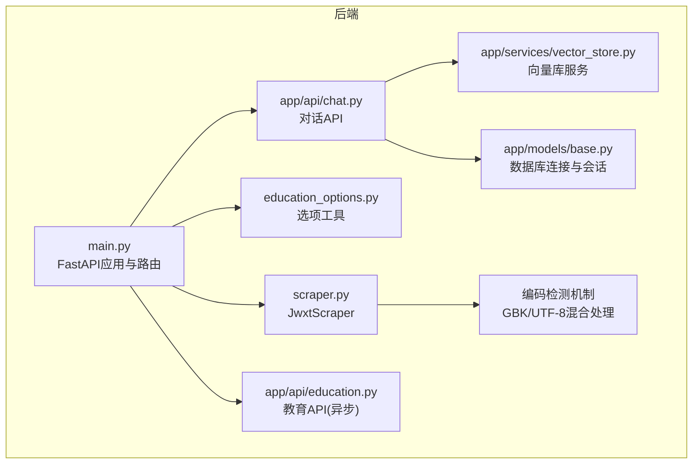
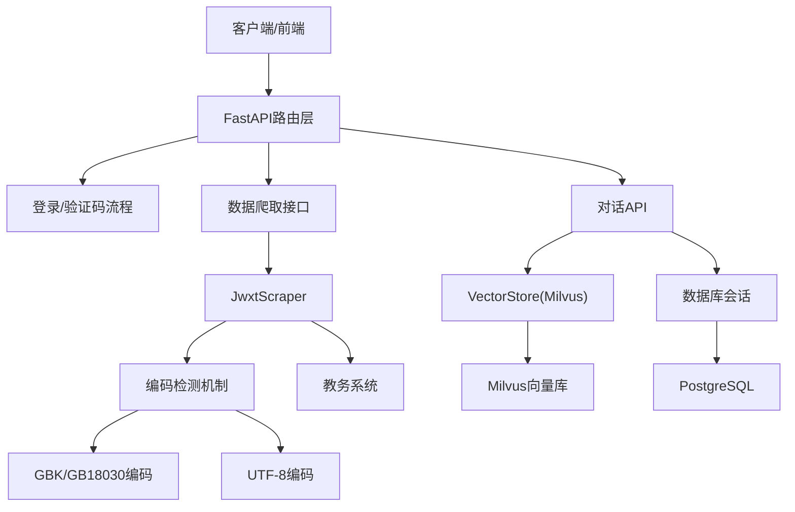
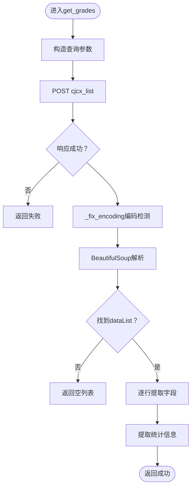
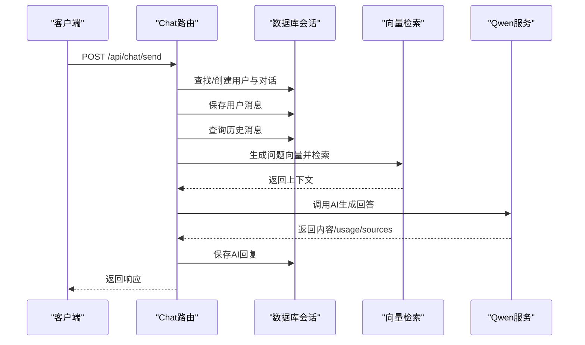
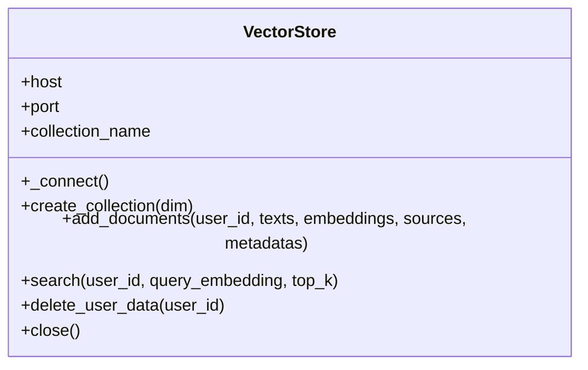
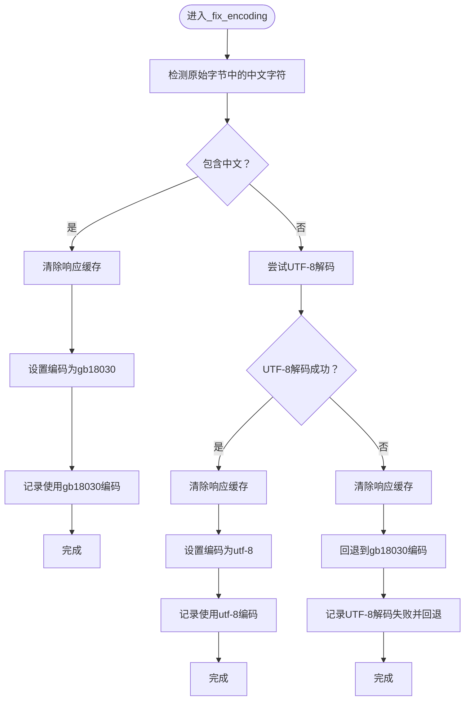
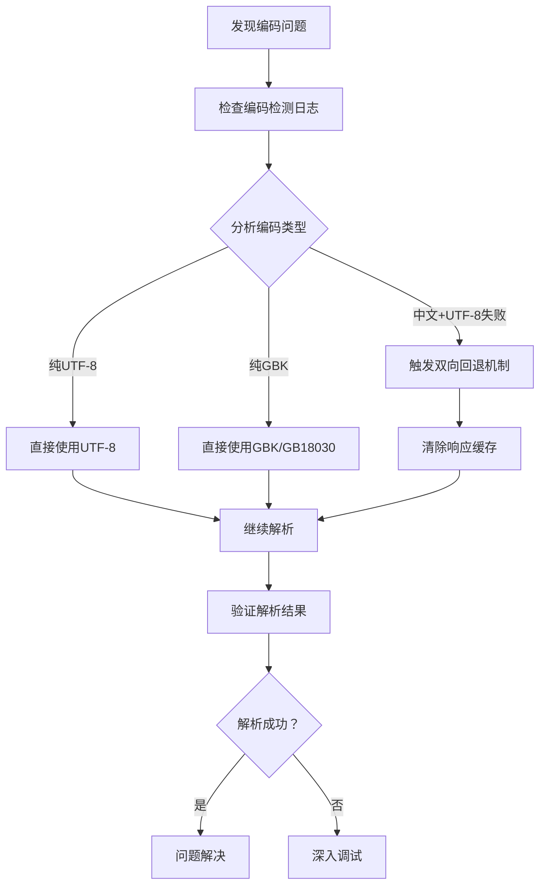
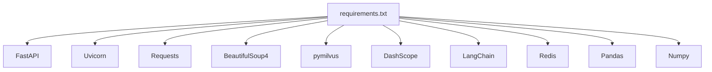

# 后端调试

<cite>
**本文引用的文件**   
- [backend/main.py](file://backend/main.py)
- [backend/app/api/chat.py](file://backend/app/api/chat.py)
- [backend/app/api/education.py](file://backend/app/api/education.py)
- [backend/scraper.py](file://backend/scraper.py)
- [backend/test_login.py](file://backend/test_login.py)
- [backend/test_scraper.py](file://backend/test_scraper.py)
- [backend/requirements.txt](file://backend/requirements.txt)
- [backend/education_options.py](file://backend/education_options.py)
- [backend/app/models/base.py](file://backend/app/models/base.py)
- [backend/app/services/vector_store.py](file://backend/app/services/vector_store.py)
- [backend/Dockerfile](file://backend/Dockerfile)
- [README.md](file://README.md)
</cite>

## 更新摘要
**变更内容**   
- 新增编码检测机制重大改进章节，详细介绍GBK/UTF-8混合场景处理
- 更新爬虫模块调试要点，强调编码检测与日志记录能力
- 增强日志记录与错误追踪章节，突出编码问题诊断功能
- 新增编码问题专项调试指南

## 目录
1. [简介](#简介)
2. [项目结构](#项目结构)
3. [核心组件](#核心组件)
4. [架构总览](#架构总览)
5. [详细组件分析](#详细组件分析)
6. [编码检测机制重大改进](#编码检测机制重大改进)
7. [依赖分析](#依赖分析)
8. [性能考虑](#性能考虑)
9. [故障排查指南](#故障排查指南)
10. [结论](#结论)
11. [附录](#附录)

## 简介
本指南面向智能教务系统AI助手后端的调试工作，聚焦于Python FastAPI应用的调试方法，涵盖以下主题：
- 使用pdb调试器进行交互式断点调试，覆盖API路由函数、爬虫模块与AI服务（RAG）路径
- 日志记录配置与级别使用，包括INFO、WARNING、ERROR的输出策略与问题定位
- 异常处理与错误追踪最佳实践，重点讲解HTTPException的捕获与自定义错误响应
- **新增** 编码检测机制的重大改进，包括GBK/UTF-8混合场景处理、响应文本缓存清除逻辑、双向回退机制
- 性能调试方法，包括请求响应时间分析与内存使用监控
- 常见后端问题的诊断流程，如验证码获取失败、登录认证问题与数据爬取异常

## 项目结构
后端采用FastAPI作为Web框架，主要模块包括：
- 应用入口与路由：backend/main.py
- AI对话API：backend/app/api/chat.py
- 教务系统教育API（异步版本）：backend/app/api/education.py
- 爬虫模块：backend/scraper.py
- 选项数据与查询工具：backend/education_options.py
- 向量数据库服务：backend/app/services/vector_store.py
- 数据库基础模型与会话：backend/app/models/base.py
- 测试脚本：backend/test_login.py、backend/test_scraper.py
- 依赖与容器化：backend/requirements.txt、backend/Dockerfile



**图表来源**
- [backend/main.py:1-857](file://backend/main.py#L1-L857)
- [backend/app/api/chat.py:1-224](file://backend/app/api/chat.py#L1-L224)
- [backend/app/api/education.py:1-104](file://backend/app/api/education.py#L1-L104)
- [backend/scraper.py:1-1286](file://backend/scraper.py#L1-L1286)
- [backend/education_options.py:1-420](file://backend/education_options.py#L1-L420)
- [backend/app/services/vector_store.py:1-164](file://backend/app/services/vector_store.py#L1-L164)
- [backend/app/models/base.py:1-29](file://backend/app/models/base.py#L1-L29)

**章节来源**
- [backend/main.py:1-857](file://backend/main.py#L1-L857)
- [README.md:25-41](file://README.md#L25-L41)

## 核心组件
- FastAPI应用与中间件：CORS配置、根路径与健康检查、验证码与登录接口、各类数据爬取接口、选项查询接口
- 爬虫模块JwxtScraper：验证码获取、登录、个人信息、学籍卡片、成绩、课表、培养方案、学业进度、考试安排等
- **新增** 编码检测机制：自动修正响应编码，适配教务系统GBK/UTF-8混合场景
- AI对话API：用户与对话管理、消息持久化、RAG检索与千问调用
- 选项工具：院系、学期、课程性质、修读类别、成绩显示方式等选项数据与查询函数
- 向量数据库服务：Milvus连接、集合创建、文档插入、相似度检索、用户数据清理
- 数据库基础：PostgreSQL连接字符串、会话工厂、依赖注入

**章节来源**
- [backend/main.py:35-857](file://backend/main.py#L35-L857)
- [backend/scraper.py:13-1286](file://backend/scraper.py#L13-L1286)
- [backend/app/api/chat.py:1-224](file://backend/app/api/chat.py#L1-L224)
- [backend/education_options.py:1-420](file://backend/education_options.py#L1-L420)
- [backend/app/services/vector_store.py:1-164](file://backend/app/services/vector_store.py#L1-L164)
- [backend/app/models/base.py:1-29](file://backend/app/models/base.py#L1-L29)

## 架构总览
后端整体架构围绕FastAPI应用展开，对外提供REST接口，内部通过JwxtScraper与教务系统交互，通过向量数据库与AI服务实现RAG能力。**新增的编码检测机制**为整个数据爬取流程提供了更稳健的文本处理能力。



**图表来源**
- [backend/main.py:95-800](file://backend/main.py#L95-L800)
- [backend/scraper.py:13-1286](file://backend/scraper.py#L13-L1286)
- [backend/app/api/chat.py:45-154](file://backend/app/api/chat.py#L45-L154)
- [backend/app/services/vector_store.py:14-164](file://backend/app/services/vector_store.py#L14-L164)
- [backend/app/models/base.py:10-29](file://backend/app/models/base.py#L10-L29)

## 详细组件分析

### FastAPI应用与路由调试要点
- 断点设置位置
  - 根路径与健康检查：backend/main.py
  - 验证码与登录：backend/main.py
  - 数据爬取接口（个人信息、成绩、课表、培养方案、学业进度、考试安排等）：backend/main.py
  - 选项查询接口（院系、学期、课程、课表、成绩）：backend/main.py
- 调试技巧
  - 在路由函数入口处设置断点，观察请求参数、会话状态与异常分支
  - 利用日志输出关键步骤（服务器选择、登录状态、响应URL、内容长度等）
  - 对异常路径抛出HTTPException，便于统一错误响应
- 关键流程图（登录）


**图表来源**
- [backend/main.py:192-348](file://backend/main.py#L192-L348)

**章节来源**
- [backend/main.py:95-800](file://backend/main.py#L95-L800)

### 爬虫模块JwxtScraper调试要点
- **更新** 编码检测与日志记录能力
  - `_fix_encoding`方法现在包含详细的编码检测日志，显示使用哪种编码（GB18030或UTF-8）
  - 在个人信息爬取过程中，记录URL、响应编码、响应长度和内容预览
  - 在HTML解析阶段记录找到的元素和页面结构信息
  - **新增** 双向回退机制：先尝试检测中文字符，再回退到UTF-8解码失败时的GB18030回退
  - **新增** 响应文本缓存清除逻辑：在编码切换时清除`response._text`缓存以确保重新解码
- 断点设置位置
  - 验证码获取、登录、个人信息、学籍卡片、成绩、课表、培养方案、学业进度、考试安排等方法
  - 特别关注`_fix_encoding`方法的编码检测逻辑
- 调试技巧
  - 在网络请求前后设置断点，检查超时、状态码与响应内容
  - 使用BeautifulSoup解析时，关注表格ID、节次映射与备注提取
  - 对异常路径返回结构化的失败结果，便于上层统一处理
  - 利用新增的日志记录功能，快速定位编码问题和HTML结构变化
  - **新增** 利用编码检测日志快速识别GBK/UTF-8混合场景
- 关键流程图（获取成绩）



**图表来源**
- [backend/scraper.py:190-273](file://backend/scraper.py#L190-L273)

**章节来源**
- [backend/scraper.py:13-1286](file://backend/scraper.py#L13-L1286)

### AI对话API与RAG调试要点
- 断点设置位置
  - 发送消息路由：backend/app/api/chat.py
  - 用户与对话创建、消息持久化、历史消息查询、RAG检索、AI回答生成
- 调试技巧
  - 在RAG检索前断点，检查用户是否有教育数据、向量检索是否成功
  - 在AI服务调用前后断点，记录usage与sources
  - 对异常路径捕获HTTPException并返回统一错误响应
- 顺序图（发送消息）



**图表来源**
- [backend/app/api/chat.py:45-154](file://backend/app/api/chat.py#L45-L154)

**章节来源**
- [backend/app/api/chat.py:1-224](file://backend/app/api/chat.py#L1-L224)

### 选项查询工具调试要点
- 断点设置位置
  - 选项工具函数：backend/education_options.py
- 调试技巧
  - 在查询函数入口断点，验证关键词匹配、学期计算、描述映射
  - 结合API路由调用，确认返回结构与数量

**章节来源**
- [backend/education_options.py:262-420](file://backend/education_options.py#L262-L420)

### 向量数据库服务调试要点
- 断点设置位置
  - 连接、集合创建、文档插入、相似度检索、用户数据删除
- 调试技巧
  - 在连接与索引创建处断点，检查主机、端口、集合名
  - 在搜索表达式与输出字段处断点，验证用户过滤与结果格式
- 类图



**图表来源**
- [backend/app/services/vector_store.py:14-164](file://backend/app/services/vector_store.py#L14-L164)

**章节来源**
- [backend/app/services/vector_store.py:1-164](file://backend/app/services/vector_store.py#L1-L164)

### 数据库基础与会话调试要点
- 断点设置位置
  - 数据库URL解析、会话工厂、依赖注入
- 调试技巧
  - 在get_db依赖处断点，检查会话生命周期与异常关闭

**章节来源**
- [backend/app/models/base.py:10-29](file://backend/app/models/base.py#L10-L29)

## 编码检测机制重大改进

### 新增功能概述
JwxtScraper模块新增了**更稳健的GBK/UTF-8混合场景处理机制**，解决了教务系统响应编码不一致的问题。该机制包含以下关键特性：

- **双向编码检测**：先检测中文字符，再尝试UTF-8解码，最后回退到GB18030
- **响应文本缓存清除**：在编码切换时清除`response._text`缓存以确保重新解码
- **详细日志记录**：记录编码检测过程和结果，便于问题诊断
- **自动回退机制**：在UTF-8解码失败时自动回退到GB18030编码

### 编码检测算法详解



**图表来源**
- [backend/scraper.py:22-49](file://backend/scraper.py#L22-L49)

### 调试编码问题的方法

#### 1. 启用编码检测日志
在JwxtScraper的所有网络请求方法中，都会自动调用`_fix_encoding`方法进行编码检测：

```python
# 示例：在登录方法中
response = self.session.post(self.login_url, data=data, timeout=10)
self._fix_encoding(response)  # 自动进行编码检测
```

#### 2. 监控编码检测日志
编码检测会在日志中输出类似以下信息：
- `【编码】使用 GB18030，检测到中文`
- `【编码】使用 UTF-8`
- `【编码】UTF-8 解码失败，回退到 GB18030`

#### 3. 处理GBK/UTF-8混合场景
当遇到包含中文字符但UTF-8解码失败的情况，系统会自动：
- 清除响应缓存（`del response._text`）
- 设置编码为`gb18030`
- 继续后续解析

#### 4. 编码问题诊断流程


**图表来源**
- [backend/scraper.py:22-49](file://backend/scraper.py#L22-L49)

### 编码检测调试技巧

#### 1. 在编码检测方法中设置断点
在`_fix_encoding`方法的关键位置设置断点：
- 中文字符检测逻辑
- UTF-8解码尝试
- 回退机制触发点

#### 2. 监控响应缓存状态
在编码切换时，观察`response._text`缓存是否被正确清除：
```python
if hasattr(response, '_text'):
    del response._text  # 确保重新解码
```

#### 3. 验证HTML解析结果
在编码检测后，检查BeautifulSoup解析是否正常：
- 页面元素是否能正确找到
- 文本内容是否完整显示
- 特殊字符是否正确显示

**章节来源**
- [backend/scraper.py:22-49](file://backend/scraper.py#L22-L49)

## 依赖分析
- Web框架与HTTP客户端：FastAPI、Uvicorn、Requests、aiohttp
- HTML解析：BeautifulSoup4、lxml
- 爬虫工具：Pyppeteer、Selenium、webdriver-manager
- 缓存：Redis
- 向量数据库：Milvus（pymilvus）
- AI模型与LangChain：OpenAI、DashScope、LangChain
- 数据处理：Pandas、NumPy



**图表来源**
- [backend/requirements.txt:1-44](file://backend/requirements.txt#L1-L44)

**章节来源**
- [backend/requirements.txt:1-44](file://backend/requirements.txt#L1-L44)

## 性能考虑
- 请求响应时间分析
  - 在路由入口与关键网络请求处记录时间戳，对比请求耗时
  - 对慢查询（如向量检索、数据库查询）单独计时
- 内存使用监控
  - 使用进程级监控工具（如psutil或系统工具）观察内存峰值
  - 关注大对象（如HTML解析后的结构、向量嵌入）的生命周期
- **新增** 编码检测性能优化
  - 编码检测仅在必要时进行，避免重复解码
  - 响应缓存清除操作只在编码确实发生变化时执行
- 优化建议
  - 合理设置超时与重试策略
  - 对重复请求进行缓存（如选项数据）
  - 控制RAG检索top_k大小与输出字段

## 故障排查指南

### 验证码获取失败
- 现象
  - 前端无法显示验证码或后端报错
- 排查步骤
  - 检查后端服务是否启动与端口监听
  - 检查网络连通性与目标URL可达性
  - 在验证码路由断点，确认服务器选择逻辑与会话保存
- 参考路径
  - 验证码路由与服务器选择：backend/main.py
  - 登录前置测试脚本：backend/test_login.py

**章节来源**
- [backend/main.py:135-190](file://backend/main.py#L135-L190)
- [backend/test_login.py:1-152](file://backend/test_login.py#L1-L152)

### 登录认证问题
- 现象
  - 输入正确凭证仍提示用户名/密码/验证码错误
- 排查步骤
  - 在登录路由断点，检查参数解析、验证码session、服务器选择
  - 观察响应状态码与URL、内容特征，定位失败原因
  - 使用测试脚本模拟登录，比对响应差异
  - **新增** 检查编码检测日志，确认登录响应的正确解码
- 参考路径
  - 登录路由与断点：backend/main.py
  - 登录测试脚本：backend/test_login.py

**章节来源**
- [backend/main.py:192-348](file://backend/main.py#L192-L348)
- [backend/test_login.py:19-152](file://backend/test_login.py#L19-L152)

### 数据爬取异常
- 现象
  - 成绩、课表、培养方案等接口返回空或失败
- 排查步骤
  - 在对应数据接口断点，检查session有效性与用户登录状态
  - 在JwxtScraper对应方法断点，检查网络请求与HTML解析
  - 关注表格ID、节次映射与备注提取逻辑
  - **新增** 利用个人信息爬取的日志记录功能，检查编码检测和HTML结构变化
  - **新增** 检查编码检测日志，确认各数据接口的正确解码
- 参考路径
  - 数据接口路由：backend/main.py
  - 爬虫模块：backend/scraper.py
  - 爬虫功能测试：backend/test_scraper.py

**章节来源**
- [backend/main.py:351-728](file://backend/main.py#L351-L728)
- [backend/scraper.py:82-148](file://backend/scraper.py#L82-L148)
- [backend/test_scraper.py:1-280](file://backend/test_scraper.py#L1-L280)

### AI对话与RAG问题
- 现象
  - 对话无响应或RAG检索失败
- 排查步骤
  - 在对话路由断点，检查用户/对话创建、历史消息与RAG检索
  - 在向量检索断点，检查用户过滤与结果格式
  - 检查Milvus连接与集合状态
- 参考路径
  - 对话API：backend/app/api/chat.py
  - 向量库服务：backend/app/services/vector_store.py

**章节来源**
- [backend/app/api/chat.py:45-154](file://backend/app/api/chat.py#L45-L154)
- [backend/app/services/vector_store.py:24-164](file://backend/app/services/vector_store.py#L24-L164)

### 编码问题专项诊断
- **新增** 现象
  - 页面中文乱码、特殊字符显示异常、HTML解析失败
- **新增** 排查步骤
  - 检查JwxtScraper日志中的编码检测信息
  - 验证`_fix_encoding`方法是否被正确调用
  - 确认响应缓存是否在编码切换时被清除
  - 检查不同数据接口的编码处理一致性
- **新增** 诊断工具
  - 编码检测日志分析
  - 响应内容长度与编码关系验证
  - HTML结构变化监控

**章节来源**
- [backend/scraper.py:22-49](file://backend/scraper.py#L22-L49)

### 日志记录与错误追踪
- **更新** 日志配置与增强功能
  - 基础日志级别：INFO（可在应用中调整）
  - 关键模块日志：验证码、登录、数据爬取、AI对话、向量检索
  - **新增** JwxtScraper详细日志记录：编码检测、响应处理、数据提取过程
  - **新增** 编码检测专用日志：`【编码】`前缀标记
- 日志级别使用建议
  - INFO：关键流程与状态变更（如"登录成功"、"获取验证码成功"、"使用编码: gb18030"）
  - WARNING：可恢复异常或潜在问题（如"未找到课表表格"、"解析课程行失败"）
  - ERROR：异常与错误（如"获取验证码失败"、"Milvus连接失败"、"获取个人信息失败"）
  - **新增** DEBUG：编码检测详细过程（如"检测到中文"、"UTF-8解码失败"）
- 最佳实践
  - 在HTTPException之前记录上下文信息
  - 在异常捕获中保留原始错误并返回统一结构
  - **新增** 利用JwxtScraper的详细日志进行问题诊断，重点关注编码检测和HTML结构变化
  - **新增** 编码问题优先检查编码检测日志

**章节来源**
- [backend/main.py:35-37](file://backend/main.py#L35-L37)
- [backend/scraper.py:22-42](file://backend/scraper.py#L22-L42)
- [backend/app/api/chat.py:14-14](file://backend/app/api/chat.py#L14-L14)
- [backend/app/services/vector_store.py:24-35](file://backend/app/services/vector_store.py#L24-L35)

### pdb调试器使用技巧
- 设置断点
  - 在路由函数入口、关键业务逻辑与异常分支处设置断点
  - 在JwxtScraper方法内部设置断点，跟踪网络请求与解析过程
  - 在AI对话API中设置断点，跟踪RAG检索与AI调用
  - **新增** 在编码检测方法中设置断点，跟踪编码切换逻辑
- 交互式调试
  - 使用断点查看变量状态（如session、响应内容、异常信息）
  - 单步执行定位问题发生的具体语句
  - 在异常路径捕获后，打印堆栈信息辅助定位
  - **新增** 观察编码检测过程中的变量变化
- **新增** 利用JwxtScraper的详细日志输出进行调试
  - 观察编码检测日志，判断是否出现编码问题
  - 查看个人信息爬取的日志，确认HTML结构变化
  - 监控各模块的详细日志输出，快速定位问题环节
  - **新增** 重点关注编码检测相关的日志信息

**章节来源**
- [backend/main.py:135-348](file://backend/main.py#L135-L348)
- [backend/scraper.py:22-148](file://backend/scraper.py#L22-L148)
- [backend/app/api/chat.py:104-124](file://backend/app/api/chat.py#L104-L124)

### 容器化与部署调试
- Docker镜像与启动
  - 使用Dockerfile构建镜像并暴露8000端口
  - 通过Uvicorn启动FastAPI应用
- 调试建议
  - 在容器内开启调试模式，查看日志输出
  - 检查环境变量（如数据库、Milvus、DashScope）配置
  - **新增** 确认容器内网络访问教务系统URL的连通性

**章节来源**
- [backend/Dockerfile:1-18](file://backend/Dockerfile#L1-L18)
- [README.md:69-92](file://README.md#L69-L92)

## 结论
通过在FastAPI路由、JwxtScraper、AI对话与向量库等关键路径设置断点，结合INFO/WARNING/ERROR级别的日志输出与HTTPException的统一错误处理，能够高效定位与解决验证码、登录、数据爬取与RAG相关问题。**新增的JwxtScraper详细日志记录功能**（包括编码检测、响应处理、数据提取过程）大大增强了调试能力，特别是针对个人信息爬取功能的问题诊断。**编码检测机制的重大改进**为整个系统提供了更稳健的文本处理能力，有效解决了GBK/UTF-8混合场景下的编码问题。配合性能监控与容器化部署，可进一步提升系统的稳定性与可观测性。

## 附录
- 常用测试脚本
  - 登录测试：backend/test_login.py
  - 爬虫功能测试：backend/test_scraper.py
- 依赖清单：backend/requirements.txt
- 项目结构概览：README.md

**章节来源**
- [backend/test_login.py:1-152](file://backend/test_login.py#L1-L152)
- [backend/test_scraper.py:1-280](file://backend/test_scraper.py#L1-L280)
- [backend/requirements.txt:1-44](file://backend/requirements.txt#L1-L44)
- [README.md:25-41](file://README.md#L25-L41)