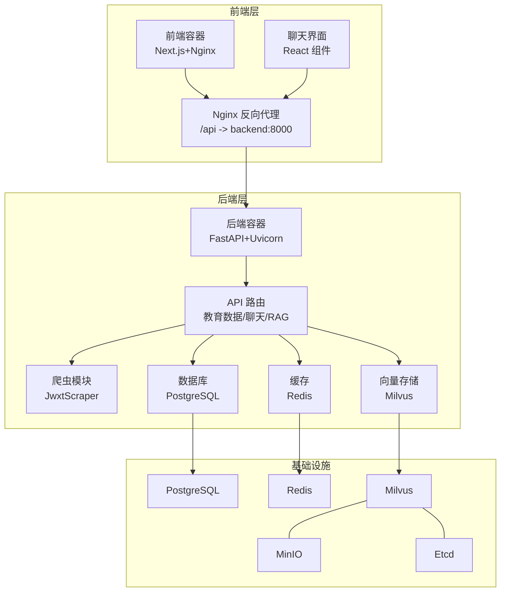
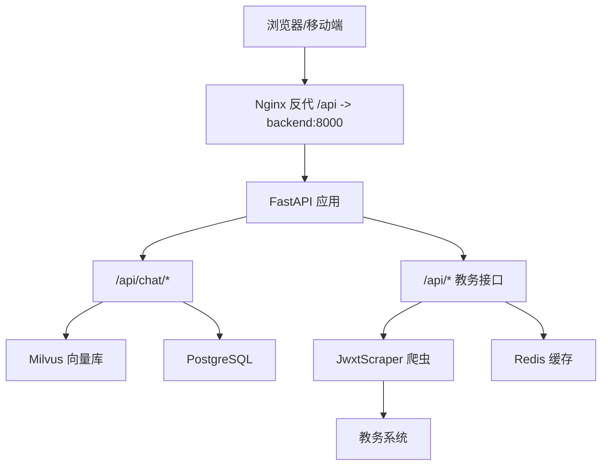
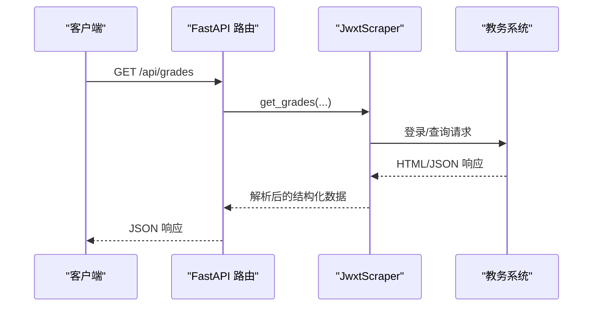
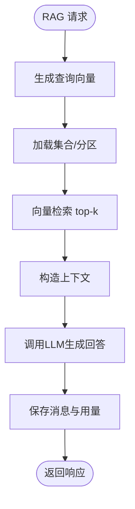
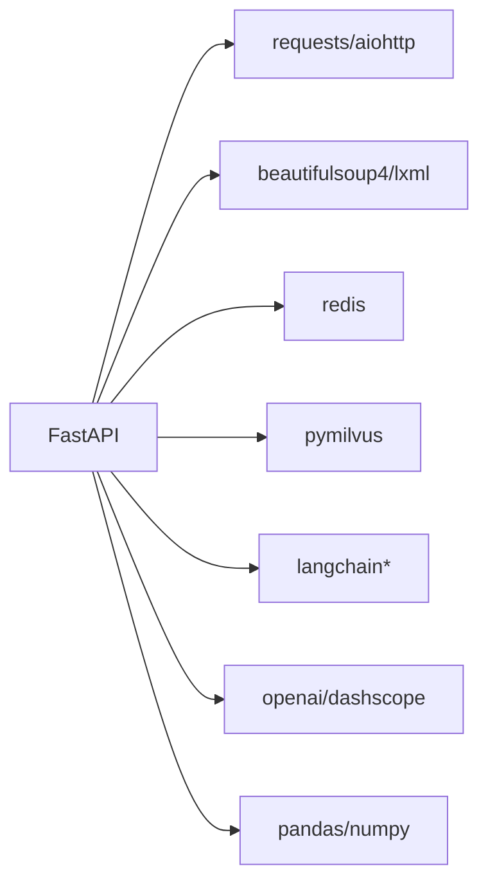

# 性能调试

<cite>
**本文档引用的文件**
- [backend/main.py](file://backend/main.py)
- [backend/app/api/chat.py](file://backend/app/api/chat.py)
- [backend/app/api/education.py](file://backend/app/api/education.py)
- [backend/app/services/vector_store.py](file://backend/app/services/vector_store.py)
- [backend/scraper.py](file://backend/scraper.py)
- [backend/requirements.txt](file://backend/requirements.txt)
- [docker-compose.yml](file://docker-compose.yml)
- [backend/Dockerfile](file://backend/Dockerfile)
- [frontend/src/app/chat/page.tsx](file://frontend/src/app/chat/page.tsx)
- [frontend/Dockerfile](file://frontend/Dockerfile)
- [frontend/nginx.conf](file://frontend/nginx.conf)
- [frontend/package.json](file://frontend/package.json)
- [backend/app/models/base.py](file://backend/app/models/base.py)
- [backend/app/models/conversation.py](file://backend/app/models/conversation.py)
- [backend/app/models/education_data.py](file://backend/app/models/education_data.py)
</cite>

## 目录
1. [简介](#简介)
2. [项目结构](#项目结构)
3. [核心组件](#核心组件)
4. [架构总览](#架构总览)
5. [详细组件分析](#详细组件分析)
6. [依赖分析](#依赖分析)
7. [性能考虑](#性能考虑)
8. [故障排查指南](#故障排查指南)
9. [结论](#结论)
10. [附录](#附录)

## 简介
本指南面向智能教务系统AI助手的性能调试需求，覆盖Python后端的内存/CPU/I/O分析、FastAPI优化、数据库与缓存、前端页面与网络性能、容器化监控与资源统计、向量检索与RAG优化、以及负载与压力测试方法。文档以仓库现有实现为基础，结合可落地的调试步骤与可视化图示，帮助快速定位瓶颈并给出优化建议。

## 项目结构
系统采用前后端分离与容器编排部署：
- 后端：FastAPI + Uvicorn，提供教务数据爬取、AI对话、RAG检索、数据库与缓存集成。
- 前端：Next.js + Nginx（反向代理），负责聊天界面与API交互。
- 容器：PostgreSQL、Redis、Etcd、MinIO、Milvus、后端、前端通过Compose编排。

图表来源
- [docker-compose.yml:1-148](file://docker-compose.yml#L1-L148)
- [frontend/nginx.conf:1-31](file://frontend/nginx.conf#L1-L31)
- [backend/Dockerfile:1-18](file://backend/Dockerfile#L1-L18)
- [frontend/Dockerfile:1-33](file://frontend/Dockerfile#L1-L33)

章节来源
- [docker-compose.yml:1-148](file://docker-compose.yml#L1-L148)
- [frontend/nginx.conf:1-31](file://frontend/nginx.conf#L1-L31)
- [backend/Dockerfile:1-18](file://backend/Dockerfile#L1-L18)
- [frontend/Dockerfile:1-33](file://frontend/Dockerfile#L1-L33)

## 核心组件
- FastAPI后端入口与路由：提供健康检查、验证码、登录、个人信息、成绩、课表、RAG对话等接口。
- 爬虫模块：封装对教务系统的登录、验证码、个人信息、成绩、课表等数据抓取逻辑。
- 向量存储服务：基于Milvus的集合管理、文档插入、相似度检索与用户数据清理。
- 数据模型：定义用户、对话、消息、教务数据等表结构及关系。
- 前端聊天页：负责用户输入、历史拉取、消息渲染与发送，通过Nginx反向代理访问后端API。

章节来源
- [backend/main.py:1-853](file://backend/main.py#L1-L853)
- [backend/scraper.py:1-1220](file://backend/scraper.py#L1-L1220)
- [backend/app/services/vector_store.py:1-164](file://backend/app/services/vector_store.py#L1-L164)
- [backend/app/models/conversation.py:1-42](file://backend/app/models/conversation.py#L1-L42)
- [backend/app/models/education_data.py:1-103](file://backend/app/models/education_data.py#L1-L103)
- [frontend/src/app/chat/page.tsx:1-491](file://frontend/src/app/chat/page.tsx#L1-L491)

## 架构总览
后端采用“API路由 → 业务服务（爬虫/RAG） → 数据库/缓存/向量库”的分层设计。前端通过Nginx统一暴露API，实现静态资源与反向代理。

图表来源
- [frontend/nginx.conf:12-23](file://frontend/nginx.conf#L12-L23)
- [backend/main.py:95-800](file://backend/main.py#L95-L800)
- [backend/app/api/chat.py:45-154](file://backend/app/api/chat.py#L45-L154)
- [backend/app/services/vector_store.py:14-164](file://backend/app/services/vector_store.py#L14-L164)
- [backend/scraper.py:13-800](file://backend/scraper.py#L13-L800)

## 详细组件分析

### FastAPI后端性能分析
- 异步与同步混合：当前路由多为同步函数，适合I/O密集型（HTTP请求、数据库）。对于CPU密集任务（如大文本向量化）建议拆分为后台任务或异步处理。
- 超时控制：请求超时普遍设置为10秒，建议针对不同接口区分超时阈值（如登录/验证码较短，数据聚合较长）。
- 日志与中间件：已启用CORS，建议增加请求追踪ID、GZip压缩、限流中间件，便于性能观测与压测。
- 会话与状态：内存级会话存储（SESSIONS）仅适用于开发，生产需迁移到Redis，避免多实例间状态不一致。

图表来源
- [backend/main.py:398-438](file://backend/main.py#L398-L438)
- [backend/scraper.py:153-237](file://backend/scraper.py#L153-L237)

章节来源
- [backend/main.py:1-853](file://backend/main.py#L1-L853)
- [backend/requirements.txt:1-44](file://backend/requirements.txt#L1-L44)

### 爬虫模块性能优化
- I/O瓶颈：HTML解析与正则匹配较多，建议：
  - 使用更高效的解析器（lxml）与CSS选择器减少DOM遍历。
  - 对重复解析的结果进行缓存（Redis键空间）。
  - 批量请求与连接复用，避免频繁建立TCP连接。
- 超时与重试：统一超时与指数退避重试策略，提升稳定性。
- 结果归一化：将解析结果标准化，减少后续处理分支。

章节来源
- [backend/scraper.py:1-1220](file://backend/scraper.py#L1-L1220)
- [backend/requirements.txt:10-17](file://backend/requirements.txt#L10-L17)

### 向量检索与RAG优化
- Milvus检索参数：当前nprobe较小，召回率与延迟权衡需根据数据规模调整；建议按用户维度分集合或分区，降低扫描范围。
- 文档插入：批量插入与flush策略需平衡实时性与吞吐；建议异步写入队列。
- 嵌入生成：将嵌入生成移至后台任务或异步队列，避免阻塞主请求。
- 上下文裁剪：限制RAG上下文长度，减少LLM调用成本。

图表来源
- [backend/app/api/chat.py:97-147](file://backend/app/api/chat.py#L97-L147)
- [backend/app/services/vector_store.py:100-142](file://backend/app/services/vector_store.py#L100-L142)

章节来源
- [backend/app/api/chat.py:1-224](file://backend/app/api/chat.py#L1-L224)
- [backend/app/services/vector_store.py:1-164](file://backend/app/services/vector_store.py#L1-L164)

### 数据库与缓存
- 连接池：当前使用SQLAlchemy同步引擎，建议：
  - 配置最大连接数、空闲连接、连接超时与回收策略。
  - 使用异步ORM（如SQLModel/AsyncSession）以提升并发。
- 缓存策略：对高频查询（如成绩、课表）加入Redis缓存，设置合理TTL与失效策略。
- 索引优化：对常用过滤字段（如user_id、username）建立索引，避免全表扫描。

章节来源
- [backend/app/models/base.py:1-29](file://backend/app/models/base.py#L1-L29)
- [backend/app/models/conversation.py:1-42](file://backend/app/models/conversation.py#L1-L42)
- [backend/app/models/education_data.py:1-103](file://backend/app/models/education_data.py#L1-L103)
- [backend/requirements.txt:19-20](file://backend/requirements.txt#L19-L20)

### 前端性能调试
- 页面加载时间：利用浏览器性能面板测量FCP/LCP/INP，关注首屏资源与脚本执行。
- JavaScript执行：使用Performance/Profiler定位长任务与阻塞UI的函数。
- 网络资源：通过Network面板检查API耗时、缓存命中、gzip压缩效果；Nginx已开启静态资源服务，建议开启浏览器缓存与CDN。
- 交互体验：聊天界面消息滚动、输入框自适应高度、加载态展示等细节影响感知性能。

章节来源
- [frontend/src/app/chat/page.tsx:1-491](file://frontend/src/app/chat/page.tsx#L1-L491)
- [frontend/nginx.conf:1-31](file://frontend/nginx.conf#L1-L31)
- [frontend/package.json:1-92](file://frontend/package.json#L1-L92)

### 容器化应用性能调试
- 资源监控：使用Compose健康检查与宿主机监控（CPU/内存/磁盘/网络）观察各服务资源占用。
- 端口与网络：确认Nginx反代端口映射、后端服务可达性；排查跨容器网络延迟。
- 日志聚合：集中收集后端、Nginx、数据库、缓存与向量库日志，定位慢查询与异常。

章节来源
- [docker-compose.yml:1-148](file://docker-compose.yml#L1-L148)
- [backend/Dockerfile:1-18](file://backend/Dockerfile#L1-L18)
- [frontend/Dockerfile:1-33](file://frontend/Dockerfile#L1-L33)

## 依赖分析
后端依赖涵盖Web框架、HTTP请求、HTML解析、爬虫工具、缓存、向量数据库、LangChain、AI模型、数据处理等模块。这些依赖直接影响I/O与CPU消耗，需结合运行环境进行针对性优化。

图表来源
- [backend/requirements.txt:1-44](file://backend/requirements.txt#L1-L44)

章节来源
- [backend/requirements.txt:1-44](file://backend/requirements.txt#L1-L44)

## 性能考虑
- Python应用
  - 内存：使用内存分析工具（如memory_profiler）定位大对象与缓存膨胀；避免在请求上下文中累积临时数据。
  - CPU：将CPU密集任务（如向量化、复杂计算）放入进程池或异步队列；减少主线程阻塞。
  - I/O：统一超时与重试、连接池复用、批量处理、GZip压缩。
- FastAPI优化
  - 异步化：对I/O密集接口（爬虫、数据库、向量检索）优先采用异步实现。
  - 中间件：增加请求追踪、限流、熔断与指标上报。
  - 路由拆分：将大接口拆分为小接口，减少单次请求处理时间。
- 数据库与缓存
  - 连接池：合理设置最大连接数、空闲回收、超时；使用连接池监控。
  - 索引：对高选择性字段建立索引；定期分析慢查询。
  - 缓存：热点数据预热、TTL策略、缓存穿透防护。
- 前端
  - 资源优化：启用GZip/Brotli、CDN、懒加载、骨架屏；减少首屏JS体积。
  - 交互优化：虚拟滚动、防抖/节流、离线提示。
- 容器化
  - 资源配额：为各服务设置CPU/内存限制与HPA；观察容器重启与OOM事件。
  - 网络：减少跨主机调用次数，合并请求；优化DNS解析。
- AI服务
  - 向量检索：调整nprobe与索引类型；按用户分区；缓存热门查询结果。
  - 模型调用：批量化请求、降采样、上下文裁剪；引入模型缓存。
  - RAG：精简上下文、结构化提示词、分段检索与融合策略。

## 故障排查指南
- 内存泄漏检测
  - 使用内存分析工具对比请求前后的对象数量与大小，定位未释放的全局缓存或会话。
  - 检查SESSIONS与CAPTCHA_SESSIONS是否及时清理。
- CPU热点分析
  - 使用火焰图定位热点函数（如HTML解析、正则匹配、向量计算）。
  - 将CPU密集任务异步化或迁移至专用服务。
- I/O阻塞排查
  - 检查网络超时、DNS解析、TLS握手耗时；对第三方接口增加超时与重试。
  - 使用连接池与复用，避免频繁建立连接。
- 数据库慢查询
  - 分析慢查询日志，补充缺失索引；拆分大查询为分页或增量处理。
- 向量检索慢
  - 调整nprobe、索引类型与分区；限制top-k与上下文长度。
- 前端卡顿
  - 使用Performance面板定位长任务；优化消息渲染与滚动逻辑。

章节来源
- [backend/main.py:73-93](file://backend/main.py#L73-L93)
- [backend/app/api/chat.py:97-147](file://backend/app/api/chat.py#L97-L147)
- [backend/app/services/vector_store.py:100-142](file://backend/app/services/vector_store.py#L100-L142)

## 结论
本系统在数据爬取、RAG检索与前后端交互方面具备清晰的分层架构。性能优化的关键在于：I/O异步化、连接池与缓存策略、向量检索参数调优、数据库索引与查询优化、前端资源与交互体验优化，以及容器化资源与网络治理。建议结合监控与压测持续迭代，逐步提升系统稳定性与用户体验。

## 附录
- 负载与压力测试方法
  - 并发用户模拟：使用工具对关键接口（登录、成绩、课表、RAG）施加并发压力。
  - 响应时间测试：记录P50/P95/P99延迟，识别尾延迟来源。
  - 系统稳定性评估：逐步提升负载，观察错误率、超时率与资源占用，确定系统上限。
- 常用观测指标
  - 后端：请求QPS、延迟分布、错误率、连接池利用率、GC频率。
  - 数据库：连接数、锁等待、慢查询、缓冲池命中率。
  - 缓存：命中率、淘汰率、内存占用。
  - 向量库：查询延迟、召回率、写入吞吐、集群健康。
  - 前端：首屏时间、交互延迟、网络请求数与大小。