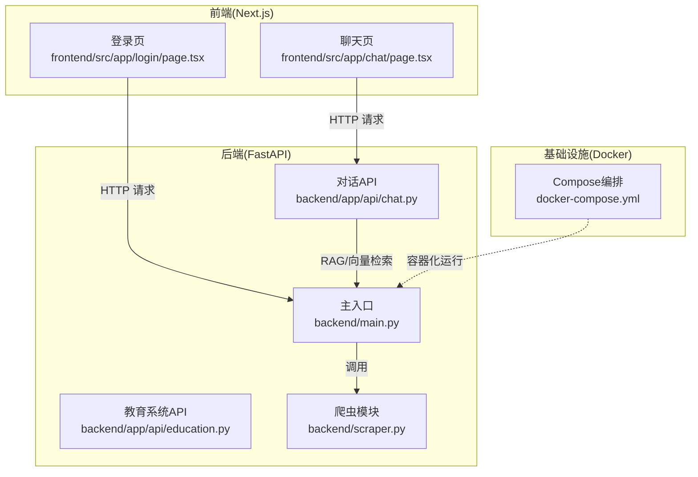
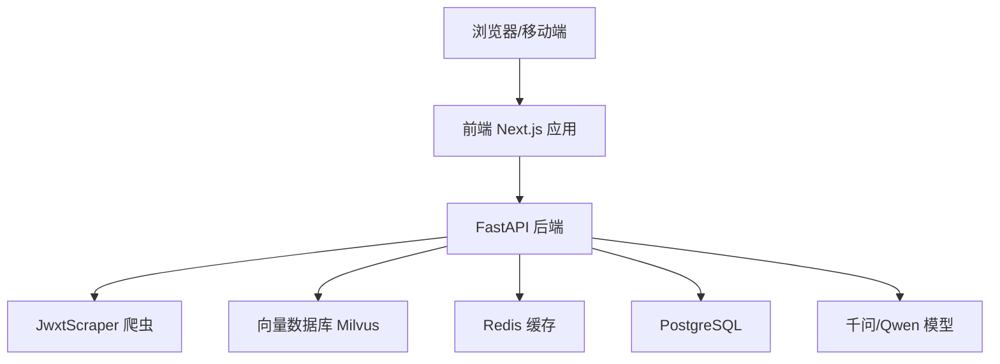
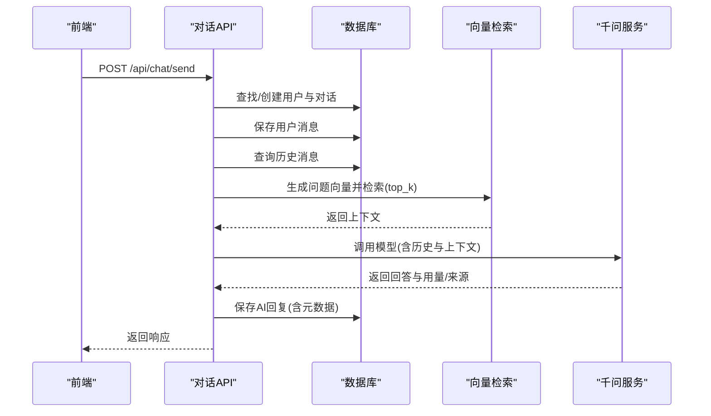
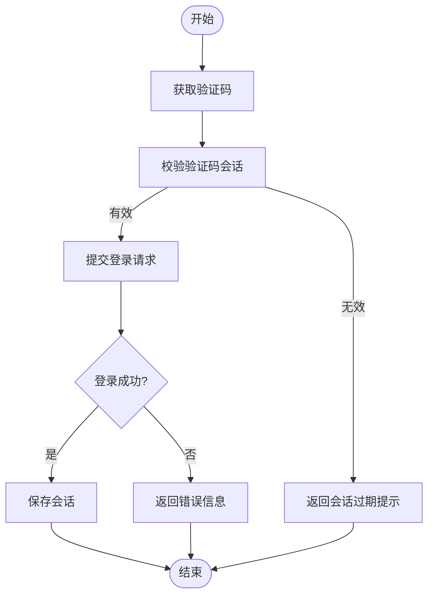
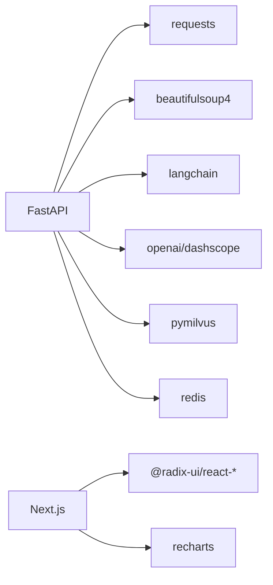

# 调试工具

<cite>
**本文引用的文件**
- [backend/main.py](file://backend/main.py)
- [backend/app/api/chat.py](file://backend/app/api/chat.py)
- [backend/app/api/education.py](file://backend/app/api/education.py)
- [backend/scraper.py](file://backend/scraper.py)
- [backend/test_login.py](file://backend/test_login.py)
- [backend/test_scraper.py](file://backend/test_scraper.py)
- [backend/requirements.txt](file://backend/requirements.txt)
- [frontend/src/app/chat/page.tsx](file://frontend/src/app/chat/page.tsx)
- [frontend/src/app/login/page.tsx](file://frontend/src/app/login/page.tsx)
- [frontend/package.json](file://frontend/package.json)
- [scripts/dev.sh](file://scripts/dev.sh)
- [scripts/start.sh](file://scripts/start.sh)
- [docker-compose.yml](file://docker-compose.yml)
- [tsconfig.json](file://tsconfig.json)
- [next.config.ts](file://next.config.ts)
- [README-Windows.md](file://README-Windows.md)
</cite>

## 目录
1. [简介](#简介)
2. [项目结构](#项目结构)
3. [核心组件](#核心组件)
4. [架构总览](#架构总览)
5. [详细组件分析](#详细组件分析)
6. [依赖分析](#依赖分析)
7. [性能考虑](#性能考虑)
8. [故障排查指南](#故障排查指南)
9. [结论](#结论)
10. [附录](#附录)

## 简介
本指南面向智能教务系统AI助手项目的开发者，提供覆盖后端Python、前端TypeScript以及API调试的完整工具与技巧。内容涵盖：
- 后端调试：pdb断点调试、日志记录与错误追踪、异常处理最佳实践
- 前端调试：浏览器开发者工具、React DevTools、TypeScript调试配置
- API调试：Postman与curl使用、网络请求监控与响应验证
- 性能分析：内存泄漏检测、CPU性能分析、网络性能监控
- 错误日志分析：异常堆栈跟踪与定位技巧
- 常见问题诊断流程与解决方案

## 项目结构
项目采用前后端分离架构，后端基于FastAPI，前端基于Next.js 16（TypeScript）。后端负责教务系统数据爬取、AI对话与RAG、选项查询等能力；前端提供登录、聊天对话与快捷查询界面。

图表来源
- [backend/main.py](file://backend/main.py)
- [backend/app/api/chat.py](file://backend/app/api/chat.py)
- [backend/app/api/education.py](file://backend/app/api/education.py)
- [backend/scraper.py](file://backend/scraper.py)
- [frontend/src/app/login/page.tsx](file://frontend/src/app/login/page.tsx)
- [frontend/src/app/chat/page.tsx](file://frontend/src/app/chat/page.tsx)
- [docker-compose.yml](file://docker-compose.yml)

章节来源
- [backend/main.py](file://backend/main.py)
- [frontend/src/app/login/page.tsx](file://frontend/src/app/login/page.tsx)
- [frontend/src/app/chat/page.tsx](file://frontend/src/app/chat/page.tsx)
- [docker-compose.yml](file://docker-compose.yml)

## 核心组件
- 后端主入口与路由：提供健康检查、验证码、登录、个人信息、成绩、课表、培养方案、考试安排、教师/课程查询、选项查询等接口，并注册AI对话路由（条件可用）。
- 爬虫模块：封装对教务系统的登录、验证码、个人信息、学籍卡片、成绩、课表、培养方案、学业进度、考试安排、执行计划、选课信息等数据抓取逻辑。
- AI对话API：实现用户认证、对话历史管理、RAG检索与千问模型调用、消息持久化与返回结构。
- 前端页面：登录页负责验证码获取与登录提交；聊天页负责对话历史拉取、消息发送、快捷问题与侧边栏管理。

章节来源
- [backend/main.py](file://backend/main.py)
- [backend/scraper.py](file://backend/scraper.py)
- [backend/app/api/chat.py](file://backend/app/api/chat.py)
- [frontend/src/app/login/page.tsx](file://frontend/src/app/login/page.tsx)
- [frontend/src/app/chat/page.tsx](file://frontend/src/app/chat/page.tsx)

## 架构总览
后端以FastAPI为核心，统一处理HTTP请求，内部通过JwxtScraper与教务系统交互，部分接口支持AI增强（RAG）。前端通过fetch发起请求，经Nginx反向代理转发至后端。

图表来源
- [backend/main.py](file://backend/main.py)
- [backend/scraper.py](file://backend/scraper.py)
- [docker-compose.yml](file://docker-compose.yml)

## 详细组件分析

### 后端调试：FastAPI + 日志 + 异常处理
- 日志配置：后端使用标准库日志模块，按需输出请求、登录、验证码、数据爬取等关键节点信息，便于定位问题。
- 异常处理：统一捕获业务异常与通用异常，返回HTTP异常或详细错误信息，避免内部异常栈泄露。
- 调试建议：
  - 使用pdb在关键函数入口设置断点，逐步观察参数与中间状态。
  - 在登录、验证码、数据爬取等流程增加更细粒度的日志级别（如DEBUG），结合后端终端输出定位问题。
  - 对外部请求（requests/aiohttp）设置合理超时与重试策略，避免阻塞导致的长时间无响应。

章节来源
- [backend/main.py](file://backend/main.py)
- [backend/scraper.py](file://backend/scraper.py)

### AI对话API调试：RAG与消息持久化
- 关键流程：用户认证 → 查找/创建用户与对话 → 保存用户消息 → 历史消息拼接 → RAG检索上下文 → 调用模型生成回答 → 保存AI回复 → 返回结果。
- 调试要点：
  - 检查数据库连接与表结构，确认用户、对话、消息表存在且字段一致。
  - RAG检索失败时记录告警，确保不影响对话主流程。
  - 对话历史数量与顺序需与前端展示一致，避免消息错位。

图表来源
- [backend/app/api/chat.py](file://backend/app/api/chat.py)

章节来源
- [backend/app/api/chat.py](file://backend/app/api/chat.py)

### 教育系统API调试：登录与数据抓取
- 登录流程：前端获取验证码并携带captcha_session_id，后端校验会话有效性与服务器一致性，再向教务系统提交登录请求，解析响应判断登录结果。
- 数据抓取：通过JwxtScraper封装各类查询接口，统一处理HTML解析与数据清洗，返回标准化结构。
- 调试建议：
  - 使用独立脚本（如test_login.py）模拟登录与验证码流程，验证服务器连通性与登录逻辑。
  - 对HTML解析失败场景增加容错与日志，避免因页面结构调整导致崩溃。

图表来源
- [backend/main.py](file://backend/main.py)
- [backend/test_login.py](file://backend/test_login.py)

章节来源
- [backend/main.py](file://backend/main.py)
- [backend/test_login.py](file://backend/test_login.py)

### 前端调试：浏览器工具 + React DevTools + TypeScript
- 浏览器开发者工具：
  - Network面板：观察登录、验证码、对话等请求的URL、Headers、Body与响应状态码。
  - Console面板：查看fetch错误、状态码非2xx时的提示与控制台报错。
  - Elements面板：检查页面元素渲染与样式问题。
- React DevTools：定位组件状态变化、Props传递与副作用触发点。
- TypeScript调试：
  - tsconfig.json启用严格模式与noEmit，结合IDE类型提示快速发现潜在问题。
  - next.config.ts配置远程图片与开发源，避免跨域与资源加载问题。

章节来源
- [frontend/src/app/login/page.tsx](file://frontend/src/app/login/page.tsx)
- [frontend/src/app/chat/page.tsx](file://frontend/src/app/chat/page.tsx)
- [tsconfig.json](file://tsconfig.json)
- [next.config.ts](file://next.config.ts)

### API调试最佳实践：Postman与curl
- Postman：
  - 创建集合，分别组织“验证码”“登录”“个人信息”“成绩/课表/培养方案”等请求。
  - 使用环境变量管理基础URL、学号、密码、验证码会话ID等。
  - 设置预请求脚本动态注入captcha_session_id，或在Tests中提取响应字段。
- curl：
  - 获取验证码：curl -i "http://localhost:8000/api/captcha?username=学号"
  - 登录：curl -X POST "http://localhost:8000/api/login" -H "Content-Type: application/json" -d '{"username":"学号","password":"密码","code":"验证码","captcha_session_id":"会话ID"}'
  - 获取成绩：curl "http://localhost:8000/api/grades?username=学号&xsfs=all"
- 网络监控：
  - 使用浏览器Network面板或Wireshark/Fiddler拦截请求，核对Header、Cookie与CSRF相关字段。
  - 关注CORS配置，确保前端域名与后端CORS放行一致。

章节来源
- [backend/main.py](file://backend/main.py)
- [frontend/src/app/login/page.tsx](file://frontend/src/app/login/page.tsx)
- [frontend/src/app/chat/page.tsx](file://frontend/src/app/chat/page.tsx)

### 性能分析与监控
- 内存泄漏检测：
  - 后端：对长生命周期对象（如全局Session、向量检索客户端）进行显式释放与周期性清理。
  - 前端：使用Chrome Memory面板录制Heap快照，对比多次操作后的对象保留情况，排查事件监听器未移除、定时器未清理等问题。
- CPU性能分析：
  - 后端：使用cProfile或py-spy采样分析慢函数，关注HTML解析、网络请求与模型推理耗时。
  - 前端：使用Performance面板记录渲染与JS执行，识别重绘/回流热点与长任务。
- 网络性能监控：
  - 使用Network面板分析请求耗时、DNS解析、TCP握手与TLS协商时间。
  - 对大响应体（如成绩/课表）启用分页或懒加载，减少首屏压力。

[本节为通用指导，不直接分析具体文件]

## 依赖分析
后端依赖以FastAPI为核心，配合requests、BeautifulSoup、LangChain、OpenAI/DashScope、Milvus、Redis等；前端依赖Next.js、Radix UI、Recharts等。

图表来源
- [backend/requirements.txt](file://backend/requirements.txt)
- [frontend/package.json](file://frontend/package.json)

章节来源
- [backend/requirements.txt](file://backend/requirements.txt)
- [frontend/package.json](file://frontend/package.json)

## 性能考虑
- 后端：
  - 合理设置请求超时与重试，避免阻塞主线程。
  - 对外部HTML解析与正则匹配进行边界检查，防止异常输入导致CPU飙升。
  - 对向量检索与模型调用增加缓存与降级策略。
- 前端：
  - 控制消息列表渲染数量，使用虚拟滚动优化长列表。
  - 合理拆分请求，避免一次性拉取过多数据。
  - 使用React.memo/useMemo/useCallback减少不必要的重渲染。

[本节为通用指导，不直接分析具体文件]

## 故障排查指南
- 验证码无法显示/登录失败
  - 确认前端已正确传递username以选择服务器，后端日志中包含服务器选择与验证码会话ID。
  - 使用独立脚本（test_login.py）验证验证码获取与登录流程。
- 会话过期或登录态丢失
  - 检查CAPTCHA_SESSIONS清理逻辑与超时设置，确认前端在登录失败后刷新验证码并清空输入。
- 数据爬取失败
  - 使用test_scraper.py检查方法存在性与参数签名，关注HTML结构变化导致的解析失败。
- 前端请求异常
  - 使用Network面板检查CORS、Cookie与状态码；Console面板查看fetch错误与Promise拒绝。
- 容器化运行问题
  - 使用docker-compose健康检查确认数据库、缓存与向量库可用；检查端口映射与环境变量。

章节来源
- [backend/main.py](file://backend/main.py)
- [backend/test_login.py](file://backend/test_login.py)
- [backend/test_scraper.py](file://backend/test_scraper.py)
- [docker-compose.yml](file://docker-compose.yml)

## 结论
通过日志、断点、网络监控与容器化编排，结合前后端调试工具链，可高效定位与解决智能教务系统AI助手在登录、数据爬取与AI对话过程中的问题。建议在开发阶段持续使用Postman/curl进行API验证，在生产环境开启结构化日志与健康检查，保障系统稳定性与可观测性。

[本节为总结性内容，不直接分析具体文件]

## 附录

### 后端调试脚本与命令
- 启动后端（开发）：python -m backend.main 或使用脚本
- 启动前端（开发）：npm run dev
- 健康检查：curl http://localhost:8000/api/health
- 获取验证码：curl "http://localhost:8000/api/captcha?username=学号"
- 登录：curl -X POST "http://localhost:8000/api/login" -H "Content-Type: application/json" -d '{"username":"学号","password":"密码","code":"验证码","captcha_session_id":"会话ID"}'

章节来源
- [README-Windows.md](file://README-Windows.md)
- [scripts/dev.sh](file://scripts/dev.sh)
- [scripts/start.sh](file://scripts/start.sh)
- [backend/main.py](file://backend/main.py)