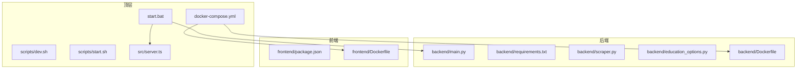
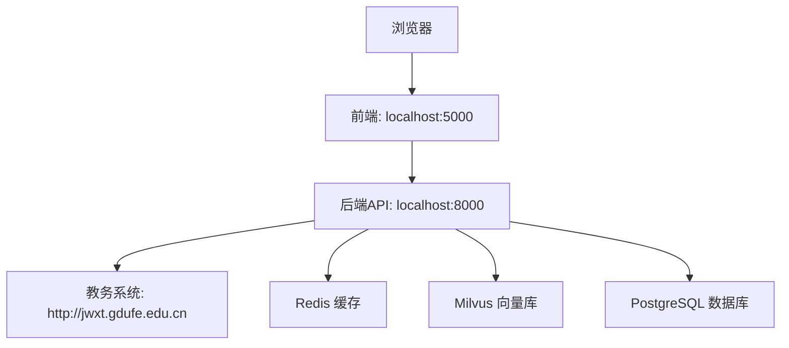
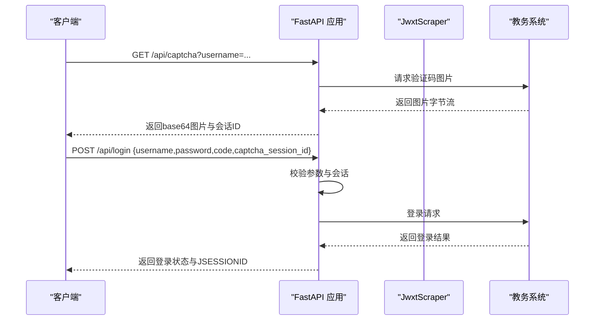
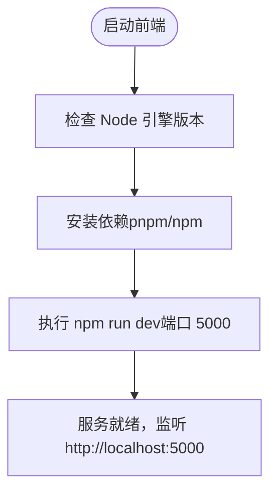
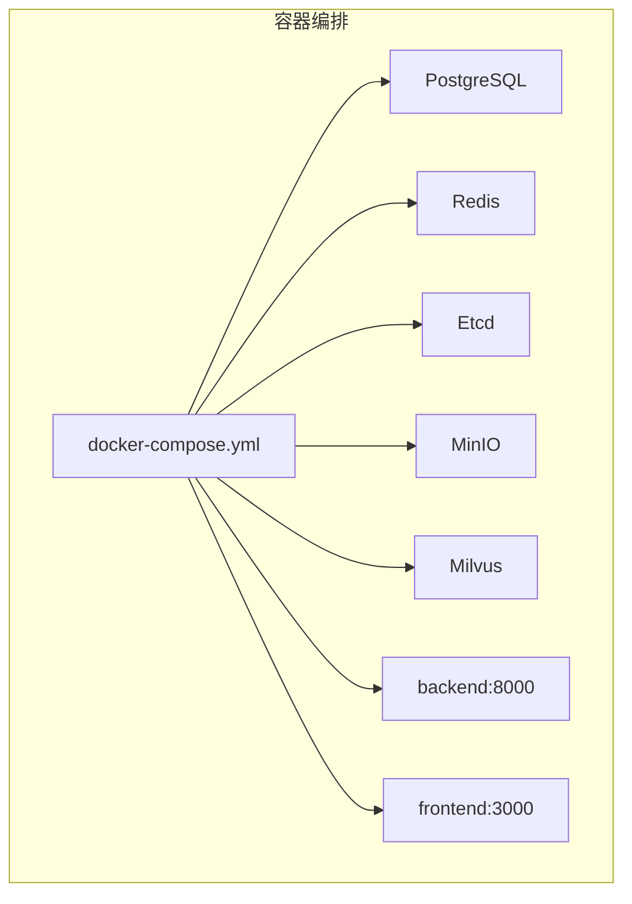
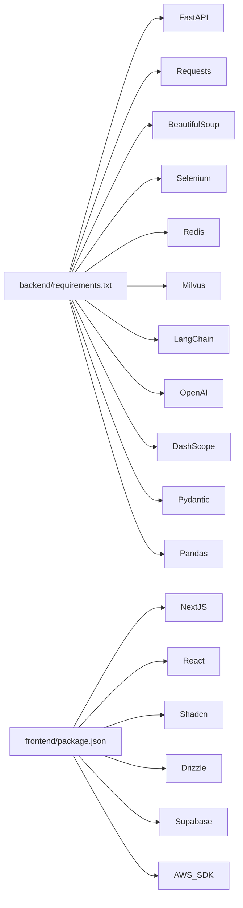

# 快速开始

<cite>
**本文引用的文件**
- [README-Windows.md](file://README-Windows.md)
- [package.json](file://package.json)
- [backend/requirements.txt](file://backend/requirements.txt)
- [backend/main.py](file://backend/main.py)
- [frontend/package.json](file://frontend/package.json)
- [docker-compose.yml](file://docker-compose.yml)
- [backend/Dockerfile](file://backend/Dockerfile)
- [frontend/Dockerfile](file://frontend/Dockerfile)
- [start.bat](file://start.bat)
- [src/server.ts](file://src/server.ts)
- [scripts/dev.sh](file://scripts/dev.sh)
- [scripts/start.sh](file://scripts/start.sh)
- [backend/education_options.py](file://backend/education_options.py)
- [backend/scraper.py](file://backend/scraper.py)
</cite>

## 目录
1. [简介](#简介)
2. [项目结构](#项目结构)
3. [核心组件](#核心组件)
4. [架构总览](#架构总览)
5. [详细组件分析](#详细组件分析)
6. [依赖关系分析](#依赖关系分析)
7. [性能注意事项](#性能注意事项)
8. [故障排除指南](#故障排除指南)
9. [结论](#结论)
10. [附录](#附录)

## 简介
本指南面向首次参与“智能教务系统AI助手”项目的开发者，帮助你在Windows环境下快速完成开发环境准备、依赖安装、服务启动与基础验证。项目采用前后端分离架构：后端基于FastAPI，前端基于Next.js（TypeScript）。同时提供一键启动脚本与容器化编排方案，便于快速上手。

## 项目结构
项目采用多模块组织方式，主要包含：
- 后端（FastAPI）：位于 backend/，提供教务系统数据爬取与API服务
- 前端（Next.js）：位于 frontend/，提供Web界面与交互
- 顶层脚本与配置：包含一键启动脚本、Docker编排、Node脚本等
- 其他模块：教育选项工具、爬虫实现等

**图表来源**
- [backend/main.py:1-853](file://backend/main.py#L1-L853)
- [backend/requirements.txt:1-44](file://backend/requirements.txt#L1-L44)
- [backend/scraper.py:1-1220](file://backend/scraper.py#L1-L1220)
- [backend/education_options.py:1-420](file://backend/education_options.py#L1-L420)
- [frontend/package.json:1-92](file://frontend/package.json#L1-L92)
- [docker-compose.yml:1-148](file://docker-compose.yml#L1-L148)
- [start.bat:1-51](file://start.bat#L1-L51)
- [src/server.ts:1-36](file://src/server.ts#L1-L36)
- [scripts/dev.sh:1-35](file://scripts/dev.sh#L1-L35)
- [scripts/start.sh:1-18](file://scripts/start.sh#L1-L18)

**章节来源**
- [README-Windows.md:213-228](file://README-Windows.md#L213-L228)
- [docker-compose.yml:1-148](file://docker-compose.yml#L1-L148)

## 核心组件
- 后端服务（FastAPI）
  - 提供健康检查、验证码、登录、个人信息、成绩、课表、培养方案、考试安排等接口
  - 内置教务系统爬虫模块，负责模拟登录与数据抓取
- 前端服务（Next.js）
  - 提供登录页、仪表盘等页面，使用TypeScript与Shadcn/UI组件库
  - 通过脚本指定开发端口为5000
- 环境与工具
  - Node.js 18+（引擎要求在package.json中声明）
  - Python 3.8+（Windows文档与Dockerfile均指向Python 3.11镜像）
  - Anaconda（推荐用于Python虚拟环境管理）
  - Docker Compose（可选，用于一键拉起后端依赖服务）

**章节来源**
- [backend/main.py:95-124](file://backend/main.py#L95-L124)
- [backend/scraper.py:13-60](file://backend/scraper.py#L13-L60)
- [frontend/package.json:87-90](file://frontend/package.json#L87-L90)
- [README-Windows.md:9-16](file://README-Windows.md#L9-L16)
- [docker-compose.yml:1-148](file://docker-compose.yml#L1-L148)

## 架构总览
系统采用前后端分离架构，后端提供REST API，前端通过Next.js进行渲染与交互。开发模式下，前端默认监听5000端口，后端默认监听8000端口；容器化部署时，前端暴露3000端口，后端暴露8000端口。

**图表来源**
- [backend/main.py:50-71](file://backend/main.py#L50-L71)
- [docker-compose.yml:113-129](file://docker-compose.yml#L113-L129)

## 详细组件分析

### 后端服务（FastAPI）
- 启动入口与路由
  - 根路径返回可用端点列表
  - 健康检查端点用于服务可用性验证
  - 验证码与登录接口支持学号选择服务器与会话管理
  - 数据爬取接口覆盖个人信息、成绩、课表、培养方案、考试安排等
- 爬虫模块
  - JwxtScraper封装了验证码获取、登录、个人信息、成绩、课表、培养方案、学业进度、考试安排等方法
  - 使用BeautifulSoup解析HTML，提取所需字段
- 依赖清单
  - Web框架、HTTP请求、HTML解析、爬虫工具、缓存、向量数据库、LangChain、AI模型、工具与数据处理库

**图表来源**
- [backend/main.py:135-190](file://backend/main.py#L135-L190)
- [backend/main.py:192-328](file://backend/main.py#L192-L328)
- [backend/scraper.py:22-60](file://backend/scraper.py#L22-L60)

**章节来源**
- [backend/main.py:95-124](file://backend/main.py#L95-L124)
- [backend/main.py:135-190](file://backend/main.py#L135-L190)
- [backend/main.py:192-328](file://backend/main.py#L192-L328)
- [backend/scraper.py:13-60](file://backend/scraper.py#L13-L60)
- [backend/requirements.txt:1-44](file://backend/requirements.txt#L1-L44)

### 前端服务（Next.js）
- 端口与脚本
  - 开发脚本指定端口为5000
  - 生产脚本同样指定端口为5000
- 依赖与引擎
  - Node.js 18+（engines声明）
  - TypeScript、React、Tailwind CSS、Shadcn/UI等
- 服务器启动
  - 顶层server.ts使用Next.js创建HTTP服务，默认监听5000端口

**图表来源**
- [frontend/package.json:5-11](file://frontend/package.json#L5-L11)
- [frontend/package.json:87-90](file://frontend/package.json#L87-L90)
- [src/server.ts:1-36](file://src/server.ts#L1-L36)

**章节来源**
- [frontend/package.json:5-11](file://frontend/package.json#L5-L11)
- [frontend/package.json:87-90](file://frontend/package.json#L87-L90)
- [src/server.ts:1-36](file://src/server.ts#L1-L36)

### 一键启动与容器化
- 一键启动脚本（Windows）
  - 自动检查Anaconda与虚拟环境，分别启动后端（FastAPI）与前端（Next.js）
  - 后端监听8000，前端监听5000
- Docker编排
  - 后端依赖：PostgreSQL、Redis、Etcd、MinIO、Milvus
  - 后端镜像暴露8000端口
  - 前端镜像暴露3000端口
  - 通过环境变量配置数据库、缓存、向量库、AI模型等

**图表来源**
- [docker-compose.yml:1-148](file://docker-compose.yml#L1-L148)
- [backend/Dockerfile:1-18](file://backend/Dockerfile#L1-L18)
- [frontend/Dockerfile:1-33](file://frontend/Dockerfile#L1-L33)

**章节来源**
- [start.bat:1-51](file://start.bat#L1-L51)
- [docker-compose.yml:1-148](file://docker-compose.yml#L1-L148)
- [backend/Dockerfile:1-18](file://backend/Dockerfile#L1-L18)
- [frontend/Dockerfile:1-33](file://frontend/Dockerfile#L1-L33)

## 依赖关系分析
- 后端依赖
  - Web框架：FastAPI、Uvicorn
  - HTTP与解析：Requests、aiohttp、BeautifulSoup4、lxml
  - 爬虫工具：Pyppeteer、Selenium、webdriver-manager
  - 缓存与向量库：Redis、Milvus（含grpcio）
  - AI与链路：LangChain、OpenAI、DashScope
  - 工具与数据：Pillow、Pydantic、NumPy、Pandas
- 前端依赖
  - Next.js 16、React 19、TypeScript
  - UI组件：Shadcn/UI、Radix UI、Lucide React
  - 图表与工具：Recharts、Date-fns、Zod、React Hook Form
  - 数据库与ORM：Supabase、Drizzle ORM
  - AWS SDK：S3客户端与上传

**图表来源**
- [backend/requirements.txt:1-44](file://backend/requirements.txt#L1-L44)
- [frontend/package.json:12-68](file://frontend/package.json#L12-L68)

**章节来源**
- [backend/requirements.txt:1-44](file://backend/requirements.txt#L1-L44)
- [frontend/package.json:12-68](file://frontend/package.json#L12-L68)

## 性能注意事项
- 爬虫性能
  - 使用会话复用与超时控制，避免重复建立连接
  - 解析HTML时尽量定位唯一节点，减少DOM遍历
- 缓存策略
  - 使用Redis缓存验证码与登录态，降低重复请求
- 向量检索
  - Milvus索引与分区策略影响查询性能，建议按业务维度合理分桶
- 前端性能
  - Next.js按需加载与静态导出可提升首屏速度
  - Tailwind CSS按需引入，避免打包体积过大

## 故障排除指南
- 端口冲突
  - 后端默认8000，前端默认5000；若被占用，可在启动脚本或Docker端口映射处调整
  - Windows下可通过任务管理器结束占用进程或修改端口
- 依赖安装失败
  - 后端：使用国内镜像源安装requirements.txt
  - 前端：配置npm镜像源、关闭代理、清理缓存后重试
- 验证码无法显示
  - 需要连接校园网或VPN以访问教务系统
  - 检查验证码接口返回与会话有效期
- 登录失败
  - 核对用户名、密码、验证码是否正确
  - 检查是否停留在登录页面或返回错误提示
- 一键启动脚本问题
  - 确保已安装Anaconda，虚拟环境已创建并激活
  - 若端口被占用，先释放端口再启动

**章节来源**
- [README-Windows.md:232-291](file://README-Windows.md#L232-L291)
- [README-Windows.md:266-282](file://README-Windows.md#L266-L282)
- [README-Windows.md:234-251](file://README-Windows.md#L234-L251)
- [start.bat:10-26](file://start.bat#L10-L26)

## 结论
通过本指南，你可以在Windows环境下完成开发环境准备、依赖安装与服务启动，并掌握常见问题的排查方法。建议在具备网络访问教务系统的前提下进行登录与数据爬取测试，逐步扩展AI问答与RAG能力。

## 附录

### 开发环境前置要求
- Windows 10/11
- Python 3.8+（推荐使用Anaconda创建虚拟环境）
- Node.js 18+（engines在package.json中声明）
- Git（可选）
- Docker（可选，用于容器化部署）

**章节来源**
- [README-Windows.md:9-16](file://README-Windows.md#L9-L16)
- [frontend/package.json:87-90](file://frontend/package.json#L87-L90)

### 安装与启动步骤（Windows）
- 步骤概览
  - 创建并激活Python虚拟环境（Anaconda推荐）
  - 配置pip镜像源
  - 安装后端依赖（backend/requirements.txt）
  - 启动后端服务（FastAPI）
  - 配置npm镜像源与缓存
  - 安装前端依赖（frontend/package.json）
  - 启动前端服务（Next.js）
  - 访问应用（http://localhost:5000）

**章节来源**
- [README-Windows.md:38-162](file://README-Windows.md#L38-L162)

### 健康检查与基本验证
- 健康检查
  - 访问后端健康检查接口，确认返回状态正常
- 验证码与登录
  - 获取验证码图片并尝试登录，注意网络与验证码有效性
- 预期输出
  - 后端启动日志包含监听地址
  - 前端启动日志包含监听地址与Ready提示

**章节来源**
- [README-Windows.md:171-211](file://README-Windows.md#L171-L211)
- [backend/main.py:126-129](file://backend/main.py#L126-L129)
- [README-Windows.md:85-99](file://README-Windows.md#L85-L99)
- [README-Windows.md:142-153](file://README-Windows.md#L142-L153)