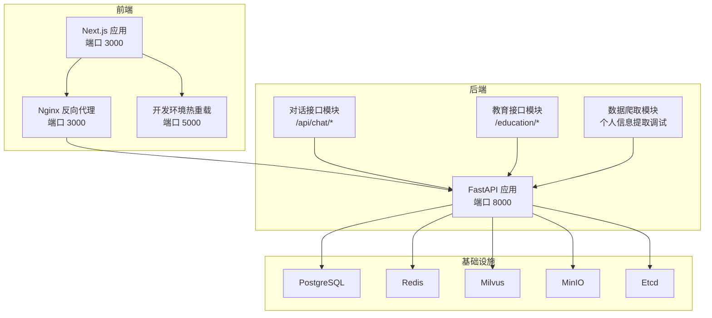
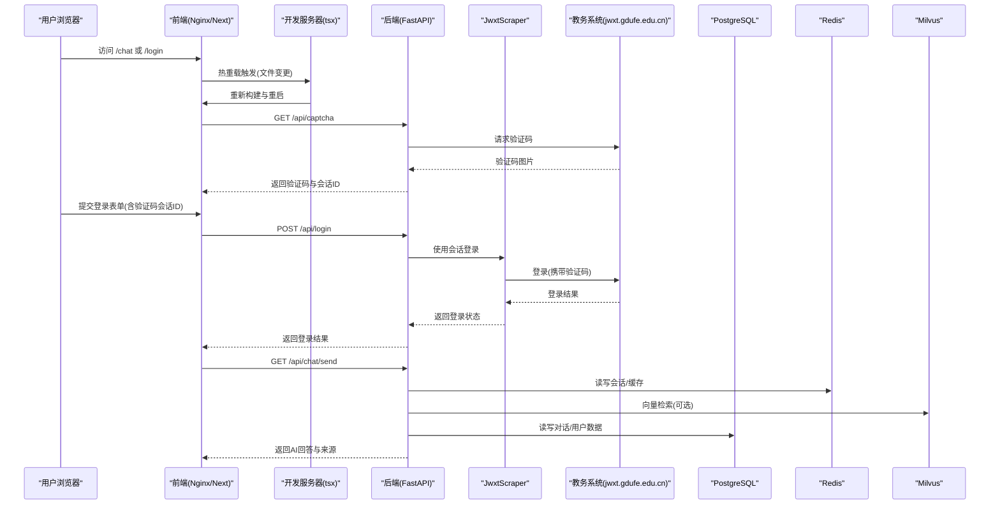
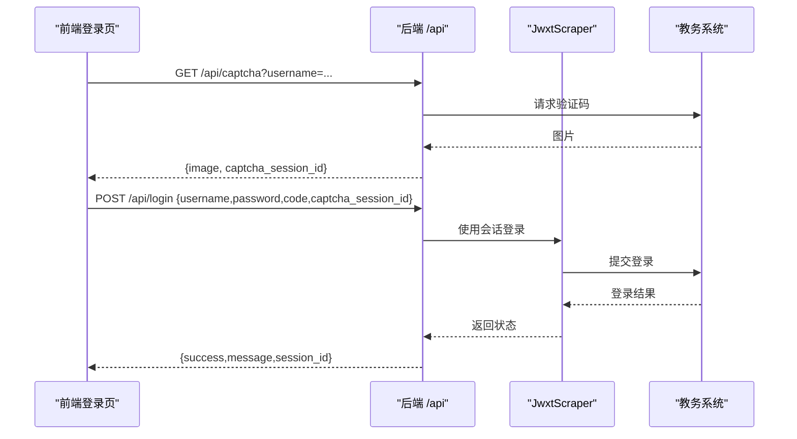
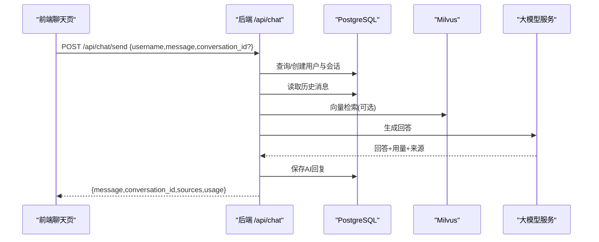
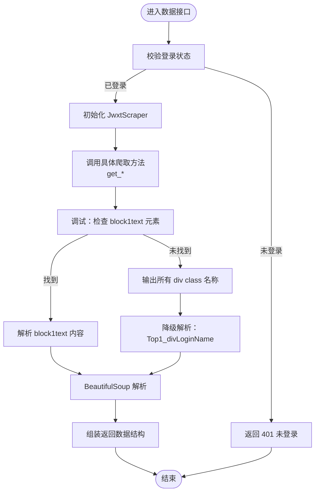
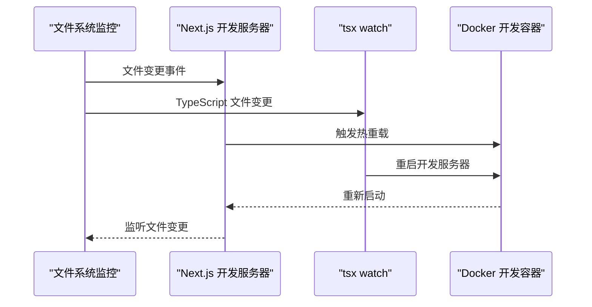
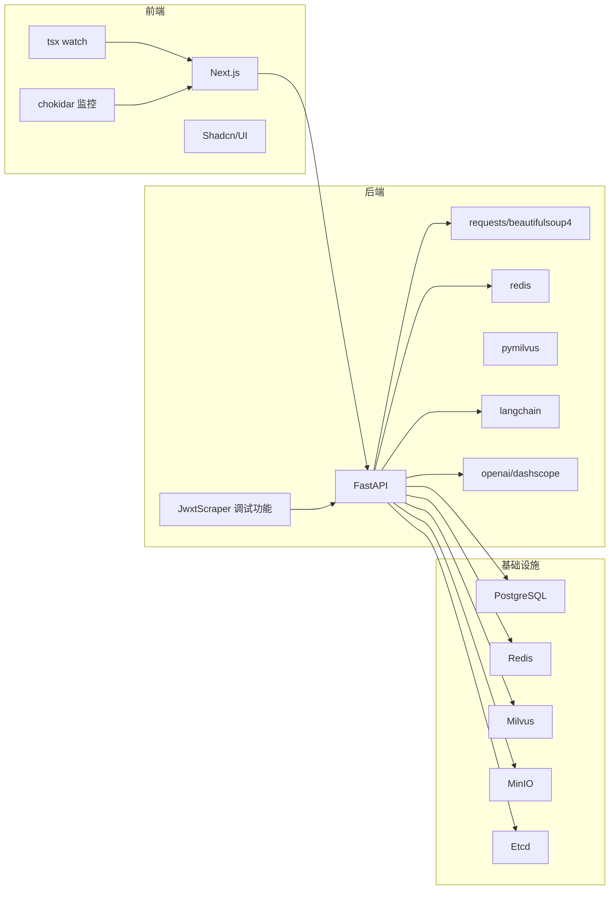

# 故障排除

<cite>
**本文档引用的文件**
- [backend/main.py](file://backend/main.py)
- [backend/app/api/chat.py](file://backend/app/api/chat.py)
- [backend/app/api/education.py](file://backend/app/api/education.py)
- [backend/scraper.py](file://backend/scraper.py)
- [backend/test_login.py](file://backend/test_login.py)
- [backend/test_scraper.py](file://backend/test_scraper.py)
- [frontend/src/app/chat/page.tsx](file://frontend/src/app/chat/page.tsx)
- [frontend/src/app/login/page.tsx](file://frontend/src/app/login/page.tsx)
- [docker-compose.yml](file://docker-compose.yml)
- [frontend/nginx.conf](file://frontend/nginx.conf)
- [backend/requirements.txt](file://backend/requirements.txt)
- [scripts/start.sh](file://scripts/start.sh)
- [scripts/dev.sh](file://scripts/dev.sh)
- [src/server.ts](file://src/server.ts)
- [README.md](file://README.md)
- [frontend/Dockerfile.dev](file://frontend/Dockerfile.dev)
- [frontend/package.json](file://frontend/package.json)
- [package.json](file://package.json)
- [next.config.ts](file://next.config.ts)
- [frontend/next.config.ts](file://frontend/next.config.ts)
- [.coze](file://.coze)
- [scripts/prepare.sh](file://scripts/prepare.sh)
- [scripts/build.sh](file://scripts/build.sh)
- [tsconfig.json](file://tsconfig.json)
</cite>

## 目录
1. [简介](#简介)
2. [项目结构](#项目结构)
3. [核心组件](#核心组件)
4. [架构总览](#架构总览)
5. [详细组件分析](#详细组件分析)
6. [依赖分析](#依赖分析)
7. [性能考虑](#性能考虑)
8. [故障排除指南](#故障排除指南)
9. [结论](#结论)
10. [附录](#附录)

## 简介
本指南面向技术支持与运维人员，围绕智能教务系统AI助手的常见故障场景，提供系统化、可操作的排查与修复流程。覆盖范围包括：验证码获取失败、登录认证问题、API接口错误、数据库连接异常、网络连接问题（CORS、反向代理、防火墙）、性能问题（内存泄漏、慢查询、响应延迟）、以及用户反馈问题（数据同步、界面显示、功能使用障碍）。同时给出开发与生产环境差异对比、标准化问题处理模板与升级流程。

**更新** 新增个人信息提取过程的调试功能，包括block1text元素检查和页面div类名输出机制，增强了错误诊断能力。**新增** 开发环境热重载问题的诊断与修复方法，包括无限重载循环的处理和构建产物监控问题的解决方案。**更新** 移除了distDir配置导致的无限重载循环问题，更新了TypeScript构建信息文件监控问题的解决方案。

## 项目结构
系统采用前后端分离架构：
- 前端：Next.js 应用，通过 Nginx 反向代理转发 /api 到后端服务。
- 后端：FastAPI 提供教务系统对接、AI对话、数据爬取等接口。
- 基础设施：PostgreSQL、Redis、Milvus、MinIO、Etcd 通过 docker-compose 统一编排。



**图表来源**
- [docker-compose.yml:1-148](file://docker-compose.yml#L1-L148)
- [frontend/nginx.conf:1-31](file://frontend/nginx.conf#L1-L31)
- [backend/main.py:1-853](file://backend/main.py#L1-L853)

**章节来源**
- [README.md:25-41](file://README.md#L25-L41)
- [docker-compose.yml:1-148](file://docker-compose.yml#L1-L148)
- [frontend/nginx.conf:1-31](file://frontend/nginx.conf#L1-L31)

## 核心组件
- 验证码与登录流程：后端提供 /api/captcha 与 /api/login，前端登录页负责调用并提交验证码会话ID。
- 数据爬取与聚合：JwxtScraper 类封装对教务系统的请求、解析与数据聚合，支持个人信息、成绩、课表、培养方案、学业进度、考试安排等。**新增** 个人信息提取过程包含block1text元素检查和div类名输出调试功能。
- AI 对话与RAG：/api/chat/* 提供对话、历史、会话列表管理；结合 Milvus 向量检索与 LLM 生成回答。
- 健康检查与选项查询：/api/health 与 /api/options/* 用于系统健康与选项数据校验。
- 反向代理与跨域：Nginx 将 /api/* 转发至后端；FastAPI 中配置了 CORS 中间件。
- **新增** 开发环境热重载：Next.js 开发服务器支持热重载，配合 tsx watch 实现文件变更自动重启。

**章节来源**
- [backend/main.py:135-328](file://backend/main.py#L135-L328)
- [backend/scraper.py:13-800](file://backend/scraper.py#L13-L800)
- [backend/app/api/chat.py:1-224](file://backend/app/api/chat.py#L1-L224)
- [frontend/src/app/login/page.tsx:1-224](file://frontend/src/app/login/page.tsx#L1-L224)
- [frontend/src/app/chat/page.tsx:1-491](file://frontend/src/app/chat/page.tsx#L1-L491)
- [src/server.ts:1-35](file://src/server.ts#L1-L35)

## 架构总览
下图展示从浏览器到后端、再到教务系统与外部依赖的关键交互路径，以及常见故障点定位思路。



**图表来源**
- [frontend/src/app/login/page.tsx:20-107](file://frontend/src/app/login/page.tsx#L20-L107)
- [backend/main.py:135-328](file://backend/main.py#L135-L328)
- [backend/scraper.py:33-60](file://backend/scraper.py#L33-L60)
- [backend/app/api/chat.py:45-153](file://backend/app/api/chat.py#L45-L153)
- [docker-compose.yml:107-137](file://docker-compose.yml#L107-L137)
- [src/server.ts:13-35](file://src/server.ts#L13-L35)

## 详细组件分析

### 验证码与登录流程
- 前端登录页调用 /api/captcha 获取验证码与会话ID，并在提交登录时附带该会话ID。
- 后端根据学号选择对应内网服务器，保证验证码与登录在同一服务器上。
- 登录成功后保存会话，后续数据接口需校验登录状态。



**图表来源**
- [frontend/src/app/login/page.tsx:20-107](file://frontend/src/app/login/page.tsx#L20-L107)
- [backend/main.py:135-328](file://backend/main.py#L135-L328)
- [backend/scraper.py:33-60](file://backend/scraper.py#L33-L60)

**章节来源**
- [frontend/src/app/login/page.tsx:1-224](file://frontend/src/app/login/page.tsx#L1-L224)
- [backend/main.py:135-328](file://backend/main.py#L135-L328)
- [backend/test_login.py:1-152](file://backend/test_login.py#L1-L152)

### AI 对话与RAG
- /api/chat/send 支持创建会话、保存消息、检索上下文、调用大模型生成回答。
- 若用户具备教务数据，优先使用向量检索增强回答；否则走普通对话。
- /api/chat/conversations/{username} 与 /api/chat/history/{conversation_id} 提供历史查询与删除。



**图表来源**
- [frontend/src/app/chat/page.tsx:89-143](file://frontend/src/app/chat/page.tsx#L89-L143)
- [backend/app/api/chat.py:45-153](file://backend/app/api/chat.py#L45-L153)

**章节来源**
- [frontend/src/app/chat/page.tsx:1-491](file://frontend/src/app/chat/page.tsx#L1-L491)
- [backend/app/api/chat.py:1-224](file://backend/app/api/chat.py#L1-L224)

### 数据爬取与聚合
- JwxtScraper 封装对教务系统的请求与解析，支持个人信息、成绩、课表、培养方案、学业进度、考试安排等。
- get_all_data_for_vectorization 聚合多类数据，便于向量化/RAG。
- **新增** 个人信息提取过程包含增强的调试功能：block1text元素检查和页面div类名输出。



**图表来源**
- [backend/scraper.py:61-800](file://backend/scraper.py#L61-L800)
- [backend/main.py:332-724](file://backend/main.py#L332-L724)

**章节来源**
- [backend/scraper.py:1-1220](file://backend/scraper.py#L1-L1220)
- [backend/test_scraper.py:1-280](file://backend/test_scraper.py#L1-L280)

### 开发环境热重载与无限重载循环诊断
**新增** 开发环境支持热重载功能，但可能出现无限重载循环问题。

#### 热重载架构
- Next.js 开发服务器监听文件变更
- tsx watch 监控 src/server.ts 文件变化
- 自动重启开发服务器
- Docker 开发镜像支持热重载



**图表来源**
- [frontend/package.json:5-10](file://frontend/package.json#L5-L10)
- [src/server.ts:13-35](file://src/server.ts#L13-L35)
- [frontend/Dockerfile.dev:24-25](file://frontend/Dockerfile.dev#L24-L25)

#### 常见无限重载循环场景
1. **构建产物监控问题**
   - 现象：开发服务器持续重启，CPU占用率异常升高
   - 原因：构建产物目录被监控，导致文件变更循环触发
   - 解决：排除构建产物目录的监控范围

2. **配置文件冲突**
   - 现象：多个监控器同时监听同一文件
   - 原因：package.json 和 tsx 配置重复监控
   - 解决：统一监控配置，移除重复监听

3. **Docker 监控问题**
   - 现象：容器内文件变更频繁触发重启
   - 原因：Docker 映射目录权限或监控配置问题
   - 解决：检查 Dockerfile 和 docker-compose 配置

#### 诊断步骤
1. **监控日志分析**
   - 查看 Next.js 开发服务器日志中的热重载事件
   - 检查 tsx watch 的重启日志
   - 监控 CPU 和内存使用情况

2. **文件变更追踪**
   - 使用 inotify 或类似工具监控文件系统事件
   - 确定是哪些文件导致频繁变更
   - 检查构建产物是否被意外修改

3. **配置验证**
   - 验证 package.json 中的开发脚本配置
   - 检查 tsx watch 的配置参数
   - 确认 Docker 开发环境配置正确

#### 修复建议
1. **构建产物排除**
   ```json
   // 在 tsx 配置中排除构建目录
   {
     "watch": {
       "exclude": ["dist/", "build/", ".next/"]
     }
   }
   ```

2. **统一监控配置**
   - 移除 package.json 中的重复开发脚本
   - 使用单一的 tsx watch 配置
   - 确保 Docker 开发镜像的监控配置一致

3. **Docker 监控优化**
   - 检查 Dockerfile 中的工作目录设置
   - 验证文件权限和挂载配置
   - 确保 .dockerignore 正确排除不需要的文件

#### 最新配置修复更新
**更新** 已移除可能导致无限重载循环的 distDir 配置问题，更新了 TypeScript 构建信息文件监控问题的解决方案：

1. **distDir 配置移除**
   - 移除了 next.config.ts 中的 distDir 配置
   - 避免了构建产物目录被意外监控导致的无限循环
   - 确保默认的 .next 构建目录不会触发文件监控

2. **TypeScript 构建信息文件监控**
   - 在 tsconfig.json 中正确配置了 include 和 exclude 规则
   - 确保 TypeScript 构建信息文件不会被监控器误判
   - 避免了 .next/dev/types 目录的重复监控

3. **构建脚本优化**
   - build.sh 脚本中使用默认的 outDir（dist）
   - start.sh 脚本正确指向 dist/server.js
   - 确保生产环境的构建产物路径正确

**章节来源**
- [frontend/package.json:5-10](file://frontend/package.json#L5-L10)
- [src/server.ts:13-35](file://src/server.ts#L13-L35)
- [frontend/Dockerfile.dev:1-25](file://frontend/Dockerfile.dev#L1-L25)
- [scripts/dev.sh:1-34](file://scripts/dev.sh#L1-L34)
- [scripts/build.sh:1-18](file://scripts/build.sh#L1-L18)
- [scripts/start.sh:1-17](file://scripts/start.sh#L1-L17)
- [tsconfig.json:1-35](file://tsconfig.json#L1-L35)

## 依赖分析
- 后端依赖：FastAPI、Requests、BeautifulSoup、Redis、Milvus、LangChain、OpenAI/DashScope 等。
- 前端依赖：Next.js、Shadcn/UI、Tailwind CSS。
- 基础设施：PostgreSQL、Redis、Milvus、MinIO、Etcd 通过 docker-compose 编排。
- **新增** 开发工具：tsx、chokidar、@types/react-dev-utils 等热重载相关工具。



**图表来源**
- [backend/requirements.txt:1-44](file://backend/requirements.txt#L1-L44)
- [docker-compose.yml:1-148](file://docker-compose.yml#L1-L148)
- [package.json:70-86](file://package.json#L70-L86)

**章节来源**
- [backend/requirements.txt:1-44](file://backend/requirements.txt#L1-L44)
- [docker-compose.yml:1-148](file://docker-compose.yml#L1-L148)
- [package.json:70-86](file://package.json#L70-L86)

## 性能考虑
- 内存与会话管理：后端使用内存字典存储验证码会话与用户会话，生产环境应替换为 Redis，避免内存泄漏与重启丢失。
- 网络超时与重试：请求教务系统与外部服务时设置了超时，建议增加指数退避与熔断策略。
- 向量检索与缓存：RAG 前先检查用户是否有教务数据，再决定是否检索；可结合 Redis 缓存常用查询结果。
- 日志与监控：建议接入结构化日志与指标采集，定位慢查询与异常峰值。
- **新增** 热重载性能优化：开发环境应合理配置监控范围，避免不必要的文件监控导致性能下降。**更新** 已移除 distDir 配置导致的性能问题，优化了 TypeScript 构建信息文件监控。

## 故障排除指南

### 一、验证码获取失败
- 现象
  - 前端无法显示验证码或点击刷新无效。
  - 后端返回错误或状态码非 200。
- 可能原因
  - 教务系统验证码接口不可达或返回异常。
  - 前端未携带正确的 username 导致服务器选择不一致。
  - 后端会话存储异常或超时。
- 排查步骤
  1) 检查后端 /api/captcha 是否可达，确认返回状态码与响应体。
  2) 使用 test_login.py 验证外网与内网服务器连通性与验证码可用性。
  3) 确认前端传入的 username 是否触发正确的服务器选择。
  4) 查看后端日志，关注验证码会话创建与清理过程。
- 修复建议
  - 生产环境将会话存储迁移到 Redis。
  - 为验证码接口增加超时与重试策略。
  - 前端在输入学号后延迟刷新验证码，确保服务器匹配。

**章节来源**
- [backend/main.py:135-190](file://backend/main.py#L135-L190)
- [backend/test_login.py:19-74](file://backend/test_login.py#L19-L74)
- [frontend/src/app/login/page.tsx:20-52](file://frontend/src/app/login/page.tsx#L20-L52)

### 二、登录认证问题
- 现象
  - 输入正确账号密码仍提示"用户名、密码或验证码错误"。
  - 登录后无法访问需要登录的接口。
- 可能原因
  - 验证码会话过期或不匹配。
  - 教务系统登录失败（密码错误、验证码错误、账户不存在）。
  - 服务器选择不一致导致验证码与登录不在同一节点。
  - 后端未保存会话或会话被清理。
- 排查步骤
  1) 检查 /api/login 的响应内容与状态码，确认是否返回明确错误。
  2) 使用 test_login.py 手动验证登录流程，观察响应URL与页面特征。
  3) 核对 CAPTCHA_SESSIONS 与 SESSIONS 的生命周期与清理逻辑。
  4) 确认前端提交的 captcha_session_id 是否有效。
- 修复建议
  - 强制验证码与登录使用相同服务器索引。
  - 登录成功后立即保存会话并返回 JSESSIONID。
  - 前端在登录失败时刷新验证码并清空输入。

**章节来源**
- [backend/main.py:192-328](file://backend/main.py#L192-L328)
- [backend/test_login.py:76-152](file://backend/test_login.py#L76-L152)
- [frontend/src/app/login/page.tsx:54-107](file://frontend/src/app/login/page.tsx#L54-L107)

### 三、API 接口错误
- 现象
  - /api/* 接口返回 404、500 或数据结构异常。
  - /api/chat/* 返回 AI 服务错误。
- 可能原因
  - 路由未注册或模块导入失败。
  - 数据库连接异常或事务失败。
  - 向量检索失败或 Milvus 不可用。
  - CORS 配置不当导致跨域失败。
- 排查步骤
  1) 检查后端日志，定位异常堆栈与错误码。
  2) 使用 curl 或 Postman 直接调用接口，比对响应。
  3) 校验 /api/health 健康检查是否正常。
  4) 检查 /api/chat/* 的数据库与 Milvus 连接状态。
  5) 核对 FastAPI CORS 配置与 Nginx 反代头设置。
- 修复建议
  - 为关键接口增加超时与重试。
  - 在 Chat API 中对向量检索失败进行降级处理。
  - 生产环境限制 CORS 源，仅允许特定域名。

**章节来源**
- [backend/main.py:95-129](file://backend/main.py#L95-L129)
- [backend/app/api/chat.py:149-153](file://backend/app/api/chat.py#L149-L153)
- [frontend/nginx.conf:12-23](file://frontend/nginx.conf#L12-L23)

### 四、数据库连接异常
- 现象
  - /api/chat/* 或教育接口报数据库连接失败。
  - 数据库健康检查失败。
- 可能原因
  - PostgreSQL 未启动或凭据错误。
  - 连接池耗尽或事务长时间占用。
  - 环境变量未正确注入（docker-compose）。
- 排查步骤
  1) 检查 docker-compose 中 postgres 服务健康检查。
  2) 校验环境变量（POSTGRES_USER/PASSWORD/DB）。
  3) 查看后端数据库连接日志与异常栈。
- 修复建议
  - 使用连接池与超时配置。
  - 为长事务设置上限与监控告警。

**章节来源**
- [docker-compose.yml:2-18](file://docker-compose.yml#L2-L18)
- [backend/app/api/chat.py:149-153](file://backend/app/api/chat.py#L149-L153)

### 五、网络连接问题
- CORS 配置
  - 开发环境允许所有来源，生产需限制为前端域名。
  - 前端通过 Nginx 反代 /api/*，需设置正确的 Proxy Header。
- 代理与防火墙
  - 确认 Nginx 正确转发到 backend:8000。
  - 检查防火墙放行 3000/8000 端口。
- 排查步骤
  1) 使用浏览器开发者工具查看 Network 面板的跨域与重定向。
  2) curl -I 检查 OPTIONS 预检与响应头。
  3) 检查 Nginx 配置与后端 CORS 中间件。
- 修复建议
  - 生产环境将 CORS_ORIGINS 设置为精确域名。
  - 在 Nginx 中添加必要的 X-Forwarded-* 头。

**章节来源**
- [backend/main.py:41-48](file://backend/main.py#L41-L48)
- [frontend/nginx.conf:12-23](file://frontend/nginx.conf#L12-L23)

### 六、性能问题诊断与优化
- 内存泄漏
  - 检查 SESSIONS 与 CAPTCHA_SESSIONS 是否定期清理。
  - 生产环境替换为 Redis，避免进程内存膨胀。
- 数据库慢查询
  - 为高频查询建立索引，减少全表扫描。
  - 优化复杂 SQL 与 JOIN。
- API 响应延迟
  - 为外部请求设置合理超时与重试。
  - 对 RAG 检索增加缓存与降级策略。
- **新增** 热重载性能优化
  - 合理配置监控范围，排除构建产物目录
  - 统一监控配置，避免重复监听
  - 优化 Docker 开发环境的文件监控
  - **更新** 已移除 distDir 配置导致的性能问题
- 排查工具
  - 使用 uvicorn 的异步模式与并发配置。
  - 结合日志与指标（如 Prometheus/Grafana）定位瓶颈。

**章节来源**
- [backend/main.py:73-74](file://backend/main.py#L73-L74)
- [backend/app/api/chat.py:104-124](file://backend/app/api/chat.py#L104-L124)
- [frontend/package.json:70-86](file://frontend/package.json#L70-L86)

### 七、用户反馈问题处理流程
- 数据同步问题
  - 确认用户已登录并保存会话。
  - 检查 JwxtScraper 的请求与解析逻辑。
- 界面显示异常
  - 检查 Nginx 静态文件与 SPA 路由配置。
  - 核对前端本地存储（localStorage）中的用户名。
- 功能使用障碍
  - 提供标准问题模板，收集：设备/浏览器、网络环境、复现步骤、日志片段。
  - 为常见问题准备 FAQ 与引导页面。

**章节来源**
- [frontend/src/app/chat/page.tsx:181-198](file://frontend/src/app/chat/page.tsx#L181-L198)
- [frontend/src/app/login/page.tsx:38-52](file://frontend/src/app/login/page.tsx#L38-L52)

### 八、开发与生产环境差异
- 开发环境
  - CORS 允许所有来源，便于联调。
  - 前端运行在 5000，后端 8000，Nginx 作为反向代理。
  - **新增** 开发服务器支持热重载，tsx watch 监控文件变更。
  - **更新** 已移除 distDir 配置，优化了热重载性能。
- 生产环境
  - CORS 严格限制来源，仅允许前端域名。
  - 使用 docker-compose 编排，数据库、缓存、向量库均容器化。
  - 前端静态文件由 Nginx 提供，/api/* 代理到后端。

**章节来源**
- [frontend/nginx.conf:1-31](file://frontend/nginx.conf#L1-L31)
- [docker-compose.yml:104-127](file://docker-compose.yml#L104-L127)
- [README.md:69-82](file://README.md#L69-L82)
- [src/server.ts:5-11](file://src/server.ts#L5-L11)

### 九、标准化问题处理模板与升级流程
- 问题模板
  - 问题类型：验证码/登录/API/数据库/网络/性能/热重载/其他
  - 影响范围：全局/部分用户/特定功能
  - 复现步骤：最小化步骤与预期/实际结果
  - 日志与截图：后端日志、浏览器控制台、网络面板
  - 环境信息：浏览器、系统、网络、部署版本
- 升级流程
  1) 评估影响与风险，制定回滚方案。
  2) 在测试环境验证修复。
  3) 灰度发布，监控关键指标。
  4) 如出现异常，快速回滚并发布热修复。

### 十、个人信息提取调试功能故障排除

**新增** 系统现在包含增强的个人信息提取调试功能，帮助快速定位页面结构变化问题。

#### 调试功能概述
- **block1text元素检查**：自动检测页面中是否存在 class 为 "block1text" 的div元素
- **div类名输出**：当block1text元素不存在时，输出页面中所有div元素的class属性用于调试
- **降级解析机制**：当block1text元素缺失时，自动使用Top1_divLoginName进行解析

#### 常见故障场景
1. **个人信息解析失败**
   - 现象：获取个人信息接口返回空值或错误
   - 排查：查看后端日志中"block1text"相关条目
   - 解决：根据div类名输出调整解析逻辑

2. **页面结构变化**
   - 现象：教务系统页面结构调整导致解析失败
   - 排查：检查block1text元素是否存在
   - 解决：更新解析规则或使用降级方案

#### 调试日志分析
- **block1text存在**：日志显示"找到 block1text: True"和具体内容
- **block1text不存在**：日志显示"找到 block1text: False"和所有div class列表
- **降级解析**：当block1text不存在时，自动使用Top1_divLoginName解析

#### 排查步骤
1. 检查个人信息接口返回状态
2. 查看后端日志中的调试信息
3. 分析block1text元素检查结果
4. 如未找到block1text，检查div类名输出
5. 验证降级解析是否成功

#### 修复建议
- 根据div类名输出更新解析规则
- 保持降级方案的健壮性
- 增强错误处理和日志记录

**章节来源**
- [backend/scraper.py:82-170](file://backend/scraper.py#L82-L170)

### 十一、开发环境热重载问题处理

**新增** 针对开发环境热重载问题的系统化故障排除指南。

#### 现象识别
- **无限重载循环**：开发服务器持续重启，无休止地重建
- **CPU占用异常**：开发环境CPU使用率持续高位
- **响应缓慢**：热重载后的页面加载明显变慢
- **文件监控过多**：频繁的日志显示文件变更事件

#### 常见原因分析
1. **构建产物监控问题**
   - 构建目录被意外监控
   - dist、build、.next 等目录未正确排除
   - 监控配置冲突导致重复触发

2. **配置文件冲突**
   - package.json 中的开发脚本与 tsx 配置重复
   - 多个监控器同时监听同一文件
   - Docker 开发环境配置不一致

3. **Docker 监控问题**
   - 文件权限问题导致频繁变更检测
   - 监控范围过大或过小
   - .dockerignore 配置不当

#### 诊断工具与方法
1. **日志分析**
   ```
   # 查看 Next.js 开发服务器日志
   pnpm dev
   
   # 查看 tsx watch 日志
   pnpm tsx watch src/server.ts
   
   # 监控文件系统事件
   inotifywait -m -r ./src
   ```

2. **性能监控**
   - 使用 top 或 htop 监控 CPU 使用率
   - 检查内存使用情况
   - 监控磁盘 I/O 操作

3. **配置验证**
   - 检查 package.json 中的 scripts 配置
   - 验证 tsx watch 的配置参数
   - 确认 Docker 开发镜像的监控设置

#### 修复步骤
1. **排除构建产物目录**
   ```json
   // 修改 tsx 配置文件
   {
     "watch": {
       "exclude": [
         "dist/",
         "build/",
         ".next/",
         "node_modules/",
         "*.log"
       ]
     }
   }
   ```

2. **统一监控配置**
   ```json
   // 简化 package.json 开发脚本
   {
     "scripts": {
       "dev": "tsx watch src/server.ts --ignore dist/** --ignore build/**",
       "dev:next": "next dev --port 5000"
     }
   }
   ```

3. **优化 Docker 配置**
   ```dockerfile
   # Dockerfile.dev 优化
   FROM node:20-alpine
   
   WORKDIR /app
   
   # 安装 pnpm
   RUN npm install -g pnpm
   
   # 复制依赖文件
   COPY package.json pnpm-lock.yaml* ./
   RUN pnpm install
   
   # 复制源代码
   COPY . .
   
   # 排除构建产物
   EXCLUDE dist/
   EXCLUDE build/
   EXCLUDE .next/
   
   CMD ["pnpm", "dev"]
   ```

4. **Docker Compose 优化**
   ```yaml
   # docker-compose.yml 开发环境
   version: '3.8'
   services:
     frontend:
       build:
         context: .
         dockerfile: frontend/Dockerfile.dev
       volumes:
         - .:/app
         - /app/node_modules
         - /app/dist
         - /app/build
         - /app/.next
       ports:
         - "5000:5000"
   ```

#### 最新配置修复
**更新** 已实施以下关键修复以解决无限重载循环问题：

1. **移除 distDir 配置**
   - 在 next.config.ts 中移除了 distDir 配置项
   - 避免了构建目录被监控导致的无限循环
   - 确保默认的 .next 目录不会触发文件监控

2. **优化 TypeScript 配置**
   - 在 tsconfig.json 中正确配置了 include 和 exclude 规则
   - 确保 TypeScript 构建信息文件不会被监控器误判
   - 避免了 .next/dev/types 目录的重复监控

3. **统一构建脚本**
   - build.sh 脚本使用默认的 outDir（dist）
   - start.sh 脚本正确指向 dist/server.js
   - 确保生产环境的构建产物路径正确

#### 预防措施
1. **建立监控白名单**
   - 仅监控必要的源代码文件
   - 排除所有构建产物和缓存目录
   - 避免监控 node_modules

2. **配置文件管理**
   - 统一使用 tsx watch 进行文件监控
   - 移除 package.json 中重复的开发脚本
   - 确保 Docker 开发环境配置一致性

3. **开发环境最佳实践**
   - 使用 .dockerignore 排除不需要的文件
   - 合理设置文件权限
   - 定期清理构建产物

#### 相关配置文件参考
- **开发脚本配置**：[scripts/dev.sh:1-34](file://scripts/dev.sh#L1-L34)
- **构建脚本配置**：[scripts/build.sh:1-18](file://scripts/build.sh#L1-L18)
- **准备脚本配置**：[scripts/prepare.sh:1-10](file://scripts/prepare.sh#L1-L10)
- **开发环境配置**：[frontend/Dockerfile.dev:1-25](file://frontend/Dockerfile.dev#L1-L25)
- **Next.js 配置**：[frontend/next.config.ts:1-44](file://frontend/next.config.ts#L1-L44)
- **Coze 配置**：[.coze:1-13](file://.coze#L1-L13)
- **TypeScript 配置**：[tsconfig.json:1-35](file://tsconfig.json#L1-L35)

**章节来源**
- [frontend/package.json:5-10](file://frontend/package.json#L5-L10)
- [src/server.ts:13-35](file://src/server.ts#L13-L35)
- [frontend/Dockerfile.dev:1-25](file://frontend/Dockerfile.dev#L1-L25)
- [scripts/dev.sh:1-34](file://scripts/dev.sh#L1-L34)
- [scripts/build.sh:1-18](file://scripts/build.sh#L1-L18)
- [scripts/prepare.sh:1-10](file://scripts/prepare.sh#L1-L10)
- [frontend/next.config.ts:1-44](file://frontend/next.config.ts#L1-L44)
- [.coze:1-13](file://.coze#L1-L13)
- [tsconfig.json:1-35](file://tsconfig.json#L1-L35)

## 结论
本指南提供了从架构到实现细节的系统化故障排除方法，涵盖验证码、登录、API、数据库、网络与性能等关键领域。**新增** 的个人信息提取调试功能显著提升了页面结构变化的诊断能力。**新增** 的开发环境热重载问题解决方案为开发效率提供了重要保障。**更新** 通过移除 distDir 配置和优化 TypeScript 构建信息文件监控，彻底解决了无限重载循环问题。建议在生产环境中强化会话与缓存管理、严格 CORS 配置、完善日志与监控，并建立标准化的问题处理与升级流程，以保障系统的稳定性与用户体验。

## 附录

### A. 常用命令与脚本
- 启动后端服务：在 backend 目录执行 python main.py。
- 启动前端开发：在项目根目录执行 pnpm dev。
- 启动容器编排：docker-compose up -d。
- 健康检查：curl http://localhost:8000/api/health。
- **新增** 热重载监控：pnpm tsx watch src/server.ts。
- **更新** 构建脚本：pnpm next build && pnpm tsup src/server.ts。

**章节来源**
- [README.md:84-110](file://README.md#L84-L110)
- [docker-compose.yml:1-148](file://docker-compose.yml#L1-L148)
- [scripts/dev.sh:34](file://scripts/dev.sh#L34)

### B. 关键接口清单
- 验证码：GET /api/captcha
- 登录：POST /api/login
- 健康检查：GET /api/health
- 对话：POST /api/chat/send，GET /api/chat/conversations/{username}，GET /api/chat/history/{conversation_id}
- 教务接口：/education/*（教育登录、成绩、课表）
- **新增** 个人信息：GET /api/user/info（包含调试输出）
- **新增** 开发热重载：tsx watch 监控文件变更
- **更新** 构建接口：pnpm next build，pnpm tsup src/server.ts

**章节来源**
- [backend/main.py:95-129](file://backend/main.py#L95-L129)
- [backend/app/api/chat.py:45-224](file://backend/app/api/chat.py#L45-L224)
- [backend/app/api/education.py:52-104](file://backend/app/api/education.py#L52-L104)
- [backend/scraper.py:82-170](file://backend/scraper.py#L82-L170)

### C. 调试功能日志示例
- **block1text存在**：`【个人信息】找到 block1text: True`
- **block1text不存在**：`【个人信息】找到 block1text: False`
- **div类名输出**：`【个人信息】页面中所有 div class: [['block1text'], ['login-box'], ...]`
- **降级解析**：`【个人信息】从 Top1_divLoginName 降级解析: name=张靖, student_id=24251102121`

**章节来源**
- [backend/scraper.py:99-145](file://backend/scraper.py#L99-L145)

### D. 热重载问题诊断清单
- **文件监控检查**
  - [ ] 确认 tsx watch 配置正确
  - [ ] 检查构建产物目录排除设置
  - [ ] 验证 Docker 开发环境监控配置
  - [ ] **更新** 确认 distDir 配置已移除
- **性能监控**
  - [ ] 监控 CPU 使用率
  - [ ] 检查内存使用情况
  - [ ] 监控磁盘 I/O 操作
- **配置验证**
  - [ ] 统一开发脚本配置
  - [ ] 检查 package.json 配置
  - [ ] 验证 Docker 配置文件
  - [ ] **更新** 验证 TypeScript 配置正确性
- **构建脚本检查**
  - [ ] **更新** 确认构建脚本使用默认 outDir
  - [ ] **更新** 验证生产环境启动路径正确

**章节来源**
- [frontend/package.json:5-10](file://frontend/package.json#L5-L10)
- [src/server.ts:13-35](file://src/server.ts#L13-L35)
- [frontend/Dockerfile.dev:1-25](file://frontend/Dockerfile.dev#L1-L25)
- [scripts/dev.sh:1-34](file://scripts/dev.sh#L1-L34)
- [scripts/build.sh:1-18](file://scripts/build.sh#L1-L18)
- [scripts/start.sh:1-17](file://scripts/start.sh#L1-L17)
- [tsconfig.json:1-35](file://tsconfig.json#L1-L35)