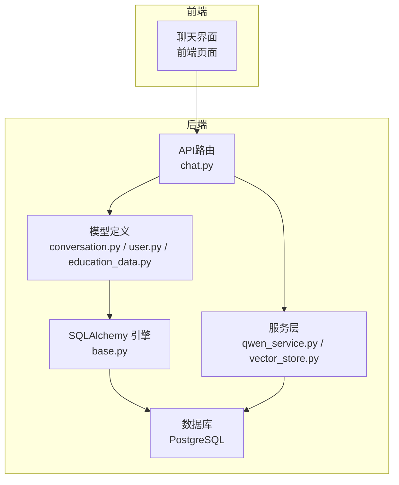
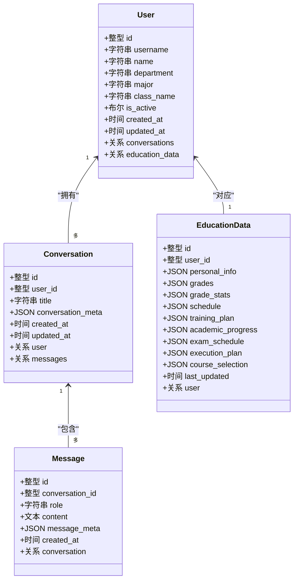
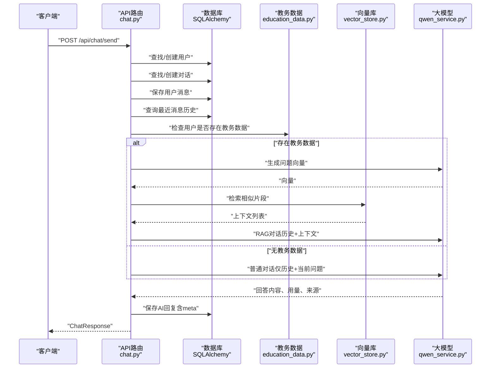
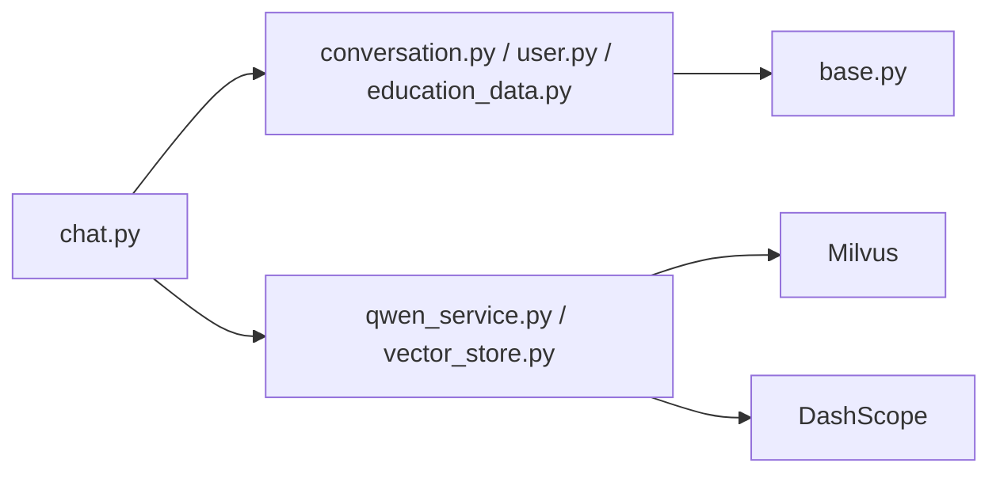

# 对话模型

<cite>
**本文引用的文件**
- [conversation.py](file://backend/app/models/conversation.py)
- [user.py](file://backend/app/models/user.py)
- [base.py](file://backend/app/models/base.py)
- [chat.py](file://backend/app/api/chat.py)
- [education_data.py](file://backend/app/models/education_data.py)
- [vector_store.py](file://backend/app/services/vector_store.py)
- [qwen_service.py](file://backend/app/services/qwen_service.py)
- [__init__.py](file://backend/app/models/__init__.py)
- [main.py](file://backend/main.py)
</cite>

## 目录
1. [简介](#简介)
2. [项目结构](#项目结构)
3. [核心组件](#核心组件)
4. [架构总览](#架构总览)
5. [详细组件分析](#详细组件分析)
6. [依赖分析](#依赖分析)
7. [性能考虑](#性能考虑)
8. [故障排查指南](#故障排查指南)
9. [结论](#结论)
10. [附录](#附录)

## 简介
本文件面向智能教务系统AI助手的“对话模型”，系统性阐述对话与消息的数据模型设计、实体关系、状态管理、序列化与反序列化、查询优化与索引、清理与归档策略，并提供扩展与多轮对话支持的实现指导。读者无需深厚的后端背景即可理解并据此进行二次开发。

## 项目结构
对话模型位于后端Python项目中，采用SQLAlchemy声明式ORM映射PostgreSQL数据库表；前端通过FastAPI路由与后端交互，后端在API层组织业务流程，结合向量检索与大模型服务实现RAG增强的对话能力。

图表来源
- [chat.py:1-224](file://backend/app/api/chat.py#L1-L224)
- [conversation.py:1-42](file://backend/app/models/conversation.py#L1-L42)
- [user.py:1-33](file://backend/app/models/user.py#L1-L33)
- [education_data.py:1-103](file://backend/app/models/education_data.py#L1-L103)
- [qwen_service.py:1-178](file://backend/app/services/qwen_service.py#L1-L178)
- [vector_store.py:1-164](file://backend/app/services/vector_store.py#L1-L164)
- [base.py:1-29](file://backend/app/models/base.py#L1-L29)

章节来源
- [chat.py:1-224](file://backend/app/api/chat.py#L1-L224)
- [conversation.py:1-42](file://backend/app/models/conversation.py#L1-L42)
- [user.py:1-33](file://backend/app/models/user.py#L1-L33)
- [education_data.py:1-103](file://backend/app/models/education_data.py#L1-L103)
- [qwen_service.py:1-178](file://backend/app/services/qwen_service.py#L1-L178)
- [vector_store.py:1-164](file://backend/app/services/vector_store.py#L1-L164)
- [base.py:1-29](file://backend/app/models/base.py#L1-L29)

## 核心组件
- 用户模型：承载用户身份与状态，与对话、教务数据建立一对多关系。
- 对话模型：承载一次问答会话的元信息与时间戳，维护与用户、消息的双向关系。
- 消息模型：承载每条消息的角色、内容与元数据，维护与对话的多对一关系。
- 教务数据模型：承载学生各类教务信息，支撑RAG检索。
- 向量存储服务：对接Milvus，提供向量检索与索引能力。
- 大模型服务：封装DashScope千问接口，提供对话与RAG增强对话能力。
- API路由：负责接收请求、组织历史、调用RAG与大模型、持久化消息与对话。

章节来源
- [user.py:11-33](file://backend/app/models/user.py#L11-L33)
- [conversation.py:11-42](file://backend/app/models/conversation.py#L11-L42)
- [education_data.py:11-103](file://backend/app/models/education_data.py#L11-L103)
- [vector_store.py:14-164](file://backend/app/services/vector_store.py#L14-L164)
- [qwen_service.py:15-178](file://backend/app/services/qwen_service.py#L15-L178)
- [chat.py:45-224](file://backend/app/api/chat.py#L45-L224)

## 架构总览
对话模型围绕“用户—对话—消息”三层关系展开，同时与“教务数据—向量库—大模型”形成RAG闭环。下图展示关键对象与交互：

图表来源
- [user.py:11-33](file://backend/app/models/user.py#L11-L33)
- [conversation.py:11-42](file://backend/app/models/conversation.py#L11-L42)
- [education_data.py:11-103](file://backend/app/models/education_data.py#L11-L103)

## 详细组件分析

### 数据模型字段设计与关系
- 用户表（users）
  - 主键与唯一索引：id（主键）、username（唯一索引）
  - 字段：姓名、学院、专业、班级、激活状态、最后登录时间、创建/更新时间
  - 关系：与对话、教务数据一对多
- 对话表（conversations）
  - 主键与索引：id（主键、索引）
  - 外键：user_id → users.id
  - 字段：标题、JSON元数据、创建/更新时间
  - 关系：与User一对多，与Message一对多（级联删除孤儿）
- 消息表（messages）
  - 主键与索引：id（主键、索引）
  - 外键：conversation_id → conversations.id
  - 字段：角色（user/assistant/system）、文本内容、JSON元数据、创建时间
  - 关系：与Conversation多对一
- 教务数据表（education_data）
  - 主键与索引：id（主键、索引）、user_id（唯一索引）
  - 字段：个人信息、成绩、课表、培养方案、学业进度、考试安排、执行计划、选课信息、最后更新时间
  - 关系：与User一对一

章节来源
- [user.py:11-33](file://backend/app/models/user.py#L11-L33)
- [conversation.py:11-42](file://backend/app/models/conversation.py#L11-L42)
- [education_data.py:11-103](file://backend/app/models/education_data.py#L11-L103)

### 外键约束与级联行为
- Conversation.user_id → users.id：非空，保证对话归属有效用户
- Message.conversation_id → conversations.id：非空，保证消息归属有效对话
- 关系级联：
  - Conversation.messages：级联删除孤儿，删除对话时自动清理其消息
  - User.conversations：级联删除孤儿，删除用户时自动清理其对话
  - User.education_data：级联删除孤儿，删除用户时自动清理其教务数据

章节来源
- [conversation.py:15-25](file://backend/app/models/conversation.py#L15-L25)
- [conversation.py:32-41](file://backend/app/models/conversation.py#L32-L41)
- [user.py:30-32](file://backend/app/models/user.py#L30-L32)

### 消息历史数据结构
- 消息ID：自增整型，主键
- 角色：字符串，限定值为user/assistant/system
- 内容：文本，存储消息正文
- 元数据：JSON，可存放token用量、耗时、引用来源等
- 时间戳：创建时间自动填充，支持按时间排序

章节来源
- [conversation.py:28-42](file://backend/app/models/conversation.py#L28-L42)

### 对话状态管理
- 当前模型未显式定义“进行中/已完成/已取消”等状态字段。对话生命周期由API层控制：
  - 新建：当请求未携带合法conversation_id时，自动创建新对话并设置标题
  - 更新：每次新增消息均会触发updated_at更新
  - 删除：提供删除对话接口，级联删除消息
- 若需引入状态枚举，可在conversation_meta中扩展状态字段，或新增状态字段并在API层统一校验。

章节来源
- [chat.py:63-78](file://backend/app/api/chat.py#L63-L78)
- [chat.py:207-224](file://backend/app/api/chat.py#L207-L224)
- [conversation.py:19](file://backend/app/models/conversation.py#L19)

### 序列化与反序列化机制
- Python侧使用SQLAlchemy ORM映射数据库表，Pydantic模型用于API请求/响应的序列化与校验
- API响应模型：
  - ChatResponse：包含success、message、conversation_id、sources、usage
  - ConversationResponse：包含id、title、created_at（ISO格式字符串）
- 历史查询返回结构：包含消息列表，每条消息含id、role、content、created_at、meta
- 建议：对外暴露的字段尽量使用字符串时间格式，避免时区与序列化差异导致的问题

章节来源
- [chat.py:20-41](file://backend/app/api/chat.py#L20-L41)
- [chat.py:181-204](file://backend/app/api/chat.py#L181-L204)

### 多轮对话与RAG流程
- 历史截断：每次对话仅取最近若干轮（代码中取最近10条，再反转顺序用于上下文拼接）
- RAG增强：若用户具备教务数据，则生成问题向量并检索相关片段，拼接到提示词中
- 大模型调用：支持普通对话与RAG增强对话两种模式，返回内容与用量信息

图表来源
- [chat.py:45-147](file://backend/app/api/chat.py#L45-L147)
- [education_data.py:16](file://backend/app/models/education_data.py#L16)
- [vector_store.py:100-142](file://backend/app/services/vector_store.py#L100-L142)
- [qwen_service.py:39-142](file://backend/app/services/qwen_service.py#L39-L142)

### 查询优化与索引设计
- 已有索引
  - conversations.id：主键索引
  - messages.id：主键索引
  - users.username：唯一索引
  - education_data.user_id：唯一索引
- 建议补充索引
  - conversations.user_id：按用户查询对话
  - messages.conversation_id：按对话查询消息
  - messages.created_at：按时间排序与分页
  - education_data.user_id：按用户查询教务数据
- 分页与排序
  - 历史查询默认按created_at升序返回
  - 建议在高频查询上增加created_at索引以降低排序成本

章节来源
- [conversation.py:14-21](file://backend/app/models/conversation.py#L14-L21)
- [conversation.py:31-38](file://backend/app/models/conversation.py#L31-L38)
- [user.py:16](file://backend/app/models/user.py#L16)
- [education_data.py:16](file://backend/app/models/education_data.py#L16)
- [chat.py:88-96](file://backend/app/api/chat.py#L88-L96)

### 清理与归档策略
- 删除对话：提供删除接口，级联删除消息
- 用户数据清理：向量库服务提供按用户删除数据的能力
- 归档建议
  - 对话归档：可将超过N天未更新的对话标记为归档（若引入状态字段），或移动至独立归档表
  - 消息归档：对超长历史的消息进行压缩或迁移至冷存储
  - 清理策略：定期扫描并删除长时间无人访问的对话及其消息

章节来源
- [chat.py:207-224](file://backend/app/api/chat.py#L207-L224)
- [vector_store.py:143-154](file://backend/app/services/vector_store.py#L143-L154)

### 扩展与多轮对话支持指导
- 多轮上下文截断：当前取最近10条消息，建议根据模型上下文窗口调整（如改为最近6轮）
- 上下文构建：建议在消息meta中记录token用量，以便动态裁剪
- 状态机扩展：在conversation_meta中加入状态字段，配合API层状态校验
- 并行与异步：对于RAG检索与大模型调用，可考虑异步化以提升吞吐
- 会话续传：在消息meta中记录来源与引用，便于后续溯源与复用

章节来源
- [chat.py:88-124](file://backend/app/api/chat.py#L88-L124)
- [conversation.py:19](file://backend/app/models/conversation.py#L19)

## 依赖分析
- 组件耦合
  - API层依赖模型层与服务层
  - 模型层依赖SQLAlchemy基类与数据库引擎
  - 服务层依赖外部向量库与大模型SDK
- 外部依赖
  - PostgreSQL（SQLAlchemy）
  - Milvus（向量检索）
  - DashScope（大模型）

图表来源
- [chat.py:11](file://backend/app/api/chat.py#L11)
- [conversation.py:5-8](file://backend/app/models/conversation.py#L5-L8)
- [user.py:5-8](file://backend/app/models/user.py#L5-L8)
- [education_data.py:5-8](file://backend/app/models/education_data.py#L5-L8)
- [base.py:5-19](file://backend/app/models/base.py#L5-L19)
- [qwen_service.py:5-21](file://backend/app/services/qwen_service.py#L5-L21)
- [vector_store.py:5-22](file://backend/app/services/vector_store.py#L5-L22)

章节来源
- [chat.py:11-12](file://backend/app/api/chat.py#L11-L12)
- [conversation.py:5-8](file://backend/app/models/conversation.py#L5-L8)
- [user.py:5-8](file://backend/app/models/user.py#L5-L8)
- [education_data.py:5-8](file://backend/app/models/education_data.py#L5-L8)
- [base.py:5-19](file://backend/app/models/base.py#L5-L19)
- [qwen_service.py:5-21](file://backend/app/services/qwen_service.py#L5-L21)
- [vector_store.py:5-22](file://backend/app/services/vector_store.py#L5-L22)

## 性能考虑
- 数据库层面
  - 为高频查询字段建立索引（如conversations.user_id、messages.conversation_id、messages.created_at）
  - 控制历史消息数量，避免单次上下文过大
- 向量检索层面
  - 合理设置nprobe与索引类型，平衡召回率与延迟
  - 按用户维度过滤，减少扫描范围
- 大模型层面
  - 控制上下文长度，避免超出模型上下文窗口
  - 对重复问题进行缓存或去重处理

## 故障排查指南
- 对话不存在
  - 现象：请求指定conversation_id但不属于当前用户
  - 处理：返回404，提示对话不存在
- AI服务错误
  - 现象：大模型调用失败或返回错误
  - 处理：捕获异常并返回500，记录日志
- 历史查询失败
  - 现象：获取历史消息异常
  - 处理：捕获异常并返回500，记录日志
- 删除对话失败
  - 现象：删除不存在的对话或数据库异常
  - 处理：捕获异常并返回500，记录日志

章节来源
- [chat.py:69](file://backend/app/api/chat.py#L69)
- [chat.py:125](file://backend/app/api/chat.py#L125)
- [chat.py:203](file://backend/app/api/chat.py#L203)
- [chat.py:212](file://backend/app/api/chat.py#L212)

## 结论
对话模型以清晰的三层关系为核心，结合RAG检索与大模型服务，实现了智能教务场景下的多轮对话能力。通过合理的索引与查询策略、完善的清理与归档机制，以及可扩展的状态管理与多轮对话策略，系统具备良好的可维护性与可演进性。建议在现有基础上引入状态字段、优化历史截断策略，并完善监控与缓存机制以进一步提升性能与稳定性。

## 附录
- 表创建入口：模型初始化模块统一创建所有表
- 健康检查：根路由提供健康检查端点

章节来源
- [__init__.py:10-12](file://backend/app/models/__init__.py#L10-L12)
- [main.py:126-129](file://backend/main.py#L126-L129)