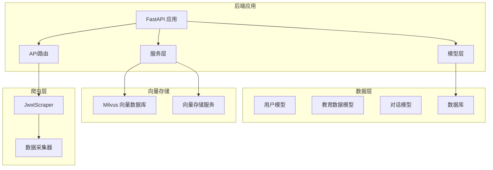
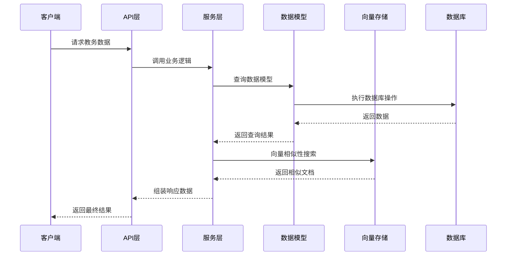
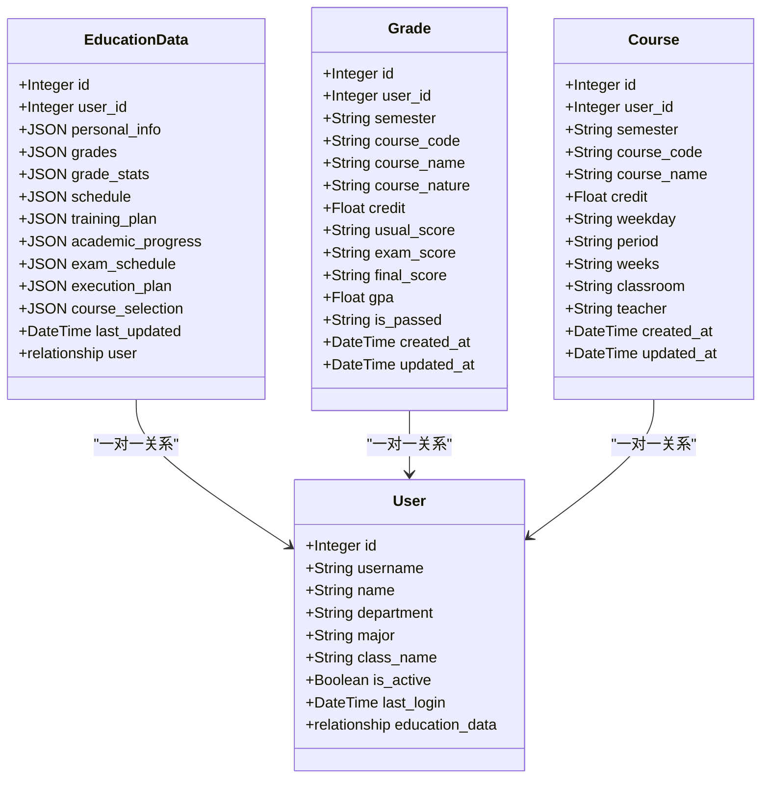
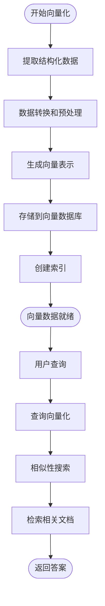
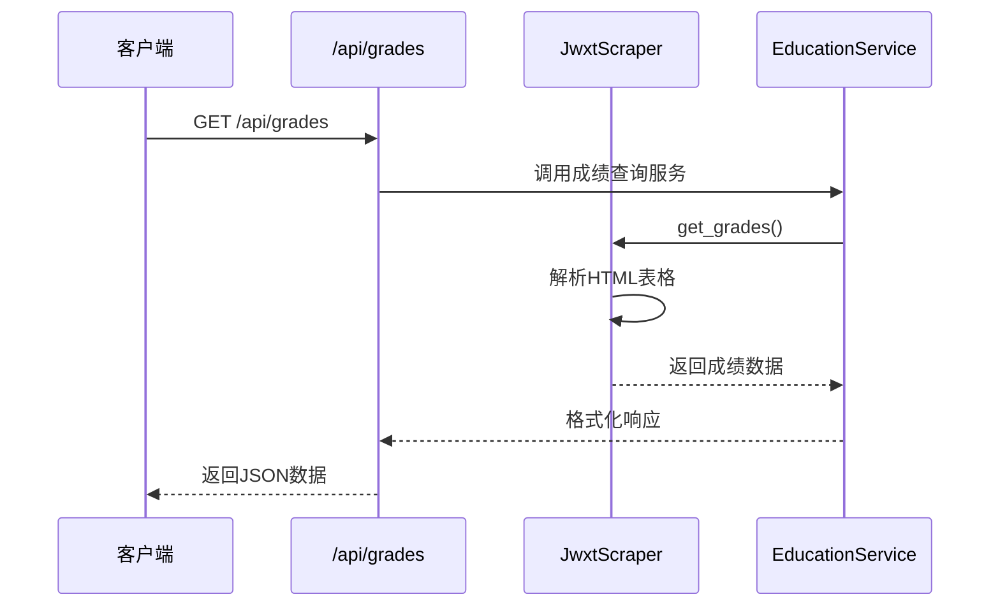
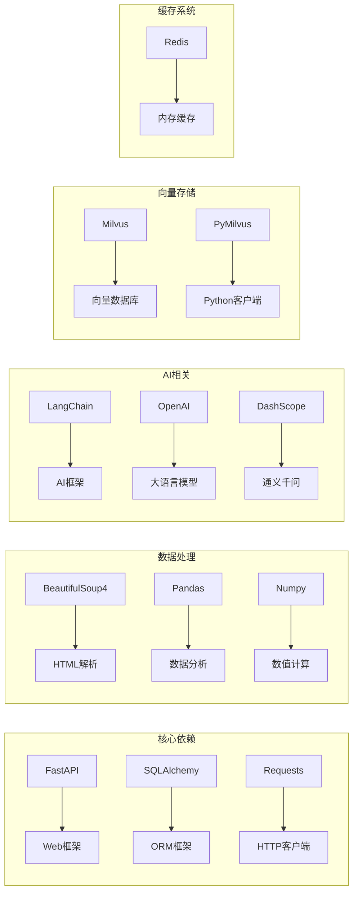

# 教务数据模型

<cite>
**本文档引用的文件**
- [education_data.py](file://backend/app/models/education_data.py)
- [base.py](file://backend/app/models/base.py)
- [user.py](file://backend/app/models/user.py)
- [vector_store.py](file://backend/app/services/vector_store.py)
- [main.py](file://backend/main.py)
- [scraper.py](file://backend/scraper.py)
- [education_options.py](file://backend/education_options.py)
- [requirements.txt](file://backend/requirements.txt)
</cite>

## 目录
1. [简介](#简介)
2. [项目结构](#项目结构)
3. [核心组件](#核心组件)
4. [架构概览](#架构概览)
5. [详细组件分析](#详细组件分析)
6. [依赖关系分析](#依赖关系分析)
7. [性能考虑](#性能考虑)
8. [故障排除指南](#故障排除指南)
9. [结论](#结论)

## 简介

智能教务系统AI助手是一个基于FastAPI开发的现代化教务管理系统，集成了AI助手功能，为学生提供智能化的教务信息服务。该系统的核心是教育数据模型，它负责存储和管理来自教务系统的各类数据，包括成绩、课表、培养方案、考试安排等结构化信息，并通过向量化技术实现智能检索和问答功能。

系统采用前后端分离架构，后端使用Python FastAPI框架，数据库采用PostgreSQL，向量数据库使用Milvus，实现了传统教务数据与现代AI技术的有机结合。

## 项目结构

该项目采用模块化设计，主要分为以下几个核心部分：

**图表来源**
- [main.py:1-853](file://backend/main.py#L1-L853)
- [education_data.py:1-103](file://backend/app/models/education_data.py#L1-L103)
- [vector_store.py:1-164](file://backend/app/services/vector_store.py#L1-L164)

**章节来源**
- [main.py:1-853](file://backend/main.py#L1-L853)
- [requirements.txt:1-44](file://backend/requirements.txt#L1-L44)

## 核心组件

### 教育数据模型

教育数据模型是整个系统的核心，它定义了学生教务数据的存储结构和关系。模型采用JSON字段存储灵活的结构化数据，支持多种教务数据类型的统一管理。

#### 主要字段设计

| 字段名称 | 数据类型 | 描述 | 约束 |
|---------|---------|------|------|
| id | Integer | 主键ID | primary_key, index=True |
| user_id | Integer | 用户外键 | ForeignKey("users.id"), nullable=False |
| personal_info | JSON | 个人信息 | default=dict |
| grades | JSON | 成绩列表 | default=list |
| grade_stats | JSON | 成绩统计 | default=dict |
| schedule | JSON | 课表数据 | default=list |
| training_plan | JSON | 培养方案 | default=dict |
| academic_progress | JSON | 学业进度 | default=dict |
| exam_schedule | JSON | 考试安排 | default=list |
| execution_plan | JSON | 执行计划 | default=dict |
| course_selection | JSON | 选课信息 | default=dict |
| last_updated | DateTime | 最后更新时间 | server_default=func.now() |

#### 数据类型分类体系

系统支持以下九种主要的教务数据类型：

1. **个人信息** - 基础学生信息
2. **成绩数据** - 历史成绩记录和统计
3. **课表数据** - 学期课程安排
4. **培养方案** - 专业培养计划
5. **学业进度** - 学习完成情况
6. **考试安排** - 考试时间地点
7. **执行计划** - 已选课程计划
8. **选课信息** - 选课状态和轮次
9. **课程详情** - 课程基本信息

**章节来源**
- [education_data.py:11-47](file://backend/app/models/education_data.py#L11-L47)

### 用户模型

用户模型定义了系统用户的基本信息和认证状态，与教育数据模型建立了一对一的关系。

#### 用户字段设计

| 字段名称 | 数据类型 | 描述 | 约束 |
|---------|---------|------|------|
| id | Integer | 主键ID | primary_key, index=True |
| username | String | 学号 | unique=True, index=True, nullable=False |
| name | String | 姓名 | nullable=True |
| department | String | 学院 | nullable=True |
| major | String | 专业 | nullable=True |
| class_name | String | 班级 | nullable=True |
| is_active | Boolean | 激活状态 | default=True |
| last_login | DateTime | 最后登录时间 | nullable=True |

**章节来源**
- [user.py:11-33](file://backend/app/models/user.py#L11-L33)

### 向量存储服务

向量存储服务基于Milvus实现，提供高效的相似性搜索和RAG（Retrieval-Augmented Generation）功能。

#### 向量数据库设计

| 字段名称 | 数据类型 | 描述 | 配置 |
|---------|---------|------|------|
| id | INT64 | 主键ID | auto_id=True |
| user_id | INT64 | 用户ID | nullable=False |
| text | VARCHAR | 文本内容 | max_length=4096 |
| embedding | FLOAT_VECTOR | 向量 | dim=1024 |
| source | VARCHAR | 数据来源 | max_length=100 |
| metadata | VARCHAR | 元数据JSON | max_length=2048 |

**章节来源**
- [vector_store.py:14-164](file://backend/app/services/vector_store.py#L14-L164)

## 架构概览

系统采用分层架构设计，实现了业务逻辑、数据访问和外部服务的有效分离。

**图表来源**
- [main.py:398-725](file://backend/main.py#L398-L725)
- [vector_store.py:100-142](file://backend/app/services/vector_store.py#L100-L142)

## 详细组件分析

### 教育数据模型类图

**图表来源**
- [education_data.py:11-103](file://backend/app/models/education_data.py#L11-L103)
- [user.py:11-33](file://backend/app/models/user.py#L11-L33)

### 数据向量化流程

系统实现了完整的数据向量化处理流程，支持将结构化教务数据转换为向量表示：

**图表来源**
- [vector_store.py:73-99](file://backend/app/services/vector_store.py#L73-L99)
- [scraper.py:1154-1220](file://backend/scraper.py#L1154-L1220)

### 教务数据查询接口

系统提供了丰富的API接口来查询各种类型的教务数据：

#### 成绩查询接口

**图表来源**
- [main.py:398-438](file://backend/main.py#L398-L438)
- [scraper.py:153-237](file://backend/scraper.py#L153-L237)

#### 课表查询接口

课表查询接口支持按学期和周次过滤，提供灵活的课程时间查询功能。

**章节来源**
- [main.py:455-488](file://backend/main.py#L455-L488)
- [scraper.py:301-469](file://backend/scraper.py#L301-L469)

### 数据隔离机制

系统通过以下机制确保数据隔离和安全性：

1. **用户ID关联** - 所有教育数据都通过user_id字段与用户建立关联
2. **向量数据隔离** - Milvus集合中包含user_id字段，查询时自动过滤
3. **会话管理** - 使用JSESSIONID管理用户会话状态
4. **权限控制** - API接口验证用户登录状态

**章节来源**
- [education_data.py:16-16](file://backend/app/models/education_data.py#L16-L16)
- [vector_store.py:120-121](file://backend/app/services/vector_store.py#L120-L121)

## 依赖关系分析

系统依赖关系复杂但清晰，主要依赖包括：

**图表来源**
- [requirements.txt:1-44](file://backend/requirements.txt#L1-L44)

**章节来源**
- [requirements.txt:1-44](file://backend/requirements.txt#L1-L44)

## 性能考虑

### 数据库性能优化

1. **索引设计** - 在user_id字段上建立索引以提高查询性能
2. **JSON字段优化** - 使用JSON字段存储灵活数据结构
3. **批量操作** - 支持批量插入和查询操作

### 向量数据库优化

1. **索引配置** - 使用IVF_FLAT索引类型，nlist=128
2. **向量维度** - 默认1024维向量空间
3. **相似性搜索** - 使用COSINE距离度量

### 缓存策略

1. **会话缓存** - 使用内存存储用户会话信息
2. **向量数据缓存** - Milvus内置缓存机制
3. **配置缓存** - 教育选项数据缓存

**章节来源**
- [vector_store.py:60-65](file://backend/app/services/vector_store.py#L60-L65)
- [main.py:74-74](file://backend/main.py#L74-L74)

## 故障排除指南

### 常见问题及解决方案

#### 数据库连接问题

**症状**: 应用启动时报数据库连接错误
**原因**: DATABASE_URL环境变量配置不正确
**解决方案**: 检查环境变量设置，确保PostgreSQL服务正常运行

#### 向量数据库连接问题

**症状**: Milvus连接失败
**原因**: MILVUS_HOST或MILVUS_PORT配置错误
**解决方案**: 验证Milvus服务状态和网络连接

#### 爬虫数据获取失败

**症状**: 教务系统数据无法获取
**原因**: 教务系统URL变化或网络问题
**解决方案**: 更新JWXT_BASE_URL配置，检查网络连接

#### 向量搜索性能问题

**症状**: 搜索响应缓慢
**原因**: 向量维度过大或索引配置不当
**解决方案**: 调整向量维度，优化索引参数

**章节来源**
- [base.py:11-14](file://backend/app/models/base.py#L11-L14)
- [vector_store.py:24-35](file://backend/app/services/vector_store.py#L24-L35)

## 结论

智能教务系统AI助手的教育数据模型设计合理，实现了传统教务数据与现代AI技术的有效结合。通过JSON字段存储灵活的结构化数据，配合向量数据库实现智能检索，为用户提供了一站式的教务信息服务。

系统的主要优势包括：

1. **模块化设计** - 清晰的分层架构便于维护和扩展
2. **数据灵活性** - JSON字段支持多样化的数据结构
3. **智能检索** - 向量数据库提供高效的相似性搜索
4. **安全性** - 完善的数据隔离和权限控制机制
5. **可扩展性** - 支持新数据类型的添加和现有功能的扩展

未来可以在以下方面进一步改进：
- 实现数据同步和增量更新机制
- 优化向量搜索算法和性能
- 增强数据可视化和报表功能
- 扩展移动端支持和离线功能