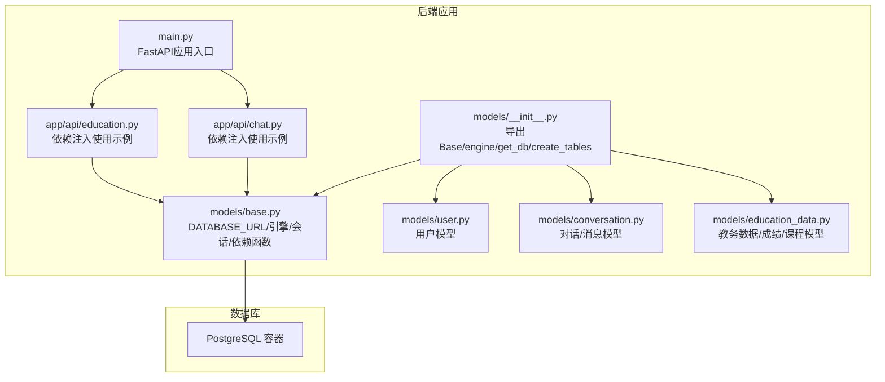
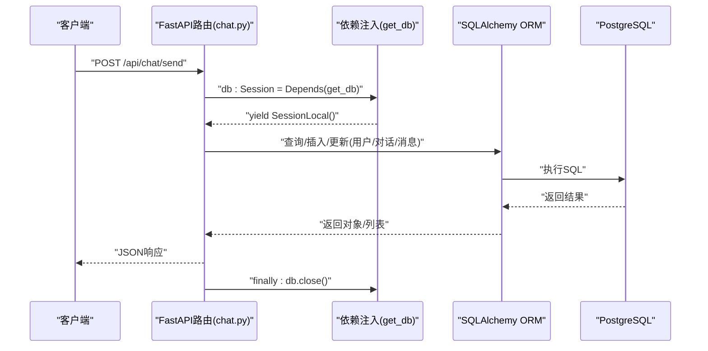
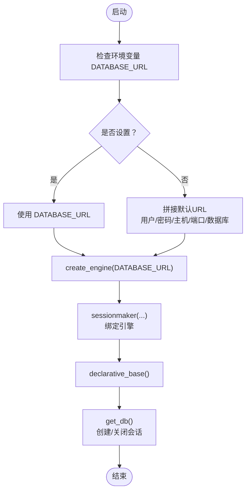
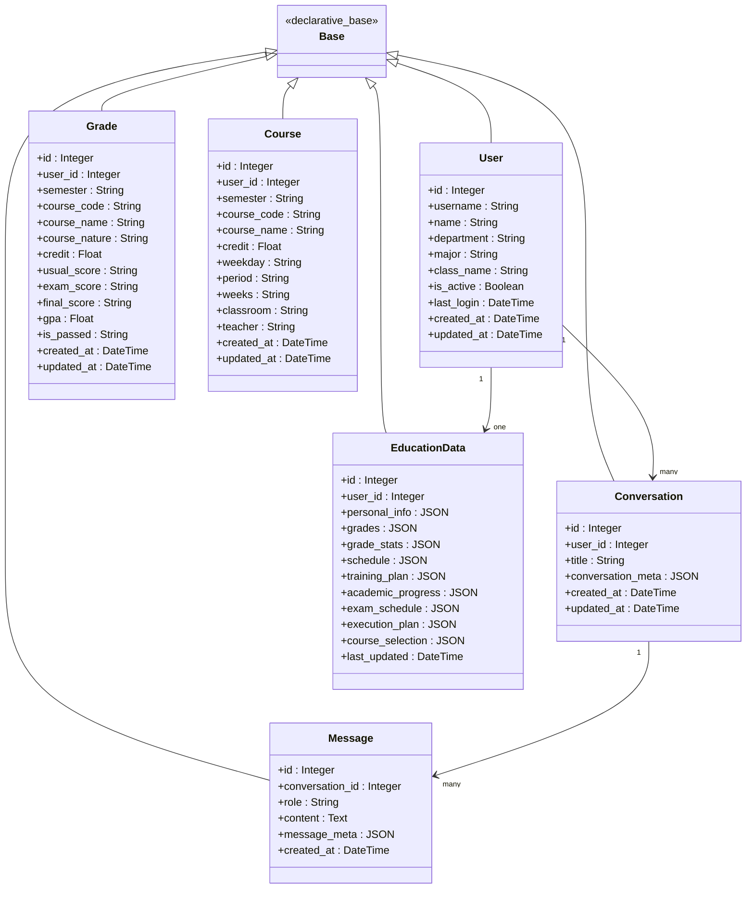
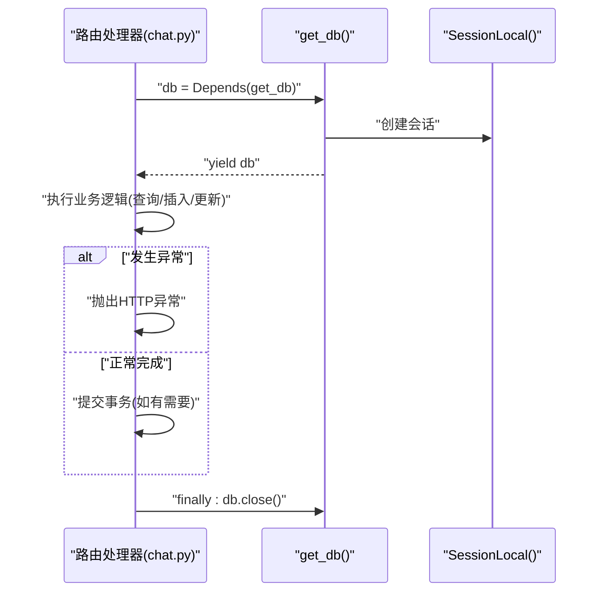
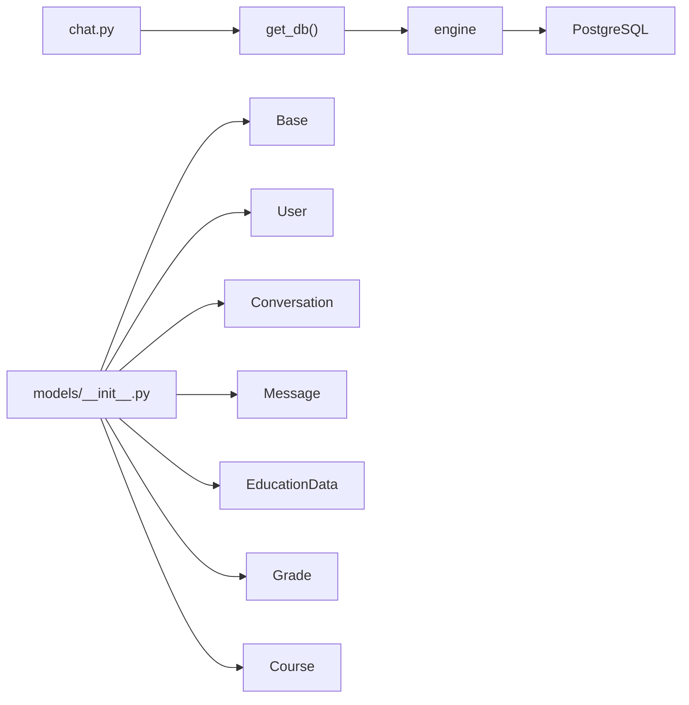

# 数据库基础模型

<cite>
**本文档引用的文件**
- [backend/app/models/base.py](file://backend/app/models/base.py)
- [backend/app/models/__init__.py](file://backend/app/models/__init__.py)
- [backend/app/models/user.py](file://backend/app/models/user.py)
- [backend/app/models/conversation.py](file://backend/app/models/conversation.py)
- [backend/app/models/education_data.py](file://backend/app/models/education_data.py)
- [backend/app/api/chat.py](file://backend/app/api/chat.py)
- [backend/main.py](file://backend/main.py)
- [docker-compose.yml](file://docker-compose.yml)
- [requirements.txt](file://requirements.txt)
</cite>

## 目录
1. [简介](#简介)
2. [项目结构](#项目结构)
3. [核心组件](#核心组件)
4. [架构总览](#架构总览)
5. [详细组件分析](#详细组件分析)
6. [依赖关系分析](#依赖关系分析)
7. [性能考虑](#性能考虑)
8. [故障排查指南](#故障排查指南)
9. [结论](#结论)
10. [附录](#附录)

## 简介
本文件面向智能教务系统AI助手的数据库基础模型，系统性阐述基于SQLAlchemy的ORM配置与使用，涵盖以下主题：
- 数据库连接设置与环境变量配置
- 引擎与会话管理
- declarative_base()的使用与模型继承机制
- get_db()依赖注入函数的工作原理与会话生命周期
- PostgreSQL连接参数配置
- 连接池与性能优化建议
- 错误处理与连接故障恢复策略
- 最佳实践与常见问题解决方案

## 项目结构
数据库相关代码集中在后端Python应用的models目录中，配合FastAPI路由在运行时注入数据库会话。Docker Compose提供PostgreSQL容器化运行环境。

**图表来源**
- [backend/app/models/__init__.py:1-26](file://backend/app/models/__init__.py#L1-L26)
- [backend/app/models/base.py:1-29](file://backend/app/models/base.py#L1-L29)
- [backend/app/models/user.py:1-33](file://backend/app/models/user.py#L1-L33)
- [backend/app/models/conversation.py:1-42](file://backend/app/models/conversation.py#L1-L42)
- [backend/app/models/education_data.py:1-103](file://backend/app/models/education_data.py#L1-L103)
- [backend/app/api/chat.py:1-224](file://backend/app/api/chat.py#L1-L224)
- [backend/app/api/education.py:1-104](file://backend/app/api/education.py#L1-L104)
- [backend/main.py:1-853](file://backend/main.py#L1-L853)
- [docker-compose.yml:1-148](file://docker-compose.yml#L1-L148)

**章节来源**
- [backend/app/models/base.py:1-29](file://backend/app/models/base.py#L1-L29)
- [backend/app/models/__init__.py:1-26](file://backend/app/models/__init__.py#L1-L26)
- [docker-compose.yml:1-148](file://docker-compose.yml#L1-L148)

## 核心组件
- 数据库URL构建与环境变量
  - 支持直接设置DATABASE_URL，否则按“postgresql://用户:密码@主机:端口/数据库”格式拼接默认值
  - 默认主机为localhost，端口为5432，数据库名为campus_ai
- 引擎与会话
  - 使用create_engine创建连接引擎
  - 使用sessionmaker创建非自动提交、非自动flush的本地会话工厂
- 基类与模型继承
  - declarative_base()定义ORM基类
  - 所有模型均继承自该基类
- 依赖注入与生命周期
  - get_db()为FastAPI依赖，每次请求创建一个会话并yield
  - try/finally保证会话最终关闭

**章节来源**
- [backend/app/models/base.py:10-29](file://backend/app/models/base.py#L10-L29)
- [backend/app/models/__init__.py:10-12](file://backend/app/models/__init__.py#L10-L12)

## 架构总览
下图展示从FastAPI路由到数据库会话的调用链路，以及模型层与数据库的关系。

**图表来源**
- [backend/app/api/chat.py:45-154](file://backend/app/api/chat.py#L45-L154)
- [backend/app/models/base.py:22-29](file://backend/app/models/base.py#L22-L29)

## 详细组件分析

### 组件一：数据库连接与会话管理
- DATABASE_URL构建逻辑
  - 优先读取环境变量DATABASE_URL
  - 若未设置，则以POSTGRES_USER/POSTGRES_PASSWORD/POSTGRES_HOST/POSTGRES_PORT/POSTGRES_DB拼接默认URL
- 引擎与会话工厂
  - create_engine(DATABASE_URL)创建连接引擎
  - sessionmaker(autocommit=False, autoflush=False, bind=engine)创建会话工厂
- Base基类
  - declarative_base()创建ORM基类，所有模型继承自该基类
- 依赖注入函数
  - get_db()创建会话并yield，finally块确保关闭

**图表来源**
- [backend/app/models/base.py:10-29](file://backend/app/models/base.py#L10-L29)

**章节来源**
- [backend/app/models/base.py:10-29](file://backend/app/models/base.py#L10-L29)

### 组件二：模型定义与继承机制
- 用户模型(User)
  - 字段：学号、姓名、学院、专业、班级、激活状态、最后登录时间、创建/更新时间戳
  - 关系：一对多到Conversation、EducationData
- 对话与消息模型(Conversation/Message)
  - Conversation：外键关联User，JSON字段存储元数据，时间戳
  - Message：外键关联Conversation，角色与内容，JSON字段存储元数据
  - 关系：双向回溯与级联删除
- 教务数据模型(EducationData/Grade/Course)
  - EducationData：JSON字段存储个人信息、成绩、课表、培养方案、学业进度、考试安排、执行计划、选课信息，时间戳
  - Grade：详细成绩记录，含学期、课程、学分、各分数项、是否通过
  - Course：课程信息，含时间、地点、教师
  - 关系：EducationData与User一对一；Grade/Course与User多对一

**图表来源**
- [backend/app/models/user.py:11-33](file://backend/app/models/user.py#L11-L33)
- [backend/app/models/conversation.py:11-42](file://backend/app/models/conversation.py#L11-L42)
- [backend/app/models/education_data.py:11-103](file://backend/app/models/education_data.py#L11-L103)

**章节来源**
- [backend/app/models/user.py:11-33](file://backend/app/models/user.py#L11-L33)
- [backend/app/models/conversation.py:11-42](file://backend/app/models/conversation.py#L11-L42)
- [backend/app/models/education_data.py:11-103](file://backend/app/models/education_data.py#L11-L103)

### 组件三：依赖注入与会话生命周期
- get_db()工作流程
  - 每次请求调用时创建SessionLocal()实例
  - 通过yield将会话暴露给路由处理函数
  - finally块确保db.close()被调用，释放资源
- 在路由中的使用
  - chat.py中，多个接口使用db: Session = Depends(get_db)获取会话
  - 路由内部进行查询、插入、提交与异常处理

**图表来源**
- [backend/app/api/chat.py:45-154](file://backend/app/api/chat.py#L45-L154)
- [backend/app/models/base.py:22-29](file://backend/app/models/base.py#L22-L29)

**章节来源**
- [backend/app/api/chat.py:45-154](file://backend/app/api/chat.py#L45-L154)
- [backend/app/models/base.py:22-29](file://backend/app/models/base.py#L22-L29)

### 组件四：PostgreSQL连接参数配置
- 环境变量优先级
  - 若设置DATABASE_URL，则直接使用该URL
  - 否则使用以下默认拼接规则：
    - 用户名：POSTGRES_USER，默认postgres
    - 密码：POSTGRES_PASSWORD，默认postgres
    - 主机：POSTGRES_HOST，默认localhost
    - 端口：POSTGRES_PORT，默认5432
    - 数据库名：POSTGRES_DB，默认campus_ai
- Docker Compose中的默认值
  - postgres服务设置了POSTGRES_USER/POSTGRES_PASSWORD/POSTGRES_DB的默认值
  - backend服务通过环境变量将POSTGRES_HOST设为postgres容器名，端口为5432

**章节来源**
- [backend/app/models/base.py:10-14](file://backend/app/models/base.py#L10-L14)
- [docker-compose.yml:6-18](file://docker-compose.yml#L6-L18)
- [docker-compose.yml:113-122](file://docker-compose.yml#L113-L122)

### 组件五：数据库初始化与表创建
- 模块导出
  - models/__init__.py导出Base、engine、get_db、create_tables以及各模型
- 表创建
  - create_tables()调用Base.metadata.create_all(bind=engine)，在数据库中创建所有模型对应的表

**章节来源**
- [backend/app/models/__init__.py:5-25](file://backend/app/models/__init__.py#L5-L25)

## 依赖关系分析
- 组件耦合
  - 路由层通过Depends(get_db)解耦数据库访问
  - 模型层统一继承Base，降低重复配置
- 外部依赖
  - SQLAlchemy ORM与PostgreSQL驱动
  - FastAPI依赖注入机制
- 可能的循环依赖
  - 当前结构清晰，模型与路由通过依赖注入解耦，未见循环导入迹象

**图表来源**
- [backend/app/api/chat.py:11](file://backend/app/api/chat.py#L11)
- [backend/app/models/base.py:5-19](file://backend/app/models/base.py#L5-L19)
- [backend/app/models/__init__.py:5-25](file://backend/app/models/__init__.py#L5-L25)

**章节来源**
- [backend/app/api/chat.py:11](file://backend/app/api/chat.py#L11)
- [backend/app/models/base.py:5-19](file://backend/app/models/base.py#L5-L19)
- [backend/app/models/__init__.py:5-25](file://backend/app/models/__init__.py#L5-L25)

## 性能考虑
- 连接池配置
  - 当前实现未显式配置连接池参数。建议在生产环境中通过create_engine传入连接池参数，例如pool_size、max_overflow、pool_recycle、pool_pre_ping等，以提升并发与稳定性
- 会话粒度
  - get_db()按请求创建/销毁会话，避免长事务占用资源
- 查询优化
  - 模型中使用了索引字段（如字符串唯一/索引、整数索引），有助于加速查询
- 异步与同步
  - 当前路由使用同步SQLAlchemy（Session），而education.py路由引入了AsyncSession依赖。建议在需要高并发时评估迁移至异步ORM或分离同步/异步路径

[本节为通用性能建议，不直接分析具体文件]

## 故障排查指南
- 连接失败
  - 检查DATABASE_URL是否正确设置；若未设置，确认POSTGRES_*环境变量是否齐全
  - 确认PostgreSQL容器已启动并通过healthcheck
- 权限问题
  - 确认数据库用户与密码匹配，数据库存在且可访问
- 会话泄漏
  - 确保路由处理逻辑在异常情况下也能触发db.close()（当前依赖注入finally块已覆盖）
- 表未创建
  - 确认已调用create_tables()或应用启动时执行了建表流程

**章节来源**
- [backend/app/models/base.py:10-14](file://backend/app/models/base.py#L10-L14)
- [docker-compose.yml:14-18](file://docker-compose.yml#L14-L18)
- [backend/app/models/base.py:22-29](file://backend/app/models/base.py#L22-L29)
- [backend/app/models/__init__.py:10-12](file://backend/app/models/__init__.py#L10-L12)

## 结论
本数据库基础模型以SQLAlchemy为核心，结合FastAPI依赖注入，实现了简洁可靠的ORM配置与会话管理。通过环境变量灵活配置PostgreSQL连接参数，配合Docker Compose快速搭建开发与测试环境。建议在生产环境中补充连接池配置与异步能力评估，以进一步提升性能与稳定性。

## 附录

### A. 环境变量清单
- DATABASE_URL：完整数据库连接URL（优先级最高）
- POSTGRES_USER：数据库用户名（默认postgres）
- POSTGRES_PASSWORD：数据库密码（默认postgres）
- POSTGRES_HOST：数据库主机（默认localhost）
- POSTGRES_PORT：数据库端口（默认5432）
- POSTGRES_DB：数据库名（默认campus_ai）

**章节来源**
- [backend/app/models/base.py:10-14](file://backend/app/models/base.py#L10-L14)

### B. Docker Compose默认值
- postgres服务：默认用户、密码、数据库名
- backend服务：默认将POSTGRES_HOST指向postgres容器名

**章节来源**
- [docker-compose.yml:6-18](file://docker-compose.yml#L6-L18)
- [docker-compose.yml:113-122](file://docker-compose.yml#L113-L122)

### C. 依赖注入使用示例
- chat.py中多处接口使用db: Session = Depends(get_db)
- education.py中引入了AsyncSession依赖（需注意同步/异步一致性）

**章节来源**
- [backend/app/api/chat.py:45-154](file://backend/app/api/chat.py#L45-L154)
- [backend/app/api/education.py:63](file://backend/app/api/education.py#L63)

### D. 表创建与模型导出
- models/__init__.py导出Base、engine、get_db、create_tables及各模型
- create_tables()通过Base.metadata.create_all(bind=engine)创建所有表

**章节来源**
- [backend/app/models/__init__.py:5-25](file://backend/app/models/__init__.py#L5-L25)