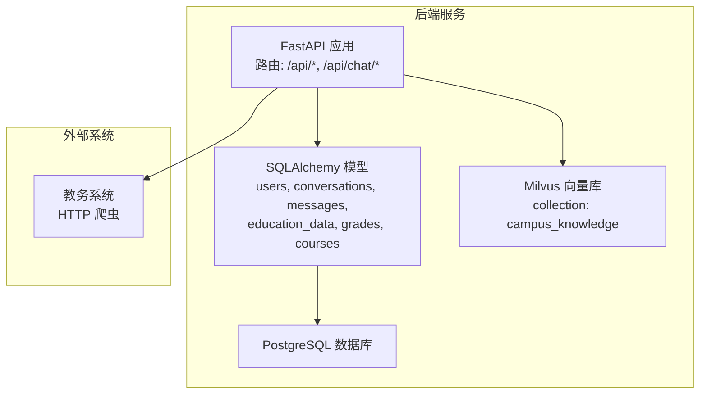
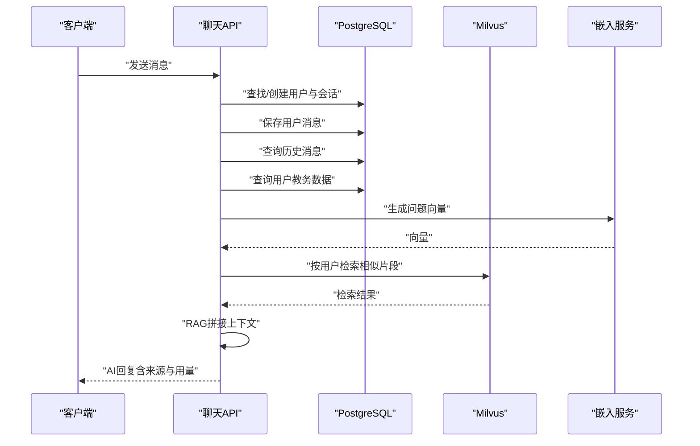
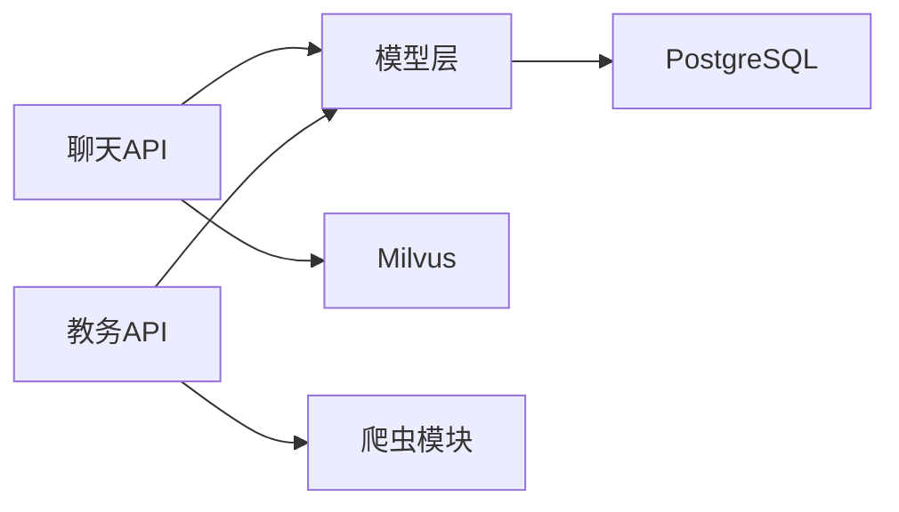

# 数据模型设计

<cite>
**本文引用的文件**
- [backend/app/models/base.py](file://backend/app/models/base.py)
- [backend/app/models/user.py](file://backend/app/models/user.py)
- [backend/app/models/conversation.py](file://backend/app/models/conversation.py)
- [backend/app/models/education_data.py](file://backend/app/models/education_data.py)
- [backend/app/models/__init__.py](file://backend/app/models/__init__.py)
- [backend/app/api/chat.py](file://backend/app/api/chat.py)
- [backend/app/api/education.py](file://backend/app/api/education.py)
- [backend/main.py](file://backend/main.py)
- [backend/scraper.py](file://backend/scraper.py)
- [backend/app/services/vector_store.py](file://backend/app/services/vector_store.py)
- [docker-compose.yml](file://docker-compose.yml)
- [backend/requirements.txt](file://backend/requirements.txt)
</cite>

## 目录
1. [简介](#简介)
2. [项目结构](#项目结构)
3. [核心组件](#核心组件)
4. [架构总览](#架构总览)
5. [详细组件分析](#详细组件分析)
6. [依赖分析](#依赖分析)
7. [性能考量](#性能考量)
8. [故障排查指南](#故障排查指南)
9. [结论](#结论)
10. [附录](#附录)

## 简介
本文件面向“智能教务系统AI助手”的数据模型设计，系统性阐述数据库实体关系、字段定义与约束、索引策略、查询优化、生命周期管理、安全与隐私保护、数据迁移与版本管理、备份与灾难恢复，以及开发者最佳实践与常见问题解决方案。文档以仓库中现有的模型与API实现为依据，结合向量数据库与外部教务系统的集成，给出可落地的设计建议。

## 项目结构
后端采用FastAPI + SQLAlchemy ORM + PostgreSQL + Milvus向量数据库的组合：
- 数据模型位于 backend/app/models，包含基础引擎、用户、对话、教务数据等。
- API路由位于 backend/app/api，分别处理聊天与教务系统接口。
- 向量数据库服务位于 backend/app/services/vector_store.py，封装Milvus操作。
- 外部教务系统爬虫位于 backend/scraper.py，负责从教务系统抓取数据。
- docker-compose.yml 提供PostgreSQL、Redis、Etcd、MinIO、Milvus等依赖服务的编排。



图表来源
- [backend/main.py:1-120](file://backend/main.py#L1-L120)
- [backend/app/models/__init__.py:10-25](file://backend/app/models/__init__.py#L10-L25)
- [backend/app/services/vector_store.py:14-72](file://backend/app/services/vector_store.py#L14-L72)
- [backend/scraper.py:13-60](file://backend/scraper.py#L13-L60)

章节来源
- [backend/main.py:1-120](file://backend/main.py#L1-L120)
- [docker-compose.yml:1-148](file://docker-compose.yml#L1-L148)

## 核心组件
本系统围绕三大核心数据模型展开：
- 用户模型：记录学生身份与状态，作为对话与教务数据的归属主体。
- 对话模型：记录用户的对话会话与消息历史，并支持RAG检索。
- 教务数据模型：聚合学生成绩、课表、培养方案、学业进度、考试安排、执行计划、选课信息等，既支持JSON聚合存储，也提供细粒度的Grade/Course表以满足复杂查询。

章节来源
- [backend/app/models/user.py:11-33](file://backend/app/models/user.py#L11-L33)
- [backend/app/models/conversation.py:11-42](file://backend/app/models/conversation.py#L11-L42)
- [backend/app/models/education_data.py:11-103](file://backend/app/models/education_data.py#L11-L103)

## 架构总览
下图展示数据模型在系统中的交互关系与关键流程（创建、查询、RAG检索、向量入库）。

```mermaid
erDiagram
USERS {
int id PK
string username UK
string name
string department
string major
string class_name
boolean is_active
timestamptz last_login
timestamptz created_at
timestamptz updated_at
}
CONVERSATIONS {
int id PK
int user_id FK
string title
jsonb conversation_meta
timestamptz created_at
timestamptz updated_at
}
MESSAGES {
int id PK
int conversation_id FK
string role
text content
jsonb message_meta
timestamptz created_at
}
EDUCATION_DATA {
int id PK
int user_id FK UK
jsonb personal_info
jsonb grades
jsonb grade_stats
jsonb schedule
jsonb training_plan
jsonb academic_progress
jsonb exam_schedule
jsonb execution_plan
jsonb course_selection
timestamptz last_updated
}
GRADES {
int id PK
int user_id FK
string semester
string course_code
string course_name
string course_nature
float credit
string usual_score
string exam_score
string final_score
float gpa
string is_passed
timestamptz created_at
timestamptz updated_at
}
COURSES {
int id PK
int user_id FK
string semester
string course_code
string course_name
float credit
string weekday
string period
string weeks
string classroom
string teacher
timestamptz created_at
timestamptz updated_at
}
USERS ||--o{ CONVERSATIONS : "拥有"
USERS ||--o{ EDUCATION_DATA : "拥有"
CONVERSATIONS ||--o{ MESSAGES : "包含"
USERS ||--o{ GRADES : "拥有"
USERS ||--o{ COURSES : "拥有"
```

图表来源
- [backend/app/models/user.py:11-33](file://backend/app/models/user.py#L11-L33)
- [backend/app/models/conversation.py:11-42](file://backend/app/models/conversation.py#L11-L42)
- [backend/app/models/education_data.py:11-103](file://backend/app/models/education_data.py#L11-L103)

## 详细组件分析

### 用户模型（User）
- 字段与约束
  - 主键：自增整数id
  - 唯一索引：username（学号），用于快速定位用户
  - 状态字段：is_active（默认激活）、last_login（最近登录时间）
  - 时间戳：created_at（默认服务器时间）、updated_at（更新时写入）
- 关系
  - 一对多：与Conversation、EducationData双向关系，级联删除孤儿项
- 业务含义
  - 作为系统身份标识，承载对话与教务数据的归属
- 性能与索引
  - username建立唯一索引；id建立主键索引
- 生命周期
  - 创建：首次聊天或登录时按学号创建
  - 更新：登录成功后更新last_login
  - 删除：级联删除其教育数据与对话
- 安全与隐私
  - username为敏感字段，需配合认证与授权控制访问
  - 教务密码在后续流程中被持久化，需加强密文存储与传输加密

章节来源
- [backend/app/models/user.py:11-33](file://backend/app/models/user.py#L11-L33)
- [backend/app/models/__init__.py:14-25](file://backend/app/models/__init__.py#L14-L25)

### 对话模型（Conversation 与 Message）
- 字段与约束
  - Conversation：主键id；外键user_id；title默认“新对话”；JSON字段conversation_meta；时间戳
  - Message：主键id；外键conversation_id；role枚举（user/assistant/system）；content文本；JSON字段message_meta；时间戳
- 关系
  - Conversation与User多对一；Conversation与Message一对多（按创建时间排序）
- 业务含义
  - 记录用户与AI的交互历史，支持RAG检索增强
- 性能与索引
  - Conversation.user_id、Message.conversation_id建立索引；Message.created_at用于排序
- 生命周期
  - 创建：首次发送消息时按用户名创建会话
  - 更新：每次新增消息更新updated_at
  - 删除：删除会话时级联删除消息
- RAG集成
  - 聊天API在生成回复前，基于用户消息与历史消息检索相关教务数据，再调用AI生成回答

章节来源
- [backend/app/models/conversation.py:11-42](file://backend/app/models/conversation.py#L11-L42)
- [backend/app/api/chat.py:45-154](file://backend/app/api/chat.py#L45-L154)

### 教务数据模型（EducationData、Grade、Course）
- 字段与约束
  - EducationData：主键id；外键user_id（唯一）；JSON字段聚合个人信息、成绩、课表、培养方案、学业进度、考试安排、执行计划、选课信息；last_updated记录最后更新时间
  - Grade：主键id；外键user_id；课程与成绩字段；gpa、is_passed等统计字段；时间戳
  - Course：主键id；外键user_id；课程基本信息与上课时间地点；时间戳
- 关系
  - EducationData与User一对一（unique约束）
  - Grade/Course与User一对多
- 业务含义
  - EducationData用于RAG向量检索；Grade/Course用于精确查询与统计
- 性能与索引
  - EducationData.user_id唯一索引；Grade.user_id、Course.user_id建立索引
- 生命周期
  - 创建：首次登录教务系统后抓取并写入
  - 更新：定期同步或手动触发更新
  - 删除：级联删除
- 与外部系统集成
  - 通过爬虫模块抓取教务系统数据，聚合到EducationData或拆分到Grade/Course

章节来源
- [backend/app/models/education_data.py:11-103](file://backend/app/models/education_data.py#L11-L103)
- [backend/scraper.py:13-200](file://backend/scraper.py#L13-L200)

### 向量数据库（Milvus）与RAG流程
- 集成点
  - 聊天API在生成回复前，若存在用户教务数据，会生成问题向量并检索相关片段
  - 向量服务封装Milvus连接、集合创建、插入与检索、按用户删除等功能
- 索引与查询
  - 集合字段包含user_id、text、embedding、source、metadata
  - 使用COSINE距离与IVF_FLAT索引，nprobe参数控制召回质量与性能
- 生命周期
  - 按用户维度进行数据隔离与删除



图表来源
- [backend/app/api/chat.py:45-154](file://backend/app/api/chat.py#L45-L154)
- [backend/app/services/vector_store.py:100-142](file://backend/app/services/vector_store.py#L100-L142)

章节来源
- [backend/app/api/chat.py:45-154](file://backend/app/api/chat.py#L45-L154)
- [backend/app/services/vector_store.py:14-163](file://backend/app/services/vector_store.py#L14-L163)

## 依赖分析
- 组件耦合
  - API层依赖模型层；模型层依赖SQLAlchemy与PostgreSQL；聊天API依赖向量服务；外部教务系统依赖爬虫模块
- 外部依赖
  - Milvus向量库、PostgreSQL、Redis、MinIO、Etcd等通过docker-compose编排
- 可能的循环依赖
  - 当前模型间无直接循环依赖，但API与服务层存在双向调用，属于正常分层



图表来源
- [backend/app/api/chat.py:11-12](file://backend/app/api/chat.py#L11-L12)
- [backend/app/api/education.py:8-11](file://backend/app/api/education.py#L8-L11)
- [backend/app/models/__init__.py:5-8](file://backend/app/models/__init__.py#L5-L8)
- [backend/app/services/vector_store.py:14-23](file://backend/app/services/vector_store.py#L14-L23)
- [backend/scraper.py:13-21](file://backend/scraper.py#L13-L21)

章节来源
- [backend/app/api/chat.py:11-12](file://backend/app/api/chat.py#L11-L12)
- [backend/app/api/education.py:8-11](file://backend/app/api/education.py#L8-L11)
- [backend/app/models/__init__.py:5-8](file://backend/app/models/__init__.py#L5-L8)
- [docker-compose.yml:1-148](file://docker-compose.yml#L1-L148)

## 性能考量
- 索引策略
  - 用户：username唯一索引；id主键索引
  - 对话：Conversation.user_id、Message.conversation_id、Message.created_at
  - 教务：EducationData.user_id唯一索引；Grade/Course.user_id索引
- 查询优化
  - 聊天历史查询限制数量（示例中限制为10条）
  - 向量检索设置nprobe与top_k平衡召回与性能
- 缓存与会话
  - 登录态使用内存会话（开发环境），生产建议使用Redis
- 并发与事务
  - 使用SQLAlchemy会话管理，注意长事务与锁竞争

章节来源
- [backend/app/models/conversation.py:89-91](file://backend/app/models/conversation.py#L89-L91)
- [backend/app/services/vector_store.py:100-122](file://backend/app/services/vector_store.py#L100-L122)
- [backend/main.py:73-74](file://backend/main.py#L73-L74)

## 故障排查指南
- 数据库连接
  - 检查DATABASE_URL与环境变量；确认PostgreSQL容器健康
- 向量检索失败
  - 检查Milvus连接参数、集合是否存在、索引是否创建
- 教务系统登录
  - 验证验证码session是否过期；确认服务器选择逻辑与登录URL
- 聊天API错误
  - 查看HTTP异常与日志；确认用户存在、会话存在、RAG向量生成是否成功

章节来源
- [backend/app/api/chat.py:149-154](file://backend/app/api/chat.py#L149-L154)
- [backend/app/api/education.py:59-77](file://backend/app/api/education.py#L59-L77)
- [backend/app/services/vector_store.py:34-35](file://backend/app/services/vector_store.py#L34-L35)
- [backend/main.py:186-189](file://backend/main.py#L186-L189)

## 结论
本数据模型设计以用户为中心，通过对话与教务数据的有机整合，支撑RAG增强的AI问答能力。模型具备清晰的主外键关系、合理的索引策略与生命周期管理，同时通过向量数据库实现知识检索。建议在生产环境中强化安全与隐私保护、引入缓存与异步任务、完善监控与告警体系。

## 附录

### 字段定义与约束清单
- 用户（users）
  - id: 主键，整数
  - username: 唯一，字符串（学号）
  - name, department, major, class_name: 字符串
  - is_active: 布尔，默认true
  - last_login: 时间戳
  - created_at, updated_at: 时间戳（服务器默认值）
- 对话（conversations）
  - id: 主键，整数
  - user_id: 外键(users.id)，非空
  - title: 字符串，默认“新对话”
  - conversation_meta: JSON
  - created_at, updated_at: 时间戳
- 消息（messages）
  - id: 主键，整数
  - conversation_id: 外键(conversations.id)，非空
  - role: 字符串（枚举：user/assistant/system）
  - content: 文本
  - message_meta: JSON
  - created_at: 时间戳
- 教务数据（education_data）
  - id: 主键，整数
  - user_id: 外键(users.id)，唯一
  - personal_info, grades, grade_stats, schedule, training_plan, academic_progress, exam_schedule, execution_plan, course_selection: JSON
  - last_updated: 时间戳（默认服务器时间，更新时写入）
- 成绩明细（grades）
  - id: 主键，整数
  - user_id: 外键(users.id)，非空
  - semester, course_code, course_name, course_nature: 字符串
  - credit: 浮点数
  - usual_score, exam_score, final_score: 字符串
  - gpa: 浮点数
  - is_passed: 字符串
  - created_at, updated_at: 时间戳
- 课程（courses）
  - id: 主键，整数
  - user_id: 外键(users.id)，非空
  - semester, course_code, course_name, credit: 字符串/浮点数
  - weekday, period, weeks, classroom, teacher: 字符串
  - created_at, updated_at: 时间戳

章节来源
- [backend/app/models/user.py:11-33](file://backend/app/models/user.py#L11-L33)
- [backend/app/models/conversation.py:11-42](file://backend/app/models/conversation.py#L11-L42)
- [backend/app/models/education_data.py:11-103](file://backend/app/models/education_data.py#L11-L103)

### 数据生命周期管理
- 创建
  - 用户：首次聊天或登录时创建
  - 会话与消息：发送消息时创建
  - 教务数据：登录教务系统后抓取并写入
- 更新
  - 用户：登录成功更新last_login
  - 教务数据：定期同步或手动触发更新
  - 消息：每次新增消息更新updated_at
- 删除
  - 会话：删除会话时级联删除消息
  - 用户：级联删除其教育数据与对话
  - 向量数据：按用户删除
- 归档
  - 建议对历史对话与消息设置软删除标记或按时间分区归档

章节来源
- [backend/app/models/user.py:23-28](file://backend/app/models/user.py#L23-L28)
- [backend/app/models/conversation.py:24-25](file://backend/app/models/conversation.py#L24-L25)
- [backend/app/models/education_data.py:44-47](file://backend/app/models/education_data.py#L44-L47)
- [backend/app/services/vector_store.py:143-154](file://backend/app/services/vector_store.py#L143-L154)

### 数据安全与隐私保护
- 传输安全
  - 生产环境启用HTTPS与TLS
- 存储安全
  - 教务密码等敏感字段建议加密存储；使用密钥管理服务
- 访问控制
  - 引入JWT与权限中间件，确保用户只能访问自身数据
- 日志与审计
  - 限制敏感字段输出到日志；记录关键操作审计

章节来源
- [docker-compose.yml:123-127](file://docker-compose.yml#L123-L127)
- [backend/app/api/education.py:60-77](file://backend/app/api/education.py#L60-L77)

### 数据迁移与版本管理
- 版本化
  - 使用Alembic或自定义迁移脚本管理数据库结构变更
- 兼容性
  - 新增字段建议默认值与非空约束兼容旧数据
- 回滚策略
  - 迁移前备份；失败时回滚到上一个稳定版本
- 向量库
  - 集合schema变更时重建索引；迁移前导出旧数据

章节来源
- [backend/app/services/vector_store.py:37-72](file://backend/app/services/vector_store.py#L37-L72)

### 备份与灾难恢复
- 数据库
  - PostgreSQL使用定时快照与WAL归档；最小化RPO/RTO
- 向量库
  - Milvus数据目录持久化；定期快照与跨节点复制
- 缓存
  - Redis持久化与哨兵/集群部署
- 外部系统
  - 教务系统登录态与验证码session的超时与清理策略

章节来源
- [docker-compose.yml:10-18](file://docker-compose.yml#L10-L18)
- [docker-compose.yml:24-33](file://docker-compose.yml#L24-L33)
- [docker-compose.yml:76-92](file://docker-compose.yml#L76-L92)
- [backend/main.py:133-185](file://backend/main.py#L133-L185)

### 开发者最佳实践
- 模型设计
  - 保持单一职责；合理拆分JSON与规范化表
- 查询优化
  - 为高频查询字段建立索引；避免N+1查询
- 错误处理
  - 统一异常处理与日志记录；区分业务错误与系统错误
- 安全
  - 输入校验与参数绑定；最小权限原则
- 集成
  - 明确外部系统依赖与降级策略；RAG检索失败时回退普通对话

章节来源
- [backend/app/api/chat.py:149-154](file://backend/app/api/chat.py#L149-L154)
- [backend/app/api/education.py:59-77](file://backend/app/api/education.py#L59-L77)
- [backend/requirements.txt:1-44](file://backend/requirements.txt#L1-L44)