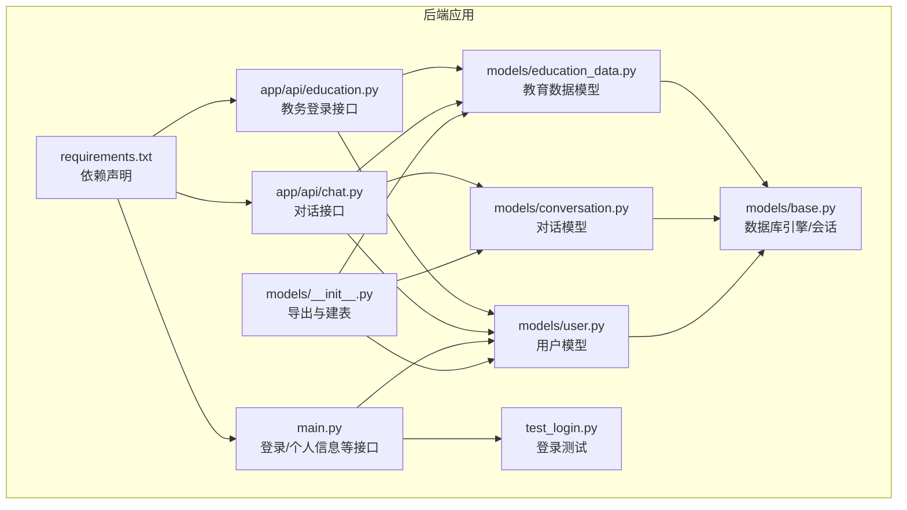
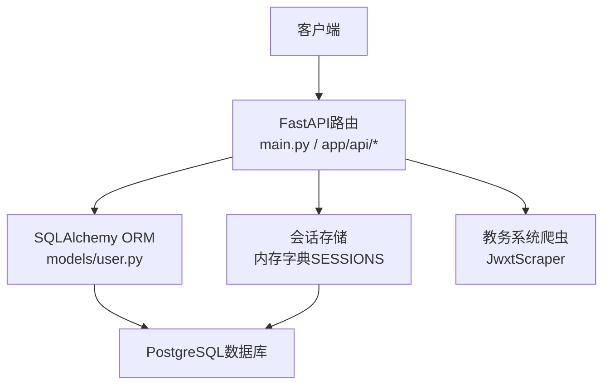
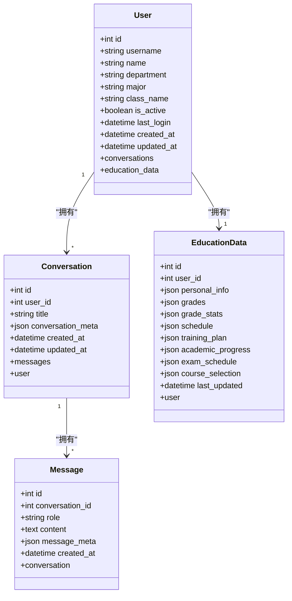
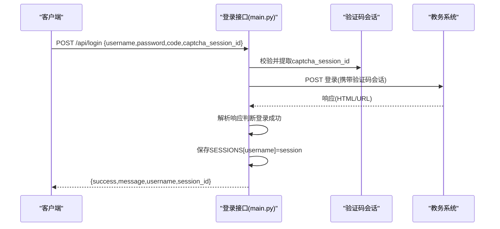
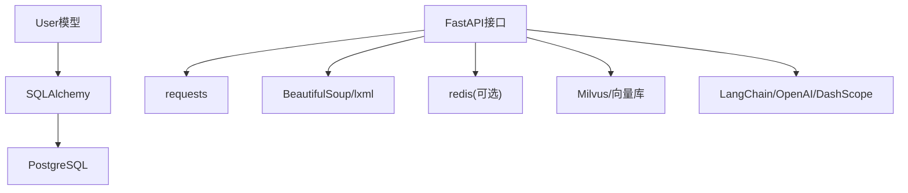

# 用户模型

<cite>
**本文档引用的文件**
- [backend/app/models/user.py](file://backend/app/models/user.py)
- [backend/app/models/base.py](file://backend/app/models/base.py)
- [backend/app/models/conversation.py](file://backend/app/models/conversation.py)
- [backend/app/models/education_data.py](file://backend/app/models/education_data.py)
- [backend/app/models/__init__.py](file://backend/app/models/__init__.py)
- [backend/main.py](file://backend/main.py)
- [backend/app/api/chat.py](file://backend/app/api/chat.py)
- [backend/app/api/education.py](file://backend/app/api/education.py)
- [backend/test_login.py](file://backend/test_login.py)
- [backend/requirements.txt](file://backend/requirements.txt)
</cite>

## 目录
1. [简介](#简介)
2. [项目结构](#项目结构)
3. [核心组件](#核心组件)
4. [架构总览](#架构总览)
5. [详细组件分析](#详细组件分析)
6. [依赖分析](#依赖分析)
7. [性能考虑](#性能考虑)
8. [故障排查指南](#故障排查指南)
9. [结论](#结论)
10. [附录](#附录)

## 简介
本文件面向“智能教务系统AI助手”的用户模型，系统性梳理User数据模型的字段定义、数据类型、长度限制与验证规则；解释与认证系统的集成方式（密码加密存储与会话管理）；阐述用户权限体系与角色分配机制；说明用户数据的安全存储策略（密码哈希算法与敏感信息保护）；给出用户模型的CRUD操作示例与业务逻辑实现；包含用户状态管理与账户激活流程；并提供用户模型扩展与定制化的指导方案。

## 项目结构
用户模型位于后端Python项目中，采用SQLAlchemy ORM映射数据库表，配合FastAPI路由实现认证与业务接口。关键文件如下：
- 用户模型定义：backend/app/models/user.py
- 数据库基础配置：backend/app/models/base.py
- 关联模型（对话、教育数据）：backend/app/models/conversation.py、backend/app/models/education_data.py
- 模型导出与表初始化：backend/app/models/__init__.py
- 认证与业务接口：backend/main.py、backend/app/api/chat.py、backend/app/api/education.py
- 登录测试脚本：backend/test_login.py
- 依赖声明：backend/requirements.txt

**图表来源**
- [backend/app/models/__init__.py:10-25](file://backend/app/models/__init__.py#L10-L25)
- [backend/app/models/user.py:11-33](file://backend/app/models/user.py#L11-L33)
- [backend/app/models/conversation.py:11-42](file://backend/app/models/conversation.py#L11-L42)
- [backend/app/models/education_data.py:11-103](file://backend/app/models/education_data.py#L11-L103)
- [backend/app/models/base.py:10-29](file://backend/app/models/base.py#L10-L29)
- [backend/main.py:192-328](file://backend/main.py#L192-L328)
- [backend/app/api/chat.py:45-224](file://backend/app/api/chat.py#L45-L224)
- [backend/app/api/education.py:52-104](file://backend/app/api/education.py#L52-L104)
- [backend/test_login.py:19-152](file://backend/test_login.py#L19-L152)
- [backend/requirements.txt:1-44](file://backend/requirements.txt#L1-L44)

**章节来源**
- [backend/app/models/__init__.py:10-25](file://backend/app/models/__init__.py#L10-L25)
- [backend/app/models/base.py:10-29](file://backend/app/models/base.py#L10-L29)

## 核心组件
本项目用户模型采用SQLAlchemy声明式基类，核心字段与约束如下：
- 主键与标识
  - id：整型，主键，唯一索引
- 基本信息
  - username：字符串，最大长度50，唯一索引，非空；注释为“学号”
  - name：字符串，最大长度100，可空；注释为“姓名”
  - department：字符串，最大长度200，可空；注释为“学院”
  - major：字符串，最大长度200，可空；注释为“专业”
  - class_name：字符串，最大长度100，可空；注释为“班级”
- 状态与时间
  - is_active：布尔值，默认True；注释为“是否激活”
  - last_login：日期时间（带时区），可空；注释为“最后登录时间”
  - created_at：日期时间（带时区），默认服务器时间
  - updated_at：日期时间（带时区），更新时自动写入服务器时间
- 关系
  - conversations：与对话模型一对多，级联删除孤儿
  - education_data：与教育数据模型一对一（外键唯一）

字段验证与约束要点
- 唯一性：username唯一
- 非空性：username非空
- 可空性：name、department、major、class_name、last_login可空
- 默认值：is_active默认True，created_at默认服务器时间，updated_at更新时写入
- 注释：字段具备中文注释，便于数据库维护与文档化

**章节来源**
- [backend/app/models/user.py:15-32](file://backend/app/models/user.py#L15-L32)

## 架构总览
用户模型在系统中的位置与交互如下：
- 数据层：SQLAlchemy ORM映射至PostgreSQL数据库，通过Base与engine建立连接
- 业务层：FastAPI路由负责认证与业务接口，如登录、个人信息、对话等
- 会话管理：登录成功后将教务系统会话保存在内存字典中，后续接口基于该会话访问教务系统
- 安全策略：密码明文暂存于用户模型中以供后续业务调用（见“安全策略”章节），实际登录与会话持久化由外部教务系统完成

**图表来源**
- [backend/main.py:73-74](file://backend/main.py#L73-L74)
- [backend/app/models/base.py:10-29](file://backend/app/models/base.py#L10-L29)
- [backend/app/models/user.py:11-33](file://backend/app/models/user.py#L11-L33)

## 详细组件分析

### 用户模型类图
用户模型与关联模型之间的关系如下：

**图表来源**
- [backend/app/models/user.py:11-33](file://backend/app/models/user.py#L11-L33)
- [backend/app/models/conversation.py:11-42](file://backend/app/models/conversation.py#L11-L42)
- [backend/app/models/education_data.py:11-103](file://backend/app/models/education_data.py#L11-L103)

**章节来源**
- [backend/app/models/user.py:11-33](file://backend/app/models/user.py#L11-L33)
- [backend/app/models/conversation.py:11-42](file://backend/app/models/conversation.py#L11-L42)
- [backend/app/models/education_data.py:11-103](file://backend/app/models/education_data.py#L11-L103)

### 认证与会话管理流程
登录接口负责：
- 校验必要参数（学号、密码、验证码、验证码会话ID）
- 从验证码会话ID中解析服务器索引，保证验证码与登录在同一服务器
- 向教务系统发起登录请求，检查响应内容判断登录成功与否
- 登录成功后将会话保存在内存字典中，供后续业务接口使用

**图表来源**
- [backend/main.py:192-328](file://backend/main.py#L192-L328)

**章节来源**
- [backend/main.py:192-328](file://backend/main.py#L192-L328)

### 用户状态管理与账户激活
- 用户激活状态：is_active布尔字段，默认True，可用于账户封禁/解封
- 最后登录时间：last_login记录最近一次登录时间，便于审计与风控
- 状态变更建议：可在登录成功后更新last_login；在管理员后台提供修改is_active的接口

**章节来源**
- [backend/app/models/user.py:22-24](file://backend/app/models/user.py#L22-L24)

### 权限体系与角色分配
- 当前模型未内置角色字段与权限枚举
- 建议扩展：新增role字段（如student/admin），并结合FastAPI依赖注入实现权限控制
- 示例思路：在依赖函数中校验current_user.role，对特定接口进行授权

**章节来源**
- [backend/app/api/education.py:80-104](file://backend/app/api/education.py#L80-L104)

### 安全存储策略
- 密码存储
  - 当前实现：用户模型未包含密码字段；登录成功后将教务系统密码明文保存在用户模型中，以便后续业务调用
  - 安全建议：不建议在应用侧存储明文密码；若需本地缓存，应采用强哈希（如bcrypt）并加盐；或仅缓存JSESSIONID等会话票据
- 会话管理
  - 生产环境应使用Redis等分布式缓存替代内存字典SESSIONS，避免多实例间会话丢失
- 敏感信息保护
  - 对外接口避免直接返回内部会话对象；对日志输出进行脱敏处理
  - 传输层使用HTTPS，Cookie设置HttpOnly与Secure属性（前端与后端共同保障）

**章节来源**
- [backend/main.py:73-74](file://backend/main.py#L73-L74)
- [backend/app/api/education.py:74-75](file://backend/app/api/education.py#L74-L75)

### CRUD操作与业务逻辑
- 创建用户
  - 在对话接口中，若用户不存在则自动创建并持久化
  - 参考路径：[backend/app/api/chat.py:55-62](file://backend/app/api/chat.py#L55-L62)
- 读取用户
  - 通过username查询用户；用于对话列表、教育数据等场景
  - 参考路径：[backend/app/api/chat.py:159-162](file://backend/app/api/chat.py#L159-L162)
- 更新用户
  - 更新last_login、is_active等字段；在登录成功后可更新last_login
  - 参考路径：[backend/app/models/user.py:23-24](file://backend/app/models/user.py#L23-L24)
- 删除用户
  - 由于conversations与education_data使用级联删除，删除用户会级联清理相关数据
  - 参考路径：[backend/app/models/user.py:31-32](file://backend/app/models/user.py#L31-L32)

**章节来源**
- [backend/app/api/chat.py:55-62](file://backend/app/api/chat.py#L55-L62)
- [backend/app/api/chat.py:159-162](file://backend/app/api/chat.py#L159-L162)
- [backend/app/models/user.py:31-32](file://backend/app/models/user.py#L31-L32)

### 用户模型扩展与定制
- 新增字段
  - 如需角色字段：在User类中添加role列，并在FastAPI依赖中进行权限校验
  - 如需加密密码字段：添加password_hash列，使用哈希算法存储
- 关系扩展
  - 可增加多对多角色表，或在User中引入JSON字段存储权限集合
- 表初始化
  - 通过models/__init__.py的create_tables方法统一创建表结构
  - 参考路径：[backend/app/models/__init__.py:10-12](file://backend/app/models/__init__.py#L10-L12)

**章节来源**
- [backend/app/models/__init__.py:10-12](file://backend/app/models/__init__.py#L10-L12)

## 依赖分析
- 数据库依赖
  - SQLAlchemy：ORM映射与会话管理
  - PostgreSQL：数据存储
- 爬虫与网络
  - requests：HTTP请求与会话保持
  - BeautifulSoup/lxml：HTML解析（用于爬虫）
- 向量化与AI
  - grpcio、pymilvus：向量数据库
  - langchain、openai、dashscope：大模型服务
- 其他
  - redis：会话缓存（推荐用于生产）
  - python-dotenv：环境变量加载

**图表来源**
- [backend/requirements.txt:1-44](file://backend/requirements.txt#L1-L44)
- [backend/app/models/base.py:10-29](file://backend/app/models/base.py#L10-L29)

**章节来源**
- [backend/requirements.txt:1-44](file://backend/requirements.txt#L1-L44)

## 性能考虑
- 数据库性能
  - 为username建立唯一索引，提升查询效率
  - 对频繁查询的字段（如last_login）建立索引
- 会话性能
  - 生产环境使用Redis替代内存字典，支持水平扩展
- 爬虫性能
  - 合理设置超时与重试策略，避免阻塞请求线程
- 向量化性能
  - 控制RAG检索top_k数量，平衡召回与延迟

## 故障排查指南
- 登录失败
  - 检查验证码会话ID是否过期或无效
  - 确认选择的服务器与验证码一致
  - 参考路径：[backend/main.py:210-234](file://backend/main.py#L210-L234)
- 未登录访问受保护接口
  - 检查SESSIONS中是否存在对应username的会话
  - 参考路径：[backend/main.py:342-346](file://backend/main.py#L342-L346)
- 教务系统登录成功但业务接口报错
  - 检查JSESSIONID是否正确传递
  - 参考路径：[backend/main.py:307-316](file://backend/main.py#L307-L316)
- 登录测试
  - 使用test_login.py验证验证码与登录流程
  - 参考路径：[backend/test_login.py:19-152](file://backend/test_login.py#L19-L152)

**章节来源**
- [backend/main.py:210-234](file://backend/main.py#L210-L234)
- [backend/main.py:342-346](file://backend/main.py#L342-L346)
- [backend/main.py:307-316](file://backend/main.py#L307-L316)
- [backend/test_login.py:19-152](file://backend/test_login.py#L19-L152)

## 结论
本用户模型以简洁清晰的方式承载了学号、姓名、学院、专业、班级等关键信息，并通过状态字段与时间戳实现基本的账户管理能力。认证与会话管理通过外部教务系统完成，应用层主要负责会话缓存与业务数据的整合。建议在生产环境中强化安全策略（密码哈希、会话缓存）、完善权限体系（角色与资源授权），并持续优化数据库与网络性能以支撑高并发场景。

## 附录
- 字段一览与建议
  - username：建议长度50以内，唯一索引，非空
  - name/department/major/class_name：按需使用，注意长度上限
  - is_active：布尔开关，建议提供管理接口
  - last_login：用于审计与风控
  - password：建议改为password_hash字段，存储哈希值
- 会话与安全
  - 生产环境使用Redis缓存会话
  - 传输层启用HTTPS，Cookie设置HttpOnly与Secure
- 扩展清单
  - 角色字段（role）
  - 权限集合（permissions JSON）
  - 头像、手机号等扩展字段
  - 审计日志（操作人、时间、IP等）