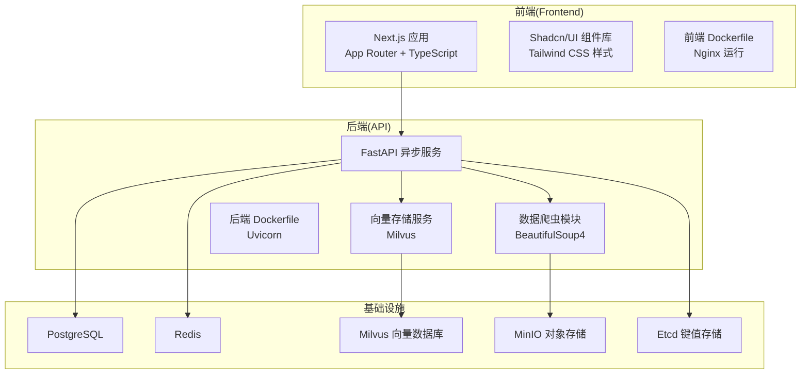
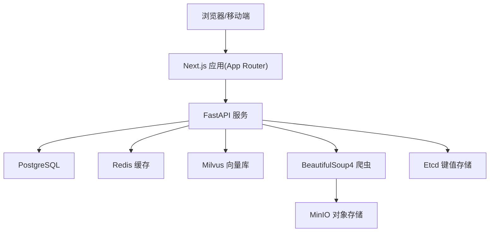
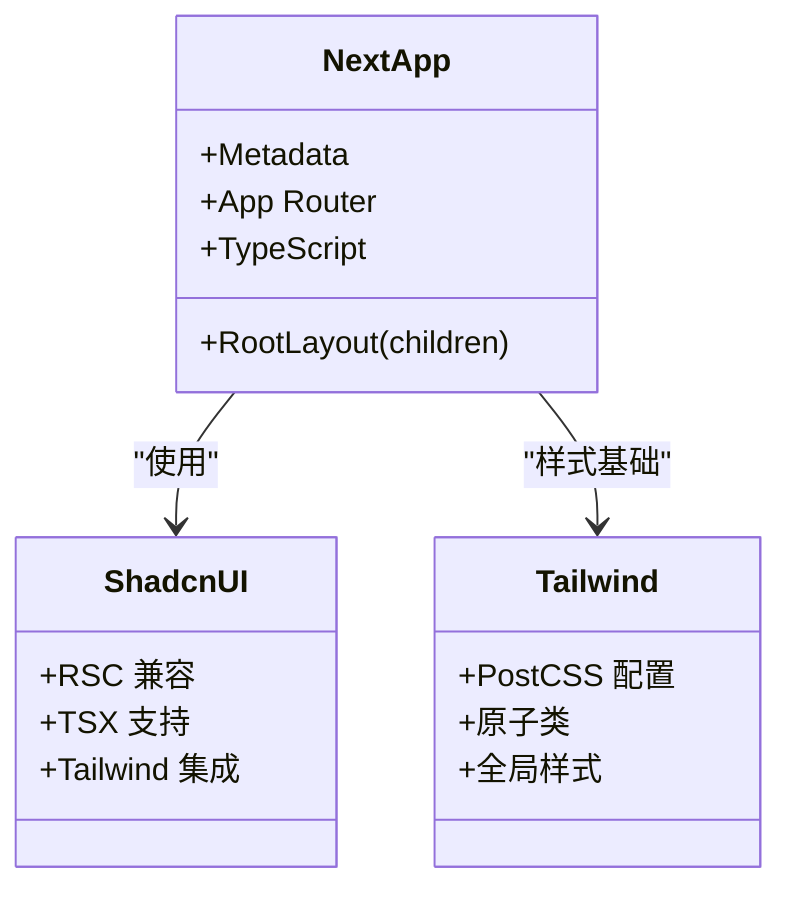
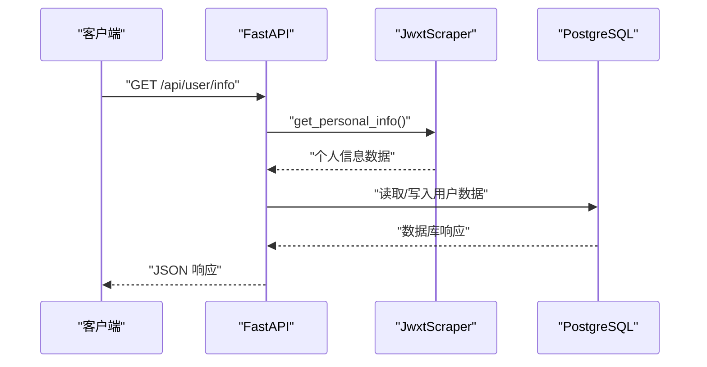
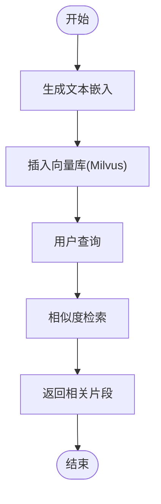
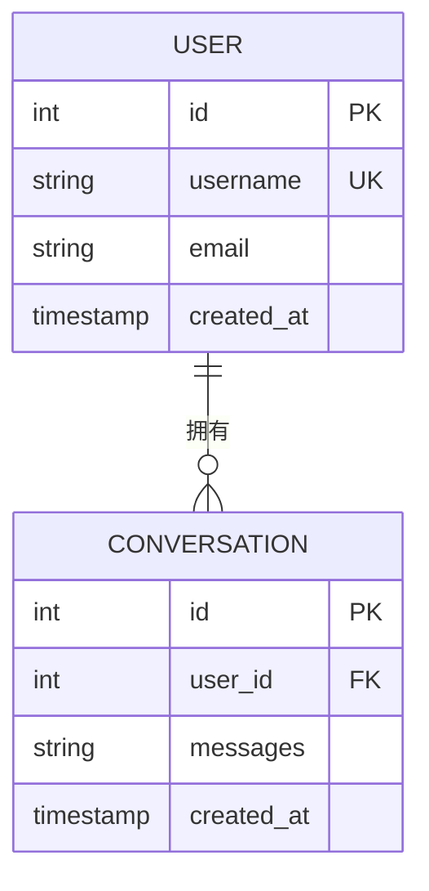
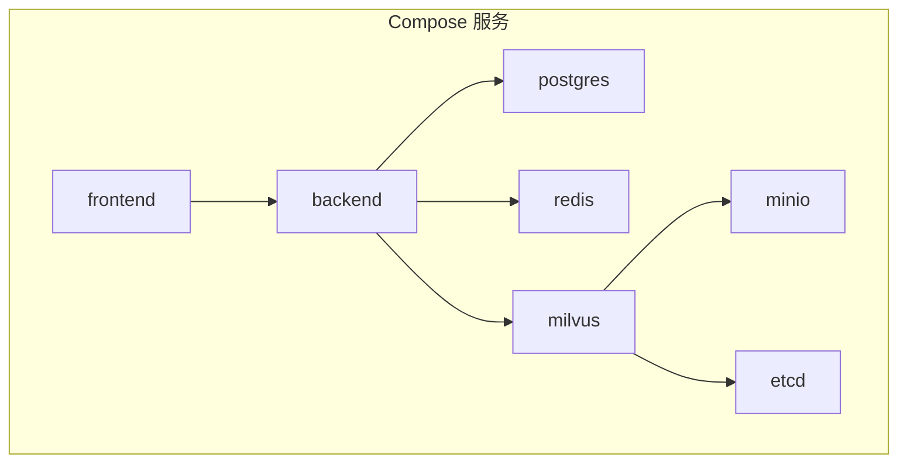
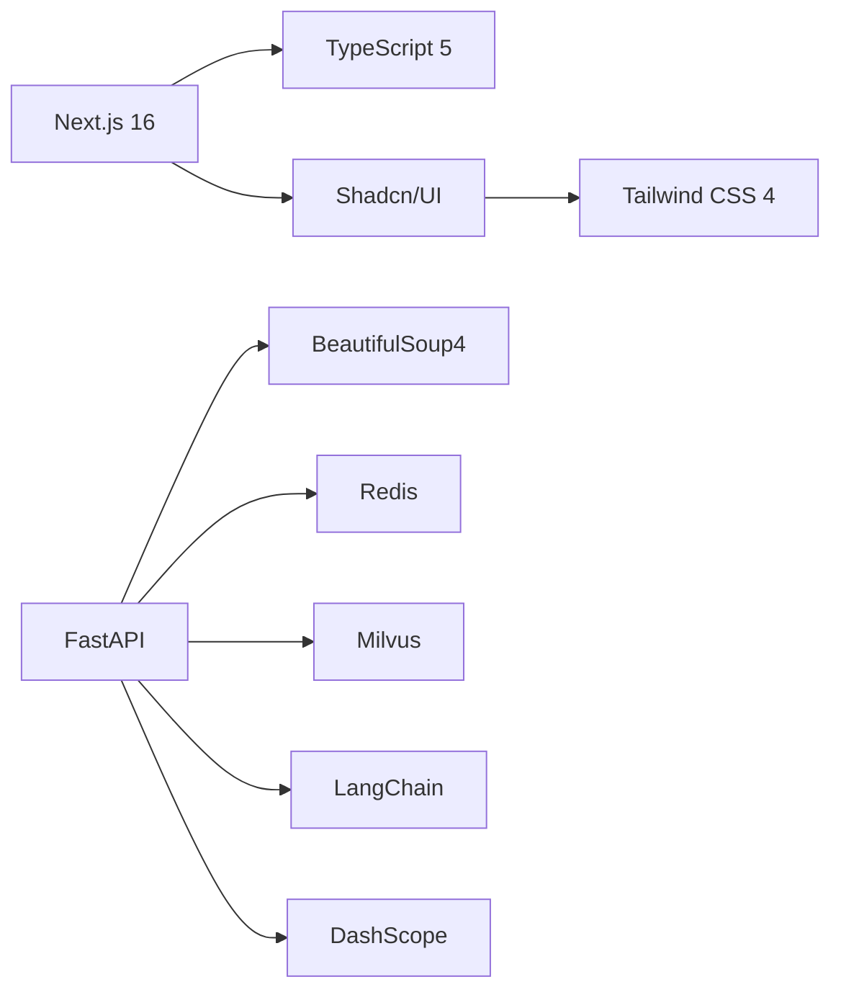

# 技术选型说明

<cite>
**本文档引用的文件**
- [package.json](file://package.json)
- [requirements.txt](file://backend/requirements.txt)
- [next.config.ts](file://next.config.ts)
- [tsconfig.json](file://tsconfig.json)
- [docker-compose.yml](file://docker-compose.yml)
- [backend/main.py](file://backend/main.py)
- [frontend/src/app/layout.tsx](file://frontend/src/app/layout.tsx)
- [backend/Dockerfile](file://backend/Dockerfile)
- [frontend/Dockerfile](file://frontend/Dockerfile)
- [components.json](file://components.json)
- [backend/app/services/vector_store.py](file://backend/app/services/vector_store.py)
- [backend/scraper.py](file://backend/scraper.py)
- [postcss.config.mjs](file://postcss.config.mjs)
- [frontend/src/app/globals.css](file://frontend/src/app/globals.css)
</cite>

## 目录
1. [简介](#简介)
2. [项目结构](#项目结构)
3. [核心组件](#核心组件)
4. [架构总览](#架构总览)
5. [详细组件分析](#详细组件分析)
6. [依赖关系分析](#依赖关系分析)
7. [性能考虑](#性能考虑)
8. [故障排除指南](#故障排除指南)
9. [结论](#结论)

## 简介
本技术选型说明面向智能教务系统AI助手项目，系统性阐述前后端技术栈、AI与向量数据库集成、数据库与缓存选型，以及容器化部署策略。文档旨在帮助开发者与运维人员快速理解技术决策背景、架构设计与实施要点。

## 项目结构
项目采用前后端分离架构，前端基于Next.js 16 App Router，后端基于FastAPI，配合容器化编排与多组件协作（向量数据库、缓存、关系型数据库、对象存储等）。整体结构清晰，职责边界明确，便于扩展与维护。

图表来源
- [docker-compose.yml](file://docker-compose.yml)
- [backend/main.py](file://backend/main.py)
- [backend/app/services/vector_store.py](file://backend/app/services/vector_store.py)
- [backend/scraper.py](file://backend/scraper.py)

章节来源
- [docker-compose.yml](file://docker-compose.yml)
- [backend/main.py](file://backend/main.py)

## 核心组件
- 前端技术栈
  - Next.js 16：App Router 架构，支持路由、布局、流式渲染与SSR/SSG。
  - TypeScript 5：严格类型系统，提升开发效率与运行时稳定性。
  - Shadcn/UI：可定制的高质量组件库，统一UI风格。
  - Tailwind CSS 4：原子化CSS框架，灵活、可维护的样式体系。
- 后端技术栈
  - FastAPI：高性能异步Web框架，自动生成OpenAPI文档。
  - Python 3.11：稳定版本，生态丰富，适合AI与数据处理。
  - BeautifulSoup4：HTML解析与数据抽取，支撑教务系统爬虫。
- AI与向量数据库
  - LangChain：链式调用与工作流编排，适配多模态与RAG场景。
  - DashScope：通义千问等模型接入，提供推理与嵌入能力。
  - Milvus：向量相似度检索，支撑知识库与问答召回。
- 数据库与缓存
  - PostgreSQL：关系型数据存储，事务一致性强。
  - Redis：高速缓存与会话存储，降低后端压力。
  - Milvus：向量数据处理与高维相似度检索。
- 容器化
  - Docker：镜像构建与运行时隔离。
  - Docker Compose：服务编排与依赖管理，一键启动全栈。

章节来源
- [package.json](file://package.json)
- [requirements.txt](file://backend/requirements.txt)
- [next.config.ts](file://next.config.ts)
- [tsconfig.json](file://tsconfig.json)
- [components.json](file://components.json)
- [postcss.config.mjs](file://postcss.config.mjs)
- [frontend/src/app/globals.css](file://frontend/src/app/globals.css)
- [backend/Dockerfile](file://backend/Dockerfile)
- [frontend/Dockerfile](file://frontend/Dockerfile)
- [docker-compose.yml](file://docker-compose.yml)

## 架构总览
系统采用“前端应用 + 后端API + AI/向量检索 + 数据与缓存”的分层架构。前端通过Next.js提供现代化交互体验；后端以FastAPI为核心，负责业务逻辑、数据爬取与AI集成；向量数据库与缓存提供高效检索与加速；数据库保障结构化数据一致性。

图表来源
- [backend/main.py](file://backend/main.py)
- [backend/app/services/vector_store.py](file://backend/app/services/vector_store.py)
- [backend/scraper.py](file://backend/scraper.py)
- [docker-compose.yml](file://docker-compose.yml)

## 详细组件分析

### 前端技术栈
- Next.js 16 App Router
  - 支持路由分组、布局嵌套、流式渲染与Server Components，提升首屏性能与SEO。
  - 通过全局布局与元数据配置，统一站点标题与描述。
- TypeScript 5
  - 严格模式、路径映射与插件集成，保证类型安全与开发体验。
- Shadcn/UI 组件库
  - RSC兼容、TSX支持、Tailwind集成，提供高质量UI组件。
  - 通过配置文件定义主题、颜色与别名，便于统一风格。
- Tailwind CSS 4
  - PostCSS集成，原子类驱动样式，减少CSS维护成本。
  - 全局样式覆盖滚动条与动画，提升视觉体验。

图表来源
- [frontend/src/app/layout.tsx](file://frontend/src/app/layout.tsx)
- [components.json](file://components.json)
- [postcss.config.mjs](file://postcss.config.mjs)
- [frontend/src/app/globals.css](file://frontend/src/app/globals.css)

章节来源
- [frontend/src/app/layout.tsx](file://frontend/src/app/layout.tsx)
- [components.json](file://components.json)
- [postcss.config.mjs](file://postcss.config.mjs)
- [frontend/src/app/globals.css](file://frontend/src/app/globals.css)

### 后端技术栈
- FastAPI
  - 异步高性能、自动OpenAPI文档、中间件与CORS配置完善。
  - 提供健康检查、验证码、登录、数据查询等接口，支持AI聊天与会话管理。
- Python 3.11
  - 生态丰富，AI与数据处理库齐全，满足爬虫与向量检索需求。
- BeautifulSoup4
  - HTML解析与数据抽取，支撑教务系统数据爬取与清洗。

图表来源
- [backend/main.py](file://backend/main.py)
- [backend/scraper.py](file://backend/scraper.py)

章节来源
- [backend/main.py](file://backend/main.py)
- [backend/scraper.py](file://backend/scraper.py)

### AI与向量数据库集成
- LangChain
  - 链式调用与工作流编排，适配RAG与多模态场景。
- DashScope
  - 模型接入，提供推理与嵌入能力，支撑智能问答与知识向量化。
- Milvus
  - 向量相似度检索，支持Cosine距离与IVF_FLAT索引，满足高维向量召回。

图表来源
- [backend/app/services/vector_store.py](file://backend/app/services/vector_store.py)

章节来源
- [backend/app/services/vector_store.py](file://backend/app/services/vector_store.py)

### 数据库与缓存
- PostgreSQL
  - 关系型数据存储，支持事务与复杂查询，适合用户、会话与结构化数据。
- Redis
  - 高速缓存与会话存储，降低后端压力，提升响应速度。
- Milvus
  - 向量数据处理与相似度检索，支撑RAG与智能问答。

图表来源
- [backend/app/models/conversation.py](file://backend/app/models/conversation.py)

章节来源
- [docker-compose.yml](file://docker-compose.yml)

### 容器化技术
- Docker
  - 前后端分别构建镜像，后端使用Uvicorn运行，前端使用Nginx提供静态资源。
- Docker Compose
  - 一键编排PostgreSQL、Redis、Milvus、MinIO、Etcd等服务，定义网络与卷，简化部署。

图表来源
- [docker-compose.yml](file://docker-compose.yml)
- [backend/Dockerfile](file://backend/Dockerfile)
- [frontend/Dockerfile](file://frontend/Dockerfile)

章节来源
- [docker-compose.yml](file://docker-compose.yml)
- [backend/Dockerfile](file://backend/Dockerfile)
- [frontend/Dockerfile](file://frontend/Dockerfile)

## 依赖关系分析
- 前端依赖
  - Next.js 16、TypeScript 5、Shadcn/UI、Tailwind CSS 4、Radix UI等，构成现代前端生态。
- 后端依赖
  - FastAPI、Uvicorn、BeautifulSoup4、Redis、Milvus、LangChain、DashScope等，支撑高性能API与AI能力。
- 基础设施依赖
  - PostgreSQL、Redis、Milvus、MinIO、Etcd，形成完整的数据与存储体系。

图表来源
- [package.json](file://package.json)
- [requirements.txt](file://backend/requirements.txt)

章节来源
- [package.json](file://package.json)
- [requirements.txt](file://backend/requirements.txt)

## 性能考虑
- 前端
  - App Router与流式渲染优化首屏性能；Tailwind原子类减少CSS体积；Nginx静态资源加速。
- 后端
  - FastAPI异步I/O与中间件优化；Redis缓存热点数据；Milvus索引与向量检索优化查询延迟。
- 数据库
  - PostgreSQL事务与索引优化；Redis键空间过期策略与持久化配置。
- 容器化
  - 多阶段构建减少镜像体积；Compose健康检查保障服务可用性。

## 故障排除指南
- CORS与跨域
  - FastAPI中已配置CORS中间件，开发环境允许所有来源，生产需按需收紧。
- 验证码与登录
  - 登录流程包含验证码校验与会话保持，注意验证码session有效期与服务器选择策略。
- Milvus连接
  - 检查环境变量与网络连通性，确认集合创建与索引参数正确。
- 数据爬取
  - BeautifulSoup解析依赖目标页面结构，若页面变更需同步更新解析逻辑。
- 容器健康检查
  - Compose中各服务配置了健康检查，可通过日志定位启动失败原因。

章节来源
- [backend/main.py](file://backend/main.py)
- [backend/app/services/vector_store.py](file://backend/app/services/vector_store.py)
- [backend/scraper.py](file://backend/scraper.py)
- [docker-compose.yml](file://docker-compose.yml)

## 结论
本项目在技术选型上兼顾性能、可维护性与扩展性：前端采用Next.js 16与现代UI体系，后端以FastAPI为核心并集成AI与向量检索能力，数据库与缓存组合满足多样化数据需求，容器化编排简化部署与运维。该架构适合持续迭代与规模化扩展。