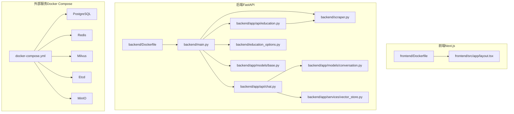
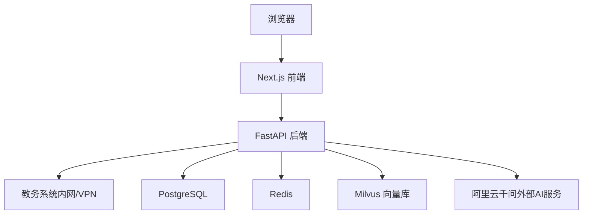
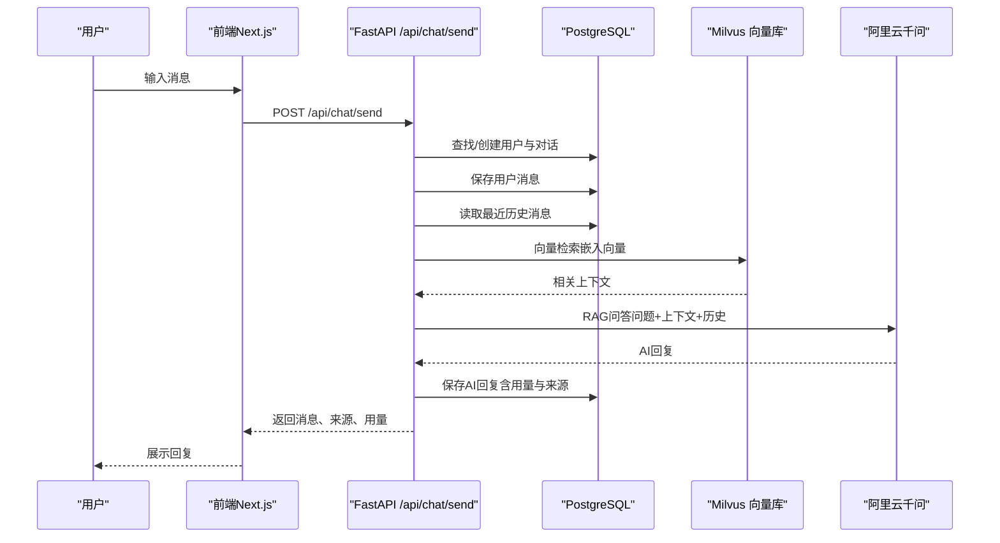
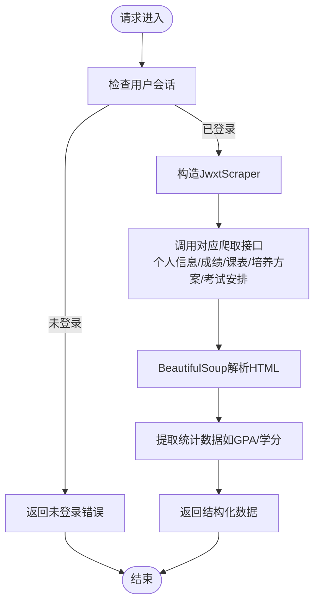
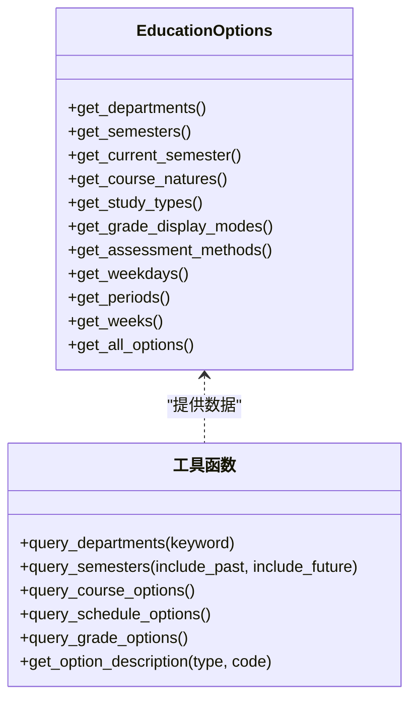
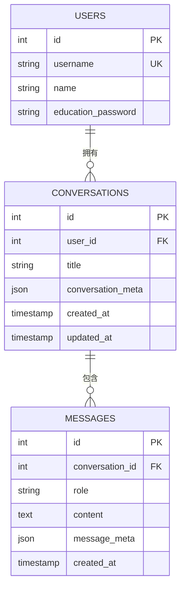
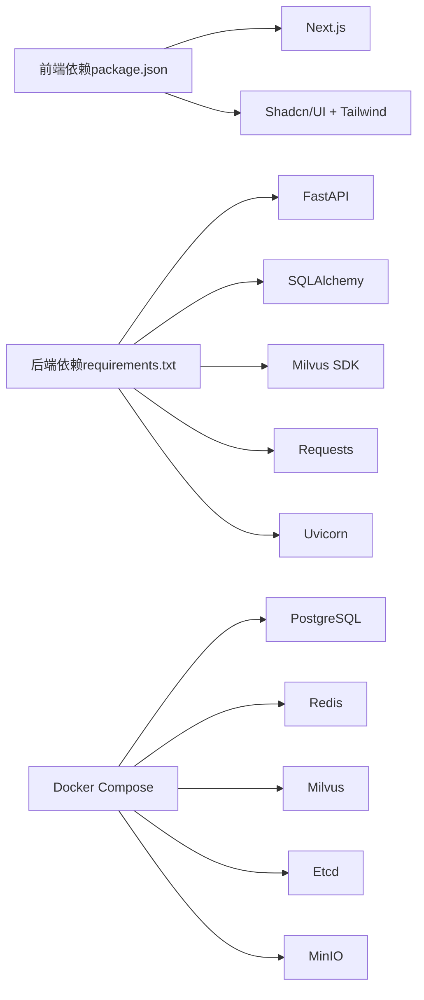

# 整体架构设计

<cite>
**本文引用的文件**
- [backend/main.py](file://backend/main.py)
- [backend/app/api/chat.py](file://backend/app/api/chat.py)
- [backend/app/api/education.py](file://backend/app/api/education.py)
- [backend/scraper.py](file://backend/scraper.py)
- [backend/education_options.py](file://backend/education_options.py)
- [backend/app/models/base.py](file://backend/app/models/base.py)
- [backend/app/models/conversation.py](file://backend/app/models/conversation.py)
- [backend/app/services/vector_store.py](file://backend/app/services/vector_store.py)
- [docker-compose.yml](file://docker-compose.yml)
- [backend/Dockerfile](file://backend/Dockerfile)
- [frontend/Dockerfile](file://frontend/Dockerfile)
- [frontend/src/app/layout.tsx](file://frontend/src/app/layout.tsx)
- [package.json](file://package.json)
- [README-Windows.md](file://README-Windows.md)
</cite>

## 目录
1. [简介](#简介)
2. [项目结构](#项目结构)
3. [核心组件](#核心组件)
4. [架构总览](#架构总览)
5. [详细组件分析](#详细组件分析)
6. [依赖分析](#依赖分析)
7. [性能考量](#性能考量)
8. [故障排查指南](#故障排查指南)
9. [结论](#结论)
10. [附录](#附录)

## 简介
本项目是一个“智能教务系统AI助手”，采用前后端分离架构，结合FastAPI后端、Next.js前端、PostgreSQL数据库、Redis缓存、Milvus向量数据库以及外部AI服务（阿里云千问），实现教务数据爬取、RAG增强问答、会话与历史管理等能力。系统通过Docker Compose进行容器化编排，支持开发与生产环境的一致部署。

## 项目结构
- 前端（Next.js 16，TypeScript，Tailwind CSS，Shadcn/UI）
  - 应用入口布局与页面组织位于 frontend/src/app
  - Dockerfile 使用 Nginx 进行静态资源服务
- 后端（FastAPI，Python 3.10）
  - API路由与业务逻辑集中在 backend/main.py
  - 教务数据爬虫封装于 backend/scraper.py
  - AI对话与RAG相关接口位于 backend/app/api/chat.py
  - 教务系统登录与数据查询接口位于 backend/app/api/education.py
  - 数据模型与数据库连接位于 backend/app/models/*
  - 向量数据库服务位于 backend/app/services/vector_store.py
  - Dockerfile 基于 Python slim，使用 Uvicorn 启动
- 外部服务（Docker Compose）
  - PostgreSQL、Redis、Etcd、MinIO、Milvus 作为基础设施
- 其他
  - package.json 定义前端依赖与脚本
  - README-Windows.md 提供部署与开发指引

**图表来源**
- [docker-compose.yml:1-148](file://docker-compose.yml#L1-L148)
- [backend/Dockerfile:1-18](file://backend/Dockerfile#L1-L18)
- [frontend/Dockerfile:1-33](file://frontend/Dockerfile#L1-L33)
- [backend/main.py:1-853](file://backend/main.py#L1-L853)
- [backend/app/api/chat.py:1-224](file://backend/app/api/chat.py#L1-L224)
- [backend/app/api/education.py:1-104](file://backend/app/api/education.py#L1-L104)
- [backend/scraper.py:1-1220](file://backend/scraper.py#L1-L1220)
- [backend/education_options.py:1-420](file://backend/education_options.py#L1-L420)
- [backend/app/models/base.py:1-29](file://backend/app/models/base.py#L1-L29)
- [backend/app/models/conversation.py:1-42](file://backend/app/models/conversation.py#L1-L42)
- [backend/app/services/vector_store.py:1-164](file://backend/app/services/vector_store.py#L1-L164)

**章节来源**
- [docker-compose.yml:1-148](file://docker-compose.yml#L1-L148)
- [backend/Dockerfile:1-18](file://backend/Dockerfile#L1-L18)
- [frontend/Dockerfile:1-33](file://frontend/Dockerfile#L1-L33)
- [frontend/src/app/layout.tsx:1-22](file://frontend/src/app/layout.tsx#L1-L22)
- [package.json:1-92](file://package.json#L1-L92)

## 核心组件
- 表现层（前端Next.js）
  - 使用 Next.js 16 的 App Router 组织页面与布局，提供登录、聊天、仪表盘等界面
  - 通过 Dockerfile 使用 Nginx 提供静态资源服务
- 业务逻辑层（FastAPI后端）
  - 主入口 backend/main.py 提供健康检查、验证码、登录、个人信息、成绩、课表、培养方案、考试安排、教师/课程查询、AI对话等接口
  - AI对话与RAG：backend/app/api/chat.py 实现基于会话的历史管理、向量检索与千问问答
  - 教务系统登录与查询：backend/app/api/education.py 提供验证码、登录、成绩与课表查询
  - 数据爬虫：backend/scraper.py 封装对教务系统的请求、解析与数据聚合
  - 选项数据：backend/education_options.py 提供AI工具所需的下拉选项与查询函数
- 数据访问层
  - 数据库连接与会话：backend/app/models/base.py
  - 会话与消息模型：backend/app/models/conversation.py
  - 向量数据库服务：backend/app/services/vector_store.py（Milvus）
- 外部服务集成层
  - Docker Compose 编排 PostgreSQL、Redis、Milvus、Etcd、MinIO
  - 环境变量注入（如数据库、缓存、Milvus、AI密钥等）

**章节来源**
- [backend/main.py:1-853](file://backend/main.py#L1-L853)
- [backend/app/api/chat.py:1-224](file://backend/app/api/chat.py#L1-L224)
- [backend/app/api/education.py:1-104](file://backend/app/api/education.py#L1-L104)
- [backend/scraper.py:1-1220](file://backend/scraper.py#L1-L1220)
- [backend/education_options.py:1-420](file://backend/education_options.py#L1-L420)
- [backend/app/models/base.py:1-29](file://backend/app/models/base.py#L1-L29)
- [backend/app/models/conversation.py:1-42](file://backend/app/models/conversation.py#L1-L42)
- [backend/app/services/vector_store.py:1-164](file://backend/app/services/vector_store.py#L1-L164)
- [docker-compose.yml:1-148](file://docker-compose.yml#L1-L148)

## 架构总览
系统采用分层架构与微服务思想：
- 表现层：Next.js负责UI渲染与交互，通过环境变量NEXT_PUBLIC_API_URL指向后端API
- 业务逻辑层：FastAPI提供REST接口，内部按功能拆分为教育查询、AI对话、选项工具等模块
- 数据访问层：PostgreSQL存储用户、会话、消息等结构化数据；Milvus存储RAG向量；Redis用于会话与缓存（示例中以内存字典存储会话，生产建议替换为Redis）
- 外部服务：Docker Compose统一编排数据库、缓存、向量库与对象存储

**图表来源**
- [backend/main.py:1-853](file://backend/main.py#L1-L853)
- [backend/app/api/chat.py:1-224](file://backend/app/api/chat.py#L1-L224)
- [docker-compose.yml:1-148](file://docker-compose.yml#L1-L148)
- [README-Windows.md:353-370](file://README-Windows.md#L353-L370)

## 详细组件分析

### 组件A：AI对话与RAG流程
该组件负责用户与AI的交互，支持历史会话管理与RAG检索增强。

**图表来源**
- [backend/app/api/chat.py:45-154](file://backend/app/api/chat.py#L45-L154)
- [backend/app/models/conversation.py:1-42](file://backend/app/models/conversation.py#L1-L42)
- [backend/app/services/vector_store.py:100-142](file://backend/app/services/vector_store.py#L100-L142)

**章节来源**
- [backend/app/api/chat.py:1-224](file://backend/app/api/chat.py#L1-L224)
- [backend/app/models/conversation.py:1-42](file://backend/app/models/conversation.py#L1-L42)
- [backend/app/services/vector_store.py:1-164](file://backend/app/services/vector_store.py#L1-L164)

### 组件B：教务系统数据爬取与查询
该组件负责从教务系统抓取个人信息、成绩、课表、培养方案、考试安排等数据。

**图表来源**
- [backend/scraper.py:13-1220](file://backend/scraper.py#L13-L1220)
- [backend/main.py:330-725](file://backend/main.py#L330-L725)

**章节来源**
- [backend/scraper.py:1-1220](file://backend/scraper.py#L1-L1220)
- [backend/main.py:330-725](file://backend/main.py#L330-L725)

### 组件C：选项数据与AI工具
该组件提供AI工具所需的下拉选项与查询函数，如院系、学期、课程性质、节次等。

**图表来源**
- [backend/education_options.py:130-420](file://backend/education_options.py#L130-L420)

**章节来源**
- [backend/education_options.py:1-420](file://backend/education_options.py#L1-L420)

### 组件D：数据库与向量存储
- 数据库：PostgreSQL，使用SQLAlchemy ORM定义用户、会话、消息模型
- 向量库：Milvus，提供集合创建、文档插入、相似度检索、用户数据清理等能力

**图表来源**
- [backend/app/models/conversation.py:11-42](file://backend/app/models/conversation.py#L11-L42)
- [backend/app/models/base.py:1-29](file://backend/app/models/base.py#L1-L29)

**章节来源**
- [backend/app/models/base.py:1-29](file://backend/app/models/base.py#L1-L29)
- [backend/app/models/conversation.py:1-42](file://backend/app/models/conversation.py#L1-L42)
- [backend/app/services/vector_store.py:1-164](file://backend/app/services/vector_store.py#L1-L164)

## 依赖分析
- 前端依赖
  - Next.js 16、React 19、Tailwind CSS、Shadcn/UI 组件库
  - AWS SDK、Supabase、Recharts、日期处理等生态库
- 后端依赖
  - FastAPI、Requests、BeautifulSoup4、SQLAlchemy、Pydantic
  - Milvus Python SDK、Uvicorn、Docker 环境变量
- 外部服务
  - PostgreSQL、Redis、Milvus、Etcd、MinIO 通过 docker-compose 统一编排

**图表来源**
- [package.json:12-68](file://package.json#L12-L68)
- [backend/Dockerfile:1-18](file://backend/Dockerfile#L1-L18)
- [docker-compose.yml:1-148](file://docker-compose.yml#L1-L148)

**章节来源**
- [package.json:1-92](file://package.json#L1-L92)
- [backend/Dockerfile:1-18](file://backend/Dockerfile#L1-L18)
- [docker-compose.yml:1-148](file://docker-compose.yml#L1-L148)

## 性能考量
- 前端
  - 使用 Next.js 的SSR/静态导出能力，提升首屏加载速度与SEO
  - Nginx作为静态资源服务器，减少Node进程压力
- 后端
  - FastAPI异步与同步接口混合，适合I/O密集型（网络请求、数据库、向量检索）
  - Milvus使用COSINE距离与IVF_FLAT索引，平衡召回率与查询延迟
  - Redis用于会话与缓存（建议替换内存字典以提升并发与持久化）
- 数据库
  - PostgreSQL连接池与ORM优化，避免长事务与锁竞争
- 外部服务
  - Docker Compose统一编排，便于横向扩展与资源隔离

## 故障排查指南
- 健康检查
  - 访问后端 /api/health，确认服务可用
- 验证码与登录
  - 若验证码无法显示，检查是否连接校园网或VPN
  - 登录失败常见原因为密码/验证码错误或未登录态
- AI对话
  - 确认Milvus与向量检索可用；若无RAG上下文，AI将进行通用对话
  - 检查会话与消息表是否存在，确认数据库连接字符串正确
- 外部服务
  - Docker Compose中各服务健康检查失败时，检查端口占用与镜像拉取
- 日志
  - 后端日志输出包含请求路径、状态码与异常堆栈，便于定位问题

**章节来源**
- [backend/main.py:126-129](file://backend/main.py#L126-L129)
- [backend/main.py:192-327](file://backend/main.py#L192-L327)
- [backend/app/api/chat.py:149-153](file://backend/app/api/chat.py#L149-L153)
- [docker-compose.yml:14-18](file://docker-compose.yml#L14-L18)
- [README-Windows.md:171-211](file://README-Windows.md#L171-L211)

## 结论
本项目通过清晰的分层架构与微服务思想，实现了从教务系统数据爬取到AI问答的完整闭环。前端Next.js提供现代化用户体验，后端FastAPI承载业务逻辑与外部服务集成，数据库与向量库支撑结构化与非结构化知识存储。Docker Compose简化了部署与运维，具备良好的可扩展性与可维护性。

## 附录
- 技术栈选择说明
  - Next.js：SSR与静态导出能力，适合快速迭代与SEO
  - FastAPI：高性能、自动生成OpenAPI文档、类型安全
  - LangChain：AI工具链与RAG流程抽象（项目中通过Milvus与千问实现）
  - Milvus：企业级向量数据库，支持高维向量相似度检索
  - PostgreSQL/Redis：结构化数据与缓存，满足会话与消息存储
- 部署与开发
  - Windows环境提供一键启动脚本与详细步骤，便于本地快速验证

**章节来源**
- [README-Windows.md:353-370](file://README-Windows.md#L353-L370)
- [README-Windows.md:294-330](file://README-Windows.md#L294-L330)