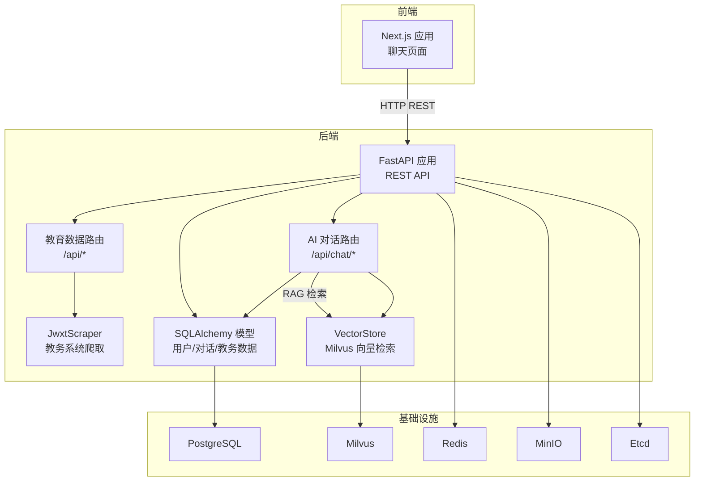
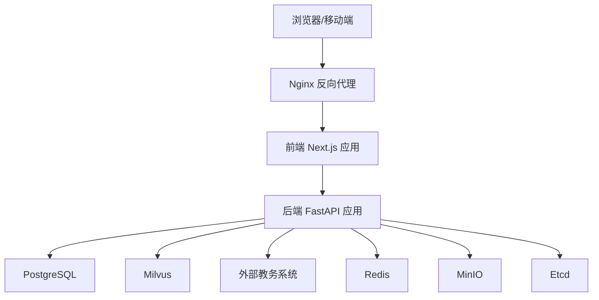
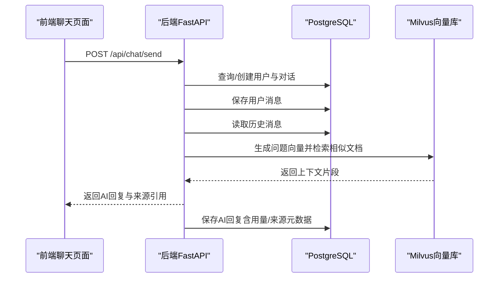
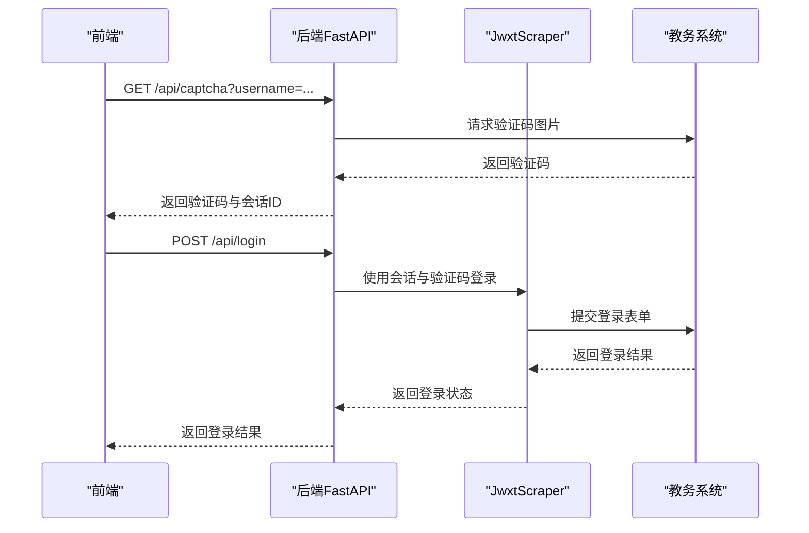
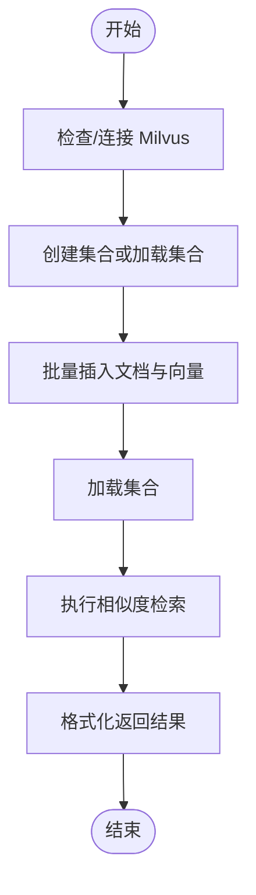
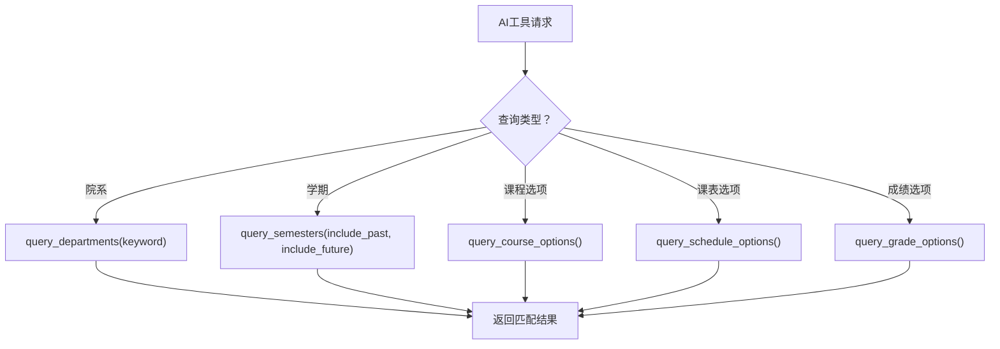
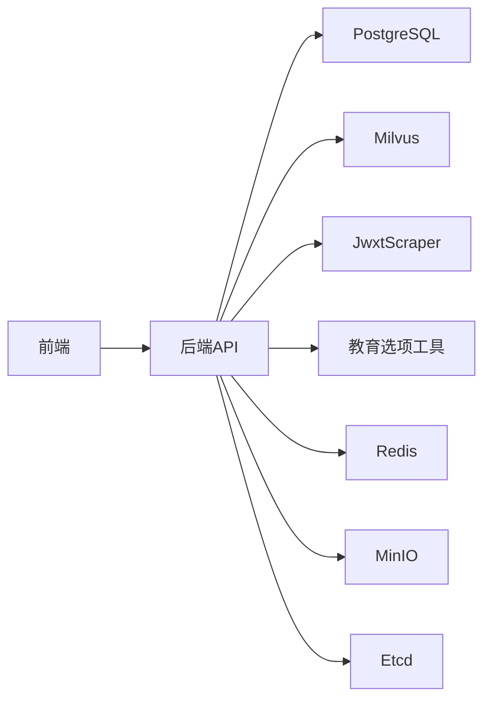

# 服务交互关系

<cite>
**本文档引用的文件**
- [backend/main.py](file://backend/main.py)
- [backend/app/api/chat.py](file://backend/app/api/chat.py)
- [backend/app/api/education.py](file://backend/app/api/education.py)
- [backend/app/services/vector_store.py](file://backend/app/services/vector_store.py)
- [backend/scraper.py](file://backend/scraper.py)
- [backend/education_options.py](file://backend/education_options.py)
- [backend/app/models/base.py](file://backend/app/models/base.py)
- [backend/app/models/user.py](file://backend/app/models/user.py)
- [backend/app/models/conversation.py](file://backend/app/models/conversation.py)
- [backend/app/models/education_data.py](file://backend/app/models/education_data.py)
- [frontend/src/app/chat/page.tsx](file://frontend/src/app/chat/page.tsx)
- [docker-compose.yml](file://docker-compose.yml)
- [backend/Dockerfile](file://backend/Dockerfile)
- [frontend/Dockerfile](file://frontend/Dockerfile)
</cite>

## 目录
1. [简介](#简介)
2. [项目结构](#项目结构)
3. [核心组件](#核心组件)
4. [架构总览](#架构总览)
5. [详细组件分析](#详细组件分析)
6. [依赖关系分析](#依赖关系分析)
7. [性能考量](#性能考量)
8. [故障排查指南](#故障排查指南)
9. [结论](#结论)
10. [附录](#附录)

## 简介
本文件面向“智能教务系统AI助手”的服务交互关系，系统采用前后端分离架构，后端基于FastAPI提供REST API，前端基于Next.js构建聊天界面。后端服务与外部教务系统进行HTTP爬取交互，同时集成向量数据库（Milvus）实现RAG检索增强生成。系统通过容器编排（Docker Compose）统一部署数据库（PostgreSQL）、缓存（Redis）、对象存储（MinIO）、键值存储（Etcd）及向量数据库（Milvus），并以Nginx作为静态资源与反向代理入口。

## 项目结构
- 后端（Python/FastAPI）
  - API层：教育数据接口与AI对话接口
  - 服务层：向量数据库服务
  - 模型层：SQLAlchemy ORM模型
  - 爬虫模块：对接教务系统
- 前端（Next.js）
  - 聊天页面：与后端API交互，展示对话历史与来源引用
- 容器编排（Docker Compose）
  - 统一编排数据库、缓存、对象存储、键值存储、向量数据库、前端、后端



图表来源
- [backend/main.py:39-123](file://backend/main.py#L39-L123)
- [backend/app/api/chat.py:14-154](file://backend/app/api/chat.py#L14-L154)
- [backend/app/api/education.py:13-104](file://backend/app/api/education.py#L13-L104)
- [backend/app/services/vector_store.py:14-164](file://backend/app/services/vector_store.py#L14-L164)
- [backend/scraper.py:13-60](file://backend/scraper.py#L13-L60)
- [backend/app/models/base.py:10-29](file://backend/app/models/base.py#L10-L29)
- [docker-compose.yml:1-148](file://docker-compose.yml#L1-L148)

章节来源
- [backend/main.py:39-123](file://backend/main.py#L39-L123)
- [docker-compose.yml:1-148](file://docker-compose.yml#L1-L148)

## 核心组件
- 前端聊天页面
  - 通过fetch与后端API交互，支持发送消息、获取对话列表、查看历史、删除对话等
  - 支持快捷问题与在线状态提示
- 后端FastAPI应用
  - 提供健康检查、验证码、登录、个人信息、成绩、课表、培养方案、学业进度、考试安排、课程/教师查询、RAG对话等接口
  - 内置CORS中间件，支持跨域访问
- 教务系统爬虫
  - 封装登录、验证码、个人信息、学籍卡片、成绩、课表、培养方案、学业进度、考试安排等爬取逻辑
- 向量数据库服务
  - 基于Milvus，提供集合创建、文档插入、相似度检索、用户数据清理等能力
- 数据模型（SQLAlchemy）
  - 用户、对话、消息、教育数据等模型，支撑RAG上下文持久化与对话历史管理
- 基础设施
  - PostgreSQL（用户与对话数据）、Milvus（RAG向量库）、Redis（会话/缓存）、MinIO（对象存储）、Etcd（键值存储）

章节来源
- [frontend/src/app/chat/page.tsx:33-491](file://frontend/src/app/chat/page.tsx#L33-L491)
- [backend/main.py:39-123](file://backend/main.py#L39-L123)
- [backend/scraper.py:13-60](file://backend/scraper.py#L13-L60)
- [backend/app/services/vector_store.py:14-164](file://backend/app/services/vector_store.py#L14-L164)
- [backend/app/models/user.py:11-33](file://backend/app/models/user.py#L11-L33)
- [backend/app/models/conversation.py:11-42](file://backend/app/models/conversation.py#L11-L42)
- [backend/app/models/education_data.py:11-48](file://backend/app/models/education_data.py#L11-L48)

## 架构总览
系统采用“前端直连后端API”的REST通信模式，后端通过爬虫模块与教务系统交互，同时利用向量数据库实现RAG增强问答。数据库与向量数据库通过环境变量与容器编排进行解耦，便于扩展与维护。



图表来源
- [frontend/Dockerfile:19-33](file://frontend/Dockerfile#L19-L33)
- [backend/Dockerfile:1-18](file://backend/Dockerfile#L1-L18)
- [docker-compose.yml:1-148](file://docker-compose.yml#L1-L148)

## 详细组件分析

### 组件A：前端聊天页面与后端AI对话接口
- 前端职责
  - 用户输入学号与消息，发起POST请求至后端AI对话接口
  - 展示对话历史、来源引用、加载状态与错误提示
- 后端AI对话流程
  - 自动创建/定位用户与对话
  - 保存用户消息
  - 基于历史消息与RAG检索上下文调用AI服务生成回复
  - 保存AI回复并返回结果



图表来源
- [frontend/src/app/chat/page.tsx:89-143](file://frontend/src/app/chat/page.tsx#L89-L143)
- [backend/app/api/chat.py:46-154](file://backend/app/api/chat.py#L46-L154)
- [backend/app/services/vector_store.py:100-142](file://backend/app/services/vector_store.py#L100-L142)
- [backend/app/models/base.py:10-29](file://backend/app/models/base.py#L10-L29)

章节来源
- [frontend/src/app/chat/page.tsx:33-491](file://frontend/src/app/chat/page.tsx#L33-L491)
- [backend/app/api/chat.py:14-224](file://backend/app/api/chat.py#L14-L224)

### 组件B：后端REST API与外部教务系统交互
- 登录与验证码
  - 获取验证码并绑定服务器索引，登录时复用对应会话与服务器
- 数据查询
  - 个人信息、学籍卡片、成绩、课表、培养方案、学业进度、考试安排、课程/教师查询等
- 服务器选择
  - 基于学号哈希选择服务器，保证验证码与登录一致性



图表来源
- [backend/main.py:135-328](file://backend/main.py#L135-L328)
- [backend/scraper.py:22-60](file://backend/scraper.py#L22-L60)

章节来源
- [backend/main.py:135-328](file://backend/main.py#L135-L328)
- [backend/scraper.py:13-60](file://backend/scraper.py#L13-L60)

### 组件C：向量数据库服务与RAG检索
- 集合管理
  - 自动创建集合、建立索引（COSINE距离、IVF_FLAT）
- 文档插入
  - 批量写入用户ID、文本、向量、来源与元数据
- 检索
  - 基于用户维度过滤，返回相似度最高的上下文片段
- 清理
  - 支持按用户删除所有向量数据



图表来源
- [backend/app/services/vector_store.py:24-164](file://backend/app/services/vector_store.py#L24-L164)

章节来源
- [backend/app/services/vector_store.py:14-164](file://backend/app/services/vector_store.py#L14-L164)

### 组件D：数据模型与关系
- 用户、对话、消息、教育数据模型
  - 用户与对话一对多，对话与消息一对多
  - 教育数据与用户一对一，用于缓存爬取的教务数据

```mermaid
erDiagram
USERS {
int id PK
string username UK
string name
string department
string major
string class_name
boolean is_active
timestamptz created_at
timestamptz updated_at
}
CONVERSATIONS {
int id PK
int user_id FK
string title
jsonb conversation_meta
timestamptz created_at
timestamptz updated_at
}
MESSAGES {
int id PK
int conversation_id FK
string role
text content
jsonb message_meta
timestamptz created_at
}
EDUCATION_DATA {
int id PK
int user_id FK UK
jsonb personal_info
jsonb grades
jsonb grade_stats
jsonb schedule
jsonb training_plan
jsonb academic_progress
jsonb exam_schedule
jsonb execution_plan
jsonb course_selection
timestamptz last_updated
}
USERS ||--o{ CONVERSATIONS : "拥有"
CONVERSATIONS ||--o{ MESSAGES : "包含"
USERS ||--|| EDUCATION_DATA : "拥有"
```

图表来源
- [backend/app/models/user.py:11-33](file://backend/app/models/user.py#L11-L33)
- [backend/app/models/conversation.py:11-42](file://backend/app/models/conversation.py#L11-L42)
- [backend/app/models/education_data.py:11-48](file://backend/app/models/education_data.py#L11-L48)

章节来源
- [backend/app/models/user.py:11-33](file://backend/app/models/user.py#L11-L33)
- [backend/app/models/conversation.py:11-42](file://backend/app/models/conversation.py#L11-L42)
- [backend/app/models/education_data.py:11-48](file://backend/app/models/education_data.py#L11-L48)

### 组件E：AI工具与选项查询
- 教育选项工具
  - 院系、学期、课程性质、修读类别、成绩显示方式、考核方式、星期、节次、周次等
- AI工具函数
  - 支持关键词查询、当前学期推断、组合选项聚合



图表来源
- [backend/education_options.py:264-377](file://backend/education_options.py#L264-L377)

章节来源
- [backend/education_options.py:1-420](file://backend/education_options.py#L1-L420)

## 依赖关系分析
- 组件耦合
  - 前端仅依赖后端REST接口，低耦合
  - 后端API依赖数据库、向量库、爬虫模块与外部系统
- 外部依赖
  - PostgreSQL：用户与对话数据持久化
  - Milvus：RAG向量检索
  - Redis：会话/缓存（后端使用内存字典，容器中可替换）
  - MinIO/Etcd：对象存储与键值存储（容器编排提供）
- 循环依赖
  - 未发现循环导入或循环依赖



图表来源
- [backend/main.py:39-123](file://backend/main.py#L39-L123)
- [backend/app/api/chat.py:11-14](file://backend/app/api/chat.py#L11-L14)
- [backend/app/services/vector_store.py:17-22](file://backend/app/services/vector_store.py#L17-L22)
- [docker-compose.yml:1-148](file://docker-compose.yml#L1-L148)

章节来源
- [backend/main.py:39-123](file://backend/main.py#L39-L123)
- [docker-compose.yml:1-148](file://docker-compose.yml#L1-L148)

## 性能考量
- 并发与限流
  - 后端未内置显式限流，建议在网关或反向代理层增加限流策略
- 缓存策略
  - 登录态使用内存字典存储，生产环境建议迁移到Redis
- 向量检索
  - Milvus索引类型为IVF_FLAT，适合中小规模数据；大规模场景建议评估HNSW或GPU索引
- 网络延迟
  - 教务系统爬取受外部网络影响，建议设置超时与重试策略

## 故障排查指南
- 健康检查
  - 后端提供健康检查接口，可用于容器编排健康探针
- 日志与错误
  - 后端广泛使用日志记录关键路径；前端对网络错误与服务不可用进行友好提示
- 常见问题
  - 登录失败：检查验证码会话是否过期、服务器选择是否一致
  - RAG检索失败：确认Milvus连接、集合是否存在、向量维度是否匹配
  - 数据库连接失败：检查PostgreSQL连接字符串与容器网络

章节来源
- [backend/main.py:126-129](file://backend/main.py#L126-L129)
- [backend/app/api/chat.py:149-153](file://backend/app/api/chat.py#L149-L153)
- [frontend/src/app/chat/page.tsx:133-142](file://frontend/src/app/chat/page.tsx#L133-L142)

## 结论
该系统通过清晰的前后端分离与REST通信、完善的数据库与向量数据库集成、以及可扩展的容器化部署，实现了从教务数据爬取到RAG增强问答的完整链路。建议在生产环境中引入API网关、限流与熔断、Redis缓存、以及更完善的监控与告警体系，以提升稳定性与可观测性。

## 附录
- 部署与运行
  - 使用Docker Compose一键启动数据库、缓存、对象存储、键值存储、向量数据库、前端与后端服务
  - 前端通过Nginx提供静态资源与反向代理，后端暴露8000端口，前端暴露3000端口

章节来源
- [docker-compose.yml:1-148](file://docker-compose.yml#L1-L148)
- [backend/Dockerfile:1-18](file://backend/Dockerfile#L1-L18)
- [frontend/Dockerfile:19-33](file://frontend/Dockerfile#L19-L33)