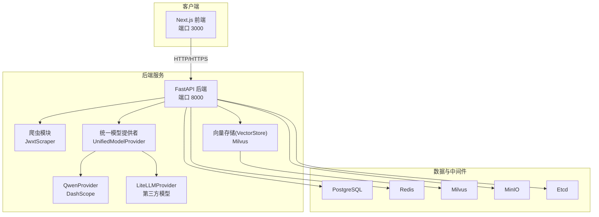
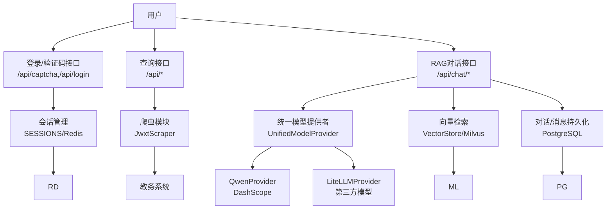
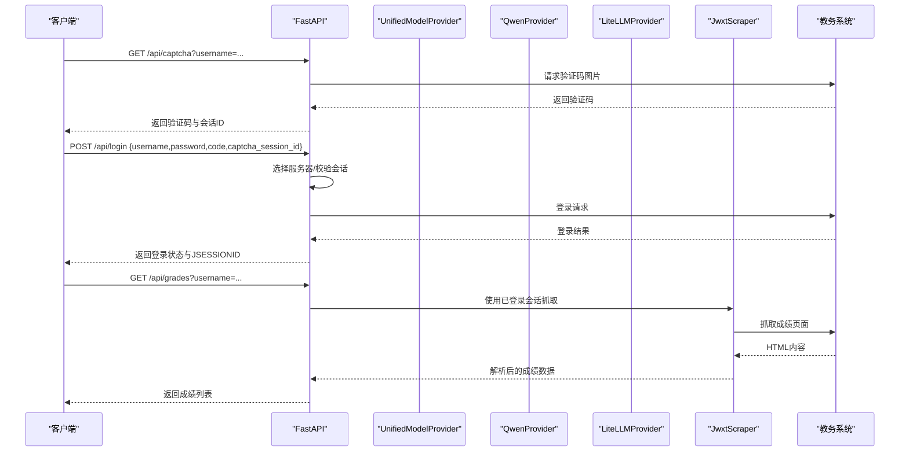
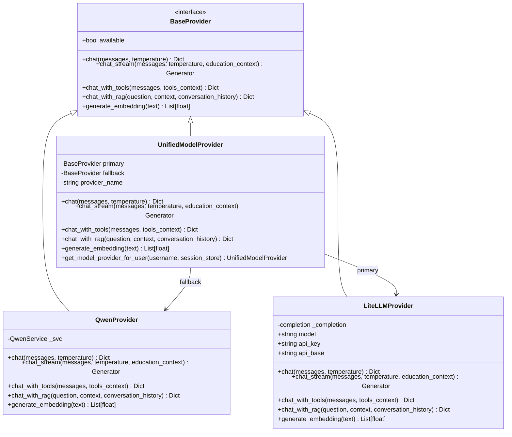
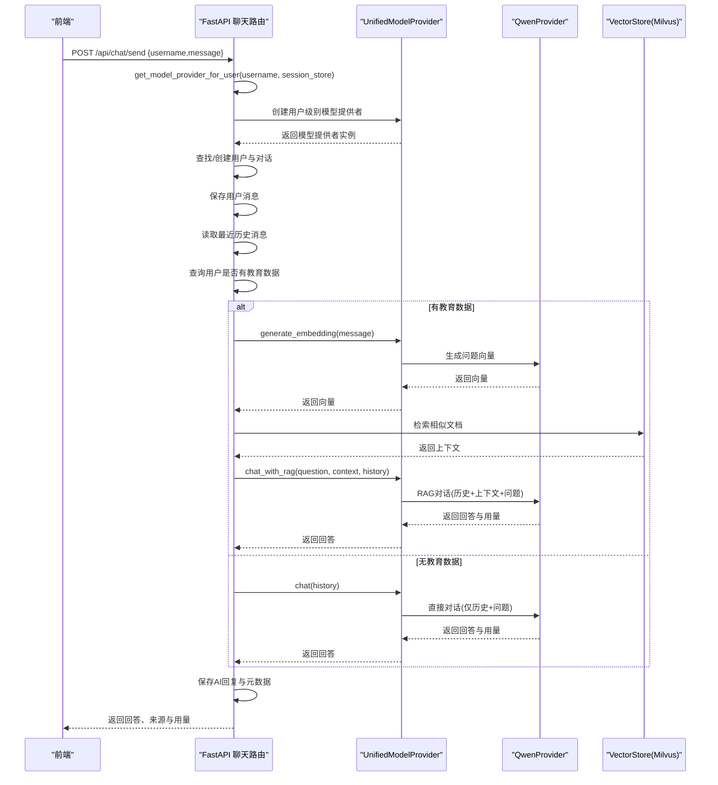
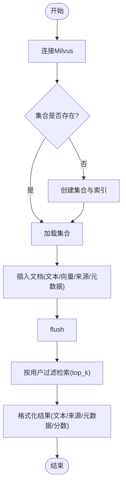
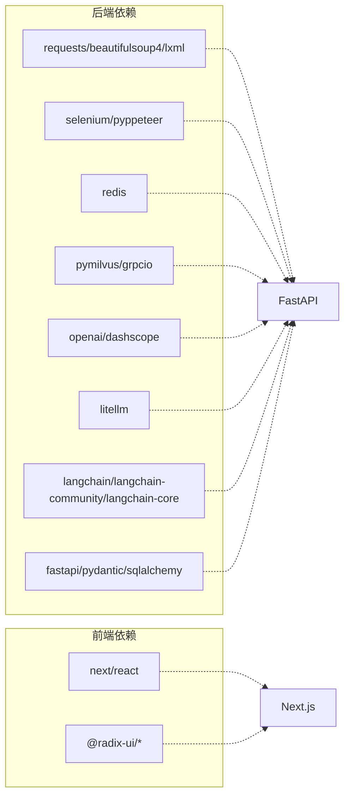

# 系统架构

<cite>
**本文档引用的文件**
- [docker-compose.yml](file://docker-compose.yml)
- [backend/main.py](file://backend/main.py)
- [backend/Dockerfile](file://backend/Dockerfile)
- [backend/requirements.txt](file://backend/requirements.txt)
- [backend/scraper.py](file://backend/scraper.py)
- [backend/app/api/chat.py](file://backend/app/api/chat.py)
- [backend/app/api/models.py](file://backend/app/api/models.py)
- [backend/app/services/vector_store.py](file://backend/app/services/vector_store.py)
- [backend/app/services/qwen_service.py](file://backend/app/services/qwen_service.py)
- [backend/app/services/model_provider.py](file://backend/app/services/model_provider.py)
- [backend/app/services/__init__.py](file://backend/app/services/__init__.py)
- [backend/app/models/base.py](file://backend/app/models/base.py)
- [backend/app/models/user.py](file://backend/app/models/user.py)
- [backend/app/models/conversation.py](file://backend/app/models/conversation.py)
- [frontend/src/app/layout.tsx](file://frontend/src/app/layout.tsx)
- [frontend/Dockerfile](file://frontend/Dockerfile)
- [package.json](file://package.json)
</cite>

## 更新摘要
**变更内容**
- 新增统一模型提供者架构（UnifiedModelProvider）实现模型无关的抽象层
- 引入BaseProvider接口定义统一的AI服务接口规范
- 实现QwenProvider和LiteLLMProvider两个具体提供者实现
- 更新聊天API以使用新的模型提供者架构
- 增强AI服务的可扩展性和可替换性

## 目录
1. [简介](#简介)
2. [项目结构](#项目结构)
3. [核心组件](#核心组件)
4. [架构总览](#架构总览)
5. [详细组件分析](#详细组件分析)
6. [依赖关系分析](#依赖关系分析)
7. [性能考量](#性能考量)
8. [故障排查指南](#故障排查指南)
9. [结论](#结论)
10. [附录](#附录)

## 简介
本系统是一个"智能教务系统AI助手"，采用前后端分离与容器化部署，围绕Next.js + FastAPI + LangChain生态（以DashScope千问为核心）构建。系统通过FastAPI提供统一后端API，负责登录认证、教务数据爬取、RAG检索增强对话与向量存储管理；前端使用Next.js提供用户界面；外部服务包括PostgreSQL（持久化）、Redis（会话与缓存）、Milvus（向量检索）、MinIO（对象存储，镜像中预留）、Etcd（键值存储，镜像中预留）。

**更新** 系统现已引入统一模型提供者架构，通过BaseProvider接口实现模型无关的抽象层，支持QwenProvider和LiteLLMProvider两种AI服务实现，并提供自动回退机制确保服务可用性。

## 项目结构
系统采用多服务容器编排，包含：
- 前端服务：Next.js应用，使用Nginx运行静态资源
- 后端服务：FastAPI应用，提供REST API与AI对话能力
- 数据与中间件：PostgreSQL、Redis、Milvus、MinIO、Etcd

**图表来源**
- [docker-compose.yml:1-148](file://docker-compose.yml#L1-L148)
- [backend/main.py:1-853](file://backend/main.py#L1-L853)
- [backend/scraper.py:1-1220](file://backend/scraper.py#L1-L1220)
- [backend/app/services/model_provider.py:189-272](file://backend/app/services/model_provider.py#L189-L272)
- [backend/app/services/vector_store.py:1-164](file://backend/app/services/vector_store.py#L1-L164)

**章节来源**
- [docker-compose.yml:1-148](file://docker-compose.yml#L1-L148)
- [frontend/Dockerfile:1-33](file://frontend/Dockerfile#L1-L33)
- [backend/Dockerfile:1-18](file://backend/Dockerfile#L1-L18)

## 核心组件
- 前端表现层（Next.js）
  - 使用Nginx容器化运行，暴露3000端口
  - 通过环境变量NEXT_PUBLIC_API_URL指向后端API路径
- 后端业务逻辑层（FastAPI）
  - 提供统一API入口，包含验证码、登录、个人信息、成绩、课表、培养方案、考试安排、教师/课程查询、RAG对话等
  - 内置教务系统爬虫模块，负责模拟登录与数据抓取
  - 集成统一模型提供者架构，实现Qwen和LiteLLM的无缝切换
  - 集成向量存储，实现RAG对话
- 数据访问层（SQLAlchemy + Postgres）
  - 用户、对话、消息、教育数据等模型定义与数据库会话管理
- 外部服务集成层
  - Redis：会话与缓存
  - Milvus：向量检索
  - MinIO/Etcd：对象存储与键值存储（镜像中预留）

**更新** 新增统一模型提供者架构，通过BaseProvider接口实现模型无关的抽象层，支持多种AI服务提供商的统一管理。

**章节来源**
- [frontend/src/app/layout.tsx:1-22](file://frontend/src/app/layout.tsx#L1-L22)
- [backend/main.py:1-853](file://backend/main.py#L1-L853)
- [backend/scraper.py:1-1220](file://backend/scraper.py#L1-L1220)
- [backend/app/api/chat.py:1-224](file://backend/app/api/chat.py#L1-L224)
- [backend/app/services/model_provider.py:1-299](file://backend/app/services/model_provider.py#L1-L299)
- [backend/app/services/vector_store.py:1-164](file://backend/app/services/vector_store.py#L1-L164)
- [backend/app/models/base.py:1-29](file://backend/app/models/base.py#L1-L29)
- [backend/app/models/user.py:1-33](file://backend/app/models/user.py#L1-L33)
- [backend/app/models/conversation.py:1-42](file://backend/app/models/conversation.py#L1-L42)

## 架构总览
系统采用分层架构与微服务理念：
- 表现层：Next.js负责UI渲染与用户交互
- API层：FastAPI提供REST接口与AI对话能力
- 领域层：爬虫模块封装教务系统交互细节
- 数据层：PostgreSQL持久化对话与用户数据；Redis缓存会话；Milvus向量化检索
- 外部集成：DashScope千问提供语言模型能力；LiteLLM提供第三方模型接入；MinIO/Etcd按需扩展

**更新** 新增统一模型提供者层，通过BaseProvider接口抽象不同AI服务提供商，实现模型无关的对话能力。

**图表来源**
- [backend/main.py:1-853](file://backend/main.py#L1-L853)
- [backend/scraper.py:1-1220](file://backend/scraper.py#L1-L1220)
- [backend/app/api/chat.py:1-224](file://backend/app/api/chat.py#L1-L224)
- [backend/app/services/vector_store.py:1-164](file://backend/app/services/vector_store.py#L1-L164)
- [backend/app/services/model_provider.py:189-272](file://backend/app/services/model_provider.py#L189-L272)

## 详细组件分析

### 组件A：后端API与路由
- 职责
  - 提供根路径与健康检查
  - 验证码获取与登录流程（含服务器选择与会话保持）
  - 教务数据聚合接口（个人信息、成绩、课表、培养方案、考试安排、教师/课程查询）
  - AI对话接口（RAG检索与历史对话管理）
- 关键流程
  - 登录流程：根据学号选择服务器 → 获取验证码 → 登录 → 保存会话
  - 数据爬取：基于已登录会话发起请求 → BeautifulSoup解析 → 结构化返回
  - RAG对话：通过统一模型提供者获取AI服务 → 生成问题向量 → Milvus检索 → AI生成回答 → 持久化对话

**更新** 聊天API现在通过统一模型提供者获取AI服务，支持用户级别的模型偏好设置和自动回退机制。

**图表来源**
- [backend/main.py:135-328](file://backend/main.py#L135-L328)
- [backend/scraper.py:13-112](file://backend/scraper.py#L13-L112)

**章节来源**
- [backend/main.py:1-853](file://backend/main.py#L1-L853)
- [backend/scraper.py:1-1220](file://backend/scraper.py#L1-L1220)

### 组件B：统一模型提供者架构
- 职责
  - 提供统一的AI服务接口，屏蔽底层模型提供商差异
  - 支持QwenProvider和LiteLLMProvider两种实现
  - 实现自动回退机制，确保服务可用性
  - 支持用户级别的模型偏好设置
- 核心接口
  - BaseProvider：定义统一的AI服务接口规范
  - QwenProvider：DashScope千问模型适配器
  - LiteLLMProvider：第三方模型适配器
  - UnifiedModelProvider：统一模型提供者，协调多个提供者

**新增** 统一模型提供者架构是本次更新的核心内容，实现了模型无关的抽象层。

**图表来源**
- [backend/app/services/model_provider.py:20-272](file://backend/app/services/model_provider.py#L20-L272)

**章节来源**
- [backend/app/services/model_provider.py:1-299](file://backend/app/services/model_provider.py#L1-L299)

### 组件C：AI对话与RAG
- 职责
  - 管理用户、对话与消息
  - 通过统一模型提供者获取AI服务
  - RAG检索：向量检索 → 上下文拼接 → AI生成
  - 支持历史对话加载与删除
- 数据流
  - 用户消息写入数据库
  - 通过统一模型提供者获取AI服务实例
  - 若存在用户教务数据，则生成问题向量并检索Milvus
  - 将上下文与历史对话喂给AI生成回答
  - 保存AI回复与用量信息

**更新** 聊天流程现在通过统一模型提供者获取AI服务，支持用户级别的模型偏好设置和自动回退。

**图表来源**
- [backend/app/api/chat.py:81-200](file://backend/app/api/chat.py#L81-L200)
- [backend/app/services/model_provider.py:276-299](file://backend/app/services/model_provider.py#L276-L299)
- [backend/app/services/vector_store.py:100-142](file://backend/app/services/vector_store.py#L100-L142)

**章节来源**
- [backend/app/api/chat.py:1-224](file://backend/app/api/chat.py#L1-L224)
- [backend/app/services/vector_store.py:1-164](file://backend/app/services/vector_store.py#L1-L164)
- [backend/app/services/model_provider.py:1-299](file://backend/app/services/model_provider.py#L1-L299)

### 组件D：向量存储与检索
- 职责
  - 连接Milvus，创建集合与索引
  - 文档入库（user_id、text、embedding、source、metadata）
  - 基于余弦距离的相似度检索
  - 按用户维度过滤与清理
- 性能要点
  - IVF_FLAT索引，nprobe参数控制召回与性能平衡
  - COSINE度量，适配嵌入向量归一化场景

**图表来源**
- [backend/app/services/vector_store.py:24-164](file://backend/app/services/vector_store.py#L24-L164)

**章节来源**
- [backend/app/services/vector_store.py:1-164](file://backend/app/services/vector_store.py#L1-L164)

### 组件E：数据模型与数据库会话
- 职责
  - 定义用户、对话、消息、教育数据等模型
  - 提供数据库引擎与会话工厂
- 关系
  - 用户与对话一对多，对话与消息一对多
  - 外键约束保证数据一致性

**章节来源**
- [backend/app/models/base.py:1-29](file://backend/app/models/base.py#L1-L29)
- [backend/app/models/user.py:1-33](file://backend/app/models/user.py#L1-L33)
- [backend/app/models/conversation.py:1-42](file://backend/app/models/conversation.py#L1-L42)

## 依赖关系分析
- 技术栈与依赖
  - 后端：FastAPI、Requests、BeautifulSoup、Selenium/Pyppeteer、Redis、Milvus、LangChain生态、OpenAI/DashScope、LiteLLM
  - 前端：Next.js、React、TailwindCSS、各类UI组件库
- 容器编排
  - docker-compose定义了Postgres、Redis、Milvus、MinIO、Etcd与前后端服务的依赖关系与端口映射
  - 后端服务依赖数据库、缓存与向量库健康检查

**更新** 新增LiteLLM依赖，支持第三方模型提供商的接入。

**图表来源**
- [backend/requirements.txt:1-44](file://backend/requirements.txt#L1-L44)
- [package.json:12-91](file://package.json#L12-L91)

**章节来源**
- [backend/requirements.txt:1-44](file://backend/requirements.txt#L1-L44)
- [package.json:12-91](file://package.json#L12-L91)
- [docker-compose.yml:1-148](file://docker-compose.yml#L1-L148)

## 性能考量
- 爬虫性能
  - 使用会话复用减少握手开销；验证码与登录在同一服务器，避免跨节点会话丢失
  - BeautifulSoup解析HTML，注意网络超时与异常处理
- 向量检索
  - Milvus索引参数（nlist/nprobe）影响召回与延迟，需结合数据规模与查询负载调优
  - COSINE度量适合归一化向量，建议统一嵌入模型
- 缓存策略
  - 登录态与验证码会话使用内存/Redis缓存，建议设置过期策略与容量上限
- API并发
  - FastAPI基于异步IO，建议配合反向代理与限流策略
- 数据库
  - 对话与消息表建立索引，定期清理历史数据降低写放大
- **更新** 模型提供者性能
  - 统一模型提供者支持自动回退，确保服务可用性
  - 用户级别模型偏好设置减少全局配置冲突
  - LiteLLMProvider支持多种第三方模型，可根据需求选择最优模型

## 故障排查指南
- 健康检查
  - 后端健康接口：/api/health
  - docker-compose中各服务健康检查脚本可辅助定位
- 常见问题
  - 登录失败：检查验证码会话是否过期、服务器选择是否正确、教务系统返回内容
  - 数据爬取失败：确认已登录、网络可达、HTML结构变化导致解析失败
  - Milvus连接失败：检查主机/端口、集合是否存在、索引是否创建
  - **更新** AI服务调用失败：检查MODEL_PROVIDER环境变量、QWEN_API_KEY/LITELLM_API_KEY配置、网络连通性
  - **新增** 模型提供者回退：检查主提供者可用性，确认回退到QwenProvider的逻辑
- 日志
  - 后端使用标准日志输出，建议集中化收集与告警

**更新** 新增模型提供者相关的故障排查指导。

**章节来源**
- [backend/main.py:126-129](file://backend/main.py#L126-L129)
- [docker-compose.yml:14-92](file://docker-compose.yml#L14-L92)
- [backend/app/services/vector_store.py:24-35](file://backend/app/services/vector_store.py#L24-L35)
- [backend/app/services/model_provider.py:189-272](file://backend/app/services/model_provider.py#L189-L272)

## 结论
本系统通过Next.js + FastAPI + LangChain生态（DashScope千问）实现了教务数据查询与RAG增强对话的完整闭环。**更新** 新引入的统一模型提供者架构通过BaseProvider接口实现了模型无关的抽象层，支持QwenProvider和LiteLLMProvider的无缝切换，增强了系统的可扩展性和可维护性。容器化编排清晰分离了前端、后端与数据/中间件服务，具备良好的可扩展性与可维护性。后续可在嵌入模型、索引参数与缓存策略上持续优化，以提升检索质量与系统吞吐。

## 附录
- 端口与服务
  - 前端：3000
  - 后端：8000
  - 数据库：5432
  - 缓存：6379
  - 向量库：19530/9091
  - 对象存储：9000/9001
  - 键值存储：2379
- 环境变量
  - 数据库：POSTGRES_HOST/PORT/USER/PASSWORD/DB
  - 缓存：REDIS_HOST/PORT
  - 向量库：MILVUS_HOST/MILVUS_PORT/MILVUS_COLLECTION
  - AI：QWEN_API_KEY/QWEN_MODEL/LITELLM_API_KEY/LITELLM_API_BASE/LITELLM_MODEL/MODEL_PROVIDER
  - 教务系统：EDUCATION_SYSTEM_URL
  - JWT：JWT_SECRET_KEY
  - CORS：CORS_ORIGINS

**更新** 新增模型提供者相关的环境变量配置。

**章节来源**
- [docker-compose.yml:113-127](file://docker-compose.yml#L113-L127)
- [backend/app/services/vector_store.py:17-22](file://backend/app/services/vector_store.py#L17-L22)
- [backend/app/services/model_provider.py:96-98](file://backend/app/services/model_provider.py#L96-L98)
- [backend/app/api/models.py:23-49](file://backend/app/api/models.py#L23-L49)