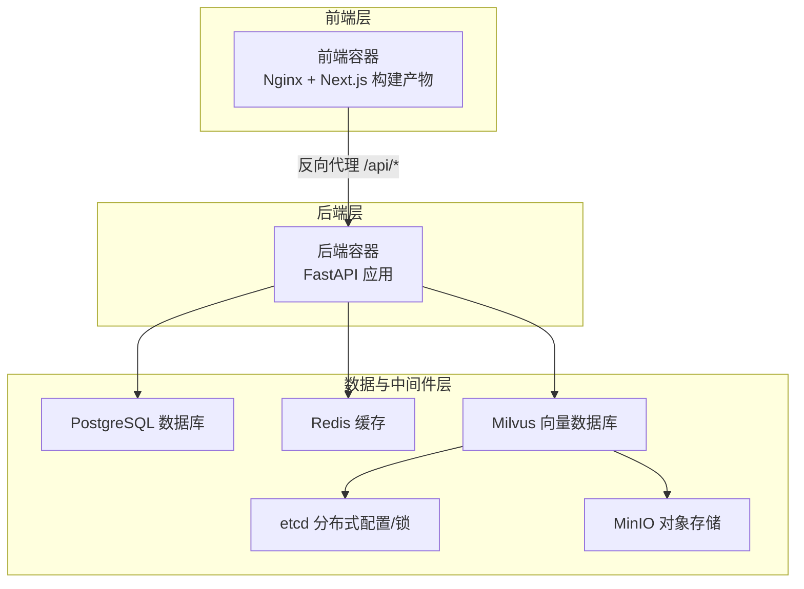
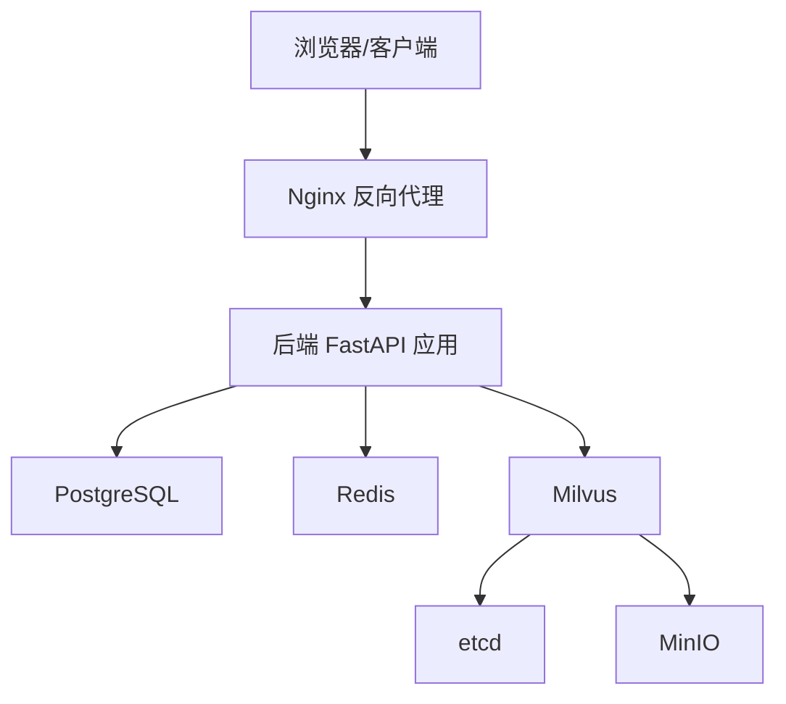
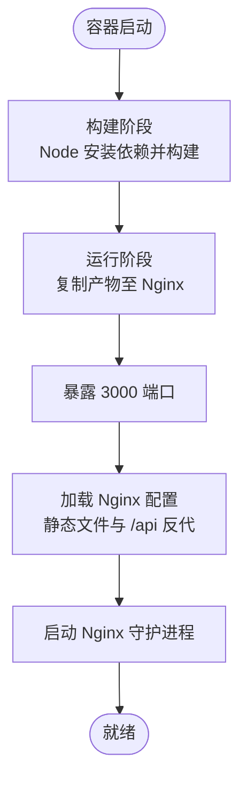
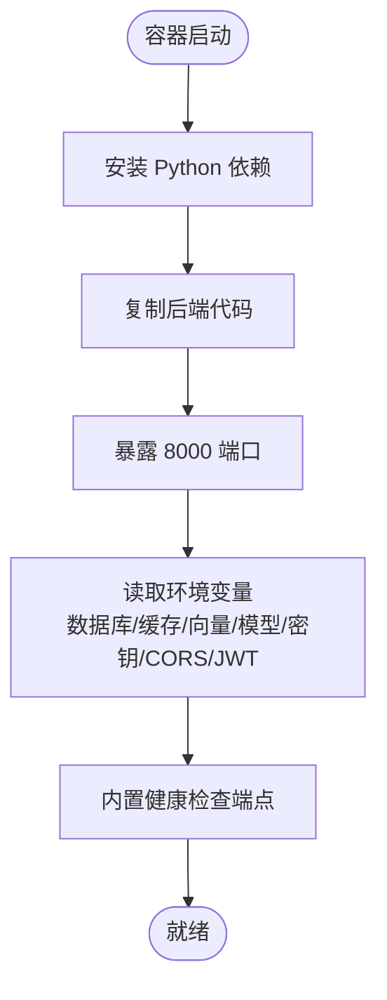
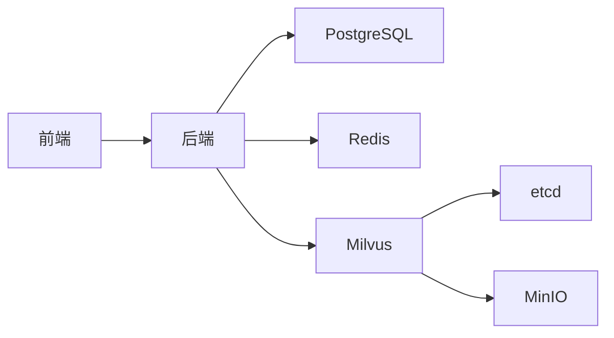

# 部署架构设计

<cite>
**本文引用的文件**
- [docker-compose.yml](file://docker-compose.yml)
- [backend/Dockerfile](file://backend/Dockerfile)
- [frontend/Dockerfile](file://frontend/Dockerfile)
- [frontend/nginx.conf](file://frontend/nginx.conf)
- [backend/main.py](file://backend/main.py)
- [backend/requirements.txt](file://backend/requirements.txt)
- [package.json](file://package.json)
- [.coze](file://.coze)
- [scripts/build.sh](file://scripts/build.sh)
- [scripts/start.sh](file://scripts/start.sh)
- [scripts/prepare.sh](file://scripts/prepare.sh)
- [scripts/dev.sh](file://scripts/dev.sh)
</cite>

## 目录
1. [引言](#引言)
2. [项目结构](#项目结构)
3. [核心组件](#核心组件)
4. [架构总览](#架构总览)
5. [详细组件分析](#详细组件分析)
6. [依赖关系分析](#依赖关系分析)
7. [性能考虑](#性能考虑)
8. [故障排查指南](#故障排查指南)
9. [结论](#结论)
10. [附录](#附录)

## 引言
本部署架构设计文档面向“智能教务系统AI助手”项目，围绕容器化与服务编排展开，重点说明以下方面：
- Docker Compose 服务编排与网络配置
- 各服务容器职责与交互关系
- 环境变量与密钥管理策略
- 健康检查与重启策略
- 负载均衡与反向代理（Nginx）
- 数据持久化与备份建议
- 监控与日志收集架构

该设计以高可用、可扩展、安全可控为目标，结合项目现有 Compose 文件与前后端镜像构建脚本进行落地。

## 项目结构
项目采用多容器微服务架构，包含前端、后端、数据库、缓存、分布式键值存储、对象存储与向量数据库等组件。Compose 将这些服务统一编排在同一自定义网络下，通过健康检查与依赖顺序保证启动顺序与可用性。

图表来源
- [docker-compose.yml:1-148](file://docker-compose.yml#L1-L148)
- [frontend/nginx.conf:1-31](file://frontend/nginx.conf#L1-L31)
- [backend/Dockerfile:1-18](file://backend/Dockerfile#L1-L18)

章节来源
- [docker-compose.yml:1-148](file://docker-compose.yml#L1-L148)

## 核心组件
- 前端容器（Nginx + Next.js 构建产物）
  - 使用多阶段构建，先在 Node 基础镜像中安装依赖并构建，再将产物复制至 Nginx 镜像提供静态资源与反向代理。
  - 暴露 3000 端口，通过 Nginx 配置将静态文件与 /api 路由转发至后端。
- 后端容器（FastAPI）
  - 基于 Python 3.11 slim 镜像，安装后端依赖并通过 Uvicorn 启动。
  - 暴露 8000 端口，接收来自 Nginx 的 /api/* 请求。
- 数据库（PostgreSQL）
  - 提供关系型数据持久化，卷挂载至 postgres_data，健康检查基于 pg_isready。
- 缓存（Redis）
  - 提供会话与缓存能力，AOF 持久化，健康检查基于 redis-cli ping。
- 分布式键值存储（etcd）
  - Milvus 依赖 etcd 作为元数据与租约管理，健康检查基于 etcdctl endpoint health。
- 对象存储（MinIO）
  - 提供 S3 兼容的对象存储，健康检查基于本地 HTTP 探活。
- 向量数据库（Milvus）
  - 以单机模式运行，依赖 etcd 与 MinIO，健康检查基于本地 HTTP 探活。

章节来源
- [frontend/Dockerfile:1-33](file://frontend/Dockerfile#L1-L33)
- [frontend/nginx.conf:1-31](file://frontend/nginx.conf#L1-L31)
- [backend/Dockerfile:1-18](file://backend/Dockerfile#L1-L18)
- [docker-compose.yml:1-148](file://docker-compose.yml#L1-L148)

## 架构总览
整体架构采用“前端 Nginx + 后端 FastAPI + 多后端服务”的分层设计。Nginx 在容器内承担静态资源与反向代理职责；后端负责业务逻辑与外部系统集成；数据库、缓存、对象存储与向量数据库分别提供数据持久化、会话与缓存、非结构化数据与向量检索能力。

图表来源
- [frontend/nginx.conf:1-31](file://frontend/nginx.conf#L1-L31)
- [backend/main.py:1-200](file://backend/main.py#L1-L200)
- [docker-compose.yml:1-148](file://docker-compose.yml#L1-L148)

## 详细组件分析

### 前端组件（Nginx + Next.js）
- 镜像构建
  - 多阶段构建：第一阶段使用 Node 基础镜像安装依赖并执行构建；第二阶段将构建产物复制到 Nginx 镜像，仅保留运行时所需文件。
- 静态资源与路由
  - Nginx 监听 3000 端口，根路径提供 Next.js 静态页面；/api 路由通过 proxy_pass 转发至后端容器的 8000 端口。
- 端口映射
  - 容器暴露 3000，宿主机映射至 3000。
- 依赖与运行
  - 依赖 package.json 中的 Next.js 与构建工具链；运行时由 Nginx 守护进程启动。

图表来源
- [frontend/Dockerfile:1-33](file://frontend/Dockerfile#L1-L33)
- [frontend/nginx.conf:1-31](file://frontend/nginx.conf#L1-L31)

章节来源
- [frontend/Dockerfile:1-33](file://frontend/Dockerfile#L1-L33)
- [frontend/nginx.conf:1-31](file://frontend/nginx.conf#L1-L31)
- [package.json:1-92](file://package.json#L1-L92)

### 后端组件（FastAPI）
- 镜像构建
  - 基于 Python 3.11 slim，安装依赖后复制源码，暴露 8000 端口，使用 Uvicorn 启动。
- 服务职责
  - 提供教务系统相关 API（验证码、登录、成绩、课表、教师/课程查询、AI 对话等），并内置健康检查端点。
- 环境变量
  - 数据库连接参数、缓存连接参数、向量数据库连接参数、AI 模型密钥、CORS 来源、JWT 密钥等均通过环境变量注入。
- 依赖关系
  - 通过 Compose 的 depends_on 与健康检查确保在数据库、缓存、向量数据库健康后再启动。

图表来源
- [backend/Dockerfile:1-18](file://backend/Dockerfile#L1-L18)
- [backend/requirements.txt:1-44](file://backend/requirements.txt#L1-L44)
- [backend/main.py:126-129](file://backend/main.py#L126-L129)

章节来源
- [backend/Dockerfile:1-18](file://backend/Dockerfile#L1-L18)
- [backend/requirements.txt:1-44](file://backend/requirements.txt#L1-L44)
- [backend/main.py:1-200](file://backend/main.py#L1-L200)
- [docker-compose.yml:107-137](file://docker-compose.yml#L107-L137)

### 数据库（PostgreSQL）
- 镜像与持久化
  - 使用 postgres:15-alpine，数据目录挂载至 postgres_data 卷。
- 健康检查
  - 使用 pg_isready 检查数据库可用性。
- 端口映射
  - 映射 5432 端口，便于本地调试或外部访问（生产环境建议限制外网访问）。

章节来源
- [docker-compose.yml:2-18](file://docker-compose.yml#L2-L18)

### 缓存（Redis）
- 镜像与持久化
  - 使用 redis:7-alpine，开启 AOF 持久化，数据目录挂载至 redis_data 卷。
- 健康检查
  - 使用 redis-cli ping 检查。
- 端口映射
  - 映射 6379 端口。

章节来源
- [docker-compose.yml:20-33](file://docker-compose.yml#L20-L33)

### 分布式键值存储（etcd）
- 镜像与配置
  - 使用 quay.io/coreos/etcd:v3.5.5，设置自动压缩、配额与快照参数。
- 健康检查
  - 使用 etcdctl endpoint health 检查。
- 数据目录
  - 挂载 etcd_data 卷。

章节来源
- [docker-compose.yml:35-51](file://docker-compose.yml#L35-L51)

### 对象存储（MinIO）
- 镜像与凭据
  - 使用 minio/minio:RELEASE.2023-03-20T20-16-18Z，内置访问/密钥。
- 健康检查
  - 通过本地 HTTP 探活。
- 端口映射
  - 映射 9000/9001 端口。
- 数据目录
  - 挂载 minio_data 卷。

章节来源
- [docker-compose.yml:53-70](file://docker-compose.yml#L53-L70)

### 向量数据库（Milvus）
- 镜像与运行模式
  - 使用 milvusdb/milvus:v2.4.1，以单机模式运行。
- 依赖与配置
  - 依赖 etcd 与 MinIO，环境变量设置 etcd 地址与 MinIO 地址。
- 健康检查
  - 通过本地 HTTP 探活。
- 数据目录
  - 挂载 milvus_data 卷。

章节来源
- [docker-compose.yml:72-92](file://docker-compose.yml#L72-L92)

### 网络与服务编排
- 自定义网络
  - 所有服务位于名为 campus-ai-network 的自定义网络中，容器间可通过服务名互访。
- 依赖与启动顺序
  - 后端服务依赖数据库、缓存、向量数据库健康后再启动，避免冷启动时的连接失败。
- 端口映射
  - 前端 3000、后端 8000、数据库 5432、缓存 6379、对象存储 9000/9001、向量数据库 19530/9091。

章节来源
- [docker-compose.yml:138-148](file://docker-compose.yml#L138-L148)

## 依赖关系分析
- 组件耦合
  - 后端对数据库、缓存、向量数据库存在直接依赖；向量数据库进一步依赖 etcd 与 MinIO。
- 外部依赖
  - 后端依赖外部教务系统服务器（硬编码服务器列表），需注意跨域与稳定性。
- 启动顺序
  - Compose 通过健康检查与 depends_on 条件保证启动顺序，降低启动期异常概率。

图表来源
- [docker-compose.yml:1-148](file://docker-compose.yml#L1-L148)

章节来源
- [docker-compose.yml:1-148](file://docker-compose.yml#L1-L148)

## 性能考虑
- 连接池与并发
  - 后端应配置数据库与缓存连接池，避免频繁创建/销毁连接带来的开销。
- 缓存策略
  - 对高频查询结果进行缓存，减少对上游系统的压力；合理设置过期时间。
- 向量检索优化
  - 向量数据库的索引与分区策略需结合数据规模调优；批量插入与增量更新分离。
- 反向代理优化
  - Nginx 可启用 gzip、静态资源缓存与合理的超时设置，提升响应速度。
- 资源隔离
  - 为各服务设置 CPU/内存限制，避免资源争抢导致雪崩。

## 故障排查指南
- 健康检查失败
  - PostgreSQL/Redis/Milvus/MinIO/etcd 的健康检查失败通常意味着容器内部服务未完全启动或配置错误。检查对应容器日志与环境变量。
- 后端无法连接下游
  - 若后端报数据库/缓存/向量数据库连接失败，确认服务名与端口正确、网络连通、健康检查已通过。
- Nginx 代理异常
  - 检查 /api 路由是否正确转发至后端 8000 端口；确认 CORS 配置与来源白名单。
- 端口冲突
  - 若宿主机端口被占用，修改 docker-compose.yml 中的端口映射或释放占用端口。
- 日志定位
  - 使用容器日志查看具体错误栈；必要时临时提高日志级别以获取更多信息。

章节来源
- [docker-compose.yml:14-18](file://docker-compose.yml#L14-L18)
- [docker-compose.yml:29-33](file://docker-compose.yml#L29-L33)
- [docker-compose.yml:47-51](file://docker-compose.yml#L47-L51)
- [docker-compose.yml:66-70](file://docker-compose.yml#L66-L70)
- [docker-compose.yml:88-92](file://docker-compose.yml#L88-L92)
- [frontend/nginx.conf:12-23](file://frontend/nginx.conf#L12-L23)

## 结论
本部署架构以 Docker Compose 实现多容器编排，通过 Nginx 提供静态资源与反向代理，后端以 FastAPI 提供业务能力，数据库、缓存、对象存储与向量数据库满足不同数据需求。健康检查与依赖顺序保障了启动的可靠性；自定义网络与卷挂载实现了服务互通与数据持久化。建议在生产环境中进一步强化密钥管理、网络隔离与监控告警体系，持续优化性能与可用性。

## 附录

### 环境变量与密钥管理
- 关键环境变量（后端）
  - 数据库：POSTGRES_HOST、POSTGRES_PORT、POSTGRES_USER、POSTGRES_PASSWORD、POSTGRES_DB
  - 缓存：REDIS_HOST、REDIS_PORT
  - 向量数据库：MILVUS_HOST、MILVUS_PORT
  - AI 模型：QWEN_API_KEY、QWEN_MODEL
  - 教务系统：EDUCATION_SYSTEM_URL
  - 安全：JWT_SECRET_KEY
  - 跨域：CORS_ORIGINS
- 密钥与敏感信息
  - 建议使用外部密钥管理服务（如 KMS、Vault 或容器平台 Secrets）注入敏感变量，避免明文写入 Compose 文件。
  - 生产环境务必覆盖默认密钥与凭据，禁止使用默认 admin 凭据。

章节来源
- [docker-compose.yml:113-127](file://docker-compose.yml#L113-L127)

### 健康检查与重启策略
- 重启策略
  - 所有服务采用 unless-stopped，确保异常退出后自动恢复。
- 健康检查
  - PostgreSQL：pg_isready
  - Redis：redis-cli ping
  - etcd：etcdctl endpoint health
  - MinIO：HTTP 探活
  - Milvus：HTTP 探活
- 依赖条件
  - 后端服务等待数据库、缓存、向量数据库健康后再启动，降低冷启动失败率。

章节来源
- [docker-compose.yml:5-18](file://docker-compose.yml#L5-L18)
- [docker-compose.yml:23-33](file://docker-compose.yml#L23-L33)
- [docker-compose.yml:47-51](file://docker-compose.yml#L47-L51)
- [docker-compose.yml:66-70](file://docker-compose.yml#L66-L70)
- [docker-compose.yml:88-92](file://docker-compose.yml#L88-L92)
- [docker-compose.yml:130-136](file://docker-compose.yml#L130-L136)

### 负载均衡与反向代理（Nginx）
- 静态资源
  - Nginx 提供 Next.js 构建产物的静态页面与 SPA 路由支持。
- API 路由转发
  - /api/* 路由转发至后端容器 8000 端口，设置必要的请求头以便后端识别真实来源与协议。
- 部署建议
  - 生产环境可在外层增加反向代理（如 Nginx/Traefik）实现 TLS 终止、限流与灰度发布。

章节来源
- [frontend/nginx.conf:1-31](file://frontend/nginx.conf#L1-L31)
- [frontend/Dockerfile:19-33](file://frontend/Dockerfile#L19-L33)

### 数据持久化与备份方案
- 卷挂载
  - postgres_data、redis_data、etcd_data、minio_data、milvus_data 五个卷分别挂载至各服务数据目录。
- 备份策略
  - 数据库：定期导出 SQL 并归档；缓存：可忽略或按需重建；对象存储与向量数据库：定期快照与异地复制。
  - 建议将卷快照与对象存储备份结合，形成完整的灾备方案。

章节来源
- [docker-compose.yml:138-143](file://docker-compose.yml#L138-L143)

### 监控与日志收集
- 容器监控
  - 使用 Prometheus/Grafana 收集容器指标（CPU/内存/网络/磁盘），结合健康检查状态进行告警。
- 应用日志
  - 后端日志输出到 stdout/stderr，结合集中式日志系统（如 ELK/Fluent Bit/Loki）进行聚合与检索。
- 建议
  - 为每个服务配置独立的日志标签与结构化字段，便于问题定位与审计。

### 开发与部署脚本
- 开发脚本
  - dev.sh：清理端口、启动热更新服务（开发模式）。
  - prepare.sh：安装依赖（开发环境）。
- 部署脚本
  - build.sh：安装依赖并构建 Next.js 产物，同时打包服务端代码。
  - start.sh：在指定端口启动打包后的服务（部署模式）。
- Coze 集成
  - .coze 文件定义了开发与部署阶段的构建与运行命令，便于在特定工作空间中快速执行。

章节来源
- [scripts/dev.sh:1-35](file://scripts/dev.sh#L1-L35)
- [scripts/prepare.sh:1-10](file://scripts/prepare.sh#L1-L10)
- [scripts/build.sh:1-18](file://scripts/build.sh#L1-L18)
- [scripts/start.sh:1-18](file://scripts/start.sh#L1-L18)
- [.coze:1-12](file://.coze#L1-L12)