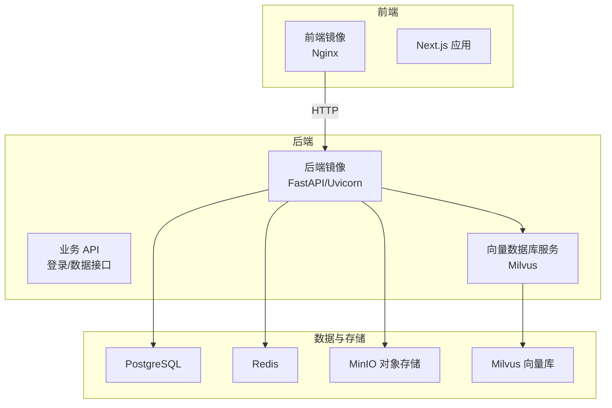
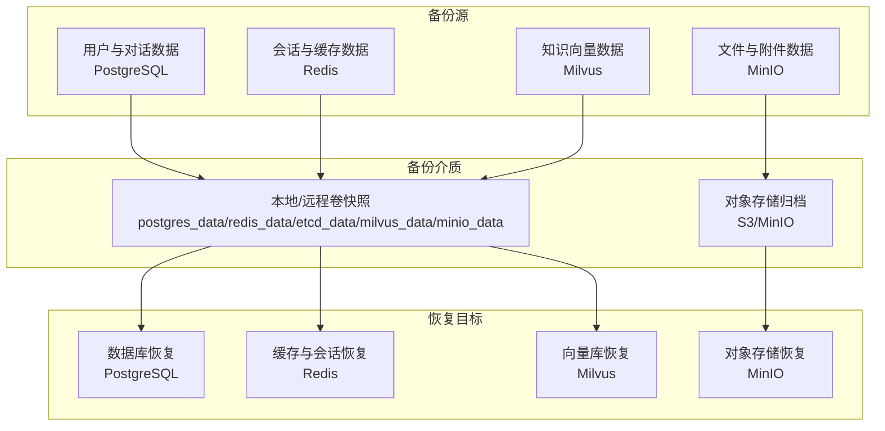
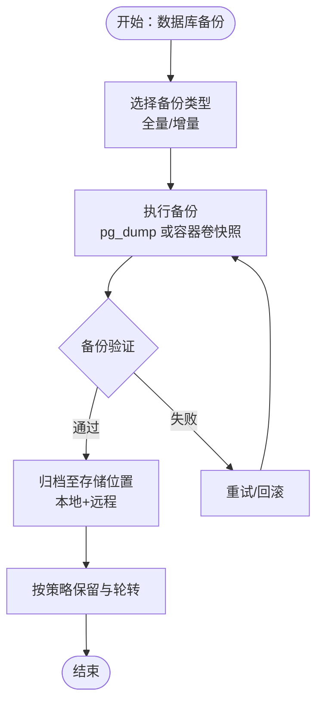
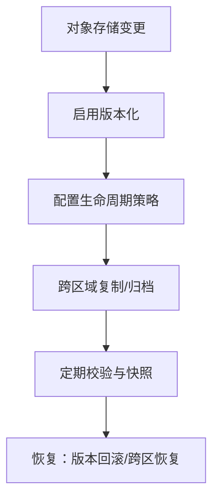
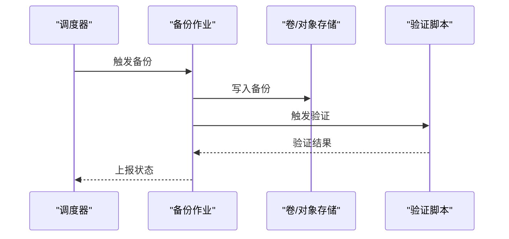
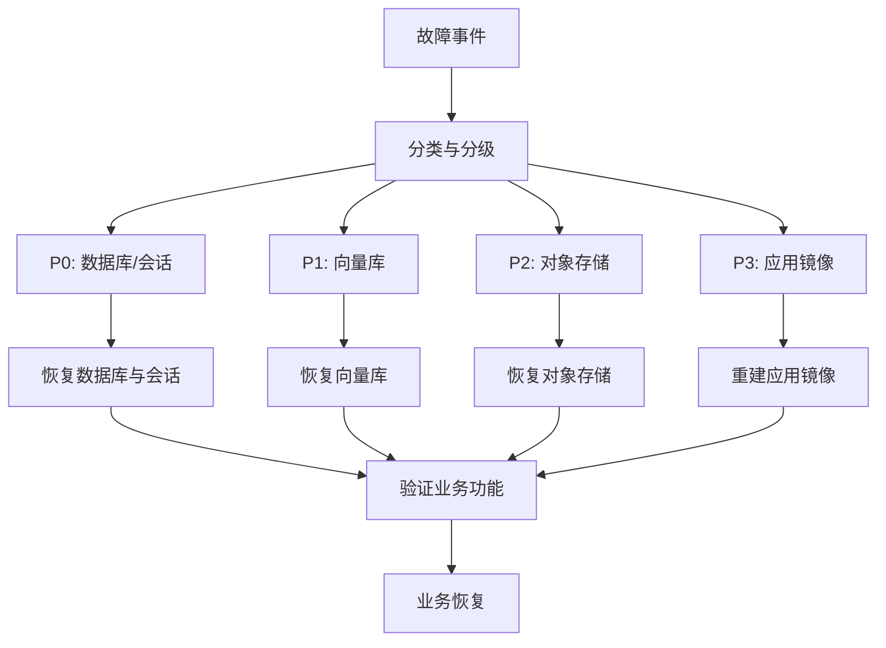
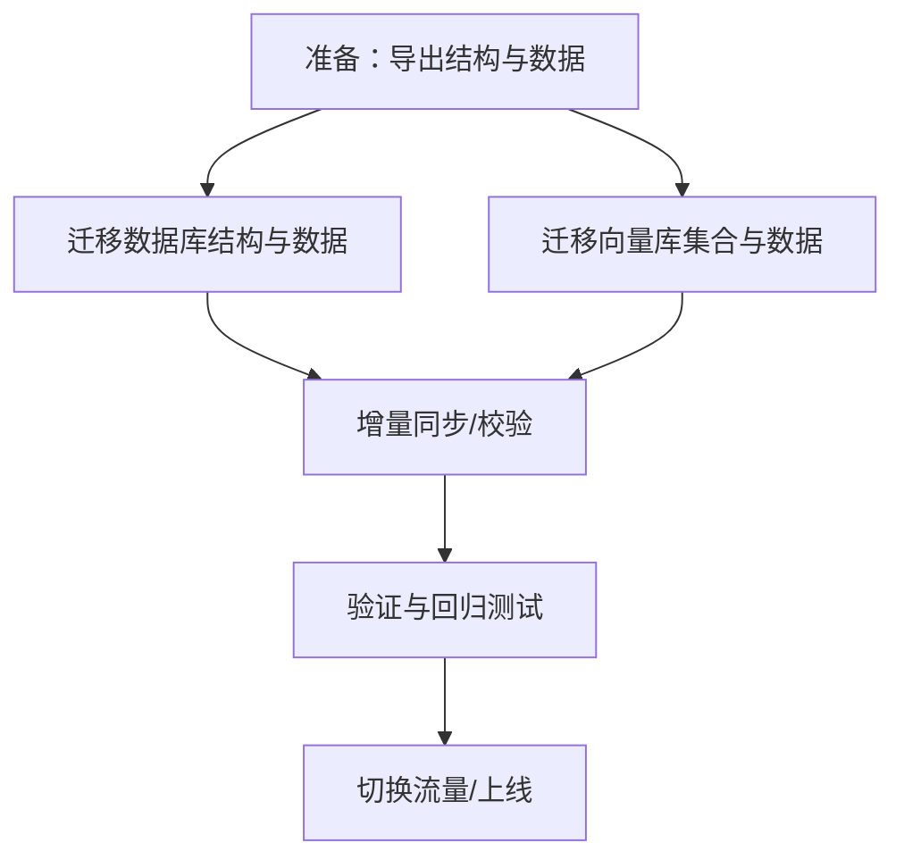
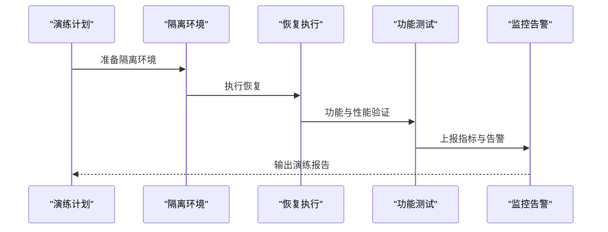
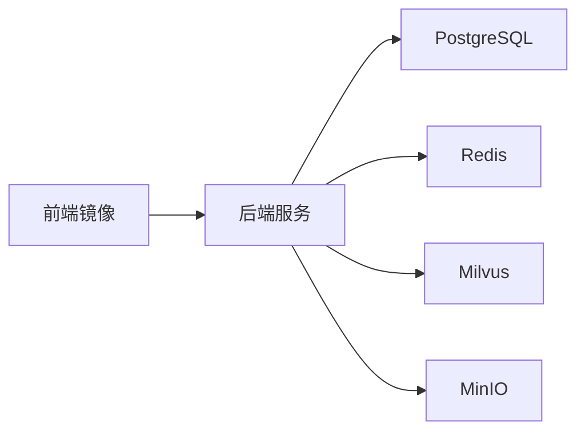

# 备份与恢复

<cite>
**本文引用的文件**
- [docker-compose.yml](file://docker-compose.yml)
- [backend/main.py](file://backend/main.py)
- [backend/app/models/base.py](file://backend/app/models/base.py)
- [backend/app/models/__init__.py](file://backend/app/models/__init__.py)
- [backend/app/services/vector_store.py](file://backend/app/services/vector_store.py)
- [backend/Dockerfile](file://backend/Dockerfile)
- [frontend/Dockerfile](file://frontend/Dockerfile)
- [backend/requirements.txt](file://backend/requirements.txt)
- [package.json](file://package.json)
- [scripts/build.sh](file://scripts/build.sh)
- [scripts/start.sh](file://scripts/start.sh)
- [backend/scraper.py](file://backend/scraper.py)
</cite>

## 目录
1. [简介](#简介)
2. [项目结构](#项目结构)
3. [核心组件](#核心组件)
4. [架构总览](#架构总览)
5. [详细组件分析](#详细组件分析)
6. [依赖分析](#依赖分析)
7. [性能考虑](#性能考虑)
8. [故障排查指南](#故障排查指南)
9. [结论](#结论)
10. [附录](#附录)

## 简介
本文件面向“智能教务系统AI助手”的运维与平台工程团队，提供一套完整的备份与恢复策略文档。内容覆盖数据库备份、文件存储备份、配置文件备份、备份自动化流程（定时任务、验证与存储位置管理）、灾难恢复计划（故障场景、恢复优先级、业务连续性保障）、数据迁移方法（版本升级、数据同步、跨环境迁移）、备份数据安全与访问控制，以及恢复测试与故障演练方法。文档以仓库现有技术栈与容器化部署为基础，结合系统中涉及的关键数据源（PostgreSQL、Redis、Milvus、MinIO/对象存储）进行落地。

## 项目结构
系统采用前后端分离与多服务容器化架构：
- 后端服务：FastAPI 应用，负责业务 API、会话与登录态管理、数据爬取与聚合。
- 数据层：PostgreSQL（持久化用户与对话等结构化数据）、Redis（缓存与会话）、Milvus（向量数据库）。
- 对象存储：MinIO（文件/附件等非结构化数据）。
- 前端服务：Next.js 应用，通过 Nginx 提供静态资源与反向代理。
- 构建与运行：Dockerfile 与 docker-compose 统一编排；脚本负责构建与启动。

图表来源
- [docker-compose.yml:1-148](file://docker-compose.yml#L1-L148)
- [backend/Dockerfile:1-18](file://backend/Dockerfile#L1-L18)
- [frontend/Dockerfile:1-33](file://frontend/Dockerfile#L1-L33)

章节来源
- [docker-compose.yml:1-148](file://docker-compose.yml#L1-L148)
- [backend/Dockerfile:1-18](file://backend/Dockerfile#L1-L18)
- [frontend/Dockerfile:1-33](file://frontend/Dockerfile#L1-L33)

## 核心组件
- 数据库与会话
  - PostgreSQL：通过 SQLAlchemy 连接，承载用户、对话、教育数据等结构化数据。
  - Redis：会话存储与缓存，支撑登录态与短期数据。
- 向量数据库
  - Milvus：基于 Pymilvus 的向量检索与存储，支撑 RAG 与知识库能力。
- 对象存储
  - MinIO：提供 S3 兼容的对象存储，用于非结构化数据归档与共享。
- 前后端镜像
  - 后端镜像基于 Python 3.11 Slim，暴露 8000 端口。
  - 前端镜像基于 Node Alpine 构建，使用 Nginx 提供静态资源。
- 构建与运行脚本
  - 构建脚本：安装依赖、Next.js 构建、打包服务端。
  - 启动脚本：在指定端口启动服务端 HTTP 服务。

章节来源
- [backend/app/models/base.py:1-29](file://backend/app/models/base.py#L1-L29)
- [backend/app/models/__init__.py:1-26](file://backend/app/models/__init__.py#L1-L26)
- [backend/app/services/vector_store.py:1-164](file://backend/app/services/vector_store.py#L1-L164)
- [docker-compose.yml:1-148](file://docker-compose.yml#L1-L148)
- [backend/Dockerfile:1-18](file://backend/Dockerfile#L1-L18)
- [frontend/Dockerfile:1-33](file://frontend/Dockerfile#L1-L33)
- [scripts/build.sh:1-18](file://scripts/build.sh#L1-L18)
- [scripts/start.sh:1-18](file://scripts/start.sh#L1-L18)

## 架构总览
下图展示备份与恢复相关的数据流与组件交互，强调备份点位与恢复路径。

图表来源
- [docker-compose.yml:10-143](file://docker-compose.yml#L10-L143)
- [backend/app/models/base.py:10-14](file://backend/app/models/base.py#L10-L14)
- [backend/app/services/vector_store.py:14-36](file://backend/app/services/vector_store.py#L14-L36)
- [backend/main.py:73-74](file://backend/main.py#L73-L74)

## 详细组件分析

### 数据库备份策略（PostgreSQL）
- 备份范围
  - 结构化数据：用户、对话、教育数据等由 SQLAlchemy 管理的表。
  - 备份介质：容器卷快照（postgres_data），或逻辑备份（SQL/自定义格式）。
- 备份频率
  - 生产建议：增量+全量组合（例如每日全量+每小时增量），或基于 WAL 的热备。
- 备份保留与轮转
  - 保留最近 14 天全量与 30 天增量，定期清理过期备份。
- 备份验证
  - 定期抽样恢复到隔离环境，校验数据一致性与应用可用性。
- 存储位置
  - 本地磁盘 + 远程对象存储（S3/MinIO）双写，满足异地容灾。

图表来源
- [docker-compose.yml:10-11](file://docker-compose.yml#L10-L11)
- [backend/app/models/base.py:10-14](file://backend/app/models/base.py#L10-L14)

章节来源
- [docker-compose.yml:10-11](file://docker-compose.yml#L10-L11)
- [backend/app/models/base.py:10-14](file://backend/app/models/base.py#L10-L14)
- [backend/app/models/__init__.py:10-12](file://backend/app/models/__init__.py#L10-L12)

### 文件存储备份策略（MinIO/对象存储）
- 备份范围
  - 用户上传的附件、系统导出文件、RAG 文档切片等。
- 备份方式
  - 对象存储层面：启用版本化与生命周期策略；定期跨区域复制。
  - 备份介质：S3/MinIO 双活或多副本，或冷存储分层。
- 备份验证
  - 抽样对象下载校验、哈希比对。
- 存储位置
  - 本地 MinIO + 远程 S3，实现跨地域冗余。

图表来源
- [docker-compose.yml:53-70](file://docker-compose.yml#L53-L70)
- [package.json:13-14](file://package.json#L13-L14)

章节来源
- [docker-compose.yml:53-70](file://docker-compose.yml#L53-L70)
- [package.json:13-14](file://package.json#L13-L14)

### 配置文件备份策略
- 备份范围
  - 环境变量与密钥：通过 .env/.env.* 或容器编排中的环境注入。
  - 配置文件：docker-compose.yml、Dockerfile、构建脚本等。
- 备份方式
  - 版本化管理（Git）+ 秘钥加密（如 sops/dotenvx）。
  - 关键密钥单独加密存储，最小权限访问。
- 存储位置
  - 私有 Git 仓库 + 加密密钥库，仅授权人员可访问。

章节来源
- [docker-compose.yml:6-13](file://docker-compose.yml#L6-L13)
- [backend/Dockerfile:1-18](file://backend/Dockerfile#L1-L18)
- [frontend/Dockerfile:1-33](file://frontend/Dockerfile#L1-L33)
- [scripts/build.sh:1-18](file://scripts/build.sh#L1-L18)
- [scripts/start.sh:1-18](file://scripts/start.sh#L1-L18)

### 备份自动化流程
- 定时任务
  - 使用 Cron 或调度器（Kubernetes CronJob/Hourly/Minutely）触发备份作业。
- 备份验证
  - 自动化脚本执行备份后校验（完整性、可恢复性）。
- 存储位置管理
  - 本地卷快照 + 远程对象存储归档，统一命名与标签，便于检索与清理。

图表来源
- [docker-compose.yml:10-143](file://docker-compose.yml#L10-L143)

章节来源
- [docker-compose.yml:10-143](file://docker-compose.yml#L10-L143)

### 灾难恢复计划（DRP）
- 故障场景
  - 单节点故障（PostgreSQL/Redis/Milvus/MinIO）。
  - 网络分区或跨机房断连。
  - 数据损坏或误删。
- 恢复优先级
  - P0：数据库与会话（保证登录与核心数据）。
  - P1：向量库（保证检索与RAG）。
  - P2：对象存储（保证文件访问）。
  - P3：前端/后端镜像（保证界面与API可用）。
- 业务连续性保障
  - 多副本与自动故障转移（容器编排健康检查）。
  - 快速回滚与蓝绿发布配合备份恢复。
  - 恢复时间目标（RTO）与恢复点目标（RPO）明确。

图表来源
- [docker-compose.yml:14-18](file://docker-compose.yml#L14-L18)
- [docker-compose.yml:29-33](file://docker-compose.yml#L29-L33)
- [docker-compose.yml:47-51](file://docker-compose.yml#L47-L51)
- [docker-compose.yml:66-70](file://docker-compose.yml#L66-L70)
- [docker-compose.yml:88-92](file://docker-compose.yml#L88-L92)

章节来源
- [docker-compose.yml:14-18](file://docker-compose.yml#L14-L18)
- [docker-compose.yml:29-33](file://docker-compose.yml#L29-L33)
- [docker-compose.yml:47-51](file://docker-compose.yml#L47-L51)
- [docker-compose.yml:66-70](file://docker-compose.yml#L66-L70)
- [docker-compose.yml:88-92](file://docker-compose.yml#L88-L92)

### 数据迁移方法
- 版本升级
  - 数据库迁移：通过 ORM 初始化或迁移工具（如 Alembic/Drizzle）执行结构变更。
  - 向量库迁移：导出集合元数据与索引参数，重建集合并批量导入。
- 数据同步
  - 结构化数据：逻辑备份+增量同步（Binlog/变更捕获）。
  - 向量数据：导出嵌入与元数据，重建集合后批量插入。
- 跨环境迁移
  - 通过标准化备份与恢复流程，将备份从源环境导入目标环境。
  - 注意网络与权限差异（主机名、端口、密钥）。

图表来源
- [backend/app/models/__init__.py:10-12](file://backend/app/models/__init__.py#L10-L12)
- [backend/app/services/vector_store.py:37-71](file://backend/app/services/vector_store.py#L37-L71)

章节来源
- [backend/app/models/__init__.py:10-12](file://backend/app/models/__init__.py#L10-L12)
- [backend/app/services/vector_store.py:37-71](file://backend/app/services/vector_store.py#L37-L71)

### 备份数据的安全存储与访问控制
- 访问控制
  - 最小权限原则：备份账号仅具备读写备份桶/卷权限。
  - 网络隔离：备份通道与业务通道分离，限制出口。
- 数据加密
  - 静态加密：对象存储与卷加密。
  - 传输加密：HTTPS/TLS，避免明文传输。
- 密钥管理
  - 使用专用密钥库（KMS/密钥管理服务），定期轮换。
  - 配置文件与密钥分离，禁止将密钥提交到版本库。

章节来源
- [docker-compose.yml:57-62](file://docker-compose.yml#L57-L62)
- [backend/Dockerfile:7-8](file://backend/Dockerfile#L7-L8)

### 恢复测试流程与故障演练
- 恢复测试
  - 定期在隔离环境执行恢复演练，验证备份完整性与应用可用性。
  - 包含：数据库恢复、向量库重建、对象存储回放、会话迁移。
- 故障演练
  - 模拟节点宕机、网络分区、数据损坏等场景，评估 RTO/RPO。
  - 结合监控告警与自动化切换，缩短恢复时间。

图表来源
- [docker-compose.yml:14-18](file://docker-compose.yml#L14-L18)
- [docker-compose.yml:29-33](file://docker-compose.yml#L29-L33)
- [docker-compose.yml:47-51](file://docker-compose.yml#L47-L51)
- [docker-compose.yml:66-70](file://docker-compose.yml#L66-L70)
- [docker-compose.yml:88-92](file://docker-compose.yml#L88-L92)

章节来源
- [docker-compose.yml:14-18](file://docker-compose.yml#L14-L18)
- [docker-compose.yml:29-33](file://docker-compose.yml#L29-L33)
- [docker-compose.yml:47-51](file://docker-compose.yml#L47-L51)
- [docker-compose.yml:66-70](file://docker-compose.yml#L66-L70)
- [docker-compose.yml:88-92](file://docker-compose.yml#L88-L92)

## 依赖分析
- 组件耦合
  - 后端服务依赖 PostgreSQL、Redis、Milvus 与 MinIO。
  - 向量服务依赖 Milvus 客户端与集合索引参数。
- 外部依赖
  - Python 依赖通过 requirements.txt 管理；前端依赖通过 package.json 管理。
- 潜在风险
  - 单点故障：数据库/缓存/向量库/对象存储任一不可用都会影响业务。
  - 数据不一致：需在备份与恢复流程中加入一致性校验。

图表来源
- [docker-compose.yml:107-137](file://docker-compose.yml#L107-L137)
- [backend/requirements.txt:1-44](file://backend/requirements.txt#L1-L44)
- [package.json:12-68](file://package.json#L12-L68)

章节来源
- [docker-compose.yml:107-137](file://docker-compose.yml#L107-L137)
- [backend/requirements.txt:1-44](file://backend/requirements.txt#L1-L44)
- [package.json:12-68](file://package.json#L12-L68)

## 性能考虑
- 备份窗口
  - 控制全量备份时间，避免业务高峰期；增量备份降低窗口。
- 并发与压缩
  - 对象存储与卷快照支持并发与压缩，提升吞吐。
- 恢复速度
  - 采用就近存储与预热策略，缩短恢复时间。

## 故障排查指南
- 健康检查
  - 利用 compose 的 healthcheck 监控各服务状态，快速定位异常。
- 日志与审计
  - 后端日志记录登录、验证码、数据爬取等关键路径，便于回溯。
- 常见问题
  - 登录态丢失：检查 Redis 与会话存储；确认容器重启策略与持久化。
  - 向量检索异常：检查 Milvus 连接与集合是否存在；确认索引参数。
  - 对象存储不可用：检查 MinIO 服务与网络连通性；核对凭证。

章节来源
- [docker-compose.yml:14-18](file://docker-compose.yml#L14-L18)
- [docker-compose.yml:29-33](file://docker-compose.yml#L29-L33)
- [docker-compose.yml:47-51](file://docker-compose.yml#L47-L51)
- [docker-compose.yml:66-70](file://docker-compose.yml#L66-L70)
- [docker-compose.yml:88-92](file://docker-compose.yml#L88-L92)
- [backend/main.py:73-74](file://backend/main.py#L73-L74)
- [backend/main.py:126-129](file://backend/main.py#L126-L129)
- [backend/scraper.py:33-59](file://backend/scraper.py#L33-L59)

## 结论
本策略以容器化与多服务架构为基础，围绕 PostgreSQL、Redis、Milvus、MinIO 四大核心数据源制定备份与恢复方案。通过卷快照与对象存储归档、自动化验证与存储位置管理、明确的灾难恢复优先级与演练机制，确保系统在发生故障时能够快速恢复并维持业务连续性。同时，配套的数据迁移与安全访问控制措施，为版本升级与跨环境迁移提供可靠保障。

## 附录
- 关键环境变量与端口
  - PostgreSQL：HOST、PORT、USER、PASSWORD、DB。
  - Redis：HOST、PORT。
  - Milvus：HOST、PORT、COLLECTION。
  - MinIO：ACCESS_KEY、SECRET_KEY。
- 构建与启动
  - 构建脚本负责依赖安装、Next.js 构建与服务端打包。
  - 启动脚本在指定端口启动服务端 HTTP 服务。

章节来源
- [backend/app/models/base.py:10-14](file://backend/app/models/base.py#L10-L14)
- [backend/app/services/vector_store.py:17-22](file://backend/app/services/vector_store.py#L17-L22)
- [docker-compose.yml:57-62](file://docker-compose.yml#L57-L62)
- [scripts/build.sh:1-18](file://scripts/build.sh#L1-L18)
- [scripts/start.sh:1-18](file://scripts/start.sh#L1-L18)