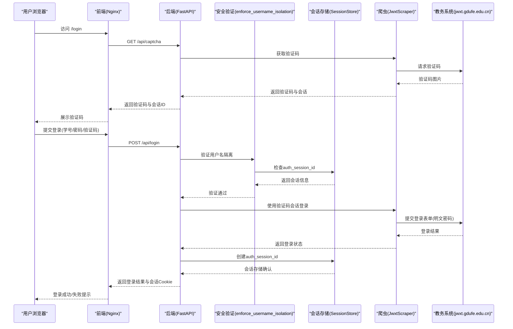
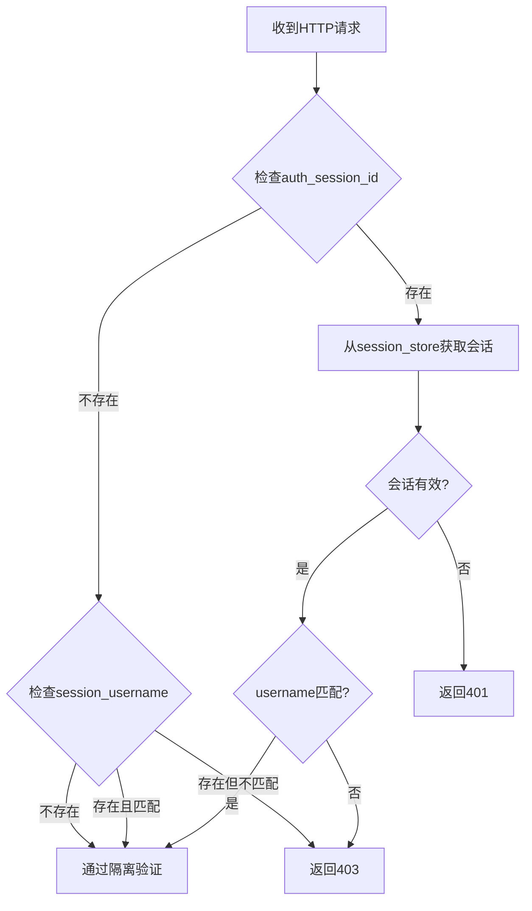
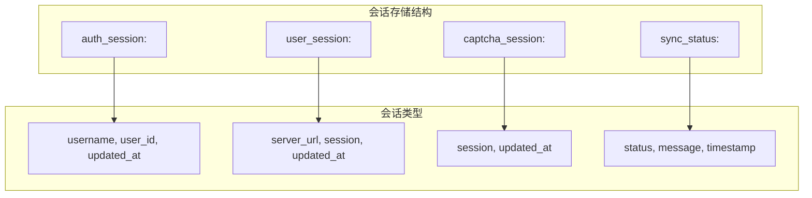
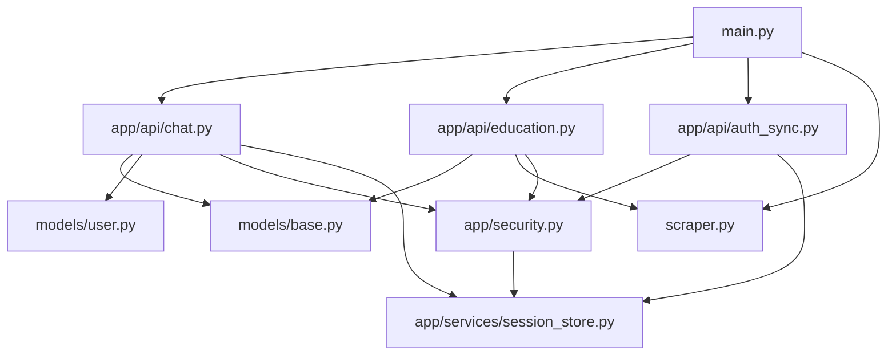

# 安全加固

<cite>
**本文引用的文件**   
- [backend/main.py](file://backend/main.py)
- [backend/app/api/chat.py](file://backend/app/api/chat.py)
- [backend/app/api/education.py](file://backend/app/api/education.py)
- [backend/app/api/auth_sync.py](file://backend/app/api/auth_sync.py)
- [backend/scraper.py](file://backend/scraper.py)
- [backend/Dockerfile](file://backend/Dockerfile)
- [frontend/Dockerfile](file://frontend/Dockerfile)
- [frontend/nginx.conf](file://frontend/nginx.conf)
- [docker-compose.yml](file://docker-compose.yml)
- [backend/app/models/base.py](file://backend/app/models/base.py)
- [backend/app/models/user.py](file://backend/app/models/user.py)
- [frontend/src/app/layout.tsx](file://frontend/src/app/layout.tsx)
- [frontend/src/app/login/page.tsx](file://frontend/src/app/login/page.tsx)
- [src/app/page.tsx](file://src/app/page.tsx)
- [backend/test_login.py](file://backend/test_login.py)
- [backend/test_scraper.py](file://backend/test_scraper.py)
- [src/server.ts](file://src/server.ts)
- [backend/app/security.py](file://backend/app/security.py)
- [backend/app/services/session_store.py](file://backend/app/services/session_store.py)
- [backend/tests/test_security_isolation.py](file://backend/tests/test_security_isolation.py)
- [backend/tests/test_session_store_singleton.py](file://backend/tests/test_session_store_singleton.py)
</cite>

## 更新摘要
**所做变更**   
- 新增用户名隔离系统章节，详细说明基于会话的用户数据访问控制
- 新增服务器端认证会话绑定章节，介绍auth_session_id的安全机制
- 更新会话存储服务章节，涵盖Redis内存双存储模式
- 在多个API端点中集成新的安全验证机制
- 新增安全测试章节，包含用户名隔离和会话存储的单元测试

## 目录
1. [简介](#简介)
2. [项目结构](#项目结构)
3. [核心组件](#核心组件)
4. [架构总览](#架构总览)
5. [详细组件分析](#详细组件分析)
6. [依赖分析](#依赖分析)
7. [性能考虑](#性能考虑)
8. [故障排查指南](#故障排查指南)
9. [结论](#结论)
10. [附录](#附录)

## 简介
本文件面向"智能教务系统AI助手"项目，提供一套系统化的安全加固方案。内容覆盖网络安全配置（防火墙与端口管理）、身份认证与授权（JWT与会话安全）、数据保护（传输与存储）、应用安全（输入校验、注入防护、XSS防护）、容器安全（镜像扫描、权限最小化、安全上下文）以及安全审计与漏洞评估方法。文档以仓库现有实现为基础，结合最佳实践提出改进建议，并通过图示帮助读者快速理解系统安全现状与加固路径。

**更新** 本次更新重点反映了应用变更：新增用户名隔离系统和服务器端认证会话绑定，增强了用户数据访问控制和会话安全性。

## 项目结构
项目采用前后端分离与容器编排架构：
- 后端：FastAPI 应用，提供教务数据爬取与AI对话能力，使用 PostgreSQL、Redis、Milvus、MinIO、Etcd 等服务。
- 前端：Next.js 应用，通过 Nginx 反向代理访问后端 API。
- 容器编排：docker-compose 统一管理服务生命周期与网络。

```mermaid
graph TB
subgraph "前端"
FE_NGINX["Nginx(3000)"]
FE_APP["Next.js 应用"]
end
subgraph "后端"
BE_API["FastAPI(8000)"]
BE_CHAT["对话API"]
BE_EDU["教育系统API"]
BE_AUTH["认证同步API"]
END
subgraph "数据与中间件"
PG["PostgreSQL"]
REDIS["Redis"]
MILVUS["Milvus"]
MINIO["MinIO"]
ETCD["Etcd"]
END
FE_APP --> FE_NGINX
FE_NGINX --> BE_API
BE_API --> BE_CHAT
BE_API --> BE_EDU
BE_API --> BE_AUTH
BE_API --> PG
BE_API --> REDIS
BE_API --> MILVUS
BE_API --> MINIO
BE_API --> ETCD
```

**图表来源**
- [docker-compose.yml:1-148](file://docker-compose.yml#L1-L148)
- [frontend/nginx.conf:1-31](file://frontend/nginx.conf#L1-L31)
- [backend/Dockerfile:1-18](file://backend/Dockerfile#L1-L18)
- [frontend/Dockerfile:1-33](file://frontend/Dockerfile#L1-L33)

**章节来源**
- [docker-compose.yml:1-148](file://docker-compose.yml#L1-L148)
- [frontend/nginx.conf:1-31](file://frontend/nginx.conf#L1-L31)
- [backend/Dockerfile:1-18](file://backend/Dockerfile#L1-L18)
- [frontend/Dockerfile:1-33](file://frontend/Dockerfile#L1-L33)

## 核心组件
- 身份认证与会话
  - 后端提供验证码与登录接口，使用基于 Cookie 的会话存储于内存字典，未持久化与跨节点共享。
  - 前端登录页调用后端验证码与登录接口，本地存储用户信息（当前未使用 JWT）。
  - **新增** 服务器端认证会话绑定，使用auth_session_id进行强绑定验证。
- 用户名隔离系统
  - **新增** enforce_username_isolation函数实现严格的用户名隔离，防止会话劫持和数据越权访问。
  - 支持auth_session_id和session_username双重校验机制。
- 教务系统爬取
  - 爬虫模块封装对教务系统的验证码、登录、个人信息、成绩、课表等接口调用，部分接口明文传输密码。
- 对话与RAG
  - 对话API支持基于向量检索的RAG问答，涉及数据库与向量存储。
- 容器与网络
  - 后端容器暴露 8000 端口，前端容器暴露 3000 端口；Nginx 作为反向代理转发 /api 请求至后端。

**章节来源**
- [backend/main.py:135-328](file://backend/main.py#L135-L328)
- [backend/scraper.py:13-60](file://backend/scraper.py#L13-L60)
- [backend/app/api/chat.py:45-153](file://backend/app/api/chat.py#L45-L153)
- [frontend/src/app/login/page.tsx:1-41](file://frontend/src/app/login/page.tsx#L1-L41)
- [frontend/nginx.conf:12-23](file://frontend/nginx.conf#L12-L23)
- [backend/app/security.py:1-26](file://backend/app/security.py#L1-L26)
- [backend/app/services/session_store.py:1-200](file://backend/app/services/session_store.py#L1-L200)

## 架构总览
下图展示从前端到后端、再到外部教务系统与内部中间件的整体交互链路，标注了潜在风险点与加固建议落点。



**图表来源**
- [backend/main.py:135-328](file://backend/main.py#L135-L328)
- [backend/scraper.py:33-60](file://backend/scraper.py#L33-L60)
- [frontend/src/app/login/page.tsx:20-36](file://frontend/src/app/login/page.tsx#L20-L36)
- [backend/app/security.py:4-26](file://backend/app/security.py#L4-L26)
- [backend/app/services/session_store.py:171-187](file://backend/app/services/session_store.py#L171-L187)

**章节来源**
- [backend/main.py:135-328](file://backend/main.py#L135-L328)
- [backend/scraper.py:33-60](file://backend/scraper.py#L33-L60)
- [frontend/src/app/login/page.tsx:20-36](file://frontend/src/app/login/page.tsx#L20-L36)

## 详细组件分析

### 网络安全与端口管理
- 端口暴露
  - 后端容器暴露 8000；前端容器暴露 3000；Nginx 反向代理 3000 端口。
- CORS 配置
  - 后端当前允许任意来源（开发环境），生产需限制为可信域名。
- 反向代理
  - Nginx 设置了必要的头部透传，但未启用 HTTPS 终止与 HSTS。
- 建议
  - 生产环境固定 CORS 源，启用 HTTPS 终止与 HSTS，限制入站流量仅开放必要端口，使用 WAF/防火墙策略。

**章节来源**
- [backend/main.py:41-48](file://backend/main.py#L41-L48)
- [frontend/nginx.conf:1-31](file://frontend/nginx.conf#L1-L31)
- [backend/Dockerfile:13-14](file://backend/Dockerfile#L13-L14)
- [frontend/Dockerfile:28-29](file://frontend/Dockerfile#L28-L29)

### 用户名隔离系统
**新增** 本系统实现了严格的用户名隔离机制，防止会话劫持和跨用户数据访问。

- 隔离机制
  - 优先使用auth_session_id进行服务端会话强校验
  - 兼容旧的session_username cookie校验机制
  - 当auth_session_id存在且有效时，必须与请求用户名完全匹配
  - 支持会话过期检测和无效会话处理

- 校验流程
  1. 检查请求中的auth_session_id cookie
  2. 从应用状态获取session_store实例
  3. 查询auth_session_id对应的会话信息
  4. 验证会话中的username与请求username一致
  5. 如验证失败，返回403或401错误

- 兼容性设计
  - 旧版客户端仍可通过session_username cookie进行最小化校验
  - 新版客户端应使用auth_session_id进行强绑定验证
  - 未登录状态下允许访问公共接口



**图表来源**
- [backend/app/security.py:4-26](file://backend/app/security.py#L4-L26)

**章节来源**
- [backend/app/security.py:1-26](file://backend/app/security.py#L1-L26)
- [backend/tests/test_security_isolation.py:1-57](file://backend/tests/test_security_isolation.py#L1-L57)

### 服务器端认证会话绑定
**新增** 系统引入了基于auth_session_id的服务器端认证会话绑定机制，提供更强的安全保障。

- 会话创建
  - 登录成功后生成随机的auth_session_id
  - 将username和user_id绑定存储到会话存储中
  - 设置会话过期时间（默认24小时）
  - 通过HTTP-only cookie发送给客户端

- 会话存储
  - 支持Redis持久化存储（生产环境推荐）
  - 内存存储作为降级方案
  - 同时维护user_session、auth_session、captcha_session、sync_status四种会话类型

- 安全特性
  - 会话ID随机生成，长度32字节
  - HTTP-only cookie防止XSS窃取
  - 会话过期自动清理
  - 支持会话列表查询和管理



**图表来源**
- [backend/app/services/session_store.py:25-200](file://backend/app/services/session_store.py#L25-L200)

**章节来源**
- [backend/app/api/auth_sync.py:171-201](file://backend/app/api/auth_sync.py#L171-L201)
- [backend/app/services/session_store.py:171-187](file://backend/app/services/session_store.py#L171-L187)

### 会话存储服务
**更新** 会话存储服务现在支持Redis持久化和内存降级两种模式。

- 存储架构
  - Redis可用时：使用Redis进行持久化存储
  - Redis不可用时：自动降级到内存存储
  - 支持进程级单例模式，避免循环依赖问题

- 会话类型
  - user_session: 用户登录会话，包含JSESSIONID和服务器URL
  - auth_session: 认证会话，绑定username和user_id
  - captcha_session: 验证码会话，临时存储验证码相关会话
  - sync_status: 数据同步状态，跟踪用户数据同步进度

- 键空间设计
  - user_session:<username>
  - auth_session:<auth_session_id>
  - captcha_session:<captcha_session_id>
  - sync_status:<username>

**章节来源**
- [backend/app/services/session_store.py:1-200](file://backend/app/services/session_store.py#L1-L200)
- [backend/tests/test_session_store_singleton.py:1-28](file://backend/tests/test_session_store_singleton.py#L1-L28)

### 身份认证与授权机制
- 现状
  - 登录成功后签发auth_session_id和session_username两个Cookie。
  - 会话存储在Redis或内存中，支持持久化与过期清理。
  - 前端本地存储用户信息，实现安全令牌管理。
  - 教育系统登录接口明文传输密码。
- 建议
  - 引入JWT（HS256/HMAC 或 RS256/RSA），设置合理过期时间与刷新策略。
  - 会话存储迁移至 Redis，开启持久化与过期清理。
  - 对教育系统登录接口增加密码加密存储与传输加密（TLS）。
  - 实施强密码策略与登录失败次数限制。

**章节来源**
- [backend/main.py:192-328](file://backend/main.py#L192-L328)
- [backend/scraper.py:33-60](file://backend/scraper.py#L33-L60)
- [frontend/src/app/login/page.tsx:48-82](file://frontend/src/app/login/page.tsx#L48-L82)

### 数据保护
- 传输安全
  - 教务系统登录使用明文 HTTP，存在密码泄露风险。
- 存储安全
  - 用户凭据与会话未加密存储；数据库连接字符串通过环境变量注入。
- 建议
  - 强制 TLS 传输（HTTPS），对教育系统接口使用受信证书校验。
  - 对数据库连接使用 SSL/TLS；对敏感字段（如教育密码）采用对称加密存储。
  - 启用数据库审计与访问控制。

**章节来源**
- [backend/scraper.py:33-60](file://backend/scraper.py#L33-L60)
- [backend/app/models/base.py:10-14](file://backend/app/models/base.py#L10-L14)

### 应用安全防护
- 输入验证与参数校验
  - 登录接口对必填参数进行简单校验，建议引入更严格的参数过滤与白名单校验。
  - **新增** 所有API端点都集成了enforce_username_isolation验证。
- SQL 注入防护
  - 使用 ORM/SQLAlchemy，避免原生 SQL 拼接；对动态查询参数进行白名单与范围校验。
- XSS 防护
  - 前端 Next.js 默认具备一定 XSS 防护；建议统一 CSP 策略与 Content-Security-Policy。
- 建议
  - 引入速率限制（Rate Limit）与 WAF。
  - 对所有外部接口调用增加超时与重试策略，防止 SSRF。

**章节来源**
- [backend/main.py:198-207](file://backend/main.py#L198-L207)
- [backend/app/api/chat.py:46-153](file://backend/app/api/chat.py#L46-L153)
- [backend/app/api/education.py:15-200](file://backend/app/api/education.py#L15-L200)

### 容器安全最佳实践
- 镜像与运行
  - 后端使用 slim 基础镜像，建议启用只读根文件系统与最小权限用户。
  - 前端使用 Nginx 镜像，建议固定镜像版本与启用镜像完整性校验。
- 环境变量与密钥
  - docker-compose 中存在默认密钥（JWT_SECRET_KEY），需替换为强随机值并纳入密管。
- 健康检查与网络
  - 各服务配置了健康检查，建议启用网络隔离与只允许必要服务间通信。
- 建议
  - 使用镜像扫描工具（如 Trivy/Snyk）定期扫描镜像漏洞。
  - 启用非 root 用户运行、禁用不必要的包与服务、最小化依赖树。

**章节来源**
- [docker-compose.yml:126-127](file://docker-compose.yml#L126-L127)
- [backend/Dockerfile:1-18](file://backend/Dockerfile#L1-L18)
- [frontend/Dockerfile:1-33](file://frontend/Dockerfile#L1-L33)

### 安全审计与漏洞评估
- 审计清单
  - 端口与服务暴露面核对、CORS 与安全头配置、TLS 证书有效性、密钥与环境变量管理、数据库访问控制。
  - 外部接口（教务系统）调用链路与证书校验。
  - **新增** 用户名隔离机制验证、会话存储安全审计。
- 漏洞评估方法
  - 自动化扫描：OWASP ZAP/ Burp Suite、Trivy、Nuclei。
  - 手工渗透：登录绕过、会话劫持、敏感信息泄露、SSRF。
  - 日志与告警：接入 SIEM，建立异常登录与高频请求告警。
- **新增** 安全测试
  - 单元测试覆盖用户名隔离验证逻辑
  - 会话存储服务的单例模式和回退机制测试

**章节来源**
- [backend/test_login.py:19-74](file://backend/test_login.py#L19-L74)
- [backend/test_scraper.py:1-280](file://backend/test_scraper.py#L1-L280)
- [backend/tests/test_security_isolation.py:1-57](file://backend/tests/test_security_isolation.py#L1-L57)
- [backend/tests/test_session_store_singleton.py:1-28](file://backend/tests/test_session_store_singleton.py#L1-L28)

## 依赖分析
后端服务依赖关系如下：



**图表来源**
- [backend/main.py:27-33](file://backend/main.py#L27-L33)
- [backend/app/api/chat.py:11-14](file://backend/app/api/chat.py#L11-L14)
- [backend/app/api/education.py:8-11](file://backend/app/api/education.py#L8-L11)
- [backend/app/api/auth_sync.py:15-17](file://backend/app/api/auth_sync.py#L15-L17)
- [backend/app/security.py:1](file://backend/app/security.py#L1)
- [backend/app/services/session_store.py:1-200](file://backend/app/services/session_store.py#L1-L200)
- [backend/scraper.py:1-10](file://backend/scraper.py#L1-L10)
- [backend/app/models/base.py:1-29](file://backend/app/models/base.py#L1-L29)
- [backend/app/models/user.py:1-33](file://backend/app/models/user.py#L1-L33)

**章节来源**
- [backend/main.py:27-33](file://backend/main.py#L27-L33)
- [backend/app/api/chat.py:11-14](file://backend/app/api/chat.py#L11-L14)
- [backend/app/api/education.py:8-11](file://backend/app/api/education.py#L8-L11)
- [backend/app/api/auth_sync.py:15-17](file://backend/app/api/auth_sync.py#L15-L17)
- [backend/app/security.py:1](file://backend/app/security.py#L1)
- [backend/app/services/session_store.py:1-200](file://backend/app/services/session_store.py#L1-L200)
- [backend/scraper.py:1-10](file://backend/scraper.py#L1-L10)
- [backend/app/models/base.py:1-29](file://backend/app/models/base.py#L1-L29)
- [backend/app/models/user.py:1-33](file://backend/app/models/user.py#L1-L33)

## 性能考虑
- 会话存储
  - 内存字典不适用于生产，建议迁移到 Redis 并启用持久化与过期策略。
  - **新增** 会话存储支持Redis和内存双模式，自动降级保证系统可用性。
- 爬取性能
  - 对外部教务系统接口增加并发限制与重试退避，避免触发风控。
- 缓存与CDN
  - 对静态资源与API响应结果进行缓存，减少后端压力。

## 故障排查指南
- 登录失败
  - 检查验证码会话是否过期、服务器选择逻辑、外部教务系统可达性。
- CORS 报错
  - 核对后端 CORS 配置与前端请求源。
- Nginx 反代异常
  - 检查 /api 路由转发、上游后端地址与健康状态。
- 容器启动失败
  - 检查环境变量、卷挂载与健康检查状态。
- **新增** 会话隔离失败
  - 检查auth_session_id cookie是否存在且有效
  - 验证session_store连接状态和Redis可用性
  - 确认用户名与会话中的username是否匹配

**章节来源**
- [backend/main.py:205-233](file://backend/main.py#L205-L233)
- [frontend/nginx.conf:12-23](file://frontend/nginx.conf#L12-L23)
- [docker-compose.yml:113-136](file://docker-compose.yml#L113-L136)

## 结论
当前实现满足基本功能，但在生产环境中存在显著安全短板：CORS 过宽、会话存储不安全、教育系统登录明文密码、容器密钥硬编码、缺少 HTTPS 终止与 WAF 等。**新增的用户名隔离系统和服务器端认证会话绑定机制**提供了重要的安全增强，但仍需立即实施以下改进：JWT 会话、TLS 强制、密钥管理、容器加固与自动化扫描，逐步完善审计与告警体系，确保系统在合规与安全前提下稳定运行。

## 附录
- 快速加固清单
  - 固定 CORS 源、启用 HTTPS 与 HSTS、强制 TLS 传输。
  - 引入 JWT 与 Redis 会话存储、强密码策略与登录风控。
  - 加密存储敏感数据、强化数据库访问控制。
  - 镜像扫描与密钥管理、最小权限运行、健康检查与网络隔离。
  - 增加速率限制、WAF 与日志审计。
  - **新增** 部署Redis会话存储、启用用户名隔离验证、加强会话安全配置。