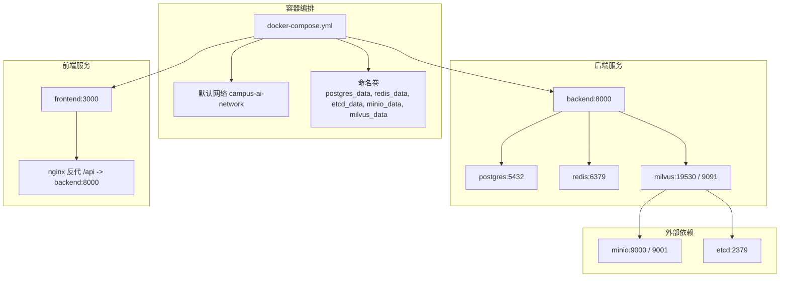
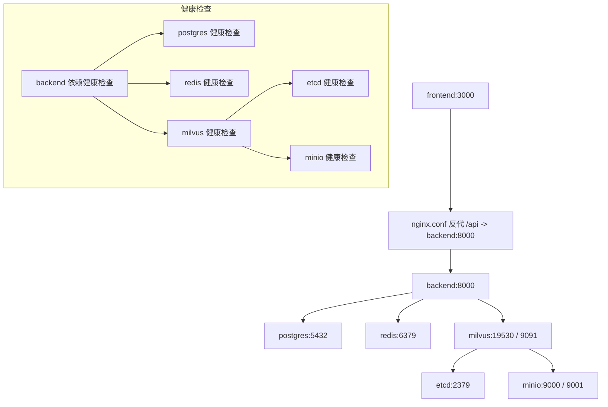
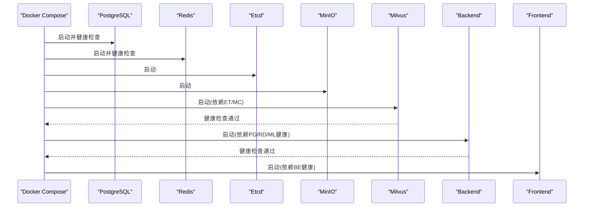

# 容器化部署

<cite>
**本文引用的文件**
- [docker-compose.yml](file://docker-compose.yml)
- [backend/Dockerfile](file://backend/Dockerfile)
- [frontend/Dockerfile](file://frontend/Dockerfile)
- [backend/requirements.txt](file://backend/requirements.txt)
- [package.json](file://package.json)
- [frontend/nginx.conf](file://frontend/nginx.conf)
- [scripts/build.sh](file://scripts/build.sh)
- [scripts/start.sh](file://scripts/start.sh)
- [scripts/prepare.sh](file://scripts/prepare.sh)
- [scripts/dev.sh](file://scripts/dev.sh)
- [.coze](file://.coze)
- [backend/main.py](file://backend/main.py)
</cite>

## 目录
1. [简介](#简介)
2. [项目结构](#项目结构)
3. [核心组件](#核心组件)
4. [架构总览](#架构总览)
5. [详细组件分析](#详细组件分析)
6. [依赖关系分析](#依赖关系分析)
7. [性能考量](#性能考量)
8. [故障排查指南](#故障排查指南)
9. [结论](#结论)
10. [附录](#附录)

## 简介
本文件面向智能教务系统AI助手的容器化部署，围绕Docker Compose编排配置进行深入说明，覆盖PostgreSQL、Redis、Etcd、MinIO、Milvus与应用服务（前端与后端）的容器定义、环境变量、数据卷挂载、网络设置、镜像构建流程、服务依赖顺序与健康检查机制，并给出生产环境最佳实践与安全配置建议。

## 项目结构
该仓库采用前后端分离的多阶段构建方式，通过Docker Compose统一编排数据库、缓存、对象存储、向量数据库与应用服务。Compose文件定义了默认网络、命名卷以及各服务的镜像来源、端口映射、健康检查与依赖关系；前端与后端分别在独立的Dockerfile中完成构建与运行。

图表来源
- [docker-compose.yml:1-148](file://docker-compose.yml#L1-L148)

章节来源
- [docker-compose.yml:1-148](file://docker-compose.yml#L1-L148)

## 核心组件
- PostgreSQL：持久化存储教务系统的业务数据，使用命名卷保障数据持久化，健康检查基于数据库就绪检测。
- Redis：会话与缓存存储，开启AOF持久化，健康检查通过CLI ping验证。
- Etcd：键值存储与分布式协调，配置压缩、配额与快照参数，健康检查通过etcdctl endpoint健康检查。
- MinIO：S3兼容的对象存储，提供控制台Web界面，健康检查通过本地存活探针。
- Milvus：向量数据库，作为独立模式运行，依赖Etcd与MinIO，健康检查通过内部健康探针。
- 后端服务（FastAPI/Uvicorn）：接收前端请求，连接数据库、缓存与向量库，暴露REST API。
- 前端服务（Next.js+Nginx）：构建产物由Nginx提供静态服务，反向代理/api到后端。

章节来源
- [docker-compose.yml:2-148](file://docker-compose.yml#L2-L148)
- [backend/Dockerfile:1-18](file://backend/Dockerfile#L1-L18)
- [frontend/Dockerfile:1-33](file://frontend/Dockerfile#L1-L33)

## 架构总览
下图展示容器间的依赖与通信路径，包括健康检查触发时机与数据流方向。

图表来源
- [docker-compose.yml:107-136](file://docker-compose.yml#L107-L136)
- [docker-compose.yml:14-18](file://docker-compose.yml#L14-L18)
- [docker-compose.yml:29-33](file://docker-compose.yml#L29-L33)
- [docker-compose.yml:88-92](file://docker-compose.yml#L88-L92)
- [docker-compose.yml:47-51](file://docker-compose.yml#L47-L51)
- [docker-compose.yml:66-70](file://docker-compose.yml#L66-L70)

## 详细组件分析

### PostgreSQL 组件
- 镜像与端口：使用官方Alpine镜像，映射5432端口。
- 数据持久化：通过命名卷postgres_data挂载至容器内数据库目录。
- 健康检查：基于命令行工具检测数据库是否就绪。
- 环境变量：用户名、密码、数据库名支持从环境变量注入，提供默认值。

章节来源
- [docker-compose.yml:2-18](file://docker-compose.yml#L2-L18)

### Redis 组件
- 镜像与端口：使用官方Alpine镜像，映射6379端口。
- 持久化：启用AOF持久化，数据写入容器内共享目录。
- 健康检查：通过CLI发送ping命令验证服务状态。
- 环境变量：无敏感配置，适合开发环境快速启动。

章节来源
- [docker-compose.yml:20-33](file://docker-compose.yml#L20-L33)

### Etcd 组件
- 镜像与端口：指定版本镜像，监听2379端口。
- 配置：设置自动压缩模式、保留修订数、后端配额、快照阈值等参数。
- 数据持久化：通过命名卷etcd_data保存数据目录。
- 健康检查：使用etcdctl endpoint健康检查命令。

章节来源
- [docker-compose.yml:35-51](file://docker-compose.yml#L35-L51)

### MinIO 组件
- 镜像与端口：使用指定版本镜像，映射9000与9001端口。
- 访问密钥：内置默认访问凭据，建议在生产环境替换。
- 数据持久化：通过命名卷minio_data挂载对象存储数据目录。
- 健康检查：对本地存活探针发起HTTP请求。

章节来源
- [docker-compose.yml:53-70](file://docker-compose.yml#L53-L70)

### Milvus 组件
- 镜像与端口：使用指定版本镜像，以独立模式运行，映射19530与9091端口。
- 依赖：通过环境变量指向Etcd与MinIO地址。
- 数据持久化：通过命名卷milvus_data挂载数据目录。
- 健康检查：对内部健康探针发起HTTP请求。
- 依赖顺序：需等待Etcd与MinIO健康后再启动。

章节来源
- [docker-compose.yml:72-92](file://docker-compose.yml#L72-L92)

### 后端服务（FastAPI/Uvicorn）
- 构建：基于Python Slim镜像，复制依赖清单并安装，随后复制源码，暴露8000端口。
- 环境变量：包含数据库、缓存、向量库、AI模型、教育系统URL、JWT密钥与CORS来源等。
- 依赖健康检查：等待PostgreSQL、Redis、Milvus均健康后再启动。
- 端口映射：容器内8000映射至主机8000。

章节来源
- [backend/Dockerfile:1-18](file://backend/Dockerfile#L1-L18)
- [docker-compose.yml:107-136](file://docker-compose.yml#L107-L136)

### 前端服务（Next.js+Nginx）
- 构建：多阶段构建，第一阶段使用Node镜像安装依赖并构建，第二阶段使用Nginx镜像复制构建产物与Nginx配置。
- 运行：Nginx常驻进程提供静态资源服务，监听3000端口。
- 反向代理：Nginx将/api前缀转发至后端服务，同时传递必要的头部信息。
- 依赖：依赖后端服务健康后再启动。

章节来源
- [frontend/Dockerfile:1-33](file://frontend/Dockerfile#L1-L33)
- [frontend/nginx.conf:1-31](file://frontend/nginx.conf#L1-L31)
- [docker-compose.yml:94-106](file://docker-compose.yml#L94-L106)

### 镜像构建与脚本流程
- 准备脚本：安装前端依赖，冻结锁文件，离线优先，调试日志级别。
- 构建脚本：执行Next.js构建与服务端打包，输出至dist目录。
- 启动脚本：在部署时以Node运行dist/server.js，支持端口自定义。
- 开发脚本：清理占用端口后以热更新方式运行服务端。

章节来源
- [scripts/prepare.sh:1-10](file://scripts/prepare.sh#L1-L10)
- [scripts/build.sh:1-18](file://scripts/build.sh#L1-L18)
- [scripts/start.sh:1-18](file://scripts/start.sh#L1-L18)
- [scripts/dev.sh:1-35](file://scripts/dev.sh#L1-L35)
- [.coze:1-12](file://.coze#L1-L12)

## 依赖关系分析
- 服务启动顺序：Milvus依赖Etcd与MinIO；后端依赖PostgreSQL、Redis、Milvus；前端依赖后端。
- 健康检查：各服务均配置健康检查，Compose依据健康状态决定启动顺序与重试策略。
- 网络：所有服务位于同一默认网络，容器间可通过服务名互访。

图表来源
- [docker-compose.yml:107-136](file://docker-compose.yml#L107-L136)
- [docker-compose.yml:72-92](file://docker-compose.yml#L72-L92)
- [docker-compose.yml:20-33](file://docker-compose.yml#L20-L33)
- [docker-compose.yml:35-51](file://docker-compose.yml#L35-L51)
- [docker-compose.yml:53-70](file://docker-compose.yml#L53-L70)

## 性能考量
- 多阶段构建：前端与后端均采用多阶段构建，减少最终镜像体积，提升拉取与启动效率。
- 健康检查间隔与超时：合理设置检查间隔与超时，避免频繁重启或误判。
- 数据卷与持久化：为数据库、缓存、对象存储与向量库配置命名卷，确保数据不丢失且可备份。
- 端口与网络：仅暴露必要端口，使用默认网络简化容器间通信。
- 依赖顺序：通过健康检查与depends_on条件，确保上游服务稳定后再启动下游服务。

章节来源
- [frontend/Dockerfile:1-33](file://frontend/Dockerfile#L1-L33)
- [backend/Dockerfile:1-18](file://backend/Dockerfile#L1-L18)
- [docker-compose.yml:107-136](file://docker-compose.yml#L107-L136)

## 故障排查指南
- 健康检查失败
  - PostgreSQL：确认数据库初始化完成与用户权限配置正确。
  - Redis：确认AOF持久化目录可写，内存与配置合理。
  - Etcd：检查压缩与配额参数，确保磁盘空间充足。
  - MinIO：确认访问密钥与数据目录挂载正确，控制台端口开放。
  - Milvus：检查Etcd与MinIO连通性，确认数据目录挂载与端口映射。
  - 后端：检查数据库、缓存与向量库的连接字符串与凭证，确认CORS与JWT配置。
- 端口冲突
  - 使用脚本清理占用端口或调整映射端口。
- 前后端联调
  - 确认Nginx反向代理配置正确，/api路径转发到后端8000端口。
- 日志定位
  - 通过Docker日志查看容器标准输出与错误输出，结合健康检查状态判断问题根因。

章节来源
- [docker-compose.yml:14-18](file://docker-compose.yml#L14-L18)
- [docker-compose.yml:29-33](file://docker-compose.yml#L29-L33)
- [docker-compose.yml:47-51](file://docker-compose.yml#L47-L51)
- [docker-compose.yml:66-70](file://docker-compose.yml#L66-L70)
- [docker-compose.yml:88-92](file://docker-compose.yml#L88-L92)
- [frontend/nginx.conf:12-23](file://frontend/nginx.conf#L12-L23)
- [scripts/dev.sh:12-28](file://scripts/dev.sh#L12-L28)

## 结论
本容器化方案通过Docker Compose将数据库、缓存、对象存储、向量数据库与应用服务整合在同一网络中，利用健康检查与依赖顺序保证启动稳定性。多阶段构建优化镜像体积，命名卷保障数据持久化。建议在生产环境中强化安全配置与监控告警，以满足高可用与合规要求。

## 附录

### 部署命令与启动流程
- 启动编排：使用Compose启动全部服务，按健康检查与依赖顺序自动排序。
- 停止与清理：停止并移除容器、网络与命名卷，确保环境干净。
- 日志查看：查看各服务容器的标准输出与错误输出，定位问题。

章节来源
- [docker-compose.yml:1-148](file://docker-compose.yml#L1-L148)

### 环境变量与配置要点
- 后端关键变量
  - 数据库：主机、端口、用户名、密码、数据库名
  - 缓存：主机、端口
  - 向量库：主机、端口
  - AI模型：API密钥、模型名称
  - 教务系统：目标站点URL
  - 安全：JWT密钥、CORS来源
- 前端关键变量
  - API基础路径：NEXT_PUBLIC_API_URL

章节来源
- [docker-compose.yml:113-127](file://docker-compose.yml#L113-L127)
- [frontend/nginx.conf:13-23](file://frontend/nginx.conf#L13-L23)

### 生产环境最佳实践与安全配置建议
- 凭据管理
  - 替换MinIO默认访问密钥与密码，使用强口令与定期轮换。
  - 设置JWT密钥与数据库凭据为安全的随机值，避免硬编码。
- 网络与访问控制
  - 仅暴露必要端口，使用防火墙限制外部访问。
  - 在反向代理层启用TLS终止与速率限制。
- 数据安全
  - 对数据卷与备份策略进行定期审计，确保恢复能力。
  - 对日志与敏感字段脱敏，避免泄露。
- 监控与告警
  - 配置健康检查与容器指标采集，建立异常告警。
  - 对关键服务（数据库、缓存、向量库）增加专用监控面板。
- 版本与升级
  - 固定镜像版本，制定滚动升级与回滚策略。
  - 升级前进行灰度验证与数据迁移演练。